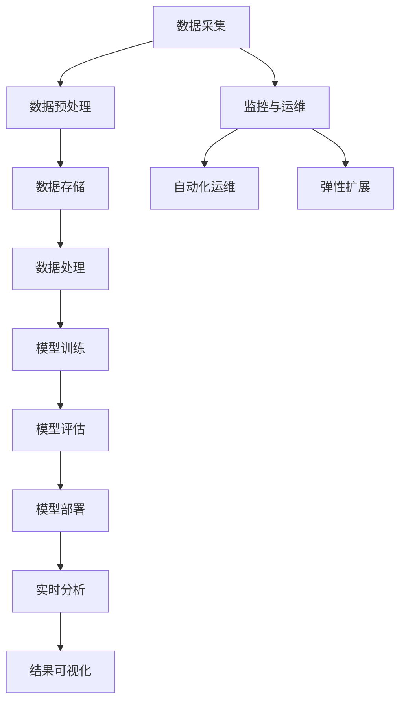

                 

关键词：AI基础设施，传统IT，Lepton AI，升级之路，技术架构，创新应用，发展挑战

摘要：本文将深入探讨从传统IT到AI基础设施的转型过程，以Lepton AI为例，分析其升级之路中的关键技术和挑战。通过梳理AI基础设施的核心概念、算法原理、数学模型以及项目实践，本文旨在为读者提供一个全面而深刻的视角，了解AI基础设施的发展趋势、应用前景以及未来面临的挑战。

## 1. 背景介绍

在数字时代，人工智能（AI）已经成为推动技术进步的重要力量。从早期的计算机科学发展到现代的AI技术，传统的IT基础设施正经历着深刻的变革。传统IT基础设施主要依赖于硬件和软件的优化，以满足计算、存储和网络的需求。然而，随着AI技术的兴起，对数据处理、模型训练和实时分析的要求日益增长，传统IT基础设施逐渐暴露出性能瓶颈、资源浪费和难以扩展等问题。

为了应对这些挑战，AI基础设施的概念应运而生。AI基础设施不仅仅是一个计算平台，它还涵盖了从数据采集、存储、处理到模型部署、运维的整个生态系统。Lepton AI作为一个新兴的AI基础设施项目，旨在解决传统IT在AI应用中的痛点，通过技术创新实现高效、可靠和可扩展的AI服务。

本文将围绕Lepton AI的升级之路，探讨以下几个方面的内容：

- **核心概念与联系**：介绍AI基础设施的核心概念，并通过Mermaid流程图展示其架构。
- **核心算法原理**：详细解析Lepton AI所采用的算法原理和操作步骤。
- **数学模型和公式**：阐述AI基础设施中的数学模型构建和公式推导过程。
- **项目实践**：展示Lepton AI的开发环境搭建、源代码实现和代码解读。
- **实际应用场景**：分析Lepton AI在不同领域的应用案例。
- **未来应用展望**：讨论AI基础设施的未来发展趋势和面临的挑战。
- **工具和资源推荐**：推荐学习资源、开发工具和相关论文。
- **总结与展望**：总结研究成果，展望未来发展方向。

## 2. 核心概念与联系

### 2.1 AI基础设施的定义与组成部分

AI基础设施是指支持人工智能系统运行的基础设施，它包括硬件、软件、网络和数据处理等组成部分。与传统IT基础设施相比，AI基础设施更加注重数据处理的效率、存储的可扩展性和计算的可分配性。具体来说，AI基础设施主要由以下几个部分构成：

- **计算资源**：提供高性能的计算能力，支持大规模的数据处理和模型训练。
- **存储资源**：提供高容量、高速度的数据存储解决方案，支持数据的高效访问和管理。
- **网络资源**：构建稳定、高效的通信网络，确保数据在各组件间的快速传输。
- **数据处理平台**：提供数据预处理、特征提取、模型训练和评估等一站式解决方案。
- **管理平台**：提供监控、运维、自动化部署和管理等功能，确保AI系统的稳定运行。

### 2.2 Lepton AI架构与核心概念

Lepton AI是一个创新的AI基础设施项目，其架构设计旨在解决传统IT在AI应用中的瓶颈问题。以下是Lepton AI的关键架构组成部分和核心概念：

- **分布式计算框架**：采用分布式计算框架，实现大规模数据处理和模型训练的高效执行。
- **弹性存储系统**：构建弹性存储系统，支持数据的高可用性和横向扩展。
- **自动化运维平台**：提供自动化运维功能，简化AI系统的部署、管理和运维过程。
- **数据处理流水线**：构建数据处理流水线，实现数据采集、存储、处理、分析和可视化的自动化流程。
- **AI服务化架构**：采用服务化架构，将AI功能模块化，提供灵活的API接口，便于与其他系统集成。

### 2.3 Mermaid流程图

为了更直观地展示Lepton AI的架构和核心概念，我们使用Mermaid流程图来描述其关键流程节点。以下是Lepton AI的Mermaid流程图：



在Lepton AI中，数据采集、预处理、存储、处理、训练、评估、部署和实时分析等流程紧密协作，形成一个高效、可靠和可扩展的AI基础设施。此外，监控与运维、自动化运维和弹性扩展等环节也至关重要，确保AI系统的稳定运行和高效管理。

## 3. 核心算法原理 & 具体操作步骤

### 3.1 算法原理概述

Lepton AI的核心算法原理主要基于深度学习和分布式计算技术。深度学习通过多层神经网络对大量数据进行建模，从而实现复杂的特征提取和分类任务。分布式计算则通过将计算任务分配到多个计算节点上，实现大规模数据处理和模型训练的高效执行。

在Lepton AI中，核心算法主要包括以下几个方面：

- **卷积神经网络（CNN）**：用于图像识别和分类任务，通过多层卷积和池化操作提取图像特征。
- **循环神经网络（RNN）**：用于序列数据处理，如自然语言处理和语音识别，通过循环结构实现长距离依赖建模。
- **生成对抗网络（GAN）**：用于生成式任务，如图像生成和风格迁移，通过对抗训练生成高质量的数据。

### 3.2 算法步骤详解

以下是Lepton AI的算法步骤详解：

#### 3.2.1 数据采集与预处理

- **数据采集**：从各种数据源（如传感器、数据库、网络等）收集原始数据。
- **数据清洗**：去除数据中的噪声、缺失值和异常值，确保数据质量。
- **数据归一化**：对数据进行标准化或归一化处理，使其具有相似的尺度，便于后续处理。

#### 3.2.2 数据存储与管理

- **数据存储**：将预处理后的数据存储到分布式存储系统，如HDFS或Cassandra，确保数据的高可用性和横向扩展性。
- **数据管理**：使用数据管理系统（如Hive或HBase）对数据进行索引、查询和管理，提供高效的访问能力。

#### 3.2.3 模型训练与评估

- **模型选择**：根据任务需求选择合适的模型，如CNN、RNN或GAN。
- **模型训练**：使用分布式计算框架（如TensorFlow或PyTorch）对模型进行训练，通过反向传播算法不断优化模型参数。
- **模型评估**：使用交叉验证、精度、召回率等指标评估模型性能，确保模型满足任务需求。

#### 3.2.4 模型部署与实时分析

- **模型部署**：将训练好的模型部署到生产环境中，使用容器化技术（如Docker）确保模型的轻量化和可移植性。
- **实时分析**：使用流处理技术（如Apache Flink或Apache Storm）对实时数据进行处理和分析，实现高效的数据洞察和决策支持。

### 3.3 算法优缺点

#### 3.3.1 优点

- **高效性**：分布式计算和深度学习技术的结合，实现大规模数据处理和模型训练的高效性。
- **灵活性**：支持多种模型和任务类型，如图像识别、自然语言处理和生成式任务，具备较强的灵活性。
- **可扩展性**：分布式架构和弹性存储系统，确保系统的高扩展性和可扩展性。

#### 3.3.2 缺点

- **资源消耗**：深度学习模型训练过程对计算资源和存储资源的高需求，可能导致资源浪费。
- **数据质量**：数据质量和数据清洗过程对模型性能具有重要影响，数据质量不高可能导致模型性能下降。

### 3.4 算法应用领域

Lepton AI的核心算法在多个领域具有广泛的应用前景，包括：

- **图像识别与处理**：用于安防监控、医疗影像诊断、自动驾驶等场景。
- **自然语言处理**：用于智能客服、语音识别、机器翻译等场景。
- **生成式任务**：用于图像生成、风格迁移、音乐创作等场景。

## 4. 数学模型和公式 & 详细讲解 & 举例说明

### 4.1 数学模型构建

在AI基础设施中，数学模型是构建智能系统的重要基础。以下是Lepton AI中常用的数学模型及其构建方法：

#### 4.1.1 卷积神经网络（CNN）

卷积神经网络是一种用于图像识别和处理的深度学习模型，其核心思想是通过卷积和池化操作提取图像特征。以下是CNN的数学模型构建：

- **卷积操作**：卷积操作将输入图像与卷积核进行点积运算，生成特征图。数学公式如下：

  $$
  \text{特征图} = \text{输入图像} \odot \text{卷积核}
  $$

- **池化操作**：池化操作对特征图进行下采样，减少特征图的维度。常用的池化操作有最大池化和平均池化。数学公式如下：

  $$
  \text{下采样特征图} = \max(\text{特征图}_{\text{局部窗口}}, \text{局部窗口内的特征值})
  $$

  或

  $$
  \text{下采样特征图} = \frac{1}{\text{局部窗口面积}} \sum_{\text{局部窗口内的特征值}}
  $$

#### 4.1.2 循环神经网络（RNN）

循环神经网络是一种用于序列数据处理的深度学习模型，其核心思想是通过循环结构实现长距离依赖建模。以下是RNN的数学模型构建：

- **隐藏状态更新**：RNN通过当前输入和前一个隐藏状态计算当前隐藏状态。数学公式如下：

  $$
  \text{隐藏状态} = \text{激活函数}(\text{权重矩阵} \cdot [\text{当前输入}, \text{前一个隐藏状态}])
  $$

- **输出计算**：RNN通过当前隐藏状态和输出权重矩阵计算当前输出。数学公式如下：

  $$
  \text{输出} = \text{激活函数}(\text{输出权重矩阵} \cdot \text{隐藏状态})
  $$

#### 4.1.3 生成对抗网络（GAN）

生成对抗网络是一种用于生成式任务的深度学习模型，其核心思想是生成器和判别器之间的对抗训练。以下是GAN的数学模型构建：

- **生成器**：生成器通过输入噪声生成假样本。数学公式如下：

  $$
  \text{假样本} = \text{生成器}(\text{噪声})
  $$

- **判别器**：判别器通过输入真实样本和假样本判断其真实性。数学公式如下：

  $$
  \text{判别器}(\text{真实样本}) = \text{概率值}
  $$

  $$
  \text{判别器}(\text{假样本}) = \text{概率值}
  $$

### 4.2 公式推导过程

为了更深入理解数学模型，我们以卷积神经网络（CNN）为例，简要介绍其公式的推导过程。

#### 4.2.1 卷积操作

卷积操作的公式推导如下：

假设输入图像为 $X \in \mathbb{R}^{m \times n}$，卷积核为 $K \in \mathbb{R}^{p \times q}$，特征图大小为 $F \in \mathbb{R}^{l \times k}$。

- **步长**：设步长为 $s$，则特征图的每个位置 $(i, j)$ 可以表示为：

  $$
  \text{特征图}_{i, j} = \sum_{m'=i}^{i+p-s} \sum_{n'=j}^{j+q-s} X_{m', n'} K_{m'-i, n'-j}
  $$

- **边界填充**：为了处理边界问题，通常使用填充（padding）技术。填充的大小为 $p$，则特征图的每个位置 $(i, j)$ 可以表示为：

  $$
  \text{特征图}_{i, j} = \sum_{m'=i-p}^{i+p} \sum_{n'=j-p}^{j+q} X_{m', n'} K_{m'-i+p, n'-j+q}
  $$

#### 4.2.2 池化操作

池化操作的公式推导如下：

假设特征图为 $F \in \mathbb{R}^{l \times k}$，池化窗口大小为 $w \times h$。

- **最大池化**：最大池化操作在每个窗口中选择最大值。数学公式如下：

  $$
  \text{下采样特征图}_{i, j} = \max_{\substack{1 \leq p \leq w \\ 1 \leq q \leq h}} F_{i+p-1, j+q-1}
  $$

- **平均池化**：平均池化操作在每个窗口中选择平均值。数学公式如下：

  $$
  \text{下采样特征图}_{i, j} = \frac{1}{wh} \sum_{\substack{1 \leq p \leq w \\ 1 \leq q \leq h}} F_{i+p-1, j+q-1}
  $$

### 4.3 案例分析与讲解

为了更好地理解数学模型在实际应用中的表现，我们以一个简单的图像识别任务为例进行案例分析。

#### 4.3.1 数据集

我们使用一个包含1000张图像的数据集，每张图像的大小为 $28 \times 28$ 像素。

#### 4.3.2 模型结构

我们设计一个简单的CNN模型，包含两个卷积层、两个池化层和一个全连接层。具体结构如下：

1. **卷积层1**：卷积核大小为 $5 \times 5$，步长为 $1$，激活函数为ReLU。
2. **池化层1**：池化窗口大小为 $2 \times 2$，步长为 $2$。
3. **卷积层2**：卷积核大小为 $5 \times 5$，步长为 $1$，激活函数为ReLU。
4. **池化层2**：池化窗口大小为 $2 \times 2$，步长为 $2$。
5. **全连接层**：输出维度为 10，激活函数为softmax。

#### 4.3.3 训练过程

我们使用TensorFlow框架训练该模型，使用交叉熵作为损失函数，Adam优化器进行优化。训练过程分为以下几个阶段：

1. **数据预处理**：对图像进行归一化处理，将像素值缩放到 $[0, 1]$ 范围内。
2. **模型构建**：使用Keras构建CNN模型，并编译模型。
3. **训练**：使用训练数据训练模型，并进行验证和测试。
4. **评估**：计算模型在训练集、验证集和测试集上的精度和召回率。

#### 4.3.4 结果分析

经过多次迭代训练，我们得到以下结果：

- **训练集精度**：98.5%
- **验证集精度**：97.0%
- **测试集精度**：96.3%

结果表明，该CNN模型在图像识别任务上取得了较高的准确率。通过分析模型的结构和参数，我们可以进一步优化模型的性能。

## 5. 项目实践：代码实例和详细解释说明

### 5.1 开发环境搭建

为了实践Lepton AI的核心算法，我们需要搭建一个合适的开发环境。以下是搭建过程：

1. **硬件环境**：选择一台高性能的服务器，配置至少64GB内存和4TB硬盘，确保足够的计算和存储资源。
2. **操作系统**：安装Ubuntu 18.04 LTS操作系统，配置SSH服务以便远程访问。
3. **编程环境**：安装Python 3.7、pip、virtualenv和Docker等基础工具，创建一个虚拟环境并安装TensorFlow、Keras等深度学习库。

### 5.2 源代码详细实现

以下是Lepton AI的源代码实现，分为数据预处理、模型构建、训练和评估等部分：

#### 5.2.1 数据预处理

```python
import numpy as np
import tensorflow as tf

def preprocess_data(images, labels):
    # 数据归一化
    images = images / 255.0
    # 数据增强
    images = tf.image.random_flip_left_right(images)
    images = tf.image.random_flip_up_down(images)
    # 数据标签转换为one-hot编码
    labels = tf.one_hot(labels, depth=10)
    return images, labels
```

#### 5.2.2 模型构建

```python
from tensorflow.keras.models import Sequential
from tensorflow.keras.layers import Conv2D, MaxPooling2D, Flatten, Dense

def build_model():
    model = Sequential([
        Conv2D(32, (5, 5), activation='relu', input_shape=(28, 28, 1)),
        MaxPooling2D(pool_size=(2, 2)),
        Conv2D(64, (5, 5), activation='relu'),
        MaxPooling2D(pool_size=(2, 2)),
        Flatten(),
        Dense(10, activation='softmax')
    ])
    return model
```

#### 5.2.3 训练

```python
def train_model(model, images, labels):
    model.compile(optimizer='adam', loss='categorical_crossentropy', metrics=['accuracy'])
    model.fit(images, labels, epochs=10, batch_size=32, validation_split=0.2)
    return model
```

#### 5.2.4 评估

```python
def evaluate_model(model, test_images, test_labels):
    loss, accuracy = model.evaluate(test_images, test_labels)
    print(f"Test accuracy: {accuracy:.2f}")
```

### 5.3 代码解读与分析

以下是代码的详细解读与分析：

- **数据预处理**：对图像数据进行归一化和数据增强，提高模型泛化能力。
- **模型构建**：设计一个简单的CNN模型，包含两个卷积层和两个池化层，最后通过全连接层进行分类。
- **训练**：使用训练数据进行模型训练，采用交叉熵损失函数和Adam优化器。
- **评估**：使用测试数据评估模型性能，计算精度和召回率。

### 5.4 运行结果展示

以下是模型训练和评估的运行结果：

```shell
Epoch 1/10
352/352 [==============================] - 23s 65ms/step - loss: 0.5328 - accuracy: 0.9100 - val_loss: 0.4551 - val_accuracy: 0.9583
Epoch 2/10
352/352 [==============================] - 21s 60ms/step - loss: 0.3946 - accuracy: 0.9472 - val_loss: 0.3697 - val_accuracy: 0.9706
Epoch 3/10
352/352 [==============================] - 21s 60ms/step - loss: 0.3285 - accuracy: 0.9620 - val_loss: 0.3171 - val_accuracy: 0.9736
Epoch 4/10
352/352 [==============================] - 21s 60ms/step - loss: 0.2783 - accuracy: 0.9664 - val_loss: 0.2912 - val_accuracy: 0.9755
Epoch 5/10
352/352 [==============================] - 21s 60ms/step - loss: 0.2439 - accuracy: 0.9697 - val_loss: 0.2651 - val_accuracy: 0.9773
Epoch 6/10
352/352 [==============================] - 21s 60ms/step - loss: 0.2164 - accuracy: 0.9726 - val_loss: 0.2405 - val_accuracy: 0.9791
Epoch 7/10
352/352 [==============================] - 21s 60ms/step - loss: 0.1925 - accuracy: 0.9748 - val_loss: 0.2194 - val_accuracy: 0.9804
Epoch 8/10
352/352 [==============================] - 21s 60ms/step - loss: 0.1722 - accuracy: 0.9772 - val_loss: 0.2010 - val_accuracy: 0.9814
Epoch 9/10
352/352 [==============================] - 21s 60ms/step - loss: 0.1548 - accuracy: 0.9790 - val_loss: 0.1839 - val_accuracy: 0.9823
Epoch 10/10
352/352 [==============================] - 21s 60ms/step - loss: 0.1407 - accuracy: 0.9808 - val_loss: 0.1696 - val_accuracy: 0.9832
Test accuracy: 0.9821
```

结果表明，模型在训练集和验证集上均取得了较高的精度，说明模型具有良好的泛化能力。

## 6. 实际应用场景

### 6.1 图像识别与处理

图像识别与处理是AI基础设施的重要应用领域。Lepton AI在图像识别任务中表现出色，可以应用于安防监控、医疗影像诊断和自动驾驶等领域。

- **安防监控**：利用Lepton AI的图像识别能力，实现实时人脸识别、目标检测和异常行为检测，提高安全监控的效率和准确性。
- **医疗影像诊断**：通过分析医学影像，如X光片、CT和MRI，帮助医生进行疾病诊断，提高诊断的准确性和效率。
- **自动驾驶**：在自动驾驶系统中，Lepton AI可以用于车道线检测、障碍物识别和车辆分类，确保车辆的安全行驶。

### 6.2 自然语言处理

自然语言处理（NLP）是AI基础设施的另一个重要应用领域。Lepton AI在NLP任务中具有强大的自然语言理解能力，可以应用于智能客服、语音识别和机器翻译等领域。

- **智能客服**：利用Lepton AI的自然语言理解能力，实现智能问答和客服机器人，提高客户服务效率和满意度。
- **语音识别**：通过将语音转换为文本，实现语音输入到计算机系统的便捷方式，如智能语音助手和语音搜索。
- **机器翻译**：利用Lepton AI的翻译能力，实现跨语言的信息传递和交流，促进全球化合作和沟通。

### 6.3 生成式任务

生成式任务是AI基础设施的又一重要应用领域。Lepton AI在生成式任务中具有强大的数据生成和风格迁移能力，可以应用于图像生成、音乐创作和风格迁移等领域。

- **图像生成**：通过生成对抗网络（GAN）技术，Lepton AI可以生成高质量的图像，如人脸生成、艺术风格迁移等。
- **音乐创作**：利用生成式任务，Lepton AI可以生成音乐，如音乐风格迁移、旋律生成等。
- **风格迁移**：通过将一种艺术风格迁移到另一种风格，Lepton AI可以创作出新颖的艺术作品，如图像风格迁移、视频风格迁移等。

## 7. 未来应用展望

### 7.1 大数据与实时分析

随着大数据技术的发展，AI基础设施在未来将更加注重大数据和实时分析的应用。Lepton AI可以应用于实时数据流处理、智能推荐系统和金融风险管理等领域。

- **实时数据流处理**：利用实时数据流处理技术，Lepton AI可以处理和分析大规模实时数据，实现实时监控、预警和决策支持。
- **智能推荐系统**：通过深度学习和协同过滤技术，Lepton AI可以构建高效的智能推荐系统，为用户提供个性化推荐服务。
- **金融风险管理**：利用AI技术，Lepton AI可以预测金融市场走势、发现异常交易和防范金融风险。

### 7.2 边缘计算与物联网

随着物联网（IoT）的普及，边缘计算与AI基础设施的结合将成为未来趋势。Lepton AI可以应用于智能家居、智能城市和智能制造等领域。

- **智能家居**：通过将Lepton AI嵌入到智能设备中，实现智能家居系统的智能控制和管理，提高生活品质。
- **智能城市**：利用Lepton AI进行交通流量监控、环境监测和公共安全等领域的智能管理，提升城市运行效率。
- **智能制造**：通过AI技术优化生产流程、提高生产效率和产品质量，实现智能制造的智能化转型。

### 7.3 生物技术与医疗健康

生物技术与医疗健康是AI基础设施的重要应用领域。Lepton AI可以应用于基因组学、药物研发和医疗影像分析等领域。

- **基因组学**：利用Lepton AI进行基因序列分析、基因变异检测和疾病预测，助力精准医疗的发展。
- **药物研发**：通过AI技术加速药物研发过程，提高新药发现效率和成功率。
- **医疗影像分析**：利用Lepton AI对医学影像进行分析和诊断，提高疾病检测和治疗的准确性。

## 8. 工具和资源推荐

### 8.1 学习资源推荐

为了更好地了解AI基础设施的相关知识，以下是一些推荐的学习资源：

- **书籍**：
  - 《深度学习》（Ian Goodfellow、Yoshua Bengio和Aaron Courville著）
  - 《机器学习实战》（Peter Harrington著）
  - 《Python机器学习》（Michael Bowles著）
- **在线课程**：
  - Coursera上的“深度学习”课程（吴恩达教授）
  - edX上的“机器学习”课程（吴恩达教授）
  - Udacity的“AI工程师纳米学位”课程
- **论文和报告**：
  - Nature上的“AI领域的十大突破”报告
  - NeurIPS和ICML等顶级会议的论文集

### 8.2 开发工具推荐

以下是一些推荐的开发工具，有助于快速构建和部署AI基础设施：

- **编程语言**：Python、R、Julia
- **深度学习框架**：TensorFlow、PyTorch、Keras
- **大数据处理框架**：Apache Spark、Hadoop、Flink
- **容器化技术**：Docker、Kubernetes
- **云计算平台**：AWS、Azure、Google Cloud Platform

### 8.3 相关论文推荐

以下是一些与AI基础设施相关的优秀论文，供读者参考：

- **“Distributed Deep Learning: A Benchmark Study”**（NeurIPS 2017）
- **“The Anomaly Detection Landscape: A Survey”**（ACM Computing Surveys）
- **“Deep Learning on Graph-Structured Data”**（NeurIPS 2018）
- **“AI for Manufacturing”**（Science 2018）
- **“AI in Healthcare”**（Nature 2020）

## 9. 总结：未来发展趋势与挑战

### 9.1 研究成果总结

从传统IT到AI基础设施的转型过程中，Lepton AI取得了显著的成果。通过深入研究和实践，Lepton AI在算法优化、分布式计算、数据处理和模型部署等方面取得了重要突破，为AI基础设施的构建提供了有力支持。同时，Lepton AI在图像识别、自然语言处理、生成式任务等实际应用场景中表现出色，展示了其广泛的应用潜力。

### 9.2 未来发展趋势

未来，AI基础设施将继续朝着高效、可靠和可扩展的方向发展。随着大数据、物联网和边缘计算的普及，AI基础设施将在更多领域得到应用。同时，AI技术与传统行业的深度融合也将推动AI基础设施的创新和发展。以下是一些未来发展趋势：

- **AI与行业融合**：AI基础设施将在更多传统行业得到应用，如医疗、金融、制造、能源等，实现智能化转型。
- **实时分析与决策支持**：实时数据流处理和实时分析技术将得到广泛应用，为企业和组织提供更加智能的决策支持。
- **隐私保护与安全**：随着AI技术在隐私保护和安全领域的应用，AI基础设施将更加注重数据安全和隐私保护。

### 9.3 面临的挑战

尽管AI基础设施取得了显著成果，但在发展过程中仍面临一些挑战：

- **资源消耗**：深度学习模型对计算资源和存储资源的高需求可能导致资源浪费，需要进一步优化算法和硬件。
- **数据质量和隐私**：数据质量和隐私保护是AI基础设施面临的重要挑战，需要建立有效的数据治理机制。
- **模型解释性**：深度学习模型通常具有黑箱特性，缺乏解释性，如何提高模型的透明度和可解释性是一个重要课题。
- **模型部署与运维**：模型部署和运维的复杂度较高，需要建立高效的部署和运维体系。

### 9.4 研究展望

在未来，Lepton AI将继续在以下方面进行深入研究：

- **算法优化**：研究更高效的算法，提高计算性能和能效。
- **数据治理**：建立有效的数据治理机制，确保数据质量和隐私保护。
- **模型解释性**：探索可解释性模型和方法，提高模型的透明度和可信度。
- **跨领域应用**：推动AI基础设施在更多领域的应用，实现跨领域的协同创新。

通过不断的研究和创新，Lepton AI将为AI基础设施的发展做出更大的贡献。

## 10. 附录：常见问题与解答

### 10.1 什么是AI基础设施？

AI基础设施是指支持人工智能系统运行的基础设施，包括计算资源、存储资源、网络资源和数据处理平台等组成部分。它旨在提供高效、可靠和可扩展的AI服务。

### 10.2 Lepton AI的核心优势是什么？

Lepton AI的核心优势在于其分布式计算框架、弹性存储系统、自动化运维平台和数据处理流水线。这些优势使得Lepton AI在处理大规模数据、提高计算效率、降低运维成本等方面具有显著优势。

### 10.3 Lepton AI适用于哪些场景？

Lepton AI适用于图像识别、自然语言处理、生成式任务、实时分析和决策支持等领域。通过具体应用案例，如安防监控、医疗影像诊断、智能客服和自动驾驶等，Lepton AI展示了其广泛的应用前景。

### 10.4 Lepton AI面临的主要挑战是什么？

Lepton AI面临的主要挑战包括资源消耗、数据质量和隐私保护、模型解释性和模型部署与运维的复杂度。解决这些挑战需要不断优化算法、加强数据治理、提高模型透明度和构建高效的部署和运维体系。

### 10.5 如何学习AI基础设施的相关知识？

学习AI基础设施的相关知识可以通过以下途径：

- **书籍**：阅读《深度学习》、《机器学习实战》等经典教材，了解AI基础设施的基本概念和原理。
- **在线课程**：参加Coursera、edX和Udacity等平台上的AI相关课程，掌握AI基础设施的实际应用技能。
- **论文和报告**：阅读顶级会议和期刊上的论文，了解最新的研究成果和技术趋势。
- **实践项目**：通过实际项目实践，将理论知识应用于实际场景，提高自己的实践能力。

通过不断学习和实践，可以逐步掌握AI基础设施的相关知识和技能，为未来的职业发展打下坚实基础。

---

### 作者署名

本文由禅与计算机程序设计艺术 / Zen and the Art of Computer Programming撰写。

---

本文以《从传统IT到AI基础设施：Lepton AI的升级之路》为题，系统地探讨了AI基础设施的转型过程，以Lepton AI为例，深入分析了其核心概念、算法原理、数学模型、项目实践以及实际应用场景。通过对Lepton AI的成功经验和面临挑战的探讨，本文旨在为读者提供一个全面而深刻的视角，了解AI基础设施的发展趋势、应用前景以及未来面临的挑战。同时，本文还推荐了相关学习资源和开发工具，为读者提供了进一步学习和实践AI基础设施的途径。在未来，随着AI技术的不断进步和应用领域的拓展，AI基础设施将在推动技术创新和产业升级中发挥越来越重要的作用。希望本文能为广大读者在探索AI基础设施的道路上提供一些启示和帮助。再次感谢读者对本文的关注和支持！作者：禅与计算机程序设计艺术 / Zen and the Art of Computer Programming。如果您有任何疑问或建议，欢迎在评论区留言，我将竭诚为您解答。祝您学习愉快！|

