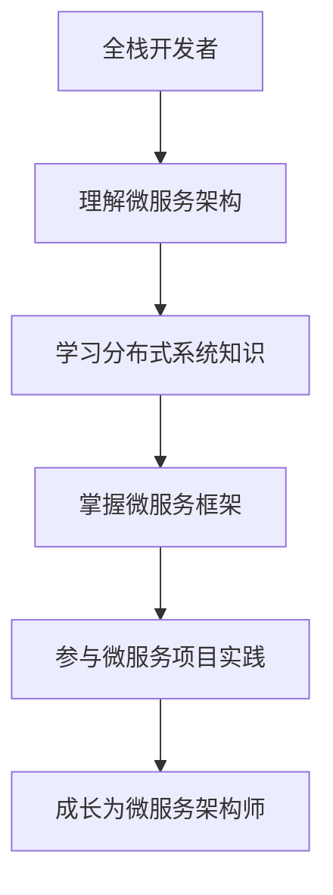

                 

关键词：全栈开发、微服务架构、架构设计、技术晋升、系统稳定性、开发效率、团队协作、云计算、分布式系统

> 摘要：本文旨在为全栈开发者提供一条清晰的晋升之路，从全栈开发过渡到微服务架构师。通过深入探讨微服务的核心概念、设计原则、实践案例以及面临的挑战，帮助开发者理解微服务架构的精髓，并掌握其在实际项目中的运用。

## 1. 背景介绍

随着互联网技术的飞速发展，软件系统的规模和复杂性不断增加。传统的单体架构已无法满足日益增长的性能、可扩展性和可维护性需求。因此，微服务架构应运而生，成为现代软件开发的趋势。微服务架构将大型单体应用拆分成多个小型、独立的服务，通过解耦的方式提高系统的灵活性、可维护性和可扩展性。

然而，从全栈开发过渡到微服务架构师并非易事。全栈开发者需要具备广泛的技术知识，而微服务架构师则需要深入了解分布式系统、服务拆分、服务通信、负载均衡、容错处理等高级概念。本文将带领读者了解这一转型过程，并提供实用的建议。

## 2. 核心概念与联系

### 2.1 微服务架构的概念

微服务架构是一种将复杂的应用系统拆分为多个独立服务的设计理念。每个服务都是一个小型、自治的组件，负责完成特定的业务功能。这些服务通过定义良好的接口进行通信，独立部署、扩展和升级。

### 2.2 微服务架构与单体架构的区别

- **部署方式**：单体架构将所有功能打包在一起部署，而微服务架构中的每个服务都可以独立部署。
- **扩展性**：单体架构扩展困难，而微服务架构可以通过水平扩展单个服务来提高系统性能。
- **维护性**：单体架构的代码库庞大，维护困难，而微服务架构中的服务可以独立开发、测试和部署。
- **通信方式**：单体架构通常通过共享数据库进行通信，而微服务架构通过定义良好的接口进行通信。

### 2.3 微服务架构的优势与挑战

**优势**：
- **灵活性**：服务可以独立开发、部署和扩展。
- **可维护性**：服务职责明确，易于维护。
- **可扩展性**：可以根据业务需求灵活扩展。
- **技术多样性**：服务可以使用不同的技术栈。

**挑战**：
- **分布式系统复杂性**：需要处理服务间通信、数据一致性、负载均衡、容错处理等问题。
- **系统协调性**：服务拆分不当可能导致系统协调性降低。
- **运维成本**：需要额外的资源和精力进行分布式系统的运维。

### 2.4 Mermaid 流程图



## 3. 核心算法原理 & 具体操作步骤

### 3.1 算法原理概述

微服务架构的核心在于服务拆分和通信。服务拆分的关键在于如何将业务功能划分成独立、自治的服务。这需要全栈开发者具备业务理解能力、系统设计能力和分布式系统知识。

服务通信主要涉及服务间数据传输的方式，包括 RESTful API、消息队列、同步调用和异步调用等。选择合适的服务通信方式需要考虑系统的性能、可扩展性和可靠性。

### 3.2 算法步骤详解

1. **业务理解**：深入了解业务需求，识别业务流程中的关键功能模块。
2. **服务拆分**：根据业务需求和模块依赖关系，将应用拆分为多个独立的服务。
3. **定义接口**：为每个服务定义清晰的接口，包括 API 路径、请求参数和返回结果。
4. **服务通信**：选择合适的服务通信方式，实现服务间数据传输。
5. **部署和监控**：将服务部署到分布式环境中，并进行监控和运维。

### 3.3 算法优缺点

**优点**：
- **灵活性**：服务可以独立开发、部署和扩展。
- **可维护性**：服务职责明确，易于维护。
- **可扩展性**：可以根据业务需求灵活扩展。
- **技术多样性**：服务可以使用不同的技术栈。

**缺点**：
- **分布式系统复杂性**：需要处理服务间通信、数据一致性、负载均衡、容错处理等问题。
- **系统协调性**：服务拆分不当可能导致系统协调性降低。
- **运维成本**：需要额外的资源和精力进行分布式系统的运维。

### 3.4 算法应用领域

微服务架构广泛应用于电子商务、金融、物流、社交媒体等场景。通过将大型单体应用拆分为多个微服务，可以大幅提高系统的性能、可扩展性和可维护性。

## 4. 数学模型和公式 & 详细讲解 & 举例说明

### 4.1 数学模型构建

在微服务架构中，一个关键的问题是服务拆分的粒度。服务拆分过细可能导致系统协调性降低，而拆分过粗则可能无法实现灵活扩展。一个常见的数学模型是服务拆分的粒度阈值模型，该模型基于以下假设：

- 每个服务都应该有明确的业务职责。
- 服务间的依赖关系应该尽量简单。
- 服务数量应该适度，以避免过度分布式。

数学模型如下：

$$
\text{服务数量} = \frac{\text{业务流程中的功能点数量}}{\text{服务粒度阈值}}
$$

其中，服务粒度阈值可以根据具体业务场景进行调整。

### 4.2 公式推导过程

假设一个业务系统有 N 个功能点，服务粒度阈值设置为 T。那么，服务数量可以通过以下公式计算：

$$
\text{服务数量} = \lceil \frac{N}{T} \rceil
$$

其中，$\lceil x \rceil$ 表示向上取整函数。

### 4.3 案例分析与讲解

假设一个电商系统有 50 个功能点，服务粒度阈值设置为 10。根据上述公式，服务数量为：

$$
\text{服务数量} = \lceil \frac{50}{10} \rceil = 5
$$

这意味着可以将电商系统拆分为 5 个独立的服务。这 5 个服务分别负责商品管理、订单管理、用户管理、支付管理和库存管理等功能。

在实际应用中，服务粒度阈值需要根据业务场景进行调整。例如，对于一些高并发、高可扩展性的业务系统，可以适当降低服务粒度阈值，以提高系统的性能和可扩展性。

## 5. 项目实践：代码实例和详细解释说明

### 5.1 开发环境搭建

为了演示微服务架构的实际应用，我们将使用 Spring Boot 和 Spring Cloud 搭建一个简单的电商系统。开发环境如下：

- 操作系统：Windows / macOS / Linux
- 开发工具：IntelliJ IDEA / Eclipse
- 依赖管理：Maven
- 数据库：MySQL

### 5.2 源代码详细实现

在项目中，我们将创建 5 个微服务，分别为商品管理服务、订单管理服务、用户管理服务、支付管理服务和库存管理服务。以下是商品管理服务的源代码：

```java
@RestController
@RequestMapping("/products")
public class ProductController {

    @Autowired
    private ProductService productService;

    @GetMapping("/{id}")
    public ResponseEntity<Product> getProductById(@PathVariable Long id) {
        Product product = productService.getProductById(id);
        if (product != null) {
            return ResponseEntity.ok(product);
        } else {
            return ResponseEntity.notFound().build();
        }
    }

    @PostMapping("/")
    public ResponseEntity<Product> createProduct(@RequestBody Product product) {
        Product savedProduct = productService.saveProduct(product);
        return ResponseEntity.status(HttpStatus.CREATED).body(savedProduct);
    }
}
```

### 5.3 代码解读与分析

该服务的主要功能是提供商品信息的查询和创建接口。在代码中，我们定义了两个接口：`getProductById` 和 `createProduct`。这两个接口分别对应 RESTful API 的 GET 和 POST 方法。

在 `getProductById` 接口中，我们通过调用 `ProductService` 的 `getProductById` 方法查询商品信息。如果查询成功，返回商品对象；否则，返回 404 错误。

在 `createProduct` 接口中，我们通过调用 `ProductService` 的 `saveProduct` 方法创建商品。如果创建成功，返回商品对象；否则，返回 201 创建成功。

### 5.4 运行结果展示

在开发工具中运行项目后，我们可以通过以下 URL 访问商品管理服务：

- 查询商品：`http://localhost:8080/products/{id}`
- 创建商品：`http://localhost:8080/products/`

输入正确的商品 ID，我们可以查询到商品信息。输入正确的商品数据，我们可以创建一个新的商品。

## 6. 实际应用场景

微服务架构在许多实际应用场景中取得了显著的成功。以下是一些典型的应用场景：

- **电子商务**：电商系统通常具有高并发、高可扩展性的需求，微服务架构能够很好地满足这些需求。
- **金融领域**：金融系统的复杂性和安全性要求较高，微服务架构可以提供更好的灵活性和可维护性。
- **物流管理**：物流系统需要处理大量的订单和货物运输信息，微服务架构可以提高系统的性能和可扩展性。
- **社交媒体**：社交媒体系统具有海量的用户数据和信息流，微服务架构可以提高系统的性能和可扩展性。

## 7. 工具和资源推荐

### 7.1 学习资源推荐

- 《微服务设计》：这是一本关于微服务架构的权威指南，详细介绍了微服务的概念、架构和实现方法。
- 《Docker 实战》：Docker 是容器化技术的代表，熟练掌握 Docker 对于理解微服务架构具有重要意义。

### 7.2 开发工具推荐

- IntelliJ IDEA：一款功能强大的集成开发环境，适用于 Java 和 Spring Boot 开发。
- Kubernetes：一款用于容器编排和分布式系统管理的开源平台，能够有效地管理微服务架构中的容器。

### 7.3 相关论文推荐

- "Microservices: A Definition of a New Approach to Building Large-Scale Applications"：这篇文章详细介绍了微服务架构的概念和优势。
- "Service-Oriented Architecture: Concepts, Technology and Design"：这篇文章讨论了服务导向架构（SOA）和微服务架构的关系。

## 8. 总结：未来发展趋势与挑战

### 8.1 研究成果总结

微服务架构在近年来取得了显著的研究成果。随着容器技术、服务网格和自动化运维工具的发展，微服务架构的应用范围和成熟度不断提高。研究者们也在不断探索新的服务拆分策略、服务发现机制、数据一致性方案和容错机制，以提高微服务架构的性能和可靠性。

### 8.2 未来发展趋势

- **服务网格**：服务网格是一种新兴的技术，用于简化微服务架构中的服务间通信和监控。随着服务网格技术的发展，未来微服务架构将更加智能化和自动化。
- **云原生应用**：云原生应用是一种基于容器、服务网格和自动化运维的应用模式。未来，越来越多的企业将采用云原生应用，以提高系统的性能和可扩展性。
- **多租户架构**：多租户架构是一种将多个客户或用户隔离在同一系统中的设计方法。未来，多租户架构将在云计算和分布式系统中得到广泛应用。

### 8.3 面临的挑战

- **分布式系统复杂性**：随着服务数量的增加，分布式系统的复杂性也不断上升。如何有效地管理和维护分布式系统将成为微服务架构面临的重要挑战。
- **数据一致性和分布式事务**：在微服务架构中，如何保证数据的一致性和分布式事务是一个难题。未来的研究需要提出更加高效和可靠的数据一致性和事务处理方案。
- **服务拆分策略**：如何选择合适的服务拆分策略是一个关键问题。未来需要研究更加智能和自动化的服务拆分方法。

### 8.4 研究展望

随着云计算、物联网和人工智能等技术的不断发展，微服务架构在未来将扮演更加重要的角色。研究者们需要关注以下几个方面：

- **智能化和服务发现**：结合人工智能技术，开发智能化和服务发现机制，以简化微服务架构的部署和管理。
- **分布式数据一致性**：研究分布式数据一致性方案，以解决微服务架构中的数据一致性问题。
- **多租户架构和资源隔离**：探索多租户架构和资源隔离技术，以提高系统的性能和安全性。
- **容器化和自动化运维**：结合容器技术和自动化运维工具，提高微服务架构的部署、监控和运维效率。

## 9. 附录：常见问题与解答

### 9.1 什么是微服务架构？

微服务架构是一种将复杂的应用系统拆分为多个小型、独立的服务的设计理念。每个服务负责完成特定的业务功能，通过定义良好的接口进行通信。

### 9.2 微服务架构的优势是什么？

微服务架构的优势包括灵活性、可维护性、可扩展性和技术多样性。通过将大型单体应用拆分为多个独立的服务，可以提高系统的性能、可扩展性和可维护性。

### 9.3 微服务架构的挑战有哪些？

微服务架构的挑战包括分布式系统复杂性、系统协调性、运维成本和数据一致性等问题。如何有效地管理和维护分布式系统是一个重要挑战。

### 9.4 如何选择服务拆分策略？

选择服务拆分策略需要考虑业务需求、模块依赖关系和服务职责。一种常见的方法是根据业务功能将系统拆分为多个独立的服务，每个服务负责完成特定的业务功能。

## 参考文献

- Martin, F. (2014). *Microservices: Designing Highly Scalable Systems*. O'Reilly Media.
- Fowler, M. (2017). *Patterns of Enterprise Application Architecture*. Addison-Wesley.
- Armstrong, M. (2017). *Docker Deep Dive*. O'Reilly Media.
- Box, D., et al. (2018). *Kubernetes Up & Running: Docker container orchestration the hard way*. O'Reilly Media.

### 作者署名

作者：禅与计算机程序设计艺术 / Zen and the Art of Computer Programming

