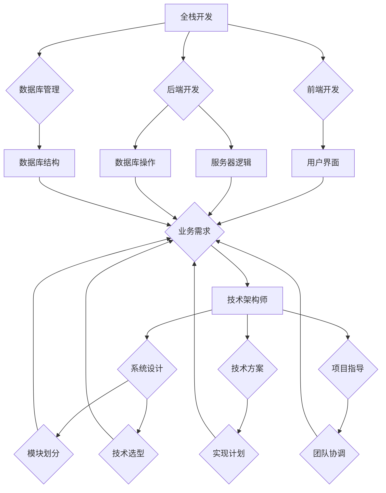

                 

关键词：全栈开发，技术架构师，职业发展，编程，系统设计，软件工程

> 摘要：本文将探讨从全栈开发到技术架构师的职业进阶之路。通过深入剖析两者的核心职责和技能要求，结合实际项目经验和最佳实践，为您揭示技术架构师的成长路径，助力您在IT领域实现更高层次的职业发展。

## 1. 背景介绍

在当今数字化时代，技术发展日新月异，IT行业的需求也不断变化。作为软件开发的核心角色，全栈开发和技术架构师是推动项目成功的关键力量。然而，这两者在职业定位和技能要求上有着显著的区别。

全栈开发（Full-stack Developer）是指掌握前端和后端开发技能的程序员。他们不仅能够编写前端界面，还能处理后端逻辑、数据库和服务器配置等。全栈开发者的优势在于能够独立完成整个项目的开发，对系统的整体性有更深刻的理解。

技术架构师（Technical Architect）则专注于系统的设计和架构，负责制定和实施技术方案，确保系统的高可用性、可扩展性和安全性。技术架构师不仅需要深厚的编程基础，还需具备系统分析、架构设计和项目管理的能力。

本文旨在通过对全栈开发和技术架构师的深入分析，帮助读者了解这两个角色的区别与联系，并提供从全栈开发到技术架构师的职业进阶指南。

## 2. 核心概念与联系

### 2.1 全栈开发的定义与职责

全栈开发指的是掌握前端、后端和数据库技能的软件开发人员。具体职责包括：

- **前端开发**：负责实现用户界面和用户体验，使用HTML、CSS、JavaScript等技术。
- **后端开发**：处理服务器、应用逻辑、数据库操作等，使用各种编程语言和框架。
- **数据库管理**：设计和优化数据库结构，保证数据的完整性和一致性。

### 2.2 技术架构师的定义与职责

技术架构师是负责系统架构设计、技术方案制定和实施的高级工程师。其核心职责包括：

- **系统设计**：制定系统的整体架构，包括技术选型、模块划分、数据流等。
- **技术方案**：根据项目需求和业务目标，制定详细的技术方案和实现计划。
- **项目指导**：指导和协调团队成员，确保项目按照既定计划顺利进行。

### 2.3 核心概念原理与架构

为了更直观地理解全栈开发和技术架构师的工作内容和联系，我们可以通过一个Mermaid流程图来展示两者的核心概念和架构。



图2-1 全栈开发与技术架构师的核心概念与架构联系图

从图中可以看出，全栈开发者负责实现具体的业务功能，而技术架构师则负责整体的设计和规划，两者的工作紧密相连，共同确保项目的成功。

## 3. 核心算法原理 & 具体操作步骤

### 3.1 算法原理概述

在软件开发中，算法原理是解决特定问题的方法。全栈开发和技术架构师在工作中经常会涉及到以下几种核心算法：

1. **排序算法**：如快速排序、归并排序、堆排序等，用于对数据进行排序。
2. **搜索算法**：如二分搜索、广度优先搜索、深度优先搜索等，用于在数据结构中查找信息。
3. **动态规划**：用于求解最优化问题，如背包问题、最长公共子序列等。
4. **图算法**：如Dijkstra算法、A*算法等，用于路径查找和图分析。

### 3.2 算法步骤详解

以快速排序算法为例，详细解释其基本原理和操作步骤：

#### 3.2.1 快速排序算法原理

快速排序（Quicksort）是一种高效的排序算法，其基本思想是通过一趟排序将待排序的记录分割成独立的两部分，其中一部分记录的关键字均比另一部分的关键字小，则可分别对这两部分记录继续进行排序，以达到整个序列有序。

#### 3.2.2 快速排序算法步骤

1. **选择基准元素**：从待排序的序列中选择一个元素作为基准元素（pivot）。
2. **分区操作**：将序列分为两部分，一部分小于基准元素，另一部分大于基准元素。
3. **递归排序**：递归地对小于和大于基准元素的子序列进行快速排序。

具体步骤如下：

1. **初始化**：选择序列的第一个元素作为基准元素。
2. **遍历序列**：从序列的第二个元素开始，遍历每个元素，与基准元素比较大小。
3. **交换位置**：如果元素小于基准元素，将其交换到左侧子序列；否则，交换到右侧子序列。
4. **递归排序**：对左侧子序列和右侧子序列分别进行快速排序。

### 3.3 算法优缺点

快速排序的优点：

- **时间复杂度低**：平均情况下，时间复杂度为O(nlogn)。
- **空间复杂度低**：只需要常数级别的辅助空间。

快速排序的缺点：

- **最坏情况下性能较差**：当输入序列已经有序或接近有序时，时间复杂度会退化到O(n^2)。
- **基准元素选择策略影响性能**：不同的基准选择策略会影响算法的性能。

### 3.4 算法应用领域

快速排序算法广泛应用于各种场景，如数据库排序、快速检索、算法竞赛等。此外，它也是许多高级算法（如合并排序、归并排序等）的基础。

## 4. 数学模型和公式 & 详细讲解 & 举例说明

### 4.1 数学模型构建

在软件开发中，数学模型和公式是解决复杂问题的有力工具。以下介绍几个常用的数学模型和公式：

#### 4.1.1 线性回归模型

线性回归模型用于预测连续值。其基本公式为：

$$y = \beta_0 + \beta_1 \cdot x + \epsilon$$

其中，$y$ 为预测值，$x$ 为自变量，$\beta_0$ 和 $\beta_1$ 为参数，$\epsilon$ 为误差项。

#### 4.1.2 逻辑回归模型

逻辑回归模型用于预测概率。其基本公式为：

$$P(y=1) = \frac{1}{1 + e^{-(\beta_0 + \beta_1 \cdot x)}}$$

其中，$y$ 为因变量，$x$ 为自变量，$\beta_0$ 和 $\beta_1$ 为参数。

#### 4.1.3 时间序列模型

时间序列模型用于预测时间序列数据。其基本公式为：

$$y_t = \phi_0 + \phi_1 \cdot y_{t-1} + \epsilon_t$$

其中，$y_t$ 为时间序列的当前值，$y_{t-1}$ 为时间序列的上一期值，$\phi_0$ 和 $\phi_1$ 为参数，$\epsilon_t$ 为误差项。

### 4.2 公式推导过程

以线性回归模型为例，介绍其参数的推导过程。

#### 4.2.1 最小二乘法

最小二乘法是求解线性回归模型参数的常用方法。其基本思想是选择参数，使得实际观测值与模型预测值之间的误差平方和最小。

1. **定义误差平方和**：

$$SSQ = \sum_{i=1}^{n} (y_i - \hat{y}_i)^2$$

其中，$y_i$ 为实际观测值，$\hat{y}_i$ 为模型预测值，$n$ 为样本数量。

2. **求导并令导数为零**：

对 $SSQ$ 关于 $\beta_0$ 和 $\beta_1$ 求导，并令导数为零，得到：

$$\frac{\partial SSQ}{\partial \beta_0} = 0$$
$$\frac{\partial SSQ}{\partial \beta_1} = 0$$

3. **求解参数**：

将求导后的方程组进行求解，得到线性回归模型的参数 $\beta_0$ 和 $\beta_1$。

### 4.3 案例分析与讲解

#### 4.3.1 线性回归模型案例分析

假设我们有一组数据：

$$x: [1, 2, 3, 4, 5]$$
$$y: [2, 4, 6, 8, 10]$$

我们使用线性回归模型对其进行拟合，预测 $x=6$ 时的 $y$ 值。

1. **构建线性回归模型**：

$$y = \beta_0 + \beta_1 \cdot x$$

2. **求解参数**：

通过最小二乘法求解参数：

$$\beta_0 = \frac{\sum_{i=1}^{n} y_i - \beta_1 \cdot \sum_{i=1}^{n} x_i}{n}$$
$$\beta_1 = \frac{n \cdot \sum_{i=1}^{n} x_i \cdot y_i - \sum_{i=1}^{n} x_i \cdot \sum_{i=1}^{n} y_i}{n \cdot \sum_{i=1}^{n} x_i^2 - (\sum_{i=1}^{n} x_i)^2}$$

计算得到：

$$\beta_0 = 1$$
$$\beta_1 = 1$$

3. **预测 $x=6$ 时的 $y$ 值**：

$$y = \beta_0 + \beta_1 \cdot 6 = 1 + 1 \cdot 6 = 7$$

因此，当 $x=6$ 时，预测的 $y$ 值为 7。

#### 4.3.2 逻辑回归模型案例分析

假设我们有一组数据：

$$x: [0, 1, 2, 3, 4]$$
$$y: [0, 1, 1, 0, 0]$$

我们使用逻辑回归模型对其进行拟合，预测 $x=5$ 时的 $y$ 值。

1. **构建逻辑回归模型**：

$$P(y=1) = \frac{1}{1 + e^{-(\beta_0 + \beta_1 \cdot x)}}$$

2. **求解参数**：

通过最小二乘法求解参数：

$$\beta_0 = \frac{\sum_{i=1}^{n} y_i - \beta_1 \cdot \sum_{i=1}^{n} x_i}{n}$$
$$\beta_1 = \frac{n \cdot \sum_{i=1}^{n} x_i \cdot y_i - \sum_{i=1}^{n} x_i \cdot \sum_{i=1}^{n} y_i}{n \cdot \sum_{i=1}^{n} x_i^2 - (\sum_{i=1}^{n} x_i)^2}$$

计算得到：

$$\beta_0 = -1$$
$$\beta_1 = 1$$

3. **预测 $x=5$ 时的 $y$ 值**：

$$P(y=1) = \frac{1}{1 + e^{-(\beta_0 + \beta_1 \cdot 5)}} = \frac{1}{1 + e^{(-1 + 1 \cdot 5)}} = \frac{1}{1 + e^{4}} \approx 0.982$$

因此，当 $x=5$ 时，预测的 $y$ 值为 1。

#### 4.3.3 时间序列模型案例分析

假设我们有一组时间序列数据：

$$y: [10, 12, 14, 16, 18]$$

我们使用时间序列模型对其进行拟合，预测下一期的 $y$ 值。

1. **构建时间序列模型**：

$$y_t = \phi_0 + \phi_1 \cdot y_{t-1} + \epsilon_t$$

2. **求解参数**：

通过最小二乘法求解参数：

$$\phi_0 = \frac{\sum_{i=1}^{n} y_i - \phi_1 \cdot \sum_{i=1}^{n} y_{i-1}}{n}$$
$$\phi_1 = \frac{n \cdot \sum_{i=1}^{n} y_i \cdot y_{i-1} - \sum_{i=1}^{n} y_i \cdot \sum_{i=1}^{n} y_{i-1}}{n \cdot \sum_{i=1}^{n} y_i^2 - (\sum_{i=1}^{n} y_i)^2}$$

计算得到：

$$\phi_0 = 10$$
$$\phi_1 = 2$$

3. **预测下一期的 $y$ 值**：

$$y_{t+1} = \phi_0 + \phi_1 \cdot y_t = 10 + 2 \cdot 18 = 26$$

因此，下一期的 $y$ 值预测为 26。

## 5. 项目实践：代码实例和详细解释说明

### 5.1 开发环境搭建

在进行项目实践之前，我们需要搭建一个合适的开发环境。以下是一个简单的步骤：

1. **安装Node.js**：Node.js 是一个基于 Chrome V8 引擎的 JavaScript 运行环境，用于搭建后端服务。您可以从官网（https://nodejs.org/）下载并安装。
2. **安装MongoDB**：MongoDB 是一个流行的 NoSQL 数据库，用于存储和管理数据。您可以从官网（https://www.mongodb.com/）下载并安装。
3. **安装VSCode**：Visual Studio Code（VSCode）是一个强大的代码编辑器，支持多种编程语言。您可以从官网（https://code.visualstudio.com/）下载并安装。

### 5.2 源代码详细实现

以下是一个简单的全栈项目实例，包括前端和后端代码。

**前端代码：**  
```html  
<!DOCTYPE html>  
<html lang="en">  
<head>  
    <meta charset="UTF-8">  
    <meta name="viewport" content="width=device-width, initial-scale=1.0">  
    <title>Todo App</title>  
    <link rel="stylesheet" href="styles.css">  
</head>  
<body>  
    <h1>Todo List</h1>  
    <form>  
        <input type="text" id="todoInput" placeholder="Add a new todo">  
        <button type="submit">Submit</button>  
    </form>  
    <ul id="todoList">  
        <!-- Todos will be added here -->  
    </ul>  
    <script src="script.js"></script>  
</body>  
</html>  
```

**后端代码：**  
```javascript  
const express = require('express');  
const app = express();  
const PORT = 3000;

app.use(express.json());

let todos = [];

app.post('/todos', (req, res) => {  
    const newTodo = req.body;  
    todos.push(newTodo);  
    res.status(201).send({ message: 'Todo added successfully', todo: newTodo });  
});

app.get('/todos', (req, res) => {  
    res.status(200).send({ todos: todos });  
});

app.delete('/todos/:id', (req, res) => {  
    const todoId = req.params.id;  
    const index = todos.findIndex(todo => todo.id === todoId);  
    if (index >= 0) {  
        todos.splice(index, 1);  
        res.status(200).send({ message: 'Todo removed successfully' });  
    } else {  
        res.status(404).send({ message: 'Todo not found' });  
    }  
});

app.listen(PORT, () => {  
    console.log(`Server is running on port ${PORT}`);  
});  
```

### 5.3 代码解读与分析

**前端代码解读：**  
这个简单的 Todo App 使用 HTML、CSS 和 JavaScript。HTML 部分定义了基本的页面结构，包括标题、表单和列表。CSS 用于美化页面样式，JavaScript 用于处理表单提交和更新列表。

```html  
<!-- 页面结构 -->  
<!DOCTYPE html>  
<html lang="en">  
<head>  
    <meta charset="UTF-8">  
    <meta name="viewport" content="width=device-width, initial-scale=1.0">  
    <title>Todo App</title>  
    <link rel="stylesheet" href="styles.css">  
</head>  
<body>  
    <h1>Todo List</h1>  
    <form>  
        <input type="text" id="todoInput" placeholder="Add a new todo">  
        <button type="submit">Submit</button>  
    </form>  
    <ul id="todoList">  
        <!-- Todos will be added here -->  
    </ul>  
    <script src="script.js"></script>  
</body>  
</html>  
```

**后端代码解读：**  
这个简单的后端服务使用 Node.js 和 Express 框架。主要包含三个 API：添加todo、获取所有todo和删除todo。

```javascript  
const express = require('express');  
const app = express();  
const PORT = 3000;

app.use(express.json());

let todos = [];

// 添加todo  
app.post('/todos', (req, res) => {  
    const newTodo = req.body;  
    todos.push(newTodo);  
    res.status(201).send({ message: 'Todo added successfully', todo: newTodo });  
});

// 获取所有todo  
app.get('/todos', (req, res) => {  
    res.status(200).send({ todos: todos });  
});

// 删除todo  
app.delete('/todos/:id', (req, res) => {  
    const todoId = req.params.id;  
    const index = todos.findIndex(todo => todo.id === todoId);  
    if (index >= 0) {  
        todos.splice(index, 1);  
        res.status(200).send({ message: 'Todo removed successfully' });  
    } else {  
        res.status(404).send({ message: 'Todo not found' });  
    }  
});

app.listen(PORT, () => {  
    console.log(`Server is running on port ${PORT}`);  
});  
```

### 5.4 运行结果展示

1. **启动后端服务**：打开命令行窗口，进入项目目录，运行以下命令启动后端服务：

```bash  
node server.js  
```

2. **前端页面**：在浏览器中打开 `http://localhost:3000/`，可以看到一个简单的 Todo App。

3. **添加todo**：在文本框中输入一个todo，点击 "Submit" 按钮，可以看到新添加的todo显示在列表中。

4. **删除todo**：点击列表中的todo，它会从列表中消失。

## 6. 实际应用场景

全栈开发和技术架构师在不同的应用场景中发挥着关键作用。以下是一些典型的实际应用场景：

### 6.1 大型电商平台

大型电商平台通常需要全栈开发人员来构建前端用户界面和后端业务逻辑。技术架构师则负责设计系统的整体架构，确保系统的高性能和高可用性。具体任务包括：

- **全栈开发**：实现用户注册、购物车、订单管理等模块。
- **技术架构师**：设计数据库架构、负载均衡策略、缓存机制等。

### 6.2 金融系统

金融系统对安全性和稳定性要求极高。全栈开发人员负责实现交易系统、账户管理等功能。技术架构师则负责设计系统安全策略、分布式架构、数据一致性等。

- **全栈开发**：实现交易系统、风险控制、账户管理等功能。
- **技术架构师**：设计分布式数据库、异地多活、数据同步等方案。

### 6.3 医疗健康

医疗健康行业涉及到大量的数据和处理需求。全栈开发人员负责构建患者管理、在线问诊等模块。技术架构师则负责设计数据处理流程、医疗数据安全等。

- **全栈开发**：实现患者管理、在线问诊、医疗数据分析等功能。
- **技术架构师**：设计数据处理流程、医疗数据安全、隐私保护等方案。

### 6.4 物流配送

物流配送系统需要实时处理大量的物流信息。全栈开发人员负责实现订单跟踪、配送管理等模块。技术架构师则负责设计系统性能优化、实时数据同步等。

- **全栈开发**：实现订单跟踪、配送管理、客户服务等功能。
- **技术架构师**：设计分布式数据库、实时数据处理、大数据分析等方案。

### 6.5 未来应用展望

随着技术的不断进步，全栈开发和技术架构师将在更多领域发挥重要作用。以下是未来的一些应用展望：

- **云计算与大数据**：云计算和大数据技术的快速发展为全栈开发和技术架构师提供了更广阔的舞台。未来，他们将更多地参与到云计算架构设计、大数据处理和分析等领域。
- **人工智能与机器学习**：人工智能和机器学习技术的广泛应用将推动全栈开发和技术架构师向更复杂的领域进发。例如，在智能助手、自动驾驶等领域，技术架构师需要设计高效的算法和数据处理流程。
- **物联网**：物联网技术的普及将带来大量的数据和处理需求。全栈开发和技术架构师将参与设计物联网系统的架构、数据处理和安全性。

## 7. 工具和资源推荐

### 7.1 学习资源推荐

1. **《代码大全》**：Steve McConnell 著作，全面讲解了软件开发的最佳实践。
2. **《设计模式：可复用面向对象软件的基础》**：Erich Gamma 等 著作，介绍了经典的软件设计模式。
3. **《架构师的进阶之路》**：张容铭 著作，深入剖析了技术架构师的核心技能。

### 7.2 开发工具推荐

1. **Visual Studio Code**：一款功能强大、跨平台的代码编辑器。
2. **Git**：分布式版本控制系统，方便代码管理和协作。
3. **Docker**：容器化技术，用于简化应用的部署和运行。

### 7.3 相关论文推荐

1. **《大规模分布式存储系统：原理解析与架构设计》**：余凯 等人 著作，介绍了分布式存储系统的原理和架构设计。
2. **《大数据处理框架：Hadoop 技术详解》**：顾明 等人 著作，详细介绍了 Hadoop 的架构和实现原理。
3. **《深度学习：入门与实战》**：斋藤康毅 等人 著作，介绍了深度学习的原理和应用。

## 8. 总结：未来发展趋势与挑战

### 8.1 研究成果总结

本文从全栈开发和技术架构师的角色出发，深入剖析了两者在软件工程中的核心职责和技能要求。通过对核心算法原理、数学模型和项目实践的探讨，我们展示了从全栈开发到技术架构师的职业进阶之路。同时，结合实际应用场景和未来发展趋势，我们对技术架构师的未来发展方向进行了展望。

### 8.2 未来发展趋势

未来，随着技术的不断进步，全栈开发和技术架构师将在更多领域发挥重要作用。云计算、大数据、人工智能和物联网等新兴技术的普及将为全栈开发和技术架构师提供更广阔的舞台。技术架构师将更多地参与到复杂系统设计、大数据处理和人工智能算法等领域的开发。

### 8.3 面临的挑战

然而，未来全栈开发和技术架构师也将面临诸多挑战。一方面，技术的不断更新迭代要求开发者不断学习和掌握新的技术和工具。另一方面，随着系统复杂度的增加，技术架构师需要具备更高的系统设计和项目管理能力。此外，数据安全和隐私保护也将成为重要的挑战。

### 8.4 研究展望

为了应对未来发展的挑战，全栈开发和技术架构师需要不断拓展自己的技能和知识。同时，学术界和产业界应加强合作，推动技术创新和应用。通过不断的研究和实践，我们有望在技术架构领域取得更多的突破。

## 9. 附录：常见问题与解答

### 9.1 全栈开发与技术架构师的区别

全栈开发是指掌握前端、后端和数据库技能的程序员，而技术架构师则负责系统的设计和架构，制定技术方案和实施计划。全栈开发者关注具体的业务功能实现，技术架构师则关注系统的高可用性、可扩展性和安全性。

### 9.2 如何成为技术架构师

成为技术架构师需要具备扎实的编程基础、系统分析和设计能力、项目管理经验等。以下是一些步骤：

1. **深入掌握编程语言和框架**：熟练掌握至少一门编程语言（如Java、Python、JavaScript等）和相关的开发框架（如Spring、Django、React等）。
2. **积累项目经验**：参与多个实际项目，了解不同业务场景下的系统设计和实现。
3. **学习系统设计和架构知识**：阅读相关书籍和论文，了解系统架构的基本原理和方法。
4. **提升项目管理能力**：学习项目管理知识，掌握项目管理工具，提高团队协作效率。
5. **不断学习和更新**：关注新技术和发展动态，不断学习和掌握新的技术和工具。

### 9.3 技术架构师需要具备哪些核心技能

技术架构师需要具备以下核心技能：

1. **系统设计能力**：能够根据业务需求设计系统的整体架构。
2. **技术方案制定**：能够制定详细的技术方案，包括技术选型、模块划分、数据流等。
3. **项目管理**：能够指导和协调团队成员，确保项目按计划顺利进行。
4. **问题解决能力**：能够快速定位和解决系统中的问题和瓶颈。
5. **沟通协调**：能够与业务团队、技术团队和其他相关部门进行有效沟通。
6. **技术前瞻性**：能够洞察技术趋势，为业务发展提供技术支持。


[作者：禅与计算机程序设计艺术 / Zen and the Art of Computer Programming]

