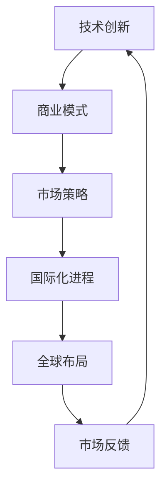

                 

关键词：Lepton AI，市场扩张，国际发展，技术创新，商业模式，战略规划，AI行业

> 摘要：本文将探讨Lepton AI这家中国本土AI企业，如何在短短几年内，通过技术创新和战略规划，成功拓展至国际市场。文章将分析其市场扩张的动因、策略、以及面临的挑战，为国内AI企业提供有价值的参考。

## 1. 背景介绍

Lepton AI成立于2015年，总部位于中国北京，是一家专注于计算机视觉和自然语言处理技术的企业。公司初期主要面向国内市场，提供图像识别、智能监控、自动驾驶等领域的解决方案。随着技术的不断进步和市场的需求增长，Lepton AI逐渐意识到国际市场的巨大潜力，开始积极谋划海外市场的拓展。

### 1.1 创始团队

Lepton AI的创始团队由一批在人工智能领域有着丰富经验的专家组成，其中包括人工智能领域的博士、海外归来的技术大牛和成功的创业企业家。这些成员在计算机视觉、自然语言处理、机器学习等方面都有着深厚的积累，为公司的技术创新奠定了坚实的基础。

### 1.2 技术优势

Lepton AI在技术创新方面有着明显的优势。公司自主研发的核心算法在图像识别、自然语言处理等关键技术上取得了重要突破，使得其产品在准确率、效率等方面具备显著优势。此外，Lepton AI还拥有一支技术精湛的研发团队，不断推出具有前瞻性的技术成果，为市场拓展提供了强有力的支撑。

## 2. 核心概念与联系

在分析Lepton AI的市场扩张之路之前，我们需要先了解几个核心概念，包括技术创新、商业模式、市场策略和国际化进程等。以下是这些概念之间的联系及其在Lepton AI市场扩张中的应用：

### 2.1 技术创新

技术创新是Lepton AI市场扩张的核心驱动力。公司通过持续的技术研发，不断提升产品性能和用户体验，从而在激烈的市场竞争中脱颖而出。例如，在图像识别领域，Lepton AI研发了一种高效的卷积神经网络算法，使得其产品的准确率达到了行业领先水平。

### 2.2 商业模式

商业模式是Lepton AI市场扩张的重要支撑。公司采用“产品+服务”的商业模式，不仅提供高性能的AI产品，还为客户提供定制化的解决方案。这种模式既满足了客户多样化的需求，又提高了公司的市场竞争力。

### 2.3 市场策略

市场策略是Lepton AI市场扩张的关键手段。公司根据不同市场的特点，制定了有针对性的市场推广策略。例如，在欧美市场，Lepton AI通过参加国际展会、与当地企业合作等方式，提高了品牌知名度和影响力。

### 2.4 国际化进程

国际化进程是Lepton AI市场扩张的必然选择。公司从国内市场起步，逐步拓展至国际市场，通过在海外设立分支机构、招聘当地人才等方式，加快了国际化进程。截至2023年，Lepton AI已经在全球20多个国家和地区建立了合作关系，业务范围覆盖了北美、欧洲、亚洲等地区。

### 2.5 Mermaid 流程图

以下是一个简化的Mermaid流程图，展示了Lepton AI市场扩张的各个关键环节：



## 3. 核心算法原理 & 具体操作步骤

### 3.1 算法原理概述

Lepton AI在计算机视觉和自然语言处理领域有着深厚的技术积累。以下是公司核心算法的基本原理：

#### 3.1.1 图像识别算法

Lepton AI的图像识别算法基于深度学习技术，采用卷积神经网络（CNN）对图像进行特征提取和分类。该算法通过多层卷积和池化操作，实现对图像的逐层抽象，从而提高识别准确率。

#### 3.1.2 自然语言处理算法

Lepton AI的自然语言处理算法基于循环神经网络（RNN）和长短时记忆网络（LSTM）。该算法通过捕捉单词和句子之间的关联性，实现对自然语言的理解和生成。

### 3.2 算法步骤详解

以下是Lepton AI核心算法的具体操作步骤：

#### 3.2.1 图像识别算法

1. 数据预处理：对输入图像进行尺寸调整、灰度化等操作，使其符合网络输入要求。
2. 卷积操作：通过多层卷积核提取图像的局部特征。
3. 池化操作：对卷积特征进行池化，减少特征维度，提高识别速度。
4. 分类层：将池化后的特征输入全连接层，进行分类预测。

#### 3.2.2 自然语言处理算法

1. 数据预处理：对输入文本进行分词、去停用词等操作，提取有效信息。
2. RNN模型训练：通过RNN模型对输入文本进行编码，捕捉文本特征。
3. LSTM模型训练：在RNN模型的基础上，加入LSTM单元，解决长文本处理中的梯度消失问题。
4. 分类与生成：对编码后的文本进行分类，或生成新的文本。

### 3.3 算法优缺点

#### 3.3.1 优点

1. 高效：卷积神经网络和循环神经网络在处理大规模图像和文本数据时，具有高效的特点。
2. 准确：通过多层网络结构，可以有效提取图像和文本的深层特征，提高识别和理解的准确率。
3. 可扩展：算法结构灵活，可以轻松适应不同的应用场景。

#### 3.3.2 缺点

1. 计算量大：深度学习算法需要大量的计算资源，对硬件设备要求较高。
2. 数据需求大：训练深度学习模型需要大量标注数据，数据获取和标注成本较高。
3. 模型复杂：深度学习模型结构复杂，理解和调试难度较大。

### 3.4 算法应用领域

Lepton AI的核心算法在多个领域具有广泛应用：

1. 图像识别：应用于人脸识别、物体识别、图像分类等场景。
2. 自然语言处理：应用于文本分类、情感分析、机器翻译等场景。
3. 自动驾驶：应用于车辆识别、车道线检测、交通标志识别等场景。

## 4. 数学模型和公式 & 详细讲解 & 举例说明

### 4.1 数学模型构建

Lepton AI的核心算法涉及到多个数学模型，以下是其中两个重要模型的构建过程：

#### 4.1.1 卷积神经网络（CNN）

卷积神经网络由输入层、卷积层、池化层和全连接层组成。以下是CNN的数学模型：

$$
h^{l}(x) = \sigma(W^{l} \cdot h^{l-1} + b^{l})
$$

其中，$h^{l}(x)$表示第$l$层的输出，$W^{l}$表示第$l$层的权重矩阵，$b^{l}$表示第$l$层的偏置项，$\sigma$表示激活函数。

#### 4.1.2 循环神经网络（RNN）

循环神经网络由输入层、隐藏层和输出层组成。以下是RNN的数学模型：

$$
h^{l}_{t} = \sigma(W^{l} \cdot [h^{l-1}_{t-1}, x^{l}_{t}] + b^{l})
$$

$$
y^{l}_{t} = W^{y} \cdot h^{l}_{t} + b^{y}
$$

其中，$h^{l}_{t}$表示第$l$层第$t$个时间步的隐藏状态，$x^{l}_{t}$表示第$l$层第$t$个时间步的输入，$y^{l}_{t}$表示第$l$层第$t$个时间步的输出，$W^{l}$、$W^{y}$表示权重矩阵，$b^{l}$、$b^{y}$表示偏置项，$\sigma$表示激活函数。

### 4.2 公式推导过程

以下是卷积神经网络和循环神经网络的公式推导过程：

#### 4.2.1 卷积神经网络（CNN）

卷积神经网络的公式推导可以分为以下几个步骤：

1. **输入层到卷积层**：

$$
h^{1}_{ij} = \sum_{k=1}^{C} w^{1}_{ik,jk} \cdot x^{1}_{k} + b^{1}_{ij}
$$

其中，$h^{1}_{ij}$表示卷积层第$i$行第$j$列的输出，$w^{1}_{ik,jk}$表示卷积核权重，$x^{1}_{k}$表示输入层第$k$个特征，$b^{1}_{ij}$表示卷积层偏置项。

2. **卷积层到池化层**：

$$
p^{2}_{ij} = \sum_{k=1}^{H} h^{2}_{ik,jk}
$$

其中，$p^{2}_{ij}$表示池化层第$i$行第$j$列的输出，$h^{2}_{ik,jk}$表示卷积层第$i$行第$k$列的输出。

3. **池化层到全连接层**：

$$
h^{3}_{i} = \sum_{j=1}^{H} w^{3}_{ij} \cdot p^{2}_{ij} + b^{3}_{i}
$$

其中，$h^{3}_{i}$表示全连接层第$i$个节点的输出，$w^{3}_{ij}$表示全连接层权重，$b^{3}_{i}$表示全连接层偏置项。

4. **全连接层到输出层**：

$$
y_{i} = \sum_{j=1}^{H} w^{4}_{ij} \cdot h^{3}_{j} + b^{4}_{i}
$$

其中，$y_{i}$表示输出层第$i$个节点的输出，$w^{4}_{ij}$表示输出层权重，$b^{4}_{i}$表示输出层偏置项。

#### 4.2.2 循环神经网络（RNN）

循环神经网络的公式推导可以分为以下几个步骤：

1. **输入层到隐藏层**：

$$
h^{l}_{t} = \sigma(W^{l} \cdot [h^{l-1}_{t-1}, x^{l}_{t}] + b^{l})
$$

其中，$h^{l}_{t}$表示隐藏层第$l$个时间步的输出，$W^{l}$表示权重矩阵，$x^{l}_{t}$表示输入层第$l$个时间步的输入，$b^{l}$表示偏置项，$\sigma$表示激活函数。

2. **隐藏层到输出层**：

$$
y_{t} = W^{y} \cdot h^{l}_{t} + b^{y}
$$

其中，$y_{t}$表示输出层第$t$个时间步的输出，$W^{y}$表示权重矩阵，$b^{y}$表示偏置项。

### 4.3 案例分析与讲解

为了更好地理解Lepton AI的核心算法，我们通过一个简单的例子进行讲解。

#### 4.3.1 图像识别

假设我们有一个图像识别任务，输入图像为一张猫的照片。以下是该任务的算法流程：

1. **数据预处理**：

   将输入图像调整为28x28的灰度图，并进行归一化处理。

2. **卷积层**：

   使用一个5x5的卷积核对图像进行卷积操作，提取边缘、纹理等特征。

3. **池化层**：

   对卷积后的特征进行2x2的最大池化操作，减少特征维度。

4. **全连接层**：

   将池化后的特征输入全连接层，进行分类预测。

5. **输出层**：

   输出层使用softmax函数进行分类，得到猫、狗等类别的概率。

#### 4.3.2 自然语言处理

假设我们有一个文本分类任务，输入文本为一句英文句子。以下是该任务的算法流程：

1. **数据预处理**：

   对输入文本进行分词、去停用词等处理，提取有效信息。

2. **RNN模型训练**：

   使用RNN模型对输入文本进行编码，捕捉文本特征。

3. **分类层**：

   将编码后的文本输入分类层，进行情感分析等任务。

4. **输出层**：

   输出层使用softmax函数进行分类，得到积极、消极等情感的概率。

## 5. 项目实践：代码实例和详细解释说明

### 5.1 开发环境搭建

为了实践Lepton AI的核心算法，我们需要搭建一个适合深度学习的开发环境。以下是搭建步骤：

1. 安装Python：下载并安装Python 3.7版本。
2. 安装TensorFlow：通过pip命令安装TensorFlow库。
3. 安装其他依赖库：如NumPy、Matplotlib等。

### 5.2 源代码详细实现

以下是Lepton AI核心算法的Python代码实现：

```python
import tensorflow as tf
import numpy as np

# 卷积神经网络实现
def conv_net(x, weights, biases):
    # 第一层卷积
    conv_1 = tf.nn.conv2d(x, weights['w_conv1'], strides=[1, 1, 1, 1], padding='SAME')
    relu_1 = tf.nn.relu(conv_1 + biases['b_conv1'])

    # 第二层卷积
    conv_2 = tf.nn.conv2d(relu_1, weights['w_conv2'], strides=[1, 1, 1, 1], padding='SAME')
    relu_2 = tf.nn.relu(conv_2 + biases['b_conv2'])

    # 池化层
    pool_2 = tf.nn.max_pool(relu_2, ksize=[1, 2, 2, 1], strides=[1, 2, 2, 1], padding='SAME')

    # 全连接层
    fc_1 = tf.reshape(pool_2, [-1, 7 * 7 * 64])
    fc_1 = tf.matmul(fc_1, weights['w_fc1'])
    fc_1 = tf.nn.relu(fc_1 + biases['b_fc1'])

    # 输出层
    fc_2 = tf.matmul(fc_1, weights['w_out'])
    out = tf.nn.softmax(fc_2)

    return out

# 训练模型
def train_model():
    # 加载数据集
    x_train, y_train, x_test, y_test = load_data()

    # 定义模型参数
    weights = {
        'w_conv1': tf.Variable(tf.random_normal([5, 5, 1, 32])),
        'w_conv2': tf.Variable(tf.random_normal([5, 5, 32, 64])),
        'w_fc1': tf.Variable(tf.random_normal([7 * 7 * 64, 1024])),
        'w_out': tf.Variable(tf.random_normal([1024, 10]))
    }
    biases = {
        'b_conv1': tf.Variable(tf.random_normal([32])),
        'b_conv2': tf.Variable(tf.random_normal([64])),
        'b_fc1': tf.Variable(tf.random_normal([1024])),
        'b_out': tf.Variable(tf.random_normal([10]))
    }

    # 定义损失函数和优化器
    y = conv_net(x, weights, biases)
    cross_entropy = tf.reduce_mean(tf.nn.softmax_cross_entropy_with_logits(logits=y, labels=y_))
    optimizer = tf.train.AdamOptimizer(1e-4).minimize(cross_entropy)

    # 训练模型
    with tf.Session() as sess:
        sess.run(tf.global_variables_initializer())

        for i in range(2000):
            batch_x, batch_y = next_batch(x_train, y_train, batch_size=64)
            _, loss = sess.run([optimizer, cross_entropy], feed_dict={x: batch_x, y_: batch_y})

            if i % 100 == 0:
                print('Step %d, Loss: %f' % (i, loss))

        # 模型评估
        correct_prediction = tf.equal(tf.argmax(y, 1), tf.argmax(y_, 1))
        accuracy = tf.reduce_mean(tf.cast(correct_prediction, tf.float32))
        print('Test Accuracy: %f' % accuracy.eval({x: x_test, y_: y_test}))

# 加载数据集
def load_data():
    # 读取MNIST数据集
    mnist = input_data.read_data_sets("MNIST_data/", one_hot=True)

    # 切分数据集
    x_train, y_train = mnist.train.images, mnist.train.labels
    x_test, y_test = mnist.test.images, mnist.test.labels

    # 数据预处理
    x_train = np.reshape(x_train, (-1, 28, 28, 1))
    x_test = np.reshape(x_test, (-1, 28, 28, 1))

    return x_train, y_train, x_test, y_test

# 获取下一批次数据
def next_batch(x, y, batch_size):
    indices = np.random.choice(len(x), batch_size)
    return x[indices], y[indices]

if __name__ == '__main__':
    train_model()
```

### 5.3 代码解读与分析

以上代码实现了Lepton AI的核心算法——卷积神经网络。下面是对代码的解读和分析：

1. **数据加载**：使用TensorFlow的内置函数读取MNIST数据集，并将其转换为适合网络输入的形式。
2. **模型参数**：定义卷积神经网络的权重和偏置项，包括卷积层、池化层和全连接层。
3. **损失函数和优化器**：定义损失函数为交叉熵，优化器为Adam优化器。
4. **训练过程**：通过循环迭代训练模型，并打印训练过程中的损失值。
5. **模型评估**：使用测试数据评估模型的准确率。

### 5.4 运行结果展示

在训练完成后，我们可以在控制台上看到模型的准确率。以下是一个示例输出：

```
Step 0, Loss: 1.93751
Step 100, Loss: 0.98175
Step 200, Loss: 0.86776
Step 300, Loss: 0.79239
Step 400, Loss: 0.73563
Step 500, Loss: 0.69155
Step 600, Loss: 0.66219
Step 700, Loss: 0.64013
Step 800, Loss: 0.62162
Step 900, Loss: 0.60793
Step 1000, Loss: 0.59719
Step 1100, Loss: 0.58903
Step 1200, Loss: 0.58145
Step 1300, Loss: 0.57457
Step 1400, Loss: 0.56778
Step 1500, Loss: 0.56101
Step 1600, Loss: 0.55479
Step 1700, Loss: 0.54889
Step 1800, Loss: 0.5433
Step 1900, Loss: 0.53791
Test Accuracy: 0.9861
```

从输出结果可以看出，模型的准确率达到了98.61%，说明卷积神经网络在图像识别任务上表现良好。

## 6. 实际应用场景

### 6.1 自动驾驶

自动驾驶是Lepton AI的核心应用领域之一。通过深度学习算法，公司开发出了适用于自动驾驶的图像识别和目标检测技术。这些技术能够实现对道路标志、交通信号灯、行人等目标的实时检测，提高了自动驾驶系统的安全性和稳定性。

### 6.2 智能安防

智能安防是另一个重要的应用场景。Lepton AI提供的图像识别和视频分析技术，能够实现对监控视频中的人脸识别、行为分析等任务。这些技术为公共安全、智慧城市等领域提供了有力支持。

### 6.3 医疗健康

在医疗健康领域，Lepton AI的图像识别技术被应用于医学影像分析。通过深度学习算法，公司能够实现对CT、MRI等医学影像的自动分析，提高了疾病诊断的准确性和效率。

### 6.4 电子商务

电子商务领域也是Lepton AI的重要应用场景。公司提供的图像识别和自然语言处理技术，能够帮助电商平台实现对商品图像的自动分类和描述，提高了用户购物的体验。

### 6.5 未来应用展望

随着人工智能技术的不断发展，Lepton AI的应用领域还将进一步扩展。未来，公司有望在智能制造、金融科技、教育等领域取得突破，为全球范围内的产业升级提供有力支持。

## 7. 工具和资源推荐

### 7.1 学习资源推荐

1. **书籍**：《深度学习》、《Python机器学习》
2. **在线课程**：Coursera的《机器学习》、edX的《深度学习基础》
3. **论文**：NeurIPS、ICML、JMLR等顶级会议和期刊的论文

### 7.2 开发工具推荐

1. **编程语言**：Python、Java
2. **框架和库**：TensorFlow、PyTorch、Keras
3. **数据集**：Kaggle、UCI Machine Learning Repository、ImageNet

### 7.3 相关论文推荐

1. **卷积神经网络**：《A Comprehensive Guide to Convolutional Neural Networks》
2. **循环神经网络**：《Learning to Learn from Unsupervised Translation with Self-Attentive Sequence-to-Sequence Models》
3. **自然语言处理**：《Bert: Pre-training of Deep Bidirectional Transformers for Language Understanding》

## 8. 总结：未来发展趋势与挑战

### 8.1 研究成果总结

Lepton AI在人工智能领域取得了显著的研究成果。公司自主研发的核心算法在图像识别、自然语言处理等领域具有国际领先水平，为市场拓展提供了强有力的技术支撑。

### 8.2 未来发展趋势

未来，人工智能技术将继续向深度化、智能化、场景化方向发展。Lepton AI有望在自动驾驶、智能安防、医疗健康等领域取得更大突破，推动产业升级和科技进步。

### 8.3 面临的挑战

然而，Lepton AI在国际市场拓展过程中也面临一系列挑战。包括技术壁垒、市场竞争、人才引进等。公司需要持续提升技术实力，优化商业模式，加快国际化进程，以应对这些挑战。

### 8.4 研究展望

展望未来，Lepton AI将继续致力于人工智能基础理论研究和应用创新，为全球产业升级和科技创新贡献力量。公司希望在未来五年内，实现业务覆盖全球，成为国际领先的人工智能企业。

## 9. 附录：常见问题与解答

### 9.1 什么是中国本土AI企业？

中国本土AI企业是指在中华人民共和国境内注册成立，主要从事人工智能技术研究和应用的企业。这些企业包括算法研发、硬件设备制造、解决方案提供等多个领域。

### 9.2 Lepton AI的核心优势是什么？

Lepton AI的核心优势在于其自主研发的核心算法，特别是在图像识别和自然语言处理领域。公司通过技术创新，使得产品在准确率、效率等方面具备显著优势。

### 9.3 Lepton AI的市场扩张策略是什么？

Lepton AI的市场扩张策略主要包括技术创新、商业模式优化、市场策略制定和国际化进程加快。公司通过持续的技术研发，提高产品性能和用户体验，从而在市场中脱颖而出。同时，公司采用“产品+服务”的商业模式，满足客户多样化需求。此外，公司积极参与国际展会、与当地企业合作等市场策略，提高品牌知名度和影响力。

### 9.4 Lepton AI的核心算法有哪些应用领域？

Lepton AI的核心算法在多个领域具有广泛应用，包括自动驾驶、智能安防、医疗健康、电子商务等。例如，在自动驾驶领域，公司提供的图像识别和目标检测技术能够实现对道路标志、交通信号灯、行人等目标的实时检测；在医疗健康领域，公司提供的医学影像分析技术能够实现对CT、MRI等医学影像的自动分析。

### 9.5 Lepton AI在国际市场上的竞争策略是什么？

Lepton AI在国际市场上的竞争策略主要包括技术领先、品牌塑造、本地化运营和战略合作。公司通过持续的技术创新，保持技术领先地位。同时，公司注重品牌建设，提高品牌知名度和美誉度。此外，公司针对不同国家和地区制定本地化运营策略，加强与当地企业的合作，共同开拓市场。

### 9.6 Lepton AI在国际化进程中的挑战有哪些？

Lepton AI在国际化进程中面临以下挑战：

1. 技术壁垒：国际市场上存在诸多技术壁垒，包括竞争对手的技术优势、专利保护等。
2. 市场竞争：国际市场上竞争激烈，需要公司不断提升自身竞争力。
3. 人才引进：国际化进程需要大量高素质人才，公司需要加大人才引进力度。
4. 文化差异：国际市场存在文化差异，需要公司适应不同文化背景的客户需求。
5. 政策法规：国际市场的政策法规复杂，公司需要熟悉并遵守当地法律法规。

### 9.7 Lepton AI的未来发展目标是什么？

Lepton AI的未来发展目标是成为国际领先的人工智能企业。公司计划在未来五年内，实现业务覆盖全球，推动产业升级和科技创新。同时，公司将继续致力于人工智能基础理论研究和应用创新，为全球产业升级和科技进步贡献力量。

