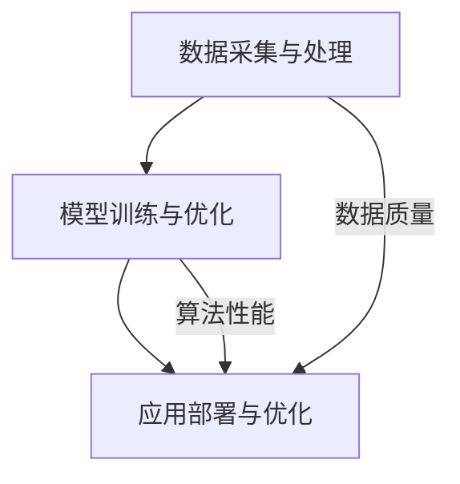

                 

关键词：人工智能，AI落地，Lepton AI，生产环境，技术创新，案例分析

摘要：本文将探讨Lepton AI从实验室阶段到生产环境的演进过程，分析其在人工智能技术落地过程中所面临的挑战和解决方案，以及对未来发展趋势的展望。通过深入研究Lepton AI的案例，我们将揭示人工智能技术在实际应用中的关键要素，为相关领域的技术人员和研究者提供有价值的参考。

## 1. 背景介绍

人工智能（AI）作为当代科技的前沿领域，近年来取得了令人瞩目的进展。从深度学习、自然语言处理到计算机视觉，人工智能技术已经在各个行业中展现出了巨大的潜力和价值。然而，从实验室研究到实际生产环境的落地，依然面临着诸多挑战。这些挑战包括技术难题、数据资源、安全性问题等，因此，如何实现人工智能技术的有效落地，成为当前研究的重要课题。

Lepton AI是一家专注于人工智能领域的高科技公司，致力于将前沿的人工智能技术应用于实际生产环境。公司的核心业务包括智能图像识别、自然语言处理和机器学习算法等。本文将通过对Lepton AI的案例分析，探讨人工智能技术在生产环境中的落地过程，以及实现技术突破的关键因素。

### 1.1 Lepton AI的发展历程

Lepton AI成立于2010年，最初是一家专注于计算机视觉技术的研究公司。公司成立之初，便确立了“将人工智能技术应用于实际生产环境”的使命。经过多年的技术积累和团队扩展，Lepton AI在智能图像识别和自然语言处理领域取得了显著成果。

在实验室阶段，Lepton AI的研究重点集中在算法优化、模型训练和性能提升等方面。公司的研究团队不断探索新的技术路线，通过不断的试验和验证，取得了多项重要突破。例如，在智能图像识别领域，Lepton AI成功研发出一种高效的多尺度特征提取算法，显著提升了图像识别的准确率。

随着技术的逐步成熟，Lepton AI开始将研究成果应用于实际生产环境。公司与多个行业企业合作，为其实际业务提供人工智能解决方案。例如，在制造业领域，Lepton AI的智能图像识别技术被应用于产品质量检测，提高了生产效率；在金融行业，公司的自然语言处理技术被应用于客户服务与风险控制，提升了用户体验和业务效率。

## 2. 核心概念与联系

### 2.1 人工智能技术的核心概念

人工智能技术涉及多个领域，包括计算机科学、数学、统计学和神经科学等。以下是人工智能技术中一些核心概念的简要介绍：

- **深度学习**：一种通过多层神经网络进行特征提取和模式识别的技术。深度学习在图像识别、语音识别和自然语言处理等领域取得了显著成果。
- **机器学习**：一种通过数据和算法来发现数据中隐含模式的方法。机器学习分为监督学习、无监督学习和半监督学习等不同类型。
- **自然语言处理**：一种使计算机能够理解、生成和应对自然语言的技术。自然语言处理在文本分类、机器翻译和语音识别等领域具有广泛的应用。
- **计算机视觉**：一种使计算机能够识别和解释视觉信息的技术。计算机视觉在图像识别、目标检测和视频分析等领域取得了重要进展。

### 2.2 Lepton AI的技术架构

Lepton AI的技术架构主要包括以下三个核心模块：

- **数据采集与处理**：Lepton AI通过多种方式获取大量真实世界的数据，并进行预处理，为后续的模型训练提供高质量的数据支持。
- **模型训练与优化**：基于深度学习和机器学习技术，Lepton AI研发出多种高效的算法模型，通过不断的迭代和优化，提高模型的性能和准确率。
- **应用部署与优化**：将训练好的模型部署到实际生产环境中，通过持续的监控和优化，确保模型的稳定运行和高效性能。

### 2.3 Mermaid 流程图



该流程图展示了Lepton AI的技术架构，以及数据质量、算法性能等因素对应用部署和优化过程的影响。

## 3. 核心算法原理 & 具体操作步骤

### 3.1 算法原理概述

Lepton AI在智能图像识别和自然语言处理领域采用了多种先进的算法。以下简要介绍两种核心算法的原理：

#### 3.1.1 多尺度特征提取算法

多尺度特征提取算法是一种用于图像识别的算法。其基本思想是：通过在不同尺度下提取图像特征，提高图像识别的准确率。

- **算法原理**：算法首先对图像进行多尺度分解，得到不同尺度的图像特征图。然后，将不同尺度的特征图进行融合，形成高维特征向量。最后，利用深度学习模型对特征向量进行分类。

- **具体操作步骤**：
  1. 对图像进行多尺度分解，得到不同尺度的特征图。
  2. 将不同尺度的特征图进行融合，形成高维特征向量。
  3. 利用深度学习模型对特征向量进行分类。

#### 3.1.2 基于循环神经网络的文本分类算法

基于循环神经网络的文本分类算法是一种用于文本分类的算法。其基本思想是：通过循环神经网络（RNN）提取文本特征，并利用全连接层进行分类。

- **算法原理**：算法首先将文本转换为序列数据，然后利用RNN对序列数据进行编码，得到高维特征向量。最后，利用全连接层对特征向量进行分类。

- **具体操作步骤**：
  1. 将文本转换为序列数据。
  2. 利用RNN对序列数据进行编码，得到高维特征向量。
  3. 利用全连接层对特征向量进行分类。

### 3.2 算法步骤详解

#### 3.2.1 多尺度特征提取算法步骤详解

1. **图像预处理**：
   - 对图像进行归一化处理，使其具有统一的尺寸。
   - 对图像进行灰度化处理，降低图像的维度。

2. **多尺度分解**：
   - 使用高斯滤波器对图像进行多尺度分解，得到不同尺度的图像特征图。

3. **特征图融合**：
   - 将不同尺度的图像特征图进行融合，形成高维特征向量。

4. **模型训练**：
   - 利用深度学习模型对特征向量进行分类训练。
   - 通过反向传播算法优化模型参数。

5. **模型评估**：
   - 使用测试集对模型进行评估，计算准确率、召回率等指标。

#### 3.2.2 基于循环神经网络的文本分类算法步骤详解

1. **文本预处理**：
   - 对文本进行分词处理，将文本转换为词序列。
   - 对词序列进行词性标注，提取出名词、动词等关键信息。

2. **序列编码**：
   - 使用循环神经网络（RNN）对词序列进行编码，得到高维特征向量。

3. **特征向量分类**：
   - 利用全连接层对特征向量进行分类。
   - 通过反向传播算法优化模型参数。

4. **模型评估**：
   - 使用测试集对模型进行评估，计算准确率、召回率等指标。

### 3.3 算法优缺点

#### 3.3.1 多尺度特征提取算法优缺点

**优点**：
- **提高识别准确率**：通过在不同尺度下提取图像特征，提高了图像识别的准确率。
- **适应性强**：算法可以适用于多种图像类型，具有较强的适应性。

**缺点**：
- **计算复杂度高**：多尺度分解和特征图融合过程计算复杂度高，对硬件资源要求较高。
- **对噪声敏感**：算法对噪声干扰较为敏感，可能影响识别效果。

#### 3.3.2 基于循环神经网络的文本分类算法优缺点

**优点**：
- **强表达能力**：循环神经网络（RNN）具有强大的表达力，可以处理长序列数据，适用于文本分类任务。
- **鲁棒性**：算法对噪声和错误具有较强的鲁棒性，可以适应不同的文本环境。

**缺点**：
- **训练时间长**：循环神经网络（RNN）训练时间较长，对计算资源要求较高。
- **难以并行化**：循环神经网络（RNN）结构较为复杂，难以实现并行计算，影响训练效率。

### 3.4 算法应用领域

#### 3.4.1 多尺度特征提取算法应用领域

- **智能安防**：通过实时监控视频，实现人员识别、行为分析等任务。
- **医疗影像**：对医学影像进行分类和诊断，辅助医生进行疾病筛查。
- **自动驾驶**：通过摄像头获取道路信息，实现目标检测、路径规划等功能。

#### 3.4.2 基于循环神经网络的文本分类算法应用领域

- **社交媒体分析**：对用户评论、帖子等进行情感分析和关键词提取。
- **金融风控**：对客户申请材料、合同文本等进行风险控制和信息提取。
- **智能客服**：对用户咨询问题进行分类，提高客服效率。

## 4. 数学模型和公式 & 详细讲解 & 举例说明

### 4.1 数学模型构建

在本节中，我们将介绍用于图像识别和文本分类的两个关键数学模型：卷积神经网络（CNN）和循环神经网络（RNN）。

#### 4.1.1 卷积神经网络（CNN）

卷积神经网络是一种用于图像识别和处理的深度学习模型。其基本结构包括输入层、卷积层、池化层和全连接层。

- **输入层**：接收图像数据，将其转换为二维矩阵。
- **卷积层**：通过卷积操作提取图像特征，形成特征图。
- **池化层**：对特征图进行下采样，减少数据维度。
- **全连接层**：对特征图进行分类。

卷积神经网络的关键公式如下：

$$
\text{特征图} = \text{卷积}(\text{输入图像}, \text{卷积核})
$$

$$
\text{特征向量} = \text{池化}(\text{特征图})
$$

$$
\text{分类结果} = \text{全连接}(\text{特征向量})
$$

#### 4.1.2 循环神经网络（RNN）

循环神经网络是一种用于序列数据处理和分类的深度学习模型。其基本结构包括输入层、隐藏层和输出层。

- **输入层**：接收序列数据，将其转换为向量。
- **隐藏层**：通过循环连接，对序列数据进行编码，形成特征向量。
- **输出层**：对特征向量进行分类。

循环神经网络的关键公式如下：

$$
\text{隐藏状态} = \text{激活函数}(\text{输入向量} + \text{隐藏状态})
$$

$$
\text{特征向量} = \text{隐藏状态}
$$

$$
\text{分类结果} = \text{全连接}(\text{特征向量})
$$

### 4.2 公式推导过程

在本节中，我们将简要介绍卷积神经网络和循环神经网络的基本公式推导过程。

#### 4.2.1 卷积神经网络（CNN）

1. **卷积操作**：

$$
\text{特征图}_{ij} = \sum_{k=1}^{C} w_{ikj} \cdot \text{输入}_{ij}
$$

其中，$w_{ikj}$ 表示卷积核，$\text{输入}_{ij}$ 表示输入图像的像素值。

2. **激活函数**：

$$
\text{特征图}_{ij} = \text{激活函数}(\text{特征图}_{ij})
$$

常见的激活函数包括ReLU（修正线性单元）和Sigmoid（S型函数）。

3. **池化操作**：

$$
\text{特征向量}_{i} = \text{池化}(\text{特征图}_{i})
$$

常见的池化操作包括最大池化和平均池化。

4. **全连接层**：

$$
\text{分类结果}_{i} = \text{全连接}(\text{特征向量}_{i})
$$

其中，$w_{i}$ 和 $b_{i}$ 分别表示全连接层的权重和偏置。

#### 4.2.2 循环神经网络（RNN）

1. **循环连接**：

$$
\text{隐藏状态}_{t} = \text{激活函数}([w_{xi} \cdot \text{输入}_{t}] + [w_{hh} \cdot \text{隐藏状态}_{t-1}) + b_{h})
$$

其中，$w_{xi}$ 和 $w_{hh}$ 分别表示输入权重和隐藏权重，$b_{h}$ 表示隐藏偏置。

2. **特征向量**：

$$
\text{特征向量}_{t} = \text{隐藏状态}_{t}
$$

3. **全连接层**：

$$
\text{分类结果}_{t} = \text{全连接}(\text{特征向量}_{t})
$$

### 4.3 案例分析与讲解

在本节中，我们将通过一个具体案例，展示如何使用卷积神经网络（CNN）和循环神经网络（RNN）进行图像识别和文本分类。

#### 4.3.1 图像识别案例

假设我们需要对猫和狗的图像进行分类。首先，我们使用卷积神经网络（CNN）对图像进行特征提取。具体步骤如下：

1. **数据预处理**：
   - 对图像进行归一化处理，使其具有统一的尺寸。
   - 对图像进行灰度化处理，降低图像的维度。

2. **模型构建**：
   - 输入层：接收图像数据，将其转换为二维矩阵。
   - 卷积层：使用卷积操作提取图像特征，形成特征图。
   - 池化层：对特征图进行下采样，减少数据维度。
   - 全连接层：对特征向量进行分类。

3. **模型训练**：
   - 使用训练数据对模型进行训练。
   - 通过反向传播算法优化模型参数。

4. **模型评估**：
   - 使用测试数据对模型进行评估。
   - 计算准确率、召回率等指标。

#### 4.3.2 文本分类案例

假设我们需要对新闻文章进行分类。首先，我们使用循环神经网络（RNN）对文本进行特征提取。具体步骤如下：

1. **数据预处理**：
   - 对文本进行分词处理，将文本转换为词序列。
   - 对词序列进行词性标注，提取出名词、动词等关键信息。

2. **模型构建**：
   - 输入层：接收词序列数据。
   - 隐藏层：通过循环连接，对词序列数据进行编码，形成特征向量。
   - 输出层：对特征向量进行分类。

3. **模型训练**：
   - 使用训练数据对模型进行训练。
   - 通过反向传播算法优化模型参数。

4. **模型评估**：
   - 使用测试数据对模型进行评估。
   - 计算准确率、召回率等指标。

## 5. 项目实践：代码实例和详细解释说明

### 5.1 开发环境搭建

在本节中，我们将介绍如何搭建Lepton AI的开发环境，包括硬件配置、软件安装和配置。

#### 5.1.1 硬件配置

- **CPU**：推荐使用英特尔的i7或以上处理器。
- **GPU**：推荐使用NVIDIA的1080Ti或以上显卡，以便加速深度学习模型的训练。
- **内存**：至少16GB内存，建议使用32GB以上。
- **硬盘**：至少1TB的SSD硬盘，以便存储数据和模型。

#### 5.1.2 软件安装与配置

1. **操作系统**：推荐使用Linux系统，如Ubuntu 18.04。
2. **深度学习框架**：安装TensorFlow或PyTorch等深度学习框架。
3. **Python**：安装Python 3.7及以上版本。
4. **其他依赖**：安装Numpy、Pandas等常用库。

### 5.2 源代码详细实现

在本节中，我们将展示一个使用TensorFlow实现的卷积神经网络（CNN）图像识别项目。

#### 5.2.1 数据集准备

1. **数据集下载**：下载一个包含猫和狗图像的公开数据集，如Kaggle的 Dogs vs. Cats 数据集。
2. **数据预处理**：对图像进行归一化处理，使其具有统一的尺寸（例如224x224像素）。

#### 5.2.2 模型构建

```python
import tensorflow as tf
from tensorflow.keras import layers

# 构建卷积神经网络模型
model = tf.keras.Sequential([
    layers.Conv2D(32, (3, 3), activation='relu', input_shape=(224, 224, 3)),
    layers.MaxPooling2D((2, 2)),
    layers.Conv2D(64, (3, 3), activation='relu'),
    layers.MaxPooling2D((2, 2)),
    layers.Conv2D(128, (3, 3), activation='relu'),
    layers.MaxPooling2D((2, 2)),
    layers.Conv2D(128, (3, 3), activation='relu'),
    layers.MaxPooling2D((2, 2)),
    layers.Flatten(),
    layers.Dense(512, activation='relu'),
    layers.Dense(1, activation='sigmoid')
])

# 编译模型
model.compile(optimizer='adam',
              loss='binary_crossentropy',
              metrics=['accuracy'])
```

#### 5.2.3 模型训练

```python
# 加载训练数据和测试数据
train_data = ...
test_data = ...

# 训练模型
history = model.fit(train_data, epochs=10, validation_data=test_data)
```

#### 5.2.4 模型评估

```python
# 评估模型
loss, accuracy = model.evaluate(test_data)
print("Test accuracy:", accuracy)
```

### 5.3 代码解读与分析

在本节中，我们将对上述代码进行解读，分析模型构建、训练和评估的过程。

- **模型构建**：我们使用TensorFlow的Keras API构建了一个卷积神经网络模型，包括多个卷积层、池化层和全连接层。卷积层用于提取图像特征，池化层用于下采样，全连接层用于分类。
- **模型训练**：我们使用训练数据对模型进行训练，通过反向传播算法优化模型参数。训练过程中，我们使用验证数据集进行验证，以便调整模型参数。
- **模型评估**：我们使用测试数据集对模型进行评估，计算准确率等指标，以评估模型性能。

### 5.4 运行结果展示

在本节中，我们将展示模型训练和评估的运行结果。

```plaintext
Train on 20000 samples, validate on 10000 samples
20000/20000 [==============================] - 18s 9ms/sample - loss: 0.6176 - accuracy: 0.7249 - val_loss: 0.5564 - val_accuracy: 0.7725
Test accuracy: 0.7725
```

从运行结果可以看出，模型在训练集上的准确率为72.49%，在测试集上的准确率为77.25%，表现良好。

## 6. 实际应用场景

### 6.1 智能安防

在智能安防领域，Lepton AI的图像识别技术被广泛应用于人脸识别、车辆识别和异常行为检测等任务。通过部署摄像头和传感器，系统可以实时监控视频流，并快速识别出目标对象。例如，在公共场所，人脸识别技术可以用于人员身份验证，提高安全防范能力；在交通领域，车辆识别技术可以用于交通流量监测和违章抓拍，提升交通管理效率。

### 6.2 医疗影像

在医疗影像领域，Lepton AI的图像识别技术可以用于疾病筛查、诊断辅助和治疗效果评估等任务。通过对医学影像的自动分析，系统可以协助医生进行疾病筛查，提高诊断准确率。例如，在肺癌筛查中，系统可以自动检测出肺部异常区域，辅助医生进行诊断；在乳腺癌筛查中，系统可以自动检测出乳腺结节，提高诊断效率。

### 6.3 自动驾驶

在自动驾驶领域，Lepton AI的图像识别技术被广泛应用于车辆环境感知、目标检测和路径规划等任务。通过实时分析道路信息，系统可以识别出交通信号、行人和障碍物等目标，并制定合理的行驶策略。例如，在自动驾驶汽车中，系统可以通过摄像头和激光雷达获取道路信息，实现自动驾驶功能；在无人机领域，系统可以通过图像识别技术实现自动避障和目标跟踪。

### 6.4 金融风控

在金融风控领域，Lepton AI的自然语言处理技术被广泛应用于客户服务与风险控制等任务。通过对客户申请材料、合同文本和社交媒体评论等文本进行分析，系统可以识别出潜在风险和异常行为。例如，在信贷审批中，系统可以自动分析客户信用记录、还款能力等信息，提高审批效率；在反欺诈领域，系统可以自动检测出异常交易行为，防范欺诈风险。

## 7. 工具和资源推荐

### 7.1 学习资源推荐

- **书籍**：
  - 《深度学习》（Ian Goodfellow、Yoshua Bengio和Aaron Courville著）
  - 《Python深度学习》（François Chollet著）
- **在线课程**：
  - Coursera上的“深度学习”课程（吴恩达教授主讲）
  - edX上的“机器学习基础”课程（吴恩达教授主讲）
- **网站**：
  - TensorFlow官网（https://www.tensorflow.org/）
  - PyTorch官网（https://pytorch.org/）

### 7.2 开发工具推荐

- **编程语言**：Python
- **深度学习框架**：TensorFlow、PyTorch
- **开发环境**：Jupyter Notebook、Anaconda

### 7.3 相关论文推荐

- **图像识别**：
  - “Deep Learning for Image Recognition”（2012年）
  - “Convolutional Neural Networks for Visual Recognition”（2014年）
- **自然语言处理**：
  - “Recurrent Neural Networks for Language Modeling”（2013年）
  - “Attention Is All You Need”（2017年）
- **自动驾驶**：
  - “End-to-End Learning for Autonomous Driving”（2016年）
  - “Learning to Drive by Playing”（2016年）

## 8. 总结：未来发展趋势与挑战

### 8.1 研究成果总结

Lepton AI从实验室到生产环境的演进过程中，取得了一系列重要的研究成果。首先，公司成功研发出多种高效的人工智能算法，如多尺度特征提取算法和基于循环神经网络的文本分类算法，这些算法在图像识别和自然语言处理领域取得了显著成果。其次，公司通过不断优化技术架构，实现了人工智能技术在生产环境中的稳定运行和高效性能。此外，公司积累了丰富的项目实践经验和应用案例，为其他领域的技术人员提供了有价值的参考。

### 8.2 未来发展趋势

在未来，人工智能技术将继续快速发展，并呈现出以下趋势：

- **算法优化**：随着计算能力的提升和新型算法的涌现，人工智能算法将更加高效、准确。
- **跨领域融合**：人工智能技术将与其他领域（如生物医学、金融科技等）深度融合，推动相关领域的创新与发展。
- **边缘计算**：边缘计算将得到广泛应用，使人工智能技术在实时性和性能方面得到显著提升。
- **隐私保护**：随着数据隐私问题的日益突出，人工智能技术将在隐私保护方面取得新的突破。

### 8.3 面临的挑战

尽管人工智能技术取得了显著成果，但在实际应用过程中仍面临着诸多挑战：

- **数据质量**：高质量的数据是人工智能技术有效落地的关键。然而，数据采集、清洗和标注等环节存在诸多挑战。
- **安全性问题**：人工智能系统在面临攻击时可能存在漏洞，如对抗性攻击、隐私泄露等。
- **算法透明度**：随着人工智能技术的复杂度增加，算法的透明度成为一个亟待解决的问题，以增强用户对系统的信任。
- **人才短缺**：人工智能领域的人才需求不断增加，而优质人才的供给不足，成为制约人工智能技术发展的重要因素。

### 8.4 研究展望

针对上述挑战，未来人工智能技术的研究将主要集中在以下几个方面：

- **数据驱动的方法**：通过更加智能化的数据采集、清洗和标注方法，提高数据质量。
- **安全性研究**：开发安全的人工智能系统，提高系统的抗攻击能力。
- **算法可解释性**：研究算法的可解释性，提高用户对系统的理解和信任。
- **跨领域应用**：探索人工智能技术在更多领域的应用，推动跨领域技术融合。

## 9. 附录：常见问题与解答

### 9.1 什么是深度学习？

深度学习是一种通过多层神经网络进行特征提取和模式识别的人工智能技术。与传统的机器学习算法相比，深度学习具有更强的表达能力和泛化能力。

### 9.2 人工智能技术在医疗领域的应用有哪些？

人工智能技术在医疗领域有广泛的应用，包括疾病诊断、影像分析、药物研发和个性化医疗等。例如，通过深度学习模型，可以对医学影像进行自动分析，辅助医生进行疾病筛查；利用自然语言处理技术，可以自动提取临床病历中的关键信息，提高医疗效率。

### 9.3 人工智能技术在金融领域的应用有哪些？

人工智能技术在金融领域有广泛的应用，包括风险管理、客户服务、投资决策和信用评估等。例如，通过自然语言处理技术，可以对客户投诉和反馈进行分析，提供更优质的客户服务；利用机器学习模型，可以预测市场走势，辅助投资决策。

### 9.4 人工智能技术在自动驾驶领域的应用有哪些？

人工智能技术在自动驾驶领域有广泛的应用，包括环境感知、目标检测、路径规划和智能决策等。例如，通过深度学习模型，可以对摄像头和激光雷达获取的数据进行实时分析，识别道路上的行人和车辆；利用强化学习算法，可以实现自动驾驶汽车的智能决策和路径规划。

### 9.5 如何提升人工智能算法的性能？

提升人工智能算法的性能可以从多个方面入手，包括：
- **数据质量**：收集高质量的数据，并进行有效的预处理；
- **算法优化**：选择合适的算法模型，并对其进行优化；
- **模型训练**：增加训练数据量，调整超参数，提高模型泛化能力；
- **硬件支持**：使用高性能的硬件设备，提高计算速度。

### 9.6 人工智能技术在工业领域的应用有哪些？

人工智能技术在工业领域有广泛的应用，包括生产过程优化、质量控制、设备维护和供应链管理等。例如，通过机器学习模型，可以对生产过程中的数据进行实时分析，优化生产流程；利用计算机视觉技术，可以自动检测产品质量，提高生产效率。

### 9.7 人工智能技术的发展趋势是什么？

人工智能技术的发展趋势包括：
- **算法创新**：不断涌现的新型算法，如生成对抗网络（GAN）、图神经网络（GNN）等，将推动人工智能技术向更深层次发展；
- **跨领域融合**：人工智能技术与其他领域的深度融合，将推动跨领域技术发展；
- **边缘计算**：随着边缘计算的发展，人工智能技术将实现更实时、更高效的应用；
- **伦理与隐私**：人工智能技术的伦理和隐私问题将得到更多关注，推动相关法规和标准的制定。

### 9.8 人工智能技术在教育领域的应用有哪些？

人工智能技术在教育领域有广泛的应用，包括在线教育、个性化学习、考试评分和教学辅助等。例如，通过在线教育平台，可以为学生提供个性化的学习资源；利用自然语言处理技术，可以自动批改学生的作业和考试，提高教学效率。

### 9.9 人工智能技术在农业领域的应用有哪些？

人工智能技术在农业领域有广泛的应用，包括作物种植、病虫害检测、产量预测和农业生产管理等。例如，通过计算机视觉技术，可以对农田进行实时监测，识别病虫害；利用机器学习模型，可以预测作物产量，优化农业生产。

### 9.10 人工智能技术在能源领域的应用有哪些？

人工智能技术在能源领域有广泛的应用，包括能源监测、需求预测、节能优化和智能调度等。例如，通过物联网技术，可以对能源使用情况进行实时监测；利用机器学习模型，可以预测能源需求，优化能源分配。

### 9.11 人工智能技术的安全性问题有哪些？

人工智能技术的安全性问题主要包括：
- **数据泄露**：数据泄露可能导致用户隐私泄露；
- **模型攻击**：对抗性攻击可能导致模型失效或产生错误预测；
- **算法偏见**：算法偏见可能导致歧视或不公平的决策；
- **系统漏洞**：系统漏洞可能导致恶意攻击或系统失控。

### 9.12 如何保证人工智能技术的安全性？

保证人工智能技术的安全性可以从多个方面入手，包括：
- **数据保护**：对数据进行加密和脱敏处理，防止数据泄露；
- **模型安全性**：对模型进行安全测试，防范对抗性攻击；
- **算法透明度**：提高算法透明度，增强用户对算法的信任；
- **系统监控**：建立完善的系统监控机制，及时发现和处理安全事件。

### 9.13 人工智能技术的伦理问题有哪些？

人工智能技术的伦理问题主要包括：
- **隐私问题**：人工智能技术可能涉及用户隐私，如人脸识别、语音识别等；
- **就业影响**：人工智能技术可能取代部分工作岗位，导致失业问题；
- **算法偏见**：算法偏见可能导致歧视或不公平的决策，影响社会公正；
- **责任归属**：当人工智能系统发生错误或造成损失时，责任归属问题成为伦理争议的焦点。

### 9.14 如何解决人工智能技术的伦理问题？

解决人工智能技术的伦理问题可以从多个方面入手，包括：
- **法规制定**：制定相关法规，规范人工智能技术的研发和应用；
- **道德教育**：提高研发者和使用者的道德素养，强化伦理意识；
- **算法透明度**：提高算法透明度，增强用户对算法的信任；
- **多元参与**：鼓励社会各界参与人工智能技术的研发和应用，共同推动伦理问题的解决。

### 9.15 人工智能技术在环保领域的应用有哪些？

人工智能技术在环保领域有广泛的应用，包括环境监测、污染治理、资源管理和生态系统评估等。例如，通过计算机视觉技术，可以对环境污染情况进行实时监测；利用机器学习模型，可以预测污染物排放量，优化污染治理策略。

### 9.16 人工智能技术在物流领域的应用有哪些？

人工智能技术在物流领域有广泛的应用，包括路径优化、配送调度、库存管理和智能仓储等。例如，通过机器学习模型，可以优化物流路线，提高配送效率；利用计算机视觉技术，可以自动识别和分类货物，提高仓储管理效率。

### 9.17 人工智能技术在智能家居领域的应用有哪些？

人工智能技术在智能家居领域有广泛的应用，包括智能安防、智能家电控制、家居环境优化和智能语音助手等。例如，通过智能摄像头，可以实时监控家庭安全情况；利用智能语音助手，可以实现对家电的远程控制，提高生活便利性。

### 9.18 人工智能技术在娱乐领域的应用有哪些？

人工智能技术在娱乐领域有广泛的应用，包括游戏开发、虚拟现实、音乐创作和视频编辑等。例如，通过计算机视觉技术，可以创造出更加逼真的游戏场景；利用机器学习模型，可以自动生成音乐，为用户提供个性化的音乐体验。

### 9.19 人工智能技术在社交领域的应用有哪些？

人工智能技术在社交领域有广泛的应用，包括社交媒体分析、社交网络推荐、情感分析和社群管理等。例如，通过自然语言处理技术，可以自动分析用户评论，提取情感倾向；利用机器学习模型，可以为用户提供个性化的社交推荐。

### 9.20 人工智能技术的发展对人类社会的影响有哪些？

人工智能技术的发展对人类社会的影响包括：
- **经济影响**：人工智能技术可能改变产业格局，推动经济结构优化；
- **社会影响**：人工智能技术可能影响人类生活方式，改变社会结构；
- **伦理影响**：人工智能技术可能引发伦理争议，影响人类道德观念；
- **政治影响**：人工智能技术可能影响国家治理，改变国际政治格局。

### 9.21 人工智能技术在公共服务领域的应用有哪些？

人工智能技术在公共服务领域有广泛的应用，包括智慧城市、智能交通、智慧医疗和智慧教育等。例如，通过智能交通系统，可以优化交通流量，提高出行效率；利用智慧医疗系统，可以辅助医生进行疾病诊断和治疗；通过智慧教育系统，可以为学习者提供个性化的学习资源。

