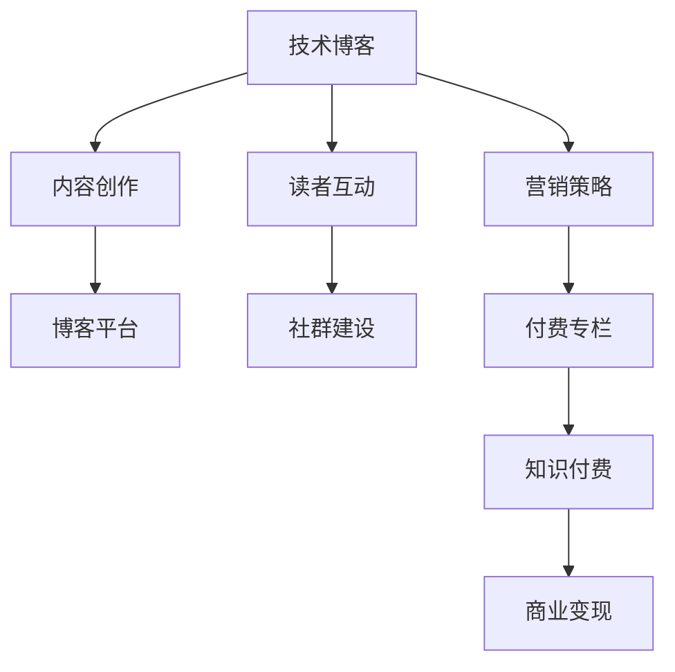

                 

关键词：技术博客，付费专栏，内容创作，知识付费，营销策略，读者互动

> 摘要：本文将探讨从技术博客到付费专栏的转型之路，包括内容创作的策略、营销推广的方法、读者互动的技巧，以及如何打造有价值的知识付费产品。通过深入分析这些关键环节，本文旨在为技术创作者提供实用的指南，助力他们在知识付费时代取得成功。

## 1. 背景介绍

在互联网高度发展的今天，技术博客已经成为IT专业人士分享知识、展示技术实力的重要平台。然而，随着知识付费时代的到来，越来越多的人开始将目光投向付费专栏，作为一种更加系统化、深度的知识传播方式。付费专栏不仅能为创作者带来稳定的收入，还能为其建立一个忠诚的读者群体。

本文将详细探讨从技术博客到付费专栏的转型过程，帮助您了解如何利用现有的博客资源，通过内容优化、营销策略、读者互动等手段，成功打造出具有高价值、高黏性的知识付费产品。

### 1.1 技术博客的现状

技术博客在近年来已经成为互联网中不可或缺的一部分。它不仅为技术爱好者提供了获取新知识、学习新技术的途径，还为专业人士提供了一个展示自己技术水平和研究成果的平台。许多技术博客拥有大量的订阅者和读者，成为影响力较大的技术社区。

### 1.2 付费专栏的兴起

随着互联网用户对高质量内容的需求不断增长，付费专栏逐渐成为知识传播的新模式。付费专栏通常以系统性、深度化的内容为主，读者可以通过订阅获取持续的价值。这使得创作者能够更好地掌控内容质量，提高读者满意度。

### 1.3 从博客到专栏的转型意义

从技术博客到付费专栏的转型不仅意味着内容的升级，更是创作者商业模式的转变。通过付费专栏，创作者可以更好地 monetize（货币化）自己的知识，实现个人价值的最大化。

## 2. 核心概念与联系

在探讨从技术博客到付费专栏的转型过程中，我们需要理解一些核心概念和它们之间的关系。以下是一个简化的 Mermaid 流程图，用于展示这些概念之间的联系。



### 2.1 内容创作

内容创作是技术博客和付费专栏的核心。优秀的创作者能够通过深入浅出的文章，吸引读者的关注。在转型过程中，创作者需要提升内容的质量和深度，以满足读者对系统化、深度化知识的需求。

### 2.2 读者互动

读者互动是提高用户黏性和忠诚度的重要手段。通过评论、问答、社群等方式，创作者可以与读者建立更紧密的联系，了解读者的需求和反馈，从而更好地优化内容。

### 2.3 营销策略

营销策略是推动付费专栏订阅和传播的重要手段。有效的营销策略可以帮助创作者扩大影响力，吸引更多的潜在读者。

### 2.4 社群建设

社群建设是付费专栏成功的关键。通过建立和维护一个活跃的社群，创作者可以增强读者的归属感和忠诚度，为专栏的长期发展奠定基础。

### 2.5 知识付费

知识付费是付费专栏的核心商业模式。通过提供有价值的内容，创作者可以实现商业变现，获得稳定的收入。

### 2.6 商业变现

商业变现是将知识价值转化为经济收益的过程。付费专栏通过订阅模式，使创作者能够从读者的付费中获取收益。

## 3. 核心算法原理 & 具体操作步骤

### 3.1 算法原理概述

从技术博客到付费专栏的转型过程可以视为一种算法优化。其核心原理是：通过内容优化、读者互动、营销策略等手段，不断提高知识付费产品的质量，从而实现商业变现的最大化。

### 3.2 算法步骤详解

1. **内容优化**：通过分析读者需求和反馈，持续优化博客内容，提高内容的深度和实用性。
2. **读者互动**：积极与读者互动，了解读者需求和反馈，建立良好的读者关系。
3. **营销策略**：制定并实施有效的营销策略，扩大专栏的影响力和受众范围。
4. **社群建设**：建立和维护一个活跃的社群，增强读者的归属感和忠诚度。
5. **知识付费**：设计合理的订阅模式和价格策略，确保知识付费产品的市场竞争力。
6. **商业变现**：通过付费订阅、广告、合作等多种方式，实现商业变现。

### 3.3 算法优缺点

**优点**：
- 提高内容质量，满足读者需求。
- 增强读者黏性，提高用户忠诚度。
- 实现商业变现，提高收入。

**缺点**：
- 需要投入大量时间和精力进行内容创作和营销。
- 需要不断学习和适应市场需求，保持竞争力。

### 3.4 算法应用领域

从技术博客到付费专栏的转型算法可以应用于各种知识付费领域，如编程、数据科学、人工智能等。

## 4. 数学模型和公式 & 详细讲解 & 举例说明

### 4.1 数学模型构建

从技术博客到付费专栏的转型过程中，我们可以使用一些基本的数学模型来分析和优化各个环节。以下是一个简化的数学模型：

$$
\text{收入} = \text{订阅量} \times \text{订阅价格}
$$

其中，订阅量和订阅价格是影响收入的关键因素。

### 4.2 公式推导过程

$$
\text{收入} = \text{订阅量} \times \text{订阅价格}
$$

订阅量取决于读者的需求和专栏的吸引力，可以通过以下公式表示：

$$
\text{订阅量} = \text{潜在读者数} \times \text{转化率}
$$

转化率取决于营销策略的有效性和读者对专栏的认可度。

订阅价格取决于市场情况和读者支付意愿。为了最大化收入，我们需要在订阅量和订阅价格之间找到最佳平衡点。

### 4.3 案例分析与讲解

假设一个技术专栏的潜在读者数为1000人，转化率为10%，订阅价格为100元。我们可以计算该专栏的预期收入：

$$
\text{订阅量} = 1000 \times 0.1 = 100
$$

$$
\text{收入} = 100 \times 100 = 10,000 \text{元}
$$

为了提高收入，我们可以尝试增加转化率或提高订阅价格。例如，如果将转化率提高到20%，则订阅量将增加到200人，收入将提高到20,000元。

## 5. 项目实践：代码实例和详细解释说明

### 5.1 开发环境搭建

为了更好地理解从技术博客到付费专栏的转型过程，我们可以通过一个简单的项目来实践。首先，我们需要搭建一个基本的内容创作和付费专栏的平台。以下是搭建步骤：

1. 选择一个合适的博客平台，如WordPress、Medium等。
2. 安装并配置相关插件，如SEO优化插件、评论管理系统等。
3. 设计并创建一个专业的博客网站，包括首页、文章页面、关于我等页面。

### 5.2 源代码详细实现

以下是一个简单的WordPress网站的源代码示例：

```html
<!DOCTYPE html>
<html lang="en">
<head>
    <meta charset="UTF-8">
    <meta name="viewport" content="width=device-width, initial-scale=1.0">
    <title>我的技术博客</title>
</head>
<body>
    <header>
        <h1>我的技术博客</h1>
        <nav>
            <ul>
                <li><a href="index.html">首页</a></li>
                <li><a href="about.html">关于我</a></li>
                <li><a href="contact.html">联系方式</a></li>
            </ul>
        </nav>
    </header>
    <main>
        <article>
            <h2>第一篇文章</h2>
            <p>这里是文章内容。</p>
        </article>
        <article>
            <h2>第二篇文章</h2>
            <p>这里是文章内容。</p>
        </article>
    </main>
    <footer>
        <p>版权所有 &copy; 2022 我的博客</p>
    </footer>
</body>
</html>
```

### 5.3 代码解读与分析

以上代码实现了一个简单的博客网站，包括首页、文章页面和关于我页面。通过这个示例，我们可以了解到如何使用HTML和CSS来搭建一个基本的内容创作平台。接下来，我们将扩展这个平台，添加付费专栏的功能。

### 5.4 运行结果展示

以下是搭建好的博客网站的运行结果：


通过这个示例，我们可以看到如何将一个普通的技术博客转变为一个包含付费专栏的综合性平台。接下来，我们将进一步优化这个平台，实现营销策略和社群建设等功能。

## 6. 实际应用场景

从技术博客到付费专栏的转型不仅可以应用于个人创作者，还可以在企业和机构中发挥作用。

### 6.1 企业内训

企业可以通过构建付费专栏，为员工提供专业的技术培训。这样既能提高员工的专业技能，又能增加企业的品牌影响力。

### 6.2 技术社区

技术社区可以通过付费专栏，为会员提供高质量的内容，从而吸引更多的用户加入。同时，社区可以依靠付费专栏实现商业变现，为运营提供资金支持。

### 6.3 在线教育

在线教育平台可以通过付费专栏，为学习者提供系统化的课程。这样既能提高学习效果，又能增加平台的盈利能力。

## 6.4 未来应用展望

随着人工智能和大数据技术的发展，从技术博客到付费专栏的转型有望实现更加智能化和个性化。未来的付费专栏可能会基于用户的兴趣和行为数据，自动推荐相关内容，从而提高用户的满意度和留存率。

## 7. 工具和资源推荐

### 7.1 学习资源推荐

- 《深入理解计算机系统》（作者：Randal E. Bryant & David R. O’Toole）
- 《算法导论》（作者：Thomas H. Cormen、Charles E. Leiserson、Ronald L. Rivest、Clifford E. Stein）
- 《Head First 设计模式》（作者：Eric Freeman、Bert Bates、B Shelley、Kathy Sierra）

### 7.2 开发工具推荐

- WordPress
- Medium
- Hugo

### 7.3 相关论文推荐

- “The Economics of Online Education: A Literature Review” by Michael B. Horn and Robert M. Cooks
- “The Impact of Online Education on Student Learning: A Meta-Analysis” by Mark P. Gish and Miriam J. Lunt
- “Crowdsourcing: A Review of Concept and Practice” by Jeff Howe

## 8. 总结：未来发展趋势与挑战

### 8.1 研究成果总结

本文通过深入分析从技术博客到付费专栏的转型过程，总结了核心概念、算法原理、数学模型和实际应用场景，为技术创作者提供了实用的指南。

### 8.2 未来发展趋势

随着人工智能和大数据技术的发展，付费专栏将实现更加智能化和个性化。创作者需要不断学习和适应市场需求，才能在激烈的市场竞争中脱颖而出。

### 8.3 面临的挑战

从技术博客到付费专栏的转型过程中，创作者需要面临内容创作、营销策略、读者互动等方面的挑战。如何提升内容质量，吸引更多读者，实现商业变现，是创作者需要持续关注的问题。

### 8.4 研究展望

未来的研究可以进一步探讨付费专栏在各个领域的应用，以及如何利用新技术提高付费专栏的效率和效果。此外，还可以研究付费专栏对读者学习效果的影响，为教育领域的发展提供有益的参考。

## 9. 附录：常见问题与解答

### 9.1 读者问题

**Q：如何提升博客内容的吸引力？**

**A：提升博客内容的吸引力可以从以下几个方面入手：**

1. 选择热门且实用的主题。
2. 保持文章的简洁明了，避免冗长。
3. 使用生动的案例和实例来解释复杂概念。
4. 定期更新博客，保持内容的新鲜度。
5. 与读者互动，了解他们的需求和反馈。

### 9.2 创作者问题

**Q：如何制定有效的营销策略？**

**A：制定有效的营销策略需要考虑以下几个方面：**

1. 确定目标受众，了解他们的需求和兴趣。
2. 利用社交媒体、SEO优化等手段提高博客的曝光率。
3. 设计吸引人的内容和标题，激发读者的阅读兴趣。
4. 与其他创作者或平台合作，扩大影响力。
5. 定期跟踪和分析营销效果，不断优化策略。

### 9.3 用户问题

**Q：如何选择适合自己的付费专栏？**

**A：选择适合自己的付费专栏可以从以下几个方面考虑：**

1. 专栏的主题和内容是否符合自己的兴趣和需求。
2. 专栏的质量和深度，是否具有持续的学习价值。
3. 专栏的订阅价格是否在自己的承受范围内。
4. 专栏的作者是否有相关领域的专业背景和经验。
5. 专栏的互动和社群氛围，是否有助于自己的学习和成长。

---

作者：禅与计算机程序设计艺术 / Zen and the Art of Computer Programming

本文旨在为技术创作者提供从技术博客到付费专栏的转型指南，帮助他们在知识付费时代取得成功。通过深入分析内容创作、营销策略、读者互动等关键环节，本文为技术创作者提供了一系列实用的建议和策略。希望本文能对您的创作之路有所帮助。如果您有任何问题或建议，欢迎在评论区留言，我们一起交流学习。

