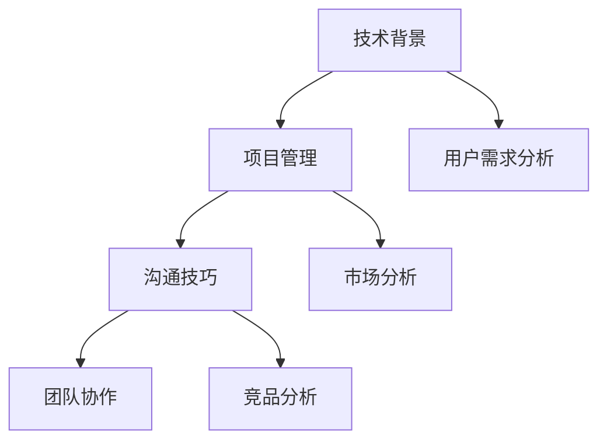

                 

关键词：技术岗位、产品经理、转型、项目管理、沟通技巧、团队协作

摘要：随着技术的不断发展，越来越多的技术人才开始关注产品经理这一职位。本文将探讨从技术岗位到产品经理的转型过程，分析所需技能、转型路径以及面临的挑战，帮助技术人才顺利实现职业生涯的升级。

## 1. 背景介绍

在当今科技行业，技术岗位与产品经理岗位之间的界限逐渐模糊。许多技术人才在积累了丰富的技术经验后，开始考虑转向产品经理这一更具综合性的角色。产品经理不仅需要具备扎实的技术背景，还要具备较强的项目管理、团队协作和沟通能力。因此，从技术岗位到产品经理的转型已成为一种趋势。

### 1.1 技术岗位与产品经理岗位的差异

技术岗位主要负责技术研发、编码、测试等工作，强调专业技能和解决问题的能力。而产品经理岗位则更多地关注产品的整体规划和设计，需要具备跨部门协调、市场分析、用户需求分析等多方面的能力。

### 1.2 转型原因

1. **职业发展**：技术岗位的发展空间相对有限，而产品经理岗位能够提供更广阔的发展机会和晋升空间。
2. **工作性质**：产品经理岗位更具挑战性，能够更好地发挥技术人才的综合素质。
3. **市场需求**：随着互联网和科技的快速发展，市场对产品经理的需求日益增加。

## 2. 核心概念与联系

### 2.1 技术背景

技术岗位的核心在于专业技能，包括编程语言、算法、数据结构、数据库等。这些技能是产品经理转型的基础。

### 2.2 项目管理

项目管理是产品经理的核心能力之一，包括项目规划、时间管理、资源分配、风险管理等。项目管理能力能够帮助技术人才更好地协调项目进度和资源。

### 2.3 沟通技巧

沟通技巧是产品经理必备的能力，包括与团队成员、上级领导、客户等多方沟通的能力。良好的沟通技巧能够提高工作效率，降低项目风险。

### 2.4 团队协作

团队协作能力是产品经理成功的关键之一，需要具备良好的团队领导能力、跨部门协作能力以及冲突解决能力。

### 2.5 Mermaid 流程图



## 3. 核心算法原理 & 具体操作步骤

### 3.1 算法原理概述

产品经理的日常工作可以看作是一个复杂的决策过程，其中涉及到多种算法原理，如数据分析、优化算法、预测模型等。这些算法原理能够帮助产品经理更好地理解用户需求、优化产品设计、提高产品性能。

### 3.2 算法步骤详解

1. **数据分析**：收集用户数据，进行分析，提取有价值的信息。
2. **优化算法**：根据数据分析结果，对产品功能进行优化。
3. **预测模型**：建立预测模型，预测用户行为和市场需求。
4. **迭代优化**：根据预测模型和用户反馈，不断迭代优化产品。

### 3.3 算法优缺点

1. **优点**：能够提高产品经理的工作效率，降低决策风险。
2. **缺点**：需要较高的数学和编程能力，且算法模型需要不断优化。

### 3.4 算法应用领域

算法原理在产品经理的日常工作中应用广泛，如用户画像、推荐系统、数据分析等。

## 4. 数学模型和公式 & 详细讲解 & 举例说明

### 4.1 数学模型构建

在产品管理中，常见的数学模型包括线性回归、逻辑回归、时间序列分析等。

### 4.2 公式推导过程

以线性回归为例，其公式为：

$$y = wx + b$$

其中，$y$ 为因变量，$x$ 为自变量，$w$ 为权重，$b$ 为偏置。

### 4.3 案例分析与讲解

假设一家公司想要预测下一季度的销售额，可以收集过去四季度的销售额数据，使用线性回归模型进行预测。

## 5. 项目实践：代码实例和详细解释说明

### 5.1 开发环境搭建

1. 安装 Python 环境
2. 安装数据分析库（如 Pandas、NumPy）
3. 安装机器学习库（如 Scikit-learn）

### 5.2 源代码详细实现

```python
import pandas as pd
from sklearn.linear_model import LinearRegression

# 加载数据
data = pd.read_csv('sales_data.csv')
X = data[['quarter']]
y = data['sales']

# 建立模型
model = LinearRegression()
model.fit(X, y)

# 预测
next_sales = model.predict([[5]])  # 下一个季度的销售额预测

print(f'下一个季度的销售额预测为：{next_sales[0]}')
```

### 5.3 代码解读与分析

代码首先加载数据，然后建立线性回归模型，最后进行预测。

### 5.4 运行结果展示

假设输入为第5个季度的数据，输出为第6个季度的销售额预测值。

## 6. 实际应用场景

### 6.1 用户画像

通过数据分析，为用户创建画像，用于个性化推荐和产品优化。

### 6.2 数据分析

利用数据分析技术，对用户行为、市场趋势进行分析，为产品优化提供数据支持。

### 6.3 预测模型

建立预测模型，预测用户行为和市场需求，为产品规划提供依据。

## 7. 工具和资源推荐

### 7.1 学习资源推荐

1. 《产品经理实战手册》
2. 《数据分析实战》
3. 《机器学习实战》

### 7.2 开发工具推荐

1. Python
2. Jupyter Notebook
3. VSCode

### 7.3 相关论文推荐

1. 《基于用户行为的数据挖掘技术》
2. 《产品经理的工作方法》
3. 《机器学习在产品优化中的应用》

## 8. 总结：未来发展趋势与挑战

### 8.1 研究成果总结

随着人工智能和大数据技术的发展，产品经理的工作逐渐向数据驱动、智能化方向转型。

### 8.2 未来发展趋势

1. 数据驱动：产品经理将更多地依赖数据分析来指导产品决策。
2. 智能化：人工智能技术将帮助产品经理提高工作效率。

### 8.3 面临的挑战

1. 技术能力：需要不断学习新技术，提高技术能力。
2. 沟通能力：需要提高与团队、领导、客户的沟通能力。

### 8.4 研究展望

未来，产品经理将在技术创新、数据驱动和团队协作方面发挥更大作用。

## 9. 附录：常见问题与解答

### 9.1 如何从技术岗位转向产品经理？

1. 提高项目管理能力。
2. 学习数据分析、用户体验等技能。
3. 积累相关项目经验。

### 9.2 产品经理需要具备哪些技能？

1. 技术背景。
2. 项目管理能力。
3. 沟通技巧。
4. 团队协作能力。
5. 数据分析能力。

### 9.3 产品经理的工作流程是什么？

1. 用户需求分析。
2. 市场分析。
3. 产品规划。
4. 项目管理。
5. 用户反馈与迭代。

## 作者署名

作者：禅与计算机程序设计艺术 / Zen and the Art of Computer Programming
----------------------------------------------------------------

以上就是关于从技术岗位到产品经理的转型的一篇技术博客文章。文章内容涵盖了转型背景、核心概念、算法原理、数学模型、项目实践以及未来发展趋势等内容。希望对各位技术人才的职业转型有所帮助。如有任何问题，欢迎在评论区留言。再次感谢各位的阅读！


