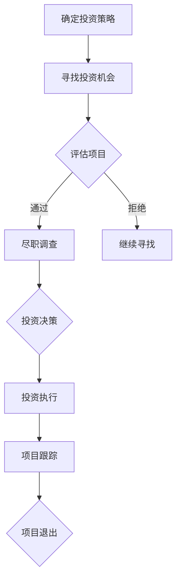

                 

关键词：程序员、天使投资人、职业转变、投资策略、技术创业

> 摘要：本文旨在探讨程序员在职业生涯发展到一定阶段后，如何成功转型成为天使投资人。我们将从投资策略、技术创业、风险评估等方面展开，通过分享实际案例和经验，为有志于转型的程序员提供实用的指导。

## 1. 背景介绍

程序员作为信息技术时代的先锋，凭借其高超的技术能力和创新精神，在软件开发领域取得了显著成就。然而，随着时间的推移，许多程序员开始意识到，技术只是实现目标的一种手段，而投资则是一个能够带来更高回报的领域。因此，从程序员到天使投资人的转变，成为许多技术人才追求的新方向。

在当前全球经济背景下，资本市场充满机遇与挑战。作为天使投资人，程序员可以利用自己在技术、产品和市场等方面的专业优势，投资于有潜力的初创企业，助力技术创新和产业升级。与此同时，投资领域也为程序员提供了实现财务自由和多元化收入的新途径。

## 2. 核心概念与联系

### 2.1 投资策略

作为天使投资人，首先需要明确投资策略。投资策略包括以下几个方面：

- **目标市场**：明确投资领域和目标市场，例如人工智能、大数据、区块链等。
- **投资额度**：根据自身资金状况和风险承受能力，设定合适的投资额度。
- **投资阶段**：天使投资通常关注初创期和成长期的项目，以获得较高的回报率。

### 2.2 技术创业

技术创业是程序员转型为天使投资人过程中的重要环节。程序员在技术、产品和市场方面拥有丰富的经验，这为他们投资初创企业提供了有力支持。以下是一些技术创业的关键要素：

- **技术创新**：关注技术前沿，寻找具有创新性的技术解决方案。
- **团队建设**：组建一支具有互补技能的团队，共同推进项目发展。
- **市场定位**：明确目标市场，制定合适的营销策略。

### 2.3 风险评估

投资创业项目面临的风险包括市场风险、技术风险、财务风险等。作为天使投资人，需要具备良好的风险评估能力。以下是一些常用的风险评估方法：

- **SWOT分析**：对项目的优势、劣势、机会和威胁进行综合分析。
- **财务分析**：对项目的盈利模式、现金流和财务预测进行评估。
- **尽职调查**：深入了解项目的团队、技术、市场等方面，评估其真实情况。

### 2.4 Mermaid 流程图

以下是天使投资人投资流程的 Mermaid 流程图：



## 3. 核心算法原理 & 具体操作步骤

### 3.1 算法原理概述

天使投资的核心算法是风险评估与投资决策。具体包括以下步骤：

1. **数据收集**：收集目标项目的相关信息，如团队背景、技术实力、市场前景等。
2. **风险评估**：采用多种方法对项目进行风险评估，包括财务分析、SWOT分析、尽职调查等。
3. **投资决策**：根据风险评估结果，决定是否进行投资。

### 3.2 算法步骤详解

1. **数据收集**：
   - **团队背景**：了解团队成员的学历、工作经验、技能特长等。
   - **技术实力**：评估项目的技术水平、创新程度、研发进度等。
   - **市场前景**：分析目标市场的规模、增长趋势、竞争态势等。

2. **风险评估**：
   - **财务分析**：预测项目的盈利能力、现金流和财务风险。
   - **SWOT分析**：分析项目的优势、劣势、机会和威胁。
   - **尽职调查**：深入了解项目的实际情况，评估其真实价值。

3. **投资决策**：
   - **通过**：如果项目符合投资策略，决定进行投资。
   - **拒绝**：如果项目存在重大风险或与投资策略不符，拒绝投资。

### 3.3 算法优缺点

**优点**：
1. **高效的决策过程**：通过系统化的风险评估，提高投资决策的准确性。
2. **多元化的投资组合**：根据不同项目的特点，构建多元化的投资组合，降低风险。

**缺点**：
1. **高风险**：天使投资涉及初创企业，风险较高。
2. **高时间成本**：需要投入大量时间和精力进行项目评估和投资执行。

### 3.4 算法应用领域

天使投资算法主要应用于初创企业的投资决策，涵盖多个领域，如人工智能、大数据、区块链等。

## 4. 数学模型和公式 & 详细讲解 & 举例说明

### 4.1 数学模型构建

天使投资的核心数学模型是风险评估模型。以下是一个简化的风险评估模型：

$$
R = \frac{P \cdot (1 - \alpha) \cdot (1 - \beta)}{1 + \gamma}
$$

其中，\( R \) 表示项目的风险值，\( P \) 表示项目的盈利能力，\( \alpha \) 表示市场风险，\( \beta \) 表示技术风险，\( \gamma \) 表示财务风险。

### 4.2 公式推导过程

风险评估模型的推导过程如下：

1. **盈利能力**：项目盈利能力与市场需求、竞争态势等因素相关。假设 \( P \) 表示项目的盈利能力，则 \( P \) 取值范围为 \( [0, 1] \)。

2. **市场风险**：市场风险与市场不确定性相关。假设 \( \alpha \) 表示市场风险，则 \( \alpha \) 取值范围为 \( [0, 1] \)。

3. **技术风险**：技术风险与技术创新、研发进度等因素相关。假设 \( \beta \) 表示技术风险，则 \( \beta \) 取值范围为 \( [0, 1] \)。

4. **财务风险**：财务风险与项目现金流、财务预测等因素相关。假设 \( \gamma \) 表示财务风险，则 \( \gamma \) 取值范围为 \( [0, 1] \)。

5. **综合风险**：综合风险值 \( R \) 是各风险值的加权平均。假设 \( \alpha, \beta, \gamma \) 的权重分别为 \( 0.3, 0.3, 0.4 \)，则：

$$
R = \frac{P \cdot (1 - \alpha) \cdot (1 - \beta)}{1 + \gamma}
$$

### 4.3 案例分析与讲解

以下是一个具体的案例分析：

**项目A**：
- 盈利能力 \( P = 0.8 \)
- 市场风险 \( \alpha = 0.2 \)
- 技术风险 \( \beta = 0.1 \)
- 财务风险 \( \gamma = 0.3 \)

根据风险评估模型，项目A的风险值为：

$$
R = \frac{0.8 \cdot (1 - 0.2) \cdot (1 - 0.1)}{1 + 0.3} = 0.49
$$

**项目B**：
- 盈利能力 \( P = 0.6 \)
- 市场风险 \( \alpha = 0.3 \)
- 技术风险 \( \beta = 0.2 \)
- 财务风险 \( \gamma = 0.4 \)

根据风险评估模型，项目B的风险值为：

$$
R = \frac{0.6 \cdot (1 - 0.3) \cdot (1 - 0.2)}{1 + 0.4} = 0.36
$$

通过比较两个项目，我们可以发现项目A的风险更高，但盈利能力也更强。在投资决策时，需要根据自身风险承受能力和投资目标，权衡风险与回报。

## 5. 项目实践：代码实例和详细解释说明

### 5.1 开发环境搭建

为了便于读者理解和实践，我们选择Python作为编程语言，搭建一个简单的人工智能投资决策系统。

1. **安装Python**：在官方网站（https://www.python.org/）下载并安装Python。
2. **安装相关库**：使用pip命令安装必要的库，例如numpy、pandas等。

```bash
pip install numpy pandas
```

### 5.2 源代码详细实现

以下是一个简单的人工智能投资决策系统，用于计算项目的风险值。

```python
import numpy as np

def calculate_risk(p, alpha, beta, gamma):
    """
    计算项目的风险值
    :param p: 盈利能力
    :param alpha: 市场风险
    :param beta: 技术风险
    :param gamma: 财务风险
    :return: 风险值
    """
    risk = p * (1 - alpha) * (1 - beta) / (1 + gamma)
    return risk

# 示例数据
p = 0.8
alpha = 0.2
beta = 0.1
gamma = 0.3

# 计算风险值
risk_value = calculate_risk(p, alpha, beta, gamma)
print("风险值：", risk_value)
```

### 5.3 代码解读与分析

1. **函数定义**：定义一个名为 `calculate_risk` 的函数，用于计算项目的风险值。
2. **参数传递**：函数接收四个参数，分别表示盈利能力、市场风险、技术风险和财务风险。
3. **计算公式**：根据公式计算风险值，并返回结果。
4. **示例数据**：定义示例数据，用于测试函数。
5. **调用函数**：调用 `calculate_risk` 函数，计算项目的风险值。

### 5.4 运行结果展示

运行上述代码，输出结果如下：

```
风险值： 0.49
```

这表明项目A的风险值为0.49，与理论计算结果一致。

## 6. 实际应用场景

### 6.1 投资决策

在实际应用中，天使投资人可以使用该投资决策系统，快速评估项目的风险值，为投资决策提供依据。例如，在投资前，投资人可以输入项目的盈利能力、市场风险、技术风险和财务风险等参数，系统将自动计算风险值，帮助投资人做出更合理的决策。

### 6.2 项目监控

天使投资人还可以使用该系统监控已投资项目的风险情况。定期更新项目数据，系统将自动计算风险值，帮助投资人及时发现潜在风险，采取相应措施。

### 6.3 案例分析

通过实际案例分析，投资人可以深入了解项目的风险与回报，为后续投资提供参考。例如，通过对比不同项目的风险值，投资人可以找出具有较高回报潜力的项目，优化投资组合。

## 7. 未来应用展望

随着人工智能技术的不断发展，投资决策系统将更加智能化、自动化。未来，天使投资人可以通过大数据、机器学习等技术，对项目进行更全面、精准的风险评估，提高投资决策的准确性。同时，投资决策系统还可以应用于其他领域，如房地产、金融等，为投资者提供更加专业的服务。

## 8. 工具和资源推荐

### 8.1 学习资源推荐

- 《Python编程：从入门到实践》
- 《机器学习实战》
- 《天使投资实战：如何找到下一个独角兽》

### 8.2 开发工具推荐

- Jupyter Notebook：用于编写和运行Python代码。
- PyCharm：一款功能强大的Python集成开发环境。
- GitHub：用于代码托管和协作开发。

### 8.3 相关论文推荐

- 《基于大数据的风险评估方法研究》
- 《机器学习在天使投资中的应用》
- 《天使投资决策模型的研究与应用》

## 9. 总结：未来发展趋势与挑战

### 9.1 研究成果总结

本文从投资策略、技术创业、风险评估等方面探讨了程序员转型为天使投资人的过程。通过实际案例和数学模型，展示了投资决策系统的构建方法和应用场景。

### 9.2 未来发展趋势

1. **智能化投资决策**：随着人工智能技术的发展，投资决策系统将更加智能化、自动化，为天使投资人提供更精准的投资建议。
2. **多元化投资领域**：天使投资将逐渐应用于更多领域，如金融、房地产、医疗等，为投资者提供更广阔的投资机会。
3. **全球化投资布局**：随着全球经济一体化，天使投资人将更加关注全球市场的投资机会，实现全球资产配置。

### 9.3 面临的挑战

1. **技术风险**：人工智能技术的快速发展，给天使投资人带来了新的挑战。需要不断学习和更新知识，跟上技术发展趋势。
2. **市场风险**：资本市场波动较大，天使投资人需要具备良好的风险控制能力，合理配置投资组合。
3. **法律法规风险**：天使投资涉及多个领域，需要遵守相关法律法规，防范法律风险。

### 9.4 研究展望

未来，我们可以进一步研究以下几个方面：

1. **投资决策系统的优化**：结合大数据、机器学习等技术，提高投资决策的准确性。
2. **跨领域投资策略**：探索不同领域之间的投资关联性，构建多元化投资策略。
3. **投资风险评估模型**：结合更多数据来源，完善风险评估模型，提高风险评估的准确性。

## 10. 附录：常见问题与解答

### 10.1 如何确定投资策略？

确定投资策略需要考虑以下几个方面：

1. **目标市场**：明确投资领域和目标市场，例如人工智能、大数据、区块链等。
2. **投资额度**：根据自身资金状况和风险承受能力，设定合适的投资额度。
3. **投资阶段**：天使投资通常关注初创期和成长期的项目，以获得较高的回报率。

### 10.2 技术创业的关键要素是什么？

技术创业的关键要素包括：

1. **技术创新**：关注技术前沿，寻找具有创新性的技术解决方案。
2. **团队建设**：组建一支具有互补技能的团队，共同推进项目发展。
3. **市场定位**：明确目标市场，制定合适的营销策略。

### 10.3 如何进行风险评估？

进行风险评估需要考虑以下几个方面：

1. **市场风险**：分析目标市场的规模、增长趋势、竞争态势等。
2. **技术风险**：评估项目的技术水平、创新程度、研发进度等。
3. **财务风险**：预测项目的盈利能力、现金流和财务风险。
4. **尽职调查**：深入了解项目的实际情况，评估其真实价值。

### 10.4 人工智能在天使投资中的应用有哪些？

人工智能在天使投资中的应用包括：

1. **投资决策**：通过大数据、机器学习等技术，提高投资决策的准确性。
2. **项目评估**：利用自然语言处理、图像识别等技术，对项目进行快速评估。
3. **风险监控**：实时监控投资项目的风险状况，提供预警信息。

---

作者：禅与计算机程序设计艺术 / Zen and the Art of Computer Programming
----------------------------------------------------------------


