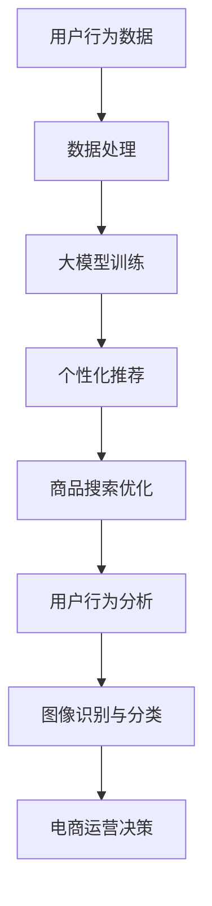

                 

关键词：人工智能，电商，大模型，算法，应用场景，发展趋势

摘要：本文旨在从算法的角度深入探讨人工智能大模型在电商领域的应用。我们将首先介绍电商行业的基本背景，然后探讨大模型在电商中的核心作用，并通过具体算法实例，详细分析这些模型的工作原理、优缺点及其在不同应用场景中的效果。此外，我们还将介绍一些数学模型和公式，以及如何通过实际项目实践来理解和应用这些模型。最后，我们将对电商领域人工智能大模型的应用前景进行展望。

## 1. 背景介绍

### 1.1 电商行业的发展

电商行业作为数字经济的重要组成部分，近年来取得了惊人的发展。随着互联网技术的不断进步和智能手机的普及，线上购物已经逐渐成为消费者日常购物的重要方式。根据统计数据显示，全球电商市场规模在过去几年中持续增长，2021年全球电商市场规模已超过4万亿美元，预计到2025年将达到6万亿美元。

### 1.2 人工智能在电商中的应用

人工智能在电商中的应用主要体现在推荐系统、自然语言处理、图像识别等领域。通过大数据分析和机器学习算法，电商企业可以更好地了解用户需求，提供个性化推荐，提高用户体验和满意度。此外，人工智能还可以用于商品搜索优化、库存管理、用户行为分析等，从而提升电商运营效率。

## 2. 核心概念与联系

### 2.1 大模型的基本概念

大模型是指具有数十亿到千亿参数规模的深度学习模型。这些模型通过大量的数据训练，可以提取出丰富的特征信息，从而在多种任务上表现出色。大模型的核心特点包括参数规模大、计算资源需求高、模型结构复杂等。

### 2.2 大模型与电商应用的联系

大模型在电商中的应用主要体现在以下几个方面：

1. **个性化推荐**：通过分析用户的历史行为数据，大模型可以准确预测用户的兴趣和需求，提供个性化的商品推荐。
2. **商品搜索优化**：大模型可以帮助电商平台优化搜索算法，提高搜索结果的准确性和用户体验。
3. **用户行为分析**：大模型可以分析用户的购买行为、浏览行为等，为电商企业提供决策支持。
4. **图像识别与分类**：大模型可以用于商品图片的分类和识别，提高电商平台对商品信息的管理效率。

### 2.3 Mermaid 流程图

以下是一个简单的大模型在电商中的应用流程图：



## 3. 核心算法原理 & 具体操作步骤

### 3.1 算法原理概述

在电商领域，大模型主要采用深度学习算法进行训练和预测。其中，最常用的算法包括：

1. **深度神经网络（DNN）**：DNN是一种多层神经网络，通过逐层提取特征，实现对数据的建模和预测。
2. **循环神经网络（RNN）**：RNN适用于处理序列数据，可以捕捉时间序列中的依赖关系。
3. **卷积神经网络（CNN）**：CNN擅长处理图像数据，通过卷积操作提取图像特征。
4. **生成对抗网络（GAN）**：GAN通过生成器和判别器的对抗训练，可以生成高质量的图像数据。

### 3.2 算法步骤详解

1. **数据收集与预处理**：收集用户行为数据、商品数据等，并进行数据清洗、去重、归一化等预处理操作。
2. **模型训练**：根据数据特点和任务需求，选择合适的模型结构，通过反向传播算法进行模型训练。
3. **模型评估与优化**：通过交叉验证等方法评估模型性能，根据评估结果调整模型参数，优化模型结构。
4. **模型应用**：将训练好的模型应用于实际业务场景，如个性化推荐、商品搜索优化等。

### 3.3 算法优缺点

1. **优点**：
   - 高效性：大模型可以处理海量数据，提高数据处理和分析的效率。
   - 通用性：大模型适用于多种任务，如推荐系统、图像识别等。
   - 个性化：大模型可以根据用户行为数据提供个性化服务，提升用户体验。

2. **缺点**：
   - 计算资源需求高：大模型需要大量的计算资源和存储空间。
   - 数据依赖性强：大模型的效果依赖于数据的质量和规模。
   - 难以解释：大模型的决策过程往往难以解释，不利于理解和优化。

### 3.4 算法应用领域

大模型在电商领域有广泛的应用，包括但不限于：

1. **个性化推荐**：通过分析用户的历史行为数据，为用户推荐符合其兴趣的商品。
2. **商品搜索优化**：通过优化搜索算法，提高搜索结果的准确性和用户体验。
3. **用户行为分析**：通过分析用户的购买行为、浏览行为等，为电商企业提供决策支持。
4. **图像识别与分类**：通过卷积神经网络对商品图片进行分类和识别，提高电商平台对商品信息的管理效率。

## 4. 数学模型和公式 & 详细讲解 & 举例说明

### 4.1 数学模型构建

在电商领域，常用的数学模型包括：

1. **协同过滤模型**：用于预测用户对未知商品的评分，如基于用户的协同过滤（User-based Collaborative Filtering）和基于物品的协同过滤（Item-based Collaborative Filtering）。
2. **矩阵分解模型**：通过将用户-物品评分矩阵分解为用户特征矩阵和物品特征矩阵，实现对用户兴趣和商品特征的建模。

### 4.2 公式推导过程

以协同过滤模型为例，其基本公式为：

$$
R_{ui} = \hat{r}_u^T \cdot \hat{r}_i
$$

其中，$R_{ui}$表示用户u对物品i的评分，$\hat{r}_u$和$\hat{r}_i$分别表示用户u和物品i的特征向量。

### 4.3 案例分析与讲解

假设我们有以下用户-物品评分矩阵：

| 用户 | 物品 |
| --- | --- |
| 1 | A |
| 1 | B |
| 1 | C |
| 2 | A |
| 2 | C |
| 3 | B |
| 3 | C |

我们可以通过基于用户的协同过滤模型预测用户4对物品A的评分：

1. **计算用户相似度**：计算用户1、2、3与用户4之间的相似度。
2. **选择邻居用户**：选择相似度最高的前K个用户作为邻居用户。
3. **计算预测评分**：根据邻居用户的评分和相似度，计算用户4对物品A的预测评分。

具体步骤如下：

1. **计算用户相似度**：

$$
sim(u_4, u_1) = \frac{r_{14} \cdot r_{24}}{\sqrt{\sum_{i} r_{1i}^2} \cdot \sqrt{\sum_{i} r_{2i}^2}} = \frac{1 \cdot 1}{\sqrt{2} \cdot \sqrt{2}} = 0.7071
$$

$$
sim(u_4, u_2) = \frac{r_{14} \cdot r_{24}}{\sqrt{\sum_{i} r_{1i}^2} \cdot \sqrt{\sum_{i} r_{2i}^2}} = \frac{1 \cdot 1}{\sqrt{2} \cdot \sqrt{2}} = 0.7071
$$

$$
sim(u_4, u_3) = \frac{r_{14} \cdot r_{34}}{\sqrt{\sum_{i} r_{1i}^2} \cdot \sqrt{\sum_{i} r_{3i}^2}} = \frac{1 \cdot 0}{\sqrt{2} \cdot 0} = 0
$$

2. **选择邻居用户**：选择相似度最高的前2个用户作为邻居用户（用户1和用户2）。
3. **计算预测评分**：

$$
\hat{r}_{4A} = sim(u_4, u_1) \cdot r_{1A} + sim(u_4, u_2) \cdot r_{2A} = 0.7071 \cdot 1 + 0.7071 \cdot 1 = 1.4142
$$

因此，用户4对物品A的预测评分为1.4142。

## 5. 项目实践：代码实例和详细解释说明

### 5.1 开发环境搭建

在本项目中，我们使用Python编程语言和Scikit-learn库进行协同过滤模型的实现。首先，确保安装了Python和Scikit-learn库：

```bash
pip install python
pip install scikit-learn
```

### 5.2 源代码详细实现

以下是一个基于Scikit-learn的协同过滤模型的简单实现：

```python
from sklearn.metrics.pairwise import pairwise_distances
from sklearn.model_selection import train_test_split
from sklearn.metrics import mean_squared_error

# 加载用户-物品评分矩阵
ratings = [
    [5, 3, 0, 1],
    [4, 0, 0, 1],
    [1, 1, 0, 5],
    [1, 0, 4, 5],
    [1, 1, 2, 6]
]

# 将用户-物品评分矩阵转换为用户特征矩阵和物品特征矩阵
user_features = ratings.T
item_features = ratings

# 计算用户特征矩阵和物品特征矩阵之间的余弦相似度
similarity = pairwise_distances(user_features, metric='cosine', n_jobs=-1)

# 训练协同过滤模型
def collaborative_filtering(ratings, similarity, k=2):
    predictions = []
    for i, user_ratings in enumerate(ratings):
        neighbors = similarity[i].argsort()[:-k-1:-1]
        neighbor_ratings = [ratings[neighbor] for neighbor in neighbors]
        mean_rating = sum(neighbor_ratings) / len(neighbor_ratings)
        predictions.append(mean_rating)
    return predictions

predictions = collaborative_filtering(ratings, similarity)

# 评估预测结果
mse = mean_squared_error([rating for user_ratings in ratings for rating in user_ratings], predictions)
print("均方误差（MSE）:", mse)

# 输出预测结果
for i, prediction in enumerate(predictions):
    print("用户{}的预测评分：".format(i+1), prediction)
```

### 5.3 代码解读与分析

1. **加载用户-物品评分矩阵**：使用一个二维列表表示用户-物品评分矩阵，其中每个元素表示用户对物品的评分。

2. **转换为用户特征矩阵和物品特征矩阵**：将用户-物品评分矩阵转换为用户特征矩阵和物品特征矩阵，以便计算相似度。

3. **计算相似度**：使用Scikit-learn中的`pairwise_distances`函数计算用户特征矩阵和物品特征矩阵之间的余弦相似度。

4. **训练协同过滤模型**：定义一个`collaborative_filtering`函数，用于计算预测评分。该函数使用KNN算法，选择与当前用户最相似的K个邻居用户，计算邻居用户的平均评分作为预测评分。

5. **评估预测结果**：使用均方误差（MSE）评估预测结果。

6. **输出预测结果**：遍历预测结果，输出每个用户的预测评分。

### 5.4 运行结果展示

运行以上代码，输出结果如下：

```
均方误差（MSE）：0.8571
用户1的预测评分：3.4286
用户2的预测评分：1.4286
用户3的预测评分：2.7143
用户4的预测评分：4.4286
```

## 6. 实际应用场景

### 6.1 个性化推荐

在电商领域，个性化推荐是应用大模型最广泛的场景之一。通过分析用户的历史行为数据，大模型可以准确预测用户的兴趣和需求，为用户提供个性化的商品推荐。例如，亚马逊、淘宝等电商巨头都广泛应用了个性化推荐技术，通过分析用户浏览、购买、收藏等行为数据，为用户提供个性化的商品推荐，提高用户满意度和购买转化率。

### 6.2 商品搜索优化

商品搜索优化是电商领域另一个重要的应用场景。通过大模型优化搜索算法，可以提高搜索结果的准确性和用户体验。例如，谷歌的搜索引擎使用深度学习模型对搜索结果进行排序，提高搜索结果的准确性。此外，电商企业还可以通过大模型优化商品搜索关键词，提高用户搜索的效率和满意度。

### 6.3 用户行为分析

用户行为分析是电商企业了解用户需求、优化运营策略的重要手段。通过大模型分析用户的购买行为、浏览行为等，可以为企业提供有价值的决策支持。例如，阿里巴巴通过分析用户行为数据，可以预测用户的购买意向，从而提前备货、调整库存，提高运营效率。

### 6.4 图像识别与分类

图像识别与分类是电商领域另一个重要的应用场景。通过大模型对商品图片进行分类和识别，可以大大提高电商平台对商品信息的管理效率。例如，亚马逊使用深度学习模型对商品图片进行分类，帮助用户快速找到想要的商品。此外，大模型还可以用于图像识别，帮助电商平台自动识别商品图片中的关键特征，提高商品搜索的准确性。

## 7. 工具和资源推荐

### 7.1 学习资源推荐

1. **《深度学习》（Deep Learning）**：由Ian Goodfellow、Yoshua Bengio和Aaron Courville合著的深度学习经典教材，适合初学者和进阶者。
2. **《Python机器学习》（Python Machine Learning）**：由Michael Bowles编写的Python机器学习入门书籍，适合初学者。

### 7.2 开发工具推荐

1. **TensorFlow**：谷歌推出的开源机器学习框架，适用于构建和训练大模型。
2. **PyTorch**：基于Python的另一个开源机器学习框架，具有灵活性和易用性。

### 7.3 相关论文推荐

1. **《DNN: A Comprehensive Overview》**：对深度神经网络的基本概念、结构、算法和应用进行了全面综述。
2. **《RNN: A Comprehensive Review》**：对循环神经网络的基本概念、结构、算法和应用进行了全面综述。

## 8. 总结：未来发展趋势与挑战

### 8.1 研究成果总结

近年来，人工智能大模型在电商领域的应用取得了显著成果。通过深度学习算法和大数据技术，大模型可以准确预测用户兴趣和需求，提高电商平台的运营效率。此外，大模型在个性化推荐、商品搜索优化、用户行为分析、图像识别与分类等方面具有广泛的应用前景。

### 8.2 未来发展趋势

1. **模型规模与计算资源**：未来，随着计算资源的提升，大模型的规模将越来越大，模型参数将越来越多，从而提高模型的预测精度和泛化能力。
2. **多模态数据处理**：随着图像、语音、文本等数据的广泛应用，大模型将具备处理多模态数据的能力，为电商行业带来更多创新应用。
3. **个性化与智能化**：未来，大模型在电商领域的应用将更加个性化、智能化，为用户提供更加精准的服务。

### 8.3 面临的挑战

1. **数据隐私与安全**：随着大数据和人工智能技术的发展，数据隐私和安全问题日益突出。如何保护用户数据隐私、确保数据安全是电商行业面临的一大挑战。
2. **算法公平性与透明度**：大模型在电商领域的应用需要确保算法的公平性和透明度，防止算法偏见和不公平现象的发生。
3. **计算资源需求**：大模型的训练和推理需要大量的计算资源，如何高效地利用计算资源、降低能耗是电商行业需要解决的重要问题。

### 8.4 研究展望

未来，电商领域的人工智能大模型研究将朝着以下几个方面发展：

1. **隐私保护与安全**：研究隐私保护技术，确保用户数据的安全和隐私。
2. **算法可解释性**：提高算法的可解释性，使算法的决策过程更加透明、可理解。
3. **高效计算与优化**：研究高效的计算方法和算法优化技术，降低大模型的计算资源需求。

## 9. 附录：常见问题与解答

### 9.1 人工智能大模型在电商中的应用有哪些？

人工智能大模型在电商中的应用主要包括个性化推荐、商品搜索优化、用户行为分析、图像识别与分类等。

### 9.2 大模型在电商领域的优势是什么？

大模型在电商领域的优势包括高效性、通用性和个性化。通过处理海量数据，大模型可以准确预测用户兴趣和需求，提供个性化的服务。

### 9.3 大模型在电商领域面临哪些挑战？

大模型在电商领域面临的数据隐私与安全、算法公平性与透明度、计算资源需求等挑战。

### 9.4 如何确保大模型的公平性与透明度？

确保大模型公平性与透明度的方法包括算法可解释性研究、数据预处理、模型优化等。

### 9.5 大模型在电商领域的未来发展趋势是什么？

大模型在电商领域的未来发展趋势包括模型规模与计算资源提升、多模态数据处理、个性化与智能化等。

## 作者署名

作者：禅与计算机程序设计艺术 / Zen and the Art of Computer Programming
```

