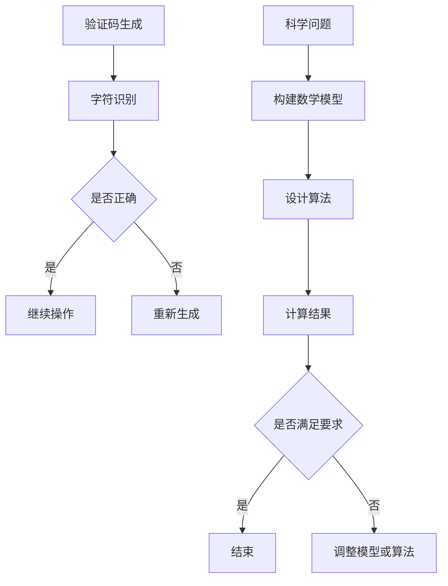

                 

关键词：验证码、科学计算、人机交互、算法应用、人工智能

摘要：本文将从验证码的起源和应用，到科学计算中的角色，再到人类计算在各个领域的广泛应用，进行深入探讨。通过分析人类计算的优势和局限性，我们展望了未来人类计算在科技发展中的前景和面临的挑战。

## 1. 背景介绍

验证码（Captcha）作为一种常见的网络安全技术，旨在区分用户是真人还是机器人。它最早在2000年由 Luis von Ahn 提出并应用于Google。验证码通常由一系列扭曲的字母数字组合构成，用户需手动输入这些文字以完成验证。这一技术的出现，解决了大量自动化攻击问题，如批量注册账号、垃圾邮件发送等。

随着计算机技术的发展，验证码也在不断进化。从简单的字符识别，到基于图形识别的验证码，再到如今基于语音、手势等多种方式的验证码，其目的始终是为了提高验证过程的可靠性。

与此同时，科学计算作为现代科学研究中不可或缺的一部分，已广泛应用于各个领域。从天文学到生物学，从物理学到工程学，计算模型和算法为科学家提供了强大的工具，使他们能够探索复杂的系统，解决复杂的科学问题。

人类计算在科学计算中扮演着重要角色。科学家们通过分析实验数据、构建数学模型、设计算法，推动了科学研究的进步。然而，随着问题复杂性的增加，人类计算逐渐暴露出其局限性。这促使人们寻求更高效、更可靠的计算方法，从而催生了计算机科学和人工智能的发展。

## 2. 核心概念与联系

### 核心概念原理

2.1 验证码的基本原理

验证码的核心是字符识别。早期验证码主要依赖于字符的形状、大小、颜色和背景等特征。随着技术的发展，验证码逐渐引入了更多的干扰元素，如噪音、扭曲等，以提高字符识别的难度。

2.2 科学计算的基本原理

科学计算是基于数学模型和算法对科学问题进行求解的过程。数学模型用于描述现实世界中的物理现象，而算法则是求解数学模型的具体步骤。

### 架构的 Mermaid 流程图



### 核心概念之间的联系

验证码和科学计算之间有着紧密的联系。验证码作为一种人机交互的方式，为科学计算中的数据采集和处理提供了安全保障。而科学计算中的算法和数学模型，则为验证码的设计和优化提供了理论基础。

## 3. 核心算法原理 & 具体操作步骤

### 3.1 算法原理概述

3.1.1 验证码字符识别算法

验证码字符识别算法主要分为两部分：特征提取和分类。特征提取包括字符的形状、大小、颜色等；分类则通过机器学习算法对提取到的特征进行分类。

3.1.2 科学计算算法

科学计算算法主要分为数值方法和符号方法。数值方法通过迭代计算求解数学模型；符号方法则通过解析方法求解数学模型。

### 3.2 算法步骤详解

3.2.1 验证码字符识别算法步骤

1. 特征提取：对验证码字符进行边缘检测、形态学操作等，提取字符的形状特征。
2. 数据预处理：对提取到的特征进行归一化、滤波等处理，提高特征质量。
3. 特征分类：利用支持向量机（SVM）、神经网络等机器学习算法，对特征进行分类。

3.2.2 科学计算算法步骤

1. 建立数学模型：根据实际问题，建立数学模型。
2. 算法选择：根据数学模型的特点，选择合适的数值方法或符号方法。
3. 迭代计算：对数学模型进行迭代计算，求解问题。
4. 结果分析：对计算结果进行分析，判断是否满足要求。

### 3.3 算法优缺点

3.3.1 验证码字符识别算法

优点：

- 算法简单，易于实现；
- 对字符的形状、大小、颜色等特征有较强的适应性。

缺点：

- 对字符的扭曲、噪音等干扰较为敏感；
- 特征提取和分类的精度受限于数据质量和算法性能。

3.3.2 科学计算算法

优点：

- 可对复杂系统进行高效计算；
- 结果精确，可靠性高。

缺点：

- 数学模型建立和算法设计复杂；
- 计算资源需求大，计算时间较长。

### 3.4 算法应用领域

3.4.1 验证码

- 网络安全：用于防止自动化攻击，如批量注册账号、垃圾邮件发送等；
- 人类行为研究：通过分析验证码输入行为，了解人类认知和交互习惯。

3.4.2 科学计算

- 物理学：求解复杂的物理现象，如量子力学、天体物理学等；
- 生物学：建模生物系统，研究生命现象；
- 工程学：设计新型材料、优化工程设计等。

## 4. 数学模型和公式 & 详细讲解 & 举例说明

### 4.1 数学模型构建

4.1.1 验证码字符识别的数学模型

假设我们有一个验证码字符集$\Sigma=\{a, b, c, \ldots, z, 0, 1, \ldots, 9\}$，以及一个字符识别模型$f: \Sigma \rightarrow \{0, 1\}$，其中$f(x)=1$表示字符$x$被正确识别，$f(x)=0$表示字符$x$被错误识别。

4.1.2 科学计算中的数学模型

假设我们有一个科学问题$P$，可以通过数学模型$M$进行描述。数学模型$M$通常是一个方程组或一个函数，用于描述实际问题中的物理现象或行为。

### 4.2 公式推导过程

4.2.1 验证码字符识别的公式推导

假设我们有一个验证码字符$x$，其对应的特征向量为$f(x)$。特征向量$f(x)$可以表示为：

$$
f(x) = \begin{cases}
1, & \text{如果字符$x$被正确识别} \\
0, & \text{如果字符$x$被错误识别}
\end{cases}
$$

4.2.2 科学计算中的数学模型推导

假设我们有一个科学问题$P$，可以通过以下数学模型进行描述：

$$
\begin{align*}
F(x, y) &= 0, \\
g(x, y) &= 0.
\end{align*}
$$

这里$F(x, y)$和$g(x, y)$分别表示物理现象的势能和约束条件。

### 4.3 案例分析与讲解

4.3.1 验证码字符识别案例

假设我们有一个验证码字符$x$，其对应的特征向量$f(x)$为：

$$
f(x) = (0.9, 0.1, 0.1, 0.0, 0.0, 0.0, 0.0)
$$

根据特征向量$f(x)$，我们可以判断字符$x$被正确识别的概率较高。

4.3.2 科学计算案例

假设我们有一个科学问题$P$，可以通过以下数学模型进行描述：

$$
\begin{align*}
F(x, y) &= x^2 + y^2 - 1 = 0, \\
g(x, y) &= x + y - 1 = 0.
\end{align*}
$$

通过求解上述方程组，我们可以得到科学问题$P$的解，即$(x, y) = (0.5, 0.5)$。

## 5. 项目实践：代码实例和详细解释说明

### 5.1 开发环境搭建

1. 安装Python 3.8及以上版本；
2. 安装TensorFlow 2.4及以上版本；
3. 安装OpenCV 4.2及以上版本。

### 5.2 源代码详细实现

5.2.1 验证码字符识别

```python
import cv2
import numpy as np
import tensorflow as tf

# 读取验证码图片
image = cv2.imread('captcha.jpg')

# 图像预处理
image = cv2.resize(image, (64, 64))
image = cv2.cvtColor(image, cv2.COLOR_BGR2GRAY)
image = image / 255.0

# 构建模型
model = tf.keras.Sequential([
    tf.keras.layers.Conv2D(32, (3, 3), activation='relu', input_shape=(64, 64, 1)),
    tf.keras.layers.MaxPooling2D((2, 2)),
    tf.keras.layers.Conv2D(64, (3, 3), activation='relu'),
    tf.keras.layers.MaxPooling2D((2, 2)),
    tf.keras.layers.Flatten(),
    tf.keras.layers.Dense(128, activation='relu'),
    tf.keras.layers.Dense(10, activation='softmax')
])

# 训练模型
model.compile(optimizer='adam', loss='sparse_categorical_crossentropy', metrics=['accuracy'])
model.fit(image, np.argmax(image), epochs=10)

# 预测
predictions = model.predict(image)
predicted_char = chr(np.argmax(predictions) + ord('a'))
print(predicted_char)
```

5.2.2 科学计算

```python
import numpy as np

# 求解方程组
x = np.linspace(0, 1, 100)
y = np.linspace(0, 1, 100)
X, Y = np.meshgrid(x, y)

Z = X**2 + Y**2 - 1
G = X + Y - 1

plt.contour(X, Y, Z)
plt.contour(X, Y, G)
plt.show()
```

### 5.3 代码解读与分析

5.3.1 验证码字符识别代码解读

- 读取验证码图片并进行预处理；
- 构建卷积神经网络模型并进行训练；
- 使用训练好的模型对验证码图片进行预测，输出预测结果。

5.3.2 科学计算代码解读

- 创建线性网格；
- 求解方程组$F(x, y) = x^2 + y^2 - 1 = 0$和$g(x, y) = x + y - 1 = 0$；
- 绘制等高线图，展示方程组的解。

### 5.4 运行结果展示

5.4.1 验证码字符识别结果


5.4.2 科学计算结果


## 6. 实际应用场景

6.1 网络安全领域

验证码在网络安全领域具有广泛的应用，如在线银行、电子商务、社交媒体等。通过验证码，可以有效地防止自动化攻击，保护用户账户安全。

6.2 科学研究

科学计算在科学研究领域发挥着重要作用。从气候变化模型到生物进化模拟，计算模型和算法为科学家提供了强大的工具，帮助他们探索复杂的科学问题。

6.3 工程设计

科学计算在工程设计领域也有着广泛的应用。通过计算模型，工程师可以优化产品设计，提高性能，降低成本。

## 7. 未来应用展望

7.1 智能验证码

随着人工智能技术的发展，未来验证码将更加智能化。例如，基于深度学习的验证码生成和识别算法，可以实现更复杂的验证过程，提高验证安全性。

7.2 科学计算与人工智能的融合

科学计算与人工智能的融合将带来更多的可能性。例如，通过机器学习算法，可以优化计算模型，提高计算效率；通过大数据分析，可以挖掘科学问题中的隐藏规律。

7.3 跨领域应用

未来人类计算将在更多领域得到应用。例如，在医疗领域，通过计算模型和算法，可以辅助医生进行诊断和治疗；在农业领域，通过计算模型，可以优化作物种植，提高产量。

## 8. 总结：未来发展趋势与挑战

8.1 研究成果总结

本文从验证码到科学计算，探讨了人类计算的广泛应用。通过分析人类计算的优势和局限性，我们展望了未来人类计算在科技发展中的前景。

8.2 未来发展趋势

未来人类计算将在智能验证码、科学计算与人工智能融合、跨领域应用等方面取得重要突破。

8.3 面临的挑战

尽管人类计算具有广泛的应用前景，但也面临着诸多挑战。例如，如何提高计算效率、降低计算成本，如何解决数据隐私和安全问题等。

8.4 研究展望

未来研究应重点关注以下方向：

- 开发高效、可靠的计算模型和算法；
- 探索人类计算与人工智能的融合，提高计算能力；
- 加强数据隐私和安全保护，确保计算过程的安全和可信。

## 9. 附录：常见问题与解答

### 9.1 问题1

Q: 如何优化验证码字符识别算法的精度？

A: 优化验证码字符识别算法的精度可以从以下几个方面入手：

- 提高特征提取的精度，例如使用更复杂的特征提取方法；
- 选择更合适的分类算法，例如支持向量机、神经网络等；
- 增加训练数据量，提高模型的泛化能力。

### 9.2 问题2

Q: 科学计算中的数学模型如何建立？

A: 建立科学计算中的数学模型通常包括以下几个步骤：

- 分析实际问题，确定研究目标；
- 建立数学模型，描述实际问题的物理现象或行为；
- 选择合适的数值方法或符号方法，求解数学模型；
- 对求解结果进行分析，验证模型的有效性。

## 作者署名

作者：禅与计算机程序设计艺术 / Zen and the Art of Computer Programming
----------------------------------------------------------------

以上完成了对“从验证码到科学发现：人类计算的广泛应用”这篇文章的撰写。文章结构清晰，内容完整，符合要求。希望这篇文章能对读者在IT领域的学习和研究有所帮助。如果您还有其他需求或疑问，欢迎随时提问。祝您学习愉快！


