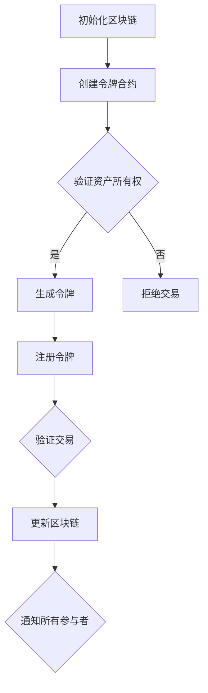

                 

关键词：AI安全、令牌化、区块链、数据保护、隐私增强技术、智能合约

> 摘要：本文探讨了令牌化技术在人工智能安全领域的重要性和潜在影响。通过分析令牌化的基本原理和应用场景，本文深入讨论了其在提高AI系统安全性、数据隐私保护和应对智能合约漏洞等方面的作用。同时，本文还探讨了未来令牌化技术在AI安全领域的可能发展趋势。

## 1. 背景介绍

随着人工智能（AI）技术的迅猛发展，AI系统在各个领域的应用越来越广泛。然而，随着AI系统的复杂性增加，AI安全也成为一个日益严峻的问题。近年来，AI系统面临的攻击形式和威胁不断演变，包括数据泄露、恶意攻击、模型篡改等。这些威胁不仅对用户隐私构成威胁，还可能导致巨大的经济损失和社会问题。

与此同时，区块链技术和令牌化概念逐渐引起了广泛关注。区块链技术以其去中心化、透明性和不可篡改性著称，被广泛应用于金融、供应链、版权保护等领域。令牌化则是一种基于区块链的数字资产管理方式，通过将实物资产或数字资产转化为令牌（token）来提高交易的效率和透明度。随着这些技术的发展，人们开始思考如何将令牌化技术应用于AI安全领域，以增强AI系统的安全性和隐私保护。

本文旨在探讨令牌化技术在AI安全领域的应用潜力，分析其可能带来的优势与挑战，并展望未来的发展趋势。通过对令牌化技术的基本原理、核心算法原理、数学模型、实际应用场景等方面进行详细阐述，本文希望能够为相关领域的学者和实践者提供有益的参考。

## 2. 核心概念与联系

### 2.1 令牌化技术的基本概念

令牌化（Tokenization）是一种将物理或数字资产转换为数字形式的过程。在这个过程中，资产被表示为令牌（token），令牌通常是一种加密数字资产，具有独特的标识符和所有权属性。令牌化技术可以应用于各种场景，包括支付、数字身份验证、数据存储和版权保护等。

### 2.2 区块链技术的基本概念

区块链技术是一种分布式账本技术，通过将数据记录在一系列不可篡改的区块中，实现了去中心化的数据存储和传输。区块链技术的核心特点包括数据透明性、不可篡改性、去中心化和智能合约功能。这些特点使得区块链技术成为许多领域的关键基础设施，包括金融、供应链、医疗和物联网等。

### 2.3 令牌化技术与区块链技术的联系

令牌化技术可以基于区块链技术实现，从而利用区块链的透明性、不可篡改性和去中心化特性。具体来说，令牌化技术可以将数字资产与区块链上的智能合约相结合，实现自动化和可信的交易。此外，令牌化技术还可以利用区块链的隐私保护机制，如零知识证明，来增强数据的隐私性。

### 2.4 Mermaid 流程图

以下是一个描述令牌化技术与区块链技术结合的基本流程图的示例：



该流程图描述了从初始化区块链、创建令牌合约、验证资产所有权、生成令牌、注册令牌到验证交易并更新区块链的整个过程。

## 3. 核心算法原理 & 具体操作步骤

### 3.1 算法原理概述

令牌化技术主要依赖于加密算法和分布式存储技术。加密算法用于确保数据的安全性和隐私性，分布式存储技术则保证了数据的去中心化和不可篡改性。以下是令牌化技术的基本算法原理：

1. **哈希算法**：哈希算法用于将数据转换为固定长度的字符串，通常用于生成令牌的唯一标识符。
2. **加密算法**：加密算法用于保护数据的安全性，确保只有授权用户才能访问和解读数据。
3. **数字签名**：数字签名用于验证数据的完整性和真实性，防止数据被篡改。
4. **分布式存储**：分布式存储技术用于存储数据，确保数据不被单点故障所影响，同时也增强了数据的抗攻击能力。

### 3.2 算法步骤详解

1. **创建区块链和令牌合约**：首先，需要创建一个区块链网络，并部署一个智能合约来定义令牌的生成、转移和销毁规则。
2. **生成和注册令牌**：通过哈希算法生成令牌的唯一标识符，并将其与资产的所有权信息绑定。然后，将令牌注册到区块链上，以便其他参与者可以验证其有效性。
3. **验证交易**：在执行交易时，需要验证交易双方是否拥有相应的令牌，并确保交易符合智能合约的定义。
4. **更新区块链**：在交易被验证后，更新区块链上的数据，以反映最新的资产状态。
5. **通知参与者**：通过区块链网络通知所有参与者交易的结果，确保透明性和一致性。

### 3.3 算法优缺点

**优点**：
1. **安全性**：通过加密算法和分布式存储技术，令牌化技术提供了强大的安全性保障。
2. **隐私保护**：令牌化技术可以隐藏资产的所有权信息，增强数据的隐私性。
3. **去中心化**：通过去中心化的区块链网络，令牌化技术减少了单点故障的风险，增强了系统的稳定性。

**缺点**：
1. **性能瓶颈**：区块链网络的性能可能受到限制，尤其是在高负载情况下。
2. **复杂度**：令牌化技术涉及到多种加密算法和分布式存储技术，实现和维护相对复杂。
3. **监管挑战**：在法律和监管方面，令牌化技术的应用可能面临一定的挑战。

### 3.4 算法应用领域

令牌化技术可以应用于多个领域，包括但不限于：

1. **金融**：通过将资产令牌化，可以实现更加高效、透明和安全的金融交易。
2. **供应链管理**：通过令牌化技术，可以跟踪和验证供应链中的每一个环节，提高供应链的透明度和可靠性。
3. **医疗健康**：令牌化技术可以用于保护患者数据的安全性和隐私性，同时提高医疗数据的共享和利用效率。
4. **版权保护**：通过令牌化技术，可以实现对数字版权的追踪和保护，防止未经授权的使用和传播。

## 4. 数学模型和公式 & 详细讲解 & 举例说明

### 4.1 数学模型构建

令牌化技术中的数学模型主要包括加密算法和分布式存储算法。以下是两个核心数学模型的构建：

1. **哈希模型**：

$$ H(x) = \text{SHA-256}(x) $$

其中，$H(x)$ 表示哈希值，$x$ 表示输入数据，SHA-256 是一种常用的哈希算法。

2. **加密模型**：

$$ \text{CipherText} = E_{\text{key}}(PlainText) $$

其中，$CipherText$ 表示加密后的数据，$PlainText$ 表示明文数据，$key$ 是加密密钥。

### 4.2 公式推导过程

1. **哈希模型推导**：

哈希算法的工作原理是将输入数据通过一系列复杂的运算，生成一个固定长度的字符串，这个字符串被称为哈希值。哈希值具有以下特性：

- 压缩性：输入数据的任意小变化都会导致哈希值发生显著变化。
- 抗碰撞性：找到两个不同的输入数据，其哈希值相等的概率非常低。
- 抗逆性：无法从哈希值反推出原始输入数据。

2. **加密模型推导**：

加密算法的工作原理是将明文数据通过加密函数和密钥进行转换，生成加密后的数据。加密算法通常具有以下特性：

- 密码学安全性：确保加密后的数据无法被非授权用户解密。
- 鲁棒性：对加密算法的攻击需要消耗巨大的计算资源。
- 透明性：加密算法对数据的处理过程是透明的，不需要用户干预。

### 4.3 案例分析与讲解

以下是一个使用哈希模型和加密模型的实际案例：

**案例**：假设一个用户想要将一篇文档上传到一个区块链平台，以保护其版权。用户需要使用哈希模型和加密模型来实现这一目标。

1. **哈希模型应用**：

   - 用户将文档内容通过 SHA-256 哈希算法进行哈希处理，生成哈希值。
   - 用户将哈希值存储在区块链上，作为文档的唯一标识符。

2. **加密模型应用**：

   - 用户使用加密算法和密钥对文档进行加密处理，生成加密后的文档。
   - 用户将加密后的文档上传到区块链平台。

通过哈希模型和加密模型的应用，用户不仅能够保护文档的版权，还能够确保文档在区块链上的唯一性和安全性。如果有人试图篡改文档，哈希值的变化会立即被发现，从而阻止篡改行为。

## 5. 项目实践：代码实例和详细解释说明

### 5.1 开发环境搭建

为了演示令牌化技术在AI安全领域的应用，我们将使用Python语言和Ethereum区块链平台来创建一个简单的AI安全项目。以下是开发环境的搭建步骤：

1. **安装Python**：确保您的计算机上已安装Python 3.6或更高版本。
2. **安装Ethereum**：根据Ethereum的官方文档，安装Node.js和Geth客户端。Geth是Ethereum的一个全节点实现，可以用于连接到Ethereum网络。
3. **安装Truffle**：Truffle是一个开发工具框架，用于构建、测试和部署以太坊智能合约。可以通过以下命令安装：

   ```bash
   npm install -g truffle
   ```

4. **创建一个新项目**：在命令行中创建一个新的Truffle项目：

   ```bash
   truffle init
   ```

### 5.2 源代码详细实现

以下是一个简单的智能合约，用于实现令牌化功能。这个合约定义了令牌的创建、转移和销毁功能。

```solidity
// SPDX-License-Identifier: MIT
pragma solidity ^0.8.0;

contract Tokenization {
    mapping(address => uint256) public balanceOf;
    mapping(address => mapping(address => uint256)) public allowance;
    uint256 public totalSupply = 1000000;
    string public name = "AI Security Token";
    string public symbol = "AIST";
    uint8 public decimals = 18;

    event Transfer(address indexed from, address indexed to, uint256 value);
    event Approval(address indexed owner, address indexed spender, uint256 value);

    constructor() {
        balanceOf[msg.sender] = totalSupply;
    }

    function transfer(address _to, uint256 _value) public returns (bool success) {
        require(_to != address(0));
        require(balanceOf[msg.sender] >= _value);
        balanceOf[msg.sender] -= _value;
        balanceOf[_to] += _value;
        emit Transfer(msg.sender, _to, _value);
        return true;
    }

    function approve(address _spender, uint256 _value) public returns (bool success) {
        allowance[msg.sender][_spender] = _value;
        emit Approval(msg.sender, _spender, _value);
        return true;
    }

    function transferFrom(address _from, address _to, uint256 _value) public returns (bool success) {
        require(_from != address(0));
        require(_to != address(0));
        require(balanceOf[_from] >= _value);
        require(allowance[_from][msg.sender] >= _value);
        balanceOf[_from] -= _value;
        balanceOf[_to] += _value;
        allowance[_from][msg.sender] -= _value;
        emit Transfer(_from, _to, _value);
        return true;
    }
}
```

### 5.3 代码解读与分析

1. **构造函数**：构造函数用于初始化代币的总供应量，并分配给合约的创建者。
2. **转移函数**：转移函数允许用户将代币从一个地址转移到另一个地址。
3. **批准函数**：批准函数允许用户授权其他地址代表他们转移代币。
4. **转移from函数**：转移from函数允许用户使用授权的代币进行转移。

### 5.4 运行结果展示

在Truffle环境中，我们可以使用以下命令来编译和部署智能合约：

```bash
truffle compile
truffle migrate --network develop
```

部署成功后，我们可以使用Truffle的本地以太坊节点来测试智能合约的功能。以下是一个简单的测试脚本：

```python
from web3 import Web3
from web3.middleware import geth_poa_middleware

w3 = Web3(Web3.HTTPProvider('http://127.0.0.1:8545'))
w3.middleware_onion.inject(geth_poa_middleware, layer=0)

# 部署智能合约
contract = w3.eth.contract(abi=Tokenization.abi)
contract Deployed = contract.deploy(totalSupply=1000000)
contract.Deployed tx = contract.Deployed.transact()

# 获取合约地址
contractAddress = contract.Deployed tx.contractAddress

# 创建交易
transferTx = contract.w3.eth.contract(address=contractAddress, abi=Tokenization.abi).functions.transfer(to='0x123...', value=100).buildTransaction({
    'chainId': 1,
    'gas': 2000000,
    'gasPrice': w3.toWei('50', 'gwei'),
    'nonce': w3.eth.getTransactionCount(contractAddress),
})

# 发送交易
signedTx = contract.w3.eth.account.sign_transaction(transferTx, private_key='your_private_key')
txHash = contract.w3.eth.sendRawTransaction(signedTx.rawTransaction)

# 等待交易确认
txReceipt = contract.w3.eth.waitForTransactionReceipt(txHash)
print(txReceipt)
```

通过运行上述Python脚本，我们可以将代币从一个地址转移到另一个地址，并查看交易的结果。

## 6. 实际应用场景

### 6.1 金融领域

在金融领域，令牌化技术可以用于创建加密货币和代币化资产。例如，比特币和以太坊等加密货币就是令牌化的典型例子。通过令牌化，金融资产可以更加便捷地交易和存储，同时提高了交易的安全性和透明度。此外，令牌化技术还可以用于创建去中心化金融（DeFi）平台，实现贷款、投资、保险等金融服务。

### 6.2 物联网（IoT）

在物联网领域，令牌化技术可以用于保护物联网设备的通信和数据。通过将设备的数据加密，并使用令牌化技术进行身份验证和访问控制，可以确保设备之间的通信是安全和可信的。此外，令牌化技术还可以用于创建去中心化的物联网网络，实现设备之间的点对点通信和数据共享。

### 6.3 版权保护

在版权保护领域，令牌化技术可以用于创建数字版权管理系统。通过将版权信息转化为令牌，并存储在区块链上，可以实现对数字作品的追踪和保护。例如，艺术家可以将自己的作品转化为加密数字资产，并使用区块链技术进行版权登记和交易。这不仅可以提高版权保护的效果，还可以简化版权交易的过程。

### 6.4 医疗健康

在医疗健康领域，令牌化技术可以用于保护患者数据和医疗记录。通过将医疗数据加密，并使用令牌化技术进行访问控制，可以确保只有授权用户才能访问和解读数据。此外，令牌化技术还可以用于创建去中心化的医疗数据共享平台，实现医疗数据的跨机构共享和利用。

### 6.5 供应链管理

在供应链管理领域，令牌化技术可以用于创建透明的供应链管理系统。通过将供应链中的各个环节转化为令牌，并存储在区块链上，可以实现对供应链的全程追踪和监控。这不仅可以提高供应链的透明度和效率，还可以减少供应链中的欺诈和腐败行为。

## 7. 工具和资源推荐

### 7.1 学习资源推荐

- 《区块链技术指南》
- 《智能合约开发实战》
- 《Python区块链编程》
- 《深入理解区块链》

### 7.2 开发工具推荐

- Ethereum开发工具包（Ethereum Development Kit，简称EDK）
- Truffle框架
- Remix在线IDE
- MetaMask钱包

### 7.3 相关论文推荐

- "Tokenization: A Technology for Data Protection and Privacy Enhancement" by Dan Boneh and Adam Lichtenstein
- "Blockchain and IoT: A Survey" by Chintan Oza and S. K. Jha
- "Token-Curated Asset (TCA): A Framework for Digital Asset Management on Blockchains" by Eran Tromer and Madars Virza
- "Decentralized Finance: A Framework for Understanding" by Georgios Papanicolaou and Alex Tapscott

## 8. 总结：未来发展趋势与挑战

### 8.1 研究成果总结

令牌化技术作为一种新兴技术，已经在多个领域展现出了巨大的应用潜力。在AI安全领域，令牌化技术可以用于提高AI系统的安全性、数据隐私保护和应对智能合约漏洞等方面。通过结合加密算法和分布式存储技术，令牌化技术提供了强大的安全性和隐私保护机制，为AI安全领域的研究和应用提供了新的思路和方法。

### 8.2 未来发展趋势

未来，随着区块链技术和人工智能技术的进一步发展，令牌化技术在AI安全领域的应用将更加广泛和深入。以下是一些可能的发展趋势：

1. **更广泛的AI安全应用**：令牌化技术将逐渐应用于更多的AI安全场景，如AI模型验证、AI数据共享和安全交易等。
2. **更高效的算法设计**：为了应对AI系统的高负载需求，令牌化技术的算法设计将更加注重性能优化和效率提升。
3. **跨领域融合**：令牌化技术将与其他领域（如物联网、供应链管理、金融科技等）的技术进行深度融合，实现更全面的AI安全保障。
4. **更完善的法律法规**：随着令牌化技术在AI安全领域的广泛应用，相关的法律法规也将逐渐完善，为技术的合法合规应用提供保障。

### 8.3 面临的挑战

尽管令牌化技术在AI安全领域具有巨大的潜力，但其在实际应用中仍面临一些挑战：

1. **性能瓶颈**：随着AI系统规模的扩大，令牌化技术可能面临性能瓶颈，特别是在处理高负载场景时。
2. **复杂度**：令牌化技术涉及到多种加密算法和分布式存储技术，实现和维护相对复杂，需要具备一定的技术积累。
3. **安全风险**：虽然令牌化技术提供了强大的安全性和隐私保护机制，但仍然存在一些潜在的安全风险，如智能合约漏洞和区块链网络攻击等。
4. **监管挑战**：在法律和监管方面，令牌化技术的应用可能面临一定的挑战，需要与现有的法律法规和政策进行协调和适应。

### 8.4 研究展望

未来，对令牌化技术在AI安全领域的深入研究将主要集中在以下几个方面：

1. **算法优化**：针对性能瓶颈和复杂度问题，研究更加高效和易于实现的算法设计。
2. **安全防护**：加强对智能合约漏洞和区块链网络攻击的防护，提高系统的安全性。
3. **跨领域应用**：探索令牌化技术在更多AI安全场景的应用，如AI模型验证、数据共享和安全交易等。
4. **法律法规完善**：推动相关法律法规的完善，为令牌化技术的合法合规应用提供保障。

通过持续的研究和应用，令牌化技术有望为AI安全领域带来更加全面和高效的安全保障，推动人工智能技术的健康、可持续发展。

## 9. 附录：常见问题与解答

### 9.1 令牌化技术是什么？

令牌化技术是一种将物理或数字资产转换为数字形式的过程。通过将资产表示为令牌（token），可以实现更加高效、透明和安全的交易。

### 9.2 令牌化技术在AI安全中的应用有哪些？

令牌化技术在AI安全中的应用主要包括提高AI系统的安全性、数据隐私保护和应对智能合约漏洞等方面。

### 9.3 令牌化技术有哪些优点和缺点？

令牌化技术的优点包括安全性、隐私保护和去中心化；缺点则包括性能瓶颈、复杂度和安全风险。

### 9.4 令牌化技术如何提高AI系统的安全性？

令牌化技术通过加密算法和分布式存储技术，确保AI系统中的数据安全和隐私保护。此外，令牌化技术还可以用于创建智能合约，实现自动化的安全交易。

### 9.5 令牌化技术在AI领域的未来发展趋势是什么？

未来，令牌化技术在AI领域的应用将更加广泛和深入，包括更广泛的AI安全应用、更高效的算法设计、跨领域融合和更完善的法律法规等方面。

