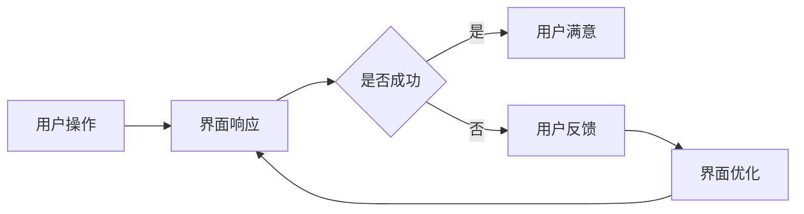

                 

关键词：用户界面设计、人机交互、用户体验、易用性、界面友好性、用户行为分析

## 摘要

本文旨在探讨如何以用户为中心设计友好、易用的人机界面。通过介绍人机界面设计的基本原则、用户行为分析的方法，以及具体的实现技术和工具，本文将帮助开发者更好地理解和满足用户需求，从而提升用户体验，增强产品的竞争力。

## 1. 背景介绍

在现代社会，计算机和互联网已经成为人们日常生活和工作中不可或缺的一部分。人机界面（Human-Computer Interface，简称HCI）作为计算机与用户之间的桥梁，其设计和实现的质量直接关系到用户体验的好坏。一个设计良好的用户界面不仅能够提高用户的效率，还能降低使用难度，减少错误率，提升用户满意度。

用户界面设计不仅仅是视觉上的美工，更涉及到用户心理、行为学、认知科学等多个领域的知识。随着智能设备的普及，用户对界面的要求越来越高，他们不仅希望界面美观，更注重易用性和交互体验。

## 2. 核心概念与联系

### 2.1 用户界面的基本概念

用户界面是用户与计算机系统交互的界面，它包括硬件和软件两个方面。硬件界面如键盘、鼠标、触摸屏等，而软件界面则包括操作系统、应用软件的图形用户界面（GUI）。

### 2.2 人机交互的概念

人机交互（Human-Computer Interaction，简称HCI）是指用户与计算机系统之间的交互过程。它涵盖了用户如何与计算机系统进行沟通，以及计算机系统如何响应用户的输入。

### 2.3 用户行为分析

用户行为分析是通过观察和分析用户在使用界面时的行为，来了解用户的偏好、习惯和需求。通过用户行为分析，开发者可以更好地理解用户，从而设计出更加符合用户需求的界面。

### 2.4 Mermaid 流程图

下面是一个简单的 Mermaid 流程图，展示了用户与界面交互的基本流程。



## 3. 核心算法原理 & 具体操作步骤

### 3.1 算法原理概述

用户界面设计涉及多个方面的算法原理，包括用户行为预测、界面布局优化、交互响应等。

### 3.2 算法步骤详解

1. **用户行为预测**：通过收集用户数据，使用机器学习算法预测用户的行为。
2. **界面布局优化**：根据用户行为预测结果，调整界面的布局，使其更符合用户的操作习惯。
3. **交互响应优化**：优化界面的交互逻辑，提高用户的操作效率。

### 3.3 算法优缺点

- **优点**：提高用户满意度，降低使用难度。
- **缺点**：需要大量用户数据支持，算法实现复杂。

### 3.4 算法应用领域

- **操作系统**：如Windows、macOS、Linux等。
- **应用软件**：如办公软件、游戏、社交应用等。

## 4. 数学模型和公式 & 详细讲解 & 举例说明

### 4.1 数学模型构建

用户满意度（Satisfaction）可以用以下公式表示：

$$ S = f(U, E, Q) $$

其中，$U$ 是用户满意度，$E$ 是用户期望，$Q$ 是实际体验。

### 4.2 公式推导过程

用户满意度取决于用户期望和实际体验。如果实际体验高于期望，用户会感到满意；如果实际体验低于期望，用户会感到不满意。

### 4.3 案例分析与讲解

假设一个用户期望的界面响应时间是2秒，而实际体验是3秒。根据公式，用户满意度为：

$$ S = f(2, 3) = \frac{2}{3} \approx 0.67 $$

这意味着用户的满意度为67%，较低。为了提高满意度，界面响应时间需要优化。

## 5. 项目实践：代码实例和详细解释说明

### 5.1 开发环境搭建

在本节中，我们将使用Python和Tkinter库来创建一个简单的用户界面。

### 5.2 源代码详细实现

以下是创建一个具有基本交互功能的用户界面示例代码：

```python
import tkinter as tk

def on_button_click():
    label.config(text="按钮被点击了！")

root = tk.Tk()
root.title("用户界面示例")

button = tk.Button(root, text="点击我", command=on_button_click)
button.pack()

label = tk.Label(root, text="")
label.pack()

root.mainloop()
```

### 5.3 代码解读与分析

1. **引入库**：使用 `import tkinter as tk` 引入Tkinter库。
2. **定义函数**：`on_button_click` 函数在按钮被点击时执行。
3. **创建窗口**：使用 `tk.Tk()` 创建一个窗口。
4. **添加组件**：创建一个按钮和标签，并设置它们的初始状态。
5. **运行主循环**：`root.mainloop()` 使窗口和组件可见。

### 5.4 运行结果展示

运行上述代码后，将弹出一个窗口，其中包含一个按钮和一个标签。当点击按钮时，标签的文本将更新为“按钮被点击了！”。

## 6. 实际应用场景

用户界面设计在各个领域都有广泛的应用，如：

- **操作系统**：如Windows、macOS、Linux等。
- **应用软件**：如办公软件、游戏、社交应用等。
- **智能家居**：如智能音箱、智能门锁等。

## 7. 工具和资源推荐

### 7.1 学习资源推荐

- 《交互设计精髓》
- 《用户体验要素》

### 7.2 开发工具推荐

- Sketch
- Figma
- Adobe XD

### 7.3 相关论文推荐

- "The Design of Sites: Patterns, Principles, and Processes for Crafting a Customer-Centric Web Experience"
- "User Experience Management: A Research Agenda"

## 8. 总结：未来发展趋势与挑战

随着人工智能和大数据技术的发展，用户界面设计将朝着更加智能化、个性化的方向发展。然而，这同时也带来了新的挑战，如数据隐私保护、用户行为预测的准确性等。

## 9. 附录：常见问题与解答

### Q: 用户界面设计应该遵循哪些基本原则？

A: 用户界面设计应该遵循以下基本原则：

- **一致性**：界面元素应该具有一致性，避免用户混淆。
- **简洁性**：界面应该简洁明了，避免过多的干扰信息。
- **易用性**：界面应该易于使用，降低用户的学习成本。
- **反馈**：界面应该及时给用户反馈，提高用户的操作信心。

### Q: 如何进行用户行为分析？

A: 用户行为分析可以通过以下方法进行：

- **观察法**：直接观察用户在界面上的行为。
- **问卷调查**：收集用户对界面和产品的反馈。
- **用户测试**：进行实际的用户测试，收集用户操作数据。

---

### 作者署名

作者：禅与计算机程序设计艺术 / Zen and the Art of Computer Programming
----------------------------------------------------------------


