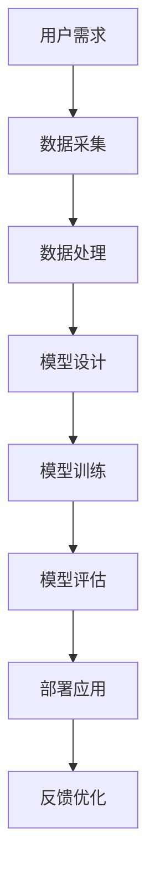
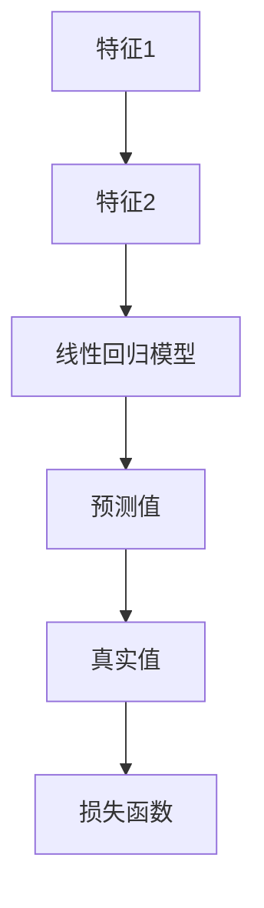

                 

关键词：贾扬清、大模型、价格战、实际应用、发展趋势、挑战、技术分析

> 摘要：随着人工智能领域的快速发展，大模型的应用越来越广泛，其价格也经历了显著的下降。本文将结合贾扬清的观点，深入探讨大模型价格下降的趋势及其对实际应用的影响，以及未来可能面临的挑战和发展方向。

## 1. 背景介绍

### 1.1 人工智能与大数据模型

人工智能（AI）是计算机科学的一个分支，它致力于研究如何使计算机模拟人类智能行为。大数据模型是人工智能领域的一个重要组成部分，它们利用大量数据进行训练，以实现诸如自然语言处理、图像识别、预测分析等复杂任务。

### 1.2 大模型的发展历程

自2012年AlexNet的出现以来，深度学习技术在人工智能领域取得了巨大的成功。随着计算能力的提升和数据的积累，大模型（也称为巨量模型）逐渐成为研究热点。这些模型拥有数十亿甚至数万亿个参数，能够在多种任务上实现卓越的性能。

### 1.3 大模型价格的下降趋势

过去几年，随着云计算、深度学习框架和硬件技术的进步，大模型训练的成本显著降低。这一趋势不仅推动了大模型的广泛应用，也引发了对价格战及其对行业影响的讨论。

## 2. 核心概念与联系

为了更好地理解大模型价格下降的趋势及其影响，我们需要回顾一些核心概念和架构。

### 2.1 云计算与分布式计算

云计算提供了弹性计算资源，使得大规模模型训练变得更加高效和成本效益。分布式计算架构，如Spark和Hadoop，使得数据处理能力得到了极大的提升。

### 2.2 深度学习框架

深度学习框架如TensorFlow和PyTorch提供了易于使用的接口，使得研究人员和开发者能够快速构建和训练复杂的模型。

### 2.3 硬件加速

GPU和TPU等专用硬件加速器在深度学习任务中发挥了重要作用，大幅提高了训练速度和效率。

以下是一个Mermaid流程图，展示了大模型架构的核心组件：



## 3. 核心算法原理 & 具体操作步骤

### 3.1 算法原理概述

大模型通常基于深度学习技术，其核心原理是神经网络。神经网络通过多层次的神经元连接来模拟人类大脑的处理方式。

### 3.2 算法步骤详解

- 数据预处理：对原始数据进行清洗、归一化和特征提取。
- 模型设计：选择合适的神经网络架构，如CNN、RNN或Transformer。
- 模型训练：使用梯度下降等优化算法，通过大量数据进行迭代训练。
- 模型评估：通过验证集和测试集评估模型的性能，调整参数以达到最佳效果。
- 部署应用：将训练好的模型部署到生产环境，进行实际任务的处理。

### 3.3 算法优缺点

**优点：**
- 强大的表示能力：能够捕捉复杂的数据特征。
- 自适应：能够自动调整参数以适应不同任务和数据。

**缺点：**
- 计算成本高：训练大模型需要大量的计算资源和时间。
- 数据依赖：模型的性能很大程度上取决于数据的质量和多样性。

### 3.4 算法应用领域

大模型在图像识别、自然语言处理、推荐系统、预测分析等领域得到了广泛应用。

## 4. 数学模型和公式 & 详细讲解 & 举例说明

### 4.1 数学模型构建

神经网络的核心是权重和偏置的调整。以下是一个简单的线性回归模型：

$$ y = \sum_{i=1}^{n} w_i x_i + b $$

其中，$w_i$是权重，$x_i$是特征，$b$是偏置。

### 4.2 公式推导过程

假设我们有一个线性回归模型，目标是最小化损失函数：

$$ J(w, b) = \frac{1}{2} \sum_{i=1}^{n} (y_i - \hat{y}_i)^2 $$

其中，$\hat{y}_i$是预测值，$y_i$是真实值。

### 4.3 案例分析与讲解

假设我们有一个简单的数据集，包含两个特征和一个目标变量。我们使用线性回归模型来预测目标变量。



通过迭代调整权重和偏置，我们能够找到一个最优解，使得预测值与真实值的误差最小。

## 5. 项目实践：代码实例和详细解释说明

### 5.1 开发环境搭建

为了运行下面的代码，我们需要安装Python环境和深度学习框架PyTorch。

```bash
pip install python
pip install torch torchvision
```

### 5.2 源代码详细实现

以下是一个简单的线性回归模型实现：

```python
import torch
import torch.nn as nn
import torch.optim as optim

# 数据集
x = torch.tensor([[1], [2], [3], [4], [5]])
y = torch.tensor([[2], [4], [6], [8], [10]])

# 模型
model = nn.Linear(1, 1)

# 损失函数
criterion = nn.MSELoss()

# 优化器
optimizer = optim.SGD(model.parameters(), lr=0.01)

# 训练
for epoch in range(100):
    optimizer.zero_grad()
    output = model(x)
    loss = criterion(output, y)
    loss.backward()
    optimizer.step()
    print(f"Epoch {epoch+1}: Loss = {loss.item()}")

# 预测
x_test = torch.tensor([[6]])
output = model(x_test)
print(f"Predicted value: {output.item()}")
```

### 5.3 代码解读与分析

这段代码首先定义了一个简单的线性回归模型，使用均方误差损失函数和随机梯度下降优化器进行训练。通过100次迭代，模型能够收敛到一个较好的状态，并能够对新的数据进行预测。

## 6. 实际应用场景

### 6.1 图像识别

大模型在图像识别领域取得了显著的成就，例如人脸识别、物体检测等。随着价格的下降，这些模型的应用范围将进一步扩大。

### 6.2 自然语言处理

自然语言处理（NLP）是人工智能的一个重要分支，大模型在文本分类、情感分析、机器翻译等领域展现了强大的能力。

### 6.3 推荐系统

推荐系统利用大模型进行用户行为分析，从而提供个性化的推荐。随着大模型价格的下降，推荐系统的成本将显著降低。

## 7. 未来应用展望

随着大模型价格的进一步下降，它们将在更多领域得到应用。同时，我们也需要关注以下趋势：

### 7.1 数据隐私保护

随着大数据的应用，数据隐私保护成为了一个重要问题。未来的大模型技术需要更好地解决数据隐私问题。

### 7.2 模型压缩与优化

为了降低成本和资源消耗，大模型需要进一步压缩和优化。

### 7.3 跨领域应用

大模型将在更多领域得到应用，从而推动人工智能的全面发展。

## 8. 总结：未来发展趋势与挑战

### 8.1 研究成果总结

本文回顾了大模型的发展历程，探讨了价格下降的趋势及其影响，并分析了实际应用场景。

### 8.2 未来发展趋势

大模型将在更多领域得到应用，并推动人工智能技术的全面发展。

### 8.3 面临的挑战

数据隐私保护、模型压缩与优化等问题将成为未来研究的重点。

### 8.4 研究展望

随着技术的进步，大模型的价格将进一步下降，从而推动人工智能的广泛应用。

## 9. 附录：常见问题与解答

### 9.1 大模型训练需要多少时间？

大模型训练的时间取决于模型的大小、数据集的大小以及硬件配置。通常，训练一个大型模型可能需要几天甚至几周的时间。

### 9.2 大模型的价格为什么会下降？

大模型的价格下降主要是由于云计算、深度学习框架和硬件技术的进步。这些技术使得大规模模型训练变得更加高效和成本效益。

### 9.3 大模型在哪些领域有实际应用？

大模型在图像识别、自然语言处理、推荐系统、预测分析等领域有广泛的应用。

作者：禅与计算机程序设计艺术 / Zen and the Art of Computer Programming
----------------------------------------------------------------


