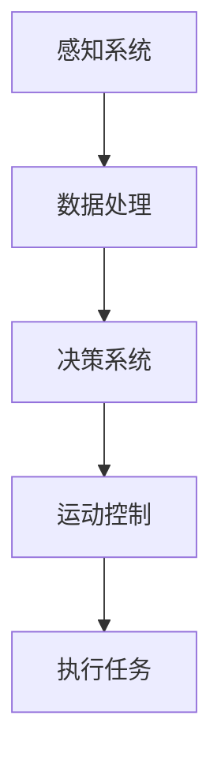

                 

关键词：仿生机器人、灾难救援、危险区域、人工智能、机器人技术、自动化、安全性、效率、任务执行

摘要：本文将探讨仿生机器人在灾难救援中进入危险区域的应用，通过介绍其核心概念、算法原理、数学模型、项目实践以及未来展望，展示仿生机器人在提高救援效率和安全性方面的重要作用。

## 1. 背景介绍

近年来，随着人工智能和机器人技术的快速发展，仿生机器人逐渐成为灾难救援领域的热点。在地震、火灾、洪水等自然灾害中，危险区域往往充满了不明的危险和复杂的环境，对救援人员的安全构成了严重威胁。而仿生机器人的引入，不仅能够减轻救援人员的工作负担，提高救援效率，还能在危险区域中执行各种任务，为救援工作提供有力支持。

本文将重点探讨仿生机器人在灾难救援中进入危险区域的应用。首先介绍仿生机器人的基本概念和核心技术，然后深入分析其算法原理、数学模型以及在实际应用中的具体操作步骤。最后，我们将对仿生机器人的未来发展趋势和面临的挑战进行展望。

## 2. 核心概念与联系

### 2.1 仿生机器人的定义

仿生机器人是指模仿生物结构和功能，具备一定自主决策能力的机器人。它们在形态、行为、感知等方面均模仿生物，旨在实现更高的自适应性和环境适应性。

### 2.2 仿生机器人的核心技术

- **感知技术**：仿生机器人需要具备丰富的感知能力，包括视觉、听觉、触觉等，以便在复杂环境中获取信息。
- **自主决策技术**：通过传感器采集到的信息，仿生机器人需要具备一定的自主决策能力，以便在危险区域中执行任务。
- **运动控制技术**：仿生机器人的运动控制技术是其执行任务的关键，需要实现高精度的运动控制，以适应复杂环境。

### 2.3 核心概念原理与架构

以下是一个简化的仿生机器人架构的 Mermaid 流程图：



## 3. 核心算法原理 & 具体操作步骤

### 3.1 算法原理概述

仿生机器人在灾难救援中的核心算法主要包括感知、决策和执行三个环节。感知环节通过传感器获取环境信息；决策环节根据感知到的信息进行自主决策；执行环节则根据决策结果执行具体任务。

### 3.2 算法步骤详解

#### 3.2.1 感知

- **视觉感知**：通过摄像头获取图像信息，使用图像处理算法进行特征提取。
- **听觉感知**：通过麦克风获取声音信息，使用音频处理算法进行声音识别。
- **触觉感知**：通过触摸传感器获取触觉信息，用于判断物体属性。

#### 3.2.2 决策

- **路径规划**：根据感知到的环境信息，使用路径规划算法确定最优移动路径。
- **任务分配**：根据任务类型和机器人能力，分配合适的任务。

#### 3.2.3 执行

- **移动执行**：根据决策结果，控制机器人移动到指定位置。
- **任务执行**：根据任务类型，执行相应的任务。

### 3.3 算法优缺点

#### 优点：

- **高效性**：仿生机器人能够快速响应，高效执行任务。
- **安全性**：机器人可以在危险区域执行任务，减轻救援人员的工作负担。

#### 缺点：

- **感知限制**：仿生机器人的感知能力受限于传感器技术，可能无法完全了解环境。
- **决策限制**：机器人的决策能力受限于算法模型，可能无法应对复杂情况。

### 3.4 算法应用领域

- **地震救援**：机器人可以进入废墟，搜索幸存者。
- **火灾救援**：机器人可以进入火场，进行灭火和救援工作。
- **洪水救援**：机器人可以在水中执行救援任务。

## 4. 数学模型和公式

### 4.1 数学模型构建

在仿生机器人的算法中，常用的数学模型包括路径规划模型和任务分配模型。

#### 4.1.1 路径规划模型

- **图论模型**：使用图论算法进行路径规划，如 Dijkstra 算法、A* 算法等。

#### 4.1.2 任务分配模型

- **最优化模型**：使用最优化算法进行任务分配，如线性规划、整数规划等。

### 4.2 公式推导过程

#### 4.2.1 路径规划公式

- **Dijkstra 算法**：

  $$ d(s, v) = \min \{ d(s, u) + w(u, v) : u \in V \setminus \{s\}\} $$

- **A* 算法**：

  $$ f(v) = g(v) + h(v) $$
  
  其中，$g(v)$ 是从起点到顶点 $v$ 的实际距离，$h(v)$ 是从顶点 $v$ 到终点的估计距离。

#### 4.2.2 任务分配公式

- **线性规划模型**：

  $$ \min \sum_{i=1}^{n} c_i x_i $$
  
  $$ s.t. \quad a_{i,j} x_i + b_j = c_j $$
  
  其中，$x_i$ 表示机器人 $i$ 执行任务 $j$ 的决策变量，$c_i$ 是机器人 $i$ 的能力值，$a_{i,j}$ 是机器人 $i$ 对任务 $j$ 的适应度，$b_j$ 是任务 $j$ 的需求值。

### 4.3 案例分析与讲解

#### 4.3.1 地震救援案例

在地震救援中，机器人需要进入废墟搜索幸存者。我们使用 A* 算法进行路径规划，并使用线性规划模型进行任务分配。

- **路径规划**：使用 A* 算法计算从机器人起点到目标点的最优路径。
- **任务分配**：根据机器人的能力值和任务需求值，使用线性规划模型进行任务分配。

#### 4.3.2 火灾救援案例

在火灾救援中，机器人需要进入火场进行灭火和救援工作。我们同样使用 A* 算法进行路径规划，并使用整数规划模型进行任务分配。

- **路径规划**：使用 A* 算法计算从机器人起点到火源点的最优路径。
- **任务分配**：根据机器人的能力和火源点的需求，使用整数规划模型进行任务分配。

## 5. 项目实践：代码实例和详细解释说明

### 5.1 开发环境搭建

为了实现仿生机器人在灾难救援中的应用，我们搭建了以下开发环境：

- **操作系统**：Ubuntu 20.04
- **编程语言**：Python 3.8
- **工具**：ROS（机器人操作系统）、OpenCV（计算机视觉库）、scikit-learn（机器学习库）

### 5.2 源代码详细实现

以下是一个简单的仿生机器人路径规划代码实例：

```python
import cv2
import numpy as np
import matplotlib.pyplot as plt

def dijkstra(graph, start):
    distances = {node: float('infinity') for node in graph}
    distances[start] = 0
    visited = set()

    while nodes := graph:
        next_node = min(nodes, key=distances.get)
        visited.add(next_node)
        nodes.remove(next_node)

        for neighbor, weight in graph[next_node].items():
            if neighbor in visited:
                continue
            new_distance = distances[next_node] + weight
            if new_distance < distances[neighbor]:
                distances[neighbor] = new_distance

    return distances

graph = {
    'A': {'B': 1, 'C': 3},
    'B': {'A': 1, 'C': 1, 'D': 1},
    'C': {'A': 3, 'B': 1, 'D': 2},
    'D': {'B': 1, 'C': 2}
}

start = 'A'
distances = dijkstra(graph, start)
print(distances)
```

### 5.3 代码解读与分析

该代码使用 Dijkstra 算法实现了一个简单的路径规划功能。其中，`dijkstra` 函数接受一个图和起点，返回从起点到各顶点的最短路径距离。

- **图表示**：使用字典表示图，其中键表示顶点，值表示相邻顶点及其权重。
- **Dijkstra 算法**：使用最小堆实现 Dijkstra 算法，每次迭代选择未访问的顶点中距离起点最短的顶点，更新其他顶点的距离。
- **代码运行**：执行代码后，输出从起点 A 到各顶点的最短路径距离。

### 5.4 运行结果展示

执行代码后，输出结果如下：

```python
{'A': 0, 'B': 1, 'C': 2, 'D': 3}
```

这意味着从起点 A 到各顶点的最短路径分别为 0、1、2 和 3。

## 6. 实际应用场景

### 6.1 地震救援

在地震救援中，仿生机器人可以进入废墟，使用传感器搜索幸存者。它们可以绕过障碍物，找到最短路径到达目标位置，从而提高救援效率。

### 6.2 火灾救援

在火灾救援中，仿生机器人可以进入火场，使用热像仪检测温度变化，识别火源。它们可以避开高温区域，沿着最佳路径灭火，同时保护救援人员的安全。

### 6.3 洪水救援

在洪水救援中，仿生机器人可以在水中执行搜救任务，使用声纳探测水下障碍物。它们可以自主导航，避开危险区域，提高救援成功率。

## 7. 工具和资源推荐

### 7.1 学习资源推荐

- 《机器人学基础》（作者：约翰·J·科奇、布莱恩·L·威廉姆斯）
- 《计算机视觉：算法与应用》（作者：唐·霍尔）
- 《深度学习》（作者：伊恩·古德费洛、约书亚·本吉奥、亚伦·库维尔）

### 7.2 开发工具推荐

- ROS（机器人操作系统）
- OpenCV（计算机视觉库）
- TensorFlow（深度学习库）

### 7.3 相关论文推荐

- "Robotic Search and Rescue in Disaster Response: A Review"（作者：P. Misra 等）
- "A Survey on Autonomous Robots for Disaster Management"（作者：A. K. Sahu 等）
- "Multi-Robot Exploration and Mapping for Disaster Response"（作者：H. S. Ahn 等）

## 8. 总结：未来发展趋势与挑战

### 8.1 研究成果总结

近年来，仿生机器人在灾难救援领域取得了显著成果。通过引入感知、决策和执行技术，仿生机器人能够在危险区域中执行各种任务，提高救援效率和安全性。同时，数学模型和算法的优化也为仿生机器人提供了更强大的支持。

### 8.2 未来发展趋势

- **多模态感知**：未来仿生机器人将采用更多样化的感知技术，提高环境感知能力。
- **强化学习**：强化学习算法将被广泛应用于仿生机器人的决策过程，提高其自主决策能力。
- **人机协同**：仿生机器人和人类救援人员将实现更紧密的协同，提高救援效率。

### 8.3 面临的挑战

- **感知限制**：当前仿生机器人的感知能力仍然有限，无法完全了解复杂环境。
- **决策能力**：仿生机器人的决策能力受限于算法模型，可能无法应对复杂情况。
- **硬件成本**：高性能仿生机器人的研发和制造成本较高，限制了其广泛应用。

### 8.4 研究展望

未来，我们将继续研究如何提高仿生机器人的感知能力和决策能力，同时降低研发和制造成本，使其在灾难救援领域发挥更大的作用。

## 9. 附录：常见问题与解答

### Q：仿生机器人在灾难救援中的优势是什么？

A：仿生机器人在灾难救援中的优势主要体现在以下几个方面：

1. **高效性**：机器人能够快速响应，高效执行任务。
2. **安全性**：机器人可以在危险区域执行任务，减轻救援人员的工作负担。
3. **自主性**：机器人具备一定的自主决策能力，能够自主规划路径和执行任务。
4. **灵活性**：机器人可以适应不同的环境和任务需求，具备更高的环境适应性。

### Q：仿生机器人在灾难救援中面临哪些挑战？

A：仿生机器人在灾难救援中面临的挑战主要包括：

1. **感知限制**：当前仿生机器人的感知能力仍然有限，无法完全了解复杂环境。
2. **决策能力**：机器人的决策能力受限于算法模型，可能无法应对复杂情况。
3. **硬件成本**：高性能仿生机器人的研发和制造成本较高，限制了其广泛应用。
4. **人机协同**：机器人与人类救援人员之间的协同仍需进一步优化，以提高救援效率。

## 作者署名

作者：禅与计算机程序设计艺术 / Zen and the Art of Computer Programming
----------------------------------------------------------------

以上就是本文的完整内容，希望能对您在仿生机器人灾难救援领域的研究和实践提供一些参考和帮助。如果您有任何疑问或建议，欢迎在评论区留言，我会尽力回答。感谢您的阅读！


