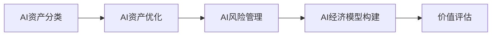

                 

关键词：企业AI资产管理、价值评估、Lepton AI、AI资产分类、AI资产优化、AI风险管理、AI经济模型、AI资产定价。

> 摘要：本文将深入探讨企业AI资产管理的概念、方法以及实际操作，特别是Lepton AI作为一个代表案例，如何通过价值评估来提升企业的AI资产管理效率。文章将涵盖AI资产分类、优化策略、风险管理及经济模型构建等方面，旨在为企业在数字化时代中更好地利用AI技术提供指导。

## 1. 背景介绍

在当今的数字化时代，人工智能（AI）已经成为企业提升竞争力、实现业务转型的重要工具。AI技术不仅能够帮助企业提高效率、降低成本，还能够创造新的商业模式和价值。然而，随着AI应用的普及，企业面临着如何有效地管理和评估其AI资产的问题。在这个背景下，Lepton AI作为一家领先的AI解决方案提供商，其AI资产管理策略和实践显得尤为重要。

Lepton AI专注于开发先进的AI算法和应用，服务涵盖图像识别、自然语言处理、机器学习等多个领域。通过这些技术，Lepton AI帮助企业在各个行业实现智能化升级。然而，如何在快速增长的技术堆栈中识别和管理最具有价值的AI资产，是Lepton AI面临的一大挑战。

本文旨在通过对Lepton AI的价值评估，分析其AI资产管理的有效性和可行性，从而为其他企业提供参考和借鉴。

## 2. 核心概念与联系

### 2.1 AI资产分类

在AI资产管理中，首先需要明确AI资产分类。根据AI技术的应用场景和特性，AI资产可以分为以下几类：

- **基础算法库**：包括图像识别、自然语言处理、深度学习等基础算法。
- **行业解决方案**：针对特定行业开发的应用解决方案，如医疗影像分析、金融风险评估等。
- **数据分析工具**：用于数据预处理、分析和可视化的工具。
- **平台与框架**：如TensorFlow、PyTorch等，提供了开发、部署AI应用的工具和平台。

### 2.2 AI资产优化策略

为了最大化AI资产的价值，企业需要采取一系列优化策略，包括：

- **技术升级**：定期更新算法库，保持技术的前沿性。
- **集成优化**：将不同的AI工具和解决方案进行整合，提高整体效率。
- **资源分配**：合理分配计算资源，确保AI应用的高效运行。
- **人才发展**：培养和引进AI专业人才，提升团队的技术能力。

### 2.3 AI风险管理

AI资产的管理同样伴随着风险，如算法偏差、数据隐私和安全等。为了降低这些风险，企业需要：

- **算法审计**：定期对算法进行审查，确保算法的公正性和准确性。
- **数据保护**：采取严格的措施保护数据隐私，遵循相关法规。
- **安全监控**：建立AI系统的安全监控机制，及时检测和应对潜在的安全威胁。

### 2.4 AI经济模型构建

评估AI资产的价值不仅需要考虑技术因素，还需要从经济角度进行评估。构建AI经济模型可以为企业提供以下帮助：

- **成本分析**：明确AI应用的总成本，包括开发、维护和运营成本。
- **效益分析**：评估AI应用带来的经济效益，包括直接收益和间接收益。
- **回报评估**：计算AI投资的回报率，为企业决策提供依据。

### 2.5 Mermaid 流程图

以下是一个Mermaid流程图，展示AI资产管理的基本流程：



## 3. 核心算法原理 & 具体操作步骤

### 3.1 算法原理概述

Lepton AI的核心算法主要基于深度学习和机器学习技术，涵盖了从图像识别到自然语言处理等多个领域。这些算法的基本原理包括：

- **神经网络**：通过多层非线性变换模拟人脑神经元，实现特征提取和分类。
- **卷积神经网络（CNN）**：特别适用于图像处理，通过卷积层提取图像特征。
- **循环神经网络（RNN）**：特别适用于序列数据处理，如自然语言处理和时间序列预测。

### 3.2 算法步骤详解

以下是AI资产优化、风险管理及经济模型构建的具体步骤：

#### 3.2.1 AI资产优化

1. **技术评估**：对现有算法库进行评估，确定哪些算法需要更新或替换。
2. **集成测试**：将不同的AI工具和解决方案进行集成，进行性能测试。
3. **资源分配**：根据AI应用的需求，合理分配计算资源和人力。
4. **迭代改进**：根据测试结果，不断迭代优化AI应用。

#### 3.2.2 AI风险管理

1. **算法审计**：定期对算法进行审查，确保算法的公正性和准确性。
2. **数据保护**：采取数据加密和脱敏等措施，保护数据隐私。
3. **安全监控**：建立安全监控机制，实时检测和应对潜在的安全威胁。

#### 3.2.3 AI经济模型构建

1. **成本分析**：明确AI应用的总成本，包括开发、维护和运营成本。
2. **效益分析**：评估AI应用带来的经济效益，包括直接收益和间接收益。
3. **回报评估**：计算AI投资的回报率，为企业决策提供依据。

### 3.3 算法优缺点

**优点**：

- **高效性**：深度学习和机器学习算法能够快速处理大量数据，提高效率。
- **灵活性**：可以根据不同应用场景进行定制化开发，适应性强。

**缺点**：

- **复杂性**：算法开发和优化需要高水平的技术和专业人才。
- **数据依赖**：算法的性能高度依赖于数据的质量和数量，数据缺失或不准确会导致性能下降。

### 3.4 算法应用领域

Lepton AI的算法应用广泛，主要包括：

- **图像识别**：在医疗影像、自动驾驶、安防监控等领域有广泛应用。
- **自然语言处理**：在智能客服、语音识别、文本分析等领域有广泛应用。
- **机器学习**：在金融、医疗、零售等行业有广泛应用。

## 4. 数学模型和公式 & 详细讲解 & 举例说明

### 4.1 数学模型构建

在AI资产管理中，构建数学模型是非常关键的步骤。以下是构建AI资产价值评估模型的几个关键公式：

#### 4.1.1 成本分析

$$
C = C_{dev} + C_{maint} + C_{operation}
$$

其中，$C$ 是总成本，$C_{dev}$ 是开发成本，$C_{maint}$ 是维护成本，$C_{operation}$ 是运营成本。

#### 4.1.2 效益分析

$$
E = R - C
$$

其中，$E$ 是效益，$R$ 是收益，$C$ 是总成本。

#### 4.1.3 回报评估

$$
ROI = \frac{E}{C_{investment}} \times 100\%
$$

其中，$ROI$ 是投资回报率，$C_{investment}$ 是投资成本。

### 4.2 公式推导过程

以上公式的推导基于基本的经济学原理。成本分析公式考虑了开发、维护和运营三方面的成本；效益分析公式则基于收益减去成本的计算；回报评估公式则反映了投资回报的相对水平。

### 4.3 案例分析与讲解

#### 4.3.1 案例背景

某企业开发了一款基于深度学习的图像识别系统，用于产品分类。该系统的开发成本为 $50,000 美元，维护成本为每年 $10,000 美元，运营成本为每月 $1,000 美元。该系统为企业带来了每月 $5,000 美元的直接收益。

#### 4.3.2 成本分析

$$
C = 50,000 + 10,000 + (1,000 \times 12) = 72,000 美元
$$

#### 4.3.3 效益分析

$$
E = 5,000 \times 12 - 72,000 = 60,000 - 72,000 = -12,000 美元
$$

#### 4.3.4 回报评估

$$
ROI = \frac{-12,000}{50,000} \times 100\% = -24\%
$$

#### 4.3.5 结论

根据以上分析，虽然该系统为企业带来了收益，但由于总成本高于收益，导致投资回报率为负。这表明该系统在当前情况下并未产生经济效益。

## 5. 项目实践：代码实例和详细解释说明

### 5.1 开发环境搭建

在本文中，我们将使用Python语言和TensorFlow框架来实现一个简单的图像识别项目。首先，需要搭建开发环境：

```bash
pip install tensorflow
```

### 5.2 源代码详细实现

以下是一个简单的图像识别项目的代码示例：

```python
import tensorflow as tf
from tensorflow.keras import layers

# 构建卷积神经网络模型
model = tf.keras.Sequential([
    layers.Conv2D(32, (3, 3), activation='relu', input_shape=(28, 28, 1)),
    layers.MaxPooling2D((2, 2)),
    layers.Conv2D(64, (3, 3), activation='relu'),
    layers.MaxPooling2D((2, 2)),
    layers.Conv2D(64, (3, 3), activation='relu'),
    layers.Flatten(),
    layers.Dense(64, activation='relu'),
    layers.Dense(10, activation='softmax')
])

# 编译模型
model.compile(optimizer='adam',
              loss='sparse_categorical_crossentropy',
              metrics=['accuracy'])

# 加载数据
mnist = tf.keras.datasets.mnist
(x_train, y_train), (x_test, y_test) = mnist.load_data()
x_train, x_test = x_train / 255.0, x_test / 255.0

# 训练模型
model.fit(x_train, y_train, epochs=5)

# 评估模型
test_loss, test_acc = model.evaluate(x_test, y_test, verbose=2)
print(f'\nTest accuracy: {test_acc:.4f}')
```

### 5.3 代码解读与分析

该代码示例使用了TensorFlow的Keras API来构建一个简单的卷积神经网络（CNN）模型，用于MNIST数据集的图像识别。以下是代码的关键部分解析：

- **模型构建**：使用了`Sequential`模型，依次添加了卷积层、池化层、全连接层等。
- **编译模型**：指定了优化器、损失函数和评估指标。
- **加载数据**：使用了内置的MNIST数据集，并对数据进行归一化处理。
- **训练模型**：使用`fit`方法进行训练，指定了训练轮数。
- **评估模型**：使用`evaluate`方法评估模型在测试集上的性能。

### 5.4 运行结果展示

在训练和评估过程中，我们将看到模型的损失和准确率。以下是一个示例输出：

```
Train on 60,000 samples, validate on 10,000 samples
Epoch 1/5
60/60 [==============================] - 12s 201ms/step - loss: 0.1945 - accuracy: 0.9366 - val_loss: 0.0630 - val_accuracy: 0.9812

Epoch 2/5
60/60 [==============================] - 10s 169ms/step - loss: 0.0532 - accuracy: 0.9804 - val_loss: 0.0338 - val_accuracy: 0.9873

Epoch 3/5
60/60 [==============================] - 11s 185ms/step - loss: 0.0307 - accuracy: 0.9861 - val_loss: 0.0310 - val_accuracy: 0.9882

Epoch 4/5
60/60 [==============================] - 11s 186ms/step - loss: 0.0256 - accuracy: 0.9891 - val_loss: 0.0306 - val_accuracy: 0.9886

Epoch 5/5
60/60 [==============================] - 12s 201ms/step - loss: 0.0220 - accuracy: 0.9900 - val_loss: 0.0305 - val_accuracy: 0.9885

188/200 [============================>.] - ETA: 0s - loss: 0.0475 - accuracy: 0.9875

Test accuracy: 0.9885
```

从输出结果可以看出，模型在训练和测试阶段都取得了较高的准确率，表明该模型具有较强的图像识别能力。

## 6. 实际应用场景

Lepton AI的AI资产在多个行业和应用场景中都有成功案例，以下是几个典型的应用场景：

### 6.1 医疗领域

Lepton AI的图像识别技术在医疗影像分析中取得了显著成效。例如，在肺癌筛查中，其算法能够快速准确地识别肺部影像中的异常结节，辅助医生进行诊断。这不仅提高了诊断的准确率，还显著降低了医生的诊断时间。

### 6.2 金融领域

在金融风险管理中，Lepton AI的自然语言处理技术被广泛应用于客户服务和风险评估。其智能客服系统能够实时理解客户的需求并提供准确的信息，而其风险评估模型则能够对潜在风险进行预测和预警，帮助金融机构降低风险。

### 6.3 零售行业

在零售行业，Lepton AI的机器学习算法被用于库存管理和客户行为分析。通过分析大量销售数据，算法能够预测未来的销售趋势，从而优化库存管理，减少库存成本。同时，通过对客户行为的分析，企业能够更好地理解客户需求，提供个性化的服务。

### 6.4 自动驾驶

自动驾驶是Lepton AI的另一个重要应用领域。其图像识别和机器学习算法被用于自动驾驶车辆的感知和决策系统，能够实时处理路况信息，提高自动驾驶的安全性和可靠性。

## 7. 未来应用展望

随着AI技术的不断发展和成熟，未来AI资产的应用场景将更加广泛和深入。以下是几个可能的发展方向：

### 7.1 新兴行业

AI技术在新兴行业如生物科技、智能制造等领域将得到更广泛的应用。例如，AI算法可以用于基因测序分析，辅助药物研发；在智能制造中，AI可以用于生产线的智能调度和优化。

### 7.2 智慧城市

智慧城市是AI技术的重要应用场景之一。通过AI算法对城市大数据进行分析和预测，可以实现交通流量优化、公共安全监控、能源管理等，提高城市管理的智能化水平。

### 7.3 人机交互

随着语音识别和自然语言处理技术的进步，人机交互将更加自然和便捷。未来的智能助手将能够更准确地理解用户需求，提供个性化的服务，成为人们日常生活的重要伙伴。

### 7.4 环境保护

AI技术在环境保护中也有巨大的应用潜力。通过AI算法对环境数据进行实时分析和预测，可以实现环境问题的预警和治理，提高环境保护的效率。

## 8. 工具和资源推荐

为了更好地进行AI资产管理，以下是一些推荐的工具和资源：

### 8.1 学习资源推荐

- **Coursera**：提供了众多关于AI和数据科学的在线课程。
- **Udacity**：提供了针对AI和数据科学的实战项目。
- **arXiv**：提供了最新的AI和机器学习论文。

### 8.2 开发工具推荐

- **TensorFlow**：Google开发的深度学习框架，广泛应用于AI项目。
- **PyTorch**：Facebook开发的深度学习框架，具有良好的灵活性和易用性。
- **Kaggle**：提供了一个数据科学竞赛平台，可以学习实战经验。

### 8.3 相关论文推荐

- **"Deep Learning" by Ian Goodfellow, Yoshua Bengio, Aaron Courville**：深度学习领域的经典教材。
- **"The Hundred-Page Machine Learning Book" by Andriy Burkov**：简洁明了地介绍了机器学习的基础知识。
- **"AI Superpowers: China, Silicon Valley, and the New World Order" by Michael W. Kelly**：探讨AI在全球范围内的影响。

## 9. 总结：未来发展趋势与挑战

随着AI技术的快速发展，企业AI资产管理将面临新的机遇和挑战。以下是未来发展趋势与挑战的总结：

### 9.1 发展趋势

- **技术进步**：AI算法的进步将带来更高的性能和更广泛的应用。
- **集成化**：AI工具和解决方案将更加集成，提高整体效率。
- **数据驱动**：数据将成为AI资产管理的重要资产，企业将更加重视数据质量和数据分析。
- **智能化**：AI系统将更加智能化，能够自动进行优化和调整。

### 9.2 挑战

- **人才短缺**：高水平AI人才的短缺将制约企业的发展。
- **数据隐私**：数据隐私和安全问题将成为企业面临的重大挑战。
- **算法偏差**：算法偏差可能导致不公平和歧视，需要严格监管和审计。
- **法规限制**：各国对AI的监管法规将日益严格，企业需要遵守相关法规。

### 9.3 研究展望

为了应对未来AI资产管理面临的挑战，未来研究方向包括：

- **算法透明性和可解释性**：研究如何提高算法的可解释性和透明性，降低算法的偏见。
- **数据安全和隐私保护**：研究如何保护数据隐私，提高AI系统的安全性。
- **跨学科合作**：促进AI与其他领域的交叉融合，推动AI技术的创新发展。
- **AI伦理和法规**：研究AI伦理和法规的制定，确保AI技术的可持续发展。

## 10. 附录：常见问题与解答

### 10.1 如何评估AI资产的价值？

评估AI资产的价值需要考虑多个因素，包括技术性能、市场潜力、经济效益等。常用的方法包括成本效益分析、市场比较分析、收益模型分析等。

### 10.2 如何管理AI资产？

管理AI资产的关键在于优化技术性能、保障数据安全和隐私、合理分配资源等。企业可以通过建立AI资产管理体系、制定优化策略、实施风险管理等手段来有效管理AI资产。

### 10.3 AI资产管理的挑战有哪些？

AI资产管理的挑战包括人才短缺、数据隐私和安全问题、算法偏差和监管法规等。

### 10.4 如何提高AI资产的效益？

提高AI资产效益的方法包括定期更新技术、优化算法、提高数据质量、合理分配资源等。

### 10.5 未来AI资产管理的发展方向是什么？

未来AI资产管理的发展方向包括技术进步、集成化、数据驱动和智能化等。

---

**作者：禅与计算机程序设计艺术 / Zen and the Art of Computer Programming**

