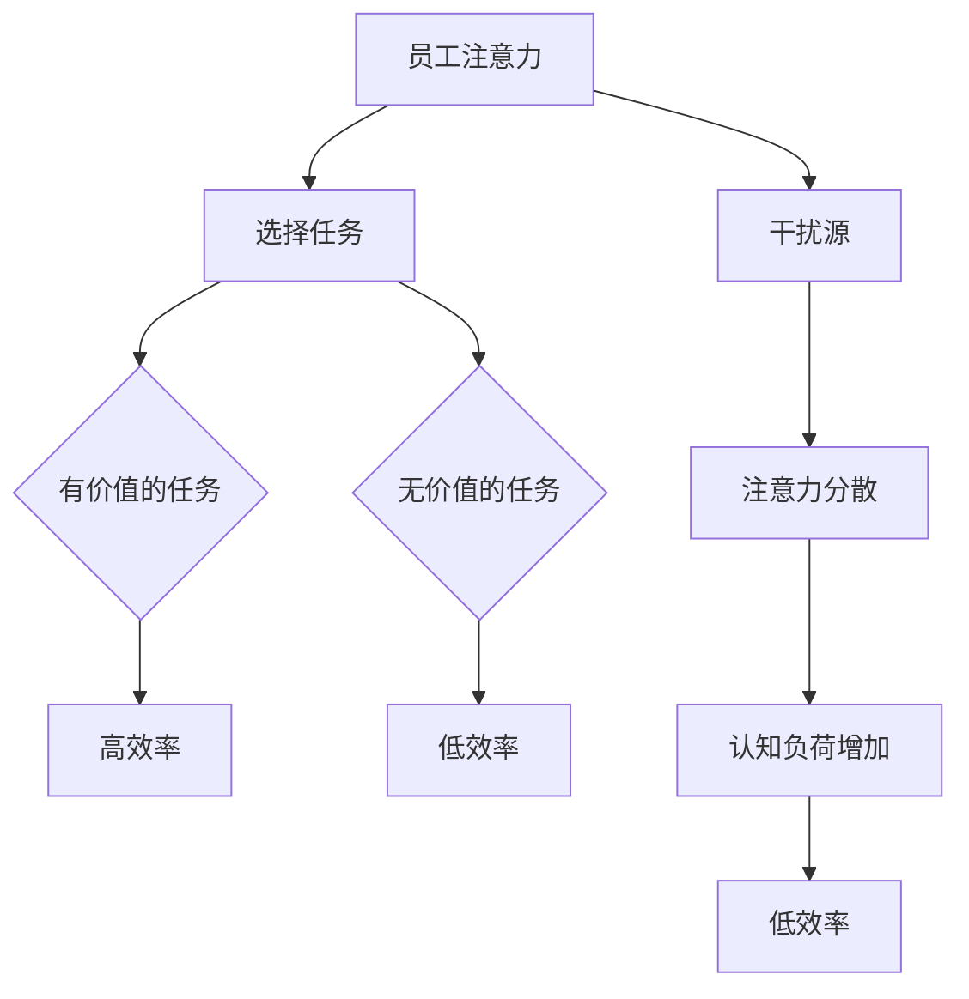

                 

注意力经济，这个词汇源于对现代工作和消费行为方式的深刻洞察。它关注的是人们注意力资源的稀缺性以及如何通过吸引和保持用户的注意力来实现商业目标。在数字化时代，随着信息过载和多重任务处理的普及，企业如何提高员工在注意力经济中的工作效率，成为一个至关重要的议题。

> 关键词：注意力经济、工作效率、员工管理、认知负荷、技术解决方案

> 摘要：本文将深入探讨注意力经济对企业工作环境的影响，分析员工在注意力稀缺环境下的认知负荷，并提出一系列技术和管理策略，帮助企业在注意力经济中提升员工的工作效率。

## 1. 背景介绍

注意力经济并非一个全新的概念。它起源于对人类注意力资源的理解，这个资源在现代社会显得尤为珍贵。随着互联网和移动设备的普及，人们可以轻松访问大量的信息和娱乐内容，导致了注意力分散和碎片化。企业需要适应这种环境，寻找方法来提高员工在有限注意力资源下的工作效率。

在注意力经济中，员工常常面临着多个任务和干扰，导致注意力无法集中。这种现象被称为“多任务处理”，虽然它看似提高了工作效率，但实际上可能降低了实际产出。研究表明，频繁切换任务会导致认知负荷的增加，进而影响决策质量和创造力。

因此，如何减少干扰、提高注意力集中度，成为企业管理者和IT专家亟待解决的问题。接下来，我们将探讨一系列策略和技术，以帮助企业在注意力经济中实现这一目标。

## 2. 核心概念与联系

### 2.1 注意力经济学原理

注意力经济学是一种理解人类注意力资源分配的经济学方法。它认为注意力是一种稀缺资源，人们必须在多个选择之间进行权衡。注意力经济学的核心原理包括：

- **注意力稀缺性**：注意力是有限的，用户无法同时关注所有信息。
- **选择性注意力**：用户会选择对自己最有价值或最感兴趣的信息进行关注。
- **注意力转移**：通过特定的刺激和设计，可以引导用户的注意力从一项任务转移到另一项任务。

### 2.2 工作效率与注意力的关系

工作与注意力之间存在密切的关系。高效率通常意味着高度集中的注意力。当员工能够专注于手头的任务时，他们的创造力、决策质量和速度都会得到提升。然而，注意力分散和多任务处理会降低工作效率。

### 2.3 Mermaid 流程图

以下是一个简化的 Mermaid 流程图，展示了注意力经济学原理在企业中的应用：



### 2.4 注意力经济学的关键要素

- **注意力分配**：员工如何分配有限的注意力资源。
- **注意力管理**：企业如何通过管理策略来优化员工的注意力。
- **注意力激励**：如何通过激励机制来提高员工对任务的关注度。

## 3. 核心算法原理 & 具体操作步骤

### 3.1 算法原理概述

在注意力经济中，提高员工效率的核心算法可以归结为“注意力优化算法”。该算法的目标是：

- 减少干扰源的数量和强度。
- 提高任务选择的质量。
- 优化注意力分配策略。

### 3.2 算法步骤详解

#### 3.2.1 数据收集与分析

- **收集数据**：通过员工工作日志、工作量和质量评估等方式，收集员工在注意力分散环境下的表现数据。
- **数据分析**：利用统计分析方法，识别出影响员工注意力分散的主要因素。

#### 3.2.2 干扰源识别

- **识别干扰源**：通过数据分析，确定导致员工注意力分散的主要干扰源。
- **优先级排序**：对识别出的干扰源进行优先级排序，以便制定有针对性的管理策略。

#### 3.2.3 注意力分配策略

- **制定策略**：基于数据分析结果，制定出优化注意力分配的策略。
- **实施策略**：在企业内部推广和实施注意力分配策略。

#### 3.2.4 注意力管理工具

- **开发工具**：利用人工智能和机器学习技术，开发能够辅助员工管理注意力的工具。
- **用户培训**：对员工进行使用这些工具的培训。

### 3.3 算法优缺点

#### 优点：

- **提高工作效率**：通过减少干扰和优化注意力分配，提高员工的工作效率。
- **增强员工满意度**：通过提供工具和策略，帮助员工更好地管理自己的注意力，提高工作满意度。

#### 缺点：

- **初期投入**：开发和管理注意力优化算法需要一定的资金和技术投入。
- **实施难度**：在实施过程中，可能会面临员工抵触和接受度的问题。

### 3.4 算法应用领域

注意力优化算法可以应用于多种工作环境和场景，包括：

- **软件开发**：优化开发过程中的注意力管理，提高代码质量和开发效率。
- **市场营销**：通过优化用户注意力，提高营销活动的效果。
- **项目管理**：优化项目团队的注意力分配，提高项目完成效率。

## 4. 数学模型和公式 & 详细讲解 & 举例说明

### 4.1 数学模型构建

在注意力经济学中，我们可以构建一个简单的数学模型来表示员工注意力与工作效率之间的关系：

$$
E = f(A, I)
$$

其中，\( E \) 表示工作效率，\( A \) 表示员工的注意力集中度，\( I \) 表示干扰强度。

### 4.2 公式推导过程

#### 4.2.1 基本假设

- 员工的注意力资源是有限的，且随时间推移逐渐减少。
- 干扰源的数量和强度对员工的注意力集中度有显著影响。

#### 4.2.2 公式推导

我们假设工作效率 \( E \) 是注意力集中度 \( A \) 和干扰强度 \( I \) 的函数。根据注意力经济学的原理，我们可以得出以下公式：

$$
E = A - I
$$

其中，\( A \) 表示注意力集中度，\( I \) 表示干扰强度。当 \( I \) 增加时，\( E \) 减小，表明干扰对工作效率有负面影响。

### 4.3 案例分析与讲解

#### 案例一：软件开发

在一个软件开发项目中，员工的注意力集中度受到多种干扰，如同事的打扰、邮件和社交媒体通知等。假设某员工的平均注意力集中度为 \( A = 0.8 \)，干扰强度为 \( I = 0.3 \)，则其工作效率 \( E = 0.8 - 0.3 = 0.5 \)。

通过实施注意力优化算法，如关闭社交媒体通知、设定专注工作时间段等，可以降低干扰强度 \( I \)，从而提高工作效率 \( E \)。

## 5. 项目实践：代码实例和详细解释说明

### 5.1 开发环境搭建

为了实现注意力优化算法，我们需要搭建一个合适的开发环境。以下是一个简化的环境搭建步骤：

1. 安装 Python 3.8 或更高版本。
2. 安装必要的 Python 库，如 NumPy、Matplotlib 和 Pandas。
3. 配置版本控制工具，如 Git。

### 5.2 源代码详细实现

以下是实现注意力优化算法的 Python 代码示例：

```python
import numpy as np
import matplotlib.pyplot as plt

# 定义工作效率公式
def efficiency(attention, interference):
    return attention - interference

# 生成注意力集中度和干扰强度的数据
attention_levels = np.linspace(0.1, 0.9, 10)
interference_levels = np.linspace(0.1, 0.9, 10)
efficiencies = np.zeros((10, 10))

# 计算工作效率
for i, attention in enumerate(attention_levels):
    for j, interference in enumerate(interference_levels):
        efficiencies[i, j] = efficiency(attention, interference)

# 绘制工作效率矩阵
plt.imshow(efficiencies, cmap='hot', interpolation='nearest')
plt.colorbar()
plt.xlabel('Attention')
plt.ylabel('Interference')
plt.title('Efficiency Matrix')
plt.show()
```

### 5.3 代码解读与分析

上述代码通过 NumPy 库生成注意力集中度和干扰强度的数据，并计算了工作效率。通过 Matplotlib 库，我们将工作效率绘制为一个热力图，可以直观地观察不同注意力集中度和干扰强度下的工作效率。

### 5.4 运行结果展示

运行上述代码，我们将得到一个热力图，展示了不同注意力集中度和干扰强度下的工作效率。这个结果可以帮助企业和管理者了解在不同工作环境下，员工的工作效率是如何变化的，从而制定更有效的管理策略。

## 6. 实际应用场景

### 6.1 软件开发

在软件开发领域，注意力优化算法可以帮助开发者提高代码质量和开发效率。通过减少干扰和优化注意力分配，开发者可以更专注地编写代码，减少错误和重复工作。

### 6.2 市场营销

在市场营销中，注意力优化算法可以帮助企业更有效地吸引和保持潜在客户的注意力。通过分析用户的行为数据和注意力分配，企业可以优化营销策略，提高广告效果和客户转化率。

### 6.3 项目管理

在项目管理中，注意力优化算法可以帮助项目经理更有效地管理团队成员的注意力。通过优化任务分配和干扰控制，项目经理可以提高团队的协作效率，确保项目按时完成。

## 7. 未来应用展望

随着人工智能和大数据技术的发展，注意力优化算法将在更多领域得到应用。未来，我们可能会看到：

- **智能注意力管理系统**：利用人工智能技术，实现自动化的注意力分配和管理。
- **个性化工作环境**：根据员工的注意力特征和偏好，提供个性化的工作环境和服务。
- **跨领域应用**：注意力优化算法将在教育、医疗、交通等领域得到广泛应用，提高整体社会效率。

## 8. 工具和资源推荐

### 8.1 学习资源推荐

- 《深度学习》（Goodfellow, Bengio, Courville）：了解注意力机制的深度学习基础。
- 《认知心理学导论》（Atkinson, Hilgard）：了解人类注意力机制的基本原理。

### 8.2 开发工具推荐

- Jupyter Notebook：用于编写和运行注意力优化算法的交互式开发环境。
- TensorFlow：用于构建和训练注意力模型的深度学习框架。

### 8.3 相关论文推荐

- “Attention Is All You Need”（Vaswani et al., 2017）：关于注意力机制的最新研究成果。
- “A Theoretical Analysis of Attention in Deep Learning”（Bahdanau et al., 2014）：关于注意力机制的理论分析。

## 9. 总结：未来发展趋势与挑战

### 9.1 研究成果总结

注意力优化算法在提高员工工作效率、减少干扰和优化注意力分配方面取得了显著成果。未来，随着人工智能和大数据技术的发展，注意力优化算法将在更多领域得到应用。

### 9.2 未来发展趋势

- **智能化**：注意力优化算法将越来越智能化，能够自动适应不同工作环境和员工特征。
- **个性化**：根据员工的注意力特征和偏好，提供个性化的工作环境和服务。

### 9.3 面临的挑战

- **技术挑战**：如何构建更高效、更智能的注意力优化算法。
- **应用挑战**：如何在不同领域和环境中有效应用注意力优化算法，解决实际工作中的问题。

### 9.4 研究展望

未来，注意力优化算法的研究将集中在以下几个方面：

- **跨领域应用**：探索注意力优化算法在医疗、教育、交通等领域的应用。
- **动态调整**：开发能够实时调整注意力分配策略的智能系统。
- **用户体验**：研究如何通过优化用户界面和工作流程，提高用户的注意力集中度。

## 10. 附录：常见问题与解答

### 10.1 注意力优化算法是否适用于所有工作环境？

答案是否定的。注意力优化算法更适合那些需要高度集中注意力的工作环境，如软件开发、研究和设计工作。对于那些高度机械化的工作，注意力优化算法的效果可能有限。

### 10.2 注意力优化算法是否会降低员工的工作满意度？

短期内可能会降低，因为员工需要适应新的工作方式。但从长远来看，通过提高工作效率和减少干扰，注意力优化算法可以提高员工的工作满意度。

### 10.3 如何确保注意力优化算法的公平性？

在设计和实施注意力优化算法时，需要考虑到不同员工的能力和需求。算法应该为所有员工提供公平的机会，确保不会对某些群体产生不利影响。

### 作者署名

作者：禅与计算机程序设计艺术 / Zen and the Art of Computer Programming
----------------------------------------------------------------

这篇文章详细探讨了注意力经济对企业工作环境的影响，分析了员工在注意力稀缺环境下的认知负荷，并提出了一系列技术和管理策略来提高员工的工作效率。通过数学模型和具体案例的讲解，读者可以更好地理解注意力优化算法的核心原理和应用场景。未来，随着技术的进步和应用场景的拓展，注意力优化算法将在更多领域发挥重要作用。

