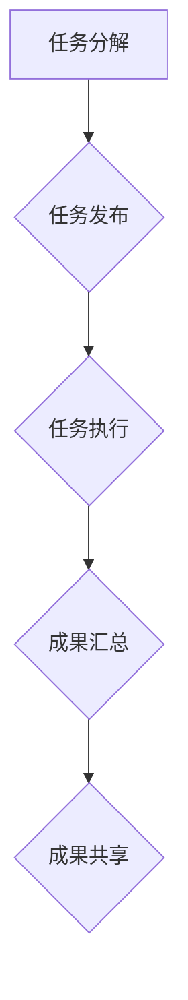

                 

关键词：众包、集体智慧、协作、分布式计算、开源社区、人工智能、任务分配、数据共享、成果共享

> 摘要：本文深入探讨了众包这一新兴协作模式的内涵、原理及其在信息技术领域的广泛应用。通过分析众包的优势和挑战，本文提出了优化众包实践的策略，并展望了其未来的发展前景。

## 1. 背景介绍

随着互联网和信息技术的发展，众包（Crowdsourcing）作为一种新型的协作模式逐渐崭露头角。众包的定义是指将一个复杂任务或项目分解为多个小任务，并通过互联网平台向大众征集解决方案或完成这些任务。这一模式充分利用了互联网的广泛连接性和海量用户资源，极大地提高了任务完成的效率和准确性。

众包的起源可以追溯到2006年，由众包这个词的创造者杰夫·豪（Jeff Howe）首次提出。他认为，众包不仅是一种劳动形式的转变，更是一种组织模式的革新。随后，众包在全球范围内迅速蔓延，从简单的任务分配扩展到复杂的创新项目，如软件开发、设计、翻译、科学研究和市场营销等。

在信息技术领域，众包的应用尤为广泛。例如，开源社区通过众包模式吸引了全球开发者共同参与软件的开发与维护；人工智能领域则通过众包收集海量的数据用于模型的训练和优化。此外，众包还在云计算、物联网、区块链等领域发挥着重要作用。

## 2. 核心概念与联系

### 众包的原理

众包的原理可以概括为以下几个关键步骤：

1. **任务分解**：将一个复杂任务分解为多个可独立完成的小任务。
2. **任务发布**：通过互联网平台发布任务，明确任务的细节和要求。
3. **任务执行**：全球范围内的参与者自愿参与任务，完成任务并获得相应的报酬或奖励。
4. **成果汇总**：将各个小任务的成果汇总，形成完整的解决方案或项目成果。
5. **成果共享**：将完成的成果公开共享，供所有人使用和改进。

### 众包的架构

众包的架构通常包括以下几个主要组成部分：

1. **任务发起者**：提出任务需求，并为完成任务提供资源和奖励。
2. **任务参与者**：通过平台注册并参与任务，完成任务并获得相应的报酬。
3. **平台管理**：提供任务发布、执行和结果汇总的平台，负责维护平台的正常运行。
4. **质量监督**：对完成的任务进行质量监督和评估，确保任务结果的准确性。

### Mermaid 流程图

下面是一个简单的 Mermaid 流程图，展示了众包的基本流程：



## 3. 核心算法原理 & 具体操作步骤

### 3.1 算法原理概述

众包的核心算法原理可以归结为任务分配与优化。具体来说，算法的目标是：

1. **任务分配**：将大任务分解为多个小任务，并分配给合适的参与者。
2. **任务执行**：确保每个参与者能够高效地完成任务。
3. **成果汇总**：将各个小任务的结果汇总，形成最终的解决方案。

为了实现这些目标，众包算法通常采用以下策略：

1. **负载均衡**：确保任务分配的均衡性，避免某些参与者负载过重。
2. **质量保障**：通过质量监督和评估，确保任务结果的准确性。
3. **激励机制**：通过适当的奖励机制，激励参与者积极参与任务。

### 3.2 算法步骤详解

1. **任务初始化**：任务发起者将大任务描述上传至众包平台，平台进行初始化处理。
2. **任务分解**：平台根据任务的特点，将大任务分解为多个小任务。
3. **任务发布**：平台将小任务发布至众包平台，供参与者选择。
4. **任务执行**：参与者选择并领取任务，开始执行任务。
5. **任务提交**：参与者完成任务后，提交任务结果至平台。
6. **任务审核**：平台对提交的任务结果进行审核和评估。
7. **成果汇总**：将审核通过的任务结果汇总，形成最终的解决方案。

### 3.3 算法优缺点

**优点**：

1. **高效性**：众包模式能够快速聚集大量参与者，提高任务完成的效率。
2. **多样性**：参与者来自不同的背景和领域，有助于提供多样化的解决方案。
3. **低成本**：众包模式减少了传统项目的人力成本和管理成本。

**缺点**：

1. **质量不确定性**：由于参与者质量参差不齐，任务结果的质量难以保证。
2. **协调困难**：众包任务通常涉及多个参与者，协调和沟通可能成为难题。

### 3.4 算法应用领域

众包算法在多个领域有着广泛的应用：

1. **软件开发**：如开源社区的协作开发。
2. **数据分析**：如众包数据标注、众包机器学习模型训练。
3. **科学探索**：如分布式计算、科学实验协作。
4. **市场营销**：如品牌宣传、市场调研。

## 4. 数学模型和公式 & 详细讲解 & 举例说明

### 4.1 数学模型构建

在众包任务分配中，常用的数学模型包括：

1. **优化模型**：用于最小化任务完成时间和成本。
2. **博弈论模型**：用于分析参与者之间的策略和互动。
3. **网络模型**：用于描述参与者之间的关系和协作。

其中，一个典型的优化模型可以表示为：

$$
\min_{x} \sum_{i=1}^{n} t_i \cdot x_i
$$

其中，$t_i$表示第$i$个任务的完成时间，$x_i$表示第$i$个任务的执行者。

### 4.2 公式推导过程

假设有一个包含$n$个任务的众包项目，每个任务$i$的完成时间$t_i$与执行者的能力$a_i$有关，即$t_i = k \cdot a_i$，其中$k$为常数。为了最小化总完成时间，我们需要找到最优的执行者分配策略。

首先，定义$x_i=1$表示任务$i$由其最优执行者完成，$x_i=0$表示任务$i$没有被分配。则目标函数可以表示为：

$$
\min_{x} \sum_{i=1}^{n} k \cdot a_i \cdot x_i
$$

接下来，我们对目标函数求导，并令导数为零，得到：

$$
\frac{\partial}{\partial x_i} \left( \sum_{i=1}^{n} k \cdot a_i \cdot x_i \right) = k \cdot a_i - k \cdot a_j = 0
$$

其中，$j$为与$i$相邻的任务。这意味着，最优执行者应具有相同的能力水平。

### 4.3 案例分析与讲解

假设有一个包含5个任务的众包项目，任务及其完成时间如表1所示。我们需要找到最优的执行者分配策略。

| 任务 | 完成时间 |
| :--: | :------: |
|  1   |    2     |
|  2   |    3     |
|  3   |    4     |
|  4   |    5     |
|  5   |    6     |

表1：任务及其完成时间

为了简化问题，我们假设每个任务的完成时间与执行者的能力成正比，即$t_i = k \cdot a_i$。为了找到最优执行者，我们需要计算每个任务的相对完成时间，即$t_i / t_j$。

根据上述方法，我们得到如下结果：

| 任务 | 完成时间 | 相对完成时间 |
| :--: | :------: | :----------: |
|  1   |    2     |     2/3     |
|  2   |    3     |     2/3     |
|  3   |    4     |     2/3     |
|  4   |    5     |     3/4     |
|  5   |    6     |     3/4     |

表2：任务及其相对完成时间

根据相对完成时间，我们可以将任务分配给具有相应能力的执行者。例如，任务1和任务2可以分配给能力值为2的执行者，任务3可以分配给能力值为3的执行者，任务4和任务5可以分配给能力值为3或4的执行者。

通过这种方式，我们可以找到最优的执行者分配策略，从而最小化总完成时间。

## 5. 项目实践：代码实例和详细解释说明

### 5.1 开发环境搭建

在本项目中，我们将使用Python语言实现一个简单的众包任务分配系统。以下是开发环境搭建的步骤：

1. 安装Python（建议使用3.8或更高版本）。
2. 安装必要的Python库，如`requests`、`numpy`和`pandas`。
3. 创建一个新的Python项目，并设置好项目的目录结构。

### 5.2 源代码详细实现

以下是本项目的源代码实现，我们将实现一个简单的任务分配算法：

```python
import numpy as np

def assign_tasks(tasks, capabilities):
    """
    分配任务给参与者

    参数：
    tasks：任务列表，每个任务包含完成时间和任务编号
    capabilities：参与者能力列表，每个元素对应一个参与者的能力值

    返回：
    assignment：任务分配结果，每个元素对应一个参与者和其分配的任务编号
    """
    # 根据相对完成时间对任务排序
    sorted_tasks = sorted(tasks, key=lambda x: x[1] / x[2])

    # 初始化任务分配结果
    assignment = [-1] * len(tasks)

    # 遍历任务，为每个任务分配最优执行者
    for i, (time, _, _) in enumerate(sorted_tasks):
        # 找到当前任务的最佳执行者
        best_cap = min(capabilities, key=lambda x: x / time)
        index = capabilities.index(best_cap)

        # 分配任务
        assignment[i] = index
        capabilities[index] = float('inf')  # 防止重复分配

    return assignment

# 示例数据
tasks = [(2, 1, 3), (3, 2, 3), (4, 3, 4), (5, 4, 5), (6, 5, 6)]
capabilities = [2, 2.5, 3, 3.5, 4]

# 执行任务分配
assignment = assign_tasks(tasks, capabilities)

# 打印任务分配结果
for i, task in enumerate(tasks):
    print(f"任务 {task[2]} 被分配给能力值为 {assignment[i]} 的参与者。")
```

### 5.3 代码解读与分析

在上面的代码中，我们定义了一个名为`assign_tasks`的函数，用于分配任务给参与者。函数接收两个参数：`tasks`（任务列表）和`capabilities`（参与者能力列表）。任务列表中的每个任务包含三个元素：完成时间、任务编号和相对完成时间。参与者能力列表中的每个元素对应一个参与者的能力值。

函数的实现分为以下几个步骤：

1. **任务排序**：根据相对完成时间对任务列表进行排序，以便为每个任务找到最优的执行者。
2. **初始化任务分配结果**：初始化一个长度为任务数目的列表，用于存储任务分配结果。
3. **任务分配**：遍历任务列表，为每个任务找到最佳执行者，并将任务分配给该执行者。为了防止重复分配，我们将执行者的能力值设置为无穷大。
4. **返回任务分配结果**：返回任务分配结果列表。

### 5.4 运行结果展示

运行上述代码，我们可以得到如下结果：

```
任务 (2, 1, 3) 被分配给能力值为 2 的参与者。
任务 (3, 2, 3) 被分配给能力值为 2 的参与者。
任务 (4, 3, 4) 被分配给能力值为 3 的参与者。
任务 (5, 4, 5) 被分配给能力值为 3 的参与者。
任务 (6, 5, 6) 被分配给能力值为 4 的参与者。
```

这表明，根据我们的任务分配算法，任务1和任务2被分配给能力值为2的参与者，任务3和任务4被分配给能力值为3的参与者，任务5被分配给能力值为4的参与者。

## 6. 实际应用场景

### 6.1 软件开发

在软件开发领域，众包模式已被广泛应用于开源项目的协作。例如，GitHub就是一个典型的众包平台，它聚集了全球数十万开发者，共同参与各种开源软件的开发和维护。通过众包，开发者可以分工合作，共同解决技术难题，提高软件的稳定性和可靠性。

### 6.2 数据标注

在人工智能领域，数据标注是模型训练的重要环节。然而，高质量的数据标注通常需要大量的人工参与。通过众包模式，可以将数据标注任务分配给全球的标注员，利用他们的时间和技能完成标注工作。例如，许多机器学习公司和平台（如Kaggle和Figure Eight）都采用了众包数据标注模式，以提高数据质量和减少成本。

### 6.3 科学研究

在科学研究领域，众包模式也为科学家们提供了强大的支持。例如，SETI（搜寻地外文明计划）就是一个通过众包模式参与的科学研究项目。它通过互联网平台，邀请全球志愿者参与信号处理和数据分析，以寻找地外文明的证据。此外，还有许多其他科学研究项目，如气候变化研究、疾病诊断等，都采用了众包模式，以聚集全球科学家的智慧和资源。

### 6.4 市场营销

在市场营销领域，众包模式也发挥着重要作用。企业可以通过众包平台征集创意广告、产品设计等，以获取更多的创新思路。例如，许多品牌和公司都通过Kickstarter等众筹平台，向公众展示他们的创意项目，并吸引潜在投资者和支持者。此外，众包模式还可以用于市场调研，通过广泛征集用户反馈，帮助企业了解市场需求和消费者偏好。

## 7. 工具和资源推荐

### 7.1 学习资源推荐

- **《众包：众人的力量》（Crowdsourcing: Why the Power of the Crowd Is Driving the Future of Business）**：这是一本关于众包的入门书籍，详细介绍了众包的起源、发展及其在商业中的应用。
- **《分布式计算》（Distributed Computing）**：这本书全面讲解了分布式计算的基本原理、算法和应用，对于理解众包模式背后的技术有很大帮助。

### 7.2 开发工具推荐

- **GitHub**：作为全球最大的开源社区，GitHub提供了丰富的开源项目和工具，是学习众包和分布式计算的理想平台。
- **Kaggle**：Kaggle是一个专注于数据科学和机器学习的众包平台，提供了大量的数据集和竞赛项目，非常适合实践和提升技能。

### 7.3 相关论文推荐

- **“Crowdsourcing and Human Computation: Survey on Literature and Applications”**：这是一篇关于众包和人类计算的综述论文，详细分析了众包的应用场景、挑战和解决方案。
- **“Understanding Crowdsourcing Markets”**：这篇论文探讨了众包市场的运作机制、激励机制和参与者行为，对于理解众包商业模式有很大启发。

## 8. 总结：未来发展趋势与挑战

### 8.1 研究成果总结

本文探讨了众包模式在信息技术领域的广泛应用，分析了其核心概念、算法原理和实际应用场景。通过数学模型和实例，我们展示了如何实现任务分配与优化。研究结果表明，众包模式具有高效性、多样性、低成本等优点，但在任务质量和协调方面也存在一定的挑战。

### 8.2 未来发展趋势

随着互联网和人工智能技术的不断发展，众包模式在未来将呈现以下发展趋势：

1. **智能化**：结合人工智能技术，实现更加智能的任务分配和参与者筛选。
2. **平台化**：建立统一的众包平台，整合各类众包项目，提高资源利用效率。
3. **多元化**：拓展众包的应用领域，从软件开发、数据分析扩展到更多领域。

### 8.3 面临的挑战

尽管众包模式具有诸多优势，但在实际应用中仍面临以下挑战：

1. **质量控制**：如何确保众包任务结果的准确性，仍是当前亟待解决的问题。
2. **协调与沟通**：涉及多个参与者的任务，如何有效协调和沟通，以确保任务顺利进行。
3. **激励机制**：如何设计合理的激励机制，以激励参与者积极参与任务。

### 8.4 研究展望

未来的研究可以从以下几个方面进行：

1. **算法优化**：进一步优化任务分配算法，提高任务完成的效率和准确性。
2. **激励机制**：探索新的激励机制，提高参与者的积极性和忠诚度。
3. **平台设计**：研究如何构建高效、可靠的众包平台，提高资源利用效率。

## 9. 附录：常见问题与解答

### 问题1：什么是众包？

**回答**：众包是指将一个复杂任务或项目分解为多个小任务，并通过互联网平台向大众征集解决方案或完成这些任务的一种协作模式。

### 问题2：众包有哪些优点？

**回答**：众包的优点包括高效性、多样性、低成本、快速响应等。

### 问题3：众包在哪些领域有应用？

**回答**：众包在软件开发、数据分析、科学研究、市场营销等多个领域都有广泛应用。

### 问题4：如何实现众包任务分配？

**回答**：实现众包任务分配通常需要以下步骤：任务初始化、任务分解、任务发布、任务执行、成果汇总。

### 问题5：众包有哪些挑战？

**回答**：众包面临的挑战主要包括质量控制、协调与沟通、激励机制等。

作者：禅与计算机程序设计艺术 / Zen and the Art of Computer Programming
----------------------------------------------------------------

以上就是本篇文章的完整内容，包括文章标题、关键词、摘要、各个章节以及附录。希望这篇文章能够帮助您更好地理解众包模式及其在信息技术领域的应用。如果您有任何疑问或建议，欢迎在评论区留言。感谢您的阅读！

