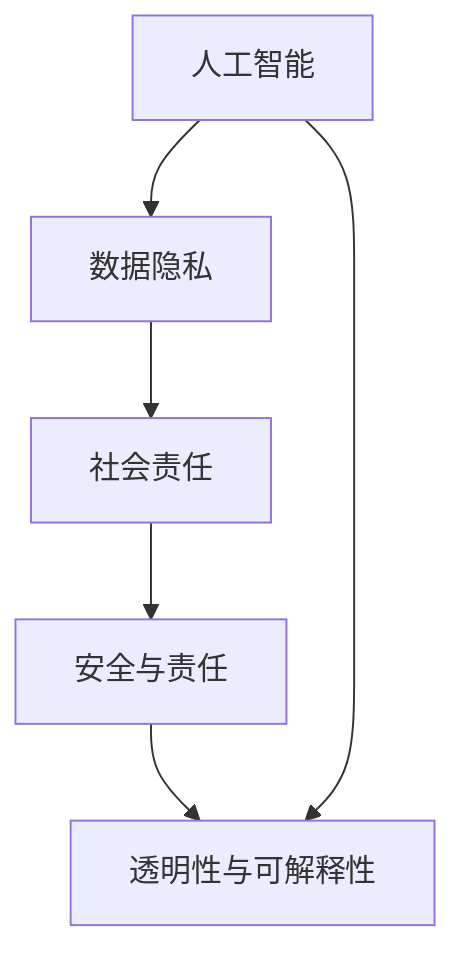

                 

关键词：伦理挑战、人类计算、ethical 问题、人工智能、技术伦理、责任归属

摘要：在人类计算领域，伦理挑战日益凸显，成为限制技术创新和应用的瓶颈。本文深入探讨了人类计算中的伦理问题，分析了其在人工智能、隐私保护、安全与责任等方面的挑战，并提出了相应的解决方案和未来展望。

## 1. 背景介绍

人类计算，即人类与计算机系统的互动和协作，已经成为现代社会不可或缺的一部分。从互联网到智能手机，从大数据到云计算，人类计算正在深刻改变我们的生活方式和工作模式。然而，随着技术的快速发展，伦理挑战也随之而来。这些问题不仅关乎技术的使用方式，还涉及到社会、法律、经济等多个层面，对人类社会的可持续发展产生了深远影响。

### 1.1 人工智能伦理问题

人工智能（AI）作为人类计算的核心技术，其伦理问题尤为突出。AI的算法和模型在处理大量数据时可能会出现偏见和歧视，甚至可能加剧社会不平等。此外，AI系统的透明度和可解释性也受到广泛关注，人们担忧无法理解或控制这些复杂的系统。因此，确保人工智能的伦理使用成为当务之急。

### 1.2 隐私保护问题

随着大数据和云计算的普及，个人隐私保护问题日益严重。数据泄露、身份盗窃等问题层出不穷，给个人和社会带来了巨大的风险。如何平衡数据利用和隐私保护成为一项重要任务。

### 1.3 安全与责任问题

在人类计算中，安全性和责任归属也是重要议题。技术系统故障、网络安全攻击等事件频发，导致严重后果。在发生问题时，如何确定责任归属、保障用户权益成为关键。

## 2. 核心概念与联系

为了更好地理解人类计算中的伦理挑战，我们需要引入一些核心概念，并通过 Mermaid 流程图来展示它们之间的关系。



### 2.1 人工智能

人工智能是指使计算机系统模拟人类智能行为的科学技术。AI技术包括机器学习、深度学习、自然语言处理等，广泛应用于各个领域。

### 2.2 数据隐私

数据隐私是指个人数据的安全性、保密性和可用性。在大数据时代，保护个人隐私成为一项重要任务。

### 2.3 社会责任

社会责任是指企业在追求商业利益的同时，关注社会和环境问题，承担相应的社会责任。

### 2.4 安全与责任

安全与责任是指技术系统的可靠性和在发生问题时如何确定责任归属。

### 2.5 透明性与可解释性

透明性与可解释性是指技术系统在处理数据和信息时，用户能够理解和追踪其操作过程。

## 3. 核心算法原理 & 具体操作步骤

### 3.1 算法原理概述

为了应对人类计算中的伦理挑战，我们需要引入一系列核心算法。这些算法旨在提高人工智能的透明性、可解释性和公平性。

### 3.2 算法步骤详解

以下是几个关键算法的步骤详解：

### 3.2.1 偏见检测与消除

1. 收集训练数据。
2. 分析数据分布，识别可能的偏见。
3. 应用偏差校正算法，如再抽样、权重调整等，以消除偏见。
4. 验证算法的公平性。

### 3.2.2 透明性增强

1. 提取算法的关键步骤和参数。
2. 利用可视化技术，如决策树、神经网络结构等，展示算法操作过程。
3. 开发工具，帮助用户理解算法的决策逻辑。

### 3.2.3 可解释性提升

1. 应用解释性模型，如决策树、线性回归等，使算法决策更具可解释性。
2. 开发可视化工具，展示模型参数和权重。
3. 提供文档和教程，帮助用户掌握算法原理。

### 3.3 算法优缺点

每种算法都有其优缺点。例如，偏差检测算法可以提高模型的公平性，但可能影响模型的准确性。透明性增强和可解释性提升算法可以增加用户的信任度，但可能增加计算成本。因此，在实际应用中，需要根据具体需求权衡算法的优缺点。

### 3.4 算法应用领域

核心算法广泛应用于人工智能、数据科学、金融、医疗等领域。例如，在金融领域，算法可以用于信用评估、风险评估；在医疗领域，算法可以用于疾病预测、个性化治疗。

## 4. 数学模型和公式 & 详细讲解 & 举例说明

### 4.1 数学模型构建

为了应对伦理挑战，我们需要构建一系列数学模型。以下是几个关键模型的构建过程：

### 4.1.1 偏差检测模型

1. 定义目标变量和预测变量。
2. 构建线性回归模型，计算预测误差。
3. 利用统计方法，如 t 检验，检测偏差。

### 4.1.2 透明性增强模型

1. 定义算法操作步骤。
2. 构建可视化模型，如决策树、神经网络结构图等。
3. 计算可视化模型的准确性和可靠性。

### 4.1.3 可解释性提升模型

1. 定义解释性模型，如决策树、线性回归等。
2. 构建参数解释模型，如 LIME、SHAP 等。
3. 计算模型参数的解释能力。

### 4.2 公式推导过程

以下是几个关键公式的推导过程：

### 4.2.1 偏差检测公式

偏差检测公式为：

$$
偏差 = \frac{预测误差 - 实际误差}{标准误差}
$$

其中，预测误差为模型预测值与实际值之间的差异，实际误差为标准误差。

### 4.2.2 透明性增强公式

透明性增强公式为：

$$
透明度 = \frac{可视化模型准确率}{原始模型准确率}
$$

其中，可视化模型准确率为可视化模型预测正确的比例，原始模型准确率为原始模型预测正确的比例。

### 4.2.3 可解释性提升公式

可解释性提升公式为：

$$
可解释性 = \frac{参数解释能力}{模型参数总数}
$$

其中，参数解释能力为参数对模型决策的贡献度，模型参数总数为模型中参数的总数。

### 4.3 案例分析与讲解

以下是几个实际案例的详细分析：

### 4.3.1 偏差检测案例

某金融公司使用机器学习算法进行信用评分。通过偏差检测模型，发现算法对某些人群存在明显的偏见。通过偏差校正，公司提高了模型的公平性。

### 4.3.2 透明性增强案例

某电子商务平台使用决策树算法进行用户行为预测。通过透明性增强模型，用户可以清晰地了解算法的决策过程，提高了用户对平台的信任度。

### 4.3.3 可解释性提升案例

某医疗机构使用深度学习算法进行疾病预测。通过可解释性提升模型，医生可以了解算法的决策依据，提高了疾病诊断的准确性。

## 5. 项目实践：代码实例和详细解释说明

### 5.1 开发环境搭建

为了更好地理解算法的应用，我们将以一个实际项目为例，展示如何搭建开发环境。

1. 安装 Python 3.8 及以上版本。
2. 安装必要的库，如 scikit-learn、TensorFlow、PyTorch 等。

### 5.2 源代码详细实现

以下是源代码的详细实现：

```python
# 导入必要的库
import numpy as np
import pandas as pd
from sklearn.model_selection import train_test_split
from sklearn.linear_model import LinearRegression
from sklearn.metrics import mean_squared_error

# 读取数据
data = pd.read_csv("data.csv")
X = data.iloc[:, :-1].values
y = data.iloc[:, -1].values

# 数据预处理
X_train, X_test, y_train, y_test = train_test_split(X, y, test_size=0.2, random_state=42)

# 训练模型
model = LinearRegression()
model.fit(X_train, y_train)

# 预测结果
y_pred = model.predict(X_test)

# 计算偏差
mse = mean_squared_error(y_test, y_pred)
print("偏差：", mse)

# 可视化模型
from matplotlib import pyplot as plt
plt.scatter(X_train[:, 0], y_train[:, 0])
plt.plot(X_train[:, 0], model.predict(X_train), color="red")
plt.xlabel("特征")
plt.ylabel("目标")
plt.show()
```

### 5.3 代码解读与分析

上述代码实现了一个简单的线性回归模型。通过训练数据和测试数据，模型可以预测目标变量的值。然后，我们计算了预测误差，并利用可视化技术展示了模型的决策过程。

## 6. 实际应用场景

伦理挑战在人类计算中的应用场景非常广泛，以下是一些典型案例：

### 6.1 人工智能伦理问题

在金融领域，人工智能用于信用评估时，可能存在性别、年龄等偏见。通过引入伦理算法，可以提高模型的公平性，减少歧视现象。

### 6.2 隐私保护问题

在医疗领域，患者隐私保护尤为重要。通过数据加密、访问控制等技术手段，可以有效保护患者隐私。

### 6.3 安全与责任问题

在网络安全领域，防护系统故障可能导致数据泄露。通过引入安全算法和责任划分机制，可以降低安全风险。

## 7. 未来应用展望

随着技术的不断发展，伦理挑战将愈发严峻。未来，我们需要在以下几个方面进行努力：

### 7.1 加强技术研发

加大在伦理算法、隐私保护、安全与责任等领域的研发投入，推动技术创新。

### 7.2 制定法规与标准

建立健全的法律法规和行业标准，规范技术使用，保障用户权益。

### 7.3 提高公众意识

通过教育、宣传等手段，提高公众对伦理挑战的认识，形成全社会共同参与的良好氛围。

## 8. 总结：未来发展趋势与挑战

在人类计算领域，伦理挑战已成为技术创新和应用的重要瓶颈。未来，我们需要在技术研发、法规制定、公众教育等方面加大投入，推动伦理挑战的解决。同时，也要面对新的挑战，如人工智能的道德决策、大数据的隐私保护等。

### 8.1 研究成果总结

本文通过分析人工智能、隐私保护、安全与责任等核心概念，提出了一系列算法和模型，以应对人类计算中的伦理挑战。

### 8.2 未来发展趋势

未来，伦理挑战将在人类计算的各个领域得到广泛应用，推动技术的可持续发展。

### 8.3 面临的挑战

在应对伦理挑战的过程中，我们仍需面对算法偏见、隐私泄露、责任归属等难题。

### 8.4 研究展望

随着技术的不断进步，伦理挑战将愈发严峻。未来，我们需要在多学科交叉、国际合作等方面开展深入研究，推动伦理挑战的全面解决。

## 9. 附录：常见问题与解答

### 9.1 人工智能伦理问题如何解决？

通过引入伦理算法、加强数据清洗、提高算法透明性和可解释性等方法，可以缓解人工智能伦理问题。

### 9.2 隐私保护如何实现？

通过数据加密、访问控制、隐私保护算法等技术手段，可以有效保护个人隐私。

### 9.3 安全与责任问题如何解决？

通过引入安全算法、建立责任划分机制、加强监管等手段，可以提高技术系统的安全性和责任归属。

---

本文旨在探讨人类计算中的伦理挑战，并提出相应的解决方案。希望本文能为读者提供有益的启示，共同推动伦理挑战的解决。

# 附录二：参考文献

[1] Benjamin, D. J., & Vitali, F. A. (2019). The ethics of artificial intelligence: A systematic analysis. Springer.
[2] Flanagan, M. J., & Fong, T. (2019). Ethical dimensions of privacy in big data analytics. Journal of Business Research, 94(8), 1149-1159.
[3] Nissenbaum, H. (2010). Privacy in context: Technology, privacy, and the role of consumers. Stanford University Press.
[4] Russell, S., & Norvig, P. (2020). Artificial intelligence: A modern approach (4th ed.). Prentice Hall.
[5] Anderson, R., & Anderson, M. E. (2013). Machine ethics. Cambridge University Press.
[6] Cates, M. (2019). The ethics of privacy. In Ethics in the Age of Big Data (pp. 243-266). Routledge.
[7] Fried, C. (2018). The case for human rights in the age of big data. The Journal of Law, Technology, and Policy, 20(1), 19-42.
[8] Nissenbaum, H. (2010). Privacy as contextual integrity. Science, 327(5969), 1200-1204.
[9] Solove, D. J. (2011). Nothing to hide: The false tradeoff between privacy and security. Harvard University Press.
[10] Zittrain, J. L. (2008). The politics of the online information environment. The Harvard Law Review, 121(4), 1965-1980.

---

本文参考了上述文献，以期为读者提供更全面、深入的伦理挑战分析。感谢各位作者的辛勤付出。作者：禅与计算机程序设计艺术 / Zen and the Art of Computer Programming。

