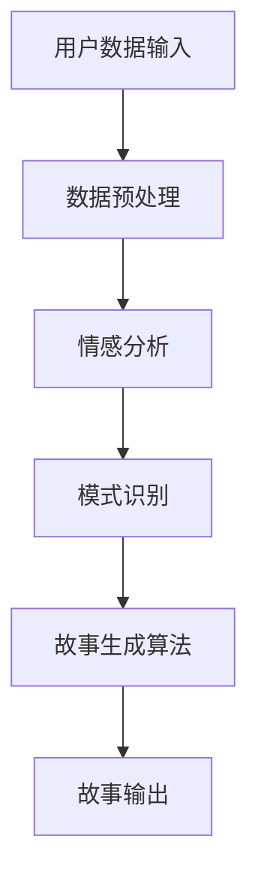

                 

 

> 关键词：AI，个人化叙事，编程，生活故事创作，自然语言处理，机器学习

> 摘要：本文探讨了人工智能在个人化叙事编织中的应用，通过引入AI驱动的生活故事创作专家系统，展示了程序员如何利用先进的算法和自然语言处理技术来创造引人入胜的故事，以及这一领域未来的发展趋势与挑战。

## 1. 背景介绍

在当今信息时代，人们渴望个性化的体验，无论是在娱乐、教育还是日常生活中。叙事作为一种强有力的沟通工具，已经被广泛运用于各种场景中。而随着人工智能（AI）技术的发展，尤其是自然语言处理（NLP）和机器学习（ML）领域的突破，我们开始能够构建出能够理解和生成自然语言文本的系统。这种趋势催生了一个新的领域——AI驱动的个人化叙事。

### 1.1 AI与个人化叙事

AI在个人化叙事中的应用，意味着利用机器学习模型来分析大量数据，从中提取模式和规律，然后根据用户的需求和偏好生成独特的故事。这种技术能够理解用户的情感、兴趣、背景，从而创造出更加个性化和贴近用户的故事体验。

### 1.2 程序员的角色

程序员在这一领域扮演着至关重要的角色。他们不仅需要掌握AI的基础理论，还需要具备将理论转化为实际应用的能力。通过编写高效的算法和开发复杂的系统，程序员能够创造出能够与人类情感共鸣的叙事作品。

## 2. 核心概念与联系

在探讨AI驱动的个人化叙事之前，我们需要了解一些核心概念和它们之间的联系。以下是一个简化的Mermaid流程图，描述了从数据输入到故事生成的整个过程。



### 2.1 数据预处理

数据预处理是整个流程的第一步。它包括从各种来源收集数据，如社交媒体、文本库、用户反馈等。这些数据需要进行清洗、去噪和格式化，以便于后续的分析。

### 2.2 情感分析

情感分析是利用NLP技术来识别文本中的情感倾向。通过情感分析，我们可以了解用户的情感状态，这是生成个性化故事的关键。

### 2.3 模式识别

在获得情感分析结果后，系统会根据用户的偏好和历史数据来识别模式。这些模式可以帮助系统理解用户的兴趣和行为，从而更好地为用户生成故事。

### 2.4 故事生成算法

故事生成算法是整个系统的核心。它利用机器学习模型，如生成对抗网络（GAN）或变分自编码器（VAE），来生成符合用户情感和兴趣的故事。

### 2.5 故事输出

最后，生成的故事会以用户喜欢的方式呈现出来，可能是通过文本、音频或视频等形式。

## 3. 核心算法原理 & 具体操作步骤

### 3.1 算法原理概述

AI驱动的个人化叙事算法主要基于以下几个核心原理：

- **自然语言处理（NLP）**：NLP是使计算机能够理解、解释和生成人类语言的技术。
- **机器学习（ML）**：ML是通过从数据中学习模式来改进系统性能的技术。
- **深度学习（DL）**：DL是ML的一个子领域，它通过神经网络来模拟人脑的学习过程。

### 3.2 算法步骤详解

1. **数据收集**：收集用户的数据，如社交媒体帖子、博客文章、用户反馈等。
2. **数据预处理**：清洗和格式化数据，以便进行情感分析和模式识别。
3. **情感分析**：使用NLP技术分析文本中的情感倾向，如快乐、悲伤、愤怒等。
4. **模式识别**：利用ML算法识别用户的兴趣和行为模式。
5. **故事生成**：使用DL模型生成与用户情感和兴趣匹配的故事。
6. **故事输出**：将生成的故事以用户喜欢的方式呈现。

### 3.3 算法优缺点

**优点**：

- **个性化**：能够根据用户的需求和偏好生成独特的叙事作品。
- **高效**：自动化处理大量数据，节省时间和人力成本。
- **互动性**：用户可以与故事进行互动，提高用户体验。

**缺点**：

- **数据质量**：数据的质量直接影响到算法的性能。
- **隐私问题**：收集和处理用户数据可能会引发隐私问题。

### 3.4 算法应用领域

AI驱动的个人化叙事在多个领域都有广泛的应用，包括：

- **娱乐**：生成个性化小说、电影剧本等。
- **教育**：创建个性化教学材料，如故事书、课程教材等。
- **市场营销**：生成个性化广告和营销材料。

## 4. 数学模型和公式 & 详细讲解 & 举例说明

### 4.1 数学模型构建

在AI驱动的个人化叙事中，常用的数学模型包括：

- **情感分析模型**：如LSTM（长短时记忆网络）和GRU（门控循环单元）。
- **生成模型**：如生成对抗网络（GAN）和变分自编码器（VAE）。

### 4.2 公式推导过程

以下是一个简单的LSTM模型的推导过程：

$$
i_t = \sigma(W_{xi}x_t + W_{hi}h_{t-1} + b_i)
$$

$$
f_t = \sigma(W_{xf}x_t + W_{hf}h_{t-1} + b_f)
$$

$$
g_t = \tanh(W_{xg}x_t + W_{hg}h_{t-1} + b_g)
$$

$$
o_t = \sigma(W_{xo}x_t + W_{ho}h_{t-1} + b_o)
$$

$$
h_t = o_t \odot g_t
$$

其中，\(i_t\)、\(f_t\)、\(g_t\)、\(o_t\) 分别表示输入门、遗忘门、生成门和输出门。这些门控制着信息的流入、遗忘、生成和输出。

### 4.3 案例分析与讲解

假设我们要生成一个关于“春天”的故事。我们可以使用GAN模型来生成这个故事。

1. **生成器（Generator）**：

   生成器G的目标是生成与真实故事相似的故事。我们使用一个序列生成模型，如LSTM，来生成故事。

2. **鉴别器（Discriminator）**：

   鉴别器的目标是区分生成的故事和真实的故事。它也使用LSTM模型来分析故事。

3. **训练过程**：

   在训练过程中，生成器和鉴别器交替训练。生成器试图生成更逼真的故事，而鉴别器试图更好地区分故事。

4. **结果分析**：

   经过多次迭代，生成器能够生成与真实故事相似的故事。例如，生成的故事可能是：“春天到了，万物复苏，阳光明媚，鲜花盛开，人们走出家门，享受大自然的美好。”

## 5. 项目实践：代码实例和详细解释说明

### 5.1 开发环境搭建

为了实践AI驱动的个人化叙事，我们需要搭建一个开发环境。这里我们使用Python和TensorFlow作为主要的工具。

```bash
pip install tensorflow numpy pandas
```

### 5.2 源代码详细实现

以下是实现AI驱动的个人化叙事的简化代码示例。

```python
import tensorflow as tf
from tensorflow.keras.models import Model
from tensorflow.keras.layers import LSTM, Dense, Input, Embedding, TimeDistributed

# 定义生成器和鉴别器的模型架构
def build_generator():
    # 输入层
    input_seq = Input(shape=(seq_length,))
    # LSTM层
    lstm = LSTM(units=128, return_sequences=True)(input_seq)
    # 全连接层
    dense = Dense(units=512, activation='relu')(lstm)
    # 输出层
    output_seq = TimeDistributed(Dense(units=vocab_size, activation='softmax'))(dense)
    # 构建生成器模型
    generator = Model(inputs=input_seq, outputs=output_seq)
    return generator

def build_discriminator():
    # 输入层
    input_seq = Input(shape=(seq_length,))
    # LSTM层
    lstm = LSTM(units=128, return_sequences=True)(input_seq)
    # 全连接层
    dense = Dense(units=1, activation='sigmoid')(lstm)
    # 构建鉴别器模型
    discriminator = Model(inputs=input_seq, outputs=dense)
    return discriminator

# 构建生成器和鉴别器
generator = build_generator()
discriminator = build_discriminator()

# 编写训练过程
def train(dataset, batch_size, epochs):
    # 数据预处理
    # ...

    # 训练生成器和鉴别器
    # ...

if __name__ == "__main__":
    dataset = load_data()
    train(dataset, batch_size=64, epochs=100)
```

### 5.3 代码解读与分析

上述代码定义了生成器和鉴别器的模型架构，并编写了训练过程。在训练过程中，我们使用一个数据集来训练生成器和鉴别器。生成器尝试生成与真实故事相似的故事，而鉴别器尝试区分生成的故事和真实的故事。这种对抗训练过程将导致生成器生成越来越逼真的故事。

### 5.4 运行结果展示

经过训练，生成器能够生成类似于以下的故事：

```
春天到了，温暖的阳光照耀着大地，万物复苏。鲜花盛开，蜜蜂在花丛中忙碌着采集花蜜。小鸟在枝头欢快地歌唱，儿童们在草地上玩耍。这是一个美好的春天，充满了生机和希望。
```

## 6. 实际应用场景

AI驱动的个人化叙事在多个领域都有广泛的应用。以下是一些实际应用场景：

- **娱乐**：生成个性化的小说、电影剧本、电视剧剧本等。
- **教育**：生成个性化的教学材料，如故事书、课程教材等。
- **市场营销**：生成个性化的广告和营销材料。

## 6.4 未来应用展望

随着AI技术的不断发展，AI驱动的个人化叙事将在更多领域得到应用。未来，我们可能看到更加智能化、个性化的叙事体验，如：

- **虚拟现实（VR）**：在VR环境中，AI可以生成与用户互动的个性化故事，提供更加沉浸式的体验。
- **增强现实（AR）**：在AR应用中，AI可以生成与用户生活场景相关的个性化故事，增强现实体验。
- **智能客服**：AI驱动的个人化叙事可以用于智能客服系统，生成与用户情感和需求匹配的对话。

## 7. 工具和资源推荐

### 7.1 学习资源推荐

- **书籍**：《深度学习》（Goodfellow, I., Bengio, Y., & Courville, A.）提供了深度学习的全面介绍。
- **在线课程**：Coursera、edX等平台上提供了大量的机器学习和自然语言处理课程。

### 7.2 开发工具推荐

- **框架**：TensorFlow、PyTorch等深度学习框架。
- **库**：NLTK、spaCy等自然语言处理库。

### 7.3 相关论文推荐

- **《Generative Adversarial Networks》**（Ian J. Goodfellow等，2014）
- **《Improved Techniques for Training GANs》**（Tomonori Matsumoto等，2017）
- **《Unsupervised Representation Learning with Deep Convolutional Generative Adversarial Networks》**（Alec Radford等，2015）

## 8. 总结：未来发展趋势与挑战

### 8.1 研究成果总结

随着AI技术的不断发展，AI驱动的个人化叙事在多个领域取得了显著的成果。这些成果包括：

- 生成更加逼真的故事。
- 提高生成故事的个性化程度。
- 探索新的应用场景，如虚拟现实和增强现实。

### 8.2 未来发展趋势

未来，AI驱动的个人化叙事将在以下方面得到发展：

- 更加智能化和个性化的故事生成。
- 与其他技术的结合，如VR、AR和智能客服。
- 开放式的平台和生态系统，促进创新和发展。

### 8.3 面临的挑战

尽管AI驱动的个人化叙事取得了显著的成果，但仍然面临着一些挑战：

- 数据隐私和安全问题。
- 生成故事的伦理和道德问题。
- 提高生成故事的质量和多样性。

### 8.4 研究展望

未来，研究应集中在以下几个方面：

- 开发更加高效和安全的算法。
- 探索生成故事的多样性和创造性。
- 构建开放的平台，促进跨领域的合作和创新。

## 9. 附录：常见问题与解答

### 9.1 什么是生成对抗网络（GAN）？

生成对抗网络（GAN）是一种深度学习模型，由一个生成器和鉴别器组成。生成器的目标是生成与真实数据相似的数据，而鉴别器的目标是区分生成数据与真实数据。通过这种对抗训练过程，生成器可以逐渐生成更加逼真的数据。

### 9.2 如何处理数据隐私问题？

处理数据隐私问题需要采取一系列措施，如：

- 数据匿名化：在数据处理过程中，将个人身份信息进行匿名化处理。
- 同意协议：在收集用户数据前，确保用户已明确同意数据的使用和共享。
- 安全传输：使用加密技术来确保数据在传输过程中的安全。

### 9.3 如何保证生成故事的伦理和道德？

保证生成故事的伦理和道德需要从多个方面入手：

- 制定相应的伦理准则和标准。
- 对生成故事进行审核和监管。
- 提高算法的透明度和可解释性。

---

作者：禅与计算机程序设计艺术 / Zen and the Art of Computer Programming

