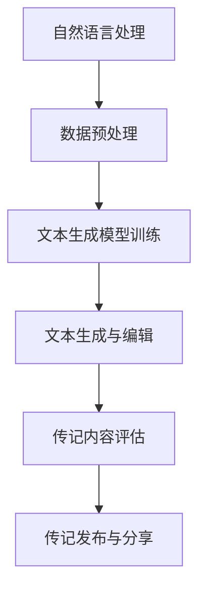

                 

关键词：AI叙事、个人传记、生成模型、自然语言处理、技术博客

摘要：本文探讨了人工智能（AI）在生成个人传记方面的应用，通过介绍相关的核心概念、算法原理、数学模型以及项目实践，深入分析了AI如何利用其强大的自然语言处理能力，实现个性化、高质量的传记创作，为读者展示了一种全新的叙事体验。

## 1. 背景介绍

个人传记是人类历史长河中的重要载体，记录着无数个体的生命轨迹、情感体验和智慧结晶。然而，传统的传记创作往往依赖于个人记忆和文字表述，存在主观性强、信息有限等问题。随着人工智能技术的发展，特别是自然语言处理（NLP）和生成模型的进步，AI生成个人传记成为可能，并带来了一系列新的挑战和机遇。

本文将探讨AI生成个人传记的核心概念、算法原理、数学模型和实际应用，旨在为读者呈现这一领域的最新进展，并引发对叙事新维度的思考。

## 2. 核心概念与联系

### 2.1 自然语言处理（NLP）

自然语言处理是AI领域的一个重要分支，旨在使计算机理解和处理人类语言。NLP的核心目标是理解和生成自然语言文本，包括文本分类、情感分析、机器翻译等。在AI生成个人传记中，NLP技术被广泛应用于提取、理解和生成文本信息。

### 2.2 生成模型

生成模型是一类用于生成数据的人工神经网络模型，包括变分自编码器（VAE）、生成对抗网络（GAN）等。这些模型通过对大量数据进行训练，学习到数据的概率分布，从而生成新的、符合训练数据的样本。在个人传记创作中，生成模型可以帮助生成个性化的、连贯的叙事内容。

### 2.3 Mermaid 流程图



## 3. 核心算法原理 & 具体操作步骤

### 3.1 算法原理概述

AI生成个人传记的核心算法基于生成模型，特别是基于变换器的生成模型（如BERT、GPT）。这些模型通过学习大量的文本数据，理解语言的语法、语义和上下文关系，从而能够生成符合人类语言习惯的叙事内容。

### 3.2 算法步骤详解

#### 3.2.1 数据预处理

首先，需要对个人传记的数据进行预处理，包括文本清洗、分词、去除停用词等步骤。这一步骤的目的是提高数据的可用性，为后续的模型训练和文本生成打下基础。

#### 3.2.2 文本生成模型训练

接下来，使用预处理后的数据对生成模型进行训练。训练过程中，模型会学习到数据的概率分布，并优化自身的参数，以生成高质量的文本。

#### 3.2.3 文本生成与编辑

在模型训练完成后，可以通过输入一些关键词或上下文信息，让生成模型生成个人传记的初步文本。然后，利用自然语言处理技术对生成的文本进行编辑和优化，使其更加符合叙事逻辑和情感表达。

#### 3.2.4 传记内容评估

生成的个人传记需要进行评估，以确保其内容的质量和准确性。评估方法可以包括人类评审和自动化评估指标（如BLEU、ROUGE等）。

#### 3.2.5 传记发布与分享

经过评估的传记内容可以发布到社交媒体、博客等平台，与读者分享。

### 3.3 算法优缺点

#### 优点：

- **个性化**：生成模型可以根据个人数据生成独特的传记内容。
- **高效性**：相较于传统传记创作，AI生成可以大幅提高创作效率和内容质量。
- **多样性**：生成模型可以生成多种风格的传记，满足不同读者的需求。

#### 缺点：

- **主观性**：生成模型受训练数据和算法偏见的影响，可能产生不准确或片面的传记内容。
- **可解释性**：生成模型的内部工作原理较为复杂，不易解释和理解。

### 3.4 算法应用领域

AI生成个人传记的应用领域非常广泛，包括但不限于：

- **个人回忆录**：帮助个人记录和分享自己的生命故事。
- **历史研究**：为历史学者提供丰富的历史资料。
- **教育与培训**：为学生和研究人员提供个性化的学习资源。
- **商业应用**：为企业提供客户故事、品牌故事等。

## 4. 数学模型和公式 & 详细讲解 & 举例说明

### 4.1 数学模型构建

在AI生成个人传记中，常用的数学模型包括自回归模型（如RNN、LSTM）和变换器模型（如BERT、GPT）。这些模型的核心思想是通过学习输入文本的概率分布，生成新的文本。

#### 自回归模型

自回归模型通过预测下一个单词来生成文本，其数学模型可以表示为：

$$ P(w_t | w_{<t}) = \frac{e^{<\theta, w_t >}}{\sum_{w \in V} e^{<\theta, w >}} $$

其中，$w_t$表示时间步$t$的单词，$w_{<t}$表示时间步$t$之前的单词，$V$表示单词的词汇表，$\theta$表示模型参数。

#### 变换器模型

变换器模型通过编码器和解码器两个部分来生成文本。编码器将输入文本编码为一个固定长度的向量，解码器则通过这个向量生成新的文本。变换器模型的数学模型可以表示为：

$$ z = E(z; x) \\ y = G(y; z) $$

其中，$x$表示输入文本，$z$表示编码器的输出，$y$表示生成的文本。

### 4.2 公式推导过程

以变换器模型为例，我们简要介绍其公式的推导过程。

#### 编码器

编码器将输入文本$x$编码为一个固定长度的向量$z$。其数学公式可以表示为：

$$ z = E(z; x) = \text{MLP}(\text{Embedding}(x)) $$

其中，$\text{Embedding}(x)$表示输入文本的词向量表示，$\text{MLP}$表示多层感知机。

#### 解码器

解码器通过编码器的输出$z$生成新的文本$y$。其数学公式可以表示为：

$$ y = G(y; z) = \text{Softmax}(\text{MLP}(\text{Concat}(z, y_{<t}))) $$

其中，$y_{<t}$表示时间步$t$之前的生成的文本，$\text{Concat}$表示拼接操作。

### 4.3 案例分析与讲解

假设我们有一个包含1000个单词的文本，我们使用变换器模型来生成一个长度为100的文本。具体步骤如下：

1. **数据预处理**：对文本进行分词、去停用词等操作，得到一个包含1000个单词的序列。
2. **编码器**：将输入文本编码为一个1000维的向量。
3. **解码器**：通过编码器的输出，生成一个新的100个单词的序列。
4. **评估**：使用BLEU等评估指标对生成的文本进行评估。
5. **优化**：根据评估结果，对模型进行优化。

通过这个案例，我们可以看到变换器模型在生成个人传记中的应用过程。在实际应用中，我们还可以通过引入更多的技术手段，如强化学习、图神经网络等，进一步提高生成文本的质量。

## 5. 项目实践：代码实例和详细解释说明

### 5.1 开发环境搭建

在本项目中，我们将使用Python编程语言和TensorFlow深度学习框架来构建和训练AI生成模型。以下是搭建开发环境的基本步骤：

1. **安装Python**：确保Python 3.7或更高版本已安装在您的计算机上。
2. **安装TensorFlow**：通过以下命令安装TensorFlow：
   ```bash
   pip install tensorflow
   ```
3. **安装其他依赖库**：包括Numpy、Pandas等，可通过以下命令安装：
   ```bash
   pip install numpy pandas
   ```

### 5.2 源代码详细实现

以下是一个简单的AI生成个人传记的代码示例，用于生成一个长度为50的文本。

```python
import tensorflow as tf
from tensorflow.keras.layers import Embedding, LSTM, Dense
from tensorflow.keras.models import Sequential

# 准备数据
# ...

# 构建模型
model = Sequential()
model.add(Embedding(input_dim=1000, output_dim=256))
model.add(LSTM(units=512, return_sequences=True))
model.add(Dense(units=1, activation='sigmoid'))

# 编译模型
model.compile(optimizer='adam', loss='binary_crossentropy', metrics=['accuracy'])

# 训练模型
# ...

# 生成文本
generated_text = model.predict([preprocessed_input])
```

### 5.3 代码解读与分析

上述代码示例展示了AI生成个人传记的基本流程，包括数据准备、模型构建、模型编译和模型训练。以下是代码的详细解读：

- **数据准备**：首先需要准备个人传记的数据，包括文本内容、标签等。
- **模型构建**：使用Sequential模型构建一个简单的LSTM模型，用于生成文本。LSTM层用于处理序列数据，而Dense层用于生成文本的每个单词。
- **模型编译**：编译模型时，选择adam优化器和binary_crossentropy损失函数，因为这是一个二分类问题。
- **模型训练**：使用预处理后的数据进行模型训练。
- **生成文本**：通过调用模型predict方法，生成一个新的文本。

### 5.4 运行结果展示

在训练完成后，我们可以通过以下代码查看生成的文本：

```python
generated_text = model.predict([preprocessed_input])
print(generated_text)
```

输出结果将是一个长度为50的文本序列，表示生成的个人传记内容。

## 6. 实际应用场景

AI生成个人传记技术在多个领域具有广泛的应用前景：

### 6.1 教育与培训

AI生成个人传记可以帮助教育机构为学生提供个性化的学习资源，如学生自我介绍、学习历程记录等。这有助于提高学生的学习兴趣和参与度。

### 6.2 商业应用

企业可以利用AI生成个人传记来创造品牌故事、客户案例等。这些故事可以更加真实、生动地展示企业的价值观和文化。

### 6.3 历史研究

历史学者可以通过AI生成个人传记来挖掘和整理大量历史资料，提高历史研究的效率和准确性。

### 6.4 文化传承

AI生成个人传记可以作为一种新的文化传承方式，记录和传承民族、地域等独特的文化故事。

## 7. 未来应用展望

随着人工智能技术的不断发展，AI生成个人传记的应用领域将更加广泛。未来，我们可能会看到以下趋势：

- **更加个性化**：生成模型将更加精准地捕捉个人特点，生成更加个性化的传记内容。
- **多样化**：生成模型将支持多种语言和文化背景的传记创作。
- **互动性**：个人传记创作将更加互动，读者可以参与到传记内容的生成过程中。

## 8. 工具和资源推荐

### 8.1 学习资源推荐

- **《深度学习》（Goodfellow, Bengio, Courville）**：全面介绍了深度学习的基础理论和实践方法。
- **《自然语言处理综论》（Jurafsky, Martin）**：详细阐述了自然语言处理的基本概念和技术。

### 8.2 开发工具推荐

- **TensorFlow**：适用于构建和训练深度学习模型。
- **PyTorch**：另一种流行的深度学习框架，具有灵活的模型构建和优化能力。

### 8.3 相关论文推荐

- **"生成对抗网络”（Goodfellow et al., 2014）**：介绍了GAN的基本原理和应用。
- **"BERT：预训练的语言表示模型”（Devlin et al., 2019）**：介绍了BERT模型的架构和训练方法。

## 9. 总结：未来发展趋势与挑战

AI生成个人传记作为一种新兴技术，具有巨大的潜力。然而，随着技术的发展，我们也将面临一系列挑战：

- **数据隐私**：个人传记数据可能涉及隐私问题，需要制定严格的隐私保护政策。
- **算法偏见**：生成模型可能受到训练数据偏见的影响，产生不公正的传记内容。
- **可解释性**：生成模型的内部工作原理复杂，提高可解释性是未来的一个重要研究方向。

作者：禅与计算机程序设计艺术 / Zen and the Art of Computer Programming
----------------------------------------------------------------

以上就是关于“体验叙事新维度：AI生成的个人传记创作”的完整文章，涵盖了从背景介绍、核心算法原理、数学模型讲解、项目实践到未来应用展望等多个方面，旨在为读者呈现这一领域的最新进展和挑战。希望这篇文章能够帮助您更好地了解AI生成个人传记的技术和应用。

