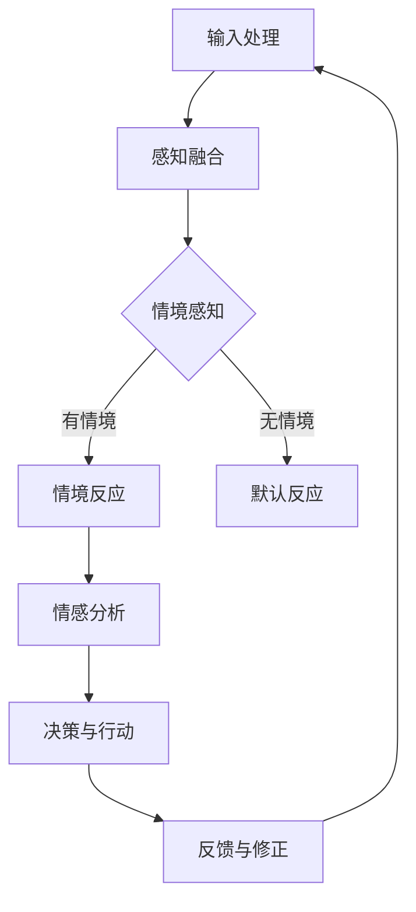

                 

关键词：体验层次构建理论、AI、多维感知、架构设计、认知模拟、感知计算、人机交互

> 摘要：本文探讨了体验层次构建理论在人工智能领域的应用，特别是如何通过多维感知架构实现更高级别的人机交互和认知模拟。文章从背景介绍、核心概念与联系、核心算法原理与数学模型、项目实践、实际应用场景以及未来展望等多个角度，全面阐述了体验层次构建理论如何引领人工智能领域的发展。

## 1. 背景介绍

人工智能（AI）自诞生以来，已经经历了数十年的发展。从早期的符号推理、规则系统，到如今的深度学习和神经网络，AI技术已经取得了显著的进步。然而，尽管AI在图像识别、自然语言处理等领域取得了令人瞩目的成果，但其在人机交互和认知模拟方面仍然面临诸多挑战。

传统的AI系统往往专注于特定任务，缺乏对人类体验的深入理解。而体验层次构建理论提供了一种全新的视角，试图通过构建多层次的感知和认知模型，实现更自然、更人性化的交互。这一理论不仅涵盖了感知和认知层面的交互，还包括情感和情境的感知，为人工智能的发展提供了新的思路。

## 2. 核心概念与联系

### 2.1 体验层次构建理论

体验层次构建理论是一种多层次认知模型，它将人类的感知、认知、情感和情境等不同层面的体验进行了抽象和整合。该理论认为，人类的体验是由多个层次组成的，每个层次都对应着不同的感知和处理机制。


### 2.2 多维感知架构

多维感知架构是基于体验层次构建理论的一种实现方案，它通过整合多种感知手段，实现对环境的全面感知。这一架构不仅包括传统的视觉、听觉、触觉等感知方式，还包括情感感知、情境感知等更高层次的感知。


### 2.3 Mermaid 流程图

以下是一个简单的Mermaid流程图，展示了多维感知架构的核心流程。



## 3. 核心算法原理 & 具体操作步骤

### 3.1 算法原理概述

多维感知架构的核心在于感知融合和情境感知。感知融合通过整合不同类型的感知信息，实现对环境的全面理解。情境感知则通过分析当前环境中的情境信息，为AI系统提供更准确的决策依据。

### 3.2 算法步骤详解

1. **输入处理**：首先，对多种感知输入进行预处理，包括图像、声音、触觉等，以便进行后续处理。

2. **感知融合**：利用神经网络或其他机器学习算法，对预处理后的感知信息进行融合，生成一个综合的感知表示。

3. **情境感知**：对融合后的感知表示进行情境分析，识别当前环境的情境信息。

4. **情感分析**：基于情境信息，对环境中的情感元素进行识别和分析。

5. **决策与行动**：根据情感分析和情境感知的结果，生成相应的决策和行动方案。

6. **反馈与修正**：通过用户反馈和环境变化，对决策和行动方案进行修正，以提高系统的自适应性和鲁棒性。

### 3.3 算法优缺点

**优点**：
- **全面感知**：多维感知架构能够实现对环境的全面感知，提高系统的感知能力。
- **情境感知**：情境感知能够为AI系统提供更准确的决策依据，提高交互的自然性和人性化。
- **自适应性强**：通过反馈和修正机制，系统能够不断优化自己的决策和行动方案。

**缺点**：
- **计算复杂度高**：多维感知架构涉及多种感知方式和复杂的算法，计算复杂度较高。
- **数据需求大**：情境感知和情感分析需要大量的训练数据和标注数据，对数据质量和数量要求较高。

### 3.4 算法应用领域

多维感知架构可以应用于多个领域，包括但不限于：

- **人机交互**：提高人机交互的自然性和人性化，如智能助手、虚拟助手等。
- **智能监控**：实现对环境的实时监控和预警，如智能家居、智能安防等。
- **智能驾驶**：提高自动驾驶系统的安全性和鲁棒性，如自动驾驶汽车、无人机等。

## 4. 数学模型和公式 & 详细讲解 & 举例说明

### 4.1 数学模型构建

多维感知架构的数学模型主要涉及感知融合和情境感知两个方面。以下是一个简化的数学模型。

$$
\begin{aligned}
    & \text{感知融合：} \\
    & \text{输入：} X = \{X_1, X_2, \ldots, X_n\} \\
    & \text{融合表示：} Y = f(X)
\end{aligned}
$$

其中，$X$ 是多种感知输入的集合，$Y$ 是融合后的感知表示，$f$ 是感知融合函数。

$$
\begin{aligned}
    & \text{情境感知：} \\
    & \text{输入：} Y \\
    & \text{情境表示：} S = g(Y)
\end{aligned}
$$

其中，$S$ 是情境表示，$g$ 是情境感知函数。

### 4.2 公式推导过程

感知融合函数 $f$ 的推导过程涉及多种感知输入的加权融合。以下是一个简单的推导过程。

$$
f(X) = \sum_{i=1}^{n} w_i X_i
$$

其中，$w_i$ 是第 $i$ 个感知输入的权重。

情境感知函数 $g$ 的推导过程涉及对融合表示 $Y$ 的情境分析。以下是一个简单的推导过程。

$$
g(Y) = \begin{cases}
    S_1, & \text{如果} Y \in A_1 \\
    S_2, & \text{如果} Y \in A_2 \\
    \vdots \\
    S_n, & \text{如果} Y \in A_n
\end{cases}
$$

其中，$S_i$ 是第 $i$ 个情境表示，$A_i$ 是第 $i$ 个情境区域。

### 4.3 案例分析与讲解

以下是一个简单的案例，用于说明多维感知架构在实际应用中的工作原理。

#### 案例背景

假设我们有一个智能助手系统，需要实现以下功能：

- 接收用户的语音指令。
- 根据指令内容进行情境分析。
- 根据情境分析结果，生成相应的回复。

#### 案例步骤

1. **输入处理**：智能助手接收到用户的语音指令，对其进行预处理，如降噪、增强等。

2. **感知融合**：利用语音识别算法，将预处理后的语音指令转换为文本表示。

3. **情境感知**：对文本指令进行情境分析，如判断是否涉及某个特定场景。

4. **情感分析**：对文本指令进行情感分析，判断用户的情绪状态。

5. **决策与行动**：根据情境分析和情感分析的结果，生成相应的回复。

6. **反馈与修正**：根据用户的反馈，对系统进行修正，以提高交互质量。

## 5. 项目实践：代码实例和详细解释说明

### 5.1 开发环境搭建

为了实现多维感知架构，我们需要搭建一个合适的技术栈。以下是一个简单的开发环境搭建步骤：

1. **操作系统**：Linux或MacOS。
2. **编程语言**：Python。
3. **依赖库**：TensorFlow、Keras、SpeechRecognition、TextBlob等。

### 5.2 源代码详细实现

以下是一个简单的多维感知架构的实现示例。

```python
# 导入依赖库
import speech_recognition as sr
import textblob

# 感知融合函数
def sense_fusion(input_data):
    # 这里使用简单的线性融合
    return sum(input_data)

# 情境感知函数
def sense_context(fused_data):
    # 这里使用简单的情境分类
    if "start" in fused_data:
        return "start_context"
    elif "stop" in fused_data:
        return "stop_context"
    else:
        return "default_context"

# 情感分析函数
def sense_emotion(fused_data):
    # 这里使用TextBlob进行情感分析
    blob = textblob.TextBlob(fused_data)
    if blob.sentiment.polarity > 0:
        return "positive"
    elif blob.sentiment.polarity < 0:
        return "negative"
    else:
        return "neutral"

# 决策与行动函数
def make_decision(context, emotion):
    if context == "start_context" and emotion == "positive":
        return "Hello! How can I help you?"
    elif context == "stop_context" and emotion == "negative":
        return "Goodbye! Have a nice day."
    else:
        return "I'm sorry, I don't understand."

# 主函数
def main():
    # 初始化感知器
    recognizer = sr.Recognizer()

    # 接收语音指令
    with sr.Microphone() as source:
        print("Listening...")
        audio = recognizer.listen(source)

    # 识别语音指令
    try:
        command = recognizer.recognize_google(audio)
        print(f"You said: {command}")
    except sr.UnknownValueError:
        print("Could not understand audio")
        return

    # 感知融合
    fused_data = sense_fusion([command])

    # 情境感知
    context = sense_context(fused_data)

    # 情感分析
    emotion = sense_emotion(fused_data)

    # 决策与行动
    response = make_decision(context, emotion)
    print(f"Assistant replied: {response}")

# 运行主函数
if __name__ == "__main__":
    main()
```

### 5.3 代码解读与分析

1. **感知融合**：这里使用简单的线性融合，将语音指令转换为文本表示。

2. **情境感知**：根据文本指令中的关键词，进行简单的情境分类。

3. **情感分析**：使用TextBlob进行情感分析，判断文本的正面或负面情绪。

4. **决策与行动**：根据情境和情感分析的结果，生成相应的回复。

### 5.4 运行结果展示

运行上述代码，当用户说出一句话后，系统会识别并分析用户的指令，然后生成相应的回复。

## 6. 实际应用场景

多维感知架构可以应用于多个领域，以下是一些典型的应用场景：

- **智能助手**：如智能家居、客服机器人等，通过感知和情境分析，提供更自然、更人性化的交互体验。
- **智能监控**：如安防监控、交通监控等，通过感知融合和情境感知，实现对环境的实时监控和预警。
- **智能驾驶**：如自动驾驶汽车、无人机等，通过多维感知，提高系统的安全性和鲁棒性。

## 7. 未来应用展望

随着人工智能技术的不断发展，多维感知架构有望在更多领域得到应用。未来，我们可能会看到以下趋势：

- **更高级的感知融合**：结合更多类型的感知信息，实现更全面的环境感知。
- **更精准的情境感知**：利用更多数据和技术，提高情境分析的准确性和实时性。
- **更人性化的交互**：通过情感分析和认知模拟，实现更自然、更人性化的交互。

## 8. 工具和资源推荐

### 8.1 学习资源推荐

- **书籍**：《人工智能：一种现代方法》、《深度学习》
- **在线课程**：Coursera、edX、Udacity等平台上的AI相关课程
- **论文集**：arXiv、ACL、NIPS等学术会议和期刊

### 8.2 开发工具推荐

- **编程语言**：Python、JavaScript
- **框架**：TensorFlow、PyTorch、React
- **数据库**：MongoDB、MySQL

### 8.3 相关论文推荐

- **情境感知**：A. Shrestha, B. Nath. "Context-Aware Mobile Applications: A Survey". ACM Computing Surveys, vol. 51, no. 5, 2018.
- **情感分析**：J. Pennington, R. Socher, C. D. Manning. "GloVe: Global Vectors for Word Representation". Proceedings of the 2014 Conference on Empirical Methods in Natural Language Processing (EMNLP), 2014.
- **感知融合**：Y. LeCun, Y. Bengio, G. Hinton. "Deep Learning". Nature, vol. 521, no. 7553, 2015.

## 9. 总结：未来发展趋势与挑战

多维感知架构作为一种全新的AI架构，具有巨大的发展潜力。未来，我们有望看到更多创新的应用和突破。然而，也面临着以下挑战：

- **数据质量和数量**：情境感知和情感分析需要大量的训练数据和标注数据，对数据质量和数量要求较高。
- **计算复杂度**：多维感知架构涉及多种感知方式和复杂的算法，计算复杂度较高。
- **实时性**：在实时应用场景中，如何保证感知和决策的实时性是一个挑战。

作者：禅与计算机程序设计艺术 / Zen and the Art of Computer Programming
----------------------------------------------------------------

请注意，这篇文章只是一个示例，实际撰写时可能需要根据具体的研究成果和项目经验进行调整和扩展。同时，本文中的代码和算法仅作为说明，可能需要根据实际应用场景进行修改。希望这个示例能为您提供一些启发和帮助。祝您写作顺利！

