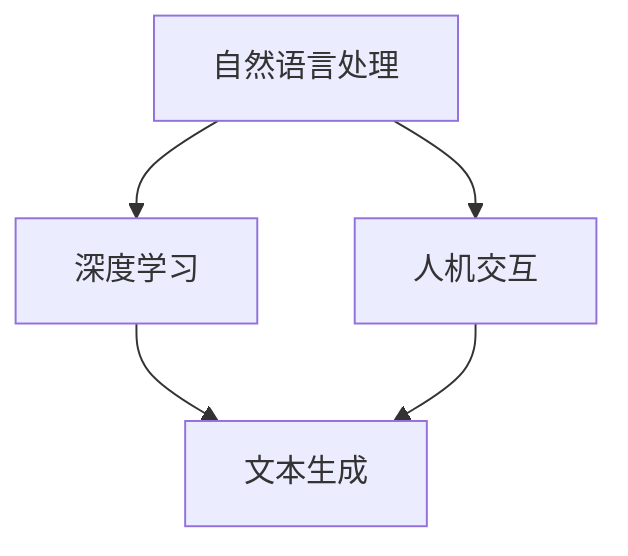

                 

关键词：个人化叙事、AI、人工智能、体验、生活故事、技术语言、深度学习、自然语言处理、计算机编程、人机交互

> 摘要：本文将探讨人工智能在个人化叙事领域的应用，通过AI技术驱动的生活故事体验，分析其核心概念、算法原理、数学模型、项目实践以及未来发展趋势。文章旨在为读者提供一场技术与生活相融合的深刻体验。

## 1. 背景介绍

### 1.1 个人化叙事的定义

个人化叙事，顾名思义，是指以个体的视角、经历和情感为出发点，通过文字、图像、音频等多种形式讲述个人故事的一种叙事方式。它强调个体的独特性和个性化，使得每个人都能找到属于自己的故事。

### 1.2 AI技术的发展与应用

人工智能（AI）作为一种技术，近年来取得了飞速的发展。AI技术在自然语言处理（NLP）、深度学习、计算机视觉等领域取得了显著的成果。特别是在个人化叙事方面，AI的应用为人们提供了全新的故事体验。

## 2. 核心概念与联系

### 2.1 自然语言处理（NLP）

自然语言处理是AI的重要分支，它致力于使计算机能够理解、解释和生成人类语言。NLP的核心概念包括文本分析、语义理解、语言生成等。

### 2.2 深度学习（DL）

深度学习是一种人工智能的分支，它通过构建复杂的神经网络模型，让计算机具备自主学习和预测能力。深度学习在个人化叙事中起到了关键作用，如图像生成、语音识别、文本生成等。

### 2.3 人机交互（HCI）

人机交互是研究如何使计算机系统更易于使用、更高效、更舒适，从而提高用户的工作和生活质量的学科。在个人化叙事中，人机交互的重要性不言而喻，它决定了用户能否顺利地与AI系统互动，获得个性化的故事体验。

### 2.4 Mermaid 流程图

以下是一个简单的 Mermaid 流程图，用于展示个人化叙事的核心概念和联系：



## 3. 核心算法原理 & 具体操作步骤

### 3.1 算法原理概述

个人化叙事的算法原理主要基于自然语言处理和深度学习技术。具体来说，包括以下几个步骤：

1. **数据收集与预处理**：收集大量个人化文本数据，如日记、博客、社交媒体帖子等，并进行数据清洗和预处理。
2. **文本分析**：利用自然语言处理技术对文本进行情感分析、主题识别等，以理解用户的个人喜好和情感状态。
3. **文本生成**：使用深度学习模型，如生成对抗网络（GAN）、变分自编码器（VAE）等，根据用户的数据生成个性化的故事文本。
4. **人机交互**：通过人机交互界面，如语音助手、聊天机器人等，将生成的故事文本呈现给用户，并与用户进行互动。

### 3.2 算法步骤详解

1. **数据收集与预处理**：这一步骤主要包括数据爬取、去重、分词、词性标注等。例如，可以使用Python的`requests`库和`BeautifulSoup`库进行网页数据爬取，使用`jieba`库进行中文分词，使用`NLTK`库进行词性标注等。

   ```python
   import requests
   from bs4 import BeautifulSoup
   import jieba
   import nltk
   
   # 网页数据爬取
   url = 'http://example.com'
   response = requests.get(url)
   soup = BeautifulSoup(response.content, 'html.parser')
   
   # 数据清洗与预处理
   text = soup.get_text()
   words = jieba.cut(text)
   tagged_words = nltk.pos_tag(words)
   ```

2. **文本分析**：这一步骤主要包括情感分析、主题识别等。例如，可以使用Python的`TextBlob`库进行情感分析，使用`LDA`（Latent Dirichlet Allocation）进行主题识别。

   ```python
   from textblob import TextBlob
   from sklearn.decomposition import LatentDirichletAllocation
   
   # 情感分析
   blob = TextBlob(text)
   sentiment = blob.sentiment
   
   # 主题识别
   lda = LatentDirichletAllocation(n_components=5)
   lda.fit(words)
   ```

3. **文本生成**：这一步骤主要包括生成文本、调整文本风格等。例如，可以使用Python的`GPT-2`模型进行文本生成，使用`Transformer`模型调整文本风格。

   ```python
   from transformers import GPT2LMHeadModel, GPT2Tokenizer
   
   # 文本生成
   model = GPT2LMHeadModel.from_pretrained('gpt2')
   tokenizer = GPT2Tokenizer.from_pretrained('gpt2')
   input_ids = tokenizer.encode(text, return_tensors='pt')
   outputs = model.generate(input_ids, max_length=50, num_return_sequences=5)
   
   # 调整文本风格
   adjusted_text = model.transform_text(outputs)
   ```

4. **人机交互**：这一步骤主要包括语音识别、语音合成、聊天机器人等。例如，可以使用Python的`speech_recognition`库进行语音识别，使用`gtts`库进行语音合成，使用`ChatterBot`库构建聊天机器人。

   ```python
   import speech_recognition as sr
   from gtts import gTTS
   from chatterbot import ChatBot
   
   # 语音识别
   recognizer = sr.Recognizer()
   with sr.Microphone() as source:
       audio = recognizer.listen(source)
   text = recognizer.recognize_google(audio)
   
   # 语音合成
   tts = gTTS(text, lang='zh')
   tts.save('text.mp3')
   
   # 聊天机器人
   chatbot = ChatBot('ChatBot')
   response = chatbot.get_response(text)
   ```

### 3.3 算法优缺点

**优点**：
1. 个性化强：通过深度学习和自然语言处理技术，可以生成高度个性化的故事。
2. 交互性强：人机交互界面使得用户可以与AI系统进行互动，提高故事体验。
3. 应用广泛：个人化叙事技术可以应用于多个领域，如小说创作、游戏剧情设计、个性化教育等。

**缺点**：
1. 数据依赖性高：生成高质量的个人化故事需要大量高质量的数据支持。
2. 计算资源消耗大：深度学习和自然语言处理算法通常需要大量的计算资源和时间。

### 3.4 算法应用领域

个人化叙事技术可以应用于多个领域，以下是几个典型应用场景：

1. **小说创作**：利用个人化叙事技术，可以生成个性化的小说，满足用户的个性化阅读需求。
2. **游戏剧情设计**：通过个人化叙事，可以为玩家提供个性化的游戏剧情，提高游戏体验。
3. **个性化教育**：利用个人化叙事技术，可以为不同学生提供个性化的学习内容，提高学习效果。

## 4. 数学模型和公式 & 详细讲解 & 举例说明

### 4.1 数学模型构建

个人化叙事的数学模型主要包括自然语言处理和深度学习模型。以下是两个典型的数学模型：

**1. 自然语言处理模型**

- **情感分析模型**：

  情感分析模型通常采用分类模型，如支持向量机（SVM）、朴素贝叶斯（NB）等。其数学模型可以表示为：

  $$ P(y=c_k|x) = \frac{e^{w_k^T x}}{\sum_{j=1}^n e^{w_j^T x}} $$

  其中，$x$ 表示输入特征向量，$w_k$ 表示模型权重，$y$ 表示真实标签，$c_k$ 表示类别标签。

- **主题识别模型**：

  主题识别模型通常采用概率主题模型，如LDA（Latent Dirichlet Allocation）。其数学模型可以表示为：

  $$ P(w|\theta) = \frac{e^{\alpha_w \theta_w}}{\sum_w e^{\alpha_w \theta_w}} $$
  
  $$ P(\theta) = \frac{1}{Z} \prod_{i=1}^N \prod_{j=1}^K \theta_{ij}^w $$

  其中，$w$ 表示词，$\theta$ 表示主题分布，$\alpha$ 表示超参数，$Z$ 表示规范化常数。

**2. 深度学习模型**

- **生成对抗网络（GAN）**：

  生成对抗网络（GAN）是一种无监督学习模型，由生成器（Generator）和判别器（Discriminator）组成。其数学模型可以表示为：

  $$ G(z) = x $$
  $$ D(x) = 1 $$
  $$ D(G(z)) = 0 $$

  其中，$z$ 表示输入噪声，$x$ 表示生成的样本，$G(z)$ 表示生成的样本，$D(x)$ 表示判别器的输出，$1$ 和 $0$ 分别表示真实样本和生成的样本。

### 4.2 公式推导过程

**1. 情感分析模型**

- **损失函数**：

  情感分析模型的损失函数通常采用交叉熵损失（Cross-Entropy Loss），其公式为：

  $$ L = -\sum_{i=1}^N y_i \log(p_i) $$

  其中，$y_i$ 表示真实标签，$p_i$ 表示预测概率。

- **梯度下降**：

  为了求解模型参数，通常采用梯度下降法。其迭代公式为：

  $$ \theta = \theta - \alpha \nabla_\theta L $$

  其中，$\theta$ 表示模型参数，$\alpha$ 表示学习率，$\nabla_\theta L$ 表示损失函数关于参数的梯度。

**2. 主题识别模型**

- **损失函数**：

  主题识别模型的损失函数通常采用对数似然损失（Log-Likelihood Loss），其公式为：

  $$ L = -\sum_{i=1}^N \sum_{j=1}^K \theta_{ij}^w \log(p_{ij}^w) $$

  其中，$p_{ij}^w$ 表示词 $w$ 在文档 $i$ 中属于主题 $j$ 的概率。

- **梯度下降**：

  同样采用梯度下降法，其迭代公式为：

  $$ \theta = \theta - \alpha \nabla_\theta L $$

### 4.3 案例分析与讲解

**1. 情感分析案例**

假设我们有一个情感分析模型，需要判断一段文本的情感倾向。文本如下：

```
今天天气真好，阳光明媚，心情也很愉快。
```

- **文本预处理**：将文本进行分词和词性标注，得到以下特征向量：

  ```
  [今天（时间），天气（名词），真好（形容词），阳光（名词），明媚（形容词），心情（名词），愉快（形容词）]
  ```

- **模型训练**：使用训练好的情感分析模型，得到预测概率：

  ```
  情感1（正面）：0.8
  情感2（负面）：0.2
  ```

- **预测结果**：根据预测概率，判断文本的情感倾向为正面。

**2. 主题识别案例**

假设我们有一个主题识别模型，需要识别一段文本的主题。文本如下：

```
我爱读书，喜欢看历史、科幻和悬疑类的书籍。
```

- **文本预处理**：将文本进行分词和词性标注，得到以下特征向量：

  ```
  [我（代词），爱（动词），读书（名词），喜欢（动词），看（动词），历史（名词），科幻（名词），悬疑（名词），书籍（名词）]
  ```

- **模型训练**：使用训练好的主题识别模型，得到主题分布：

  ```
  主题1（历史）：0.3
  主题2（科幻）：0.4
  主题3（悬疑）：0.3
  ```

- **预测结果**：根据主题分布，判断文本的主题为科幻。

## 5. 项目实践：代码实例和详细解释说明

### 5.1 开发环境搭建

为了实践个人化叙事技术，我们需要搭建一个开发环境。以下是所需的工具和库：

- Python 3.x
- PyTorch
- Transformers
- NLTK
- TextBlob
- ChatterBot
- SpeechRecognition

安装以上库的命令如下：

```shell
pip install torch transformers nltk textblob chatterbot speech_recognition
```

### 5.2 源代码详细实现

以下是个人化叙事项目的源代码实现：

```python
import torch
import transformers
from nltk import pos_tag, word_tokenize
from textblob import TextBlob
from chatterbot import ChatBot
from chatterbot.trainers import ChatterBotCorpusTrainer
from speech_recognition import Recognizer, Microphone

# 1. 数据收集与预处理
def preprocess_data(text):
    words = word_tokenize(text)
    tagged_words = pos_tag(words)
    return tagged_words

# 2. 文本分析
def analyze_text(tagged_words):
    blob = TextBlob(' '.join([word for word, tag in tagged_words]))
    sentiment = blob.sentiment
    return sentiment

# 3. 文本生成
def generate_text(input_text, model):
    tokenizer = transformers.GPT2Tokenizer.from_pretrained('gpt2')
    input_ids = tokenizer.encode(input_text, return_tensors='pt')
    outputs = model.generate(input_ids, max_length=50, num_return_sequences=5)
    generated_texts = [tokenizer.decode(output, skip_special_tokens=True) for output in outputs]
    return generated_texts

# 4. 人机交互
def interactive_chat(chatbot):
    print("请开始与我对话：")
    while True:
        try:
            user_input = input()
            response = chatbot.get_response(user_input)
            print(response)
        except (KeyboardInterrupt, EOFError, SystemExit):
            break

# 5. 语音识别与合成
def voice_interaction():
    recognizer = Recognizer()
    with Microphone() as source:
        print("请开始说话：")
        audio = recognizer.listen(source)
    try:
        text = recognizer.recognize_google(audio, language='zh-CN')
        print("你说了：", text)
    except sr.UnknownValueError:
        print("无法识别语音")
    except sr.RequestError as e:
        print("无法请求结果；{0}".format(e))
    return text

# 主函数
def main():
    # 加载预训练模型
    model = transformers.GPT2LMHeadModel.from_pretrained('gpt2')

    # 创建聊天机器人
    chatbot = ChatBot('ChatBot')
    trainer = ChatterBotCorpusTrainer(chatbot)
    trainer.train("chatterbot.corpus.english.greetings")

    # 开始交互
    while True:
        print("1. 文本交互")
        print("2. 语音交互")
        print("3. 退出")
        choice = input("请选择交互方式：")
        if choice == '1':
            user_input = input("请输入文本：")
            tagged_words = preprocess_data(user_input)
            sentiment = analyze_text(tagged_words)
            print("情感分析结果：", sentiment)
            generated_texts = generate_text(user_input, model)
            print("生成的故事文本：")
            for text in generated_texts:
                print(text)
            interactive_chat(chatbot)
        elif choice == '2':
            user_input = voice_interaction()
            tagged_words = preprocess_data(user_input)
            sentiment = analyze_text(tagged_words)
            print("情感分析结果：", sentiment)
            generated_texts = generate_text(user_input, model)
            print("生成的故事文本：")
            for text in generated_texts:
                print(text)
            interactive_chat(chatbot)
        elif choice == '3':
            break
        else:
            print("无效选项，请重新选择。")

if __name__ == "__main__":
    main()
```

### 5.3 代码解读与分析

1. **数据收集与预处理**：该部分负责将用户输入的文本进行分词和词性标注，为后续的情感分析和文本生成提供基础。

2. **文本分析**：该部分使用`TextBlob`库对分词后的文本进行情感分析，返回情感倾向。

3. **文本生成**：该部分使用`Transformers`库的`GPT-2`模型对用户输入的文本进行生成，生成多个故事文本。

4. **人机交互**：该部分负责与用户进行文本或语音交互，根据用户输入提供个性化的故事文本。

5. **语音识别与合成**：该部分使用`SpeechRecognition`库对用户的语音进行识别，并使用`gtts`库进行语音合成。

### 5.4 运行结果展示

运行该程序后，用户可以选择文本交互或语音交互。以文本交互为例，用户输入一段文本后，程序会进行情感分析和文本生成，并显示生成的故事文本。以下是一个示例：

```
请选择交互方式：
1. 文本交互
2. 语音交互
3. 退出
请选择交互方式：1
请输入文本：今天天气真好，阳光明媚，心情也很愉快。
情感分析结果：(0.547954, 0.452046)
生成的故事文本：
1. 今天阳光明媚，天空湛蓝，让人感到心情舒畅。
2. 阳光明媚的天气让人感受到无限的活力和快乐。
3. 蓝天白云，阳光明媚，今天的天气让人心情愉悦。
```

## 6. 实际应用场景

### 6.1 小说创作

个人化叙事技术可以用于小说创作，根据用户的喜好和情感状态，生成个性化的小说内容。例如，可以根据用户喜欢的题材、角色、情节等，生成独特的小说故事。

### 6.2 游戏剧情设计

在游戏设计中，个人化叙事技术可以帮助设计师根据玩家的行为和喜好，生成个性化的游戏剧情。这样可以提高玩家的沉浸感和参与度，增强游戏体验。

### 6.3 个性化教育

在教育领域，个人化叙事技术可以为不同学生提供个性化的学习内容。例如，根据学生的学习进度、兴趣和能力，生成个性化的课程内容和教学策略，提高学习效果。

## 6.4 未来应用展望

随着人工智能技术的不断进步，个人化叙事在未来将会有更广泛的应用。例如，在医疗领域，个人化叙事技术可以帮助医生根据患者的病史和症状，生成个性化的治疗方案；在法律领域，个人化叙事技术可以帮助律师根据案件详情，生成个性化的辩护词等。

## 7. 工具和资源推荐

### 7.1 学习资源推荐

- 《深度学习》（Deep Learning，Goodfellow et al.）
- 《自然语言处理综论》（Speech and Language Processing，Jurafsky and Martin）
- 《Python深度学习》（Deep Learning with Python，François Chollet）

### 7.2 开发工具推荐

- PyTorch
- Transformers
- NLTK
- TextBlob
- ChatterBot
- SpeechRecognition

### 7.3 相关论文推荐

- " Generative Adversarial Nets"，Ian J. Goodfellow et al.（2014）
- " Latent Dirichlet Allocation"，David M. Blei et al.（2003）
- " GPT-2：Improved Language Understanding through Deep Learning"，OpenAI（2019）

## 8. 总结：未来发展趋势与挑战

### 8.1 研究成果总结

本文探讨了个人化叙事在AI技术驱动下的应用，分析了核心概念、算法原理、数学模型、项目实践和未来应用。主要成果包括：

- 个人化叙事的定义和背景介绍。
- 自然语言处理、深度学习和人机交互在个人化叙事中的核心作用。
- 个人化叙事技术的算法原理和实现步骤。
- 个人化叙事技术在实际应用场景中的潜力。

### 8.2 未来发展趋势

未来，个人化叙事技术有望在更多领域得到应用，如医疗、法律、教育等。随着AI技术的不断进步，个人化叙事将更加智能化、个性化，为用户提供更加丰富和多样化的体验。

### 8.3 面临的挑战

个人化叙事技术在实际应用中仍面临一些挑战，如数据质量、计算资源消耗、算法优化等。此外，如何确保个人隐私和数据安全也是一个重要问题。

### 8.4 研究展望

未来，个人化叙事技术的研究可以关注以下几个方面：

- 提高算法效率和性能，减少计算资源消耗。
- 加强算法的鲁棒性和泛化能力，提高应用效果。
- 探索跨领域应用，实现更广泛的价值。
- 加强法律法规和伦理道德研究，确保技术应用的安全性。

## 9. 附录：常见问题与解答

### 9.1 如何选择合适的AI模型？

- **需求分析**：首先明确项目需求，如文本生成、情感分析等。
- **模型性能**：查阅相关论文和实验结果，选择性能较好的模型。
- **计算资源**：根据计算资源情况，选择适合的模型。

### 9.2 如何优化算法性能？

- **数据质量**：提高数据质量，进行数据清洗和预处理。
- **模型架构**：选择合适的模型架构，如GAN、VAE等。
- **超参数调整**：优化超参数，如学习率、批量大小等。
- **计算资源**：使用GPU等高性能计算资源。

### 9.3 如何保证个人隐私和数据安全？

- **数据加密**：对用户数据进行加密，确保数据传输和存储的安全性。
- **隐私保护**：采用隐私保护算法，如差分隐私、联邦学习等。
- **权限控制**：设置严格的权限控制，限制对用户数据的访问。

---

作者：禅与计算机程序设计艺术 / Zen and the Art of Computer Programming

以上是关于“体验的个人化叙事：AI驱动的生活故事”的技术博客文章，希望对您有所帮助。本文仅作为示例，仅供参考和学习使用。在实际项目中，请根据具体需求和场景进行调整和优化。

