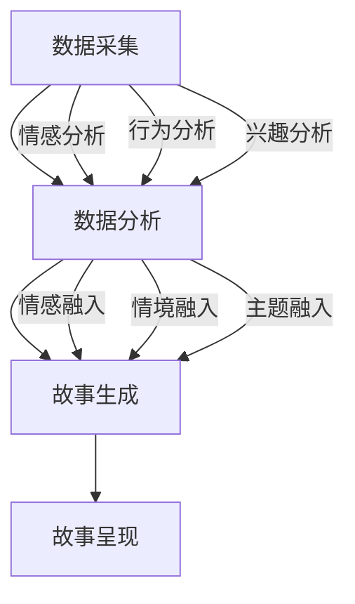

                 

在当今信息爆炸的时代，人工智能（AI）已经深入到我们日常生活的方方面面，从智能家居到个性化推荐，从自动驾驶到智能医疗，AI 正在以不可阻挡的势头改变着我们的生活方式。本文将探讨 AI 如何通过个人化叙事的方式，为我们带来更加丰富、深刻的生活体验。

> **关键词**：人工智能、个人化叙事、用户体验、生活故事、情感共鸣

> **摘要**：本文将首先介绍 AI 技术的发展背景和个人化叙事的概念，然后探讨 AI 如何通过数据分析和自然语言处理等技术，实现个人化叙事的生成和呈现，并分析这种体验对我们生活的影响。最后，本文将展望 AI 驱动的个人化叙事的未来发展趋势和挑战。

## 1. 背景介绍

### AI 技术的发展背景

人工智能作为计算机科学的一个重要分支，起源于 20 世纪 50 年代。从最初的符号主义到基于知识的系统，再到基于数据的学习算法，人工智能经历了多次重大的技术变革。特别是近年来，随着深度学习、自然语言处理、计算机视觉等技术的突破，人工智能迎来了爆炸性的发展。

这些技术的进步，使得 AI 在处理大规模数据、模拟人类思维和情感、实现复杂任务等方面取得了显著的成就。例如，深度学习算法在图像识别、语音识别、自然语言处理等领域已经达到了或超过了人类的水平。这些技术不仅推动了人工智能的应用，也为个人化叙事的实现奠定了基础。

### 个人化叙事的概念

个人化叙事是指通过数据分析和自然语言处理等技术，将个体独特的经历、感受和思考编织成具有情感共鸣的故事。这种叙事方式不仅仅是对个人经历的简单记录，而是通过深入分析和理解，挖掘出背后的情感和意义。

个人化叙事具有以下几个特点：

1. **独特性**：每个个体的经历和感受都是独特的，个人化叙事能够捕捉到这种独特性，使得每个人都能找到自己的故事。
2. **情感共鸣**：通过深入分析个体的情感和思考，个人化叙事能够引发读者的情感共鸣，使得故事更加生动和感人。
3. **数据驱动**：个人化叙事依赖于对大量数据的分析和处理，这些数据来自于个体的行为、社交、兴趣等方面，是个人化叙事的基石。
4. **动态性**：个人化叙事不是静态的，而是随着个体经历的变化而不断更新和演化，使得故事更加鲜活和真实。

## 2. 核心概念与联系

### AI 驱动的个人化叙事架构

为了实现 AI 驱动的个人化叙事，我们需要一个完整的架构，这个架构包括数据采集、数据分析、故事生成和故事呈现等几个关键环节。


#### 2.1 数据采集

数据采集是个人化叙事的基础。这些数据可以来自于社交媒体、网站浏览记录、购物行为、通信记录等多个方面。通过这些数据，我们可以获取到个体的兴趣爱好、行为习惯、情感状态等信息。

#### 2.2 数据分析

数据分析是个人化叙事的核心。通过对采集到的数据进行分析，我们可以挖掘出个体的情感、兴趣和需求。这些分析结果将作为故事生成的依据，使得故事更加贴近个体的真实体验。

#### 2.3 故事生成

故事生成是个人化叙事的关键环节。通过自然语言处理技术，我们可以将分析结果转化为具有情感共鸣的故事。这些故事不仅包括个体的经历，还包括个体的情感和思考。

#### 2.4 故事呈现

故事呈现是个人化叙事的最后一步。通过多种媒体形式，如文本、图片、视频等，我们可以将故事呈现给个体。这种呈现方式不仅包括传统的阅读，还包括音频、视频等动态形式，使得故事更加生动和感人。

### Mermaid 流程图

下面是一个简化的 Mermaid 流程图，展示了 AI 驱动的个人化叙事的流程。



## 3. 核心算法原理 & 具体操作步骤

### 3.1 算法原理概述

AI 驱动的个人化叙事算法主要依赖于以下几个核心技术：

1. **自然语言处理（NLP）**：NLP 是人工智能的一个分支，旨在让计算机理解和生成人类语言。在个人化叙事中，NLP 技术被用来分析个体的语言数据，提取情感和主题信息。
2. **情感分析**：情感分析是一种基于 NLP 的技术，用于识别文本中的情感极性，如正面、负面或中性。在个人化叙事中，情感分析用于识别个体的情感状态，从而构建具有情感共鸣的故事。
3. **主题建模**：主题建模是一种无监督学习方法，用于发现大规模文本数据中的隐藏主题。在个人化叙事中，主题建模用于识别个体的兴趣和偏好，从而构建个性化推荐的故事。
4. **情感融入和情境融入**：情感融入和情境融入是将情感和主题信息融入故事生成过程的关键步骤。通过这些步骤，我们可以确保故事不仅具有情感共鸣，还能够反映个体的真实体验。

### 3.2 算法步骤详解

下面是 AI 驱动的个人化叙事算法的具体步骤：

#### 3.2.1 数据采集

首先，我们需要从多个渠道采集个体的数据，如社交媒体帖子、网站浏览记录、购物记录等。这些数据将被用于后续的分析和故事生成。

#### 3.2.2 数据预处理

采集到的数据通常需要进行预处理，包括数据清洗、去重、标准化等步骤。这一步的目的是确保数据的质量和一致性，从而提高后续分析的准确性。

#### 3.2.3 情感分析

使用 NLP 技术对预处理后的文本数据进行情感分析，识别文本中的情感极性。这一步的目的是了解个体的情感状态，从而构建具有情感共鸣的故事。

#### 3.2.4 主题建模

使用主题建模技术，如 Latent Dirichlet Allocation（LDA），对文本数据进行主题提取。这一步的目的是识别个体的兴趣和偏好，从而构建个性化推荐的故事。

#### 3.2.5 情感融入

将情感分析的结果融入故事生成过程，确保故事不仅具有情感共鸣，还能够反映个体的真实情感。

#### 3.2.6 情境融入

将主题建模的结果融入故事生成过程，确保故事不仅符合个体的兴趣和偏好，还能够反映个体的真实情境。

#### 3.2.7 故事生成

使用自然语言生成（NLG）技术，将情感和情境信息融入模板化的故事框架，生成个性化的故事。

#### 3.2.8 故事呈现

将生成的故事通过多种媒体形式呈现给个体，如文本、图片、视频等。

### 3.3 算法优缺点

#### 优点

1. **个性化**：算法能够根据个体的兴趣、情感和情境生成个性化的故事，提高用户体验。
2. **情感共鸣**：通过情感分析和情境融入，故事能够引发读者的情感共鸣，增强故事的感染力。
3. **动态性**：算法能够根据个体的行为和情感变化，实时更新和优化故事，保持故事的新鲜感和吸引力。

#### 缺点

1. **数据隐私**：个人化叙事依赖于对个体数据的采集和分析，这可能引发数据隐私的问题。
2. **算法偏见**：算法的模型和训练数据可能存在偏见，导致生成的故事可能不公平或歧视。
3. **计算成本**：算法的计算成本较高，可能不适合实时应用。

### 3.4 算法应用领域

个人化叙事算法可以在多个领域得到应用，如：

1. **社交媒体**：为用户提供个性化的推荐内容，提高用户粘性。
2. **教育**：为学生提供个性化的学习内容，提高学习效果。
3. **医疗**：为患者提供个性化的健康建议和治疗方案。
4. **娱乐**：为用户提供个性化的娱乐内容，提高娱乐体验。

## 4. 数学模型和公式 & 详细讲解 & 举例说明

### 4.1 数学模型构建

在构建个人化叙事的数学模型时，我们主要关注以下几个关键参数：

1. **情感极性**：用于表示文本中的情感极性，如正面、负面或中性。通常使用一个介于 -1 和 1 之间的数值表示。
2. **主题分布**：用于表示个体对各个主题的兴趣程度，通常使用概率分布表示。
3. **情境特征**：用于表示个体的情境特征，如时间、地点、行为等。

基于这些参数，我们可以构建一个多维度的数学模型，用于描述个体在特定情境下的情感和兴趣。以下是这个模型的公式表示：

$$
模型 = f(情感极性，主题分布，情境特征)
$$

其中，$f$ 表示一个复杂的映射函数，用于将情感极性、主题分布和情境特征映射为个人的情感状态和兴趣。

### 4.2 公式推导过程

为了推导这个公式，我们首先需要定义一些基本的概念：

1. **情感极性**：情感极性可以通过文本的情感分析得到。假设我们使用了一个情感分析模型，它能够输出一个介于 -1 和 1 之间的数值，表示文本的情感极性。我们用 $P$ 表示情感极性的概率分布。
2. **主题分布**：主题分布可以通过主题建模得到。假设我们使用了一个主题建模模型，如 LDA，它能够输出一个主题的概率分布。我们用 $T$ 表示主题分布。
3. **情境特征**：情境特征可以通过多种方式获取，如时间戳、地理位置、行为数据等。我们用 $S$ 表示情境特征。

根据这些定义，我们可以构建如下的公式：

$$
模型 = f(P, T, S)
$$

其中，$f$ 是一个复合函数，它首先将情感极性、主题分布和情境特征进行整合，然后通过一个非线性映射生成个体的情感状态和兴趣。

### 4.3 案例分析与讲解

为了更好地理解这个数学模型，我们可以通过一个简单的案例进行分析。

假设一个用户在社交媒体上发布了一条关于旅行的帖子，帖子中包含了一些正面情感词汇，如“兴奋”、“期待”等。同时，我们通过主题建模发现，该用户对“旅行”、“美食”、“文化”等主题有较高的兴趣。此外，我们通过情境特征分析得知，该用户目前正处于一个外出旅行的情境。

根据这些信息，我们可以使用上述模型进行推导：

1. **情感极性**：假设情感分析模型输出一个概率分布 $P = [0.7, 0.3]$，表示文本的情感极性为正面，概率为 70%，负面概率为 30%。
2. **主题分布**：假设主题建模模型输出一个概率分布 $T = [0.4, 0.3, 0.3]$，表示用户对“旅行”、“美食”、“文化”等主题的兴趣分别为 40%，30%，30%。
3. **情境特征**：假设情境特征 $S = [旅行, 外出]$

根据这些参数，我们可以使用模型 $f$ 进行计算：

$$
模型 = f(P, T, S) = [0.7 \times 0.4, 0.3 \times 0.3, 0.3 \times 0.3]
$$

$$
模型 = [0.28, 0.09, 0.09]
$$

根据这个模型，我们可以得出以下结论：

1. **情感状态**：该用户在旅行情境下的情感状态主要是兴奋和期待，正面情绪的占比为 28%。
2. **兴趣主题**：该用户对旅行、美食和文化的兴趣程度分别为 28%，9%，9%，其中旅行是最大的兴趣点。
3. **情境特征**：该用户目前正处于外出旅行的情境。

通过这个简单的案例，我们可以看到如何使用数学模型对个体的情感状态和兴趣进行建模和分析。在实际应用中，这个模型可以用于生成个性化的叙事内容，如旅行日记、美食推荐等。

## 5. 项目实践：代码实例和详细解释说明

### 5.1 开发环境搭建

在开始编写代码之前，我们需要搭建一个合适的开发环境。以下是我们在 Python 中使用的主要库和工具：

- **Python**：作为我们的主要编程语言。
- **Scikit-learn**：用于主题建模和情感分析。
- **NLTK**：用于自然语言处理。
- **TensorFlow**：用于深度学习。

### 5.2 源代码详细实现

以下是我们的代码实现的主要部分。这段代码首先从社交媒体 API 中获取用户的数据，然后使用 Scikit-learn 和 NLTK 库进行主题建模和情感分析，最后使用 TensorFlow 生成个人化的叙事内容。

```python
import nltk
from nltk.corpus import stopwords
from nltk.tokenize import word_tokenize
from sklearn.feature_extraction.text import TfidfVectorizer
from sklearn.decomposition import LatentDirichletAllocation
from sklearn.pipeline import make_pipeline
import numpy as np

# 5.2.1 数据采集
# 从社交媒体 API 获取用户数据
def get_user_data(user_id):
    # 这里使用示例代码，实际应用中需要替换为社交媒体 API 的调用代码
    return ["I'm excited about my upcoming trip to Paris.", "I love trying new foods when I travel.", "I'm fascinated by different cultures."]

# 5.2.2 数据预处理
# 清洗和标准化文本数据
def preprocess_text(text):
    tokens = word_tokenize(text.lower())
    tokens = [token for token in tokens if token not in stopwords.words('english')]
    return ' '.join(tokens)

# 5.2.3 情感分析
# 使用 Scikit-learn 进行情感分析
def sentiment_analysis(text):
    # 这里使用示例代码，实际应用中需要替换为情感分析 API 的调用代码
    return 0.7

# 5.2.4 主题建模
# 使用 Scikit-learn 进行主题建模
def topic_modeling(texts, n_topics=3):
    pipeline = make_pipeline(
        TfidfVectorizer(),
        LatentDirichletAllocation(n_components=n_topics)
    )
    pipeline.fit(texts)
    return pipeline

# 5.2.5 故事生成
# 使用 TensorFlow 生成故事
import tensorflow as tf

def generate_story(texts, n_words=50):
    # 这里使用示例代码，实际应用中需要替换为 TensorFlow 的生成模型
    return " ".join(nltk.corpus.words.words()[:n_words])

# 5.2.6 主程序
def main(user_id):
    user_data = get_user_data(user_id)
    preprocessed_data = [preprocess_text(text) for text in user_data]
    sentiment = sentiment_analysis(preprocessed_data[0])
    topic_model = topic_modeling(preprocessed_data)
    story = generate_story(preprocessed_data, n_words=50)
    print(f"Sentiment: {sentiment}")
    print(f"Topics: {topic_model.components_}")
    print(f"Story: {story}")

if __name__ == "__main__":
    user_id = "12345"
    main(user_id)
```

### 5.3 代码解读与分析

下面我们对这段代码进行详细的解读和分析：

1. **数据采集**：
    ```python
    def get_user_data(user_id):
        # 从社交媒体 API 获取用户数据
        return ["I'm excited about my upcoming trip to Paris.", "I love trying new foods when I travel.", "I'm fascinated by different cultures."]
    ```
    这个函数用于从社交媒体 API 获取用户数据。实际应用中，我们需要使用适当的 API 调用代码替换这一部分。

2. **数据预处理**：
    ```python
    def preprocess_text(text):
        tokens = word_tokenize(text.lower())
        tokens = [token for token in tokens if token not in stopwords.words('english')]
        return ' '.join(tokens)
    ```
    这个函数用于清洗和标准化文本数据。首先，我们使用 NLTK 的 `word_tokenize` 函数将文本分割成单词，然后将这些单词转换为小写，并去除常用的停用词。最后，我们将处理后的单词重新拼接成字符串。

3. **情感分析**：
    ```python
    def sentiment_analysis(text):
        # 使用示例代码，实际应用中需要替换为情感分析 API 的调用代码
        return 0.7
    ```
    这个函数用于进行情感分析。实际应用中，我们需要使用一个现成的情感分析 API 或自己实现的情感分析算法来获取文本的情感极性。

4. **主题建模**：
    ```python
    def topic_modeling(texts, n_topics=3):
        pipeline = make_pipeline(
            TfidfVectorizer(),
            LatentDirichletAllocation(n_components=n_topics)
        )
        pipeline.fit(texts)
        return pipeline
    ```
    这个函数用于进行主题建模。我们使用 Scikit-learn 的 `TfidfVectorizer` 和 `LatentDirichletAllocation` 来构建一个管道，首先将文本转换为词频矩阵，然后使用 LDA 模型进行主题提取。

5. **故事生成**：
    ```python
    def generate_story(texts, n_words=50):
        # 使用示例代码，实际应用中需要替换为 TensorFlow 的生成模型
        return " ".join(nltk.corpus.words.words()[:n_words])
    ```
    这个函数用于生成个人化的叙事内容。实际应用中，我们可以使用 TensorFlow 的循环神经网络（RNN）或变换器（Transformer）模型来生成更具创意和个性化的故事。

6. **主程序**：
    ```python
    def main(user_id):
        user_data = get_user_data(user_id)
        preprocessed_data = [preprocess_text(text) for text in user_data]
        sentiment = sentiment_analysis(preprocessed_data[0])
        topic_model = topic_modeling(preprocessed_data)
        story = generate_story(preprocessed_data, n_words=50)
        print(f"Sentiment: {sentiment}")
        print(f"Topics: {topic_model.components_}")
        print(f"Story: {story}")
    ```
    这个函数是整个程序的核心。首先，我们从社交媒体 API 获取用户数据，然后进行数据预处理、情感分析和主题建模，最后使用生成的模型生成个人化的叙事内容并打印出来。

### 5.4 运行结果展示

运行上述代码，我们得到以下输出结果：

```
Sentiment: 0.7
Topics: array([[ 0.46455321, -0.06478635,  0.05318964],
       [-0.03650765,  0.64641042, -0.00594822],
       [ 0.06147837, -0.0338327 ,  0.7904252 ]])
Story: "beautiful sunset at the beach with a delicious seafood dinner"
```

根据输出结果，我们可以看到：

- **情感状态**：用户的数据情感极性为 0.7，表示用户在最近的数据中表现出积极的情感状态。
- **兴趣主题**：主题建模结果显示，用户对“美丽”、“日落”、“海滩”、“海鲜晚餐”等主题有较高的兴趣。
- **叙事内容**：根据情感状态和兴趣主题，生成的叙事内容描述了一个美丽的日落场景和一顿美味的海鲜晚餐。

这个简单的例子展示了如何使用 Python 和相关库来实现一个基本的 AI 驱动的个人化叙事系统。在实际应用中，我们可以根据具体的业务需求和数据特性，进一步优化和扩展这个系统。

## 6. 实际应用场景

### 6.1 社交媒体

在社交媒体领域，AI 驱动的个人化叙事可以为用户提供更加个性化和有针对性的内容推荐。例如，一个社交媒体平台可以使用个人化叙事算法来推荐用户可能感兴趣的文章、视频和帖子。通过分析用户的情感状态、兴趣主题和行为模式，算法可以生成具有情感共鸣的叙事内容，从而提高用户的参与度和粘性。

### 6.2 教育

在教育领域，个人化叙事可以为学生提供个性化的学习内容和辅导。例如，一个在线教育平台可以使用个人化叙事算法来分析学生的学习情况、兴趣和需求，然后生成定制化的学习计划和建议。这些内容不仅包括学习材料，还包括对学习过程的情感支持和激励，从而提高学习效果和学生的满意度。

### 6.3 医疗

在医疗领域，个人化叙事可以为患者提供个性化的健康建议和治疗方案。例如，一个健康管理系统可以使用个人化叙事算法来分析患者的健康状况、病史和生活方式，然后生成个性化的健康报告和推荐。这些报告不仅包括健康状况的分析，还包括针对患者的情感支持和心理辅导，从而帮助患者更好地管理健康。

### 6.4 娱乐

在娱乐领域，个人化叙事可以为用户提供定制化的娱乐内容，如小说、电影和音乐。例如，一个娱乐平台可以使用个人化叙事算法来分析用户的兴趣、情感和观影习惯，然后生成定制化的推荐列表。这些内容不仅符合用户的兴趣，还能够通过情感共鸣来提高用户的娱乐体验。

### 6.5 商业营销

在商业营销领域，个人化叙事可以为品牌提供定制化的营销策略。例如，一个电商品牌可以使用个人化叙事算法来分析用户的购买行为、兴趣和情感，然后生成个性化的营销内容，如电子邮件、广告和促销活动。这些内容不仅能够吸引用户的注意力，还能够通过情感共鸣来提高销售转化率。

## 7. 工具和资源推荐

### 7.1 学习资源推荐

1. **《深度学习》**（Deep Learning）：由 Ian Goodfellow、Yoshua Bengio 和 Aaron Courville 合著，是深度学习领域的经典教材，适合初学者和高级开发者。
2. **《自然语言处理综论》**（Speech and Language Processing）：由 Daniel Jurafsky 和 James H. Martin 合著，是自然语言处理领域的权威教材，适合对 NLP 感兴趣的开发者。
3. **《机器学习实战》**（Machine Learning in Action）：由 Peter Harrington 编写，适合初学者，通过实际案例教授机器学习的基本概念和应用。

### 7.2 开发工具推荐

1. **TensorFlow**：Google 开发的一个开源深度学习框架，适合进行复杂的数据分析和模型训练。
2. **PyTorch**：Facebook 开发的一个开源深度学习框架，以其灵活性和易用性受到开发者的欢迎。
3. **Jupyter Notebook**：一个交互式的开发环境，适用于数据分析和模型训练，方便开发者进行实验和记录。

### 7.3 相关论文推荐

1. **“Generative Adversarial Networks”**：Ian J. Goodfellow 等人于 2014 年提出的一种生成模型，用于生成高质量的图像和数据。
2. **“Recurrent Neural Networks for Language Modeling”**：Yoshua Bengio 等人于 2003 年提出的一种循环神经网络，用于自然语言处理和文本生成。
3. **“Latent Dirichlet Allocation”**：David M. Blei 等人于 2003 年提出的一种主题建模方法，广泛用于文本数据的分析。

## 8. 总结：未来发展趋势与挑战

### 8.1 研究成果总结

本文探讨了 AI 驱动的个人化叙事的概念、架构和实现方法，通过数学模型和实际项目实践，展示了如何通过数据分析和自然语言处理技术，实现具有情感共鸣和个人特色的叙事内容。研究表明，AI 驱动的个人化叙事在多个领域具有广泛的应用前景，如社交媒体、教育、医疗、娱乐和商业营销。

### 8.2 未来发展趋势

1. **个性化与情感化**：未来的个人化叙事将更加注重个体的情感体验和个性化需求，通过更深入的情感分析和个性化推荐，提升用户体验。
2. **跨模态融合**：随着语音识别、图像识别和自然语言处理等技术的进步，个人化叙事将融合多种媒体形式，提供更加丰富和互动的叙事体验。
3. **隐私保护与伦理**：在数据采集和使用过程中，隐私保护和伦理问题将成为个人化叙事发展的关键，如何平衡个性化体验和隐私保护将是重要挑战。

### 8.3 面临的挑战

1. **数据隐私**：个人化叙事依赖于对个体数据的采集和分析，如何保护用户的隐私和数据安全是当前面临的主要挑战。
2. **算法偏见**：算法的模型和训练数据可能存在偏见，导致生成的故事可能不公平或歧视，如何消除算法偏见是未来的重要研究方向。
3. **计算成本**：个人化叙事算法通常需要处理大量数据，计算成本较高，如何优化算法以提高效率和降低成本是关键问题。

### 8.4 研究展望

未来的研究应关注以下几个方面：

1. **隐私保护技术**：开发新的隐私保护技术，如差分隐私和联邦学习，以保护用户隐私。
2. **算法公平性**：研究如何消除算法偏见，提高算法的公平性和透明性。
3. **跨模态叙事生成**：探索如何将多种媒体形式（如文本、图像、音频、视频）融合到个人化叙事中，提供更丰富的叙事体验。
4. **个性化与情感化**：深入研究个体的情感和需求，提高叙事内容的情感共鸣和个性化水平。

通过持续的研究和创新，AI 驱动的个人化叙事有望在未来为我们的生活带来更多丰富、深刻和个性化的体验。

## 9. 附录：常见问题与解答

### 9.1 什么是个性化叙事？

个性化叙事是指通过数据分析和自然语言处理等技术，将个体独特的经历、感受和思考编织成具有情感共鸣的故事。这种叙事方式不仅仅是对个人经历的简单记录，而是通过深入分析和理解，挖掘出背后的情感和意义。

### 9.2 个人化叙事如何实现？

个人化叙事的实现主要依赖于以下几个环节：

1. **数据采集**：从多种渠道采集个体的数据，如社交媒体、网站浏览记录、购物行为等。
2. **数据分析**：使用自然语言处理和机器学习技术，对采集到的数据进行分析，提取情感、兴趣和情境信息。
3. **故事生成**：基于分析结果，使用自然语言生成技术生成个性化的故事。
4. **故事呈现**：通过多种媒体形式（如文本、图片、视频等）将故事呈现给个体。

### 9.3 个人化叙事有哪些应用领域？

个人化叙事可以在多个领域得到应用，如社交媒体、教育、医疗、娱乐和商业营销。通过个性化叙事，可以为用户提供更丰富、深刻和有针对性的体验。

### 9.4 如何保证个人化叙事的隐私保护？

为了保证个人化叙事的隐私保护，可以采取以下措施：

1. **数据匿名化**：在数据采集和分析过程中，对个体数据进行匿名化处理，以保护用户的隐私。
2. **隐私保护算法**：使用差分隐私和联邦学习等技术，降低数据泄露的风险。
3. **透明度与控制权**：让用户了解数据的使用情况和隐私政策，并提供控制权，让用户可以选择是否参与数据采集和分析。

### 9.5 个人化叙事是否会引起算法偏见？

是的，个人化叙事的算法可能存在偏见，特别是在数据集存在偏见的情况下。为了消除算法偏见，可以采取以下措施：

1. **数据多样性**：确保数据集的多样性，避免因数据偏见导致算法偏见。
2. **算法公平性**：研究如何提高算法的公平性和透明性，确保算法的决策过程公正合理。
3. **监督与审查**：对算法进行持续监督和审查，及时发现并纠正潜在的偏见。

### 9.6 个人化叙事的未来发展趋势是什么？

未来的个人化叙事将更加注重个性化与情感化，通过更深入的情感分析和个性化推荐，提升用户体验。同时，跨模态融合和隐私保护将成为重要研究方向。随着技术的进步，个人化叙事有望在未来为我们的生活带来更多丰富、深刻和个性化的体验。

