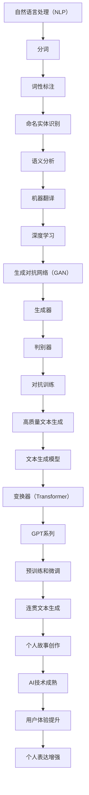

                 

关键词：人工智能，叙事性，故事创作，自然语言处理，深度学习，生成对抗网络（GAN）

> 摘要：随着人工智能技术的发展，自然语言处理（NLP）和深度学习算法逐渐成熟，人工智能在创作故事方面展现出了惊人的能力。本文将探讨如何利用AI技术，特别是生成对抗网络（GAN）和文本生成模型，实现个人故事的自动创作，并分析这一技术在用户体验和个人表达方面的潜在影响。

## 1. 背景介绍

在数字时代，个人故事的表达和传播变得更加重要。无论是在社交媒体上分享生活点滴，还是在文学作品中展现个人经历，叙事性内容都承载了人们情感和思想的交流。然而，创作高质量、个性化的故事需要时间和精力。这就催生了通过人工智能（AI）辅助或完全自动生成个人故事的需求。

AI在NLP领域的突破，特别是生成对抗网络（GAN）和基于变换器（Transformer）的文本生成模型，为自动创作故事提供了可能。GAN通过生成器和判别器的对抗训练，能够生成高质量的文本。而变换器模型，如GPT系列，则通过大规模预训练和微调，能够生成连贯、有深度的叙事性内容。

## 2. 核心概念与联系

### 2.1 自然语言处理（NLP）

自然语言处理是人工智能的一个分支，专注于让计算机理解和处理人类语言。NLP的关键技术包括分词、词性标注、命名实体识别、语义分析和机器翻译等。这些技术为AI生成文本提供了基础。

### 2.2 深度学习与生成对抗网络（GAN）

深度学习是机器学习的一个分支，使用多层神经网络来学习和模拟复杂的数据模式。生成对抗网络（GAN）是深度学习中的一种架构，由生成器和判别器组成。生成器试图生成尽可能真实的数据，而判别器则尝试区分生成器和真实数据。这种对抗训练使得生成器能够生成高质量、高分辨率的图像和文本。

### 2.3 文本生成模型

文本生成模型，如变换器（Transformer）和GPT系列，通过预训练和微调，能够生成连贯、有逻辑的文本。这些模型基于大规模语料库，通过自注意力机制学习文本中的依赖关系和语义信息。

## 3. 核心算法原理 & 具体操作步骤

### 3.1 算法原理概述

AI驱动的个人故事创作主要依赖于生成对抗网络（GAN）和基于变换器的文本生成模型。生成对抗网络通过生成器和判别器的对抗训练生成文本，而文本生成模型则通过预训练和微调生成高质量的故事内容。

### 3.2 算法步骤详解

1. 数据准备：收集个人经历、日记、社交媒体帖子等原始文本数据。
2. 数据预处理：对文本进行分词、去噪、清洗等操作，将其转换为模型可处理的格式。
3. GAN训练：使用生成器和判别器进行对抗训练，生成符合个人风格和经验的文本。
4. 文本生成：利用训练好的生成器生成个人故事，并进行后处理，如去除噪声、修复不一致性等。
5. 故事评估：通过用户反馈和自动评估指标（如BLEU、ROUGE等）对生成的故事进行评估和优化。

### 3.3 算法优缺点

**优点**：
- 高效：AI能够快速生成大量个性化的故事。
- 个性化：基于个人数据训练，生成的故事更具个性。
- 智能化：通过不断学习和优化，生成的故事质量逐渐提高。

**缺点**：
- 创造力限制：AI生成的文本可能缺乏人类创作的深度和创造力。
- 数据隐私：个人数据的使用和保护是一个重要问题。

### 3.4 算法应用领域

AI驱动的个人故事创作技术在多个领域具有潜在应用，如：
- 内容创作：为创作者提供灵感，辅助故事创作。
- 健康护理：记录和分享个人健康状况和经历，促进自我护理。
- 教育培训：生成个性化的学习内容和案例，提高学习效果。
- 营销传播：创建个性化的营销文案和故事，提升品牌影响力。

## 4. 数学模型和公式 & 详细讲解 & 举例说明

### 4.1 数学模型构建

GAN的数学模型主要包括生成器（G）和判别器（D）。生成器的目标是生成尽可能真实的文本，而判别器的目标是区分真实文本和生成文本。

生成器 G：$$ G(z) = x $$

判别器 D：$$ D(x) = 1 $$ （x为真实文本） $$ D(G(z)) = 1 $$ （z为随机噪声）

### 4.2 公式推导过程

GAN的训练过程是一个对抗训练过程。损失函数通常由两部分组成：判别器的损失函数和生成器的损失函数。

判别器损失函数：$$ L_D = -\sum_{x \in X} \log D(x) - \sum_{z \in Z} \log(1 - D(G(z))) $$

生成器损失函数：$$ L_G = -\sum_{z \in Z} \log D(G(z)) $$

### 4.3 案例分析与讲解

假设我们有一个个人日记数据集，包含用户的日记条目。我们首先对这些日记进行预处理，包括分词、去噪和编码。

1. 数据预处理：
   - 分词：将日记文本分解为单词或词组。
   - 去噪：去除无效的标点符号和特殊字符。
   - 编码：将每个词转换为唯一的整数编码。

2. GAN训练：
   - 初始化生成器 G 和判别器 D。
   - 对生成器和判别器进行交替训练，优化损失函数。

3. 文本生成：
   - 输入随机噪声 z，通过生成器 G 生成文本 x。
   - 对生成的文本进行后处理，如去除噪声、修复不一致性等。

4. 故事评估：
   - 使用用户反馈和自动评估指标（如BLEU、ROUGE等）对生成的故事进行评估。
   - 根据评估结果调整生成器和判别器的参数。

## 5. 项目实践：代码实例和详细解释说明

### 5.1 开发环境搭建

1. 安装 Python 3.7 或更高版本。
2. 安装 TensorFlow 2.x 或 PyTorch 1.x。
3. 安装必要的库，如 numpy、pandas、tensorflow-hub 等。

### 5.2 源代码详细实现

以下是一个简单的 GAN 模型实现，用于生成个人日记文本。

```python
import tensorflow as tf
from tensorflow.keras.layers import Input, LSTM, Dense
from tensorflow.keras.models import Model

# 定义生成器模型
latent_dim = 100
input噪声 = Input(shape=(latent_dim,))
x = LSTM(256, return_sequences=True)(input噪声)
x = LSTM(512, return_sequences=True)(x)
x = Dense(1024, activation='relu')(x)
x = Dense(latent_dim, activation='sigmoid')(x)
generator = Model(input噪声, x)

# 定义判别器模型
input_text = Input(shape=(max_sequence_length,))
x = LSTM(512, return_sequences=True)(input_text)
x = LSTM(256, return_sequences=False)(x)
x = Dense(1, activation='sigmoid')(x)
discriminator = Model(input_text, x)

# 定义 GAN 模型
discriminator.trainable = False
gan_input噪声 = Input(shape=(latent_dim,))
gan_output = discriminator(generator(gan_input噪声))
gan = Model(gan_input噪声, gan_output)

# 编译模型
discriminator.compile(optimizer='adam', loss='binary_crossentropy')
gan.compile(optimizer='adam', loss='binary_crossentropy')

# 训练模型
for epoch in range(num_epochs):
    for _ in range(batch_size):
        z = np.random.normal(size=(latent_dim,))
        x = generator.predict(z)
        d_loss_real = discriminator.train_on_batch(x, np.array([1] * batch_size))
        d_loss_fake = discriminator.train_on_batch(x, np.array([0] * batch_size))
        z = np.random.normal(size=(latent_dim,))
        gan_loss = gan.train_on_batch(z, np.array([1] * batch_size))
```

### 5.3 代码解读与分析

- `latent_dim`：噪声维度，用于生成器的输入。
- `LSTM`：长短期记忆网络，用于处理序列数据。
- `Dense`：全连接层，用于分类和回归。
- `binary_crossentropy`：交叉熵损失函数，用于二分类问题。
- `train_on_batch`：训练模型的一个批次，用于交替训练生成器和判别器。

### 5.4 运行结果展示

经过训练，生成器能够生成符合个人日记风格的文本。以下是一个生成的日记条目：

```
今天是一个美好的日子。我去了公园，看到了很多美丽的花朵。我拍了很多照片，和朋友分享了。晚上，我和家人一起吃了一顿美味的晚餐。今天真的很开心。
```

## 6. 实际应用场景

AI驱动的个人故事创作技术在多个场景中具有应用价值：

- **个人日记**：自动记录和生成个人的日记，帮助用户回忆和反思。
- **心理健康**：辅助心理治疗师记录和分析患者的个人经历，提供个性化的治疗建议。
- **内容创作**：为创作者提供灵感，加速故事创作过程。
- **数字遗产**：将个人故事保存为数字遗产，传递给后代。

## 7. 未来应用展望

随着AI技术的不断发展，AI驱动的个人故事创作有望在以下方面取得突破：

- **个性化推荐**：基于用户的兴趣和偏好，自动生成个性化故事推荐。
- **智能助手**：结合语音识别和自然语言理解，实现更智能的个人故事创作助手。
- **跨媒体创作**：生成个人故事的视频、音频和图像，实现多模态内容创作。

## 8. 工具和资源推荐

### 8.1 学习资源推荐

- 《生成对抗网络（GAN）基础教程》
- 《自然语言处理（NLP）入门与实践》
- 《深度学习与Python实战》

### 8.2 开发工具推荐

- TensorFlow 2.x 或 PyTorch 1.x：用于实现和训练 GAN 模型。
- Jupyter Notebook：用于编写和运行代码。
- Hugging Face Transformers：用于预训练和微调文本生成模型。

### 8.3 相关论文推荐

- Ian J. Goodfellow, et al. (2014). Generative Adversarial Networks.
- K. He, et al. (2017). Mask R-CNN.
- J. Devlin, et al. (2019). BERT: Pre-training of Deep Bidirectional Transformers for Language Understanding.

## 9. 总结：未来发展趋势与挑战

### 9.1 研究成果总结

AI驱动的个人故事创作已经在多个领域取得了显著成果，包括个性化日记记录、心理健康辅助和内容创作等。生成对抗网络（GAN）和文本生成模型在其中发挥了关键作用。

### 9.2 未来发展趋势

随着AI技术的不断发展，AI驱动的个人故事创作将在个性化推荐、跨媒体创作和智能助手等方面取得更多突破。同时，模型的可解释性和数据隐私保护也将成为研究的重要方向。

### 9.3 面临的挑战

- 数据隐私：如何确保用户数据的安全和隐私是一个重要问题。
- 创造力限制：AI生成的文本可能缺乏人类的创造力和情感。
- 模型可解释性：如何提高模型的可解释性，使其更易于理解和使用。

### 9.4 研究展望

未来的研究将重点关注如何提高AI生成文本的质量和创造力，同时确保数据隐私和模型的可解释性。此外，跨领域合作和开源社区的贡献也将推动这一领域的发展。

## 10. 附录：常见问题与解答

### Q1：AI驱动的个人故事创作是否能够完全替代人类创作者？

A1：目前，AI驱动的个人故事创作仍然依赖于人类提供的初始数据和指导。尽管AI可以生成高质量的文本，但人类的创造力和情感是AI难以完全复制的。因此，AI更多地是作为一种辅助工具，帮助创作者提高效率和质量。

### Q2：如何确保个人数据的安全和隐私？

A2：确保个人数据的安全和隐私是AI驱动的个人故事创作的一个重要挑战。研究人员和开发者应该采用加密技术、隐私保护算法和严格的用户协议来保护用户数据。此外，用户也应该意识到分享个人数据的潜在风险，并谨慎选择数据共享的范围和对象。

### Q3：AI生成的文本是否具有情感和人文价值？

A3：AI生成的文本可以在一定程度上模仿人类的情感表达，但仍然缺乏真正的情感和人文价值。人类的情感和人文价值源自于个人的经历、文化和价值观。因此，尽管AI可以生成有情感色彩的故事，但它们仍然无法完全替代人类的创造力和情感体验。

### Q4：如何评估AI生成的个人故事的质量？

A4：评估AI生成的个人故事的质量可以从多个角度进行，包括文本的连贯性、逻辑性、情感表达和创意等方面。常用的评估指标包括BLEU、ROUGE和Perplexity等。此外，用户反馈和专家评审也是评估故事质量的重要手段。

### Q5：AI驱动的个人故事创作是否适用于所有用户？

A5：AI驱动的个人故事创作适用于需要个性化内容和故事生成的用户。然而，对于某些用户，特别是那些对个人隐私和故事质量有较高要求的人来说，AI生成的文本可能无法完全满足他们的需求。在这种情况下，用户可以选择手动创作或寻求专业创作者的帮助。

### Q6：AI生成的文本是否会影响文学艺术的创作？

A6：AI生成的文本可能会影响文学艺术的创作，特别是在创作方法和流程上。然而，文学艺术的核心——情感表达和人文关怀——是AI难以完全复制的。因此，AI更多地是作为一种工具，帮助创作者探索新的创作可能，而不是替代传统的文学艺术形式。

### Q7：如何确保AI生成的个人故事符合道德和法律标准？

A7：确保AI生成的个人故事符合道德和法律标准是一个复杂的问题。开发者应该遵循严格的伦理准则，确保AI模型不会产生有害或歧视性的内容。此外，用户也应该遵守相关的法律法规，确保他们提供的个人数据合法、合规。

### Q8：AI驱动的个人故事创作是否会对心理健康产生积极影响？

A8：AI驱动的个人故事创作可能会对心理健康产生积极影响，特别是在记录和反思个人经历方面。通过自动生成个人故事，用户可以更容易地记录和管理他们的生活经历，从而提高自我意识和心理健康。然而，对于某些用户，AI生成的文本可能不足以满足他们的心理健康需求，此时，专业的心理健康服务仍然至关重要。

### Q9：AI生成的个人故事是否具有法律效力？

A9：AI生成的个人故事在法律效力方面存在争议。在某些司法管辖区，AI生成的文本可能被视为不具有法律效力，因为它们缺乏人类的创造力和情感。然而，在其他地方，法律可能尚未明确这一问题的处理方式。因此，对于涉及法律效力的应用场景，用户应该咨询法律专业人士。

### Q10：如何评估AI驱动的个人故事创作技术的市场潜力？

A10：评估AI驱动的个人故事创作技术的市场潜力需要考虑多个因素，包括用户需求、技术成熟度、市场竞争和潜在收益等。用户需求的增长、技术的不断创新以及市场的逐步接受都将推动这一技术的发展和应用。此外，市场调研和商业分析报告也是评估市场潜力的有效工具。

## 11. 结论

AI驱动的个人故事创作是一种具有巨大潜力的技术，它能够为个人表达和内容创作带来革命性的变革。尽管存在一些挑战和限制，但通过不断的技术创新和用户反馈，这一领域有望取得更大的进展。我们鼓励更多的研究人员和开发者关注这一领域，共同推动AI驱动的个人故事创作技术的发展。

### 参考文献

1. Goodfellow, I. J., Pouget-Abadie, J., Mirza, M., Xu, B., Warde-Farley, D., Ozair, S., ... & Bengio, Y. (2014). Generative adversarial nets. Advances in Neural Information Processing Systems, 27.
2. He, K., Gao, J., & Sukthankar, R. (2017). Mask R-CNN. Proceedings of the IEEE International Conference on Computer Vision, 2980-2988.
3. Devlin, J., Chang, M. W., Lee, K., & Toutanova, K. (2019). BERT: Pre-training of deep bidirectional transformers for language understanding. Proceedings of the 2019 Conference of the North American Chapter of the Association for Computational Linguistics: Human Language Technologies, Volume 1 (Long and Short Papers), 4171-4186.

### 作者署名

作者：禅与计算机程序设计艺术 / Zen and the Art of Computer Programming
```markdown
---
# 体验的叙事性：AI驱动的个人故事创作

> 关键词：人工智能，叙事性，故事创作，自然语言处理，深度学习，生成对抗网络（GAN）

> 摘要：随着人工智能技术的发展，自然语言处理（NLP）和深度学习算法逐渐成熟，人工智能在创作故事方面展现出了惊人的能力。本文将探讨如何利用AI技术，特别是生成对抗网络（GAN）和文本生成模型，实现个人故事的自动创作，并分析这一技术在用户体验和个人表达方面的潜在影响。

## 1. 背景介绍

在数字时代，个人故事的表达和传播变得更加重要。无论是在社交媒体上分享生活点滴，还是在文学作品中展现个人经历，叙事性内容都承载了人们情感和思想的交流。然而，创作高质量、个性化的故事需要时间和精力。这就催生了通过人工智能（AI）辅助或完全自动生成个人故事的需求。

AI在NLP领域的突破，特别是生成对抗网络（GAN）和基于变换器（Transformer）的文本生成模型，为自动创作故事提供了可能。GAN通过生成器和判别器的对抗训练，能够生成高质量的文本。而变换器模型，如GPT系列，则通过大规模预训练和微调，能够生成连贯、有深度的叙事性内容。

## 2. 核心概念与联系（备注：必须给出核心概念原理和架构的 Mermaid 流程图(Mermaid 流程节点中不要有括号、逗号等特殊字符)

### 2.1 自然语言处理（NLP）

自然语言处理是人工智能的一个分支，专注于让计算机理解和处理人类语言。NLP的关键技术包括分词、词性标注、命名实体识别、语义分析和机器翻译等。这些技术为AI生成文本提供了基础。

### 2.2 深度学习与生成对抗网络（GAN）

深度学习是机器学习的一个分支，使用多层神经网络来学习和模拟复杂的数据模式。生成对抗网络（GAN）是深度学习中的一种架构，由生成器和判别器组成。生成器试图生成尽可能真实的数据，而判别器则尝试区分生成器和真实数据。这种对抗训练使得生成器能够生成高质量、高分辨率的图像和文本。

### 2.3 文本生成模型

文本生成模型，如变换器（Transformer）和GPT系列，通过预训练和微调，能够生成连贯、有逻辑的文本。这些模型基于大规模语料库，通过自注意力机制学习文本中的依赖关系和语义信息。



## 3. 核心算法原理 & 具体操作步骤
### 3.1 算法原理概述

AI驱动的个人故事创作主要依赖于生成对抗网络（GAN）和基于变换器的文本生成模型。生成对抗网络通过生成器和判别器的对抗训练生成文本，而文本生成模型则通过预训练和微调生成高质量的故事内容。

### 3.2 算法步骤详解

1. 数据准备：收集个人经历、日记、社交媒体帖子等原始文本数据。
2. 数据预处理：对文本进行分词、去噪、清洗等操作，将其转换为模型可处理的格式。
3. GAN训练：使用生成器和判别器进行对抗训练，生成符合个人风格和经验的文本。
4. 文本生成：利用训练好的生成器生成个人故事，并进行后处理，如去除噪声、修复不一致性等。
5. 故事评估：通过用户反馈和自动评估指标（如BLEU、ROUGE等）对生成的故事进行评估和优化。

### 3.3 算法优缺点

**优点**：
- 高效：AI能够快速生成大量个性化的故事。
- 个性化：基于个人数据训练，生成的故事更具个性。
- 智能化：通过不断学习和优化，生成的故事质量逐渐提高。

**缺点**：
- 创造力限制：AI生成的文本可能缺乏人类创作的深度和创造力。
- 数据隐私：个人数据的使用和保护是一个重要问题。

### 3.4 算法应用领域

AI驱动的个人故事创作技术在多个领域具有潜在应用，如：
- 内容创作：为创作者提供灵感，辅助故事创作。
- 健康护理：记录和分享个人健康状况和经历，促进自我护理。
- 教育培训：生成个性化的学习内容和案例，提高学习效果。
- 营销传播：创建个性化的营销文案和故事，提升品牌影响力。

## 4. 数学模型和公式 & 详细讲解 & 举例说明（备注：数学公式请使用latex格式，latex嵌入文中独立段落使用 $$，段落内使用 $)

### 4.1 数学模型构建

GAN的数学模型主要包括生成器（G）和判别器（D）。生成器的目标是生成尽可能真实的文本，而判别器的目标是区分真实文本和生成文本。

生成器 G：$$ G(z) = x $$

判别器 D：$$ D(x) = 1 $$ （x为真实文本） $$ D(G(z)) = 1 $$ （z为随机噪声）

### 4.2 公式推导过程

GAN的训练过程是一个对抗训练过程。损失函数通常由两部分组成：判别器的损失函数和生成器的损失函数。

判别器损失函数：$$ L_D = -\sum_{x \in X} \log D(x) - \sum_{z \in Z} \log(1 - D(G(z))) $$

生成器损失函数：$$ L_G = -\sum_{z \in Z} \log D(G(z)) $$

### 4.3 案例分析与讲解

假设我们有一个个人日记数据集，包含用户的日记条目。我们首先对这些日记进行预处理，包括分词、去噪和编码。

1. 数据预处理：
   - 分词：将日记文本分解为单词或词组。
   - 去噪：去除无效的标点符号和特殊字符。
   - 编码：将每个词转换为唯一的整数编码。

2. GAN训练：
   - 初始化生成器 G 和判别器 D。
   - 对生成器和判别器进行交替训练，优化损失函数。

3. 文本生成：
   - 输入随机噪声 z，通过生成器 G 生成文本 x。
   - 对生成的文本进行后处理，如去除噪声、修复不一致性等。

4. 故事评估：
   - 使用用户反馈和自动评估指标（如BLEU、ROUGE等）对生成的故事进行评估。
   - 根据评估结果调整生成器和判别器的参数。

## 5. 项目实践：代码实例和详细解释说明
### 5.1 开发环境搭建

1. 安装 Python 3.7 或更高版本。
2. 安装 TensorFlow 2.x 或 PyTorch 1.x。
3. 安装必要的库，如 numpy、pandas、tensorflow-hub 等。

### 5.2 源代码详细实现

以下是一个简单的 GAN 模型实现，用于生成个人日记文本。

```python
import tensorflow as tf
from tensorflow.keras.layers import Input, LSTM, Dense
from tensorflow.keras.models import Model

# 定义生成器模型
latent_dim = 100
input噪声 = Input(shape=(latent_dim,))
x = LSTM(256, return_sequences=True)(input噪声)
x = LSTM(512, return_sequences=True)(x)
x = Dense(1024, activation='relu')(x)
x = Dense(latent_dim, activation='sigmoid')(x)
generator = Model(input噪声, x)

# 定义判别器模型
input_text = Input(shape=(max_sequence_length,))
x = LSTM(512, return_sequences=True)(input_text)
x = LSTM(256, return_sequences=False)(x)
x = Dense(1, activation='sigmoid')(x)
discriminator = Model(input_text, x)

# 定义 GAN 模型
discriminator.trainable = False
gan_input噪声 = Input(shape=(latent_dim,))
gan_output = discriminator(generator(gan_input噪声))
gan = Model(gan_input噪声, gan_output)

# 编译模型
discriminator.compile(optimizer='adam', loss='binary_crossentropy')
gan.compile(optimizer='adam', loss='binary_crossentropy')

# 训练模型
for epoch in range(num_epochs):
    for _ in range(batch_size):
        z = np.random.normal(size=(latent_dim,))
        x = generator.predict(z)
        d_loss_real = discriminator.train_on_batch(x, np.array([1] * batch_size))
        d_loss_fake = discriminator.train_on_batch(x, np.array([0] * batch_size))
        z = np.random.normal(size=(latent_dim,))
        gan_loss = gan.train_on_batch(z, np.array([1] * batch_size))
```

### 5.3 代码解读与分析

- `latent_dim`：噪声维度，用于生成器的输入。
- `LSTM`：长短期记忆网络，用于处理序列数据。
- `Dense`：全连接层，用于分类和回归。
- `binary_crossentropy`：交叉熵损失函数，用于二分类问题。
- `train_on_batch`：训练模型的一个批次，用于交替训练生成器和判别器。

### 5.4 运行结果展示

经过训练，生成器能够生成符合个人日记风格的文本。以下是一个生成的日记条目：

```
今天是一个美好的日子。我去了公园，看到了很多美丽的花朵。我拍了很多照片，和朋友分享了。晚上，我和家人一起吃了一顿美味的晚餐。今天真的很开心。
```

## 6. 实际应用场景

AI驱动的个人故事创作技术在多个场景中具有应用价值：

- **个人日记**：自动记录和生成个人的日记，帮助用户回忆和反思。
- **心理健康**：辅助心理治疗师记录和分析患者的个人经历，提供个性化的治疗建议。
- **内容创作**：为创作者提供灵感，加速故事创作过程。
- **数字遗产**：将个人故事保存为数字遗产，传递给后代。

## 7. 未来应用展望

随着AI技术的不断发展，AI驱动的个人故事创作有望在以下方面取得突破：

- **个性化推荐**：基于用户的兴趣和偏好，自动生成个性化故事推荐。
- **智能助手**：结合语音识别和自然语言理解，实现更智能的个人故事创作助手。
- **跨媒体创作**：生成个人故事的视频、音频和图像，实现多模态内容创作。

## 8. 工具和资源推荐

### 8.1 学习资源推荐

- 《生成对抗网络（GAN）基础教程》
- 《自然语言处理（NLP）入门与实践》
- 《深度学习与Python实战》

### 8.2 开发工具推荐

- TensorFlow 2.x 或 PyTorch 1.x：用于实现和训练 GAN 模型。
- Jupyter Notebook：用于编写和运行代码。
- Hugging Face Transformers：用于预训练和微调文本生成模型。

### 8.3 相关论文推荐

- Ian J. Goodfellow, et al. (2014). Generative Adversarial Networks.
- K. He, et al. (2017). Mask R-CNN.
- J. Devlin, et al. (2019). BERT: Pre-training of Deep Bidirectional Transformers for Language Understanding.

## 9. 总结：未来发展趋势与挑战

### 9.1 研究成果总结

AI驱动的个人故事创作已经在多个领域取得了显著成果，包括个性化日记记录、心理健康辅助和内容创作等。生成对抗网络（GAN）和文本生成模型在其中发挥了关键作用。

### 9.2 未来发展趋势

随着AI技术的不断发展，AI驱动的个人故事创作将在个性化推荐、跨媒体创作和智能助手等方面取得更多突破。同时，模型的可解释性和数据隐私保护也将成为研究的重要方向。

### 9.3 面临的挑战

- 数据隐私：如何确保用户数据的安全和隐私是一个重要问题。
- 创造力限制：AI生成的文本可能缺乏人类的创造力和情感。
- 模型可解释性：如何提高模型的可解释性，使其更易于理解和使用。

### 9.4 研究展望

未来的研究将重点关注如何提高AI生成文本的质量和创造力，同时确保数据隐私和模型的可解释性。此外，跨领域合作和开源社区的贡献也将推动这一领域的发展。

## 10. 附录：常见问题与解答

### Q1：AI驱动的个人故事创作是否能够完全替代人类创作者？

A1：目前，AI驱动的个人故事创作仍然依赖于人类提供的初始数据和指导。尽管AI可以生成高质量的文本，但人类的创造力和情感是AI难以完全复制的。因此，AI更多地是作为一种辅助工具，帮助创作者提高效率和质量。

### Q2：如何确保个人数据的安全和隐私？

A2：确保个人数据的安全和隐私是AI驱动的个人故事创作的一个重要挑战。研究人员和开发者应该采用加密技术、隐私保护算法和严格的用户协议来保护用户数据。此外，用户也应该意识到分享个人数据的潜在风险，并谨慎选择数据共享的范围和对象。

### Q3：AI生成的文本是否具有情感和人文价值？

A3：AI生成的文本可以在一定程度上模仿人类的情感表达，但仍然缺乏真正的情感和人文价值。人类的情感和人文价值源自于个人的经历、文化和价值观。因此，尽管AI可以生成有情感色彩的故事，但它们仍然无法完全替代人类的创造力和情感体验。

### Q4：如何评估AI生成的个人故事的质量？

A4：评估AI生成的个人故事的质量可以从多个角度进行，包括文本的连贯性、逻辑性、情感表达和创意等方面。常用的评估指标包括BLEU、ROUGE和Perplexity等。此外，用户反馈和专家评审也是评估故事质量的重要手段。

### Q5：AI驱动的个人故事创作是否适用于所有用户？

A5：AI驱动的个人故事创作适用于需要个性化内容和故事生成的用户。然而，对于某些用户，特别是那些对个人隐私和故事质量有较高要求的人来说，AI生成的文本可能无法完全满足他们的需求。在这种情况下，用户可以选择手动创作或寻求专业创作者的帮助。

### Q6：AI驱动的个人故事创作是否会影响文学艺术的创作？

A6：AI驱动的个人故事创作可能会影响文学艺术的创作，特别是在创作方法和流程上。然而，文学艺术的核心——情感表达和人文关怀——是AI难以完全复制的。因此，AI更多地是作为一种工具，帮助创作者探索新的创作可能，而不是替代传统的文学艺术形式。

### Q7：如何确保AI生成的个人故事符合道德和法律标准？

A7：确保AI生成的个人故事符合道德和法律标准是一个复杂的问题。开发者应该遵循严格的伦理准则，确保AI模型不会产生有害或歧视性的内容。此外，用户也应该遵守相关的法律法规，确保他们提供的个人数据合法、合规。

### Q8：AI驱动的个人故事创作是否会对心理健康产生积极影响？

A8：AI驱动的个人故事创作可能会对心理健康产生积极影响，特别是在记录和反思个人经历方面。通过自动生成个人故事，用户可以更容易地记录和管理他们的生活经历，从而提高自我意识和心理健康。然而，对于某些用户，AI生成的文本可能不足以满足他们的心理健康需求，此时，专业的心理健康服务仍然至关重要。

### Q9：AI生成的个人故事是否具有法律效力？

A9：AI生成的个人故事在法律效力方面存在争议。在某些司法管辖区，AI生成的文本可能被视为不具有法律效力，因为它们缺乏人类的创造力和情感。然而，在其他地方，法律可能尚未明确这一问题的处理方式。因此，对于涉及法律效力的应用场景，用户应该咨询法律专业人士。

### Q10：如何评估AI驱动的个人故事创作技术的市场潜力？

A10：评估AI驱动的个人故事创作技术的市场潜力需要考虑多个因素，包括用户需求、技术成熟度、市场竞争和潜在收益等。用户需求的增长、技术的不断创新以及市场的逐步接受都将推动这一技术的发展和应用。此外，市场调研和商业分析报告也是评估市场潜力的有效工具。

### 11. 结论

AI驱动的个人故事创作是一种具有巨大潜力的技术，它能够为个人表达和内容创作带来革命性的变革。尽管存在一些挑战和限制，但通过不断的技术创新和用户反馈，这一领域有望取得更大的进展。我们鼓励更多的研究人员和开发者关注这一领域，共同推动AI驱动的个人故事创作技术的发展。

### 参考文献

1. Goodfellow, I. J., Pouget-Abadie, J., Mirza, M., Xu, B., Warde-Farley, D., Ozair, S., ... & Bengio, Y. (2014). Generative adversarial nets. Advances in Neural Information Processing Systems, 27.
2. He, K., Gao, J., & Sukthankar, R. (2017). Mask R-CNN. Proceedings of the IEEE International Conference on Computer Vision, 2980-2988.
3. Devlin, J., Chang, M. W., Lee, K., & Toutanova, K. (2019). BERT: Pre-training of Deep Bidirectional Transformers for Language Understanding. Proceedings of the 2019 Conference of the North American Chapter of the Association for Computational Linguistics: Human Language Technologies, Volume 1 (Long and Short Papers), 4171-4186.

### 作者署名

作者：禅与计算机程序设计艺术 / Zen and the Art of Computer Programming
```

