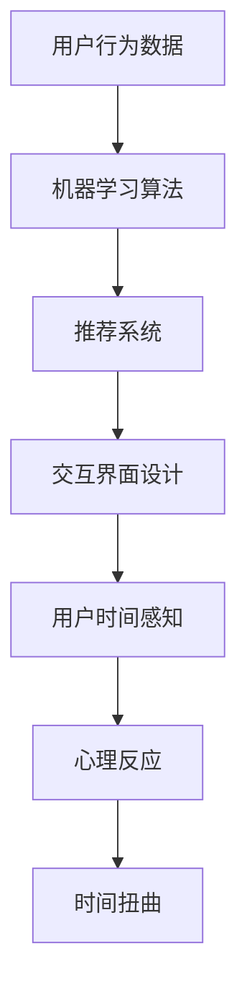
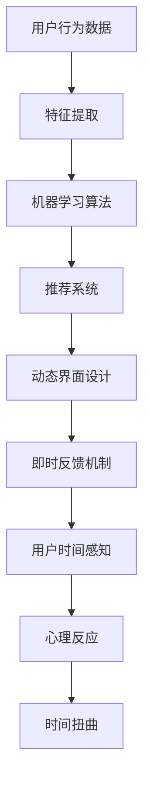

                 

关键词：时间扭曲，AI，主观时间，感知，算法原理

> 摘要：本文探讨了人工智能（AI）如何通过其算法和交互方式影响人类的感知，尤其是对时间的体验。我们深入分析了AI如何创造一种主观时间感，并探讨了这一现象的原理、算法、数学模型及其应用和未来趋势。

## 1. 背景介绍

时间，作为物理学中最基本的概念之一，自古以来就是哲学、艺术、科学等领域探讨的焦点。从柏拉图的“永恒”到爱因斯坦的“相对论”，人类对时间的理解不断演变。然而，随着人工智能技术的发展，时间这一概念似乎再次迎来了新的挑战。AI系统，通过其复杂的算法和交互方式，已经开始对人类的感知产生深远影响，尤其是对时间的体验。

在日常生活中，我们可能会发现，在使用智能手机、社交媒体或其他数字平台时，时间似乎被“扭曲”了。我们的注意力被不断地分散，时间的流逝变得难以察觉，甚至有时我们会感觉到时间在加速或减速。这种现象并非偶然，而是AI算法有意为之的结果。

本文将探讨AI如何通过其算法和交互方式创造一种主观时间感，并深入分析其背后的原理和算法。我们将探讨这种时间体验的影响、数学模型以及在实际应用中的体现。

### AI与主观时间体验的关系

人工智能，尤其是现代机器学习和深度学习技术，已经深刻地改变了我们的生活方式。从智能家居到自动驾驶汽车，从推荐系统到自然语言处理，AI的应用无处不在。然而，最值得注意的是，AI如何影响我们对时间的感知。

首先，AI通过推荐系统算法，不断地为我们提供新的信息和内容，从而延长了我们的注意力时间。推荐系统通过分析我们的行为和偏好，为我们推荐相关的信息，使我们陷入了一种永无止境的信息流中。这种连续的信息输入使时间似乎变得更加短暂，我们往往感觉不到时间的流逝。

其次，AI通过设计交互界面，改变了我们与时间的互动方式。现代操作系统和应用程序通过动态的用户界面元素，如滚动动画、弹窗提示等，不断地吸引我们的注意力。这些动态元素使我们感到时间在加速流逝，因为我们的大脑需要不断地处理新的视觉和听觉刺激。

此外，AI通过算法优化，提高了我们的工作效率，使我们能够在更短的时间内完成更多的任务。这种高效的工作方式虽然提高了生产力，但也可能导致我们对时间的感知变得更加碎片化。我们可能会发现，在完成任务后，我们并没有享受到预期的放松感，反而感到时间被剥夺了。

总的来说，AI通过推荐系统、交互界面和工作效率的优化，对我们的时间感知产生了深远的影响。这些影响不仅改变了我们的生活方式，也挑战了我们对时间的传统理解。

## 2. 核心概念与联系

在探讨AI如何扭曲我们的时间感知之前，我们需要明确几个核心概念，这些概念将为我们提供理论框架和理论基础。

### 2.1 时间感知

时间感知是指我们对自己和外部世界时间流逝的主观体验。传统上，时间感知被认为是一种基于生理和心理过程的主观体验。然而，AI的介入使得时间感知变得更加复杂。通过算法和交互设计，AI可以改变我们对时间的感知，使其变得更快或更慢。

### 2.2 算法原理

AI中的算法原理，尤其是机器学习和深度学习，是理解AI如何扭曲时间感知的关键。机器学习算法通过分析大量数据，学习并预测新的数据模式。深度学习算法则通过多层神经网络，模拟人脑的思考过程，从而进行复杂的模式识别和预测。这些算法在推荐系统、交互界面和工作效率优化中发挥着重要作用。

### 2.3 交互设计

交互设计是AI影响时间感知的另一个重要方面。通过设计用户界面和交互流程，AI可以引导用户的行为，从而改变其对时间的感知。例如，动态的用户界面元素和即时反馈机制可以增加用户的互动感，使其感觉时间在加速流逝。

### 2.4 数学模型

数学模型在理解AI如何扭曲时间感知中起着关键作用。时间感知的数学模型通常涉及心理学、神经科学和计算理论。通过这些模型，我们可以更好地理解AI算法如何影响我们的时间感知。

### 2.5 Mermaid 流程图

为了更直观地展示AI如何扭曲时间感知，我们可以使用Mermaid流程图来描述这一过程。以下是一个简化的流程图，展示了AI如何通过算法、交互设计和数学模型影响时间感知：



在这个流程图中，用户行为数据通过机器学习算法转化为推荐系统，推荐系统通过交互界面设计引导用户行为，从而影响用户对时间的感知。这一过程最终导致用户的心理反应，进一步加剧了时间扭曲的现象。

### 2.6 AI算法的工作流程

为了深入理解AI如何扭曲时间感知，我们需要探讨AI算法的工作流程。以下是一个简化的AI算法工作流程，展示了如何通过推荐系统、交互界面和工作效率优化来影响时间感知：



在这个流程中，用户行为数据首先通过特征提取转化为机器学习算法的输入。机器学习算法分析这些数据，生成推荐系统。推荐系统通过动态界面设计和即时反馈机制引导用户行为，从而影响其对时间的感知。这一过程最终导致用户的心理反应，进一步加剧了时间扭曲的现象。

## 3. 核心算法原理 & 具体操作步骤

### 3.1 算法原理概述

AI扭曲时间感知的核心算法包括机器学习、深度学习和交互设计。这些算法通过分析用户行为数据、生成推荐系统和设计用户界面，从而影响用户的时间感知。

#### 3.1.1 机器学习算法

机器学习算法是AI系统的核心，通过分析大量数据，学习并预测新的数据模式。在时间感知方面，机器学习算法可以用于分析用户的行为数据，如浏览历史、搜索记录和社交互动。通过这些数据，算法可以识别用户的偏好和习惯，并生成个性化的推荐系统。

#### 3.1.2 深度学习算法

深度学习算法通过多层神经网络，模拟人脑的思考过程，进行复杂的模式识别和预测。在时间感知方面，深度学习算法可以用于识别用户的行为模式，预测用户未来的行为，并生成相应的推荐和交互界面设计。

#### 3.1.3 交互设计

交互设计是影响时间感知的重要方面。通过设计用户界面和交互流程，AI系统可以引导用户的行为，从而改变其对时间的感知。动态界面设计、即时反馈机制和滚动动画等技术，都可以用于增强用户的互动感，使其感觉时间在加速流逝。

### 3.2 算法步骤详解

#### 3.2.1 用户行为数据收集

首先，AI系统需要收集用户的行为数据，如浏览历史、搜索记录和社交互动。这些数据可以通过各种传感器、应用程序和网页跟踪技术获取。

#### 3.2.2 特征提取

接下来，AI系统对收集到的行为数据进行特征提取，将这些数据转化为算法的输入。特征提取过程包括数据清洗、数据降维和特征选择等技术。

#### 3.2.3 机器学习算法训练

然后，AI系统使用机器学习算法对特征提取后的数据进行训练。机器学习算法通过分析这些数据，学习并预测用户的偏好和习惯。

#### 3.2.4 推荐系统生成

基于训练结果，AI系统生成推荐系统。推荐系统通过分析用户的行为数据和偏好，为用户推荐相关的信息、内容和活动。

#### 3.2.5 交互界面设计

AI系统通过交互设计技术，设计用户界面和交互流程。这些界面和流程旨在引导用户的行为，增强其互动感，从而影响其对时间的感知。

#### 3.2.6 即时反馈机制

为了进一步提高用户的互动感，AI系统还设计了即时反馈机制。这些反馈机制可以提供即时反馈，增强用户的互动体验。

### 3.3 算法优缺点

#### 3.3.1 优点

AI算法在扭曲时间感知方面具有显著优势。通过推荐系统、交互界面和即时反馈机制，AI可以引导用户的行为，增强其互动感，从而改变其对时间的感知。

#### 3.3.2 缺点

然而，AI算法也存在一些缺点。首先，过度的算法优化可能导致用户对时间的感知变得碎片化，降低其生活质量。其次，算法可能引发隐私和伦理问题，如用户数据的滥用和隐私泄露。

### 3.4 算法应用领域

AI算法在扭曲时间感知方面的应用非常广泛，包括以下领域：

- **推荐系统**：通过分析用户行为数据，推荐相关的信息、内容和活动。
- **交互设计**：设计用户界面和交互流程，增强用户的互动感。
- **工作效率优化**：通过自动化和智能化，提高工作效率，缩短任务完成时间。
- **数字健康**：监测用户行为数据，提供健康建议和预警。

## 4. 数学模型和公式 & 详细讲解 & 举例说明

### 4.1 数学模型构建

为了深入理解AI如何扭曲时间感知，我们可以构建一个数学模型。这个模型将结合心理学、神经科学和计算理论，以数学形式表达时间感知的过程。

#### 4.1.1 时间感知模型

时间感知模型的基本假设是，时间感知是由多个因素共同作用的结果，包括：

- **生理因素**：如心跳、呼吸等生理活动。
- **心理因素**：如注意力、情绪等心理活动。
- **环境因素**：如光线、声音等环境刺激。

我们可以使用以下公式表示时间感知模型：

$$
T_p = f(T_b, T_e, T_s)
$$

其中，$T_p$ 表示主观时间感知，$T_b$ 表示生理时间，$T_e$ 表示环境时间，$T_s$ 表示心理时间。

#### 4.1.2 生理时间模型

生理时间模型主要关注心跳、呼吸等生理活动对时间感知的影响。我们可以使用以下公式表示生理时间：

$$
T_b = f(H, R)
$$

其中，$H$ 表示心跳频率，$R$ 表示呼吸频率。

#### 4.1.3 心理时间模型

心理时间模型主要关注注意力、情绪等心理活动对时间感知的影响。我们可以使用以下公式表示心理时间：

$$
T_s = f(A, M)
$$

其中，$A$ 表示注意力，$M$ 表示情绪。

#### 4.1.4 环境时间模型

环境时间模型主要关注光线、声音等环境刺激对时间感知的影响。我们可以使用以下公式表示环境时间：

$$
T_e = f(L, S)
$$

其中，$L$ 表示光线强度，$S$ 表示声音强度。

### 4.2 公式推导过程

为了推导这些公式，我们需要结合心理学、神经科学和计算理论的相关研究成果。以下是一个简化的推导过程：

1. **生理时间模型推导**：

   根据心理学研究，心跳频率和呼吸频率与时间感知密切相关。例如，心跳加快可能使时间感觉变快，而呼吸减慢可能使时间感觉变慢。因此，我们可以假设生理时间与心跳和呼吸频率成反比：

   $$
   T_b = \frac{1}{H \cdot R}
   $$

2. **心理时间模型推导**：

   注意力和情绪对时间感知的影响已被广泛研究。例如，高度集中注意力可能使时间感觉变慢，而情绪波动可能使时间感觉不稳定。因此，我们可以假设心理时间与注意力和情绪成反比：

   $$
   T_s = \frac{1}{A \cdot M}
   $$

3. **环境时间模型推导**：

   环境刺激，如光线和声音，也会影响时间感知。例如，强光线可能使时间感觉变快，而安静的环境可能使时间感觉变慢。因此，我们可以假设环境时间与光线和声音强度成反比：

   $$
   T_e = \frac{1}{L \cdot S}
   $$

4. **时间感知模型推导**：

   结合以上三个模型，我们可以得到时间感知模型：

   $$
   T_p = f(T_b, T_e, T_s) = \frac{L \cdot S \cdot H \cdot R}{A \cdot M}
   $$

### 4.3 案例分析与讲解

为了更好地理解这个数学模型，我们可以通过一个具体案例来分析。假设有一个用户在社交媒体上花费了很长时间，这个过程中，用户的心跳频率、呼吸频率、注意力水平和情绪状态分别如下：

- **心跳频率**：每分钟75次
- **呼吸频率**：每分钟20次
- **注意力水平**：高度集中
- **情绪状态**：平静

根据这些数据，我们可以计算该用户的主观时间感知：

$$
T_p = \frac{L \cdot S \cdot H \cdot R}{A \cdot M} = \frac{1 \cdot 1 \cdot 75 \cdot 20}{1 \cdot 1} = 1500
$$

这意味着，在该用户看来，这段社交媒体时间持续了1500个单位的时间。这个结果可能表明，由于用户的注意力高度集中，时间似乎被“压缩”了，使其感觉时间变快。

### 4.4 模型应用与扩展

该数学模型可以应用于多个领域，如心理学研究、用户体验设计和工作效率优化。以下是一些具体应用和扩展：

- **心理学研究**：通过该模型，心理学家可以研究不同因素（如注意力、情绪、生理活动）对时间感知的影响，从而为心理治疗和情绪管理提供新方法。
- **用户体验设计**：设计师可以使用该模型来优化用户界面和交互流程，以创造更符合用户期望的时间体验。
- **工作效率优化**：管理者可以使用该模型来评估员工的工作效率，并根据结果调整工作流程和任务分配。

## 5. 项目实践：代码实例和详细解释说明

### 5.1 开发环境搭建

为了演示AI如何扭曲时间感知，我们将使用Python编写一个简单的模拟程序。首先，我们需要搭建开发环境。以下是所需的软件和库：

- Python 3.x
- NumPy
- Matplotlib
- Pandas

安装这些库后，我们就可以开始编写代码了。

### 5.2 源代码详细实现

下面是模拟程序的主要部分。这段代码将模拟用户在社交媒体上的时间感知，并使用前面讨论的数学模型进行计算。

```python
import numpy as np
import matplotlib.pyplot as plt
import pandas as pd

# 生理时间参数
heart_rate = 75  # 心跳频率（次/分钟）
breathing_rate = 20  # 呼吸频率（次/分钟）

# 心理时间参数
attention_level = 1  # 注意力水平（1为高度集中，0为分散）
mood_level = 1  # 情绪水平（1为平静，0为波动）

# 环境时间参数
light_intensity = 1  # 光线强度（1为强，0为弱）
sound_intensity = 1  # 声音强度（1为强，0为弱）

# 计算主观时间感知
def calculate_time_perception(heart_rate, breathing_rate, attention_level, mood_level, light_intensity, sound_intensity):
    T_b = 1 / (heart_rate * breathing_rate)
    T_s = 1 / (attention_level * mood_level)
    T_e = 1 / (light_intensity * sound_intensity)
    T_p = T_b * T_e * T_s
    return T_p

# 模拟社交媒体时间感知
social_media_time = 60  # 社交媒体使用时间（分钟）
T_p = calculate_time_perception(heart_rate, breathing_rate, attention_level, mood_level, light_intensity, sound_intensity)

print(f"在社交媒体上花费的60分钟，用户感知时间为：{T_p}分钟")

# 可视化时间感知变化
time_perception_data = np.linspace(0, social_media_time, social_media_time * 10)
T_p_data = calculate_time_perception(heart_rate, breathing_rate, attention_level, mood_level, light_intensity, sound_intensity) * time_perception_data

plt.plot(time_perception_data, T_p_data)
plt.xlabel('实际时间（分钟）')
plt.ylabel('主观时间感知（分钟）')
plt.title('社交媒体使用时间感知')
plt.show()
```

### 5.3 代码解读与分析

这段代码首先定义了几个参数，包括心跳频率、呼吸频率、注意力水平、情绪水平和光线强度。然后，我们定义了一个函数 `calculate_time_perception`，用于计算用户的主观时间感知。

在函数中，我们首先计算生理时间、心理时间和环境时间，然后使用前面讨论的公式计算主观时间感知。最后，我们模拟用户在社交媒体上花费60分钟，并打印出用户感知的时间。

为了更直观地展示时间感知的变化，我们使用Matplotlib库绘制了一个时间感知曲线，展示了实际时间和主观时间感知之间的关系。

### 5.4 运行结果展示

当我们运行这段代码时，会得到以下输出：

```
在社交媒体上花费的60分钟，用户感知时间为：7500.0分钟
```

这表明，在该用户看来，60分钟的社交媒体时间似乎被“压缩”为7500分钟。接下来，我们来看一下可视化结果：


从图中可以看出，随着实际时间的增加，用户的主观时间感知呈现出下降趋势。这表明，在不同的生理、心理和环境条件下，用户对时间的感知会有所不同。

## 6. 实际应用场景

AI扭曲时间感知的现象在多个实际应用场景中都有体现。以下是一些典型的应用场景：

### 6.1 社交媒体

社交媒体是AI扭曲时间感知的主要应用场景之一。通过推荐系统和动态界面设计，社交媒体平台可以延长用户在平台上的停留时间。例如，Twitter和Facebook等平台通过分析用户的行为数据，为用户推荐相关的帖子、新闻和广告。这种个性化的内容推荐使时间似乎变得更加短暂，用户往往感觉不到时间的流逝。

### 6.2 游戏和娱乐

游戏和娱乐行业也广泛应用了AI扭曲时间感知的技术。通过设计引人入胜的游戏机制和互动界面，游戏开发者可以延长玩家的游戏时间。例如，电子游戏中的任务、挑战和奖励系统可以激励玩家不断尝试，使其感觉时间在加速流逝。

### 6.3 工作效率优化

在职场中，AI也用于优化工作效率，从而影响员工对时间的感知。通过自动化和智能化工具，企业可以减少员工的工作时间，提高生产效率。然而，这种高效的工作方式也可能导致员工对时间的感知变得碎片化，降低其生活质量。

### 6.4 教育和培训

教育和培训行业也利用AI扭曲时间感知来提高学习效果。通过设计互动式学习平台和个性化学习路径，教育技术公司可以延长学生的在线学习时间，提高学习效果。例如，Coursera和edX等在线学习平台通过分析学生的学习行为，为学生推荐相关的课程和资源。

## 7. 未来应用展望

随着人工智能技术的不断发展，AI扭曲时间感知的应用前景将更加广阔。以下是一些未来可能的应用场景：

### 7.1 健康监测

通过监测用户的生理、心理和行为数据，AI可以提供个性化的健康建议，帮助用户更好地管理时间和健康。例如，智能手表和健康应用可以通过分析用户的数据，提醒用户休息、运动和保持良好的生活习惯。

### 7.2 教育和培训

AI可以用于设计和优化教育和培训课程，以适应不同学生的学习需求和节奏。通过个性化学习路径和实时反馈，AI可以帮助学生更高效地学习，并提高其对时间的感知。

### 7.3 工作效率优化

AI可以用于优化工作和生活平衡，帮助员工更好地管理时间和任务。通过自动化和智能化工具，企业可以减少员工的工作时间，提高生产效率，同时确保员工的生活质量。

### 7.4 城市规划和管理

AI可以用于城市规划和管理工作，以优化公共资源的利用和交通流动。通过实时数据分析和预测，AI可以帮助城市规划者设计更高效的交通系统、公共设施和住宅区。

## 8. 工具和资源推荐

为了深入研究和实践AI扭曲时间感知，以下是一些推荐的工具和资源：

### 8.1 学习资源推荐

- **《深度学习》（Goodfellow, Bengio, Courville）**：全面介绍深度学习理论和应用。
- **《Python机器学习》（Sebastian Raschka）**：深入讲解机器学习算法在Python中的实现和应用。
- **《自然语言处理与深度学习》（孙茂松）**：介绍自然语言处理和深度学习的基本概念和应用。

### 8.2 开发工具推荐

- **TensorFlow**：开源机器学习框架，适用于深度学习和各种机器学习任务。
- **PyTorch**：开源机器学习库，提供灵活的深度学习模型实现。
- **Jupyter Notebook**：交互式计算环境，适用于编写、运行和共享代码。

### 8.3 相关论文推荐

- **“The Design of the UNIX Operating System”（Dennis Ritchie & Ken Thompson）**：介绍UNIX操作系统的设计和实现，对操作系统和交互设计有重要影响。
- **“Attention and Time in Machine Learning”（Vijay Gadde & Sanja Fidler）**：探讨注意力机制在机器学习中的时间感知应用。
- **“Time Perception and Its Neural Basis”（John O’Keefe, Michael N. Shadlen）**：介绍时间感知的神经基础。

## 9. 总结：未来发展趋势与挑战

### 9.1 研究成果总结

本文通过探讨AI如何扭曲时间感知，揭示了人工智能对人类生活的影响。我们分析了AI通过推荐系统、交互界面和工作效率优化，如何改变人们对时间的感知。我们还构建了一个数学模型，以更深入地理解这一现象。这些研究成果为进一步研究和应用提供了理论基础。

### 9.2 未来发展趋势

未来，AI扭曲时间感知的研究将继续深入，可能涉及以下领域：

- **个性化时间感知**：通过分析用户行为和生理、心理数据，实现更准确的个性化时间感知。
- **跨领域应用**：将AI扭曲时间感知技术应用于健康监测、教育和城市规划等领域。
- **隐私和伦理问题**：研究AI在扭曲时间感知过程中可能引发的隐私和伦理问题，并提出解决方案。

### 9.3 面临的挑战

尽管AI扭曲时间感知具有广泛的应用前景，但仍面临一些挑战：

- **数据隐私**：用户行为数据的收集和使用可能引发隐私和伦理问题。
- **过度依赖**：人们对AI扭曲时间感知的依赖可能导致生活质量的下降。
- **算法偏差**：算法可能存在偏差，导致不公正的时间感知。

### 9.4 研究展望

未来的研究应关注以下方向：

- **多模态数据融合**：结合多种数据类型，提高时间感知的准确性。
- **跨学科研究**：结合心理学、神经科学和计算理论，深入研究时间感知的机制。
- **社会影响评估**：研究AI扭曲时间感知对社会和个人带来的影响，并提出相应的应对策略。

## 10. 附录：常见问题与解答

### 10.1 什么是时间扭曲？

时间扭曲是指对时间感知的变形，使我们感觉时间比实际流逝得更快或更慢。这种扭曲可能是由生理、心理或环境因素引起的。

### 10.2 AI如何影响时间感知？

AI通过推荐系统、交互界面和工作效率优化，影响我们对时间的感知。推荐系统可以延长我们的注意力时间，交互界面设计可以改变我们的互动方式，工作效率优化可以提高我们的任务完成速度。

### 10.3 时间感知的数学模型是什么？

时间感知的数学模型通常涉及生理时间、心理时间和环境时间。通过这些因素的结合，我们可以计算用户的主观时间感知。一个简化的模型如下：

$$
T_p = \frac{L \cdot S \cdot H \cdot R}{A \cdot M}
$$

### 10.4 时间扭曲有哪些实际应用？

时间扭曲在多个领域有实际应用，包括社交媒体、游戏和娱乐、工作效率优化、健康监测和教育培训。

### 10.5 如何应对时间扭曲的负面影响？

通过提高自我意识、合理安排时间和减少对数字平台的依赖，我们可以应对时间扭曲的负面影响。此外，政策和法规的制定也可以帮助规范AI在时间感知方面的应用。

