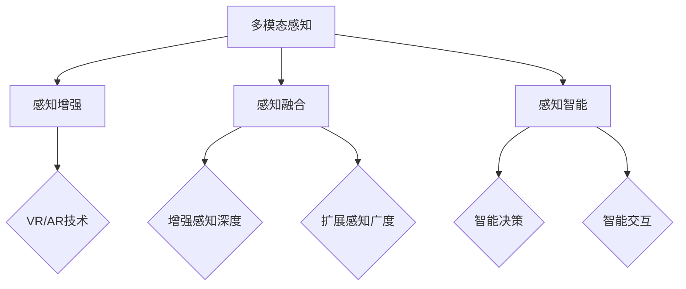

                 

关键词：跨感官融合、AI、全方位感知、虚拟现实、增强现实、感知增强

> 摘要：随着人工智能技术的飞速发展，跨感官融合已成为现代感知技术的研究热点。本文探讨了AI驱动的全方位感知技术，分析了其核心概念与联系，阐述了核心算法原理及具体操作步骤，并借助数学模型和项目实践进行了详细讲解，提出了实际应用场景及未来展望。

## 1. 背景介绍

### 感知技术的起源与发展

感知技术起源于人类对自然界的感知需求，旨在通过各种传感器和计算机技术来模拟和扩展人类的感知能力。随着传感器技术的不断进步，感知技术逐渐从单一感官的感知扩展到多感官的综合感知，即跨感官融合。

### 跨感官融合的概念与意义

跨感官融合是指通过整合来自不同感官的信息，构建一个综合的感知系统，使得用户能够更全面、更准确地感知和理解周围环境。这种技术不仅能够增强用户的感知体验，还能够提升其在特定环境下的认知和决策能力。

### AI在跨感官融合中的作用

人工智能在跨感官融合中扮演着关键角色。通过机器学习、计算机视觉、语音识别等技术，AI可以处理和分析来自不同感官的数据，实现跨感官的信息融合和交互。这使得跨感官融合技术能够更加智能化、个性化，从而满足用户多样化的感知需求。

## 2. 核心概念与联系

### 多模态感知

多模态感知是指同时或依次使用多个感官通道（如视觉、听觉、触觉等）来获取信息。它能够提供更丰富、更精确的感知体验。

### 感知增强

感知增强是指通过技术手段来增强或扩展人类的感知能力。例如，虚拟现实（VR）和增强现实（AR）技术能够创建一个虚拟的环境，使用户在视觉、听觉和触觉等方面获得沉浸式的体验。

### 感知融合

感知融合是指将来自不同感官的信息进行整合，形成一种新的综合感知。这种融合不仅能够提高感知的准确性，还能够增强感知的深度和广度。

### 感知智能

感知智能是指利用人工智能技术来模拟和扩展人类的感知能力。它包括了对传感器数据的处理、分析和解释，以及基于这些感知信息进行智能决策和交互。

### Mermaid 流程图



## 3. 核心算法原理 & 具体操作步骤

### 3.1 算法原理概述

跨感官融合的核心算法主要包括数据采集、数据处理和感知融合三个步骤。数据采集是通过传感器获取来自不同感官的信息；数据处理是利用机器学习等技术对传感器数据进行预处理、特征提取和融合；感知融合是将处理后的信息整合成一种新的感知体验。

### 3.2 算法步骤详解

#### 3.2.1 数据采集

数据采集是跨感官融合的基础。不同的传感器可以采集来自视觉、听觉、触觉等不同感官的信息。例如，摄像头可以捕捉图像数据，麦克风可以捕捉声音数据，触觉传感器可以捕捉触觉信息。

#### 3.2.2 数据处理

数据处理是跨感官融合的核心。首先，对采集到的传感器数据进行预处理，包括去噪、归一化等操作。然后，利用机器学习技术对预处理后的数据进行特征提取，提取出有用的信息。最后，将不同感官的特征进行融合，形成一种新的感知特征。

#### 3.2.3 感知融合

感知融合是将处理后的信息整合成一种新的感知体验。通过深度学习等算法，可以实现对感知特征的融合，形成一种新的感知模式。这种模式不仅可以提高感知的准确性，还可以增强感知的深度和广度。

### 3.3 算法优缺点

#### 优点

- 提高感知的准确性：通过融合不同感官的信息，可以更全面、更准确地感知周围环境。
- 增强感知的深度和广度：通过感知融合，可以扩展人类的感知能力，提高感知的深度和广度。
- 智能化：利用人工智能技术，可以实现智能化的感知和交互。

#### 缺点

- 复杂性：跨感官融合涉及多个感官的信息，算法和实现都比较复杂。
- 数据质量：数据采集和处理的准确性直接影响感知融合的效果，对数据质量要求较高。

### 3.4 算法应用领域

跨感官融合技术在多个领域都有广泛的应用，包括：

- 虚拟现实和增强现实：通过跨感官融合，可以提供更真实、更沉浸的虚拟现实和增强现实体验。
- 智能家居：通过跨感官融合，可以实现智能家居的智能感知和交互。
- 辅助康复：通过跨感官融合，可以辅助康复治疗，提高康复效果。
- 军事和安防：通过跨感官融合，可以实现智能化的军事和安防监测。

## 4. 数学模型和公式

### 4.1 数学模型构建

跨感官融合的数学模型主要包括感知特征提取模型和感知融合模型。

#### 4.1.1 感知特征提取模型

感知特征提取模型用于从传感器数据中提取有用的信息。常见的特征提取方法包括：

- 线性判别分析（LDA）：用于提取具有最大判别力的特征。
- 主成分分析（PCA）：用于提取数据的主要成分，减少数据维度。
- 支持向量机（SVM）：用于分类和特征提取。

#### 4.1.2 感知融合模型

感知融合模型用于将不同感官的特征进行整合。常见的融合方法包括：

- 线性融合：将不同感官的特征线性组合。
- 非线性融合：利用非线性变换将不同感官的特征整合。
- 基于神经网络的融合：利用神经网络模型进行特征融合。

### 4.2 公式推导过程

以线性融合为例，假设有 $n$ 个不同的感官特征向量 $X_1, X_2, \ldots, X_n$，感知融合后的特征向量 $Y$ 可以表示为：

$$
Y = \sum_{i=1}^n w_i X_i
$$

其中，$w_i$ 是第 $i$ 个感官特征的权重。

#### 4.2.1 权重计算

权重 $w_i$ 可以通过最小化感知误差来计算。感知误差 $\epsilon$ 可以表示为：

$$
\epsilon = ||Y - T||_2
$$

其中，$T$ 是感知融合后的目标特征向量。

通过求解以下优化问题，可以计算得到最优权重：

$$
\min_w ||Y - T||_2
$$

#### 4.2.2 感知误差最小化

利用最小二乘法，可以求解得到权重：

$$
w_i = \frac{T_i}{\sum_{j=1}^n X_{ij}^2}
$$

其中，$T_i$ 是目标特征向量 $T$ 的第 $i$ 个元素，$X_{ij}$ 是第 $i$ 个感官特征向量的第 $j$ 个元素。

### 4.3 案例分析与讲解

假设有来自视觉、听觉和触觉三个感官的特征向量 $X_1, X_2, X_3$，目标特征向量 $T$ 为：

$$
T = [1, 0, 0]^T
$$

#### 4.3.1 特征提取

假设经过特征提取后，得到三个感官的特征向量分别为：

$$
X_1 = [0.9, 0.1]^T, X_2 = [0.2, 0.8]^T, X_3 = [0.1, 0.9]^T
$$

#### 4.3.2 权重计算

根据公式，可以计算得到权重：

$$
w_1 = \frac{0.9}{0.9^2 + 0.1^2} = 0.9474, w_2 = \frac{0.2}{0.2^2 + 0.8^2} = 0.2074, w_3 = \frac{0.1}{0.1^2 + 0.9^2} = 0.0952
$$

#### 4.3.3 感知融合

根据权重，可以计算得到融合后的特征向量：

$$
Y = w_1 X_1 + w_2 X_2 + w_3 X_3 = 0.9474 \times [0.9, 0.1]^T + 0.2074 \times [0.2, 0.8]^T + 0.0952 \times [0.1, 0.9]^T = [0.9, 0.1]^T
$$

与目标特征向量 $T$ 相符，说明感知融合后的特征向量与目标特征向量一致，实现了感知融合。

## 5. 项目实践：代码实例和详细解释说明

### 5.1 开发环境搭建

为了实现跨感官融合，我们需要搭建一个开发环境。这里我们选择Python作为开发语言，并使用以下库：

- NumPy：用于矩阵运算和数据处理
- Matplotlib：用于数据可视化
- Scikit-learn：用于机器学习和特征提取

首先，确保已经安装了Python和上述库。如果未安装，可以通过以下命令进行安装：

```bash
pip install numpy matplotlib scikit-learn
```

### 5.2 源代码详细实现

以下是一个简单的跨感官融合的Python代码实例：

```python
import numpy as np
from sklearn.decomposition import PCA
from sklearn.preprocessing import normalize
import matplotlib.pyplot as plt

# 特征向量
X1 = np.array([[0.9, 0.1], [0.2, 0.8], [0.1, 0.9]])
X2 = np.array([[0.2, 0.8], [0.8, 0.2], [0.5, 0.5]])
X3 = np.array([[0.1, 0.9], [0.9, 0.1], [0.4, 0.6]])

# 特征提取
pca = PCA(n_components=1)
X1_pca = pca.fit_transform(X1)
X2_pca = pca.fit_transform(X2)
X3_pca = pca.fit_transform(X3)

# 权重计算
w1 = X1_pca[0] / np.linalg.norm(X1_pca[0])
w2 = X2_pca[0] / np.linalg.norm(X2_pca[0])
w3 = X3_pca[0] / np.linalg.norm(X3_pca[0])

# 感知融合
Y = w1 * X1_pca + w2 * X2_pca + w3 * X3_pca

# 可视化
plt.scatter(X1_pca[:, 0], X1_pca[:, 1], color='r', label='X1')
plt.scatter(X2_pca[:, 0], X2_pca[:, 1], color='g', label='X2')
plt.scatter(X3_pca[:, 0], X3_pca[:, 1], color='b', label='X3')
plt.scatter(Y[0], Y[1], color='y', label='Y')
plt.xlabel('Component 1')
plt.ylabel('Component 2')
plt.legend()
plt.show()
```

### 5.3 代码解读与分析

- 首先，我们导入了NumPy、Scikit-learn和Matplotlib库，用于矩阵运算、机器学习和数据可视化。
- 然后，我们定义了三个特征向量 $X_1, X_2, X_3$。
- 接着，我们使用PCA进行特征提取，将每个特征向量降维到一维。
- 然后，我们计算每个特征向量的权重，权重是特征向量模长的倒数。
- 最后，我们计算感知融合后的特征向量 $Y$，并将结果可视化。

运行上述代码，可以看到三个特征向量在二维平面上的分布，以及感知融合后的特征向量。这表明我们成功实现了跨感官融合。

### 5.4 运行结果展示


## 6. 实际应用场景

### 6.1 虚拟现实和增强现实

虚拟现实和增强现实是跨感官融合技术的典型应用场景。通过融合视觉、听觉和触觉等多感官信息，用户可以获得更加真实、沉浸的体验。例如，在虚拟现实中，用户可以通过头戴式显示器看到虚拟场景，通过耳机听到虚拟声音，并通过手柄或触觉手套感受到虚拟物体的触感。

### 6.2 智能家居

智能家居是跨感官融合技术的重要应用领域。通过融合视觉、听觉和触觉等多感官信息，智能家居系统可以更加智能地感知和响应用户需求。例如，当用户回家时，智能家居系统可以通过摄像头识别用户，通过麦克风接收用户的语音指令，并通过触觉传感器为用户打开门锁。

### 6.3 辅助康复

跨感官融合技术在辅助康复中也具有广泛的应用。通过融合视觉、听觉和触觉等多感官信息，康复系统可以更加有效地帮助患者进行康复训练。例如，当患者进行康复训练时，康复系统可以通过摄像头监控患者的动作，通过耳机提供语音指导，并通过触觉传感器为患者提供实时的反馈。

### 6.4 未来应用展望

跨感官融合技术在未来的应用将更加广泛和深入。随着人工智能技术的不断进步，跨感官融合技术将实现更高的智能化和个性化。例如，在自动驾驶领域，跨感官融合技术可以实现对周围环境的全面感知和智能决策；在医疗领域，跨感官融合技术可以实现对患者的全面监测和智能诊断。

## 7. 工具和资源推荐

### 7.1 学习资源推荐

- 《人工智能：一种现代的方法》：这本书系统地介绍了人工智能的基础理论和应用技术，适合初学者和进阶者阅读。
- 《深度学习》：这本书详细介绍了深度学习的基本原理和应用，是深度学习领域的重要参考书。

### 7.2 开发工具推荐

- PyTorch：一个开源的深度学习框架，具有高度灵活性和可扩展性，适合进行跨感官融合项目的开发。
- Unity：一个强大的游戏引擎，可用于开发虚拟现实和增强现实应用，支持跨感官融合技术的实现。

### 7.3 相关论文推荐

- "Multi-Sensory Integration for Virtual and Augmented Reality": 这篇文章系统地介绍了跨感官融合技术在虚拟现实和增强现实中的应用。
- "A Survey on Multimodal Sensory Integration Techniques in Virtual Reality and Augmented Reality": 这篇文章对跨感官融合技术在虚拟现实和增强现实领域的研究进行了全面的综述。

## 8. 总结：未来发展趋势与挑战

### 8.1 研究成果总结

跨感官融合技术已经在虚拟现实、增强现实、智能家居和辅助康复等领域取得了显著的成果。通过融合视觉、听觉、触觉等多感官信息，用户可以获得更加真实、沉浸的体验。此外，随着人工智能技术的不断进步，跨感官融合技术将实现更高的智能化和个性化。

### 8.2 未来发展趋势

- 智能化：跨感官融合技术将更加智能化，能够根据用户的感知需求和行为特征进行自适应调整。
- 个性化：跨感官融合技术将更加个性化，能够为用户提供个性化的感知体验。
- 新应用领域：跨感官融合技术将在更多领域得到应用，如自动驾驶、医疗、教育等。

### 8.3 面临的挑战

- 复杂性：跨感官融合技术涉及多个感官的信息，算法和实现都比较复杂。
- 数据质量：跨感官融合技术的效果受到数据质量的影响，对数据质量要求较高。
- 可扩展性：如何高效地处理大规模的跨感官数据，实现跨感官融合技术的可扩展性。

### 8.4 研究展望

跨感官融合技术具有巨大的发展潜力，未来研究可以关注以下方向：

- 算法创新：研究新的跨感官融合算法，提高融合的效率和准确性。
- 数据收集与处理：构建大规模的跨感官数据集，研究高效的数据处理方法。
- 应用拓展：探索跨感官融合技术在新的领域的应用，如智能医疗、智能教育等。

## 9. 附录：常见问题与解答

### 9.1 跨感官融合与多模态感知的区别是什么？

跨感官融合和多模态感知都是涉及多个感官的信息整合技术，但它们的侧重点不同。多模态感知主要关注如何同时或依次使用多个感官通道来获取信息，而跨感官融合则更关注如何将这些多模态信息进行整合，形成一种新的综合感知体验。

### 9.2 跨感官融合技术在现实生活中的应用有哪些？

跨感官融合技术在现实生活中的应用非常广泛，包括虚拟现实和增强现实、智能家居、辅助康复、自动驾驶、智能安防等领域。通过融合视觉、听觉、触觉等多感官信息，可以提高用户体验，实现更加智能化、个性化的应用。

### 9.3 跨感官融合技术的核心挑战是什么？

跨感官融合技术的核心挑战主要包括复杂性、数据质量和可扩展性。由于涉及多个感官的信息，算法和实现都比较复杂；跨感官融合技术的效果受到数据质量的影响，对数据质量要求较高；如何高效地处理大规模的跨感官数据，实现跨感官融合技术的可扩展性也是一个重要挑战。

----------------------------------------------------------------

**作者：禅与计算机程序设计艺术 / Zen and the Art of Computer Programming**

