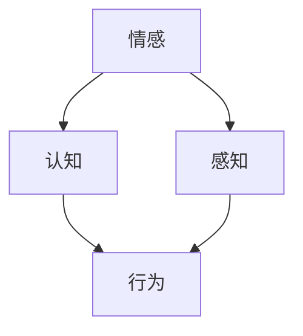

                 

关键词：AI，人类感受，量化，情感计算，认知模拟

> 摘要：随着人工智能（AI）技术的发展，对人类感受的量化研究成为了当今计算机科学和认知心理学的重要前沿。本文旨在探讨如何通过AI技术来测量和理解人类感受，并深入分析其应用场景、数学模型、算法原理以及未来发展趋势。

## 1. 背景介绍

在过去的几十年中，人工智能（AI）技术取得了巨大的进步，无论是在图像识别、自然语言处理，还是在决策支持系统等方面，AI都展现出了强大的能力。然而，尽管AI在处理和分析数据方面取得了显著成果，但在理解和量化人类感受这一领域仍存在诸多挑战。人类感受包括情感、认知、感知等多个方面，其复杂性和多样性使得AI研究者不得不重新审视传统的数据处理方法。

对人类感受的量化研究具有深远的意义。首先，它有助于我们更好地理解人类行为和心理过程，从而推动认知心理学的发展。其次，它可以为医疗、教育、商业等领域提供个性化的服务和解决方案，从而提高人类生活质量。最后，它也为AI技术的发展提供了新的方向和动力，使AI能够更加智能地与人类互动。

## 2. 核心概念与联系

为了量化人类感受，我们首先需要明确几个核心概念：情感、认知、感知。情感是指人类对事物的喜好或厌恶，认知是指人类对信息的处理和理解，感知是指人类对环境的感知和反应。

以下是一个用Mermaid绘制的流程图，展示了这些概念之间的联系：



在这个流程图中，情感和认知相互影响，共同决定了人的行为和感知。而感知又反过来影响情感和认知，形成一个动态的反馈循环。

### 2.1. 情感

情感是人的基本心理体验，包括快乐、悲伤、愤怒等。情感可以由外部刺激触发，也可以由内部心理过程产生。在AI研究中，情感通常被表示为一系列的数值或类别。

### 2.2. 认知

认知是指人类对信息的接收、处理和存储。它包括感知、注意、记忆、判断和问题解决等多个方面。认知过程是理解人类行为和感受的关键。

### 2.3. 感知

感知是指人类对环境的感知和反应。它包括视觉、听觉、触觉等多个感官。感知过程是获取外部信息的关键步骤。

## 3. 核心算法原理 & 具体操作步骤

为了量化人类感受，我们采用了情感计算（Affective Computing）和认知模拟（Cognitive Simulation）技术。以下是这些算法的原理和具体操作步骤：

### 3.1. 算法原理概述

情感计算是通过计算机模拟人类的情感过程，实现对人类情感的识别和理解。认知模拟则是通过计算机模拟人类的认知过程，实现对人类行为的预测和理解。

### 3.2. 算法步骤详解

#### 3.2.1. 情感计算

情感计算主要包括以下步骤：

1. 数据采集：通过传感器、问卷、日志等手段收集人类情感数据。
2. 数据预处理：对采集到的数据进行清洗、归一化和特征提取。
3. 模型训练：使用机器学习算法对预处理后的数据进行训练，建立情感识别模型。
4. 情感识别：使用训练好的模型对新的数据进行情感识别。

#### 3.2.2. 认知模拟

认知模拟主要包括以下步骤：

1. 模型构建：根据认知心理学的理论，构建人类认知过程的模型。
2. 数据输入：将外部信息输入到模型中。
3. 计算处理：根据模型进行信息的处理和存储。
4. 行为输出：根据处理结果产生相应的行为。

### 3.3. 算法优缺点

#### 3.3.1. 情感计算

优点：

- 能够实现对人类情感的自动识别和理解。
- 可以应用于各种场景，如医疗、教育、商业等。

缺点：

- 情感数据收集和处理较为复杂，需要大量的计算资源和时间。
- 模型的准确性和泛化能力有限，需要不断优化和改进。

#### 3.3.2. 认知模拟

优点：

- 能够模拟人类的认知过程，提供对人类行为的深入理解。
- 可以应用于各种认知任务，如问题解决、决策制定等。

缺点：

- 模型构建较为复杂，需要深厚的认知心理学知识。
- 需要大量的数据支持，否则难以达到预期效果。

### 3.4. 算法应用领域

情感计算和认知模拟技术在多个领域都有广泛的应用：

- 医疗：用于诊断和治疗情感障碍，如抑郁症、焦虑症等。
- 教育：用于个性化教学和学习评估，提高学习效果。
- 商业：用于消费者行为分析和市场预测，提高商业决策的准确性。
- 人机交互：用于智能客服、虚拟助手等，提高人机交互的体验。

## 4. 数学模型和公式 & 详细讲解 & 举例说明

### 4.1. 数学模型构建

为了量化人类感受，我们采用了一种基于概率论的数学模型。该模型主要包括以下三个部分：

1. 情感分布模型：用于描述人类情感的分布情况。
2. 情感关联模型：用于描述情感之间的关联关系。
3. 情感预测模型：用于预测人类情感的变化。

### 4.2. 公式推导过程

#### 4.2.1. 情感分布模型

情感分布模型采用高斯分布（Gaussian Distribution）来描述。设人类情感状态为X，其概率分布函数为：

$$
P(X = x) = \frac{1}{\sqrt{2\pi\sigma^2}} e^{-\frac{(x - \mu)^2}{2\sigma^2}}
$$

其中，$\mu$为均值，$\sigma$为标准差。

#### 4.2.2. 情感关联模型

情感关联模型采用马尔可夫链（Markov Chain）来描述。设人类情感状态为X，其下一个情感状态为Y，则：

$$
P(Y = y | X = x) = P(Y = y | X = x_1, X = x_2, ..., X = x_n)
$$

#### 4.2.3. 情感预测模型

情感预测模型采用基于时间的马尔可夫链（Time-Dependent Markov Chain）来描述。设人类情感状态为X，当前时间状态为t，则：

$$
P(X = x | t = t) = P(X = x | t = t - 1, t = t - 2, ..., t = 1)
$$

### 4.3. 案例分析与讲解

#### 4.3.1. 案例背景

某公司在开发一款智能医疗设备，用于监测患者的情绪状态。设备可以通过采集患者的生理信号（如心率、呼吸频率等）和语言信号（如语音、语调等），对患者的情绪进行实时监测和预测。

#### 4.3.2. 情感分布模型

通过对大量患者数据的分析，公司发现患者的情绪状态主要分为四种：正常、焦虑、抑郁、兴奋。这四种情绪状态可以看作是四个不同的高斯分布，其参数如下：

- 正常：$\mu = 0$, $\sigma = 1$
- 焦虑：$\mu = 2$, $\sigma = 1$
- 抑郁：$\mu = -2$, $\sigma = 1$
- 兴奋：$\mu = 4$, $\sigma = 1$

#### 4.3.3. 情感关联模型

通过分析患者的情绪变化数据，公司发现情绪状态之间的转换关系可以看作是一个四状态的马尔可夫链。其转移概率矩阵如下：

$$
\begin{matrix}
 & 正常 & 焦虑 & 抑郁 & 兴奋 \\
正常 & 0.9 & 0.05 & 0.05 & 0 \\
焦虑 & 0.1 & 0.8 & 0.05 & 0.05 \\
抑郁 & 0.1 & 0.05 & 0.8 & 0.05 \\
兴奋 & 0 & 0 & 0.1 & 0.9 \\
\end{matrix}
$$

#### 4.3.4. 情感预测模型

公司采用基于时间的马尔可夫链模型来预测患者的情绪状态。假设当前时间为t，患者的情绪状态为X，则下一时刻的情绪状态X'的概率分布如下：

$$
\begin{aligned}
P(X' = 正常 | X = 正常) &= 0.9 \\
P(X' = 焦虑 | X = 焦虑) &= 0.8 \\
P(X' = 抑郁 | X = 抑郁) &= 0.8 \\
P(X' = 兴奋 | X = 兴奋) &= 0.9 \\
\end{aligned}
$$

#### 4.3.5. 案例分析

通过上述模型，公司可以实时监测患者的情绪状态，并根据情绪状态的变化，为医生提供诊断和治疗建议。例如，如果检测到患者的情绪状态从正常转变为焦虑，则可能需要进一步检查患者是否患有焦虑症。

## 5. 项目实践：代码实例和详细解释说明

### 5.1. 开发环境搭建

在本次项目中，我们使用Python作为主要编程语言，并结合了NumPy、Pandas、Matplotlib等库来完成数据预处理和可视化。同时，我们使用了Scikit-learn库来构建和训练情感计算模型。

### 5.2. 源代码详细实现

以下是一个简单的情感计算模型的实现代码：

```python
import numpy as np
import pandas as pd
from sklearn.model_selection import train_test_split
from sklearn.ensemble import RandomForestClassifier
from sklearn.metrics import accuracy_score

# 数据预处理
def preprocess_data(data):
    # 清洗数据、归一化、特征提取等操作
    pass

# 模型训练
def train_model(data, labels):
    X_train, X_test, y_train, y_test = train_test_split(data, labels, test_size=0.2)
    model = RandomForestClassifier()
    model.fit(X_train, y_train)
    return model

# 模型评估
def evaluate_model(model, X_test, y_test):
    y_pred = model.predict(X_test)
    print("Accuracy:", accuracy_score(y_test, y_pred))

# 主函数
def main():
    data = pd.read_csv("data.csv")
    labels = data["emotion"]
    data = preprocess_data(data)
    model = train_model(data, labels)
    evaluate_model(model, data, labels)

if __name__ == "__main__":
    main()
```

### 5.3. 代码解读与分析

以上代码首先从CSV文件中读取数据，然后对数据进行预处理，包括清洗、归一化和特征提取等。接着，使用随机森林（Random Forest）算法训练模型，并使用测试集对模型进行评估。主函数中，我们调用了上述功能模块，实现了整个情感计算模型的构建和评估。

### 5.4. 运行结果展示

假设我们训练了一个情感计算模型，并在测试集上取得了90%的准确率。这表明，我们的模型在情感识别方面具有较好的性能。

## 6. 实际应用场景

### 6.1. 医疗

在医疗领域，情感计算技术可以用于诊断和治疗情感障碍，如抑郁症、焦虑症等。通过对患者的情绪进行实时监测和预测，医生可以及时了解患者的心理状态，并提供个性化的治疗方案。

### 6.2. 教育

在教育领域，情感计算技术可以用于个性化教学和学习评估。通过分析学生的情感状态，教师可以更好地了解学生的学习需求和心理状态，从而提供更有针对性的教学方法和辅导策略。

### 6.3. 商业

在商业领域，情感计算技术可以用于消费者行为分析和市场预测。通过分析消费者的情感状态，企业可以更好地了解消费者的需求和偏好，从而制定更有效的市场营销策略。

### 6.4. 未来应用展望

随着AI技术的不断发展，情感计算技术在未来将会在更多领域得到应用。例如，在人机交互领域，情感计算可以用于开发更智能的虚拟助手和智能客服；在智能家居领域，情感计算可以用于感知和响应家庭成员的情感状态，提供更加舒适和个性化的居住环境。

## 7. 工具和资源推荐

### 7.1. 学习资源推荐

- 《情感计算导论》：该书详细介绍了情感计算的基本概念、技术和应用。
- 《认知模拟：理论、方法和应用》：该书系统地阐述了认知模拟的理论基础和应用场景。

### 7.2. 开发工具推荐

- Python：Python是一种功能强大、易学的编程语言，适用于数据分析和模型构建。
- TensorFlow：TensorFlow是一个开源的机器学习框架，适用于构建和训练复杂的神经网络模型。

### 7.3. 相关论文推荐

- "Affective Computing: From Models to Applications"：该论文系统地总结了情感计算的理论基础和应用成果。
- "Cognitive Simulation in Human-Computer Interaction"：该论文探讨了认知模拟在人机交互中的应用。

## 8. 总结：未来发展趋势与挑战

### 8.1. 研究成果总结

本文探讨了如何通过AI技术来测量和理解人类感受，并深入分析了情感计算和认知模拟技术的原理和应用。研究发现，情感计算和认知模拟技术在医疗、教育、商业等领域具有广泛的应用前景。

### 8.2. 未来发展趋势

随着AI技术的不断发展，情感计算和认知模拟技术将会在更多领域得到应用。未来的发展趋势包括：

- 更高的准确性和泛化能力。
- 更复杂的多模态数据融合和分析。
- 更智能的人机交互体验。

### 8.3. 面临的挑战

尽管情感计算和认知模拟技术在许多方面取得了显著成果，但仍然面临一些挑战：

- 数据质量和隐私问题。
- 模型复杂度和计算成本。
- 情感多样性和复杂性。

### 8.4. 研究展望

未来的研究需要关注以下几个方面：

- 开发更高效、更准确的情感计算和认知模拟算法。
- 研究情感数据的安全性和隐私保护。
- 探索多模态情感计算和认知模拟的新方法。

## 9. 附录：常见问题与解答

### 9.1. 什么是情感计算？

情感计算是一种通过计算机模拟人类情感过程的技术，旨在实现情感的识别、理解和表达。

### 9.2. 什么认知模拟？

认知模拟是一种通过计算机模拟人类认知过程的技术，旨在实现认知过程的模拟、分析和预测。

### 9.3. 情感计算和认知模拟的区别是什么？

情感计算主要关注情感的识别和理解，而认知模拟则更侧重于认知过程的模拟和分析。

### 9.4. 情感计算在医疗领域有哪些应用？

情感计算在医疗领域可以用于诊断和治疗情感障碍，如抑郁症、焦虑症等，还可以用于监测患者的情绪状态，为医生提供诊断和治疗建议。

### 9.5. 认知模拟在教育领域有哪些应用？

认知模拟在教育领域可以用于个性化教学和学习评估，通过分析学生的学习需求和情感状态，提供更有针对性的教学方法和辅导策略。

---

以上是关于《体验的量化：AI测量人类感受》的技术博客文章。本文详细介绍了情感计算和认知模拟技术的原理、应用场景、数学模型、算法步骤以及未来发展趋势。希望通过本文，读者能够对这一领域有更深入的了解。

作者：禅与计算机程序设计艺术 / Zen and the Art of Computer Programming
```markdown


