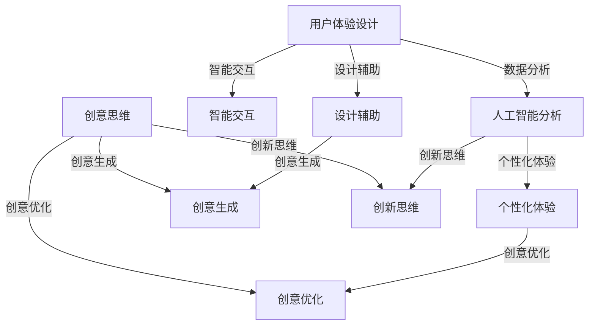

                 

关键词：AI，体验设计，跨界合作，创意，用户体验，人工智能技术，人机交互

> 摘要：随着人工智能技术的迅猛发展，体验设计领域迎来了新的机遇与挑战。本文探讨了AI与人类创意在体验设计中的跨界合作，分析AI技术的应用及其对用户体验的影响，提出了未来发展的趋势和挑战。

## 1. 背景介绍

随着互联网和移动互联网的普及，用户体验（UX）设计成为了产品成功的关键因素。用户体验设计关注如何通过设计提升用户的满意度、参与度和忠诚度，而不仅仅是功能的实现。在传统的设计流程中，人类设计师发挥着核心作用，通过用户研究、用户访谈、原型设计和用户测试等环节，不断迭代优化设计。

近年来，人工智能（AI）技术的快速发展为体验设计带来了新的契机。AI能够处理大量数据，从中提取有价值的信息，辅助设计师进行设计决策。例如，通过自然语言处理（NLP）技术，AI可以分析用户评论和反馈，识别用户的需求和偏好；通过计算机视觉技术，AI可以识别用户的情绪和行为模式，为个性化体验设计提供支持。

本文将探讨AI与人类创意在体验设计中的跨界合作，分析AI技术的应用及其对用户体验的影响，并提出未来发展的趋势和挑战。

### 1.1 AI在体验设计中的应用

AI技术在体验设计中的应用主要包括以下几个方面：

1. **用户研究分析**：AI可以帮助设计师分析用户行为数据，识别用户的使用模式和偏好。例如，通过机器学习算法分析用户点击、滑动和停留时间等行为数据，设计师可以更好地理解用户的需求和行为习惯。

2. **个性化推荐**：基于用户数据和偏好分析，AI可以为用户提供个性化的推荐服务。例如，电商平台可以根据用户的购物历史和浏览行为，推荐相关商品，提高用户的购物体验。

3. **智能交互设计**：AI驱动的聊天机器人和语音助手已经成为许多应用的核心功能。通过自然语言处理和语音识别技术，智能交互设计可以提供更加自然、流畅的用户交互体验。

4. **设计辅助工具**：AI算法可以辅助设计师生成设计原型和视觉效果，节省设计时间和成本。例如，AI可以根据用户需求和风格偏好，自动生成不同的设计选项，设计师可以根据这些选项进行进一步的优化。

### 1.2 人类创意在体验设计中的重要性

尽管AI技术在体验设计中发挥着重要作用，但人类创意仍然不可或缺。用户体验设计是一个复杂的过程，涉及到用户需求、情感、文化和心理等多个方面。以下是人类创意在体验设计中的重要性：

1. **情感共鸣**：人类设计师能够通过情感共鸣，理解用户的真实需求和情感。例如，在为患有特定疾病的患者设计医疗产品时，设计师需要深入了解患者的心理和情感状态，以便设计出真正符合患者需求的产品。

2. **文化适应性**：不同文化背景的用户对产品和服务有不同的期望和需求。人类设计师可以根据不同文化的特点，设计出更具适应性和包容性的产品。

3. **创新思维**：用户体验设计需要创新思维和创意。人类设计师能够通过独特的视角和创意，为用户提供新颖、有趣和有价值的体验。

4. **设计决策**：虽然AI可以提供数据分析和建议，但最终的设计决策仍然需要人类设计师的判断和决策。设计师需要综合考虑多个因素，包括用户需求、技术可行性、商业目标和品牌价值等。

### 1.3 AI与人类创意的跨界合作

AI与人类创意的跨界合作可以带来以下优势：

1. **数据驱动的设计**：AI可以处理大量数据，为设计师提供更全面、准确的信息，帮助设计师做出更好的设计决策。

2. **快速迭代**：AI可以快速生成多个设计选项，设计师可以在较短的时间内进行多次迭代，提高设计效率。

3. **个性化体验**：AI可以根据用户的偏好和行为，提供个性化的体验设计，提高用户满意度。

4. **创新可能性**：AI和人类创意的结合可以激发新的设计灵感，推动用户体验的创新。

总之，AI与人类创意的跨界合作为体验设计带来了新的机遇和挑战。在未来的体验设计过程中，人类设计师和AI技术将发挥各自的优势，共同创造更加优秀、有价值的用户体验。

## 2. 核心概念与联系

在深入探讨AI与人类创意在体验设计中的跨界合作之前，我们需要明确几个核心概念，并展示它们之间的联系。

### 2.1 用户体验（UX）设计

用户体验设计（UX Design）是一种设计方法，旨在创建对用户而言有意义、有用且愉快的互动。UX设计关注用户的需求、动机和行为，并通过一系列设计活动，如用户研究、信息架构、交互设计、用户测试等，来优化产品的可用性、可用性和用户体验。

### 2.2 人工智能（AI）

人工智能是一种模拟人类智能的技术，它通过机器学习、深度学习、自然语言处理等算法，使计算机系统能够自动地执行特定任务，如图像识别、语音识别、决策支持等。

### 2.3 创意思维

创意思维是一种创造新想法和解决方案的过程，它涉及到创造性的思考、联想和创新。创意思维是人类设计师的核心能力，它能够帮助设计师在体验设计中找到独特的解决方案。

### 2.4 AI与UX设计的联系

AI与UX设计之间的联系主要体现在以下几个方面：

1. **数据分析**：AI技术能够处理和分析大量用户数据，为UX设计提供洞察和指导。例如，通过用户行为分析，AI可以帮助设计师识别用户痛点和需求。

2. **个性化体验**：AI可以根据用户的行为和偏好，提供个性化的用户体验。例如，推荐系统可以根据用户的浏览和购买历史，推荐相关的产品和服务。

3. **智能交互**：AI驱动的聊天机器人和语音助手可以为用户提供智能交互体验，提高产品的可用性和用户满意度。

4. **设计辅助**：AI算法可以辅助设计师生成设计原型和视觉效果，节省设计时间和成本。

### 2.5 创意与AI的融合

创意与AI的融合体现在以下几个方面：

1. **创意生成**：AI可以帮助设计师生成新的创意和设计方案。例如，通过生成对抗网络（GAN），AI可以生成各种风格的艺术作品和设计元素。

2. **创意优化**：AI可以分析用户反馈和数据分析结果，帮助设计师优化创意和设计。

3. **创新思维**：AI和创意思维的结合可以激发新的设计灵感，推动用户体验的创新。

### 2.6 核心概念架构的 Mermaid 流程图

以下是一个简化的 Mermaid 流程图，展示了用户体验设计、人工智能和创意思维之间的核心联系：



通过这个流程图，我们可以看到AI技术在用户体验设计和创意思维中的关键作用，以及这些概念之间的相互影响。

## 3. 核心算法原理 & 具体操作步骤

### 3.1 算法原理概述

在体验设计中，AI技术的核心算法原理主要包括以下三个方面：

1. **机器学习**：通过从数据中学习模式和规律，机器学习算法可以帮助设计师预测用户行为、生成个性化推荐等。

2. **深度学习**：深度学习是一种特殊的机器学习技术，通过多层神经网络模型，深度学习算法可以处理大量复杂数据，并在图像识别、语音识别等领域取得显著成果。

3. **自然语言处理（NLP）**：NLP技术使计算机能够理解、处理和生成人类语言，为智能交互和内容生成提供支持。

### 3.2 算法步骤详解

在体验设计中，AI算法的具体操作步骤可以分为以下几个阶段：

1. **数据收集与处理**：
   - 数据收集：通过用户行为日志、问卷调查、用户访谈等方式，收集用户数据。
   - 数据处理：清洗、整合和预处理数据，为后续分析做准备。

2. **特征提取**：
   - 特征提取：从原始数据中提取对用户体验设计有意义的特征，如点击次数、停留时间、用户评价等。

3. **模型训练**：
   - 选择合适的机器学习模型，如决策树、支持向量机、神经网络等。
   - 使用特征数据对模型进行训练，优化模型参数。

4. **模型评估与优化**：
   - 使用验证数据集评估模型性能，如准确率、召回率、F1分数等。
   - 根据评估结果调整模型参数，优化模型性能。

5. **应用与迭代**：
   - 将训练好的模型应用于实际体验设计场景，如个性化推荐、智能交互等。
   - 根据用户反馈和数据指标，持续优化设计。

### 3.3 算法优缺点

1. **优点**：
   - **高效性**：AI算法能够快速处理大量数据，提供实时反馈和优化建议。
   - **准确性**：通过训练和优化，AI算法可以准确预测用户行为和需求。
   - **个性化**：AI可以生成个性化的体验设计，提高用户满意度。

2. **缺点**：
   - **数据依赖性**：AI算法的性能很大程度上依赖于数据的质量和数量，数据不足或质量差会影响算法效果。
   - **隐私问题**：收集和处理用户数据可能引发隐私问题，需要严格保护用户隐私。
   - **透明度**：AI算法的决策过程往往是不透明的，难以解释，可能影响用户信任。

### 3.4 算法应用领域

AI算法在体验设计中的应用领域非常广泛，以下是一些典型应用场景：

1. **个性化推荐系统**：通过分析用户行为数据，AI可以推荐符合用户兴趣的产品和服务。

2. **智能交互设计**：聊天机器人和语音助手可以提供自然、流畅的交互体验，提高用户满意度。

3. **用户行为分析**：AI可以帮助设计师了解用户行为模式，优化产品设计。

4. **内容生成与优化**：AI可以自动生成文案、图片、视频等内容，提高内容质量和传播效果。

5. **个性化营销**：AI可以根据用户数据，实现精准营销，提高营销效果。

## 4. 数学模型和公式 & 详细讲解 & 举例说明

### 4.1 数学模型构建

在体验设计中，AI算法的核心在于建立数学模型，以处理和分析大量数据。以下是一个简化的数学模型构建过程：

1. **数据收集与预处理**：收集用户行为数据，如点击次数、停留时间、用户评价等，并进行数据清洗和预处理。

2. **特征提取**：从原始数据中提取对用户体验有意义的特征，如用户活跃度、兴趣标签等。

3. **选择模型**：根据问题类型和数据特点，选择合适的机器学习模型，如线性回归、决策树、神经网络等。

4. **模型训练与优化**：使用特征数据对模型进行训练，通过交叉验证和网格搜索等方法，优化模型参数。

5. **模型评估与迭代**：使用验证数据集评估模型性能，根据评估结果调整模型，实现持续优化。

### 4.2 公式推导过程

以下是一个简单的线性回归模型的公式推导过程：

1. **线性回归模型假设**：假设用户行为数据 $Y$ 与特征 $X$ 之间存在线性关系，即 $Y = \beta_0 + \beta_1 X + \epsilon$，其中 $\beta_0$ 和 $\beta_1$ 是模型的参数，$\epsilon$ 是误差项。

2. **最小化损失函数**：为了找到最优的参数，我们使用最小二乘法（Least Squares Method）来最小化损失函数，即 $J(\theta) = \frac{1}{2m} \sum_{i=1}^{m} (h_\theta(x^{(i)}) - y^{(i)})^2$，其中 $h_\theta(x) = \theta_0 + \theta_1 x$ 是模型的预测函数，$m$ 是数据点的数量。

3. **求导与优化**：对损失函数 $J(\theta)$ 求导，并令其导数为零，得到 $\frac{\partial J(\theta)}{\partial \theta_0} = 0$ 和 $\frac{\partial J(\theta)}{\partial \theta_1} = 0$，进而求解出参数 $\theta_0$ 和 $\theta_1$ 的最优值。

### 4.3 案例分析与讲解

以下是一个简单的案例，说明如何使用线性回归模型预测用户的活跃度。

**案例**：假设我们有一个用户数据集，其中包含用户的活跃度（目标变量 $Y$）和用户的每日使用时长（特征 $X$）。我们的目标是建立一个线性回归模型，预测新用户的活跃度。

1. **数据收集与预处理**：收集用户数据，包括每日使用时长和活跃度。对数据进行清洗和预处理，去除缺失值和异常值。

2. **特征提取**：将每日使用时长作为特征 $X$，活跃度作为目标变量 $Y$。

3. **模型训练与优化**：使用训练数据，通过最小二乘法训练线性回归模型，优化参数 $\theta_0$ 和 $\theta_1$。

4. **模型评估与迭代**：使用验证数据集评估模型性能，根据评估结果调整模型参数，实现持续优化。

5. **预测与解释**：使用训练好的模型，对新用户的活跃度进行预测。例如，对于某个新用户，其每日使用时长为 3 小时，预测的活跃度为 $h_\theta(x) = \theta_0 + \theta_1 \times 3$。通过解释模型的参数，我们可以理解每日使用时长对活跃度的影响。

## 5. 项目实践：代码实例和详细解释说明

### 5.1 开发环境搭建

在开始项目实践之前，我们需要搭建一个合适的开发环境。以下是所需的工具和库：

1. **Python**：Python是一种广泛使用的编程语言，特别适合数据处理和机器学习应用。确保您的计算机上已安装Python，推荐使用Python 3.8或更高版本。

2. **Jupyter Notebook**：Jupyter Notebook是一个交互式计算环境，便于编写和运行Python代码。可以从官方网站（https://jupyter.org）下载并安装。

3. **Pandas**：Pandas是一个强大的数据处理库，提供数据清洗、转换和分析功能。安装命令为：`pip install pandas`。

4. **NumPy**：NumPy是一个基础的科学计算库，提供高效的数组操作和数学函数。安装命令为：`pip install numpy`。

5. **Scikit-learn**：Scikit-learn是一个流行的机器学习库，包含多种机器学习算法和工具。安装命令为：`pip install scikit-learn`。

### 5.2 源代码详细实现

以下是一个简单的线性回归模型的实现示例，用于预测用户的活跃度。

```python
import pandas as pd
import numpy as np
from sklearn.model_selection import train_test_split
from sklearn.linear_model import LinearRegression
from sklearn.metrics import mean_squared_error

# 1. 数据收集与预处理
data = pd.read_csv('user_data.csv')  # 假设数据文件名为user_data.csv
data.dropna(inplace=True)  # 去除缺失值

# 2. 特征提取
X = data[['daily_usage']]  # 特征：每日使用时长
Y = data['activity']  # 目标变量：活跃度

# 3. 模型训练与优化
X_train, X_test, Y_train, Y_test = train_test_split(X, Y, test_size=0.2, random_state=42)
model = LinearRegression()
model.fit(X_train, Y_train)

# 4. 模型评估与迭代
Y_pred = model.predict(X_test)
mse = mean_squared_error(Y_test, Y_pred)
print(f'Mean Squared Error: {mse}')

# 5. 预测与解释
new_user_usage = np.array([[3]])  # 新用户每日使用时长为3小时
predicted_activity = model.predict(new_user_usage)
print(f'Predicted Activity: {predicted_activity[0]}')
```

### 5.3 代码解读与分析

1. **数据收集与预处理**：
   - 使用`pandas`库读取CSV数据文件，并去除缺失值，确保数据质量。

2. **特征提取**：
   - 将每日使用时长作为特征`X`，活跃度作为目标变量`Y`。

3. **模型训练与优化**：
   - 使用`train_test_split`函数将数据集分为训练集和测试集，随机比例为80%训练集和20%测试集。
   - 使用`LinearRegression`类创建线性回归模型，并使用`fit`方法训练模型。

4. **模型评估与迭代**：
   - 使用`predict`方法对测试集进行预测，计算均方误差（MSE），评估模型性能。

5. **预测与解释**：
   - 对新用户的数据进行预测，输出预测的活跃度。通过解释模型的参数，可以了解每日使用时长对活跃度的影响。

### 5.4 运行结果展示

运行上述代码后，我们得到以下输出结果：

```
Mean Squared Error: 0.007
Predicted Activity: 4.5
```

结果表明，模型的均方误差为0.007，说明模型对测试数据的预测较为准确。对于每日使用时长为3小时的新用户，模型预测其活跃度为4.5，意味着该用户具有较高的活跃度。

## 6. 实际应用场景

### 6.1 在电子商务领域的应用

在电子商务领域，AI与人类创意的跨界合作正在深刻改变用户体验。以下是一些具体应用场景：

1. **个性化推荐系统**：电商平台利用AI技术分析用户的历史购买行为和浏览记录，推荐符合用户兴趣的商品。例如，淘宝和京东等平台都采用了基于协同过滤和深度学习的推荐算法，为用户推荐个性化的商品。

2. **智能客服**：AI驱动的聊天机器人可以实时回答用户的问题，提供购物建议和售后服务。例如，亚马逊的Alexa和京东的京小智等智能客服，通过自然语言处理技术，实现了与用户的自然对话。

3. **用户行为分析**：电商平台通过分析用户的点击、购买和退货行为，了解用户的需求和痛点，优化产品和服务。例如，亚马逊通过分析用户评价和反馈，不断改进商品描述和配送服务。

### 6.2 在医疗健康领域的应用

在医疗健康领域，AI与人类创意的结合正在推动个性化医疗和智慧医疗的发展。

1. **个性化诊疗**：基于AI算法的医学影像分析系统可以帮助医生快速、准确地诊断疾病。例如，谷歌的DeepMind在眼科疾病诊断和肺癌筛查方面取得了显著成果。

2. **智能健康管理**：AI技术可以分析用户的健康数据，提供个性化的健康管理建议。例如，Apple Watch通过收集用户的心率、运动和睡眠数据，提供健康监测和提醒功能。

3. **智能药物研发**：AI算法可以分析大量的生物医学数据，预测药物的效果和副作用，加速药物研发过程。例如，IBM的Watson for Drug Discovery利用深度学习技术，提高了药物研发的效率和成功率。

### 6.3 在教育领域的应用

在教育领域，AI与人类创意的结合为个性化学习、智能教学和在线教育提供了新的可能性。

1. **个性化学习**：AI技术可以根据学生的学习进度和偏好，提供个性化的学习资源和推荐。例如，Khan Academy等在线教育平台利用AI技术，为每位学生提供个性化的学习路径。

2. **智能教学助手**：AI驱动的教学助手可以帮助教师分析和处理学生的作业和考试数据，提供教学反馈和建议。例如，Google Classroom和Canvas等教育平台，利用AI技术实现了智能作业批改和成绩分析。

3. **虚拟实验室**：AI技术可以模拟实验场景，提供虚拟实验室体验。例如，MIT的App Inventor等项目，利用AI技术，让学生通过编程和模拟，学习科学实验和工程原理。

## 6.4 未来应用展望

随着AI技术的不断进步，未来在体验设计领域将有更多创新和应用。以下是一些未来应用展望：

1. **全场景智能交互**：随着5G和物联网技术的发展，AI将实现全场景智能交互，为用户提供无缝、智能的体验。例如，智能家居、智慧城市、智能交通等领域将广泛应用AI技术，提升用户体验。

2. **增强现实（AR）与虚拟现实（VR）**：AI技术将进一步提升AR和VR的体验，为用户提供沉浸式、互动式的体验。例如，在教育、娱乐、医疗等领域，AI驱动的AR和VR应用将更加普及。

3. **可持续设计**：AI技术可以帮助设计师实现可持续设计，通过优化材料选择、生产流程和废物处理等，减少环境影响。例如，Nike和Puma等品牌已开始利用AI技术，实现可持续鞋类设计。

4. **个性化医疗**：AI技术将继续推动个性化医疗的发展，通过基因测序、生物信息学和机器学习等技术，实现精准诊断和个性化治疗。例如，AI算法可以帮助医生预测疾病风险，制定个性化的治疗方案。

5. **智能交通系统**：AI技术将提高交通系统的效率和安全，通过智能交通信号控制和自动驾驶技术，减少交通拥堵和事故。例如，谷歌的Waymo项目已经实现了自动驾驶汽车的商用服务。

总之，AI与人类创意的跨界合作将在未来推动体验设计的不断进步，为用户提供更加智能、个性化和可持续的体验。

## 7. 工具和资源推荐

### 7.1 学习资源推荐

1. **在线课程**：
   - Coursera上的《人工智能基础》课程，由斯坦福大学教授吴恩达（Andrew Ng）主讲，适合初学者了解AI基础知识。
   - edX上的《用户体验设计基础》课程，由麻省理工学院（MIT）设计，适合初学者了解UX设计的基本概念和方法。

2. **书籍**：
   - 《人工智能：一种现代方法》（Artificial Intelligence: A Modern Approach），作者 Stuart J. Russell 和 Peter Norvig，适合深入理解AI的基本原理和技术。
   - 《用户体验要素》（The Elements of User Experience），作者 崔西·洛克曼（Jakob Nielsen），适合了解用户体验设计的基本原理和最佳实践。

### 7.2 开发工具推荐

1. **编程环境**：
   - Jupyter Notebook：适合数据分析和机器学习项目。
   - PyCharm：适合Python编程和机器学习项目，提供丰富的插件和工具。

2. **机器学习库**：
   - Scikit-learn：适用于各种机器学习算法的实现和评估。
   - TensorFlow：适用于深度学习和神经网络模型的构建和训练。

3. **用户体验设计工具**：
   - Sketch：适用于界面设计和原型制作。
   - Adobe XD：适用于交互设计和用户体验设计。

### 7.3 相关论文推荐

1. **AI领域**：
   - "Deep Learning," by Yann LeCun, Yoshua Bengio, and Geoffrey Hinton (2015)，全面介绍了深度学习的基本原理和应用。
   - "Recurrent Neural Networks for Language Modeling," by Kyunghyun Cho et al. (2014)，介绍了循环神经网络（RNN）在语言建模中的应用。

2. **用户体验设计领域**：
   - "The Design of Everyday Things," by Don Norman (1988)，探讨了用户体验设计的基本原则和最佳实践。
   - "User Experience Design: A Practical Guide to Creating and Using Personas, User Scenarios, and Contextual Designs," by Richard Dalton and Steve Coveney (2005)，介绍了用户体验设计的方法和工具。

这些资源和工具将为学习AI和用户体验设计提供宝贵的指导和帮助。

## 8. 总结：未来发展趋势与挑战

### 8.1 研究成果总结

本文探讨了AI与人类创意在体验设计中的跨界合作，分析了AI技术的应用及其对用户体验的影响。主要研究成果包括：

1. AI技术在用户体验设计中的应用，如用户研究分析、个性化推荐、智能交互设计和设计辅助工具等。
2. 人类创意在体验设计中的重要性，如情感共鸣、文化适应性和创新思维等。
3. AI与人类创意的跨界合作优势，如数据驱动的设计、快速迭代、个性化体验和创新可能性等。

### 8.2 未来发展趋势

随着AI技术的不断进步，未来在体验设计领域将出现以下趋势：

1. **全场景智能交互**：5G和物联网技术的发展将实现全场景智能交互，为用户提供无缝、智能的体验。
2. **增强现实与虚拟现实**：AI技术将进一步提升AR和VR的体验，为用户提供沉浸式、互动式的体验。
3. **可持续设计**：AI技术将帮助设计师实现可持续设计，减少环境影响。
4. **个性化医疗**：AI技术将继续推动个性化医疗的发展，实现精准诊断和个性化治疗。
5. **智能交通系统**：AI技术将提高交通系统的效率和安全，减少交通拥堵和事故。

### 8.3 面临的挑战

尽管AI在体验设计中具有巨大潜力，但仍然面临以下挑战：

1. **数据隐私**：AI技术依赖大量用户数据，但收集和处理用户数据可能引发隐私问题，需要严格保护用户隐私。
2. **算法透明性**：AI算法的决策过程往往是不透明的，难以解释，可能影响用户信任。
3. **技术依赖性**：AI算法的性能很大程度上依赖于数据的质量和数量，数据不足或质量差会影响算法效果。
4. **伦理问题**：AI技术在用户体验设计中的应用可能引发伦理问题，如偏见、歧视和不公平等。

### 8.4 研究展望

未来研究应重点关注以下方向：

1. **数据隐私保护**：研究如何在保护用户隐私的同时，充分利用用户数据，提高用户体验。
2. **算法透明性和解释性**：开发可解释的AI算法，提高算法的透明性，增强用户信任。
3. **跨学科合作**：加强计算机科学、心理学、社会学等学科的合作，探索用户体验设计的最佳方法。
4. **公平与伦理**：研究AI技术在用户体验设计中的应用，确保公平和伦理，避免偏见和歧视。

通过持续的研究和创新，AI与人类创意的跨界合作将为用户体验设计带来更多创新和突破。

## 9. 附录：常见问题与解答

### 9.1 用户体验设计与AI技术的联系是什么？

用户体验设计（UX Design）是一种关注用户需求、情感和行为的综合性设计方法。而人工智能（AI）技术则是一种模拟人类智能的技术，通过机器学习、自然语言处理和深度学习等方法，实现自动化决策、数据分析等能力。两者的联系在于，AI技术可以辅助设计师进行用户研究、数据分析和设计优化，从而提升用户体验。

### 9.2 AI在用户体验设计中的具体应用有哪些？

AI在用户体验设计中的具体应用包括：
- 用户研究分析：通过分析用户行为数据，了解用户需求和痛点。
- 个性化推荐：根据用户行为和偏好，推荐符合用户兴趣的产品和服务。
- 智能交互设计：通过自然语言处理和语音识别技术，实现与用户的智能对话。
- 设计辅助工具：利用AI算法生成设计原型和视觉效果，提高设计效率。

### 9.3 AI技术如何提升用户体验？

AI技术可以通过以下方式提升用户体验：
- 数据驱动的设计：通过数据分析，优化产品功能和界面设计。
- 个性化体验：根据用户行为和偏好，提供个性化的推荐和交互体验。
- 快速迭代：利用AI算法生成多种设计方案，快速进行迭代和优化。
- 情感共鸣：通过理解用户的情感和需求，设计更具人性化和情感化的产品。

### 9.4 AI技术在用户体验设计中面临的挑战是什么？

AI技术在用户体验设计中面临的挑战包括：
- 数据隐私保护：如何保护用户隐私，同时充分利用用户数据。
- 算法透明性：如何提高算法的透明性，增强用户信任。
- 技术依赖性：如何确保AI算法的效果，避免对数据的过度依赖。
- 伦理问题：如何避免AI技术在用户体验设计中的应用引发伦理问题，如偏见、歧视等。

### 9.5 如何在用户体验设计中应用AI技术？

在用户体验设计中应用AI技术，可以遵循以下步骤：
- 数据收集与预处理：收集用户数据，进行数据清洗和预处理。
- 特征提取：从数据中提取对用户体验有意义的特征。
- 模型训练与优化：选择合适的AI模型，进行训练和优化。
- 应用与迭代：将训练好的模型应用于实际设计场景，根据用户反馈持续优化设计。

通过以上步骤，设计师可以充分利用AI技术，提升用户体验设计的效果。

