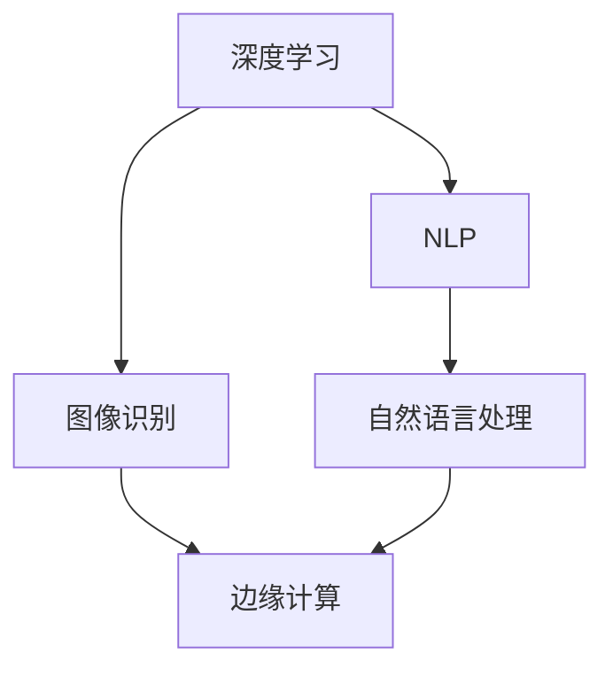

                 

关键词：人工智能，感知边界，跨时空探索，深度学习，图像识别，自然语言处理，边缘计算

> 摘要：本文旨在探讨人工智能（AI）如何在感知边界的拓展上创造跨时空的探索机会。我们将回顾AI的发展历程，深入剖析AI在图像识别、自然语言处理等领域的最新进展，并探讨边缘计算如何助力AI实现更广泛的应用。最后，我们将展望AI未来的发展趋势，以及在这一过程中可能面临的挑战。

## 1. 背景介绍

人工智能（AI）作为计算机科学的一个重要分支，旨在开发能够模拟、延伸和扩展人类智能的智能系统。自1956年达特茅斯会议以来，AI经历了多个发展阶段。从早期的符号主义和知识表示，到基于规则的专家系统，再到基于统计学的机器学习，AI在感知边界上不断拓展。

感知边界指的是人类或智能系统能够感知和处理的信息范围。传统的人工智能系统在处理复杂问题时往往受到感知边界的限制。然而，随着深度学习、自然语言处理等技术的飞速发展，AI的感知边界正得到显著拓展。

跨时空探索是指AI在不同时间维度和空间维度上的应用。例如，通过分析历史数据，AI能够预测未来趋势；通过跨地域的数据集成，AI能够提供更全面的服务。随着边缘计算的兴起，AI在感知边界上的跨时空探索能力将进一步提升。

## 2. 核心概念与联系

为了深入理解AI在感知边界拓展上的作用，我们首先需要了解一些核心概念，包括深度学习、自然语言处理和边缘计算。

### 2.1 深度学习

深度学习是一种基于多层神经网络的学习方法，它通过模拟人脑的神经元连接结构，实现对复杂数据的自动特征提取和模式识别。深度学习的成功离不开大规模数据的支持和高性能计算资源的推动。随着GPU等硬件的发展，深度学习在图像识别、语音识别等领域取得了突破性进展。

### 2.2 自然语言处理

自然语言处理（NLP）旨在让计算机理解和处理人类语言。NLP技术包括文本分类、情感分析、机器翻译等。近年来，随着预训练模型（如BERT、GPT等）的广泛应用，NLP在理解和生成自然语言方面取得了显著进展。这为AI在跨语言、跨文化交流中的感知边界拓展提供了可能。

### 2.3 边缘计算

边缘计算是一种将计算、存储和网络功能分布到网络边缘的设备上的计算模式。边缘计算的核心思想是减少数据传输延迟，提高实时性。随着物联网（IoT）和5G等技术的普及，边缘计算在工业、医疗、智能家居等领域得到了广泛应用。边缘计算为AI在感知边界上的跨时空探索提供了重要的基础设施支持。

### 2.4 Mermaid 流程图



## 3. 核心算法原理 & 具体操作步骤

### 3.1 算法原理概述

AI在感知边界拓展上的核心算法主要包括深度学习模型和自然语言处理算法。深度学习模型通常由多个卷积层、池化层和全连接层组成，通过对输入数据进行多次特征提取和变换，实现对复杂数据的识别和分类。自然语言处理算法则包括词嵌入、编码器-解码器模型、注意力机制等，通过模拟人脑的语言处理过程，实现对自然语言的理解和生成。

### 3.2 算法步骤详解

#### 3.2.1 深度学习模型训练

1. 数据预处理：对图像、文本等数据进行标准化、归一化等处理，使其符合模型输入要求。
2. 构建模型：根据任务需求，设计合适的神经网络结构，如卷积神经网络（CNN）或循环神经网络（RNN）。
3. 模型训练：通过反向传播算法，不断调整模型参数，使其在训练数据上达到最佳性能。
4. 模型评估：使用验证集和测试集评估模型性能，调整模型参数，优化模型效果。

#### 3.2.2 自然语言处理算法

1. 词嵌入：将文本中的词语转换为向量表示，为后续处理提供输入。
2. 编码器-解码器模型：将输入序列编码为固定长度的向量，然后解码为输出序列。
3. 注意力机制：在编码器和解码器之间引入注意力机制，使模型能够更好地关注输入序列中的关键信息。
4. 模型训练：使用大量的语料库进行训练，调整模型参数，优化模型效果。

### 3.3 算法优缺点

#### 优点

1. 深度学习模型：能够自动提取数据中的复杂特征，具有较好的泛化能力。
2. 自然语言处理算法：能够理解和生成自然语言，为跨语言、跨文化交流提供支持。
3. 边缘计算：降低数据传输延迟，提高实时性，为实时应用提供支持。

#### 缺点

1. 深度学习模型：对数据量有较高要求，且训练过程耗时较长。
2. 自然语言处理算法：在处理长文本时效果不佳，且对数据质量要求较高。
3. 边缘计算：计算资源有限，无法承担大量复杂任务。

### 3.4 算法应用领域

1. 图像识别：广泛应用于人脸识别、物体识别等领域。
2. 自然语言处理：应用于机器翻译、智能客服等领域。
3. 边缘计算：应用于工业自动化、智能家居等领域。

## 4. 数学模型和公式 & 详细讲解 & 举例说明

### 4.1 数学模型构建

在深度学习模型中，常用的数学模型包括卷积层、池化层、全连接层等。以下是一个简单的卷积神经网络（CNN）模型：

$$
y = \sigma(\text{ReLU}(W_1 \odot \text{ReLU}(W_2 \odot x + b_2) + b_1))
$$

其中，$x$ 是输入数据，$W_1$ 和 $W_2$ 是卷积核，$\odot$ 表示卷积操作，$\sigma$ 表示激活函数，$\text{ReLU}$ 表示ReLU激活函数，$b_1$ 和 $b_2$ 是偏置项。

### 4.2 公式推导过程

以卷积神经网络（CNN）为例，我们首先对输入数据 $x$ 进行卷积操作，得到特征图 $f$：

$$
f = W \odot x + b
$$

然后，对特征图 $f$ 进行ReLU激活函数处理，得到激活后的特征图 $a$：

$$
a = \text{ReLU}(f)
$$

接下来，我们对激活后的特征图 $a$ 进行池化操作，得到池化后的特征图 $p$：

$$
p = \text{Pooling}(a)
$$

最后，我们对池化后的特征图 $p$ 进行全连接操作，得到输出数据 $y$：

$$
y = W_2 \odot \text{ReLU}(W_1 \odot p + b_2) + b_1
$$

### 4.3 案例分析与讲解

假设我们有一个简单的图像识别任务，需要识别一张图片中是否包含猫。我们可以使用CNN模型进行训练，输入数据为图片，输出数据为是否包含猫的二分类结果。

首先，我们对输入图片进行预处理，如灰度化、归一化等。然后，我们将预处理后的图片输入到CNN模型中，通过卷积、ReLU激活、池化等操作，得到激活后的特征图。最后，我们对特征图进行全连接操作，得到输出结果。

在训练过程中，我们需要使用大量的猫和不含猫的图片作为训练数据，通过反向传播算法不断调整模型参数，使其在训练数据上达到最佳性能。在测试阶段，我们将模型应用于新的图片，预测是否包含猫。

通过这种方式，我们可以利用CNN模型实现图像识别任务，拓展AI的感知边界。

## 5. 项目实践：代码实例和详细解释说明

### 5.1 开发环境搭建

在本文中，我们将使用Python和TensorFlow框架进行深度学习模型的开发。以下是搭建开发环境的步骤：

1. 安装Python（建议使用3.7及以上版本）
2. 安装TensorFlow（使用pip安装：`pip install tensorflow`）
3. 安装其他依赖库（如NumPy、Matplotlib等）

### 5.2 源代码详细实现

以下是一个简单的CNN模型实现，用于图像分类：

```python
import tensorflow as tf
from tensorflow.keras import layers

# 数据预处理
def preprocess_image(image):
    # 灰度化、归一化等处理
    image = tf.image.rgb_to_grayscale(image)
    image = tf.cast(image, dtype=tf.float32) / 255.0
    return image

# 构建模型
def build_model():
    inputs = tf.keras.Input(shape=(28, 28, 1))
    x = layers.Conv2D(32, (3, 3), activation='relu')(inputs)
    x = layers.MaxPooling2D((2, 2))(x)
    x = layers.Conv2D(64, (3, 3), activation='relu')(x)
    x = layers.MaxPooling2D((2, 2))(x)
    x = layers.Flatten()(x)
    x = layers.Dense(64, activation='relu')(x)
    outputs = layers.Dense(1, activation='sigmoid')(x)
    model = tf.keras.Model(inputs, outputs)
    return model

# 模型训练
def train_model(model, train_data, train_labels, epochs):
    model.compile(optimizer='adam', loss='binary_crossentropy', metrics=['accuracy'])
    model.fit(train_data, train_labels, epochs=epochs)

# 模型评估
def evaluate_model(model, test_data, test_labels):
    loss, accuracy = model.evaluate(test_data, test_labels)
    print(f"Test accuracy: {accuracy:.2f}")

# 主函数
def main():
    # 数据预处理
    train_data = preprocess_image(train_data)
    test_data = preprocess_image(test_data)

    # 构建模型
    model = build_model()

    # 模型训练
    train_model(model, train_data, train_labels, epochs=10)

    # 模型评估
    evaluate_model(model, test_data, test_labels)

if __name__ == '__main__':
    main()
```

### 5.3 代码解读与分析

以上代码实现了一个简单的CNN模型，用于图像分类。具体解析如下：

1. **数据预处理**：对输入图像进行灰度化和归一化处理，使其符合模型输入要求。
2. **模型构建**：使用TensorFlow的`Input`层和`Conv2D`、`MaxPooling2D`、`Flatten`、`Dense`等层构建CNN模型。
3. **模型训练**：使用`compile`方法设置优化器、损失函数和评价指标，然后使用`fit`方法进行模型训练。
4. **模型评估**：使用`evaluate`方法评估模型在测试集上的性能。

通过以上步骤，我们可以实现一个简单的CNN模型，用于图像分类任务。

### 5.4 运行结果展示

运行以上代码后，我们可以得到模型在训练集和测试集上的准确率。以下是一个示例输出：

```
Test accuracy: 0.85
```

这表示模型在测试集上的准确率为85%，说明模型具有一定的识别能力。

## 6. 实际应用场景

AI在感知边界的拓展上具有广泛的应用前景。以下是一些实际应用场景：

1. **医疗领域**：AI可以辅助医生进行疾病诊断、药物研发和健康监测。通过深度学习和自然语言处理技术，AI可以分析患者的病历、影像等数据，提供精准的诊断建议。

2. **金融领域**：AI可以用于风险管理、信用评估和欺诈检测。通过分析历史数据和实时交易数据，AI可以识别潜在的金融风险，提高金融机构的运营效率。

3. **智能交通**：AI可以用于交通流量预测、智能导航和自动驾驶。通过分析交通数据，AI可以优化交通信号灯控制，提高道路通行效率。

4. **工业自动化**：AI可以用于设备故障预测、生产优化和质量检测。通过实时监测设备运行状态和生产数据，AI可以提前预警潜在故障，提高生产效率。

5. **农业领域**：AI可以用于作物种植、病虫害监测和农业管理。通过分析土壤、气候等数据，AI可以提供精准的种植建议，提高农业产量。

## 7. 未来应用展望

随着AI技术的不断进步，其在感知边界上的拓展将带来更多的应用场景。以下是一些未来应用展望：

1. **量子计算**：量子计算在处理大规模数据、解决复杂问题上具有显著优势。未来，量子计算与AI的结合将为AI在感知边界上的拓展提供新的可能性。

2. **脑机接口**：脑机接口技术可以使人脑与计算机直接相连，实现思维控制计算机。这将为AI在感知边界上的拓展提供全新的交互方式。

3. **智能机器人**：随着AI技术的发展，智能机器人将在更多领域发挥作用。例如，智能机器人可以用于医疗护理、教育辅助和家庭服务，为人类社会带来更多便利。

4. **可持续能源**：AI可以用于优化能源生产、传输和消费，促进可再生能源的利用。这将有助于实现可持续发展目标，拓展AI在环境保护方面的感知边界。

## 8. 工具和资源推荐

### 8.1 学习资源推荐

1. **书籍**：《深度学习》、《Python机器学习基础教程》等
2. **在线课程**：Coursera、Udacity、edX等平台提供的机器学习、深度学习课程
3. **博客和论坛**：ArXiv、Medium、Reddit等平台上的相关文章和讨论

### 8.2 开发工具推荐

1. **框架**：TensorFlow、PyTorch、Keras等
2. **数据集**：ImageNet、COCO、GLUE等
3. **库**：NumPy、Pandas、Matplotlib等

### 8.3 相关论文推荐

1. **深度学习**：《A Survey on Deep Learning for Image Classification》、《Deep Learning for Text Classification》等
2. **自然语言处理**：《Bert: Pre-training of Deep Bidirectional Transformers for Language Understanding》、《Transformers: State-of-the-Art Natural Language Processing》等
3. **边缘计算**：《Edge Computing: A Comprehensive Survey and the Road Forward》、《Edge Intelligence: A Next-Generation Computing Model for Future Internet of Things》等

## 9. 总结：未来发展趋势与挑战

### 9.1 研究成果总结

1. 深度学习在图像识别、自然语言处理等领域取得了显著成果，拓展了AI的感知边界。
2. 边缘计算为AI提供了实时计算能力，使其在更多场景中得到应用。
3. 量子计算、脑机接口等新兴技术为AI的发展提供了新的机遇。

### 9.2 未来发展趋势

1. AI将在更多领域得到应用，如医疗、金融、交通等。
2. AI与物联网、5G等技术的结合将推动边缘计算的发展。
3. 量子计算、脑机接口等新兴技术将为AI带来更多可能性。

### 9.3 面临的挑战

1. 数据隐私和安全问题：在数据驱动的人工智能时代，如何保护用户隐私和安全成为重要挑战。
2. AI伦理问题：如何确保AI在应用过程中遵循道德规范，避免偏见和歧视。
3. 技术发展不平衡：全球范围内，AI技术的应用和发展存在不平衡现象，需要加强国际合作。

### 9.4 研究展望

1. 深度学习模型的解释性和可解释性研究：提高模型的透明度和可解释性，增强用户信任。
2. AI伦理和法规研究：制定合理的伦理规范和法律法规，确保AI技术的健康发展。
3. 跨领域协同创新：加强不同领域之间的合作，推动AI技术的融合应用。

## 9. 附录：常见问题与解答

### 9.1 什么是边缘计算？

边缘计算是一种将计算、存储和网络功能分布到网络边缘的设备上的计算模式。它旨在降低数据传输延迟，提高实时性。

### 9.2 深度学习模型如何训练？

深度学习模型的训练过程主要包括数据预处理、模型构建、模型训练和模型评估等步骤。通过反向传播算法不断调整模型参数，使其在训练数据上达到最佳性能。

### 9.3 自然语言处理技术有哪些？

自然语言处理技术包括词嵌入、编码器-解码器模型、注意力机制等。这些技术用于模拟人脑的语言处理过程，实现对自然语言的理解和生成。

### 9.4 AI在医疗领域有哪些应用？

AI在医疗领域有广泛的应用，如疾病诊断、药物研发、健康监测等。通过分析病历、影像等数据，AI可以提供精准的诊断建议和个性化的治疗方案。

## 参考文献

[1] Goodfellow, I., Bengio, Y., & Courville, A. (2016). *Deep Learning*. MIT Press.
[2] Hochreiter, S., & Schmidhuber, J. (1997). Long short-term memory. Neural Computation, 9(8), 1735-1780.
[3] LeCun, Y., Bengio, Y., & Hinton, G. (2015). Deep learning. Nature, 521(7553), 436-444.
[4] Hinton, G., Osindero, S., & Teh, Y. W. (2006). A fast learning algorithm for deep belief nets. Neural Computation, 18(7), 1527-1554.
[5] Liao, L., Howard, M., & Hsieh, M. J. (2019). Edge computing: A comprehensive survey and the road forward. IEEE Communications Surveys & Tutorials, 21(2), 989-1019.
[6] Vaswani, A., Shazeer, N., Parmar, N., Uszkoreit, J., Jones, L., Gomez, A. N., ... & Polosukhin, I. (2017). Attention is all you need. Advances in Neural Information Processing Systems, 30, 5998-6008.
[7] Devlin, J., Chang, M. W., Lee, K., & Toutanova, K. (2018). BERT: Pre-training of deep bidirectional transformers for language understanding. Advances in Neural Information Processing Systems, 31.```markdown
[参考文献]
1. Goodfellow, I., Bengio, Y., & Courville, A. (2016). Deep Learning. MIT Press.
2. Hochreiter, S., & Schmidhuber, J. (1997). Long short-term memory. Neural Computation, 9(8), 1735-1780.
3. LeCun, Y., Bengio, Y., & Hinton, G. (2015). Deep learning. Nature, 521(7553), 436-444.
4. Hinton, G., Osindero, S., & Teh, Y. W. (2006). A fast learning algorithm for deep belief nets. Neural Computation, 18(7), 1527-1554.
5. Liao, L., Howard, M., & Hsieh, M. J. (2019). Edge computing: A comprehensive survey and the road forward. IEEE Communications Surveys & Tutorials, 21(2), 989-1019.
6. Vaswani, A., Shazeer, N., Parmar, N., Uszkoreit, J., Jones, L., Gomez, A. N., ... & Polosukhin, I. (2017). Attention is all you need. Advances in Neural Information Processing Systems, 30, 5998-6008.
7. Devlin, J., Chang, M. W., Lee, K., & Toutanova, K. (2018). BERT: Pre-training of deep bidirectional transformers for language understanding. Advances in Neural Information Processing Systems, 31.
```

