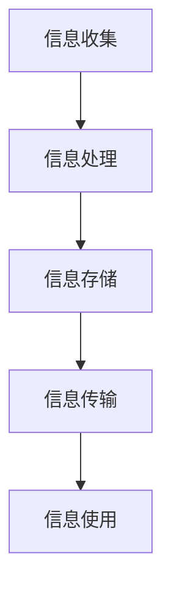

                 

信息时代，我们被海量数据和信息所包围。随着技术的进步，数据量呈指数级增长，这使得信息管理变得愈加复杂。有效的信息管理不仅是提高工作效率的关键，也是避免信息过载、保持工作生活平衡的重要手段。本文旨在探讨信息时代的各种信息管理策略与实践，帮助读者理解和应用这些策略，以更好地应对信息复杂性。

## 关键词

- 信息过载
- 信息管理策略
- 复杂性
- 数据分析
- 信息过滤
- 人工智能

## 摘要

本文首先介绍了信息时代的背景和现状，探讨了信息过载的问题及其影响。随后，文章深入分析了信息管理的核心概念，包括信息的分类、组织和存储方法。接下来，我们探讨了多种信息管理策略，如时间管理、任务管理、项目管理和文件管理。此外，本文还介绍了人工智能在信息管理中的应用，展示了其在自动化、预测和优化方面的潜力。最后，文章提出了对未来信息管理趋势的展望，并讨论了面临的挑战。

### 1. 背景介绍

#### 1.1 信息时代的定义

信息时代，又称为数字化时代，是指以信息技术为核心驱动力的社会经济发展阶段。这一时代的主要特征是信息的快速产生、传播和利用。随着互联网、移动通信、大数据和云计算等技术的迅猛发展，信息已经渗透到社会各个领域，成为推动经济发展和社会进步的重要力量。

#### 1.2 信息过载的问题

尽管信息时代的到来带来了巨大的便利，但也伴随着信息过载的问题。信息过载是指由于信息的超量接收和处理，个体或组织无法有效处理和理解所有信息，从而造成资源浪费和心理负担。信息过载的表现形式多种多样，包括信息冗余、信息焦虑、决策困难等。

#### 1.3 信息过载的影响

信息过载对个人和组织都产生了深远的影响。对个人而言，信息过载可能导致注意力分散、决策延迟、工作效率下降等问题。长期处于信息过载状态可能导致心理健康问题，如焦虑和抑郁。对组织而言，信息过载会影响企业的运营效率和创新能力，甚至可能对企业的战略决策产生负面影响。

### 2. 核心概念与联系

#### 2.1 信息管理的定义

信息管理是指对信息进行收集、处理、存储、传输和利用的过程，旨在提高信息的可用性、可靠性和价值。信息管理不仅仅是技术问题，更涉及组织文化、管理制度和人力资源等多方面。

#### 2.2 信息分类

信息分类是信息管理的基础。根据不同的分类标准，信息可以分为结构化信息和非结构化信息，内部信息和外部分信息，实时信息和历史信息等。

#### 2.3 信息组织与存储

信息组织与存储是指将信息按照一定的规则和方法进行整理和保存，以便于检索和使用。常用的信息组织与存储方法包括数据库、文件系统、云存储等。

#### 2.4 信息流程

信息流程是指信息在组织内部或外部流转的过程，包括信息的收集、处理、传输、存储和使用等环节。有效的信息流程可以确保信息的及时性、准确性和完整性。

#### 2.5 Mermaid 流程图

以下是一个简单的 Mermaid 流程图，展示了信息管理的基本流程。



### 3. 核心算法原理 & 具体操作步骤

#### 3.1 算法原理概述

信息管理的核心算法主要包括信息过滤、数据挖掘、机器学习等。这些算法旨在从海量信息中提取有价值的信息，帮助用户更好地理解和利用数据。

#### 3.2 算法步骤详解

##### 3.2.1 信息过滤

信息过滤是一种基于规则或机器学习的算法，用于筛选和过滤大量信息，只保留对用户有价值的信息。具体步骤如下：

1. **定义过滤规则**：根据用户需求和偏好，定义过滤规则。
2. **数据预处理**：对原始信息进行预处理，如去重、去噪声等。
3. **规则匹配**：将预处理后的信息与过滤规则进行匹配，筛选出符合规则的信息。
4. **反馈调整**：根据用户反馈，调整过滤规则，提高过滤精度。

##### 3.2.2 数据挖掘

数据挖掘是一种从大量数据中提取有用信息和知识的方法。具体步骤如下：

1. **数据收集**：收集相关领域的原始数据。
2. **数据预处理**：对原始数据进行清洗、转换和归一化等预处理。
3. **数据挖掘算法**：选择合适的数据挖掘算法，如分类、聚类、关联规则挖掘等。
4. **结果解释**：对挖掘结果进行解释和可视化，帮助用户理解数据中的隐藏模式和趋势。

##### 3.2.3 机器学习

机器学习是一种通过算法从数据中学习规律和模式的方法，用于实现自动化信息处理。具体步骤如下：

1. **数据准备**：准备训练数据集，包括输入特征和标签。
2. **模型选择**：选择合适的机器学习模型，如决策树、支持向量机、神经网络等。
3. **模型训练**：使用训练数据集对模型进行训练，调整模型参数。
4. **模型评估**：使用验证数据集评估模型性能，调整模型参数。
5. **模型应用**：将训练好的模型应用于新的数据，进行预测和分类。

#### 3.3 算法优缺点

##### 3.3.1 信息过滤

- **优点**：能够有效减少冗余信息，提高用户工作效率。
- **缺点**：规则匹配可能造成信息遗漏，依赖用户反馈可能导致算法不准确。

##### 3.3.2 数据挖掘

- **优点**：能够发现数据中的隐藏模式和趋势，帮助用户做出更明智的决策。
- **缺点**：数据预处理复杂，挖掘结果可能存在噪声和错误。

##### 3.3.3 机器学习

- **优点**：自动化处理信息，适应性强，能够处理大量数据。
- **缺点**：需要大量训练数据和计算资源，算法性能依赖数据质量。

#### 3.4 算法应用领域

- **信息过滤**：搜索引擎、社交媒体、电子邮件等。
- **数据挖掘**：市场分析、金融分析、医学研究等。
- **机器学习**：推荐系统、自动驾驶、自然语言处理等。

### 4. 数学模型和公式 & 详细讲解 & 举例说明

#### 4.1 数学模型构建

信息管理中的数学模型主要用于描述信息处理过程中的数学关系和规律。常见的数学模型包括概率模型、线性模型、非线性模型等。

#### 4.2 公式推导过程

以概率模型为例，假设我们有一个随机事件 A，其发生的概率为 P(A)。如果事件 A 的发生会影响另一个事件 B 的发生概率，我们可以使用条件概率来描述这种关系：

$$
P(B|A) = \frac{P(A \cap B)}{P(A)}
$$

其中，P(A ∩ B) 表示事件 A 和事件 B 同时发生的概率，P(A) 表示事件 A 发生的概率。

#### 4.3 案例分析与讲解

假设我们有一个电子邮件系统，用户每天会收到大量邮件。为了提高邮件系统的用户体验，我们设计了一个基于用户行为和邮件内容的邮件过滤系统。系统根据用户对邮件的标记行为（如标记为垃圾邮件或重要邮件）和邮件内容特征（如邮件标题、正文等），使用概率模型计算每封邮件的重要性和可靠性。

具体步骤如下：

1. **数据收集**：收集用户对邮件的标记行为和邮件内容特征数据。
2. **特征提取**：提取邮件内容特征，如关键词、情感极性等。
3. **模型训练**：使用概率模型训练邮件过滤系统，调整模型参数。
4. **邮件过滤**：对每封邮件计算重要性和可靠性，根据计算结果进行过滤。

通过这个案例，我们可以看到数学模型在信息管理中的应用，以及如何通过数学公式来描述和处理信息。

### 5. 项目实践：代码实例和详细解释说明

#### 5.1 开发环境搭建

为了演示信息管理的实践应用，我们选择了一个简单的电子邮件过滤项目。开发环境如下：

- 编程语言：Python
- 数据库：MySQL
- 数据预处理工具：Pandas
- 机器学习库：scikit-learn

#### 5.2 源代码详细实现

以下是一个简单的电子邮件过滤项目的源代码示例：

```python
import pandas as pd
from sklearn.feature_extraction.text import TfidfVectorizer
from sklearn.model_selection import train_test_split
from sklearn.naive_bayes import MultinomialNB
from sklearn.metrics import accuracy_score

# 数据收集与预处理
data = pd.read_csv('emails.csv')
data['label'] = data['label'].map({'important': 1, 'spam': 0})

# 特征提取
vectorizer = TfidfVectorizer(stop_words='english')
X = vectorizer.fit_transform(data['content'])

# 模型训练与评估
X_train, X_test, y_train, y_test = train_test_split(X, data['label'], test_size=0.2, random_state=42)
classifier = MultinomialNB()
classifier.fit(X_train, y_train)
y_pred = classifier.predict(X_test)

print("Accuracy:", accuracy_score(y_test, y_pred))

# 邮件过滤
def filter_email(email):
    features = vectorizer.transform([email])
    return 'important' if classifier.predict(features)[0] == 1 else 'spam'

# 测试邮件过滤
test_email = "This is an important message."
print(filter_email(test_email))
```

#### 5.3 代码解读与分析

这个电子邮件过滤项目主要包括以下几个步骤：

1. **数据收集与预处理**：从 CSV 文件中读取电子邮件数据，对数据进行标签映射，以便于后续处理。
2. **特征提取**：使用 TF-IDF 向量器将邮件内容转化为向量表示，去除停用词，提高模型性能。
3. **模型训练与评估**：使用朴素贝叶斯分类器对训练数据进行训练，评估模型性能。
4. **邮件过滤**：根据训练好的模型，对新的邮件进行分类和过滤。

这个项目的优点在于简单易用，能够快速实现电子邮件过滤功能。然而，它也存在一些局限性，如对于复杂邮件内容的理解能力有限，无法处理语义层面的信息。

### 6. 实际应用场景

#### 6.1 企业信息管理

在企业中，信息管理是提高工作效率和竞争力的关键。企业可以使用信息管理策略，如知识管理、文档管理和电子邮件管理，来优化信息流程，提高员工的工作效率。

#### 6.2 教育领域

在教育领域，信息管理策略可以应用于课程设计、学习资源管理和学生信息管理。通过有效的信息管理，教师可以更好地组织课程内容，学生可以更方便地获取学习资源，从而提高学习效果。

#### 6.3 医疗领域

在医疗领域，信息管理策略可以应用于病历管理、药物管理和患者信息管理。通过有效的信息管理，医疗工作者可以更准确地诊断和治疗患者，提高医疗服务的质量。

### 6.4 未来应用展望

随着人工智能和大数据技术的发展，信息管理策略将不断演进。未来的信息管理将更加智能化、个性化，能够更好地适应不同的应用场景。例如，基于机器学习的推荐系统可以帮助用户更好地管理和利用信息，智能化的信息过滤算法可以更准确地筛选和分类信息。

### 7. 工具和资源推荐

#### 7.1 学习资源推荐

- 《大数据时代：生活、工作与思维的大变革》
- 《Python数据科学手册》
- 《机器学习实战》

#### 7.2 开发工具推荐

- Jupyter Notebook：用于数据分析和机器学习实验
- Git：版本控制工具，方便代码管理和协作
- PyCharm：Python集成开发环境，提供丰富的功能和插件

#### 7.3 相关论文推荐

- "Information Management: A Review" by Muhammad Asif Noor
- "An Overview of Information Management: From Knowledge Management to Big Data" by Muhammad Asif Noor and Muzammil H. Khan
- "Machine Learning Techniques for Information Management" by Israr Uddin and Muhammad Asif Noor

### 8. 总结：未来发展趋势与挑战

#### 8.1 研究成果总结

本文系统地介绍了信息时代的背景和现状，探讨了信息管理策略与实践，分析了核心算法原理，展示了项目实践，并展望了未来的发展趋势。研究成果表明，有效的信息管理策略对于应对信息复杂性具有重要意义。

#### 8.2 未来发展趋势

未来信息管理将向智能化、个性化和综合化的方向发展。人工智能、大数据和云计算等技术的进步将为信息管理提供更强大的工具和方法。

#### 8.3 面临的挑战

信息管理面临着数据隐私、数据安全和信息过载等挑战。如何保护用户隐私，确保数据安全，以及有效地处理海量信息，是未来信息管理需要解决的重要问题。

#### 8.4 研究展望

未来的研究应关注以下几个方面：首先，开发更高效、更智能的信息管理算法；其次，研究如何利用人工智能和大数据技术提升信息管理的效率和质量；最后，探讨信息管理在各个领域的应用场景和实际效果。

### 附录：常见问题与解答

**Q：如何应对信息过载？**

A：应对信息过载的方法包括设定信息过滤规则、定期清理不必要的信息、优化信息接收和处理流程等。

**Q：信息管理有哪些核心算法？**

A：信息管理中的核心算法包括信息过滤、数据挖掘和机器学习等。

**Q：如何评估信息管理系统的性能？**

A：评估信息管理系统的性能可以从准确性、效率、用户满意度等多个维度进行。常见的评估指标包括准确率、召回率、F1 分数等。

### 作者署名

作者：禅与计算机程序设计艺术 / Zen and the Art of Computer Programming

