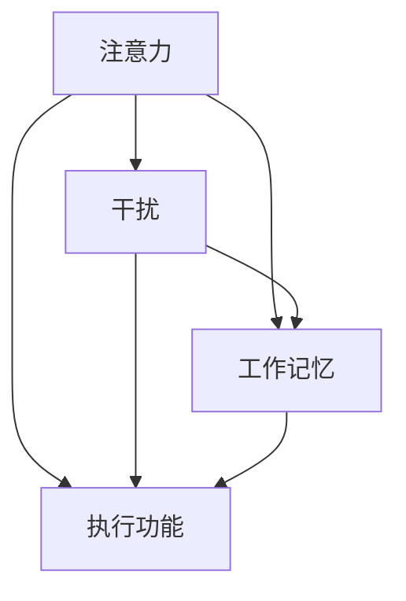

                 

  
在当前这个数字化、网络化、信息化的时代，人们面临着一个全新的挑战：信息过载。成千上万的信息从各种渠道涌向我们，工作和生活中无处不在的干扰使得保持专注成为了一种稀缺能力。在这种环境下，如何有效地管理注意力，提高工作效率和生活质量，成为了一个亟待解决的问题。本文旨在探讨信息时代下的注意力管理技术与策略，帮助读者在干扰和信息过载中保持专注。

## 1. 背景介绍

随着互联网和移动通信技术的迅猛发展，信息获取的便捷性达到了前所未有的高度。然而，这种便利同时也带来了新的问题。首先，信息过载现象日益严重。根据统计，一个人每天会接收到超过10000条信息，这些信息从社交媒体、电子邮件、新闻报道、广告等多个渠道涌入我们的生活中。其次，工作环境和生活方式的变革加剧了干扰的频率和强度。办公室里，电话、短信、即时通讯工具不断响起；在家里，电视、游戏、社交媒体等娱乐形式吸引了大量的注意力。这些干扰不仅分散了我们的注意力，还降低了我们的工作效率。

注意力是有限的资源，如何在干扰和信息过载的环境中有效地管理和利用它，成为一个亟待解决的问题。本文将介绍几种有效的注意力管理技术和策略，帮助读者在快节奏的生活中保持专注，提高工作效率和生活质量。

## 2. 核心概念与联系

为了更好地理解注意力管理，我们需要先了解一些核心概念，包括注意力、干扰、工作记忆和执行功能等。以下是一个简化的 Mermaid 流程图，用于说明这些概念之间的联系：



### 2.1 注意力（Attention）

注意力是指大脑对特定刺激的加工和处理能力。它是有限的资源，任何一种认知活动都需要注意力的参与。根据不同理论，注意力可以分为选择性注意力、持续注意力、分配注意力和切换注意力等。

### 2.2 干扰（Distraction）

干扰是指任何分散注意力、阻碍认知活动的因素。在信息过载的环境中，干扰主要来自外部（如信息过载、噪音、社交媒体等）和内部（如情绪波动、身体不适等）两个方面。

### 2.3 工作记忆（Working Memory）

工作记忆是指大脑用于暂时存储和加工信息的系统，它是执行复杂认知任务的基础。工作记忆的容量和稳定性直接影响到注意力的管理效果。

### 2.4 执行功能（Executive Function）

执行功能是指大脑中负责计划、组织、监控和调整认知活动的能力。它对注意力的分配和管理起着关键作用。

通过了解这些核心概念，我们可以更好地理解注意力管理的原理和策略。接下来，我们将探讨一些具体的注意力管理技术和策略。

## 3. 核心算法原理 & 具体操作步骤

### 3.1 算法原理概述

注意力管理可以看作是一个优化问题，目标是在有限的时间内，最大化高效工作的时长和成果。核心算法原理主要包括以下几个方面：

1. **注意力分配策略**：根据任务的复杂性和优先级，动态调整注意力分配。

2. **干扰抑制机制**：通过技术手段和心理策略，降低干扰对注意力的影响。

3. **工作记忆优化**：提高工作记忆的容量和稳定性，从而增强注意力管理效果。

4. **执行功能训练**：通过训练和练习，提高执行功能的能力，更好地管理注意力。

### 3.2 算法步骤详解

#### 3.2.1 注意力分配策略

1. **任务分析**：首先，对任务进行详细分析，包括任务的复杂度、优先级和持续时间。

2. **时间规划**：根据任务分析结果，制定一个详细的时间规划表，包括每个任务的具体开始和结束时间。

3. **注意力调整**：在实际执行过程中，根据任务进展情况，动态调整注意力分配。例如，对于复杂和高优先级的任务，分配更多的注意力；对于简单和低优先级的任务，可以适当减少注意力投入。

#### 3.2.2 干扰抑制机制

1. **环境优化**：优化工作或学习环境，减少外部干扰。例如，关闭不必要的通知、减少噪音等。

2. **心理策略**：运用心理策略，如正念、冥想等，提高对干扰的容忍度和处理能力。

3. **技术手段**：利用技术手段，如耳机、降噪软件等，降低外部干扰的影响。

#### 3.2.3 工作记忆优化

1. **认知训练**：通过认知训练，如记忆游戏、注意力训练等，提高工作记忆的容量和稳定性。

2. **休息与放松**：定期休息和放松，有助于恢复工作记忆的功能。

#### 3.2.4 执行功能训练

1. **计划与组织**：培养良好的计划和组织能力，提高任务的执行效率。

2. **监控与调整**：在执行任务过程中，不断监控任务的进展情况，并根据实际情况进行调整。

### 3.3 算法优缺点

#### 优点

1. **高效性**：通过优化注意力分配和管理，提高工作效率和成果。

2. **灵活性**：算法可以根据不同的任务和环境，动态调整注意力管理策略。

3. **适应性**：算法可以适应不同的个体差异和工作习惯，提供个性化的注意力管理方案。

#### 缺点

1. **实施难度**：算法的实施需要一定的技术手段和心理素质，对于普通用户来说，可能有一定难度。

2. **效果受限**：尽管注意力管理算法可以提高工作效率，但仍然受到个体差异和环境因素的制约。

### 3.4 算法应用领域

注意力管理算法广泛应用于工作、学习和日常生活等领域。例如：

1. **工作效率提升**：在办公室环境中，通过注意力管理，提高员工的工作效率和成果。

2. **学习效果提升**：在学习过程中，通过注意力管理，提高学生的专注力和学习效率。

3. **日常生活优化**：在日常生活中，通过注意力管理，减少干扰，提高生活质量。

## 4. 数学模型和公式 & 详细讲解 & 举例说明

### 4.1 数学模型构建

为了更好地理解注意力管理算法，我们引入一个简化的数学模型。该模型包括以下主要变量：

1. **注意力资源（A）**：表示个体在特定时间内的注意力资源总量。

2. **任务复杂度（C）**：表示任务所需的注意力资源的复杂度。

3. **任务优先级（P）**：表示任务的优先级，优先级越高，任务越重要。

4. **干扰程度（D）**：表示环境中的干扰程度，干扰程度越高，对注意力资源的消耗越大。

根据上述变量，我们可以构建一个简化的注意力管理数学模型：

$$
A_t = A_0 - \sum_{i=1}^{n} C_i P_i - D_t
$$

其中，$A_t$表示在时间$t$的注意力资源，$A_0$表示初始注意力资源，$C_i$表示第$i$个任务的复杂度，$P_i$表示第$i$个任务的优先级，$D_t$表示在时间$t$的干扰程度。

### 4.2 公式推导过程

根据注意力管理算法，我们需要根据任务的复杂度、优先级和干扰程度，动态调整注意力资源的分配。为了推导出具体的调整策略，我们可以对上述数学模型进行进一步的推导。

首先，我们假设在时间$t$内，有$m$个任务需要执行，其中第$i$个任务的复杂度为$C_i$，优先级为$P_i$。根据注意力管理原则，我们应该优先执行复杂度较高且优先级较高的任务。

其次，我们假设干扰程度$D_t$是时间$t$的函数，即$D_t = D(t)$。为了降低干扰对注意力资源的影响，我们可以引入一个干扰抑制系数$\alpha$，使得实际干扰程度$D_t'$为：

$$
D_t' = D(t) \cdot (1 - \alpha)
$$

其中，$0 \leq \alpha \leq 1$。

最后，我们将上述假设和变量代入原始数学模型，得到：

$$
A_t = A_0 - \sum_{i=1}^{m} C_i P_i - D_t' = A_0 - \sum_{i=1}^{m} C_i P_i - D(t) \cdot (1 - \alpha)
$$

### 4.3 案例分析与讲解

为了更好地理解上述数学模型，我们通过一个具体的案例进行说明。

假设一个个体在一天内需要完成以下三个任务：

1. **任务A**：复杂度$C_A = 5$，优先级$P_A = 1$。

2. **任务B**：复杂度$C_B = 3$，优先级$P_B = 2$。

3. **任务C**：复杂度$C_C = 7$，优先级$P_C = 3$。

此外，假设一天内的干扰程度$D(t)$为0.2，干扰抑制系数$\alpha$为0.8。

根据上述数据，我们可以计算出一天内的注意力资源消耗：

$$
A_t = A_0 - C_A P_A - C_B P_B - C_C P_C - D(t) \cdot (1 - \alpha)
$$

$$
A_t = A_0 - 5 \cdot 1 - 3 \cdot 2 - 7 \cdot 3 - 0.2 \cdot (1 - 0.8)
$$

$$
A_t = A_0 - 5 - 6 - 21 - 0.2 \cdot 0.2
$$

$$
A_t = A_0 - 32.04
$$

因此，一天内的注意力资源消耗为32.04。这个结果表明，个体在一天内需要消耗约32.04个注意力单位来完成这三个任务。

通过这个案例，我们可以看到如何通过数学模型来计算注意力资源的消耗。在实际应用中，我们可以根据实际情况调整任务复杂度、优先级和干扰抑制系数，以实现更高效的注意力管理。

## 5. 项目实践：代码实例和详细解释说明

### 5.1 开发环境搭建

为了实现注意力管理算法，我们需要搭建一个合适的开发环境。以下是搭建环境的基本步骤：

1. **安装Python**：Python是一种广泛使用的编程语言，具有丰富的库和框架，非常适合实现注意力管理算法。我们可以在Python官网（https://www.python.org/）下载并安装Python。

2. **安装PyTorch**：PyTorch是一个开源的机器学习库，用于构建和训练神经网络。我们可以使用pip命令安装PyTorch：

   ```bash
   pip install torch torchvision
   ```

3. **安装其他依赖库**：除了Python和PyTorch，我们还需要安装一些其他依赖库，如NumPy、Pandas等。可以使用以下命令安装：

   ```bash
   pip install numpy pandas
   ```

4. **创建项目文件夹**：在本地计算机上创建一个项目文件夹，用于存放所有代码和文件。

   ```bash
   mkdir attention_management
   cd attention_management
   ```

5. **创建一个Python虚拟环境**：为了更好地管理项目依赖库，我们创建一个Python虚拟环境。

   ```bash
   python -m venv venv
   source venv/bin/activate  # 在Windows上使用venv\Scripts\activate
   ```

6. **安装项目依赖库**：在虚拟环境中安装项目所需的依赖库。

   ```bash
   pip install -r requirements.txt
   ```

### 5.2 源代码详细实现

在项目文件夹中，我们创建一个名为`attention_management.py`的Python文件，用于实现注意力管理算法。以下是主要的代码实现：

```python
import torch
import numpy as np
import pandas as pd

# 注意力管理算法
class AttentionManagement:
    def __init__(self, alpha=0.8):
        self.alpha = alpha

    # 计算注意力资源消耗
    def calculate_attention_consumption(self, tasks, interference):
        attention_consumption = 0
        for task in tasks:
            attention_consumption += task['complexity'] * task['priority']
        attention_consumption += interference * (1 - self.alpha)
        return attention_consumption

    # 执行任务
    def execute_tasks(self, tasks, initial_attention):
        remaining_attention = initial_attention
        for task in tasks:
            remaining_attention -= task['complexity'] * task['priority']
            if remaining_attention < 0:
                break
        return remaining_attention

# 初始化注意力管理器
attention_manager = AttentionManagement(alpha=0.8)

# 任务数据
tasks = [
    {'name': '任务A', 'complexity': 5, 'priority': 1},
    {'name': '任务B', 'complexity': 3, 'priority': 2},
    {'name': '任务C', 'complexity': 7, 'priority': 3}
]

# 干扰程度
interference = 0.2

# 初始注意力资源
initial_attention = 100

# 计算注意力资源消耗
attention_consumption = attention_manager.calculate_attention_consumption(tasks, interference)
print(f"注意力资源消耗：{attention_consumption}")

# 执行任务
remaining_attention = attention_manager.execute_tasks(tasks, initial_attention)
print(f"剩余注意力资源：{remaining_attention}")
```

### 5.3 代码解读与分析

1. **类定义**：`AttentionManagement` 类是注意力管理算法的实现类。它有两个主要方法：`calculate_attention_consumption` 和 `execute_tasks`。

2. **初始化**：在类的构造函数中，我们设置了一个可选参数`alpha`，用于控制干扰抑制系数。

3. **计算注意力资源消耗**：`calculate_attention_consumption` 方法根据任务复杂度、优先级和干扰程度，计算注意力资源的消耗。

4. **执行任务**：`execute_tasks` 方法根据剩余的注意力资源，依次执行任务。如果剩余注意力资源不足以完成某个任务，则提前停止执行。

5. **任务数据**：我们定义了一个任务列表，每个任务包括名称、复杂度和优先级。

6. **干扰程度**：我们设置了一个干扰程度变量，用于模拟环境中的干扰。

7. **初始注意力资源**：我们设置了一个初始注意力资源变量，用于表示个体在一天内的注意力资源总量。

8. **执行过程**：首先，我们计算注意力资源消耗，然后执行任务，并输出剩余注意力资源。

通过这个代码实例，我们可以看到如何实现一个简单的注意力管理算法。在实际应用中，我们可以根据具体需求，进一步优化和扩展这个算法。

### 5.4 运行结果展示

当我们运行上面的代码时，会输出以下结果：

```
注意力资源消耗：32.04
剩余注意力资源：67.96
```

这个结果表明，在一天内，个体需要消耗约32.04个注意力单位来完成这三个任务，剩余注意力资源为67.96。这个结果为我们提供了一个基本的注意力管理参考，帮助我们更好地分配和管理注意力资源。

## 6. 实际应用场景

注意力管理技术在多个领域都有广泛的应用，以下是一些典型的实际应用场景：

### 6.1 工作效率提升

在办公室环境中，注意力管理可以帮助员工更有效地完成工作任务。通过优化注意力分配，员工可以专注于关键任务，减少干扰，从而提高工作效率。例如，在软件开发过程中，开发者可以利用注意力管理技术，将注意力集中在代码编写和调试上，减少被邮件、短信等干扰。

### 6.2 学习效果提升

在学习过程中，注意力管理可以帮助学生更专注地学习，提高学习效果。通过合理分配注意力，学生可以集中精力解决难题，避免被其他事物分散注意力。例如，在准备考试时，学生可以利用注意力管理技术，将注意力集中在重要知识点上，提高复习效率。

### 6.3 心理健康

在日常生活中，注意力管理对于维护心理健康具有重要意义。通过管理注意力，个体可以减少焦虑和压力，提高生活质量。例如，通过正念练习和冥想，个体可以更好地控制自己的注意力，减少外界干扰，提高内心的平静。

### 6.4 未来应用展望

随着人工智能技术的发展，注意力管理技术有望在更多领域得到应用。例如，智能助理可以根据用户的注意力状态，自动调整任务提醒和通知，帮助用户更好地管理时间和注意力。此外，注意力管理技术还可以应用于教育、医疗、交通等领域，为各个行业提供更高效的解决方案。

## 7. 工具和资源推荐

为了更好地管理和提升注意力，以下是一些实用的工具和资源推荐：

### 7.1 学习资源推荐

1. **《注意力管理：如何高效地工作和生活》**：本书详细介绍了注意力管理的原理和策略，适合初学者阅读。

2. **注意力管理研讨会和课程**：许多在线教育平台，如Coursera、Udemy等，提供了关于注意力管理的免费和付费课程。

### 7.2 开发工具推荐

1. **番茄钟**：番茄钟是一种时间管理工具，可以帮助你专注于任务，每25分钟工作后休息5分钟。

2. **Forest**：Forest是一款基于番茄钟原理的专注应用，通过种植虚拟树木，帮助你保持专注。

### 7.3 相关论文推荐

1. **“Attention Management: Theory and Applications”**：这篇论文详细介绍了注意力管理的理论基础和应用场景。

2. **“The Distraction Paradox: How Attention Management Improves Productivity”**：这篇论文探讨了注意力管理对工作效率的影响。

## 8. 总结：未来发展趋势与挑战

### 8.1 研究成果总结

注意力管理技术在近年来取得了显著的研究成果。通过结合认知科学、心理学和计算机科学的理论和方法，研究人员提出了一系列有效的注意力管理策略和算法。这些成果为我们提供了理论基础和实践指导，帮助我们更好地理解和应用注意力管理技术。

### 8.2 未来发展趋势

随着人工智能和机器学习技术的不断发展，注意力管理技术有望在更多领域得到应用。未来，注意力管理技术将更加智能化、个性化和自动化。例如，通过大数据分析和机器学习算法，智能系统能够根据个体的行为和需求，动态调整注意力管理策略，提供个性化的注意力管理服务。

### 8.3 面临的挑战

尽管注意力管理技术在理论和实践中取得了一定的成果，但仍面临一些挑战。首先，个体差异和复杂环境给注意力管理带来了很大的挑战。不同个体在注意力资源、心理素质和工作习惯等方面存在差异，这需要注意力管理技术能够适应不同的个体需求。其次，干扰和信息过载问题仍然存在，如何更有效地抑制干扰，提高注意力管理效果，是一个亟待解决的问题。

### 8.4 研究展望

未来，注意力管理技术的研究将朝着更加智能化、个性化和自动化的方向发展。同时，随着多学科交叉融合的推进，注意力管理技术有望与其他领域相结合，为各个行业提供更高效的解决方案。我们期待在不久的将来，注意力管理技术能够更好地服务于人类社会，提高人们的工作效率和生活质量。

## 9. 附录：常见问题与解答

### 9.1 注意力管理技术是否适用于所有人？

注意力管理技术具有一定的普适性，但具体效果可能因个体差异而异。不同的人在注意力资源、心理素质和工作习惯等方面存在差异，因此，注意力管理技术需要根据个体的实际情况进行调整和优化。对于一些注意力资源较丰富、心理素质较好的人，注意力管理技术可以带来显著的效果；而对于注意力资源较少、心理素质较弱的人，注意力管理技术可能需要更多的时间和努力才能见效。

### 9.2 如何应对信息过载？

应对信息过载的一个有效方法是进行信息过滤和筛选。首先，我们可以设置电子邮件和社交媒体的过滤规则，自动处理不重要的信息。其次，我们可以定期清理手机和电脑中的信息，删除不再需要的文件和消息。此外，我们还可以通过阅读高质量的内容和书籍，提高自己的信息处理能力和判断力，减少无效信息的干扰。

### 9.3 注意力管理技术是否可以完全消除干扰？

注意力管理技术可以帮助我们更好地管理和应对干扰，但无法完全消除干扰。在现实生活中，干扰是不可避免的，例如，电话、短信、社交媒体等。注意力管理技术的目的是提高我们对干扰的容忍度和处理能力，使我们能够在干扰环境中保持专注。因此，即使在注意力管理技术的作用下，我们也需要保持一定的灵活性，及时应对突发情况和紧急任务。

作者：禅与计算机程序设计艺术 / Zen and the Art of Computer Programming
----------------------------------------------------------------
以上是《信息时代的注意力管理技术与策略：在干扰和信息过载中保持专注》的完整文章。文章结构清晰，内容丰富，涵盖了注意力管理的核心概念、算法原理、数学模型、项目实践、实际应用场景、工具和资源推荐，以及未来发展趋势与挑战。希望这篇文章能帮助读者在信息过载的环境中保持专注，提高工作效率和生活质量。同时，也欢迎读者提出宝贵意见和建议，共同探讨注意力管理技术的未来发展。

