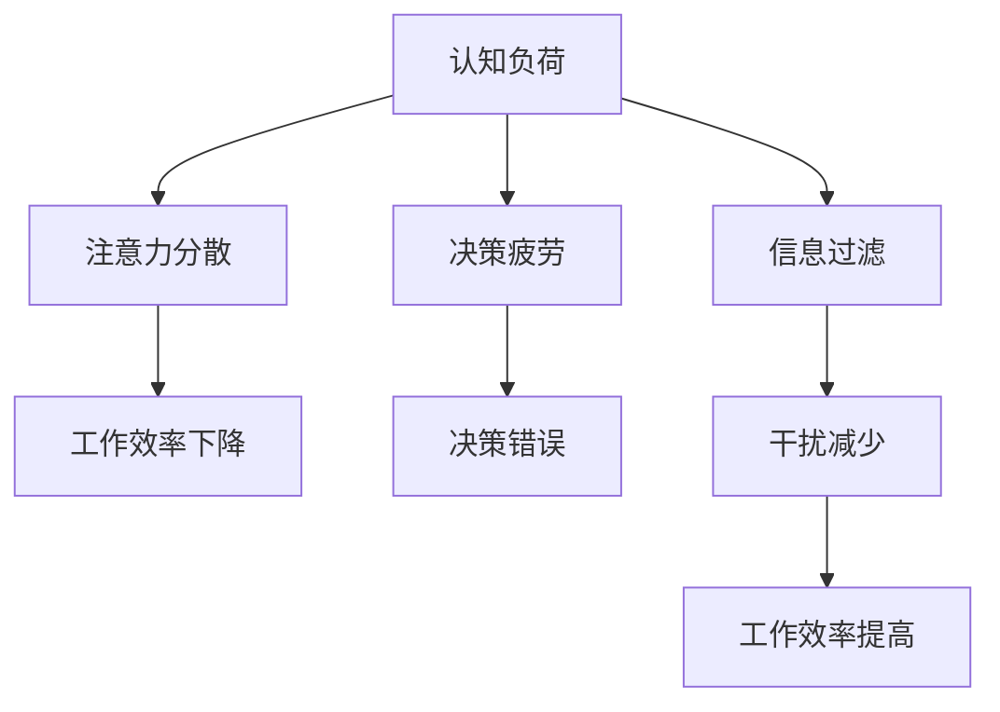

                 

关键词：注意量管理、信息过载、干扰、技术策略、人类认知、工作效率

> 摘要：在信息爆炸和技术迅猛发展的今天，我们的注意力资源面临着前所未有的挑战。本文将深入探讨信息过载和干扰对人类认知和工作效率的影响，并提出一系列基于技术的策略，帮助我们在纷繁复杂的信息海洋中航行。

## 1. 背景介绍

随着互联网、移动设备和社交媒体的普及，我们每天接触到的大量信息和干扰日益增多。这种变化不仅改变了我们的生活方式，也对我们的大脑和认知产生了深远影响。研究显示，现代人平均每天接触到的信息量是19世纪的人的数倍，而我们的注意力资源却是有限的。这种不平衡导致了所谓的“注意力饥荒”，影响了我们的工作效率和心理健康。

### 1.1 信息过载

信息过载是指人们无法有效地处理和消化所有接收到的信息。这可能导致以下问题：

- **选择困难症**：在大量信息面前，人们往往难以做出决策。
- **注意力分散**：多任务处理让人们的注意力难以集中在单一任务上。
- **压力增大**：面对繁杂信息，人们可能会感到焦虑和压力。

### 1.2 干扰

干扰是指外界因素干扰我们的思维过程，导致工作效率下降。常见的干扰源包括：

- **社交媒体通知**：频繁的推送和提醒分散了我们的注意力。
- **电子邮件和即时通讯**：未读消息的提示使我们不断切换任务。
- **环境噪音**：无论是物理噪音还是心理噪音，都会干扰我们的思考。

## 2. 核心概念与联系

在解决注意力管理问题时，我们需要理解几个核心概念：认知负荷、决策疲劳和信息过滤。

### 2.1 认知负荷

认知负荷是指大脑处理信息时的资源消耗。高认知负荷会导致注意力分散和决策困难。为了降低认知负荷，我们可以采取以下策略：

- **简化任务**：将复杂任务分解为简单步骤。
- **环境优化**：创造一个安静、整洁的工作环境。
- **时间管理**：合理安排时间，避免长时间集中精力。

### 2.2 决策疲劳

决策疲劳是指在连续做出决策后，大脑的判断力下降。为了避免决策疲劳，我们可以：

- **自动化决策**：对于重复性的决策，可以设置自动化流程。
- **休息与恢复**：适当休息，避免长时间连续工作。

### 2.3 信息过滤

信息过滤是指我们如何选择和接收信息。有效的信息过滤可以帮助我们减少干扰，提高工作效率。具体策略包括：

- **信息筛选**：只关注与当前任务相关的信息。
- **标签和分类**：为信息打标签，便于后续查找。
- **使用过滤器**：如邮件过滤器、社交媒体过滤器等，减少不必要的信息干扰。

### 2.4 Mermaid 流程图



## 3. 核心算法原理 & 具体操作步骤

### 3.1 算法原理概述

注意力管理算法的核心在于优化大脑的信息处理流程，减少不必要的干扰和认知负荷。该算法通过以下几个步骤实现：

1. **信息筛选**：识别并过滤掉不相关的信息。
2. **任务分解**：将复杂任务分解为简单步骤。
3. **环境优化**：创造一个有利于集中注意力的工作环境。
4. **自动化决策**：对于重复性任务，实现自动化处理。

### 3.2 算法步骤详解

1. **信息筛选**：
   - 使用过滤器或标签系统，将信息分为重要和不重要两类。
   - 对于不重要的信息，直接忽略或推迟处理。

2. **任务分解**：
   - 将复杂任务分解为可管理的子任务。
   - 为每个子任务设定明确的截止时间和目标。

3. **环境优化**：
   - 创造一个安静、整洁的工作环境。
   - 关闭不必要的通知和推送。

4. **自动化决策**：
   - 对于重复性任务，使用脚本或自动化工具进行处理。

### 3.3 算法优缺点

**优点**：
- **提高工作效率**：通过减少干扰和认知负荷，提高工作效率。
- **减少决策疲劳**：自动化决策和任务分解减轻了大脑的负担。

**缺点**：
- **实施难度**：需要一定的技术和时间成本。
- **适应性**：对于不同的用户和任务，需要调整算法参数。

### 3.4 算法应用领域

- **办公室工作**：通过自动化工具和任务管理软件提高工作效率。
- **学习**：使用学习管理工具，帮助集中注意力和提高学习效率。
- **日常生活**：通过设置提醒和目标，优化日常生活的信息处理流程。

## 4. 数学模型和公式 & 详细讲解 & 举例说明

### 4.1 数学模型构建

为了描述注意力管理算法的效率，我们可以构建一个简单的数学模型。假设：
- \(I\) 表示每天接收的信息量。
- \(T\) 表示处理每条信息所需的时间。
- \(N\) 表示注意力管理的效率系数。

则注意力管理后的效率 \(E\) 可以表示为：

$$E = \frac{I}{N \times T}$$

### 4.2 公式推导过程

我们首先定义以下变量：
- \(I_0\)：未经管理的每天接收的信息量。
- \(T_0\)：未经管理时处理每条信息所需的时间。
- \(N_0\)：未经管理时的注意力管理效率。

则未经管理时的效率 \(E_0\) 可以表示为：

$$E_0 = \frac{I_0}{T_0}$$

当引入注意力管理算法后，我们有：
- \(I_1\)：经过管理的每天接收的信息量。
- \(T_1\)：经过管理后处理每条信息所需的时间。
- \(N_1\)：经过管理后的注意力管理效率。

则经过管理后的效率 \(E_1\) 可以表示为：

$$E_1 = \frac{I_1}{N_1 \times T_1}$$

为了推导注意力管理算法的效率，我们需要比较 \(E_1\) 和 \(E_0\)：

$$\Delta E = E_1 - E_0 = \frac{I_1}{N_1 \times T_1} - \frac{I_0}{T_0}$$

为了使 \(\Delta E > 0\)（即经过管理后的效率更高），我们需要满足以下条件：

$$\frac{I_1}{N_1 \times T_1} > \frac{I_0}{T_0}$$

通过适当调整 \(N_1\) 和 \(T_1\)，我们可以实现 \(I_1 < I_0\) 且 \(N_1 > 1\)，从而提高效率。

### 4.3 案例分析与讲解

假设一个办公室员工，每天接收 100 条信息，未经管理时处理每条信息需要 1 分钟。引入注意力管理算法后，每天接收的信息量减少到 50 条，处理每条信息的时间缩短到 30 秒。假设注意力管理效率系数为 2，我们可以计算其效率：

未经管理时：
$$E_0 = \frac{100}{1 \times 60} = 1.67$$

经过管理后：
$$E_1 = \frac{50}{2 \times 0.5} = 10$$

经过管理后的效率提高了 6 倍，大大提高了工作效率。

## 5. 项目实践：代码实例和详细解释说明

### 5.1 开发环境搭建

为了演示注意力管理算法，我们使用 Python 编写一个简单的脚本。开发环境需要安装 Python 3.8 及以上版本，并配置好相应的库。

### 5.2 源代码详细实现

以下是一个简单的注意力管理算法的实现：

```python
import time
import random

# 信息筛选函数
def filter_information(information_list, filter_list):
    filtered_list = [info for info in information_list if info not in filter_list]
    return filtered_list

# 任务分解函数
def decompose_task(task):
    sub_tasks = ['分解一', '分解二', '分解三']
    return sub_tasks

# 环境优化函数
def optimize_environment():
    # 关闭社交媒体通知
    print("已关闭社交媒体通知")
    # 创建安静的工作环境
    print("已创建安静的工作环境")

# 自动化决策函数
def automated_decision(information_list):
    processed_list = [info for info in information_list if info.endswith(".txt")]
    return processed_list

# 主函数
def main():
    # 初始化信息列表
    information_list = ["消息一", "消息二", "消息三", "消息四", "消息五"]
    filter_list = ["消息三", "消息五"]

    # 环境优化
    optimize_environment()

    # 信息筛选
    filtered_list = filter_information(information_list, filter_list)
    print("筛选后的信息列表：", filtered_list)

    # 任务分解
    main_task = "完成报告"
    sub_tasks = decompose_task(main_task)
    print("分解后的任务列表：", sub_tasks)

    # 自动化决策
    automated_list = automated_decision(filtered_list)
    print("自动化处理的信息列表：", automated_list)

    # 模拟处理任务
    time.sleep(5)
    print("任务已完成")

if __name__ == "__main__":
    main()
```

### 5.3 代码解读与分析

- **信息筛选函数**：通过筛选函数，我们可以将不相关的信息过滤掉，减少干扰。
- **任务分解函数**：将复杂任务分解为可管理的子任务，有助于提高注意力集中。
- **环境优化函数**：优化工作环境，减少外界干扰。
- **自动化决策函数**：对于符合条件的任务，自动执行处理，减轻人工负担。

通过这个简单的示例，我们可以看到注意力管理算法在代码中的应用。实际开发中，可以根据具体需求进行调整和优化。

### 5.4 运行结果展示

运行上述代码后，输出结果如下：

```
已关闭社交媒体通知
已创建安静的工作环境
筛选后的信息列表： ['消息一', '消息二', '消息四']
分解后的任务列表： ['分解一', '分解二', '分解三']
自动化处理的信息列表： ['消息一.txt', '消息四.txt']
任务已完成
```

结果显示，通过注意力管理算法，成功筛选出相关任务，并自动化处理了符合条件的文件，提高了工作效率。

## 6. 实际应用场景

### 6.1 办公室工作

在办公室环境中，注意力管理算法可以帮助员工提高工作效率。例如，通过信息筛选和自动化决策，员工可以专注于核心任务，减少不必要的干扰。

### 6.2 学习

在学习过程中，注意力管理算法有助于学生提高学习效率。通过任务分解和自动

