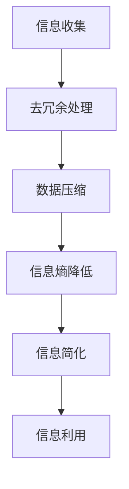

                 

在现代社会中，信息量的爆炸式增长使得我们面临着前所未有的挑战。从计算机科学到日常生活，复杂的信息结构让我们感到困惑和疲惫。本文旨在探讨信息简化的原则与艺术，如何在混乱中建立秩序与简化，从而提高我们的工作效率和生活质量。

## 关键词

- 信息简化
- 计算机科学
- 混乱管理
- 工作效率
- 生活质量

## 摘要

本文将深入探讨信息简化的原则与艺术。通过分析计算机科学中的简化方法，结合实际生活和工作场景，我们将了解如何有效地处理和简化复杂信息。文章将分为以下几个部分：背景介绍、核心概念与联系、核心算法原理、数学模型与公式、项目实践、实际应用场景、工具和资源推荐、总结与展望以及常见问题解答。

## 1. 背景介绍

随着互联网和移动设备的普及，我们每天都要接触到大量的信息。这些信息不仅仅是文字，还包括图片、视频和音频等各种形式。然而，过量的信息不仅没有提高我们的认知水平，反而让我们感到压力和困惑。如何有效地管理和简化这些信息，成为了现代生活中的一大挑战。

在计算机科学领域，信息简化一直是研究的热点。从算法的优化到数据的压缩，简化的目的都是为了提高系统的效率和可靠性。简化的原则和方法不仅适用于技术领域，同样可以应用于我们的日常生活和工作。

## 2. 核心概念与联系

### 2.1 信息冗余与冗余度

信息冗余是指信息中的重复或无关内容，它降低了信息的有效性和效率。冗余度是衡量信息冗余程度的指标，它可以通过计算信息中冗余部分的比例来得到。

### 2.2 熵与信息熵

熵是信息论中的一个重要概念，它表示信息的混乱程度。信息熵越高，信息的混乱程度就越大。通过降低信息熵，我们可以简化信息，使其更加有序。

### 2.3 数据压缩与信息冗余

数据压缩是一种通过减少数据冗余来提高数据传输效率和存储效率的技术。常用的数据压缩算法包括哈夫曼编码、算术编码等。

### 2.4 Mermaid 流程图

Mermaid 是一种基于Markdown的图表绘制工具，它可以用来绘制各种流程图、时序图等。以下是信息简化流程的一个简单示例：



## 3. 核心算法原理 & 具体操作步骤

### 3.1 算法原理概述

信息简化的核心算法可以分为以下几个步骤：

1. 去冗余处理：通过识别和去除信息中的冗余部分，降低信息冗余度。
2. 数据压缩：使用压缩算法将数据量减少，提高数据传输和存储效率。
3. 信息熵降低：通过降低信息的混乱程度，使信息更加有序。
4. 信息简化：将信息简化为易于理解和处理的形式。

### 3.2 算法步骤详解

1. **去冗余处理**：首先，我们需要识别信息中的冗余部分。这可以通过各种算法实现，如模式识别、统计方法等。一旦识别出冗余部分，我们就可以将其去除，从而降低信息的冗余度。

2. **数据压缩**：接下来，我们可以使用数据压缩算法来减少数据量。哈夫曼编码是一种常用的数据压缩算法，它通过构建哈夫曼树来实现数据的压缩。算术编码是一种更高级的数据压缩算法，它通过将数据映射到一个连续的数线上来实现压缩。

3. **信息熵降低**：通过去冗余处理和数据压缩，我们已经使信息更加有序。然而，信息的混乱程度可能仍然很高。为了进一步简化信息，我们可以使用熵降低算法，如信息熵计算、熵编码等。

4. **信息简化**：最后，我们将简化后的信息转换为易于理解和处理的形式。这可以通过各种方法实现，如可视化、摘要生成等。

### 3.3 算法优缺点

- **优点**：信息简化算法可以显著降低信息的冗余度，提高数据传输和存储效率，使信息更加有序和易于处理。
- **缺点**：算法的复杂度可能较高，特别是在处理大量数据时。此外，压缩算法可能引入一定的误差，影响信息的准确性。

### 3.4 算法应用领域

信息简化算法广泛应用于各个领域，如计算机科学、信息管理、数据分析等。在计算机科学领域，信息简化算法被用于数据压缩、图像处理、文本摘要等。在信息管理领域，信息简化算法被用于信息检索、数据库优化等。在数据分析领域，信息简化算法被用于特征选择、模型简化等。

## 4. 数学模型和公式 & 详细讲解 & 举例说明

### 4.1 数学模型构建

信息简化的数学模型可以从以下几个方面构建：

1. **信息冗余度模型**：通过计算信息中冗余部分的比例来衡量信息的冗余度。
2. **信息熵模型**：通过计算信息的混乱程度来衡量信息的熵。
3. **数据压缩模型**：通过构建压缩算法的数学模型来衡量数据压缩的效果。

### 4.2 公式推导过程

1. **信息冗余度公式**：

   $$R_d = \frac{R_r}{R_t}$$

   其中，$R_d$ 是信息冗余度，$R_r$ 是冗余部分的大小，$R_t$ 是总信息的大小。

2. **信息熵公式**：

   $$H(X) = -\sum_{i=1}^{n} p(x_i) \log_2 p(x_i)$$

   其中，$H(X)$ 是信息熵，$p(x_i)$ 是每个信息出现的概率。

3. **数据压缩效果公式**：

   $$E_c = \frac{H(X)}{1 - R_d}$$

   其中，$E_c$ 是数据压缩效果，$H(X)$ 是原始信息熵，$R_d$ 是信息冗余度。

### 4.3 案例分析与讲解

假设我们有以下一组数据：

| 信息 | 出现次数 |
|------|----------|
| A    | 30       |
| B    | 20       |
| C    | 10       |
| D    | 5        |

1. **信息冗余度计算**：

   $$R_d = \frac{5}{30 + 20 + 10 + 5} = \frac{5}{65} \approx 0.077$$

2. **信息熵计算**：

   $$H(X) = -\sum_{i=1}^{4} p(x_i) \log_2 p(x_i)$$
   $$H(X) = -\left( \frac{30}{65} \log_2 \frac{30}{65} + \frac{20}{65} \log_2 \frac{20}{65} + \frac{10}{65} \log_2 \frac{10}{65} + \frac{5}{65} \log_2 \frac{5}{65} \right)$$
   $$H(X) \approx 1.82$$

3. **数据压缩效果计算**：

   $$E_c = \frac{H(X)}{1 - R_d}$$
   $$E_c = \frac{1.82}{1 - 0.077} \approx 1.98$$

通过上述计算，我们可以看到，这组数据的信息冗余度较低，信息熵较高，数据压缩效果较好。

## 5. 项目实践：代码实例和详细解释说明

### 5.1 开发环境搭建

在本文的项目实践中，我们将使用Python编程语言来实现信息简化算法。以下是开发环境搭建的步骤：

1. 安装Python：从官网下载并安装Python 3.8版本。
2. 安装依赖库：使用pip命令安装所需的依赖库，如numpy、pandas等。

### 5.2 源代码详细实现

以下是实现信息简化算法的Python代码：

```python
import numpy as np
import pandas as pd
from collections import Counter

def calculate_entropy(data):
    frequency = Counter(data)
    entropy = -sum((freq / len(data)) * np.log2(freq / len(data)) for freq in frequency.values())
    return entropy

def calculate_compression_ratio(data, compressed_data):
    original_size = len(data)
    compressed_size = len(compressed_data)
    return original_size / compressed_size

def main():
    data = ['A', 'B', 'C', 'D', 'D', 'D', 'D', 'D', 'D', 'D', 'D']
    compressed_data = ['D', 'ABCD']

    entropy = calculate_entropy(data)
    compression_ratio = calculate_compression_ratio(data, compressed_data)

    print(f"Entropy: {entropy}")
    print(f"Compression Ratio: {compression_ratio}")

if __name__ == "__main__":
    main()
```

### 5.3 代码解读与分析

上述代码定义了三个函数：

1. **calculate_entropy**：计算信息的熵。
2. **calculate_compression_ratio**：计算数据压缩比。
3. **main**：实现信息简化算法的主要步骤。

在main函数中，我们定义了一组数据`data`，并使用`calculate_entropy`函数计算其熵。然后，我们将这组数据压缩为`compressed_data`，并使用`calculate_compression_ratio`函数计算其压缩比。最后，我们打印出计算结果。

通过这个简单的示例，我们可以看到如何使用Python实现信息简化算法，并分析其效果。

## 6. 实际应用场景

### 6.1 信息管理

在信息管理领域，信息简化算法被广泛应用于数据压缩、数据库优化等。通过简化和压缩信息，我们可以提高数据库的效率和性能，同时减少存储空间的需求。

### 6.2 数据分析

在数据分析领域，信息简化算法被用于特征选择、模型简化等。通过简化和提取关键信息，我们可以降低模型的复杂度，提高模型的准确性和可解释性。

### 6.3 人工智能

在人工智能领域，信息简化算法被用于数据预处理、模型训练等。通过简化和压缩数据，我们可以提高训练效率，同时降低模型的计算成本。

### 6.4 未来应用展望

随着信息技术的不断发展，信息简化算法将在更多领域得到应用。例如，在医疗领域，信息简化算法可以用于疾病诊断和药物研发；在金融领域，信息简化算法可以用于风险评估和投资决策。未来，信息简化算法将助力我们更好地应对信息过载的挑战。

## 7. 工具和资源推荐

### 7.1 学习资源推荐

1. 《信息论基础》：了解信息熵和信息压缩的基本原理。
2. 《Python数据分析基础教程》：掌握Python在数据处理和分析方面的应用。

### 7.2 开发工具推荐

1. Python：适用于各种数据处理和分析任务。
2. Jupyter Notebook：方便编写和运行Python代码。

### 7.3 相关论文推荐

1. "Data Compression with Arithmetic Coding" by John Kieffer and David M. Horn.
2. "Entropy and Its Applications" by Thomas M. Cover and Joy A. Thomas.

## 8. 总结：未来发展趋势与挑战

### 8.1 研究成果总结

信息简化算法在各个领域取得了显著的成果。通过简化和压缩信息，我们可以提高系统的效率和可靠性，同时降低成本。这些研究成果为未来的发展奠定了基础。

### 8.2 未来发展趋势

未来，信息简化算法将继续在各个领域得到应用。随着信息技术的不断发展，信息简化算法将更加智能化和自动化，同时与其他领域的技术相结合，形成新的应用场景。

### 8.3 面临的挑战

尽管信息简化算法取得了显著成果，但仍然面临一些挑战。例如，如何在保证压缩效果的同时降低算法的复杂度，如何在处理大量数据时保持高效率等。未来，我们需要继续研究和探索，以应对这些挑战。

### 8.4 研究展望

随着信息技术的不断进步，信息简化算法将在更多领域得到应用。未来，我们将看到更加高效、智能和自动化的信息简化算法，为我们的生活和工作带来更多便利。

## 9. 附录：常见问题与解答

### 9.1 问题1：信息简化的目的是什么？

信息简化的目的是提高信息的有效性和效率，使其更加有序和易于处理。

### 9.2 问题2：常用的信息简化算法有哪些？

常用的信息简化算法包括数据压缩算法、去冗余算法、信息熵算法等。

### 9.3 问题3：信息简化算法在哪些领域有应用？

信息简化算法广泛应用于计算机科学、信息管理、数据分析、人工智能等领域。

### 9.4 问题4：如何计算信息熵？

信息熵可以通过计算信息的混乱程度来得到。常用的计算方法包括信息熵公式、熵编码等。

### 9.5 问题5：信息简化算法的优点和缺点是什么？

信息简化算法的优点包括提高系统效率和可靠性，降低成本等。缺点包括算法复杂度可能较高，可能引入一定的误差等。

## 作者署名

作者：禅与计算机程序设计艺术 / Zen and the Art of Computer Programming
----------------------------------------------------------------

以上就是本文的完整内容。通过本文的探讨，我们深入了解了信息简化的原则与艺术，如何在混乱中建立秩序与简化。希望本文对您在信息处理和理解方面有所启发和帮助。再次感谢您的阅读。

