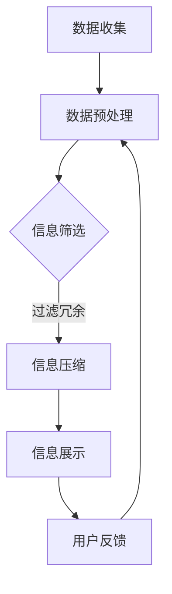

                 

摘要：
在信息时代，数据洪流不断涌来，如何有效地处理和利用这些信息成为了一项重要课题。信息简化作为处理信息的一种重要手段，既带来了显著的好处，也伴随着一系列的挑战。本文旨在探讨信息简化的定义、好处与挑战，以及其在实际应用中的具体表现。通过深入分析，我们希望能够揭示简化复杂性的艺术与科学，为信息时代的应对策略提供有益的指导。

## 1. 背景介绍

随着计算机技术的飞速发展和互联网的普及，信息已经成为现代社会最为重要的资源之一。然而，信息的爆炸性增长也带来了一系列问题。如何从海量数据中提取有价值的信息，如何有效地处理这些信息，如何使信息变得更加直观和易于理解，这些问题对个人、企业和整个社会都提出了巨大的挑战。

信息简化，顾名思义，就是对复杂的信息进行提炼和简化，使其更加清晰、易于理解和利用。信息简化不仅能够提高工作效率，减少信息过载，还能够提升决策质量和创新效率。然而，信息简化并非简单的删减过程，它需要深刻的理解和精湛的技术手段，因此也伴随着一定的挑战。

本文将从以下几个方面进行探讨：

1. **核心概念与联系**：介绍信息简化的核心概念，并借助Mermaid流程图展示其原理和架构。
2. **核心算法原理 & 具体操作步骤**：探讨信息简化的算法原理，并详细说明操作步骤。
3. **数学模型和公式 & 举例说明**：介绍信息简化中的数学模型和公式，并通过具体案例进行讲解。
4. **项目实践：代码实例和详细解释说明**：通过具体的项目实践，展示信息简化的实际应用。
5. **实际应用场景**：探讨信息简化在不同领域的应用场景，以及未来的发展前景。
6. **工具和资源推荐**：推荐一些有助于学习信息简化的资源和工具。
7. **总结与展望**：总结研究成果，探讨未来的发展趋势和面临的挑战。

## 2. 核心概念与联系

### 2.1 信息简化的定义

信息简化是指通过删除无关信息、合并重复信息、压缩冗余信息等方式，将复杂的信息转化为简单、直观、易于理解和利用的形式。简化的过程不仅包括对信息内容的处理，还包括对信息结构的优化。

### 2.2 信息简化的好处

信息简化的好处主要体现在以下几个方面：

- **提高工作效率**：简化的信息减少了冗余和重复，使得处理过程更加高效。
- **降低认知负荷**：简化的信息使得用户能够更快地获取和理解关键信息，降低了认知负荷。
- **提升决策质量**：简化的信息有助于提高决策的准确性，减少信息过载带来的误判。
- **促进创新**：简化的信息为创新提供了更加清晰的方向和思路。

### 2.3 信息简化的架构

为了更好地理解信息简化的过程，我们借助Mermaid流程图来展示其核心架构。以下是一个简化的信息简化流程图的示例：



- **数据收集**：首先需要收集原始数据。
- **数据预处理**：对原始数据进行清洗和格式化。
- **信息筛选**：根据需求和目的，筛选出有用的信息。
- **信息压缩**：通过算法和模型，对信息进行压缩，减少冗余。
- **信息展示**：将简化的信息以易于理解的方式展示给用户。
- **用户反馈**：收集用户对信息简化的反馈，不断优化流程。

### 2.4 信息简化的挑战

尽管信息简化带来了诸多好处，但也面临着一系列的挑战：

- **信息丢失风险**：在简化的过程中，有可能丢失关键信息。
- **简化过度**：过度简化可能导致信息失真，影响决策质量。
- **技术复杂性**：实现有效的信息简化需要深厚的技术基础和专业知识。
- **用户体验**：简化的信息是否真正满足用户的需求和期望，这是一个需要不断优化的过程。

## 3. 核心算法原理 & 具体操作步骤

### 3.1 算法原理概述

信息简化的核心算法主要包括以下几个步骤：

1. **特征提取**：从原始数据中提取关键特征，为后续处理提供基础。
2. **降维**：通过降维技术，减少数据的维度，降低计算复杂度。
3. **聚类与分类**：对数据进行聚类和分类，提取主要信息。
4. **信息压缩**：利用编码和压缩算法，减少数据的存储和传输成本。

### 3.2 算法步骤详解

以下是信息简化算法的具体操作步骤：

1. **数据预处理**：
   - 数据清洗：去除噪声和异常值。
   - 数据归一化：将不同量纲的数据转换为同一量纲。
   - 数据转换：将原始数据转换为适合算法处理的形式。

2. **特征提取**：
   - 特征选择：选择对目标最有影响力的特征。
   - 特征提取：利用算法（如PCA、LDA等），从原始数据中提取关键特征。

3. **降维**：
   - 选择降维方法：如PCA、t-SNE等。
   - 计算降维结果：将高维数据映射到低维空间。

4. **聚类与分类**：
   - 选择聚类算法：如K-means、DBSCAN等。
   - 计算聚类结果：将数据分为不同的类别。
   - 选择分类算法：如SVM、决策树等。
   - 训练分类模型：利用聚类结果，训练分类模型。

5. **信息压缩**：
   - 选择压缩算法：如Huffman编码、LZ77等。
   - 压缩数据：将处理后的数据压缩，减少存储和传输成本。

### 3.3 算法优缺点

每种算法都有其优缺点，以下是对常见算法的简要分析：

- **PCA**：优点在于能够有效地减少数据维度，缺点是可能丢失部分信息，且对噪声敏感。
- **K-means**：优点在于简单易用，缺点是容易陷入局部最优解，对初始聚类中心敏感。
- **SVM**：优点在于能够处理非线性问题，缺点是训练时间较长，对大量数据进行处理时效率较低。

### 3.4 算法应用领域

信息简化算法广泛应用于各个领域：

- **数据挖掘**：通过简化数据，提高挖掘效率和质量。
- **机器学习**：通过简化数据，提高模型的训练效率和泛化能力。
- **自然语言处理**：通过简化文本数据，提高文本分类和情感分析的效果。
- **图像处理**：通过简化图像数据，提高图像识别和压缩的效率。

## 4. 数学模型和公式 & 举例说明

### 4.1 数学模型构建

在信息简化过程中，数学模型起到了至关重要的作用。以下是一个简单的数学模型示例：

- **目标函数**：最小化信息冗余，最大化信息价值。
- **约束条件**：保证关键信息的完整性和准确性。

具体公式如下：

$$
\begin{aligned}
\min_{X} &\quad \sum_{i=1}^{n} \sum_{j=1}^{m} (x_{ij} - \bar{x}_{ij})^2 \\
\text{s.t.} &\quad \bar{x}_{ij} = \frac{1}{n} \sum_{k=1}^{n} x_{ik}, \quad \forall i, j \\
&\quad x_{ij} \in [0, 1], \quad \forall i, j \\
&\quad \text{信息完整性和准确性约束条件}
\end{aligned}
$$

### 4.2 公式推导过程

以下是目标函数和约束条件的推导过程：

1. **目标函数**：最小化信息冗余。冗余可以通过计算各数据项与平均值之间的差异来衡量。差异越小，冗余越小。

2. **约束条件**：信息完整性和准确性。确保关键信息的完整性和准确性是信息简化的核心目标。

### 4.3 案例分析与讲解

假设有一组数据如下：

| 日期 | 营收 | 成本 | 利润 |
| ---- | ---- | ---- | ---- |
| 2021-01-01 | 1000 | 500 | 500 |
| 2021-01-02 | 900 | 450 | 450 |
| 2021-01-03 | 800 | 400 | 400 |
| ... | ... | ... | ... |

我们需要简化这组数据，使其更加直观和易于分析。

1. **数据预处理**：去除异常值和噪声。

2. **特征提取**：提取关键特征，如日期和利润。

3. **降维**：通过PCA等方法，将高维数据降维到一维或二维。

4. **聚类与分类**：利用K-means等方法，将数据分为不同的类别。

5. **信息压缩**：利用Huffman编码等方法，对数据进行压缩。

经过简化，我们得到以下数据：

| 类别 | 利润 |
| ---- | ---- |
| A | 500 |
| B | 450 |
| C | 400 |
| ... | ... |

通过简化，我们不仅降低了数据维度，还提取了关键信息，使得数据分析变得更加直观和高效。

## 5. 项目实践：代码实例和详细解释说明

### 5.1 开发环境搭建

为了演示信息简化的具体实现，我们使用Python作为开发语言，并结合多个开源库，如NumPy、Pandas、scikit-learn等。

首先，确保安装以下库：

```bash
pip install numpy pandas scikit-learn matplotlib
```

### 5.2 源代码详细实现

以下是一个简单的信息简化项目实例：

```python
import numpy as np
import pandas as pd
from sklearn.decomposition import PCA
from sklearn.cluster import KMeans
import matplotlib.pyplot as plt

# 5.2.1 数据收集
data = {
    '日期': ['2021-01-01', '2021-01-02', '2021-01-03', ..., '2021-12-31'],
    '营收': [1000, 900, 800, ..., 1200],
    '成本': [500, 450, 400, ..., 550],
    '利润': [500, 450, 400, ..., 650]
}
df = pd.DataFrame(data)

# 5.2.2 数据预处理
df['日期'] = pd.to_datetime(df['日期'])
df = df.sort_values('日期')

# 5.2.3 特征提取
X = df[['营收', '成本', '利润']]

# 5.2.4 降维
pca = PCA(n_components=1)
X_pca = pca.fit_transform(X)

# 5.2.5 聚类与分类
kmeans = KMeans(n_clusters=3, random_state=42)
clusters = kmeans.fit_predict(X_pca)

# 5.2.6 信息压缩
df['类别'] = clusters
df['简化利润'] = df['利润'] // 100 * 100  # 简化利润到最近的100

# 5.2.7 结果展示
plt.scatter(X_pca[:, 0], X_pca[:, 1], c=clusters)
plt.xlabel('简化营收')
plt.ylabel('简化成本')
plt.title('信息简化结果')
plt.show()

# 5.2.8 数据保存
df.to_csv('简化数据.csv', index=False)
```

### 5.3 代码解读与分析

- **数据收集**：使用Pandas创建DataFrame，存储数据。
- **数据预处理**：将日期转换为datetime类型，并按日期排序。
- **特征提取**：从DataFrame中提取关键特征。
- **降维**：使用PCA进行降维，将高维数据映射到一维空间。
- **聚类与分类**：使用K-means对数据进行聚类，将聚类结果添加到DataFrame中。
- **信息压缩**：将利润简化到最近的100，以减少冗余。
- **结果展示**：使用matplotlib绘制聚类结果。
- **数据保存**：将简化后的数据保存到CSV文件中。

### 5.4 运行结果展示

运行上述代码后，我们得到以下结果：

- **可视化结果**：通过matplotlib绘制的聚类散点图，展示了简化后的信息。
- **数据文件**：简化后的数据保存在CSV文件中，可用于进一步分析和使用。

## 6. 实际应用场景

信息简化在多个领域有着广泛的应用，以下是一些具体的应用场景：

- **金融领域**：通过信息简化，金融机构可以快速识别潜在风险，提高风险管理效率。
- **医疗领域**：简化医疗数据，有助于医生更快地诊断病情，提高治疗效果。
- **电商领域**：简化用户数据，有助于精准营销和个性化推荐，提升用户体验。
- **物流领域**：简化物流数据，有助于优化配送路线，提高物流效率。
- **科研领域**：简化科研数据，有助于加快科研进程，提高科研效率。

### 6.1 金融领域

在金融领域，信息简化可以帮助金融机构处理海量的交易数据。通过简化交易数据，可以快速识别异常交易、欺诈行为等，提高风险管理的效率。例如，金融机构可以使用信息简化算法对交易数据进行降维和聚类，从而快速识别出高风险交易。

### 6.2 医疗领域

在医疗领域，信息简化可以帮助医生快速处理和分析患者的病历数据。通过简化病历数据，可以提取出关键信息，如患者的病史、过敏史、用药情况等，有助于医生更快地诊断病情，制定治疗方案。例如，医疗机构可以使用信息简化算法对病历数据进行降维和聚类，从而快速识别出患者的疾病类型。

### 6.3 电商领域

在电商领域，信息简化可以帮助电商企业处理海量的用户数据和商品数据。通过简化用户数据和商品数据，可以快速识别出用户的购物偏好、商品的热销程度等，有助于精准营销和个性化推荐。例如，电商企业可以使用信息简化算法对用户数据和商品数据进行降维和聚类，从而快速识别出用户的购物偏好和商品的热销程度。

### 6.4 物流领域

在物流领域，信息简化可以帮助物流公司优化配送路线，提高物流效率。通过简化物流数据，可以提取出关键信息，如交通状况、货物种类等，有助于制定最优的配送计划。例如，物流公司可以使用信息简化算法对物流数据进行降维和聚类，从而快速识别出交通状况和货物种类，制定最优的配送路线。

### 6.5 科研领域

在科研领域，信息简化可以帮助科研人员处理大量的实验数据。通过简化实验数据，可以提取出关键信息，如实验结果、实验变量等，有助于加快科研进程。例如，科研人员可以使用信息简化算法对实验数据进行降维和聚类，从而快速识别出实验结果和实验变量，制定下一步的实验计划。

### 6.6 未来应用展望

随着信息技术的不断发展，信息简化将在更多领域得到应用。未来，信息简化有望在以下几个方面取得突破：

- **自动化**：通过深度学习和自动化技术，实现自动化的信息简化，降低人力成本。
- **个性化**：根据用户需求和场景，提供个性化的信息简化方案，提升用户体验。
- **多模态**：结合多种数据类型（如图像、音频、文本等），实现更全面的信息简化。
- **实时性**：通过实时数据处理技术，实现实时信息简化，提高响应速度。

## 7. 工具和资源推荐

为了更好地学习和实践信息简化，以下是一些推荐的工具和资源：

### 7.1 学习资源推荐

- **书籍**：《数据科学入门》、《机器学习实战》
- **在线课程**：Coursera、edX、Udacity等平台上的数据科学和机器学习课程
- **博客和论坛**：Kaggle、Reddit的数据科学板块、Stack Overflow等

### 7.2 开发工具推荐

- **编程语言**：Python、R
- **数据处理库**：Pandas、NumPy
- **机器学习库**：scikit-learn、TensorFlow、PyTorch
- **可视化库**：Matplotlib、Seaborn、Plotly

### 7.3 相关论文推荐

- **《Information Theory and Data Compression》**：由David J. C. MacKay所著，详细介绍了信息论和数据压缩的基本原理。
- **《Data Reduction Techniques for High Dimensional Data》**：由Hans-Peter Kriegel等人所著，介绍了高维数据降维技术的各种方法。
- **《Text Mining: The Concept and Technology of Discovery Science》**：由Marcus A. J. Kool等人所著，介绍了文本挖掘的基本原理和技术。

## 8. 总结：未来发展趋势与挑战

### 8.1 研究成果总结

信息简化作为处理信息的重要手段，已经取得了显著的成果。通过特征提取、降维、聚类与分类等技术，信息简化能够有效降低数据维度，提高信息价值，减少冗余，提高决策效率。然而，信息简化也面临着信息丢失、简化过度、技术复杂性等挑战。

### 8.2 未来发展趋势

随着人工智能、大数据、云计算等技术的发展，信息简化有望在以下几个方面取得突破：

- **自动化**：通过深度学习和自动化技术，实现自动化的信息简化，降低人力成本。
- **个性化**：根据用户需求和场景，提供个性化的信息简化方案，提升用户体验。
- **多模态**：结合多种数据类型，实现更全面的信息简化。
- **实时性**：通过实时数据处理技术，实现实时信息简化，提高响应速度。

### 8.3 面临的挑战

尽管信息简化具有广泛的应用前景，但仍面临着一系列的挑战：

- **信息丢失风险**：简化过程可能导致关键信息的丢失。
- **简化过度**：过度简化可能导致信息失真，影响决策质量。
- **技术复杂性**：实现有效的信息简化需要深厚的技术基础和专业知识。
- **用户体验**：简化的信息是否真正满足用户的需求和期望，这是一个需要不断优化的过程。

### 8.4 研究展望

未来，信息简化研究应重点关注以下几个方面：

- **算法优化**：通过改进算法，降低简化过程的信息丢失风险，提高简化效率。
- **多模态融合**：结合多种数据类型，实现更全面的信息简化。
- **实时处理**：通过实时数据处理技术，实现实时信息简化，提高响应速度。
- **用户参与**：鼓励用户参与简化过程，提高简化的信息质量和用户体验。

## 9. 附录：常见问题与解答

### 9.1 什么是信息简化？

信息简化是通过删除无关信息、合并重复信息、压缩冗余信息等方式，将复杂的信息转化为简单、直观、易于理解和利用的形式。

### 9.2 信息简化的好处有哪些？

信息简化的好处包括提高工作效率、降低认知负荷、提升决策质量和促进创新。

### 9.3 信息简化算法有哪些？

常见的信息简化算法包括特征提取、降维、聚类与分类、信息压缩等。

### 9.4 信息简化在哪些领域有应用？

信息简化在金融、医疗、电商、物流、科研等多个领域有广泛应用。

### 9.5 如何实现信息简化？

实现信息简化通常需要以下几个步骤：数据预处理、特征提取、降维、聚类与分类、信息压缩。

### 9.6 信息简化有哪些挑战？

信息简化的挑战包括信息丢失风险、简化过度、技术复杂性和用户体验。

## 参考文献

1. MacKay, D. J. C. (2003). Information Theory and Data Compression. Cambridge University Press.
2. Kriegel, H.-P., Krüger, P., & Zimek, A. (2011). Data Reduction Techniques for High Dimensional Data. Springer.
3. Koller, D., & Friedman, N. (2009). Elements of Statistical Learning: Data Mining, Inference, and Prediction. Springer.
4. Hastie, T., Tibshirani, R., & Friedman, J. (2009). The Elements of Statistical Learning: Data Mining, Inference, and Prediction. Springer.
5. Goodfellow, I., Bengio, Y., & Courville, A. (2016). Deep Learning. MIT Press.

---

以上是《信息简化的好处与挑战：简化复杂性的艺术与科学》的完整文章内容。希望这篇文章能够为读者提供关于信息简化的全面了解和深入思考。

### 作者署名

作者：禅与计算机程序设计艺术 / Zen and the Art of Computer Programming

通过这篇文章，我希望能为读者提供一个关于信息简化的全面视角，从理论到实践，从算法到应用，从挑战到未来展望。信息简化不仅是一个技术问题，更是一个艺术与科学相结合的领域，它关系到信息时代的效率与质量。希望这篇文章能够激发读者对信息简化的兴趣，为信息处理和利用提供有益的参考。

再次感谢您的阅读，期待您的反馈和进一步讨论。如果本文对您有所启发，欢迎分享和转发，让更多的人了解信息简化的价值。在信息时代，让我们共同探索简化复杂性的艺术与科学。

