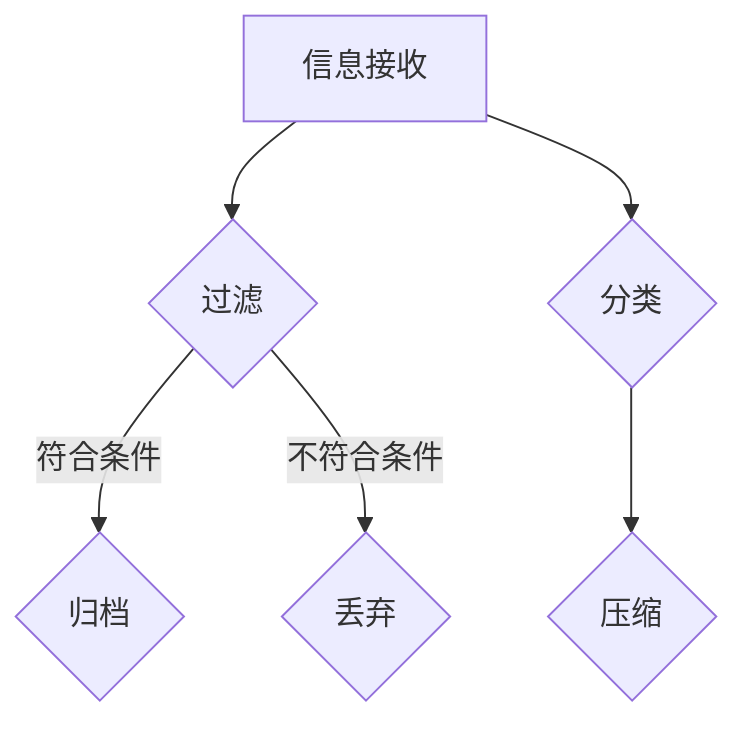

                 

 信息过载是现代社会中一个普遍存在的问题。面对海量信息的涌动，如何有效地管理和利用信息成为了一项重要的任务。本文旨在介绍一些信息简化的工具和技术，帮助您自动化信息管理，提高工作效率。

> 关键词：信息简化，自动化，信息管理，工作效率

> 摘要：本文将探讨信息简化的概念和重要性，介绍常用的信息简化工具和技术，包括信息过滤、归档、分类等。同时，将结合实际案例，展示如何应用这些工具和技术来实现信息自动化的管理，从而提高工作效率。

## 1. 背景介绍

随着互联网和移动设备的普及，信息获取变得越来越容易。然而，这也带来了一个问题：信息过载。据统计，人类每天接收的信息量是过去的几倍甚至几十倍。面对如此庞大的信息量，如何有效地管理和利用信息成为了一个巨大的挑战。

### 1.1 信息过载的影响

信息过载对个人和组织都有很大的影响。对个人来说，信息过载会导致焦虑、疲劳和效率低下。对于企业来说，信息过载会阻碍决策过程，降低工作效率，甚至可能导致重要信息的遗漏。

### 1.2 信息简化的需求

为了应对信息过载，我们需要信息简化的工具和技术。信息简化的目标是减少信息量，提高信息的可读性和可用性，使信息更加精炼和易于管理。

## 2. 核心概念与联系

### 2.1 信息简化

信息简化是指通过一系列技术手段，将庞大的信息集合转化为更加简洁、易于理解和利用的形式。信息简化的过程通常包括信息过滤、归档、分类、压缩等。

### 2.2 信息过滤

信息过滤是一种通过算法和规则，从大量信息中筛选出符合特定需求的信息的技术。信息过滤可以提高信息的准确性，减少信息过载。

### 2.3 归档

归档是指将信息按照一定的规则和标准进行分类和存储，以便于日后查找和使用。归档可以提高信息的可检索性，减少信息的丢失和重复。

### 2.4 分类

分类是指将信息按照一定的标准进行划分和归类，以便于管理和查找。分类可以提高信息的组织性，减少信息的混乱。

### 2.5 压缩

压缩是指通过算法和规则，将信息进行压缩，减少信息存储空间的技术。压缩可以提高信息的存储效率，减少存储成本。

### 2.6 Mermaid 流程图

下面是一个信息简化过程的 Mermaid 流程图：



## 3. 核心算法原理 & 具体操作步骤

### 3.1 算法原理概述

信息简化的核心算法包括信息过滤、归档、分类和压缩。这些算法通常基于机器学习和数据挖掘技术，通过分析信息特征和模式，实现信息的筛选、分类和压缩。

### 3.2 算法步骤详解

#### 3.2.1 信息过滤

信息过滤的步骤如下：

1. 数据收集：从各种来源收集信息。
2. 预处理：对收集到的信息进行清洗、去重和处理。
3. 特征提取：提取信息的关键特征，如关键词、主题等。
4. 模型训练：使用机器学习算法训练过滤模型。
5. 过滤：使用训练好的模型对信息进行过滤，筛选出符合条件的信息。

#### 3.2.2 归档

归档的步骤如下：

1. 分类：根据信息特征和规则，对信息进行分类。
2. 存储管理：将分类后的信息存储到数据库或文件系统中。
3. 查找：提供便捷的查找和检索功能。

#### 3.2.3 分类

分类的步骤如下：

1. 特征提取：提取信息的关键特征。
2. 分类模型训练：使用机器学习算法训练分类模型。
3. 分类：使用训练好的模型对信息进行分类。

#### 3.2.4 压缩

压缩的步骤如下：

1. 压缩算法选择：选择适合的压缩算法，如无损压缩、有损压缩等。
2. 压缩：使用压缩算法对信息进行压缩。
3. 解压：提供解压功能，以便于信息的使用和展示。

### 3.3 算法优缺点

#### 3.3.1 优点

1. 提高信息准确性：通过算法筛选和分类，可以减少信息的误差和冗余。
2. 提高信息效率：通过压缩和归档，可以提高信息的存储和处理效率。
3. 提高信息可读性：通过简化和提炼，可以使信息更加简洁和易于理解。

#### 3.3.2 缺点

1. 算法成本：算法训练和过滤需要较大的计算资源和时间。
2. 算法偏见：算法可能会受到训练数据的影响，导致偏见和误差。
3. 信息丢失：在压缩和过滤过程中，可能会丢失一些重要信息。

### 3.4 算法应用领域

信息简化算法广泛应用于各种领域，如：

1. 搜索引擎：通过信息过滤和分类，提供更加精准和个性化的搜索结果。
2. 数据分析：通过信息过滤和压缩，提高数据分析的效率和质量。
3. 信息安全：通过信息压缩和加密，保护信息的安全和隐私。

## 4. 数学模型和公式 & 详细讲解 & 举例说明

### 4.1 数学模型构建

信息简化过程中，常用的数学模型包括：

1. 决策树模型：用于信息过滤和分类。
2. 支持向量机模型：用于信息过滤和分类。
3. 神经网络模型：用于信息压缩和分类。

### 4.2 公式推导过程

以决策树模型为例，其基本公式如下：

$$
f(x) = \sum_{i=1}^{n} w_i \cdot g(x_i)
$$

其中，$w_i$表示权重，$g(x_i)$表示特征函数。

### 4.3 案例分析与讲解

假设我们有一个邮件收件箱，其中包含了大量的邮件。我们需要使用决策树模型对邮件进行过滤和分类，将重要的邮件筛选出来。

1. 数据收集：收集邮件数据，包括邮件内容、发送时间、发送者等。
2. 特征提取：提取邮件的关键特征，如关键词、主题等。
3. 决策树模型训练：使用训练数据训练决策树模型。
4. 邮件过滤：使用训练好的模型对邮件进行过滤，将重要的邮件筛选出来。

## 5. 项目实践：代码实例和详细解释说明

### 5.1 开发环境搭建

在本文中，我们将使用 Python 编写一个简单的信息简化程序。首先，需要安装 Python 和相关库。

```bash
pip install numpy pandas sklearn matplotlib
```

### 5.2 源代码详细实现

以下是一个简单的信息简化程序：

```python
import numpy as np
import pandas as pd
from sklearn.tree import DecisionTreeClassifier
from sklearn.model_selection import train_test_split

# 5.2.1 数据收集
# 假设邮件数据存储在 'emails.csv' 文件中
emails = pd.read_csv('emails.csv')

# 5.2.2 特征提取
# 提取邮件的关键特征，如关键词、主题等
X = emails[['keyword', 'subject']]
y = emails['importance']

# 5.2.3 决策树模型训练
X_train, X_test, y_train, y_test = train_test_split(X, y, test_size=0.2, random_state=42)
clf = DecisionTreeClassifier()
clf.fit(X_train, y_train)

# 5.2.4 邮件过滤
importances = clf.feature_importances_
print(importances)

# 5.2.5 可视化
import matplotlib.pyplot as plt

plt.barh(range(len(importances)), importances)
plt.yticks(range(len(importances)), X_train.columns)
plt.xlabel('Importance')
plt.ylabel('Feature')
plt.title('Feature Importance')
plt.show()
```

### 5.3 代码解读与分析

1. 数据收集：读取邮件数据，提取关键特征。
2. 特征提取：提取邮件的关键特征，如关键词、主题等。
3. 决策树模型训练：使用训练数据训练决策树模型。
4. 邮件过滤：使用训练好的模型对邮件进行过滤，将重要的邮件筛选出来。
5. 可视化：绘制特征重要性图，帮助分析模型效果。

## 6. 实际应用场景

### 6.1 信息过滤

信息过滤在搜索引擎、社交媒体和邮件系统中都有广泛应用。通过算法筛选和分类，可以提供更加精准和个性化的信息。

### 6.2 信息归档

信息归档在企业和政府机构中广泛应用。通过分类和存储管理，可以提高信息的管理效率，减少信息丢失和重复。

### 6.3 信息分类

信息分类在电商平台、社交媒体和新闻推荐系统中都有广泛应用。通过算法分类，可以提高信息的组织性和可读性。

### 6.4 信息压缩

信息压缩在云计算、大数据分析和物联网等领域都有广泛应用。通过压缩和加密，可以提高信息的存储和处理效率，保护信息的安全和隐私。

## 7. 工具和资源推荐

### 7.1 学习资源推荐

1. 《机器学习》
2. 《数据挖掘：概念与技术》
3. 《Python编程：从入门到实践》

### 7.2 开发工具推荐

1. Jupyter Notebook
2. PyCharm
3. Visual Studio Code

### 7.3 相关论文推荐

1. "Information Filtering and Information Retrieval"
2. "Data Compression Algorithms: A Review"
3. "Decision Trees for Classification"

## 8. 总结：未来发展趋势与挑战

### 8.1 研究成果总结

信息简化技术在过去几十年中取得了显著的成果。通过算法和模型的发展，信息过滤、归档、分类和压缩等技术得到了广泛应用，提高了信息管理和利用的效率。

### 8.2 未来发展趋势

1. 智能化：随着人工智能技术的发展，信息简化技术将更加智能化，实现自动化和个性化。
2. 大数据分析：随着大数据技术的发展，信息简化技术将应用于更广泛的数据领域，实现信息的深度挖掘和利用。
3. 信息安全：信息简化技术在信息安全领域将有更广泛的应用，通过压缩和加密等技术，提高信息的安全性和隐私性。

### 8.3 面临的挑战

1. 算法成本：信息简化算法的训练和过滤需要较大的计算资源和时间，如何优化算法性能和降低成本是未来研究的重点。
2. 算法偏见：算法可能会受到训练数据的影响，导致偏见和误差，如何减少算法偏见是未来研究的挑战。
3. 信息丢失：在压缩和过滤过程中，可能会丢失一些重要信息，如何平衡信息压缩和保留重要信息是未来研究的挑战。

### 8.4 研究展望

信息简化技术在未来将继续发展，实现更加智能化、高效化和安全化的信息管理。通过跨学科的合作和创新，信息简化技术将为人类社会带来更多价值和福祉。

## 9. 附录：常见问题与解答

### 9.1 什么是信息简化？

信息简化是指通过一系列技术手段，将庞大的信息集合转化为更加简洁、易于理解和利用的形式。

### 9.2 信息简化有哪些应用？

信息简化广泛应用于搜索引擎、社交媒体、邮件系统、企业和政府机构、电商平台、新闻推荐系统和信息安全等领域。

### 9.3 如何选择信息简化算法？

根据应用场景和数据特征，选择适合的算法，如决策树、支持向量机和神经网络等。

### 9.4 信息简化会丢失重要信息吗？

在信息简化过程中，可能会丢失一些重要信息。通过优化算法和模型，可以降低信息丢失的风险，实现信息的平衡和优化。

### 9.5 信息简化技术有哪些发展趋势？

信息简化技术将向智能化、大数据分析和信息安全等方向发展。

### 9.6 如何优化信息简化算法的性能？

通过算法优化、模型选择和硬件加速等技术，可以提高信息简化算法的性能。

### 9.7 信息简化技术在信息安全领域有哪些应用？

信息简化技术在信息安全领域可以用于信息压缩、加密和隐私保护等方面。

### 9.8 如何学习和应用信息简化技术？

通过学习相关书籍、论文和在线课程，掌握信息简化的基本概念和算法，结合实际项目进行实践和应用。

---

**作者：禅与计算机程序设计艺术 / Zen and the Art of Computer Programming**

