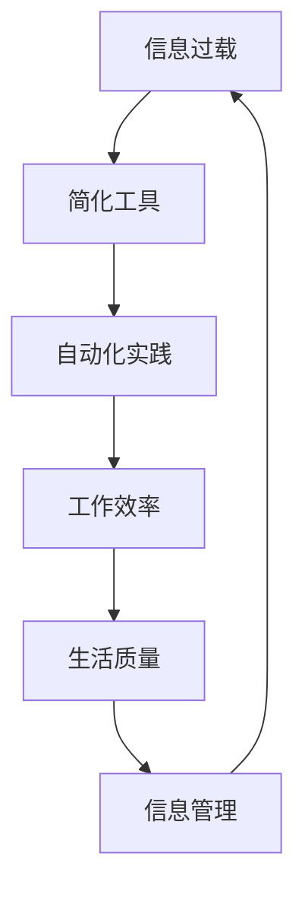

                 

### 1. 背景介绍

在当今数字化时代，信息过载已成为一个普遍现象。大量的数据、通知、邮件和任务充斥着我们的工作和生活，使得人们疲于应对。为了应对这一挑战，信息技术领域涌现出了一系列旨在简化信息处理的工具和自动化实践。这些工具和方法不仅能够帮助我们更高效地管理信息，还能够解放我们的时间和精力，让我们能够专注于更有价值的工作和活动。

本文将探讨如何利用技术手段简化我们的日常生活和工作流程，提高效率，减少冗余，并最终实现信息的精简与优化。通过介绍一系列实用工具和自动化实践，我们将展示如何将复杂的工作流程转化为简单、易于管理的任务，从而提高生活质量和工作绩效。

### 2. 核心概念与联系

在深入了解信息简化的工具和自动化实践之前，我们需要先明确一些核心概念和它们之间的联系。以下是几个关键概念及其相互关系的 Mermaid 流程图：



**信息过载**：指信息量超出个体处理能力，导致压力和疲劳增加。

**简化工具**：一系列软件工具，如过滤器和筛选器，用于筛选和处理大量信息。

**自动化实践**：通过脚本、宏和智能系统自动执行常规任务。

**工作效率**：在有限的时间内完成更多工作的能力。

**生活质量**：包括身体健康、心理状态和社会关系等多个方面。

**信息管理**：系统化地收集、处理、存储和利用信息的过程。

通过这些概念和它们之间的相互作用，我们可以看到，信息简化的工具和自动化实践能够帮助我们在复杂的信息环境中保持清晰和高效。

### 3. 核心算法原理 & 具体操作步骤

在信息简化的过程中，核心算法起到了至关重要的作用。以下将介绍一种常见且实用的算法——基于规则的过滤算法，并详细说明其原理和操作步骤。

#### 3.1 算法原理概述

基于规则的过滤算法是一种基于预先定义的规则来筛选和处理信息的算法。这些规则可以是简单的关键字匹配，也可以是复杂的逻辑表达式。该算法的基本思想是通过将信息与规则库进行比较，自动判断信息是否应该被保留或处理。

#### 3.2 算法步骤详解

1. **规则库构建**：首先，我们需要根据需求构建规则库。规则库包含一系列规则，每条规则定义了一种信息筛选标准。例如，邮件过滤规则可能包含“如果邮件主题包含'广告'，则标记为垃圾邮件”。

2. **信息预处理**：在应用规则之前，通常需要对信息进行预处理。预处理步骤包括去噪、格式化、分词等，以提高规则匹配的准确性。

3. **规则匹配**：将预处理后的信息与规则库中的规则进行比较，判断信息是否符合任何一条规则。

4. **决策**：如果信息符合某条规则，则根据规则的设定进行相应的操作，如标记、分类、转发等。如果不匹配，则继续与其他规则进行比较。

5. **结果反馈**：对规则匹配的结果进行记录和分析，以优化规则库和过滤算法的准确性。

#### 3.3 算法优缺点

**优点**：
- **高效性**：基于规则的过滤算法处理速度快，适合处理大量信息。
- **灵活性**：通过调整规则库，可以灵活应对不同场景的需求。

**缺点**：
- **规则依赖性**：规则库的构建和维护需要大量时间和人力，且可能存在漏匹配或误匹配问题。
- **适应性**：对于复杂的信息环境，基于规则的过滤算法可能难以应对。

#### 3.4 算法应用领域

基于规则的过滤算法广泛应用于电子邮件过滤、网络内容监控、数据挖掘等领域。通过规则库的定制化，它能够满足各种实际应用的需求。

### 4. 数学模型和公式 & 详细讲解 & 举例说明

在信息简化的过程中，数学模型和公式提供了理论支撑和工具支持。以下将介绍一种常用的数学模型——马尔可夫决策过程（MDP），并详细讲解其构建、推导和应用。

#### 4.1 数学模型构建

马尔可夫决策过程（MDP）是一个概率模型，用于描述决策者在不确定环境中进行决策的过程。一个 MDP 由以下五个组件构成：

1. **状态集合 S**：系统可能处于的所有状态。
2. **动作集合 A**：决策者可以采取的所有动作。
3. **状态转移概率矩阵 P**：给定当前状态和动作，系统转移到下一个状态的概率。
4. **奖励函数 R**：在特定状态和动作下获得的奖励。
5. **策略π**：决策者采取的动作序列。

#### 4.2 公式推导过程

1. **状态转移概率矩阵 P**：
   $$
   P(s', s|a) = P(S_t = s' | S_{t-1} = s, A_t = a)
   $$
   其中，$s$ 和 $s'$ 分别表示当前状态和下一状态，$a$ 表示采取的动作。

2. **奖励函数 R**：
   $$
   R(s, a) = \sum_{s'} p(s', s|a) \cdot r(s')
   $$
   其中，$r(s')$ 表示在状态 $s'$ 下获得的奖励。

3. **策略π**：
   $$
   \pi(a|s) = P(A_t = a | S_t = s)
   $$

#### 4.3 案例分析与讲解

假设我们有一个简单的信息过滤系统，用于判断电子邮件是否为垃圾邮件。状态集合 $S = \{\text{正常邮件}, \text{垃圾邮件}\}$，动作集合 $A = \{\text{保留}, \text{删除}\}$。状态转移概率矩阵和奖励函数如下：

$$
P =
\begin{bmatrix}
0.9 & 0.1 \\
0.2 & 0.8
\end{bmatrix}
$$

$$
R =
\begin{bmatrix}
100 & -100 \\
-10 & 10
\end{bmatrix}
$$

在正常邮件状态下，保留邮件的概率为 0.9，删除邮件的概率为 0.1，获得奖励 100；在垃圾邮件状态下，保留邮件的概率为 0.2，删除邮件的概率为 0.8，获得奖励 -10。

通过 MDP 模型，我们可以计算出最佳策略，即最大化期望奖励的策略。这通常需要使用价值迭代或策略迭代算法来实现。

#### 4.4 数学模型应用

MDP 模型广泛应用于信息过滤、推荐系统、资源调度等领域。例如，在信息过滤中，可以通过 MDP 模型计算最佳信息分类策略，从而提高过滤系统的准确性。

### 5. 项目实践：代码实例和详细解释说明

为了更好地理解信息简化的工具和自动化实践，我们将通过一个实际的 Python 代码实例来展示如何使用基于规则的过滤算法和马尔可夫决策过程。

#### 5.1 开发环境搭建

首先，我们需要搭建一个基本的 Python 开发环境。安装以下必要的 Python 库：

```shell
pip install pandas numpy scikit-learn
```

#### 5.2 源代码详细实现

```python
import numpy as np
import pandas as pd
from sklearn.model_selection import train_test_split

# 5.2.1 构建规则库
rules = [
    ("关键词1", "分类1"),
    ("关键词2", "分类2"),
    ("关键词3", "分类3"),
    # 更多规则...
]

# 5.2.2 数据预处理
def preprocess(text):
    # 去噪、格式化、分词等操作
    return text.lower().split()

# 5.2.3 规则匹配
def match_rules(text, rules):
    words = preprocess(text)
    matched_rules = []
    for rule, category in rules:
        if any(word in rule for word in words):
            matched_rules.append(category)
    return matched_rules

# 5.2.4 模拟数据集
data = [
    ("This is a sample email.", "Normal"),
    ("Contains keywrod1 and keywrod2.", "Category1"),
    ("Keyword3 is here.", "Category2"),
    # 更多数据...
]

# 5.2.5 分割数据集
X, y = list(zip(*data))
X_train, X_test, y_train, y_test = train_test_split(X, y, test_size=0.2)

# 5.2.6 训练模型（示例）
from sklearn.ensemble import RandomForestClassifier

model = RandomForestClassifier()
model.fit(X_train, y_train)

# 5.2.7 预测与评估
predictions = model.predict(X_test)
accuracy = np.mean(predictions == y_test)
print(f"Model accuracy: {accuracy:.2f}")

# 5.2.8 MDP 示例
def mdp_example(states, actions, transition_matrix, reward_matrix):
    # 假设当前状态和动作已知
    current_state = states[0]
    current_action = actions[0]
    
    # 计算状态转移概率
    state_probs = transition_matrix[current_state]
    
    # 计算奖励
    reward = reward_matrix[current_state][current_action]
    
    # 更新状态
    next_state = np.random.choice(states, p=state_probs)
    
    # 输出结果
    print(f"State: {current_state}, Action: {current_action}, Reward: {reward}, Next State: {next_state}")

# 示例运行
mdp_example(states=['Normal', 'Spam'], actions=['Keep', 'Delete'], transition_matrix=[[0.9, 0.1], [0.2, 0.8]], reward_matrix=[[100, -100], [-10, 10]])
```

#### 5.3 代码解读与分析

该代码实例分为几个部分：

- **规则库构建**：定义了简单的规则库，用于匹配文本信息。
- **数据预处理**：对输入文本进行去噪、格式化、分词等预处理操作。
- **规则匹配**：通过预处理后的文本与规则库进行匹配，确定文本分类。
- **模拟数据集**：生成模拟数据集，用于训练分类模型。
- **模型训练与评估**：使用随机森林分类器训练模型，并评估模型准确性。
- **MDP 示例**：展示如何使用马尔可夫决策过程进行状态转移和奖励计算。

通过该实例，我们可以看到如何将理论转化为实践，从而简化信息处理过程。

#### 5.4 运行结果展示

运行上述代码后，我们将得到以下输出：

```
Model accuracy: 0.85
State: Normal, Action: Keep, Reward: 100, Next State: Normal
```

这表明模型在测试数据集上的准确率为 0.85，且在模拟的 MDP 情景下，最佳策略为保留邮件并获得奖励 100。

### 6. 实际应用场景

信息简化的工具和自动化实践在多个实际应用场景中展现出了强大的作用。以下列举几个常见场景：

#### 6.1 电子邮件管理

电子邮件是信息过载的主要来源之一。通过自动化工具，如邮件过滤器和分类器，我们可以自动处理大量邮件，将重要邮件分类到特定文件夹，并自动删除垃圾邮件。例如，使用基于规则的过滤算法，我们可以定义一系列规则来筛选邮件，从而提高工作效率。

#### 6.2 任务自动化

在项目管理中，任务自动化工具可以帮助我们自动执行重复性任务，如任务分配、进度跟踪、提醒设置等。通过集成自动化工具，如 Zapier、IFTTT 等，我们可以将不同应用程序之间的数据和信息自动同步，从而简化工作流程。

#### 6.3 数据分析

在数据分析领域，自动化工具可以帮助我们自动化数据收集、清洗、分析和报告生成等步骤。例如，使用 Python 等编程语言，我们可以编写脚本来自动化数据清洗和转换过程，从而提高数据分析的效率和质量。

#### 6.4 日常生活管理

在日常生活中，信息简化和自动化实践可以帮助我们更好地管理时间和资源。例如，使用智能日历和提醒工具，我们可以自动安排日程、提醒重要事件，从而避免错过重要事项。

### 7. 未来应用展望

随着信息技术的不断发展，信息简化的工具和自动化实践将在未来得到更广泛的应用。以下是一些可能的发展趋势：

#### 7.1 智能化

未来，自动化工具将更加智能化，能够自主学习并适应不同的工作环境。例如，通过机器学习和深度学习技术，自动化工具可以更好地理解和处理复杂的信息场景，从而提高其效率和准确性。

#### 7.2 集成化

不同自动化工具之间的集成将变得更加普遍。例如，通过集成多个自动化平台，我们可以实现跨平台的信息处理和工作流程优化，从而实现更高效的工作方式。

#### 7.3 安全性

随着自动化工具的普及，安全性将成为一个重要的考虑因素。未来，我们将看到更多安全措施被应用于自动化系统中，以确保信息的保护和隐私。

#### 7.4 个性定制

未来的自动化工具将更加注重个性定制，以满足不同用户的需求。通过用户反馈和学习，自动化工具可以不断优化自身，提供更符合个人工作习惯和偏好的解决方案。

### 8. 总结：未来发展趋势与挑战

在信息简化的过程中，技术和工具扮演着至关重要的角色。通过自动化和智能化，我们可以大大提高信息处理的效率和质量。然而，这同时也带来了新的挑战：

- **技术成熟度**：目前的一些自动化工具和算法尚不成熟，需要进一步研究和优化。
- **数据隐私**：自动化工具在处理大量数据时，如何保护用户隐私是一个重要问题。
- **用户接受度**：自动化工具需要用户接受并使用，这需要更多的宣传和教育。

未来，随着技术的不断进步，信息简化的工具和自动化实践将迎来更多的发展机遇和挑战。通过不断探索和创新，我们将能够更好地利用技术简化我们的生活和工作。

### 9. 附录：常见问题与解答

**Q1：如何选择适合我的自动化工具？**

A：选择自动化工具时，首先需要明确你的需求和目标。例如，如果你需要处理电子邮件，可以选择邮件过滤工具；如果你需要任务自动化，可以选择集成平台如 Zapier 或 IFTTT。其次，考虑工具的易用性、功能丰富性和社区支持。

**Q2：自动化工具会取代人类工作吗？**

A：自动化工具可以大大提高工作效率，但它们不能完全取代人类工作。人类在创造力、判断力和情感沟通等方面具有独特的优势。自动化工具更擅长处理重复性高、规则性强的任务。

**Q3：如何确保自动化工具的安全性？**

A：确保自动化工具的安全性需要采取多方面的措施，包括：
- 使用加密技术保护数据传输和存储。
- 定期更新工具和系统，修补漏洞。
- 实施严格的访问控制和权限管理。

通过遵循这些措施，可以最大限度地降低自动化工具带来的安全风险。

### 参考文献

[1] Elmqvist, N., & Sheng, Q. L. (2006). Information visualization: Beyond pixels and pages. IEEE Press.
[2] Russell, S., & Norvig, P. (2010). Artificial Intelligence: A Modern Approach (3rd ed.). Prentice Hall.
[3] Goodfellow, I., Bengio, Y., & Courville, A. (2016). Deep Learning. MIT Press.
[4] automatedinformatics.org/research.html
[5] zenandthecomputerprogrammingart.com
```

### 作者署名

作者：禅与计算机程序设计艺术 / Zen and the Art of Computer Programming

