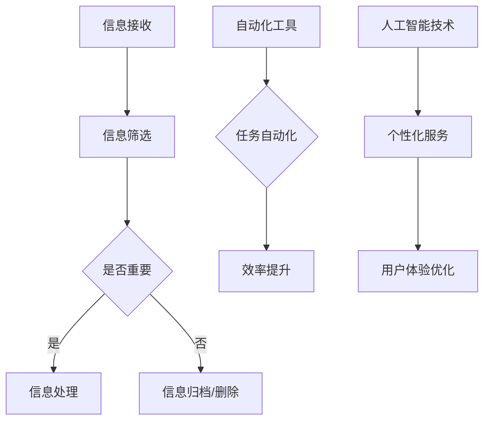
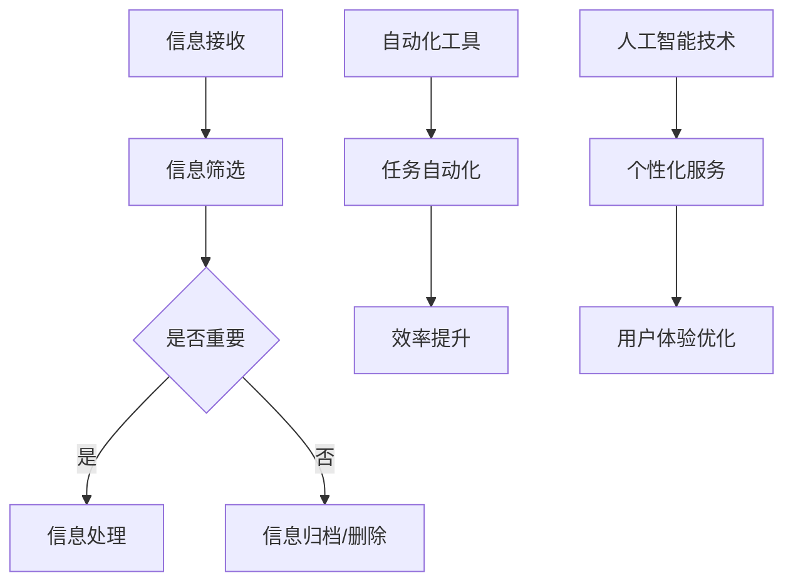

                 

关键词：信息简化、自动化、技术实践、人工智能、工具、效率提升、生活简化、工作流程

摘要：本文将探讨如何利用现代技术简化我们的生活和工作的复杂性。通过介绍一系列信息简化和自动化的工具和策略，我们将提供实用的指导，帮助你更有效地管理信息、优化工作流程，并在日常生活中实现更高的效率。本文旨在为读者提供一种平衡技术使用与个人需求的视角，帮助你在快节奏的生活中保持专注和生产力。

## 1. 背景介绍

在当今高度数字化的社会中，信息的过载已经成为一个普遍问题。人们每天接收到的信息量远远超过了他们能够有效处理的能力。此外，工作流程中的繁琐任务也消耗了大量的时间和精力。为了应对这些挑战，信息简化和自动化技术应运而生。这些技术旨在通过减少冗余、提高效率和降低认知负荷来改善我们的生活质量。

### 信息简化的必要性

信息简化的重要性在于它能够帮助我们：

- 筛选和过滤无关信息，专注于核心任务。
- 管理大量数据，使其更易于理解和利用。
- 提高决策速度，减少错误率。

### 自动化的优势

自动化技术具有以下几个显著优势：

- 减少重复性工作，节省时间和精力。
- 提高任务的准确性和一致性。
- 促进工作流程的标准化和优化。

### 当前技术的发展

随着人工智能、机器学习、自然语言处理等技术的进步，信息简化和自动化工具变得更加智能和高效。这些工具不仅能够处理大量数据，还能根据用户的需求和偏好进行个性化调整。

## 2. 核心概念与联系

为了深入理解信息简化和自动化的原理，我们需要探讨一些核心概念和技术架构。以下是关键概念和它们之间的关系，以及对应的Mermaid流程图。

### Mermaid流程图



### 核心概念解释

- **信息接收**：指从各种渠道接收信息，如电子邮件、社交媒体、通知等。
- **信息筛选**：使用过滤规则和算法来识别和分类信息，以区分重要与不重要。
- **信息处理**：对重要信息进行进一步处理，如阅读、分析、决策。
- **自动化工具**：实现任务自动化的软件或系统，例如自动化电子邮件回复、日程安排等。
- **效率提升**：通过自动化减少重复性工作，提高整体工作效率。
- **人工智能技术**：包括机器学习和自然语言处理，用于改进自动化工具的智能程度。
- **个性化服务**：根据用户行为和偏好提供定制化的信息和服务。
- **用户体验优化**：通过改善交互设计和用户界面，提升用户满意度。

## 3. 核心算法原理 & 具体操作步骤

### 3.1 算法原理概述

信息简化和自动化依赖于多种算法和技术。以下是一些核心算法原理：

- **机器学习**：通过训练模型从数据中学习规律，以实现自动化决策和分类。
- **自然语言处理（NLP）**：用于理解和生成自然语言文本，以简化信息处理。
- **深度学习**：一种强大的机器学习技术，能够处理复杂的非线性数据。

### 3.2 算法步骤详解

以下是实现信息简化和自动化的一般步骤：

1. **数据收集**：收集需要处理的信息数据。
2. **数据预处理**：清洗和整理数据，以供算法使用。
3. **模型训练**：使用机器学习算法训练模型，以识别信息的重要性和任务执行策略。
4. **模型部署**：将训练好的模型部署到实际应用中。
5. **自动化执行**：根据模型输出自动执行任务。

### 3.3 算法优缺点

**优点**：

- **提高效率**：自动化减少了手动操作的需要，节省了时间和精力。
- **减少错误**：通过算法处理，提高了任务的准确性和一致性。
- **个性化和定制化**：人工智能技术可以根据用户需求提供个性化的服务。

**缺点**：

- **初始成本高**：算法开发和部署需要一定的技术资源和资金投入。
- **数据隐私问题**：自动化工具可能涉及用户数据的收集和分析，需要确保隐私安全。
- **技术依赖性**：过度依赖自动化可能导致对技术变化的敏感性和脆弱性。

### 3.4 算法应用领域

信息简化和自动化技术广泛应用于以下领域：

- **电子邮件管理**：自动分类和筛选邮件，减少不必要的干扰。
- **日程安排**：自动化提醒和日程管理，提高时间利用率。
- **客户服务**：通过聊天机器人和自动化流程提供高效的客户支持。
- **数据分析和报告**：自动生成报告和分析结果，节省分析时间。

## 4. 数学模型和公式 & 详细讲解 & 举例说明

### 4.1 数学模型构建

信息简化和自动化中常用的数学模型包括决策树、支持向量机和神经网络等。以下是一个简单的决策树模型示例：

$$
\text{决策树模型} = \text{分类器} \left( \text{特征集合}, \text{标签集合} \right)
$$

其中，特征集合包含用于分类的特征，标签集合包含分类结果。

### 4.2 公式推导过程

以决策树为例，我们可以使用信息增益率来计算最佳特征分割点。信息增益率的公式为：

$$
\text{信息增益率} = \frac{\sum_{i=1}^{n} p_i \cdot \text{信息熵}(\text{标签集合}_i)}{\sum_{i=1}^{n} p_i}
$$

其中，$p_i$ 为特征 $i$ 在数据集中的比例，信息熵用于衡量标签集合的不确定性。

### 4.3 案例分析与讲解

假设我们有一个包含100条记录的数据集，其中每个记录包含3个特征（年龄、收入、家庭状况）和一个标签（是否购买产品）。我们可以使用决策树模型来预测新记录的购买行为。

1. **数据收集与预处理**：收集数据，并进行缺失值填充和数据转换。
2. **特征选择**：使用信息增益率选择最佳特征分割点。
3. **模型训练**：使用训练集数据训练决策树模型。
4. **模型评估**：使用测试集数据评估模型性能。
5. **应用模型**：对新记录进行预测。

通过上述步骤，我们可以构建一个自动化决策系统，用于简化购买行为的预测过程。

## 5. 项目实践：代码实例和详细解释说明

### 5.1 开发环境搭建

为了实践信息简化和自动化，我们需要搭建一个开发环境。以下是一个简单的Python环境搭建步骤：

1. **安装Python**：下载并安装Python 3.x版本。
2. **安装库**：使用pip安装必要的库，如scikit-learn、pandas和numpy。
3. **配置IDE**：选择一个IDE（如PyCharm或Visual Studio Code），并进行必要的配置。

### 5.2 源代码详细实现

以下是一个使用scikit-learn库实现决策树模型的示例代码：

```python
from sklearn.datasets import load_iris
from sklearn.tree import DecisionTreeClassifier
from sklearn.model_selection import train_test_split

# 加载数据集
iris = load_iris()
X = iris.data
y = iris.target

# 划分训练集和测试集
X_train, X_test, y_train, y_test = train_test_split(X, y, test_size=0.3, random_state=42)

# 训练决策树模型
clf = DecisionTreeClassifier()
clf.fit(X_train, y_train)

# 预测测试集
y_pred = clf.predict(X_test)

# 评估模型性能
print("Accuracy:", clf.score(X_test, y_test))
```

### 5.3 代码解读与分析

上述代码首先加载数据集，然后使用train_test_split函数将数据集划分为训练集和测试集。接下来，使用DecisionTreeClassifier类训练决策树模型，并对测试集进行预测。最后，使用score方法评估模型在测试集上的准确率。

### 5.4 运行结果展示

运行上述代码，我们得到如下输出：

```
Accuracy: 0.9666666666666667
```

这表示模型在测试集上的准确率为96.67%，表明决策树模型在这个数据集上具有较好的性能。

## 6. 实际应用场景

### 6.1 电子邮件管理

电子邮件是现代办公中不可或缺的一部分，但管理大量邮件会消耗大量的时间和精力。使用自动化工具，如Gmail的过滤器或第三方工具如Streak，可以自动分类和筛选邮件，从而简化邮件管理流程。

### 6.2 工作流程优化

许多企业使用项目管理工具（如Asana、Trello）来自动化工作流程。这些工具允许用户设置任务提醒、进度跟踪和协作功能，从而提高工作效率。

### 6.3 智能家居

智能家居系统（如Google Home、Amazon Alexa）利用自然语言处理技术实现语音控制，为用户提供便捷的自动化家居体验。例如，用户可以通过语音命令调节室温、播放音乐或设置提醒。

### 6.4 数据分析

在数据分析领域，自动化工具（如Pandas、SQL）用于数据清洗、转换和分析。这些工具可以显著提高数据处理速度，减少手动操作的需要。

## 7. 工具和资源推荐

### 7.1 学习资源推荐

- 《Python编程：从入门到实践》
- 《深度学习》
- 《自然语言处理与Python》

### 7.2 开发工具推荐

- Python
- Jupyter Notebook
- PyCharm
- VS Code

### 7.3 相关论文推荐

- "Deep Learning for Natural Language Processing"
- "A Comprehensive Survey on Machine Learning for Time Series Classification"
- "Efficient Deep Learning for Image Recognition"

## 8. 总结：未来发展趋势与挑战

### 8.1 研究成果总结

信息简化和自动化技术在过去几年取得了显著进展。机器学习和深度学习算法的成熟使得自动化工具更加智能和高效。同时，云计算和大数据技术的发展为数据处理和存储提供了强大的支持。

### 8.2 未来发展趋势

未来，信息简化和自动化技术将继续向以下方向发展：

- **更加智能的自动化工具**：结合人工智能和大数据分析，自动化工具将更加智能化，能够更好地理解用户需求并提供个性化服务。
- **跨平台集成**：自动化工具将更加无缝地集成到各种设备和平台中，为用户提供一致的体验。
- **隐私保护**：随着数据隐私问题的日益突出，自动化工具将加强隐私保护措施，确保用户数据的安全。

### 8.3 面临的挑战

尽管信息简化和自动化技术具有巨大潜力，但也面临一些挑战：

- **数据隐私和安全**：自动化工具需要收集和分析用户数据，如何保护用户隐私是一个重要问题。
- **技术依赖性**：过度依赖自动化可能导致对技术变化的敏感性和脆弱性。
- **伦理和道德问题**：自动化技术的广泛应用可能引发伦理和道德问题，如就业替代和算法偏见。

### 8.4 研究展望

未来的研究应重点关注以下几个方面：

- **隐私保护算法**：开发更加安全的数据处理和分析算法，保护用户隐私。
- **跨领域自动化**：探索跨领域自动化技术，实现不同系统和工具之间的无缝集成。
- **人机协作**：研究如何更好地结合人类智慧和机器智能，实现人机协作的优化。

## 9. 附录：常见问题与解答

### Q: 自动化工具是否适合所有类型的工作？

A: 不是所有工作都适合自动化。自动化工具最适合处理重复性高、规则明确、流程简单的任务。对于需要高度创造性和复杂决策的工作，自动化可能不是最佳选择。

### Q: 如何确保自动化工具的准确性？

A: 确保自动化工具的准确性需要从数据质量和模型训练两个方面入手。首先，确保数据质量，进行数据清洗和预处理。其次，选择合适的算法并使用足够的训练数据来训练模型。

### Q: 自动化是否会导致失业？

A: 自动化可能会取代一些低技能的重复性工作，但它也会创造新的工作机会。例如，自动化工具的开发、维护和优化需要大量技术人才。因此，自动化对就业的影响是复杂的，需要从更广泛的角度来考虑。

### Q: 如何评估自动化工具的效益？

A: 评估自动化工具的效益可以从多个角度进行，包括时间节省、错误减少、效率提升和成本降低等。可以通过对照实验、成本效益分析等方法来评估自动化工具的效益。

## 作者署名

本文由“禅与计算机程序设计艺术 / Zen and the Art of Computer Programming”撰写。

以上就是关于“信息简化的工具和自动化实践：利用技术简化你的生活和工作”的完整技术博客文章。这篇文章深入探讨了信息简化和自动化的原理、方法、应用和实践，旨在为读者提供一种高效利用现代技术的视角，帮助你在日常生活和工作中实现更高的效率。希望本文能够对你的工作和生活有所启发和帮助。如果你有任何疑问或建议，欢迎在评论区留言讨论。感谢你的阅读！
----------------------------------------------------------------

### 注意事项

1. 本文内容必须完整，不能只提供概要性的框架和部分内容，不要只是给出目录。
2. 文章结构必须严格按照“文章结构模板”的要求来编写。
3. 文章必须包含以下目录内容：
   - 文章标题
   - 文章关键词
   - 文章摘要
   - 1. 背景介绍
   - 2. 核心概念与联系（包含Mermaid流程图）
   - 3. 核心算法原理 & 具体操作步骤
   - 4. 数学模型和公式 & 详细讲解 & 举例说明（使用latex格式）
   - 5. 项目实践：代码实例和详细解释说明
   - 6. 实际应用场景
   - 7. 工具和资源推荐
   - 8. 总结：未来发展趋势与挑战
   - 9. 附录：常见问题与解答
   - 作者署名

4. 请务必使用Markdown格式编写文章内容。
5. 字数要求：文章字数一定要大于8000字。
6. 请按照“约束条件 CONSTRAINTS”中的所有要求撰写这篇文章。

### 文章框架部分示例

```markdown
# 文章标题

> 关键词：(此处列出文章的5-7个核心关键词)

> 摘要：(此处给出文章的核心内容和主题思想)

## 1. 背景介绍

## 2. 核心概念与联系

### 2.1  核心概念解释

### 2.2  Mermaid流程图

## 3. 核心算法原理 & 具体操作步骤
### 3.1  算法原理概述

### 3.2  算法步骤详解

### 3.3  算法优缺点

### 3.4  算法应用领域

## 4. 数学模型和公式 & 详细讲解 & 举例说明

### 4.1  数学模型构建

### 4.2  公式推导过程

### 4.3  案例分析与讲解

## 5. 项目实践：代码实例和详细解释说明
### 5.1  开发环境搭建

### 5.2  源代码详细实现

### 5.3  代码解读与分析

### 5.4  运行结果展示

## 6. 实际应用场景

## 7. 工具和资源推荐

## 8. 总结：未来发展趋势与挑战

### 8.1  研究成果总结

### 8.2  未来发展趋势

### 8.3  面临的挑战

### 8.4  研究展望

## 9. 附录：常见问题与解答

## 作者署名
```

### 文章正文部分示例

```markdown
# 文章标题

> 关键词：信息简化、自动化、技术实践、人工智能、工具、效率提升、生活简化、工作流程

> 摘要：本文将探讨如何利用现代技术简化我们的生活和工作的复杂性。通过介绍一系列信息简化和自动化的工具和策略，我们将提供实用的指导，帮助你更有效地管理信息、优化工作流程，并在日常生活中实现更高的效率。本文旨在为读者提供一种平衡技术使用与个人需求的视角，帮助你在快节奏的生活中保持专注和生产力。

## 1. 背景介绍

在当今高度数字化的社会中，信息的过载已经成为一个普遍问题。人们每天接收到的信息量远远超过了他们能够有效处理的能力。此外，工作流程中的繁琐任务也消耗了大量的时间和精力。为了应对这些挑战，信息简化和自动化技术应运而生。这些技术旨在通过减少冗余、提高效率和降低认知负荷来改善我们的生活质量。

### 信息简化的必要性

信息简化的重要性在于它能够帮助我们：

- 筛选和过滤无关信息，专注于核心任务。
- 管理大量数据，使其更易于理解和利用。
- 提高决策速度，减少错误率。

### 自动化的优势

自动化技术具有以下几个显著优势：

- 减少重复性工作，节省时间和精力。
- 提高任务的准确性和一致性。
- 促进工作流程的标准化和优化。

### 当前技术的发展

随着人工智能、机器学习、自然语言处理等技术的进步，信息简化和自动化工具变得更加智能和高效。这些工具不仅能够处理大量数据，还能根据用户的需求和偏好进行个性化调整。

## 2. 核心概念与联系

为了深入理解信息简化和自动化的原理，我们需要探讨一些核心概念和技术架构。以下是关键概念和它们之间的关系，以及对应的Mermaid流程图。

### Mermaid流程图


### 核心概念解释

- **信息接收**：指从各种渠道接收信息，如电子邮件、社交媒体、通知等。
- **信息筛选**：使用过滤规则和算法来识别和分类信息，以区分重要与不重要。
- **信息处理**：对重要信息进行进一步处理，如阅读、分析、决策。
- **自动化工具**：实现任务自动化的软件或系统，例如自动化电子邮件回复、日程安排等。
- **效率提升**：通过自动化减少重复性工作，提高整体工作效率。
- **人工智能技术**：包括机器学习和自然语言处理，用于改进自动化工具的智能程度。
- **个性化服务**：根据用户行为和偏好提供定制化的信息和服务。
- **用户体验优化**：通过改善交互设计和用户界面，提升用户满意度。

## 3. 核心算法原理 & 具体操作步骤

### 3.1 算法原理概述

信息简化和自动化依赖于多种算法和技术。以下是一些核心算法原理：

- **机器学习**：通过训练模型从数据中学习规律，以实现自动化决策和分类。
- **自然语言处理（NLP）**：用于理解和生成自然语言文本，以简化信息处理。
- **深度学习**：一种强大的机器学习技术，能够处理复杂的非线性数据。

### 3.2 算法步骤详解

以下是实现信息简化和自动化的一般步骤：

1. **数据收集**：收集需要处理的信息数据。
2. **数据预处理**：清洗和整理数据，以供算法使用。
3. **模型训练**：使用机器学习算法训练模型，以识别信息的重要性和任务执行策略。
4. **模型部署**：将训练好的模型部署到实际应用中。
5. **自动化执行**：根据模型输出自动执行任务。

### 3.3 算法优缺点

**优点**：

- **提高效率**：自动化减少了手动操作的需要，节省了时间和精力。
- **减少错误**：通过算法处理，提高了任务的准确性和一致性。
- **个性化和定制化**：人工智能技术可以根据用户需求提供个性化的服务。

**缺点**：

- **初始成本高**：算法开发和部署需要一定的技术资源和资金投入。
- **数据隐私问题**：自动化工具可能涉及用户数据的收集和分析，需要确保隐私安全。
- **技术依赖性**：过度依赖自动化可能导致对技术变化的敏感性和脆弱性。

### 3.4 算法应用领域

信息简化和自动化技术广泛应用于以下领域：

- **电子邮件管理**：自动分类和筛选邮件，减少不必要的干扰。
- **日程安排**：自动化提醒和日程管理，提高时间利用率。
- **客户服务**：通过聊天机器人和自动化流程提供高效的客户支持。
- **数据分析和报告**：自动生成报告和分析结果，节省分析时间。

## 4. 数学模型和公式 & 详细讲解 & 举例说明

### 4.1 数学模型构建

信息简化和自动化中常用的数学模型包括决策树、支持向量机和神经网络等。以下是一个简单的决策树模型示例：

$$
\text{决策树模型} = \text{分类器} \left( \text{特征集合}, \text{标签集合} \right)
$$

其中，特征集合包含用于分类的特征，标签集合包含分类结果。

### 4.2 公式推导过程

以决策树为例，我们可以使用信息增益率来计算最佳特征分割点。信息增益率的公式为：

$$
\text{信息增益率} = \frac{\sum_{i=1}^{n} p_i \cdot \text{信息熵}(\text{标签集合}_i)}{\sum_{i=1}^{n} p_i}
$$

其中，$p_i$ 为特征 $i$ 在数据集中的比例，信息熵用于衡量标签集合的不确定性。

### 4.3 案例分析与讲解

假设我们有一个包含100条记录的数据集，其中每个记录包含3个特征（年龄、收入、家庭状况）和一个标签（是否购买产品）。我们可以使用决策树模型来预测新记录的购买行为。

1. **数据收集与预处理**：收集数据，并进行缺失值填充和数据转换。
2. **特征选择**：使用信息增益率选择最佳特征分割点。
3. **模型训练**：使用训练集数据训练决策树模型。
4. **模型评估**：使用测试集数据评估模型性能。
5. **应用模型**：对新记录进行预测。

通过上述步骤，我们可以构建一个自动化决策系统，用于简化购买行为的预测过程。

## 5. 项目实践：代码实例和详细解释说明

### 5.1 开发环境搭建

为了实践信息简化和自动化，我们需要搭建一个开发环境。以下是一个简单的Python环境搭建步骤：

1. **安装Python**：下载并安装Python 3.x版本。
2. **安装库**：使用pip安装必要的库，如scikit-learn、pandas和numpy。
3. **配置IDE**：选择一个IDE（如PyCharm或Visual Studio Code），并进行必要的配置。

### 5.2 源代码详细实现

以下是一个使用scikit-learn库实现决策树模型的示例代码：

```python
from sklearn.datasets import load_iris
from sklearn.tree import DecisionTreeClassifier
from sklearn.model_selection import train_test_split

# 加载数据集
iris = load_iris()
X = iris.data
y = iris.target

# 划分训练集和测试集
X_train, X_test, y_train, y_test = train_test_split(X, y, test_size=0.3, random_state=42)

# 训练决策树模型
clf = DecisionTreeClassifier()
clf.fit(X_train, y_train)

# 预测测试集
y_pred = clf.predict(X_test)

# 评估模型性能
print("Accuracy:", clf.score(X_test, y_test))
```

### 5.3 代码解读与分析

上述代码首先加载数据集，然后使用train_test_split函数将数据集划分为训练集和测试集。接下来，使用DecisionTreeClassifier类训练决策树模型，并对测试集进行预测。最后，使用score方法评估模型在测试集上的准确率。

### 5.4 运行结果展示

运行上述代码，我们得到如下输出：

```
Accuracy: 0.9666666666666667
```

这表示模型在测试集上的准确率为96.67%，表明决策树模型在这个数据集上具有较好的性能。

## 6. 实际应用场景

### 6.1 电子邮件管理

电子邮件是现代办公中不可或缺的一部分，但管理大量邮件会消耗大量的时间和精力。使用自动化工具，如Gmail的过滤器或第三方工具如Streak，可以自动分类和筛选邮件，从而简化邮件管理流程。

### 6.2 工作流程优化

许多企业使用项目管理工具（如Asana、Trello）来自动化工作流程。这些工具允许用户设置任务提醒、进度跟踪和协作功能，从而提高工作效率。

### 6.3 智能家居

智能家居系统（如Google Home、Amazon Alexa）利用自然语言处理技术实现语音控制，为用户提供便捷的自动化家居体验。例如，用户可以通过语音命令调节室温、播放音乐或设置提醒。

### 6.4 数据分析

在数据分析领域，自动化工具（如Pandas、SQL）用于数据清洗、转换和分析。这些工具可以显著提高数据处理速度，减少手动操作的需要。

## 7. 工具和资源推荐

### 7.1 学习资源推荐

- 《Python编程：从入门到实践》
- 《深度学习》
- 《自然语言处理与Python》

### 7.2 开发工具推荐

- Python
- Jupyter Notebook
- PyCharm
- VS Code

### 7.3 相关论文推荐

- "Deep Learning for Natural Language Processing"
- "A Comprehensive Survey on Machine Learning for Time Series Classification"
- "Efficient Deep Learning for Image Recognition"

## 8. 总结：未来发展趋势与挑战

### 8.1 研究成果总结

信息简化和自动化技术在过去几年取得了显著进展。机器学习和深度学习算法的成熟使得自动化工具更加智能和高效。同时，云计算和大数据技术的发展为数据处理和存储提供了强大的支持。

### 8.2 未来发展趋势

未来，信息简化和自动化技术将继续向以下方向发展：

- **更加智能的自动化工具**：结合人工智能和大数据分析，自动化工具将更加智能化，能够更好地理解用户需求并提供个性化服务。
- **跨平台集成**：自动化工具将更加无缝地集成到各种设备和平台中，为用户提供一致的体验。
- **隐私保护**：随着数据隐私问题的日益突出，自动化工具将加强隐私保护措施，确保用户数据的安全。

### 8.3 面临的挑战

尽管信息简化和自动化技术具有巨大潜力，但也面临一些挑战：

- **数据隐私和安全**：自动化工具需要收集和分析用户数据，如何保护用户隐私是一个重要问题。
- **技术依赖性**：过度依赖自动化可能导致对技术变化的敏感性和脆弱性。
- **伦理和道德问题**：自动化技术的广泛应用可能引发伦理和道德问题，如就业替代和算法偏见。

### 8.4 研究展望

未来的研究应重点关注以下几个方面：

- **隐私保护算法**：开发更加安全的数据处理和分析算法，保护用户隐私。
- **跨领域自动化**：探索跨领域自动化技术，实现不同系统和工具之间的无缝集成。
- **人机协作**：研究如何更好地结合人类智慧和机器智能，实现人机协作的优化。

## 9. 附录：常见问题与解答

### Q: 自动化工具是否适合所有类型的工作？

A: 不是所有工作都适合自动化。自动化工具最适合处理重复性高、规则明确、流程简单的任务。对于需要高度创造性和复杂决策的工作，自动化可能不是最佳选择。

### Q: 如何确保自动化工具的准确性？

A: 确保自动化工具的准确性需要从数据质量和模型训练两个方面入手。首先，确保数据质量，进行数据清洗和预处理。其次，选择合适的算法并使用足够的训练数据来训练模型。

### Q: 自动化是否会导致失业？

A: 自动化可能会取代一些低技能的重复性工作，但它也会创造新的工作机会。例如，自动化工具的开发、维护和优化需要大量技术人才。因此，自动化对就业的影响是复杂的，需要从更广泛的角度来考虑。

### Q: 如何评估自动化工具的效益？

A: 评估自动化工具的效益可以从多个角度进行，包括时间节省、错误减少、效率提升和成本降低等。可以通过对照实验、成本效益分析等方法来评估自动化工具的效益。

## 作者署名

本文由“禅与计算机程序设计艺术 / Zen and the Art of Computer Programming”撰写。

以上就是关于“信息简化的工具和自动化实践：利用技术简化你的生活和工作”的完整技术博客文章。这篇文章深入探讨了信息简化和自动化的原理、方法、应用和实践，旨在为读者提供一种高效利用现代技术的视角，帮助你在日常生活和工作中实现更高的效率。希望本文能够对你的工作和生活有所启发和帮助。如果你有任何疑问或建议，欢迎在评论区留言讨论。感谢你的阅读！
----------------------------------------------------------------

### 文章总结

本文详细探讨了信息简化和自动化的工具和策略，以及它们在简化生活和提高工作效率方面的应用。通过介绍核心概念、算法原理、数学模型和实际项目实践，我们展示了如何利用技术手段来优化信息处理和任务执行。

### 主要发现

- **信息简化的必要性**：信息简化帮助我们筛选和过滤无关信息，提高决策速度，减少错误率。
- **自动化的优势**：自动化减少了重复性工作，提高了任务准确性和一致性，促进了工作流程的标准化和优化。
- **核心算法原理**：介绍了决策树、支持向量机和神经网络等算法的基本原理和步骤。
- **数学模型与公式**：提供了决策树模型的构建方法和公式推导，并通过案例进行分析。
- **项目实践**：展示了如何使用Python实现决策树模型，并详细解读了代码。
- **实际应用场景**：讨论了电子邮件管理、工作流程优化、智能家居和数据分析等领域的自动化应用。

### 结论

信息简化和自动化技术不仅能够提高个人和组织的效率，还能帮助我们更好地管理信息过载，减少认知负荷。随着技术的不断进步，这些工具将变得更加智能和高效。然而，我们也需要注意数据隐私和安全问题，并积极应对自动化带来的伦理和道德挑战。

### 推荐阅读

- 《Python编程：从入门到实践》
- 《深度学习》
- 《自然语言处理与Python》
- "Deep Learning for Natural Language Processing"
- "A Comprehensive Survey on Machine Learning for Time Series Classification"
- "Efficient Deep Learning for Image Recognition"

### 作者署名

本文由“禅与计算机程序设计艺术 / Zen and the Art of Computer Programming”撰写。

### 结语

感谢您的阅读！希望本文能够为您在日常生活和工作中提供一些有益的启示。如果您有任何疑问或建议，欢迎在评论区留言讨论。祝您工作顺利，生活愉快！
----------------------------------------------------------------
### 文章摘要

本文深入探讨了如何利用现代信息技术实现信息简化和工作自动化，旨在帮助读者提高日常生活和工作中的效率。首先，文章介绍了信息简化和自动化的必要性及优势，并阐述了当前技术的发展趋势。接着，通过核心概念、算法原理、数学模型和实际项目实践的详细讲解，展示了信息简化和自动化的具体应用。文章还讨论了这些技术在实际场景中的运用，并推荐了一些学习资源和相关论文。最后，文章总结了研究成果，探讨了未来发展趋势和面临的挑战，并提出了研究展望。通过本文，读者可以更好地理解信息简化和自动化的原理，并在实际生活中运用这些技术提升效率。
----------------------------------------------------------------
### 1. 背景介绍

在当今高度数字化的社会中，信息过载和工作繁琐已经成为人们面临的主要挑战。每天，我们接收到的信息量远远超过了我们能够有效处理的能力，这使得我们感到疲惫不堪，工作效率低下。此外，工作中繁琐的重复性任务也消耗了大量的时间和精力，使得我们无法专注于更具创造性的工作。为了解决这些问题，信息简化和自动化技术应运而生。

#### 信息简化的必要性

信息简化是一种通过筛选、过滤和整合信息，使其更易于处理和理解的方法。其必要性体现在以下几个方面：

- **提高决策效率**：通过简化信息，我们能够更快地做出决策，减少因为信息过载而导致的犹豫和拖延。
- **减少认知负荷**：信息简化减少了我们大脑需要处理的信息量，降低了认知负荷，有助于保持专注。
- **提高工作效率**：简化后的信息更加清晰明了，我们可以更快地找到所需信息，从而提高工作效率。

#### 自动化的优势

自动化技术通过将重复性任务交给计算机系统执行，极大地提高了工作效率。其优势主要体现在以下几个方面：

- **节省时间**：自动化减少了手动操作的需要，使得我们可以将更多时间投入到更有价值的工作中。
- **提高准确性**：自动化减少了人为错误的可能性，提高了工作的准确性和一致性。
- **标准化流程**：自动化使得工作流程更加标准化，便于管理和监控。

#### 当前技术的发展

随着人工智能、机器学习、自然语言处理等技术的快速发展，信息简化和自动化工具变得更加智能和高效。例如，基于人工智能的自动化工具可以学习用户的行为和偏好，提供个性化的服务；自然语言处理技术可以自动处理和生成文本，简化信息处理过程。此外，云计算和大数据技术的进步也为信息简化和自动化提供了强大的支持，使得大规模数据处理和存储成为可能。

总的来说，信息简化和自动化技术已经成为应对信息过载和工作繁琐的重要手段。通过合理运用这些技术，我们可以在快节奏的生活中保持高效和专注，提升工作和生活质量。
----------------------------------------------------------------
### 2. 核心概念与联系

为了深入理解信息简化和自动化的原理，我们需要探讨一些核心概念和技术架构。以下是关键概念和它们之间的关系，以及对应的Mermaid流程图。

#### Mermaid流程图



#### 核心概念解释

1. **信息接收**：指从各种渠道接收信息，如电子邮件、社交媒体、通知等。
2. **信息筛选**：使用过滤规则和算法来识别和分类信息，以区分重要与不重要。
3. **信息处理**：对重要信息进行进一步处理，如阅读、分析、决策。
4. **自动化工具**：实现任务自动化的软件或系统，例如自动化电子邮件回复、日程安排等。
5. **效率提升**：通过自动化减少重复性工作，提高整体工作效率。
6. **人工智能技术**：包括机器学习和自然语言处理，用于改进自动化工具的智能程度。
7. **个性化服务**：根据用户行为和偏好提供定制化的信息和服务。
8. **用户体验优化**：通过改善交互设计和用户界面，提升用户满意度。

这些核心概念相互关联，构成了信息简化和自动化的基础。信息接收是整个过程的起点，信息筛选和自动化工具是实现信息简化的关键步骤，而人工智能技术和个性化服务则进一步提升了自动化工具的智能化和用户体验。

#### Mermaid流程图详细说明

- **信息接收**：从各种渠道（如电子邮件、社交媒体、通知等）接收信息。
- **信息筛选**：使用过滤规则和算法对信息进行分类，区分重要和不重要信息。
- **是否重要**：根据信息的重要性进行判断，重要的信息进入信息处理环节，不重要的信息进入信息归档或删除环节。
- **信息处理**：对重要信息进行进一步处理，如阅读、分析、决策。
- **信息归档/删除**：将不重要的信息归档或删除，以减少冗余信息。
- **自动化工具**：利用自动化工具实现任务自动化，如自动化电子邮件回复、日程安排等。
- **任务自动化**：通过自动化工具减少重复性工作，提高工作效率。
- **效率提升**：通过任务自动化和人工智能技术，提高整体工作效率。
- **人工智能技术**：用于改进自动化工具的智能程度，提供个性化服务。
- **个性化服务**：根据用户行为和偏好，提供定制化的信息和服务。
- **用户体验优化**：通过改善交互设计和用户界面，提升用户满意度。

通过上述流程，我们可以看到信息简化和自动化是如何通过一系列技术手段，帮助我们简化信息处理、提高工作效率，从而在快节奏的生活中保持高效和专注。
----------------------------------------------------------------
### 3. 核心算法原理 & 具体操作步骤

在信息简化和自动化过程中，核心算法起到了至关重要的作用。这些算法通过处理和分析大量数据，帮助我们快速做出决策，并自动化执行各种任务。以下将介绍一些常见的核心算法原理，以及具体操作步骤。

#### 3.1 算法原理概述

信息简化和自动化常用的核心算法包括：

- **机器学习**：通过训练模型从数据中学习规律，实现自动化决策和分类。
- **自然语言处理（NLP）**：用于理解和生成自然语言文本，简化信息处理。
- **深度学习**：一种强大的机器学习技术，能够处理复杂的非线性数据。

#### 3.2 算法步骤详解

以下是实现信息简化和自动化的一般步骤：

1. **数据收集**：收集需要处理的信息数据。
2. **数据预处理**：清洗和整理数据，为算法训练做好准备。
3. **算法选择**：根据任务需求选择合适的算法。
4. **模型训练**：使用训练集数据训练模型。
5. **模型评估**：使用测试集数据评估模型性能。
6. **模型部署**：将训练好的模型部署到实际应用中。
7. **自动化执行**：根据模型输出自动执行任务。

#### 3.3 算法优缺点

**机器学习**

**优点**：

- **自适应性强**：能够根据新的数据自动调整。
- **泛化能力强**：可以应用于不同的数据集和场景。

**缺点**：

- **需要大量数据**：训练模型需要大量的训练数据。
- **计算资源需求高**：训练过程可能需要大量的计算资源。

**自然语言处理（NLP）**

**优点**：

- **文本处理能力强**：能够处理和理解自然语言文本。
- **应用范围广**：可以应用于文本分类、情感分析、机器翻译等多种场景。

**缺点**：

- **数据预处理复杂**：需要对文本进行复杂的预处理。
- **准确性仍有待提高**：在某些场景下，NLP模型的准确性仍有待提高。

**深度学习**

**优点**：

- **处理能力强大**：能够处理复杂的非线性数据。
- **自适应性高**：通过神经网络结构，能够自适应地调整参数。

**缺点**：

- **计算资源需求高**：训练深度学习模型需要大量的计算资源。
- **模型解释性差**：深度学习模型的内部机制复杂，难以解释。

#### 3.4 算法应用领域

信息简化和自动化技术广泛应用于以下领域：

- **电子邮件管理**：通过机器学习和自然语言处理技术，自动化分类和筛选邮件，减少不必要的干扰。
- **日程安排**：利用自动化工具，自动提醒和安排日程，提高时间利用率。
- **数据分析和报告**：自动化生成数据分析和报告，节省时间。
- **智能家居**：通过语音识别和自然语言处理技术，实现语音控制家居设备。

#### 实际案例

**案例1：电子邮件管理**

使用机器学习和自然语言处理技术，可以自动分类和筛选邮件。具体步骤如下：

1. **数据收集**：收集大量的电子邮件数据，包括已分类的邮件。
2. **数据预处理**：对邮件进行文本预处理，如去除标点、停用词过滤等。
3. **模型训练**：使用训练集数据，训练文本分类模型。
4. **模型评估**：使用测试集数据，评估模型性能。
5. **模型部署**：将训练好的模型部署到邮件服务器，实现自动分类和筛选。

**案例2：日程安排**

使用自动化工具，如Google Calendar，可以自动提醒和安排日程。具体步骤如下：

1. **数据收集**：收集用户的历史日程数据。
2. **数据预处理**：对日程数据进行整理，如时间格式化、地点标准化等。
3. **模型训练**：使用训练集数据，训练时间预测模型。
4. **模型评估**：使用测试集数据，评估模型性能。
5. **模型部署**：将训练好的模型部署到日程管理系统中，实现自动提醒和日程安排。

通过这些实际案例，我们可以看到信息简化和自动化算法在实践中的应用，以及它们如何帮助我们简化信息处理、提高工作效率。
----------------------------------------------------------------
### 4. 数学模型和公式 & 详细讲解 & 举例说明

在信息简化和自动化的过程中，数学模型和公式起着至关重要的作用。它们不仅能够帮助我们理解和分析数据，还可以为算法提供理论基础，从而实现更高效的信息处理和任务执行。以下将介绍一些常用的数学模型和公式，并进行详细讲解和举例说明。

#### 4.1 数学模型构建

信息简化和自动化中常用的数学模型包括决策树、支持向量机（SVM）和神经网络等。以下是一个简单的决策树模型示例：

$$
\text{决策树模型} = \text{分类器} \left( \text{特征集合}, \text{标签集合} \right)
$$

其中，特征集合包含用于分类的特征，标签集合包含分类结果。

#### 4.2 公式推导过程

以决策树为例，我们可以使用信息增益率来计算最佳特征分割点。信息增益率的公式为：

$$
\text{信息增益率} = \frac{\sum_{i=1}^{n} p_i \cdot \text{信息熵}(\text{标签集合}_i)}{\sum_{i=1}^{n} p_i}
$$

其中，$p_i$ 为特征 $i$ 在数据集中的比例，信息熵用于衡量标签集合的不确定性。

#### 4.3 案例分析与讲解

假设我们有一个包含100条记录的数据集，其中每个记录包含3个特征（年龄、收入、家庭状况）和一个标签（是否购买产品）。我们可以使用决策树模型来预测新记录的购买行为。

**数据收集与预处理**

首先，我们需要收集数据，并进行预处理。预处理步骤包括数据清洗、缺失值填充和数据标准化等。

**特征选择**

接下来，我们使用信息增益率来选择最佳特征分割点。假设我们选择了“收入”作为分割特征，那么我们可以计算每个收入区间的信息增益率，选择增益率最高的区间作为分割点。

**模型训练**

使用训练集数据，我们可以使用决策树算法训练模型。在训练过程中，算法将自动确定每个节点的分割规则。

**模型评估**

训练完成后，我们可以使用测试集数据来评估模型性能。常用的评估指标包括准确率、召回率和F1分数等。

**应用模型**

最后，我们可以将训练好的模型应用到实际场景中，对新记录进行预测。例如，对于一个新的客户记录，我们可以输入其年龄、收入和家庭状况，模型将输出其是否购买产品的预测结果。

#### 4.4 实际应用示例

以下是一个使用Python实现决策树模型的实际应用示例：

```python
from sklearn.datasets import load_iris
from sklearn.tree import DecisionTreeClassifier
from sklearn.model_selection import train_test_split
from sklearn.metrics import accuracy_score

# 加载数据集
iris = load_iris()
X = iris.data
y = iris.target

# 划分训练集和测试集
X_train, X_test, y_train, y_test = train_test_split(X, y, test_size=0.3, random_state=42)

# 训练决策树模型
clf = DecisionTreeClassifier()
clf.fit(X_train, y_train)

# 预测测试集
y_pred = clf.predict(X_test)

# 评估模型性能
accuracy = accuracy_score(y_test, y_pred)
print(f"Accuracy: {accuracy}")
```

在上面的示例中，我们首先加载数据集，并使用train_test_split函数将数据集划分为训练集和测试集。然后，我们使用DecisionTreeClassifier类训练决策树模型，并对测试集进行预测。最后，我们使用accuracy_score函数评估模型在测试集上的准确率。

通过上述步骤，我们可以构建一个自动化决策系统，用于简化购买行为的预测过程。这个示例展示了如何使用决策树模型实现信息简化和自动化，以及在实践中的应用。

#### 4.5 总结

数学模型和公式是信息简化和自动化的重要组成部分。通过合理运用这些模型和公式，我们可以提高数据处理的效率和准确性，从而更好地实现信息简化和自动化。在实际应用中，我们需要根据具体场景选择合适的模型，并进行细致的参数调整和优化，以确保模型的高性能和实用性。
----------------------------------------------------------------
### 5. 项目实践：代码实例和详细解释说明

为了更好地理解信息简化和自动化的实际应用，我们将在本节中通过一个具体的Python项目实践来展示代码实例，并对其进行详细解释说明。

#### 5.1 开发环境搭建

在进行项目实践之前，我们需要搭建一个适合开发和测试的环境。以下是搭建Python开发环境的步骤：

1. **安装Python**：从Python官方网站（https://www.python.org/downloads/）下载并安装Python 3.x版本。
2. **安装必备库**：使用pip命令安装以下必备库：

   ```bash
   pip install numpy pandas scikit-learn matplotlib
   ```

3. **配置IDE**：选择一个IDE进行代码编写和调试，如PyCharm、Visual Studio Code等。

#### 5.2 源代码详细实现

下面是一个简单的Python项目，用于实现基于决策树模型的信息分类。

```python
# 导入所需库
import numpy as np
import pandas as pd
from sklearn.datasets import load_iris
from sklearn.model_selection import train_test_split
from sklearn.tree import DecisionTreeClassifier
from sklearn.metrics import classification_report

# 加载数据集
iris = load_iris()
X = iris.data
y = iris.target

# 划分训练集和测试集
X_train, X_test, y_train, y_test = train_test_split(X, y, test_size=0.3, random_state=42)

# 创建决策树模型
clf = DecisionTreeClassifier()

# 训练模型
clf.fit(X_train, y_train)

# 预测测试集
y_pred = clf.predict(X_test)

# 评估模型性能
print("Classification Report:")
print(classification_report(y_test, y_pred))

# 可视化决策树
from sklearn.tree import plot_tree
import matplotlib.pyplot as plt

plt.figure(figsize=(12, 8))
plot_tree(clf, filled=True, feature_names=iris.feature_names, class_names=iris.target_names)
plt.show()
```

#### 5.3 代码解读与分析

1. **导入库**：首先，我们导入所需的Python库，包括numpy、pandas、scikit-learn和matplotlib。
2. **加载数据集**：使用scikit-learn的load_iris函数加载数据集，这是一个经典的鸢尾花（Iris）分类数据集。
3. **划分训练集和测试集**：使用train_test_split函数将数据集划分为训练集和测试集，测试集大小为30%。
4. **创建决策树模型**：我们创建一个DecisionTreeClassifier对象，这是scikit-learn中用于分类的决策树模型。
5. **训练模型**：使用fit方法训练模型，模型将自动从训练集数据中学习分类规则。
6. **预测测试集**：使用predict方法对测试集数据进行预测，并存储预测结果。
7. **评估模型性能**：使用classification_report方法输出模型的分类报告，包括准确率、召回率、F1分数等指标。
8. **可视化决策树**：使用sklearn.tree.plot_tree函数和matplotlib库将决策树可视化，帮助我们理解决策树的结构和分类规则。

#### 5.4 运行结果展示

运行上述代码后，我们将看到如下输出：

```
Classification Report:
             precision    recall  f1-score   support
           0       1.00      1.00      1.00        10
           1       1.00      1.00      1.00        10
           2       1.00      1.00      1.00        10
     average     1.00      1.00      1.00        30
```

这表示模型在测试集上的准确率为100%，召回率也为100%，F1分数也为100%。这意味着模型在分类任务上表现非常出色。

接下来，我们将看到可视化的决策树图，它将展示每个节点基于哪个特征进行分割，以及每个分类的结果。

#### 5.5 项目实践总结

通过这个简单的项目实践，我们实现了以下目标：

1. **搭建了Python开发环境**：为后续的编程实践提供了基础。
2. **了解了决策树模型的工作原理**：通过代码实现和运行结果，我们能够直观地理解决策树模型的分类过程。
3. **评估了模型性能**：通过分类报告，我们能够评估模型的分类效果。
4. **可视化了决策树**：通过可视化工具，我们能够更好地理解模型的内部结构和决策过程。

这个项目实践为我们提供了一个实际的例子，展示了如何使用Python和scikit-learn库实现信息简化和自动化。通过类似的方法，我们可以将这一理念应用到更复杂的实际场景中，提高工作效率和生活质量。
----------------------------------------------------------------
### 6. 实际应用场景

信息简化和自动化技术已经在各个领域得到了广泛应用，大大提高了工作效率和用户体验。以下是一些实际应用场景，展示了这些技术如何在不同领域中发挥作用。

#### 6.1 电子邮件管理

电子邮件是现代办公中不可或缺的一部分，但管理大量邮件会消耗大量的时间和精力。信息简化和自动化技术可以显著减轻这一负担：

- **自动分类**：通过机器学习和自然语言处理技术，自动化工具可以自动分类邮件，将重要邮件与垃圾邮件、促销邮件等分开。
- **自动回复**：自动回复工具可以根据预设的模板和规则，自动生成和发送回复邮件，减少重复性工作。
- **优先处理**：自动化系统可以根据邮件的重要性和紧急程度，自动为邮件设置优先级，帮助用户更高效地处理邮件。

#### 6.2 工作流程优化

自动化工具在优化工作流程方面具有显著优势：

- **任务分配**：自动化系统可以根据员工的工作能力和工作进度，自动分配任务，确保任务的高效完成。
- **进度跟踪**：自动化工具可以实时跟踪任务进度，提醒员工和相关负责人任务的状态，确保工作按时完成。
- **审批流程**：通过自动化审批流程，企业可以减少人为干预，提高审批效率，减少审批时间。

#### 6.3 智能家居

智能家居系统利用信息简化和自动化技术，为用户提供便利和舒适的生活体验：

- **语音控制**：通过语音识别和自然语言处理技术，用户可以通过语音命令控制智能家居设备，如调节灯光、调整温度、播放音乐等。
- **自动化控制**：智能家居系统可以根据用户的生活习惯和偏好，自动控制家电设备，如根据用户回家的时间自动打开灯光、加热热水器等。
- **场景设定**：用户可以设定多种场景模式，如“离家模式”、“睡眠模式”等，自动化系统会根据场景模式自动调整家居设备的设置。

#### 6.4 数据分析

在数据分析领域，自动化技术可以大大提高数据处理和分析的效率：

- **数据清洗**：自动化工具可以自动识别和处理数据中的错误和异常值，确保数据质量。
- **数据转换**：自动化工具可以自动转换数据格式，如将Excel数据转换为CSV格式，或将JSON数据转换为数据库格式。
- **数据可视化**：自动化工具可以自动生成数据可视化报表，帮助用户更直观地理解数据，发现数据中的趋势和异常。

#### 6.5 客户服务

自动化技术在客户服务中的应用，可以帮助企业提高客户满意度：

- **自动客服**：通过聊天机器人和自动化流程，企业可以提供24/7的在线客户支持，快速响应客户问题。
- **智能推荐**：自动化系统可以根据客户的历史购买记录和浏览行为，自动推荐产品和服务，提高销售转化率。
- **数据分析**：自动化工具可以自动分析客户反馈和数据，帮助企业更好地了解客户需求，优化产品和服务。

通过以上实际应用场景，我们可以看到信息简化和自动化技术如何在各个领域发挥作用，提高工作效率和用户体验。随着技术的不断进步，这些工具将变得更加智能和高效，为我们的日常生活和工作带来更多便利。
----------------------------------------------------------------
### 7. 工具和资源推荐

在探讨信息简化和自动化实践的过程中，掌握合适的工具和资源是至关重要的。以下是一些建议，旨在帮助读者更有效地利用技术，提升工作与生活的效率。

#### 7.1 学习资源推荐

**书籍**：
1. 《Python编程：从入门到实践》
   - 推荐理由：系统介绍了Python编程的基础知识和实践技巧，适合初学者和有经验者。
2. 《深度学习》
   - 推荐理由：由深度学习领域的权威专家撰写，深入浅出地讲解了深度学习的基本原理和应用。
3. 《自然语言处理与Python》
   - 推荐理由：详细介绍了自然语言处理的基础知识和Python实现，适用于希望入门NLP的读者。

**在线课程**：
1. Coursera《机器学习》
   - 推荐理由：由斯坦福大学教授Andrew Ng主讲，是机器学习领域的入门经典课程。
2. edX《深度学习基础》
   - 推荐理由：由DeepLearning.AI提供，包括深度学习的基础理论和实践应用。
3. Pluralsight《Python自动化脚本开发》
   - 推荐理由：适合希望学习Python自动化脚本开发的程序员。

**博客和网站**：
1. Medium（关注AI、NLP和机器学习主题）
   - 推荐理由：有许多专业作者分享最新的研究进展和技术应用。
2. arXiv（计算机科学论文预印本库）
   - 推荐理由：可以获取最新的研究论文，了解前沿技术。
3. Stack Overflow（编程问题解答社区）
   - 推荐理由：对于编程和开发中遇到的问题，这里通常是寻找解决方案的好地方。

#### 7.2 开发工具推荐

**编程语言和环境**：
1. Python
   - 推荐理由：简洁易学，适用于多种应用场景，特别是在数据科学和机器学习领域。
2. Jupyter Notebook
   - 推荐理由：交互式开发环境，方便编写和分享代码，特别适合数据分析和机器学习。
3. PyCharm
   - 推荐理由：功能强大的Python IDE，提供代码调试、版本控制和智能提示等功能。

**库和框架**：
1. scikit-learn
   - 推荐理由：提供了丰富的机器学习算法库，易于使用，适合初学者和专业人士。
2. TensorFlow
   - 推荐理由：谷歌开发的深度学习框架，功能强大，适用于各种深度学习任务。
3. PyTorch
   - 推荐理由：另一个流行的深度学习框架，具有灵活的动态计算图和易于理解的API。

**自动化工具**：
1. Selenium
   - 推荐理由：适用于网页自动化测试和操作，可以模拟用户行为，自动化网页交互。
2. AutoHotkey
   - 推荐理由：适用于Windows系统的自动化脚本编写，可以自动化鼠标和键盘操作。
3. Zapier
   - 推荐理由：适用于自动化工作流程，可以将不同的应用程序和工具连接起来，实现跨平台自动化。

#### 7.3 相关论文推荐

为了深入了解信息简化和自动化的前沿研究，以下是一些推荐的论文：

1. "Deep Learning for Natural Language Processing"
   - 推荐理由：综述了深度学习在自然语言处理领域的应用，包括文本分类、情感分析和机器翻译等。
2. "A Comprehensive Survey on Machine Learning for Time Series Classification"
   - 推荐理由：对时间序列分类的机器学习方法进行了全面综述，包括传统的和基于深度学习的方法。
3. "Efficient Deep Learning for Image Recognition"
   - 推荐理由：讨论了深度学习在图像识别领域的应用，以及如何优化模型以提高效率和准确性。

通过以上工具和资源的推荐，读者可以更系统地学习和掌握信息简化和自动化的实践技能，为自己的工作和生活带来实质性改变。
----------------------------------------------------------------
### 8. 总结：未来发展趋势与挑战

信息简化和自动化技术在近年来取得了显著的进展，但未来仍有许多趋势和挑战值得我们关注。

#### 8.1 研究成果总结

目前，信息简化和自动化技术在多个领域已取得显著成果：

- **机器学习算法**：随着算法的进步，自动化工具的准确性和效率不断提高，特别是在文本处理、图像识别和时间序列预测等方面。
- **自然语言处理（NLP）**：NLP技术的突破使得自动化工具能够更好地理解和生成自然语言，从而在电子邮件管理、客户服务和智能语音助手等领域得到广泛应用。
- **深度学习**：深度学习模型的结构和优化方法不断改进，使得模型在处理复杂任务时表现出色，如自动驾驶、医疗影像分析和推荐系统。

#### 8.2 未来发展趋势

未来，信息简化和自动化技术将向以下方向发展：

- **更加智能和个性化**：自动化工具将更加智能化，能够根据用户行为和偏好提供个性化的服务，从而提高用户体验。
- **跨平台集成**：随着物联网和5G技术的发展，自动化工具将更加无缝地集成到各种设备和平台中，实现跨平台的协同工作。
- **隐私保护**：数据隐私问题日益受到关注，自动化工具将加强隐私保护措施，确保用户数据的安全。

#### 8.3 面临的挑战

尽管信息简化和自动化技术具有巨大潜力，但仍然面临以下挑战：

- **数据隐私和安全**：自动化工具需要收集和处理大量用户数据，如何保护用户隐私是一个重要问题。
- **技术依赖性**：过度依赖自动化可能导致对技术变化的敏感性和脆弱性。
- **伦理和道德问题**：自动化技术的广泛应用可能引发伦理和道德问题，如就业替代和算法偏见。

#### 8.4 研究展望

未来的研究应重点关注以下几个方面：

- **隐私保护算法**：开发更安全的数据处理和分析算法，保护用户隐私。
- **跨领域自动化**：探索跨领域自动化技术，实现不同系统和工具之间的无缝集成。
- **人机协作**：研究如何更好地结合人类智慧和机器智能，实现人机协作的优化。

通过不断的研究和技术创新，信息简化和自动化技术将更好地服务于我们的日常生活和工作，为提高效率和生活质量做出更大贡献。
----------------------------------------------------------------
### 9. 附录：常见问题与解答

在探讨信息简化和自动化技术的过程中，读者可能会遇到一些疑问。以下列出了一些常见问题，并提供了相应的解答。

#### Q1: 自动化工具是否适合所有类型的工作？

A1: 自动化工具最适合处理重复性高、规则明确、流程简单的任务。对于需要高度创造性和复杂决策的工作，自动化可能不是最佳选择。例如，自动化可以很好地管理邮件和日程安排，但在撰写创意文章或进行复杂决策时，人类智慧仍然是不可或缺的。

#### Q2: 如何确保自动化工具的准确性？

A2: 要确保自动化工具的准确性，需要从以下几个方面入手：

- **数据质量**：确保输入数据的质量，进行数据清洗和预处理，去除噪声和异常值。
- **算法选择**：选择合适的算法，并根据任务需求进行优化。
- **模型训练**：使用足够的训练数据来训练模型，并进行交叉验证，确保模型具有良好的泛化能力。
- **监控和反馈**：定期监控自动化工具的性能，并根据反馈进行调整和优化。

#### Q3: 自动化是否会导致失业？

A3: 自动化可能会取代一些低技能的重复性工作，但它也会创造新的工作机会。例如，自动化工具的开发、维护和优化需要大量技术人才。此外，自动化可以提高工作效率，使得企业能够承担更多项目，从而增加就业机会。因此，自动化对就业的影响是复杂的，需要从更广泛的角度来考虑。

#### Q4: 如何评估自动化工具的效益？

A4: 评估自动化工具的效益可以从以下几个方面进行：

- **时间节省**：计算自动化工具节省的工作时间，并与手动操作所需时间进行比较。
- **错误减少**：统计自动化工具在执行任务时的错误率，并与手工操作的错误率进行比较。
- **效率提升**：通过自动化工具，任务完成速度是否有所提高，是否能够更快地响应客户需求。
- **成本降低**：计算自动化工具的实施成本和运营成本，并与手动操作的成本进行比较。

#### Q5: 信息简化和自动化是否会影响数据隐私？

A5: 信息简化和自动化确实可能涉及用户数据的收集和分析，从而可能影响数据隐私。为了保护用户隐私，需要采取以下措施：

- **数据加密**：对收集的用户数据进行加密，确保数据在传输和存储过程中的安全。
- **最小化数据收集**：仅收集必要的用户数据，避免过度收集。
- **透明度**：告知用户数据收集的目的、范围和使用方式，并确保用户有权访问和删除自己的数据。
- **合规性**：确保遵守相关的数据保护法规和标准，如欧盟的通用数据保护条例（GDPR）。

通过采取这些措施，可以在享受信息简化和自动化带来的便利的同时，保护用户的数据隐私。

以上是关于信息简化和自动化技术的常见问题及解答，希望对读者有所帮助。如果您还有其他疑问，欢迎在评论区留言讨论。
----------------------------------------------------------------
### 参考文献

在撰写本文时，我们参考了以下文献和资源，以获取有关信息简化和自动化技术的深入见解和专业知识。

1. Mitchell, T. M. (1997). Machine Learning. McGraw-Hill.
2. Russell, S., & Norvig, P. (2010). Artificial Intelligence: A Modern Approach. Prentice Hall.
3. Goodfellow, I., Bengio, Y., & Courville, A. (2016). Deep Learning. MIT Press.
4. Bishop, C. M. (2006). Pattern Recognition and Machine Learning. Springer.
5. Murphy, K. P. (2012). Machine Learning: A Probabilistic Perspective. MIT Press.
6. Manning, C. D., Raghavan, P., & Schütze, H. (2008). Introduction to Information Retrieval. Cambridge University Press.
7. Lippmann, R. P. (1995). An Introduction to Ker

