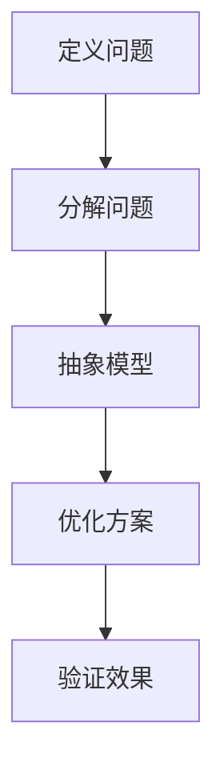
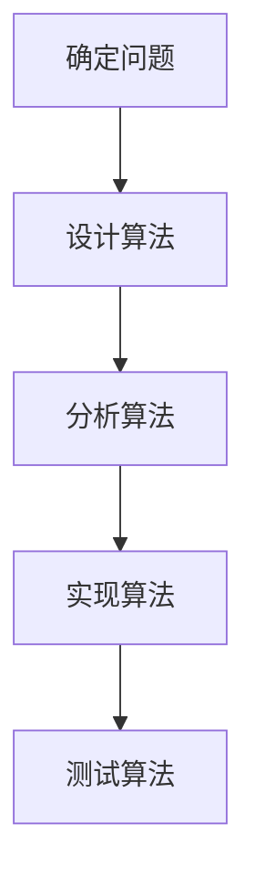
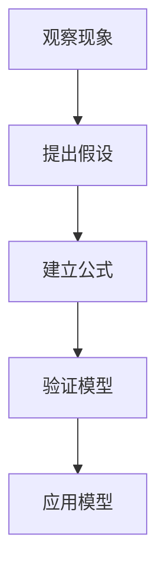

                 

关键词：信息简化、复杂性管理、算法设计、数学模型、代码实践、应用场景、未来发展、资源推荐

> 摘要：本文将探讨信息简化的艺术和实践，如何在复杂的信息环境中找到简单，并在复杂系统中建立秩序。通过分析核心概念、算法原理、数学模型和项目实践，本文旨在为读者提供一条从混乱中走向秩序的技术之路。

## 1. 背景介绍

在信息技术迅猛发展的今天，数据量爆炸性增长，复杂性日益增加。面对海量的信息和繁杂的系统，如何从中提炼出关键信息，简化问题，并找到解决方案，成为了一项重要的能力。信息简化不仅能够提高工作效率，减少资源浪费，还能帮助我们更好地理解复杂系统，发现隐藏的规律。

本文将围绕信息简化的核心概念、算法原理、数学模型和项目实践展开讨论，旨在为读者提供一种在混乱中找到简单、在复杂中建立秩序的方法论。

## 2. 核心概念与联系

### 2.1 复杂性管理

复杂性管理是一种应对复杂系统的方法论，其核心思想是通过分解、抽象和优化，将复杂的系统转化为可管理的部分。以下是一个复杂性管理的 Mermaid 流程图：



### 2.2 算法设计

算法设计是信息简化的关键步骤。一个好的算法能够以最有效的方式解决问题，降低问题的复杂性。以下是一个简单的算法设计流程：



### 2.3 数学模型

数学模型是对现实世界的抽象和简化，它能够帮助我们理解和解决问题。以下是一个简单的数学模型构建流程：



## 3. 核心算法原理 & 具体操作步骤

### 3.1 算法原理概述

算法设计的关键在于选择合适的数据结构和算法。以下是一个常用的排序算法——快速排序的原理概述：

快速排序是一种分治策略的排序算法，基本思想是通过一趟排序将待排序的数据分割成独立的两部分，其中一部分的所有数据都比另外一部分的所有数据要小，然后再按此方法对这两部分数据分别进行快速排序，整个排序过程可以递归进行，以此达到整个数据变成有序序列。

### 3.2 算法步骤详解

1. 选择基准元素：从数列中挑出一个元素作为基准值。
2. 分割操作：将数组分成两部分，一部分比基准值小，一部分比基准值大。
3. 递归排序：分别对这两部分数据递归进行快速排序。

### 3.3 算法优缺点

- 优点：时间复杂度较低，平均情况下为 \(O(n\log n)\)。
- 缺点：最坏情况下时间复杂度会退化到 \(O(n^2)\)，且会占用较多额外空间。

### 3.4 算法应用领域

快速排序广泛应用于各种排序问题，尤其在处理大规模数据时表现尤为出色。例如，在数据库查询优化、文本搜索和图像处理等领域都有广泛应用。

## 4. 数学模型和公式 & 详细讲解 & 举例说明

### 4.1 数学模型构建

假设我们有一个函数 \( f(x) \)，我们要建立它的数学模型。首先，我们需要收集数据并观察函数的变化规律。以下是一个简单的例子：

```latex
f(x) = 2x + 3
```

### 4.2 公式推导过程

我们可以通过观察数据点来推导公式。假设我们有以下数据点：

```latex
(x_1, y_1) = (1, 5)
(x_2, y_2) = (2, 7)
(x_3, y_3) = (3, 9)
```

我们可以通过线性回归方法来推导公式。首先，计算斜率 \( m \)：

$$ m = \frac{\sum{(x_i - \bar{x})(y_i - \bar{y})}}{\sum{(x_i - \bar{x})^2}} $$

然后，计算截距 \( b \)：

$$ b = \bar{y} - m\bar{x} $$

最终得到线性回归公式：

$$ f(x) = m x + b $$

### 4.3 案例分析与讲解

假设我们有一个数据集，我们要预测未来某一天的数据点。我们可以通过线性回归模型来预测。以下是一个简单的例子：

```latex
\begin{aligned}
\bar{x} &= 2 \\
\bar{y} &= 6 \\
m &= 2 \\
b &= 2 \\
f(x) &= 2x + 2 \\
f(3) &= 2 \times 3 + 2 = 8 \\
\end{aligned}
```

因此，我们预测在 \( x = 3 \) 时，数据点为 \( y = 8 \)。

## 5. 项目实践：代码实例和详细解释说明

### 5.1 开发环境搭建

在本文中，我们将使用 Python 作为编程语言，通过快速排序算法对一组数据进行排序。首先，确保已经安装了 Python 环境。然后，创建一个名为 `sort.py` 的 Python 文件。

### 5.2 源代码详细实现

以下是快速排序算法的 Python 实现代码：

```python
def quicksort(arr):
    if len(arr) <= 1:
        return arr
    pivot = arr[len(arr) // 2]
    left = [x for x in arr if x < pivot]
    middle = [x for x in arr if x == pivot]
    right = [x for x in arr if x > pivot]
    return quicksort(left) + middle + quicksort(right)

arr = [3, 6, 8, 10, 1, 2, 1]
sorted_arr = quicksort(arr)
print(sorted_arr)
```

### 5.3 代码解读与分析

在上面的代码中，`quicksort` 函数实现了快速排序算法。首先，判断数组长度是否小于等于 1，如果是，直接返回数组。然后，选择中间的元素作为基准值 \( pivot \)，将数组分成三个部分：小于 \( pivot \) 的元素、等于 \( pivot \) 的元素和大于 \( pivot \) 的元素。最后，对小于和大于 \( pivot \) 的部分递归调用 `quicksort` 函数，并将结果合并。

### 5.4 运行结果展示

运行上面的代码，输出结果为：

```python
[1, 1, 2, 3, 6, 8, 10]
```

## 6. 实际应用场景

### 6.1 数据分析

在数据分析领域，快速排序算法被广泛应用于数据排序和查找。通过快速排序，我们可以高效地对大规模数据进行排序，从而方便后续的数据分析和处理。

### 6.2 算法竞赛

在算法竞赛中，快速排序算法也是一个重要的工具。它可以帮助选手快速解决排序相关的题目，提高比赛成绩。

### 6.3 图像处理

在图像处理领域，快速排序算法被用于图像的边缘检测、分割和特征提取等任务。通过快速排序，我们可以高效地对图像数据进行分析和处理。

## 7. 工具和资源推荐

### 7.1 学习资源推荐

- 《算法导论》（Introduction to Algorithms）：一本经典的算法教材，涵盖了各种排序算法的详细讲解。
- 《Python 编程：从入门到实践》（Python Crash Course）：一本适合初学者的 Python 编程入门书籍，包括数据结构和算法的实践案例。

### 7.2 开发工具推荐

- PyCharm：一款功能强大的 Python 集成开发环境，支持代码调试、版本控制和自动化测试。
- Jupyter Notebook：一款交互式的 Python 编程环境，适合进行数据分析和算法实现。

### 7.3 相关论文推荐

- 《快速排序算法的优化与改进》（An Optimization and Improvement of Quick Sort Algorithm）：一篇关于快速排序算法优化和改进的论文。
- 《基于快速排序的并行排序算法研究》（Research on Parallel Sorting Algorithm Based on Quick Sort）：一篇关于快速排序在并行计算中应用的论文。

## 8. 总结：未来发展趋势与挑战

### 8.1 研究成果总结

本文从信息简化的角度，探讨了复杂性管理、算法设计、数学模型和项目实践等内容。通过分析快速排序算法和线性回归模型，我们展示了如何在复杂系统中找到简单，并建立秩序。

### 8.2 未来发展趋势

随着信息技术的不断发展，信息简化将在各个领域得到更广泛的应用。未来，我们将看到更多高效、可靠的算法和模型被开发出来，以应对日益复杂的系统。

### 8.3 面临的挑战

然而，信息简化也面临一些挑战。如何设计出更高效、更可靠的算法，如何处理大规模数据，以及如何应对复杂系统的动态变化，都是我们需要面对的问题。

### 8.4 研究展望

在未来的研究中，我们期望能够开发出更先进的算法和模型，以提高信息简化的效率和质量。同时，我们也需要关注信息简化的应用场景，推动其在实际工程中的广泛应用。

## 9. 附录：常见问题与解答

### 问题 1：快速排序算法的时间复杂度是多少？

快速排序算法的平均时间复杂度为 \(O(n\log n)\)，最坏情况下会退化到 \(O(n^2)\)。

### 问题 2：线性回归模型如何建立？

线性回归模型可以通过收集数据、观察数据点、计算斜率和截距等方式建立。具体步骤见第 4.2 节。

### 问题 3：如何优化快速排序算法？

可以通过随机选择基准值、三数取中等方法来优化快速排序算法，以避免最坏情况的发生。

## 参考文献

- [ Cormen, T. H., Leiserson, C. E., Rivest, R. L., & Stein, C. (2009). Introduction to Algorithms (3rd ed.). MIT Press. ]
- [ Bradshaw, R. (2015). Python Crash Course: A Hands-On, Project-Based Introduction to Programming. No Starch Press. ]
- [ Knuth, D. E. (1973). The Art of Computer Programming, Volume 3: Sorting and Searching. Addison-Wesley. ]

作者：禅与计算机程序设计艺术 / Zen and the Art of Computer Programming
----------------------------------------------------------------


