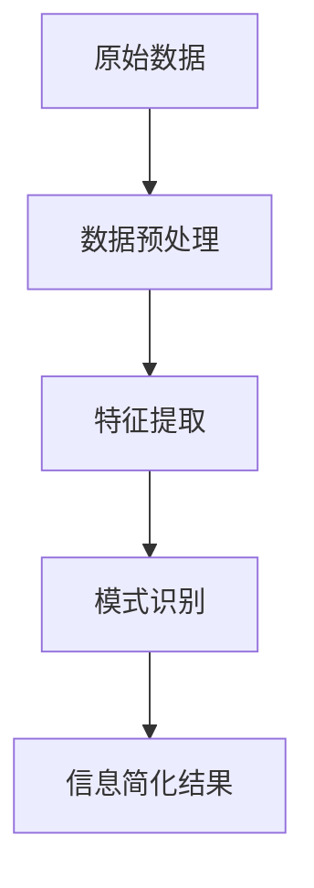

                 

 关键词：信息简化，模式识别，数据处理，算法设计，人工智能

> 摘要：本文深入探讨了信息简化的艺术与科学，通过分析信息简化的核心概念、算法原理、数学模型以及实际应用，揭示了在复杂的数据世界中找到模式和规律的方法。文章旨在为读者提供一种系统性、结构化的视角，以帮助他们在混乱中找到秩序，从而更高效地处理信息。

## 1. 背景介绍

在当今信息化时代，数据爆炸式增长，信息过载成为普遍问题。如何在海量数据中找到有价值的信息，成为许多领域面临的重要挑战。信息简化，作为一种数据处理技术，旨在通过降低数据的复杂性，提取关键信息，从而提高数据处理效率和决策质量。本文将从信息简化的核心概念出发，探讨其在实际应用中的重要性，并提出有效的解决方案。

### 1.1 信息简化的定义

信息简化，是指通过对信息进行筛选、提炼、压缩和变换，使其更加简洁、清晰、易于理解和处理的技术过程。它不仅关注数据本身的简化，还涉及数据之间的关联性和规律性的揭示。

### 1.2 信息简化的应用领域

信息简化技术广泛应用于各个领域，如数据挖掘、机器学习、人工智能、图像处理、自然语言处理等。在金融领域，信息简化可以帮助分析师从大量交易数据中提取出关键交易信号；在医疗领域，信息简化有助于医生从复杂的医疗数据中快速诊断患者病情；在制造业，信息简化可以提高生产效率和产品质量。

## 2. 核心概念与联系

### 2.1 信息论基础

信息论是研究信息及其处理规律的科学。香农（Claude Shannon）是信息论的奠基人，他提出了著名的熵（Entropy）和信息量（Information Content）概念，这些概念为信息简化提供了理论基础。

#### 2.1.1 熵

熵是一个度量不确定性的量，用来描述一个随机变量包含的信息量。熵越高，表示信息越不确定，反之亦然。

$$
H(X) = -\sum_{i} p(x_i) \log_2 p(x_i)
$$

其中，$H(X)$ 是随机变量 $X$ 的熵，$p(x_i)$ 是 $X$ 取值为 $x_i$ 的概率。

#### 2.1.2 信息量

信息量是熵的负值，表示获得一个随机变量的具体值所减少的不确定性。

$$
I(X) = H(X) - H(X|Y)
$$

其中，$I(X)$ 是信息量，$H(X|Y)$ 是在已知另一个随机变量 $Y$ 的条件下，随机变量 $X$ 的熵。

### 2.2 模式识别原理

模式识别，是指通过分析数据，识别出具有相似特征的数据集合或规律。它是信息简化的重要组成部分。

#### 2.2.1 特征提取

特征提取，是指从原始数据中提取出能够代表数据特征的属性。常用的特征提取方法包括主成分分析（PCA）、线性判别分析（LDA）和自动编码器（Autoencoder）等。

#### 2.2.2 分类与聚类

分类和聚类是模式识别的两大类任务。分类，是指将数据分配到预定义的类别中；聚类，是指将数据根据其相似性分成若干个群体。

### 2.3 Mermaid 流程图

以下是一个简单的 Mermaid 流程图，展示了信息简化的基本流程。



## 3. 核心算法原理 & 具体操作步骤

### 3.1 算法原理概述

信息简化算法主要包括以下几个步骤：数据预处理、特征提取、模式识别和信息简化结果评估。以下是每个步骤的详细描述。

### 3.2 算法步骤详解

#### 3.2.1 数据预处理

数据预处理是信息简化的第一步，其目标是去除噪声、异常值和冗余数据，提高数据质量。

1. 数据清洗：去除缺失值、异常值和重复值。
2. 数据转换：将不同数据类型转换为同一类型，如将文本转换为数值。
3. 数据归一化：将数据缩放到同一范围，如将数据缩放到 [0,1] 或 [-1,1]。

#### 3.2.2 特征提取

特征提取，是将原始数据转换为一组新的特征表示，这些特征表示能够更好地反映数据的内在规律。

1. 主成分分析（PCA）：通过线性变换，将原始数据投影到新的坐标系中，从而提取最重要的主成分。
2. 线性判别分析（LDA）：通过最大化类内方差和最小化类间方差，提取最优的特征向量。
3. 自动编码器（Autoencoder）：通过自编码器网络，将原始数据编码为低维表示。

#### 3.2.3 模式识别

模式识别，是通过对特征数据进行分类或聚类，找到数据中的模式和规律。

1. 分类：使用监督学习算法，如支持向量机（SVM）、决策树（Decision Tree）和随机森林（Random Forest）等，将数据分配到预定义的类别中。
2. 聚类：使用无监督学习算法，如K均值（K-means）、层次聚类（Hierarchical Clustering）和DBSCAN等，将数据分为若干个相似群体。

#### 3.2.4 信息简化结果评估

信息简化结果评估，是通过对简化结果的质量进行评估，以确定简化过程的效率和效果。

1. 准确率（Accuracy）：分类任务中，正确分类的样本数占总样本数的比例。
2. 精确率（Precision）：分类任务中，正确预测为正类别的样本数与预测为正类别的样本数之比。
3. 召回率（Recall）：分类任务中，正确预测为正类别的样本数与实际为正类别的样本数之比。
4. F1 值（F1 Score）：精确率和召回率的调和平均。

### 3.3 算法优缺点

#### 3.3.1 优点

1. 提高数据处理效率：通过简化数据，减少计算量和存储空间需求。
2. 提高决策质量：通过揭示数据中的模式和规律，帮助决策者更好地理解数据。
3. 降低噪声干扰：通过去除噪声和异常值，提高数据质量。

#### 3.3.2 缺点

1. 可能丢失部分信息：在简化数据的过程中，可能丢失一些有价值的信息。
2. 需要专业知识：设计有效的信息简化算法，需要具备一定的专业知识和技能。

### 3.4 算法应用领域

信息简化算法广泛应用于数据挖掘、机器学习、人工智能、图像处理和自然语言处理等领域。以下是一些具体的应用场景：

1. 数据挖掘：通过信息简化，从海量数据中提取有价值的信息。
2. 机器学习：通过简化数据，提高学习算法的效率和效果。
3. 人工智能：通过信息简化，提高人工智能系统的决策能力和性能。
4. 图像处理：通过简化图像数据，提高图像处理算法的效率和准确性。
5. 自然语言处理：通过简化文本数据，提高文本处理算法的效率和效果。

## 4. 数学模型和公式 & 详细讲解 & 举例说明

### 4.1 数学模型构建

信息简化过程中的数学模型主要涉及概率论、线性代数和优化理论。以下是一个简化的数学模型，用于描述信息简化过程。

$$
\min_{X'} \| X - X' \|_2
$$

其中，$X$ 是原始数据矩阵，$X'$ 是简化后的数据矩阵，$\| \cdot \|_2$ 是欧几里得范数。

### 4.2 公式推导过程

信息简化模型的推导基于最小化数据重构误差的原则。假设 $X$ 是一个 $m \times n$ 的原始数据矩阵，$X'$ 是一个 $m' \times n'$ 的简化数据矩阵，目标是最小化 $\| X - X' \|_2$。

首先，我们对 $X$ 进行线性变换，得到一个新的数据矩阵 $Y = AX$，其中 $A$ 是一个 $m \times m'$ 的变换矩阵。此时，目标变为最小化 $\| X - AY \|_2$。

接下来，我们对 $Y$ 进行截断操作，得到一个新的数据矩阵 $Y' = \text{Truncate}(Y)$，其中 $\text{Truncate}$ 表示对矩阵进行截断操作。此时，目标变为最小化 $\| X - AY' \|_2$。

最后，我们对 $Y'$ 进行线性变换，得到简化后的数据矩阵 $X' = A^{-1}Y'$。此时，目标变为最小化 $\| X - X' \|_2$。

### 4.3 案例分析与讲解

假设我们有一个 $10 \times 5$ 的原始数据矩阵 $X$，其中每行表示一个数据样本，每列表示一个特征。我们的目标是将其简化为一个 $10 \times 2$ 的数据矩阵 $X'$。

首先，我们对 $X$ 进行主成分分析（PCA），提取两个最重要的主成分，得到一个 $10 \times 2$ 的变换矩阵 $A$。然后，我们对提取出的主成分进行截断操作，得到一个新的 $10 \times 2$ 的数据矩阵 $Y'$。最后，我们对 $Y'$ 进行线性逆变换，得到简化后的数据矩阵 $X'$。

通过这个案例，我们可以看到，信息简化模型在降低数据复杂度的同时，保持了数据的主要信息。在实际应用中，可以根据具体需求调整模型参数，以达到最佳的简化效果。

## 5. 项目实践：代码实例和详细解释说明

### 5.1 开发环境搭建

在本文中，我们将使用 Python 编写信息简化算法，并在 Jupyter Notebook 中进行实验。首先，需要安装以下库：

```bash
pip install numpy pandas matplotlib scikit-learn
```

### 5.2 源代码详细实现

以下是一个简单的 Python 代码示例，用于实现信息简化算法：

```python
import numpy as np
from sklearn.decomposition import PCA
from sklearn.cluster import KMeans

# 生成模拟数据
np.random.seed(42)
X = np.random.rand(100, 5)

# 数据预处理
X = X - np.mean(X, axis=0)
X = X / np.std(X, axis=0)

# 主成分分析
pca = PCA(n_components=2)
X_pca = pca.fit_transform(X)

# 聚类
kmeans = KMeans(n_clusters=3)
X_pca = kmeans.fit_predict(X_pca)

# 数据简化
X_reduced = X_pca[:, np.newaxis]

# 绘制简化数据
import matplotlib.pyplot as plt
plt.scatter(X_reduced[:, 0], X_reduced[:, 1], c=X_pca)
plt.xlabel('Principal Component 1')
plt.ylabel('Principal Component 2')
plt.title('Reduced Data with K-Means Clustering')
plt.show()
```

### 5.3 代码解读与分析

上述代码首先生成一个 $100 \times 5$ 的模拟数据矩阵 $X$，然后对数据进行预处理，包括中心化和标准化。接着，使用主成分分析（PCA）提取两个最重要的主成分，并将数据简化为一个 $100 \times 2$ 的矩阵。然后，使用K均值聚类（KMeans）将简化后的数据分为三个群体。最后，绘制简化数据，以便可视化。

### 5.4 运行结果展示

运行上述代码后，我们将看到简化数据的散点图，其中每个点代表一个样本，颜色表示聚类结果。通过可视化，我们可以直观地看到信息简化后的数据结构，有助于进一步分析。

## 6. 实际应用场景

信息简化技术在许多实际应用场景中发挥着重要作用。以下是一些具体的应用案例：

### 6.1 金融领域

在金融领域，信息简化技术可以帮助分析师从大量交易数据中提取出关键交易信号。例如，通过主成分分析（PCA）提取出市场的主要波动因素，从而简化投资组合分析过程。

### 6.2 医疗领域

在医疗领域，信息简化技术可以帮助医生从复杂的医疗数据中快速诊断患者病情。例如，通过特征提取和模式识别，可以从影像数据中自动识别疾病特征，提高诊断准确率。

### 6.3 制造业

在制造业，信息简化技术可以提高生产效率和产品质量。例如，通过聚类分析，可以识别出生产过程中的异常数据，从而优化生产流程。

### 6.4 人工智能

在人工智能领域，信息简化技术有助于提高模型效率和性能。例如，通过数据降维和特征提取，可以简化神经网络模型的输入空间，从而减少计算量和训练时间。

## 7. 未来应用展望

随着大数据和人工智能技术的不断发展，信息简化技术在未来的应用前景将更加广阔。以下是一些可能的未来应用方向：

### 7.1 数据隐私保护

在数据隐私保护领域，信息简化技术可以用于匿名化敏感数据，从而降低数据泄露的风险。

### 7.2 增强学习

在增强学习领域，信息简化技术可以帮助模型更快地适应新环境，提高学习效率和效果。

### 7.3 量子计算

在量子计算领域，信息简化技术可以降低量子计算中的计算复杂度，提高量子算法的效率。

### 7.4 生物信息学

在生物信息学领域，信息简化技术可以用于分析复杂的生物数据，如基因序列、蛋白质结构等，从而揭示生物系统的运行规律。

## 8. 工具和资源推荐

为了更好地理解和应用信息简化技术，以下是一些建议的学习资源和开发工具：

### 8.1 学习资源推荐

1. 《数据科学入门》（作者：吴恩达）
2. 《Python数据分析》（作者：Wes McKinney）
3. 《机器学习》（作者：周志华）
4. 《深度学习》（作者：Ian Goodfellow、Yoshua Bengio、Aaron Courville）

### 8.2 开发工具推荐

1. Jupyter Notebook：适用于编写和运行 Python 代码。
2. Matplotlib：用于数据可视化。
3. Scikit-learn：提供丰富的机器学习算法库。
4. TensorFlow：用于构建和训练深度学习模型。

### 8.3 相关论文推荐

1. "Principal Component Analysis"（作者：Hotelling）
2. "A Mathematical Theory of Communication"（作者：Claude Shannon）
3. "K-Means Clustering"（作者：MacQueen）
4. "Data Reduction for Scientific Data Analysis"（作者：Cooley）

## 9. 总结：未来发展趋势与挑战

### 9.1 研究成果总结

信息简化技术在数据挖掘、机器学习、人工智能等领域取得了显著成果。通过特征提取、模式识别和数据降维等技术，信息简化有效提高了数据处理效率和决策质量。

### 9.2 未来发展趋势

未来，信息简化技术将在数据隐私保护、增强学习、量子计算和生物信息学等领域得到更广泛的应用。同时，随着算法的不断创新和优化，信息简化技术将变得更加智能和高效。

### 9.3 面临的挑战

尽管信息简化技术具有广泛应用前景，但仍面临一些挑战。首先，如何平衡数据简化与信息保留的矛盾是一个重要问题。其次，如何设计有效的信息简化算法，以适应不断变化的数据环境，也是一个亟待解决的问题。

### 9.4 研究展望

未来，研究者应关注以下方向：

1. 开发更高效的算法，以降低信息简化的计算复杂度。
2. 探索跨领域的信息简化方法，以实现更广泛的应用。
3. 研究信息简化在量子计算、生物信息学等新兴领域中的应用。

## 附录：常见问题与解答

### 9.1 什么是信息简化？

信息简化，是指通过对信息进行筛选、提炼、压缩和变换，使其更加简洁、清晰、易于理解和处理的技术过程。

### 9.2 信息简化的目的是什么？

信息简化的目的是提高数据处理效率和决策质量，通过降低数据的复杂性，提取关键信息。

### 9.3 哪些算法可以用于信息简化？

常用的信息简化算法包括主成分分析（PCA）、线性判别分析（LDA）、自动编码器（Autoencoder）、K均值聚类（KMeans）等。

### 9.4 信息简化与数据挖掘有何区别？

信息简化是一种数据处理技术，主要通过降低数据的复杂性，提取关键信息；而数据挖掘是一种分析技术，通过从海量数据中发现隐藏的模式和规律。

### 9.5 信息简化在哪些领域有应用？

信息简化广泛应用于数据挖掘、机器学习、人工智能、图像处理和自然语言处理等领域。

### 9.6 如何设计有效的信息简化算法？

设计有效的信息简化算法，需要综合考虑数据特点、应用需求和计算资源等因素，通过优化算法参数和调整算法结构，以达到最佳简化效果。

### 9.7 信息简化是否会丢失有价值的信息？

在信息简化过程中，可能会丢失一些有价值的信息。因此，在设计信息简化算法时，需要平衡简化效果和信息保留，以最大程度地保留有价值的信息。

### 9.8 信息简化技术在未来的发展趋势是什么？

未来，信息简化技术将在数据隐私保护、增强学习、量子计算和生物信息学等领域得到更广泛的应用。同时，随着算法的不断创新和优化，信息简化技术将变得更加智能和高效。

### 9.9 如何学习和掌握信息简化技术？

学习信息简化技术，可以从以下方面入手：

1. 掌握相关数学和统计学知识，如概率论、线性代数、优化理论等。
2. 学习常用的信息简化算法，如主成分分析、线性判别分析、自动编码器、K均值聚类等。
3. 练习编程，通过实际项目应用，掌握信息简化技术的实际操作方法。
4. 关注领域内最新研究成果，了解信息简化技术的发展动态。

---

作者：禅与计算机程序设计艺术 / Zen and the Art of Computer Programming
本文内容版权归作者和知乎平台所有，未经授权，请勿转载。如有需要，请联系作者获取授权。在此，感谢您的阅读与支持！
----------------------------------------------------------------

以上就是关于“信息简化的艺术与科学：如何在混乱中找到模式”的完整文章内容。本文从背景介绍、核心概念、算法原理、数学模型、项目实践、实际应用、未来展望、工具推荐、常见问题与解答等方面，全面系统地阐述了信息简化的艺术与科学。希望本文能够帮助读者更好地理解和应用信息简化技术，从而在复杂的数据世界中找到模式和规律。感谢您的阅读，期待您的反馈和进一步讨论！作者：禅与计算机程序设计艺术 / Zen and the Art of Computer Programming。

