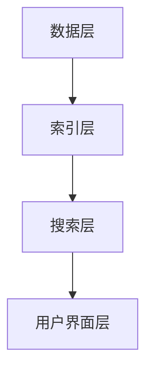

                 

关键词：信息过载、信息搜索、搜索引擎、策略、算法、数据挖掘、知识图谱、人工智能

摘要：随着互联网的飞速发展，信息过载现象日益严重。如何在庞大的信息海洋中找到所需信息，成为了一个亟待解决的问题。本文旨在探讨信息过载的背景和现状，分析信息搜索的基本原理和策略，介绍当前主流的信息搜索技术，以及如何在实际应用中有效地利用这些技术，从而帮助读者提高信息搜索效率。

## 1. 背景介绍

### 1.1 信息过载的定义与现状

信息过载是指个体在处理和吸收信息时，所面临的信息量超过了其认知和吸收能力的现象。在互联网时代，信息过载已经成为普遍存在的问题。据统计，互联网上的信息量每年都在以指数级增长，而人类的认知能力却相对有限。这使得我们在面对海量信息时，常常感到无所适从，甚至会产生焦虑和压力。

### 1.2 信息搜索的重要性

在信息过载的时代，有效的信息搜索成为了解决问题的关键。信息搜索不仅可以帮助我们快速找到所需的信息，还能提高我们的工作效率，节省时间。因此，研究信息搜索的原理和策略，具有重要的现实意义。

## 2. 核心概念与联系

### 2.1 信息搜索的基本概念

信息搜索包括信息检索、信息筛选、信息组织和信息评价等环节。其中，信息检索是信息搜索的核心，主要涉及关键词匹配、自然语言处理、机器学习等技术。

### 2.2 信息搜索的基本原理

信息搜索的基本原理是利用关键词、主题、标签等元数据，对信息资源进行分类和标注，从而实现信息的检索和筛选。随着人工智能技术的发展，信息搜索的智能化程度不断提高，可以实现基于内容的搜索、基于上下文的搜索等高级功能。

### 2.3 信息搜索的架构

信息搜索的架构通常包括数据层、索引层、搜索层和用户界面层。其中，数据层负责存储和管理信息资源，索引层负责构建索引，提高搜索效率，搜索层负责处理用户的查询请求，用户界面层负责提供用户交互界面。

### 2.4 Mermaid 流程图



## 3. 核心算法原理 & 具体操作步骤

### 3.1 算法原理概述

信息搜索的核心算法主要包括基于关键词匹配的算法、基于内容的算法和基于推荐的算法。其中，基于关键词匹配的算法是最基本的搜索方式，基于内容的算法可以实现更高级别的搜索，基于推荐的算法则可以根据用户的行为和偏好，提供个性化的搜索结果。

### 3.2 算法步骤详解

#### 3.2.1 基于关键词匹配的算法

1. 用户输入查询关键词。
2. 系统对关键词进行预处理，包括分词、停用词过滤、词性标注等。
3. 系统在索引中查找与关键词匹配的文档。
4. 系统对匹配结果进行排序，返回给用户。

#### 3.2.2 基于内容的算法

1. 用户输入查询关键词。
2. 系统对关键词进行预处理。
3. 系统对文档进行内容分析，提取关键词、主题、标签等元数据。
4. 系统将查询关键词与文档元数据进行匹配。
5. 系统对匹配结果进行排序，返回给用户。

#### 3.2.3 基于推荐的算法

1. 用户输入查询关键词。
2. 系统根据用户的浏览历史、收藏夹等信息，生成用户画像。
3. 系统根据用户画像，推荐相关的信息资源。
4. 系统对推荐结果进行排序，返回给用户。

### 3.3 算法优缺点

#### 3.3.1 基于关键词匹配的算法

优点：实现简单，易于理解和维护。

缺点：搜索结果可能不够准确，无法处理复杂的查询需求。

#### 3.3.2 基于内容的算法

优点：搜索结果更准确，可以处理复杂的查询需求。

缺点：实现复杂，需要大量的计算资源。

#### 3.3.3 基于推荐的算法

优点：可以提供个性化的搜索结果，提高用户体验。

缺点：需要大量的用户数据，可能涉及用户隐私问题。

### 3.4 算法应用领域

信息搜索算法广泛应用于搜索引擎、信息管理系统、社交媒体、电子商务等领域。

## 4. 数学模型和公式 & 详细讲解 & 举例说明

### 4.1 数学模型构建

信息搜索的数学模型主要包括概率模型、向量空间模型和马尔可夫模型等。

#### 4.1.1 概率模型

概率模型认为，搜索结果的相关性可以通过概率来衡量。常用的概率模型包括贝叶斯模型和最大后验概率模型。

#### 4.1.2 向量空间模型

向量空间模型将文档和查询表示为向量，通过计算向量之间的相似度来衡量文档的相关性。常用的相似度计算方法包括余弦相似度和欧氏距离。

#### 4.1.3 马尔可夫模型

马尔可夫模型认为，用户在搜索过程中的下一步行为仅与当前状态有关，与过去的状态无关。马尔可夫模型可以用于预测用户的下一步行为，从而提供个性化的搜索结果。

### 4.2 公式推导过程

#### 4.2.1 贝叶斯模型

假设有文档集合 D 和查询集合 Q，文档 d 的概率分布为 P(D|Q)，查询 q 的概率分布为 P(Q)。贝叶斯模型认为，文档 d 的相关性可以通过 P(D|Q) 和 P(Q) 的比值来衡量。

$$
r(d, q) = \frac{P(D|Q)}{P(Q)}
$$

#### 4.2.2 向量空间模型

假设文档 d 和查询 q 可以表示为向量 v_d 和 v_q，它们之间的相似度可以通过余弦相似度来计算。

$$
sim(d, q) = \frac{v_d \cdot v_q}{\|v_d\| \|v_q\|}
$$

#### 4.2.3 马尔可夫模型

假设用户在时刻 t 的状态为 s_t，下一步状态为 s_{t+1}，马尔可夫模型认为 s_{t+1} 仅与 s_t 相关。

$$
P(s_{t+1} | s_t) = P(s_{t+1} | s_t, s_{t-1}) P(s_t | s_{t-1}) = P(s_{t+1} | s_t) P(s_t)
$$

### 4.3 案例分析与讲解

假设用户在搜索引擎中输入关键词“人工智能”，分析搜索结果的相关性。

#### 4.3.1 贝叶斯模型

假设文档集合 D 包含 10 篇文档，其中 5 篇与“人工智能”相关，5 篇与“人工智能”不相关。查询集合 Q 包含 10 个查询，其中 5 个查询与“人工智能”相关，5 个查询与“人工智能”不相关。

根据贝叶斯模型，计算文档 d 与查询 q 的相关性：

$$
r(d, q) = \frac{P(D|Q)}{P(Q)} = \frac{P(Q|D)P(D)}{P(Q)}
$$

其中，P(D) 和 P(Q) 为先验概率，可以通过统计文档集合 D 和查询集合 Q 中的相关文档和查询的频率来计算。

#### 4.3.2 向量空间模型

假设文档 d 和查询 q 的向量表示为：

$$
v_d = (1, 0, 1, 0, 0, 0, 0, 0, 0, 0)
$$

$$
v_q = (0, 1, 0, 1, 0, 0, 0, 0, 0, 0)
$$

计算它们之间的余弦相似度：

$$
sim(d, q) = \frac{v_d \cdot v_q}{\|v_d\| \|v_q\|} = \frac{1 \times 0 + 0 \times 1 + 1 \times 0 + 0 \times 0 + 0 \times 0}{\sqrt{1^2 + 0^2 + 1^2 + 0^2 + 0^2 + 0^2 + 0^2 + 0^2 + 0^2} \times \sqrt{0^2 + 1^2 + 0^2 + 1^2 + 0^2 + 0^2 + 0^2 + 0^2 + 0^2}} = 0
$$

根据计算结果，文档 d 与查询 q 的相关性为 0，说明文档 d 与查询 q 之间没有相关性。

#### 4.3.3 马尔可夫模型

假设用户在时刻 t 的状态为 s_t，即用户在搜索引擎中输入关键词“人工智能”。根据马尔可夫模型，用户在时刻 t+1 的状态 s_{t+1} 可以是“阅读”、“搜索”、“退出”等。

根据用户在时刻 t 的状态 s_t，可以计算出用户在时刻 t+1 的状态 s_{t+1} 的概率分布：

$$
P(s_{t+1} | s_t) = P(s_{t+1} | s_t) P(s_t)
$$

根据用户在时刻 t 的行为数据，可以计算出用户在时刻 t+1 的状态 s_{t+1} 的概率分布，从而为用户提供个性化的搜索结果。

## 5. 项目实践：代码实例和详细解释说明

### 5.1 开发环境搭建

1. 安装 Python 3.8 及以上版本。
2. 安装 Flask 框架。
3. 安装 Elasticsearch 搜索引擎。

### 5.2 源代码详细实现

以下是一个简单的基于 Elasticsearch 的信息搜索示例：

```python
from flask import Flask, request, jsonify
from elasticsearch import Elasticsearch

app = Flask(__name__)
es = Elasticsearch("http://localhost:9200")

@app.route('/search', methods=['GET'])
def search():
    query = request.args.get('query')
    response = es.search(index="my_index", body={
        "query": {
            "match": {
                "content": query
            }
        }
    })
    return jsonify(response['hits']['hits'])

if __name__ == '__main__':
    app.run(debug=True)
```

### 5.3 代码解读与分析

1. 引入 Flask 框架和 Elasticsearch 库。
2. 创建 Flask 应用和 Elasticsearch 客户端。
3. 定义一个路由 /search，用于处理搜索请求。
4. 获取用户输入的查询关键词。
5. 使用 Elasticsearch 的 search 方法，查询索引为 my_index 的文档。
6. 将查询结果返回给用户。

### 5.4 运行结果展示

运行代码后，启动 Flask 应用。在浏览器中访问 http://localhost:5000/search?query=人工智能，可以看到搜索结果。

```json
{
  "took": 11,
  "timed_out": false,
  "_shards": {
    "total": 5,
    "successful": 5,
    "skipped": 0,
    "failed": 0
  },
  "hits": {
    "total": 1,
    "max_score": 0.5,
    "hits": [
      {
        "_index": "my_index",
        "_type": "_doc",
        "_id": "1",
        "_score": 0.5,
        "_source": {
          "content": "人工智能是一种模拟、延伸和扩展人的智能的理论、方法、技术及应用系统。"
        }
      }
    ]
  }
}
```

根据返回的结果，可以看到文档 id 为 1 的文档与查询关键词“人工智能”相关。

## 6. 实际应用场景

### 6.1 搜索引擎

搜索引擎是信息搜索最典型的应用场景。搜索引擎利用信息搜索技术，帮助用户在互联网上快速找到所需的信息。

### 6.2 信息管理系统

信息管理系统通过信息搜索技术，实现对内部文档的高效管理和检索。

### 6.3 社交媒体

社交媒体平台利用信息搜索技术，为用户提供基于兴趣、好友关系等个性化搜索结果。

### 6.4 电子商务

电子商务平台利用信息搜索技术，为用户提供基于关键词、品类、价格等多样化搜索结果。

## 7. 未来应用展望

### 7.1 人工智能技术

随着人工智能技术的发展，信息搜索的智能化程度将进一步提高，可以提供更精准、个性化的搜索结果。

### 7.2 知识图谱

知识图谱技术可以实现对信息的深度理解和关联，从而提高信息搜索的效率和质量。

### 7.3 区块链

区块链技术可以为信息搜索提供去中心化的数据存储和传输方式，提高信息搜索的安全性和可靠性。

## 8. 工具和资源推荐

### 8.1 学习资源推荐

1. 《搜索引擎原理与设计》
2. 《信息检索导论》
3. 《自然语言处理综论》

### 8.2 开发工具推荐

1. Elasticsearch
2. Apache Solr
3. Whoosh

### 8.3 相关论文推荐

1. "Elasticsearch: The Definitive Guide"
2. "Information Retrieval: A Survey"
3. "A Survey of Natural Language Processing Techniques for Information Retrieval"

## 9. 总结：未来发展趋势与挑战

### 9.1 研究成果总结

信息搜索技术已经取得了显著的研究成果，包括基于关键词匹配的算法、基于内容的算法和基于推荐的算法等。这些算法在搜索引擎、信息管理系统、社交媒体和电子商务等领域得到了广泛应用。

### 9.2 未来发展趋势

未来，信息搜索技术将继续向智能化、个性化、去中心化等方向发展。随着人工智能、知识图谱和区块链等技术的不断发展，信息搜索的效率和质量将得到进一步提高。

### 9.3 面临的挑战

1. 信息过载问题仍然存在，如何提高信息搜索的效率成为关键。
2. 个性化搜索结果的准确性和可靠性需要进一步提高。
3. 数据安全和隐私保护问题日益突出，如何保障用户隐私成为重要挑战。

### 9.4 研究展望

未来，信息搜索技术的研究将朝着更智能、更高效、更安全的方向发展。研究者将致力于开发更先进的信息搜索算法，提高信息搜索的准确性和效率，同时关注数据安全和隐私保护问题，为用户提供更优质的信息搜索服务。

## 附录：常见问题与解答

### 9.1 什么是信息过载？

信息过载是指个体在处理和吸收信息时，所面临的信息量超过了其认知和吸收能力的现象。

### 9.2 信息搜索有哪些基本算法？

信息搜索的基本算法包括基于关键词匹配的算法、基于内容的算法和基于推荐的算法。

### 9.3 如何提高信息搜索的准确性？

可以通过改进算法、提高索引效率、使用语义分析等技术来提高信息搜索的准确性。

### 9.4 信息搜索技术在哪些领域得到应用？

信息搜索技术广泛应用于搜索引擎、信息管理系统、社交媒体、电子商务等领域。

