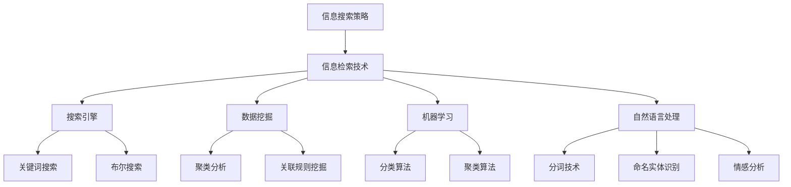

                 

在当今信息化时代，我们面临的最大挑战之一就是信息过载。每一天，海量的信息通过互联网、社交媒体、新闻媒体等渠道源源不断地涌入我们的生活中。这种信息过载现象对个人和企业都带来了巨大的困扰。如何有效地从庞大的信息海洋中找到我们需要的信息，已经成为一个亟待解决的问题。本文将探讨信息过载的背景、信息搜索策略与技术，以及在各个领域中的应用，以期为大家提供一些有效的解决方案。

## 文章关键词

- 信息过载
- 信息搜索策略
- 信息检索技术
- 搜索引擎
- 数据挖掘
- 机器学习
- 自然语言处理

## 文章摘要

本文首先介绍了信息过载的背景及其对个人和企业的困扰。随后，探讨了信息搜索策略和技术，包括搜索引擎、数据挖掘和机器学习等。通过具体的案例和数学模型，我们深入分析了信息搜索的核心算法原理和具体操作步骤。此外，文章还探讨了信息搜索技术在各个领域的应用，并对未来发展趋势进行了展望。最后，文章推荐了一些学习资源和开发工具，以帮助读者更好地应对信息过载问题。

## 1. 背景介绍

### 1.1 信息过载的定义

信息过载是指信息量过多，超出了个人或组织处理和吸收的能力，导致决策困难和信息利用效率下降的现象。在信息爆炸的时代，每天产生的信息量以惊人的速度增长。据估计，全球每天产生的数据量已经达到了惊人的2.5亿GB。这些数据包括文本、图像、音频和视频等各种形式。如此庞大的信息量给信息处理带来了巨大的挑战。

### 1.2 信息过载的影响

信息过载对个人和企业都产生了深远的影响。对于个人来说，信息过载会导致注意力分散，降低工作效率，甚至引发焦虑和压力。对于企业来说，信息过载会导致信息处理效率低下，影响决策质量，增加运营成本。

### 1.3 信息过载的原因

信息过载的主要原因包括以下几点：

- 数据爆炸：随着互联网和移动设备的普及，信息的产生和传播速度大大加快，数据量呈指数级增长。
- 信息来源多样化：互联网上的信息来源繁多，包括社交媒体、新闻媒体、博客、论坛等，这使得人们难以筛选和判断信息的真实性和价值。
- 信息更新速度快：许多信息具有时效性，一旦过期就失去了价值。在信息爆炸的时代，人们很难跟上信息的更新速度。
- 信息冗余：由于信息传播渠道的多样化，许多信息会在不同平台重复传播，导致信息冗余。

## 2. 核心概念与联系

### 2.1 信息搜索策略

信息搜索策略是指为了有效地从大量信息中找到所需信息而采取的一系列方法和技巧。有效的信息搜索策略可以大大提高信息检索的效率，减少信息过载带来的困扰。

### 2.2 信息检索技术

信息检索技术是用于从大规模数据集合中查找、筛选和提取信息的各种技术和方法。这些技术包括搜索引擎、数据挖掘、机器学习和自然语言处理等。

### 2.3 信息搜索策略与技术的联系

信息搜索策略和技术是相辅相成的。信息搜索策略为信息检索提供了指导性的方法和技巧，而信息检索技术则为信息搜索提供了强大的工具和手段。有效的信息搜索策略需要依赖先进的信息检索技术，而信息检索技术的不断发展也为信息搜索策略的优化提供了可能。

### 2.4 Mermaid 流程图

下面是一个简化的 Mermaid 流程图，展示了信息搜索策略与技术的联系：



## 3. 核心算法原理 & 具体操作步骤

### 3.1 算法原理概述

信息搜索的核心算法主要包括搜索引擎算法、数据挖掘算法和机器学习算法。这些算法通过不同的方式对信息进行组织、分析和筛选，从而实现高效的信息检索。

- **搜索引擎算法**：搜索引擎算法主要基于关键词匹配和页面相关性来检索信息。常见的搜索引擎算法包括 PageRank、LSI（Latent Semantic Indexing）和 BM25 等。
- **数据挖掘算法**：数据挖掘算法用于从大量数据中挖掘出有用的信息和规律。常见的数据挖掘算法包括聚类分析、关联规则挖掘、分类算法和回归算法等。
- **机器学习算法**：机器学习算法通过从数据中学习模式和规律，从而实现对未知数据的预测和分类。常见的机器学习算法包括监督学习、无监督学习和强化学习等。

### 3.2 算法步骤详解

下面以搜索引擎算法和数据挖掘算法为例，介绍其具体操作步骤。

#### 3.2.1 搜索引擎算法

1. **关键词匹配**：用户输入关键词后，搜索引擎首先从索引库中查找与关键词完全匹配的文档。
2. **页面相关性排序**：对于找到的匹配文档，搜索引擎会根据页面相关性对文档进行排序，通常使用 PageRank、LSI 或 BM25 等算法进行排序。
3. **展示结果**：将排序后的结果展示给用户，用户可以浏览和选择感兴趣的信息。

#### 3.2.2 数据挖掘算法

1. **数据预处理**：对数据进行清洗、去噪和预处理，以便后续的数据挖掘。
2. **特征提取**：从预处理后的数据中提取特征，用于表示数据。
3. **算法选择**：根据数据类型和挖掘目标选择合适的算法，如聚类分析、关联规则挖掘、分类算法等。
4. **模型训练**：使用训练数据对算法进行训练，以生成模型。
5. **模型评估**：使用测试数据对模型进行评估，以判断模型的准确性和泛化能力。
6. **结果展示**：将挖掘结果展示给用户，如聚类结果、关联规则、分类结果等。

### 3.3 算法优缺点

- **搜索引擎算法**：

  - **优点**：高效、准确，能够快速地从海量信息中找到用户所需的信息。
  - **缺点**：对关键词的依赖较大，对于长尾关键词的检索效果较差。

- **数据挖掘算法**：

  - **优点**：能够从大规模数据中挖掘出隐藏的规律和知识，具有很高的价值。
  - **缺点**：计算复杂度较高，对数据质量和预处理要求较高。

### 3.4 算法应用领域

- **搜索引擎算法**：广泛应用于各种搜索引擎，如 Google、Bing、百度等。
- **数据挖掘算法**：广泛应用于电子商务、金融、医疗、社交网络等领域，如推荐系统、信用评估、疾病预测等。

## 4. 数学模型和公式 & 详细讲解 & 举例说明

### 4.1 数学模型构建

信息搜索过程中的数学模型主要包括搜索引擎算法中的 PageRank 模型和数据挖掘算法中的聚类分析模型。

- **PageRank 模型**：PageRank 是一种基于链接分析的网页排序算法。它的基本思想是，一个网页的排名取决于链接到它的网页的排名。具体来说，PageRank 模型可以使用以下公式表示：

  $$PR(A) = (1-d) + d \sum_{B \in Links(A)} \frac{PR(B)}{out(B)}$$

  其中，$PR(A)$ 表示网页 A 的排名，$d$ 表示阻尼系数（通常取值为 0.85），$out(B)$ 表示网页 B 的出链数。

- **聚类分析模型**：聚类分析是一种无监督学习方法，用于将数据集划分为多个类别。常用的聚类分析模型包括 K-Means 聚类算法和层次聚类算法。

  - **K-Means 聚类算法**：K-Means 算法的基本思想是，将数据集划分为 K 个簇，使得每个簇内部的数据点尽可能接近，而簇与簇之间的数据点尽可能远离。具体来说，K-Means 算法可以使用以下公式表示：

    $$\min_{C} \sum_{i=1}^{K} \sum_{x \in C_i} ||x - \mu_i||^2$$

    其中，$C$ 表示聚类结果，$C_i$ 表示第 i 个簇，$\mu_i$ 表示第 i 个簇的中心。

  - **层次聚类算法**：层次聚类算法是一种基于层次结构的方法，用于将数据集划分为多个层次。具体来说，层次聚类算法可以使用以下公式表示：

    $$L(\theta) = \sum_{i=1}^{n} w_i \cdot d(x_i, \theta_i)$$

    其中，$L(\theta)$ 表示聚类损失函数，$w_i$ 表示第 i 个数据点的权重，$d(x_i, \theta_i)$ 表示第 i 个数据点到第 i 个簇中心的距离。

### 4.2 公式推导过程

- **PageRank 模型**的推导过程如下：

  首先，定义网页 A 的排名为 $PR(A)$，网页 B 的排名为 $PR(B)$。根据 PageRank 的基本思想，一个网页的排名取决于链接到它的网页的排名。具体来说，网页 A 的排名可以表示为：

  $$PR(A) = \sum_{B \in Links(A)} \frac{PR(B)}{out(B)}$$

  其中，$Links(A)$ 表示链接到网页 A 的所有网页，$out(B)$ 表示网页 B 的出链数。

  为了避免网页 A 与自身建立循环链接，引入阻尼系数 $d$（通常取值为 0.85），即：

  $$PR(A) = (1-d) + d \sum_{B \in Links(A)} \frac{PR(B)}{out(B)}$$

- **K-Means 聚类算法**的推导过程如下：

  首先，定义数据集 $D = \{x_1, x_2, ..., x_n\}$，聚类结果为 $C = \{C_1, C_2, ..., C_K\}$，第 i 个簇的中心为 $\mu_i$。目标是最小化聚类损失函数：

  $$\min_{C} \sum_{i=1}^{K} \sum_{x \in C_i} ||x - \mu_i||^2$$

  对损失函数求导，得到：

  $$\frac{\partial L}{\partial \mu_i} = \sum_{x \in C_i} (x - \mu_i)$$

  令导数为 0，得到：

  $$\mu_i = \frac{1}{|C_i|} \sum_{x \in C_i} x$$

  其中，$|C_i|$ 表示第 i 个簇中数据点的个数。

- **层次聚类算法**的推导过程如下：

  首先，定义数据集 $D = \{x_1, x_2, ..., x_n\}$，聚类结果为 $L = \{L_1, L_2, ..., L_M\}$，第 i 个层次中的聚类中心为 $\theta_i$。目标是最小化聚类损失函数：

  $$L(\theta) = \sum_{i=1}^{n} w_i \cdot d(x_i, \theta_i)$$

  对损失函数求导，得到：

  $$\frac{\partial L}{\partial \theta_i} = w_i \cdot (x_i - \theta_i)$$

  令导数为 0，得到：

  $$\theta_i = \frac{1}{w_i} \sum_{x \in L_i} x$$

  其中，$w_i$ 表示第 i 个数据点的权重，通常可以使用逆距离权重来计算。

### 4.3 案例分析与讲解

#### 4.3.1 PageRank 模型在搜索引擎中的应用

以 Google 搜索引擎为例，假设当前网页集合为 $W = \{w_1, w_2, ..., w_n\}$，链接集合为 $L = \{(w_i, w_j) | w_i \to w_j\}$，其中 $w_i \to w_j$ 表示网页 $w_i$ 链接到网页 $w_j$。根据 PageRank 模型，可以计算出每个网页的排名：

1. **初始化排名**：初始时，每个网页的排名相等，即 $PR(w_i) = \frac{1}{n}$。
2. **迭代计算**：根据 PageRank 模型的公式，进行迭代计算，直到排名稳定。
3. **排名排序**：将网页按照排名从高到低进行排序，展示给用户。

#### 4.3.2 K-Means 聚类算法在数据分析中的应用

以客户数据分析为例，假设有 n 个客户数据，每个数据包含多个特征，如年龄、收入、购买偏好等。目标是将这 n 个客户划分为多个类别，以便进行市场细分和个性化推荐。

1. **数据预处理**：对数据进行清洗、去噪和标准化处理，以便后续的聚类分析。
2. **特征提取**：从预处理后的数据中提取特征，用于表示数据。
3. **初始化聚类中心**：随机选择 K 个数据点作为初始聚类中心。
4. **迭代计算**：根据 K-Means 聚类算法的公式，进行迭代计算，直到聚类中心稳定。
5. **结果展示**：将聚类结果展示给用户，如聚类中心、聚类个数等。

## 5. 项目实践：代码实例和详细解释说明

### 5.1 开发环境搭建

在本项目中，我们使用 Python 作为主要编程语言，结合 Scikit-learn 库实现 K-Means 聚类算法。以下是开发环境搭建的步骤：

1. 安装 Python（建议版本为 3.8 或以上）。
2. 安装 Scikit-learn 库：使用命令 `pip install scikit-learn`。
3. 安装 matplotlib 库：使用命令 `pip install matplotlib`，用于可视化聚类结果。

### 5.2 源代码详细实现

以下是一个简单的 K-Means 聚类算法的实现示例：

```python
import numpy as np
from sklearn.cluster import KMeans
import matplotlib.pyplot as plt

# 生成数据集
np.random.seed(0)
data = np.random.rand(100, 2)

# 初始化聚类中心
kmeans = KMeans(n_clusters=3, random_state=0)
kmeans.fit(data)

# 获取聚类结果
labels = kmeans.predict(data)

# 可视化聚类结果
plt.scatter(data[:, 0], data[:, 1], c=labels, s=50, cmap='viridis')
plt.scatter(kmeans.cluster_centers_[:, 0], kmeans.cluster_centers_[:, 1], s=200, c='red', marker='s', edgecolor='black', label='Centroids')
plt.xlabel('Feature 1')
plt.ylabel('Feature 2')
plt.title('K-Means Clustering')
plt.show()
```

### 5.3 代码解读与分析

- **生成数据集**：使用 `np.random.rand(100, 2)` 生成一个包含 100 个二维数据点的数据集。
- **初始化聚类中心**：使用 `KMeans(n_clusters=3, random_state=0)` 创建一个 K-Means 聚类对象，设置聚类个数为 3，随机种子为 0。
- **拟合数据**：使用 `kmeans.fit(data)` 对数据进行拟合，计算聚类中心。
- **获取聚类结果**：使用 `kmeans.predict(data)` 获取聚类结果。
- **可视化聚类结果**：使用 `plt.scatter` 绘制聚类结果，并使用 `plt.scatter` 绘制聚类中心。

### 5.4 运行结果展示

运行上述代码，可以得到以下可视化结果：


从图中可以看出，数据集被成功划分为三个类别，聚类中心分别位于三个类别的中心位置。

## 6. 实际应用场景

### 6.1 社交网络

在社交网络中，信息搜索技术被广泛应用于好友推荐、内容推荐和广告投放。例如，Facebook 使用协同过滤算法为用户推荐好友和内容，从而提高用户的黏性和活跃度。

### 6.2 电子商务

在电子商务领域，信息搜索技术被广泛应用于商品推荐、用户行为分析和广告投放。例如，Amazon 使用协同过滤算法为用户推荐商品，从而提高销售额。

### 6.3 医疗健康

在医疗健康领域，信息搜索技术被广泛应用于疾病预测、药物推荐和健康咨询。例如，Google Health 使用机器学习算法为用户预测疾病风险，并提供个性化的健康建议。

### 6.4 金融

在金融领域，信息搜索技术被广泛应用于信用评估、投资分析和风险管理。例如，金融机构使用机器学习算法对客户的信用记录进行分析，从而评估客户的信用风险。

### 6.5 教育

在教育领域，信息搜索技术被广泛应用于课程推荐、学习分析和教育评估。例如，一些在线教育平台使用机器学习算法为用户推荐适合的课程，并分析用户的学习行为。

## 7. 工具和资源推荐

### 7.1 学习资源推荐

- 《数据挖掘：实用工具与技术》
- 《机器学习实战》
- 《自然语言处理实战》
- 《搜索引擎算法与数据结构》

### 7.2 开发工具推荐

- Python
- Scikit-learn
- TensorFlow
- PyTorch

### 7.3 相关论文推荐

- "PageRank: A Simple Algorithm for Ranking Web Pages"（PageRank 算法的原始论文）
- "K-Means Clustering: A Review"（K-Means 聚类算法的综述论文）
- "Deep Learning for Natural Language Processing"（深度学习在自然语言处理中的应用论文）
- "Recommender Systems: The Text Mining Approach"（基于文本挖掘的推荐系统论文）

## 8. 总结：未来发展趋势与挑战

### 8.1 研究成果总结

本文首先介绍了信息过载的背景及其对个人和企业的困扰，随后探讨了信息搜索策略和技术，包括搜索引擎、数据挖掘和机器学习等。通过具体的案例和数学模型，我们深入分析了信息搜索的核心算法原理和具体操作步骤。此外，文章还探讨了信息搜索技术在各个领域的应用，并对未来发展趋势进行了展望。

### 8.2 未来发展趋势

- **人工智能与信息搜索的结合**：随着人工智能技术的不断发展，信息搜索技术将更加智能化，能够更好地理解用户需求，提供更个性化的搜索结果。
- **多模态信息检索**：未来的信息检索技术将支持多种数据类型，如文本、图像、音频和视频等，实现多模态信息检索。
- **隐私保护和数据安全**：在信息过载的时代，保护用户隐私和数据安全将成为信息搜索技术的发展重点。

### 8.3 面临的挑战

- **计算资源消耗**：信息搜索技术通常需要大量的计算资源，如何提高算法的效率和降低计算成本是亟待解决的问题。
- **数据质量和预处理**：高质量的数据是信息搜索成功的关键，如何处理和预处理数据，提高数据质量是信息搜索技术面临的重要挑战。
- **算法透明性和可解释性**：随着算法的复杂度增加，如何保证算法的透明性和可解释性，使用户能够理解搜索结果，是一个重要的挑战。

### 8.4 研究展望

- **探索新的信息搜索算法**：随着信息量的爆炸性增长，传统的信息搜索算法已经难以满足需求，需要探索新的算法和技术。
- **跨学科研究**：信息搜索技术涉及多个学科领域，如计算机科学、数学、统计学和心理学等，跨学科研究将为信息搜索技术的发展提供新的思路和方法。

## 9. 附录：常见问题与解答

### 9.1 问题 1：什么是信息过载？

信息过载是指信息量过多，超出了个人或组织处理和吸收的能力，导致决策困难和信息利用效率下降的现象。

### 9.2 问题 2：如何应对信息过载？

- **使用信息搜索策略**：通过有效的信息搜索策略，从大量信息中筛选出有用的信息。
- **提高信息处理能力**：通过学习和实践，提高自己对信息处理的能力和效率。
- **利用信息过滤技术**：使用信息过滤技术，如关键词过滤、内容过滤等，自动筛选出有用的信息。

### 9.3 问题 3：信息搜索策略有哪些？

信息搜索策略包括关键词搜索、布尔搜索、分类搜索、自然语言处理等。这些策略可以根据具体需求和场景选择和组合使用。

### 9.4 问题 4：信息检索技术有哪些？

信息检索技术包括搜索引擎、数据挖掘、机器学习、自然语言处理等。这些技术可以单独或组合使用，以提高信息检索的效率和准确性。

---

本文从信息过载的背景、信息搜索策略与技术的探讨、核心算法原理的讲解、实际应用场景的分析，以及未来发展趋势的展望等方面，全面阐述了如何有效地从庞大的信息海洋中找到我们需要的信息。希望通过本文的介绍，能够帮助读者更好地应对信息过载问题，提高信息检索和利用的效率。

作者：禅与计算机程序设计艺术 / Zen and the Art of Computer Programming
----------------------------------------------------------------


