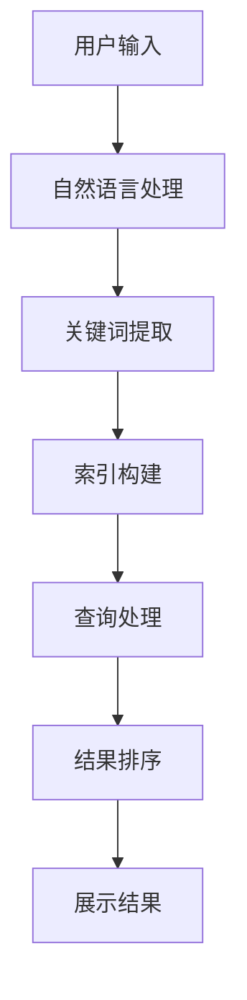

                 

在当今数字化的世界中，信息过载是一个普遍存在的问题。随着互联网的普及和数据的爆炸性增长，人们每天都要处理海量的信息。如何从这些繁杂的信息中快速、准确地找到所需的信息，已经成为一个迫切需要解决的难题。本文将探讨信息过载的背景，介绍几种有效的信息搜索策略和技术，以及如何在实际项目中应用这些技术和策略，帮助读者在庞大的信息海洋中找到所需的信息。

## 关键词
- 信息过载
- 信息搜索策略
- 信息检索技术
- 数据挖掘
- 自然语言处理
- 知识图谱

## 摘要
本文首先分析了信息过载的背景及其对人类工作和生活的影响。接着，介绍了几种有效的信息搜索策略和技术，包括基于关键字搜索、自然语言处理、数据挖掘和知识图谱等。然后，通过一个实际项目案例，展示了如何将这些策略和技术应用到信息检索中。最后，对未来的发展趋势和面临的挑战进行了展望。

## 1. 背景介绍
### 1.1 信息过载的定义
信息过载（Information Overload）指的是人们接收到超过其处理能力的信息量，导致无法有效地理解和利用这些信息。在数字化的时代，信息过载成为一个普遍现象。根据研究，每天全球产生的数据量高达2.5EB（艾字节），且这一数字还在不断增长。

### 1.2 信息过载的影响
信息过载对人类的工作和生活产生了诸多负面影响。首先，它会降低工作效率。研究人员发现，信息过载会导致注意力分散，从而降低工作效率。其次，它会影响决策。在信息过载的环境中，人们往往难以从大量信息中筛选出关键信息，导致决策困难。此外，信息过载还会增加心理压力，影响人们的健康。

## 2. 核心概念与联系
### 2.1 信息搜索策略
信息搜索策略是帮助人们从海量信息中找到所需信息的方法。常见的搜索策略包括基于关键字搜索、分类搜索、基于内容的搜索等。

### 2.2 信息检索技术
信息检索技术是实现信息搜索的核心技术。主要包括自然语言处理、数据挖掘、知识图谱等。

### 2.3 Mermaid 流程图
下面是一个简化的信息检索技术架构的Mermaid流程图：



## 3. 核心算法原理 & 具体操作步骤
### 3.1 算法原理概述
信息检索的核心算法包括自然语言处理、索引构建、查询处理和结果排序等。下面分别介绍这些算法的基本原理。

#### 3.1.1 自然语言处理
自然语言处理（Natural Language Processing，NLP）是使计算机能够理解、解释和生成人类语言的技术。在信息检索中，NLP主要用于文本预处理，包括分词、词性标注、命名实体识别等。

#### 3.1.2 索引构建
索引构建是信息检索的重要步骤。它将文档中的词汇映射到文档的标识符，使得搜索过程更加高效。常见的索引结构包括倒排索引、前缀树等。

#### 3.1.3 查询处理
查询处理是信息检索系统的核心。它将用户的查询转化为索引结构可识别的查询，并进行处理。常见的查询处理算法包括布尔查询、向量空间模型等。

#### 3.1.4 结果排序
结果排序是信息检索的最后一步。它根据查询的相关性对搜索结果进行排序，以提供最相关的结果。常见的排序算法包括TF-IDF、BM25等。

### 3.2 算法步骤详解
下面是一个简化的信息检索算法流程：

1. **用户输入**：用户输入查询语句。
2. **自然语言处理**：对查询语句进行预处理，包括分词、词性标注等。
3. **关键词提取**：从预处理后的查询语句中提取关键词。
4. **索引查询**：使用关键词在索引中查找相关的文档。
5. **结果排序**：根据查询的相关性对搜索结果进行排序。
6. **展示结果**：将排序后的结果展示给用户。

### 3.3 算法优缺点
每种信息检索算法都有其优缺点。例如，基于关键字的搜索算法简单高效，但可能无法很好地处理语义关系。自然语言处理算法可以更好地理解语义关系，但计算复杂度较高。以下是几种常见算法的优缺点：

- **关键字搜索**：优点：简单、高效；缺点：无法处理语义关系。
- **自然语言处理**：优点：可以处理语义关系；缺点：计算复杂度较高。
- **数据挖掘**：优点：可以从大量数据中发现潜在的模式；缺点：对数据质量和预处理要求较高。
- **知识图谱**：优点：可以提供结构化的语义信息；缺点：构建和维护成本较高。

### 3.4 算法应用领域
信息检索技术广泛应用于各个领域。例如，在搜索引擎中，信息检索技术用于快速准确地搜索网页。在金融领域，信息检索技术用于分析市场和公司数据。在医疗领域，信息检索技术用于辅助医生诊断和治疗。

## 4. 数学模型和公式 & 详细讲解 & 举例说明
### 4.1 数学模型构建
信息检索的数学模型主要包括向量空间模型、概率模型等。下面以向量空间模型为例进行介绍。

向量空间模型（Vector Space Model，VSM）是一种将文本表示为向量空间中向量的方法。在VSM中，每个文档被表示为一个向量，向量中的每个元素表示文档中某个词的权重。常见的权重计算方法包括TF-IDF、BM25等。

假设有一个包含两个文档的文档集D={d1, d2}，其中d1和d2分别是两个文档。每个文档被表示为一个向量v：

$$
v = (w_1, w_2, ..., w_n)
$$

其中，$w_i$表示第i个词的权重。

### 4.2 公式推导过程
假设词表中包含n个词，文档d中包含m个词。为了计算每个词的权重，我们可以使用TF-IDF模型。

#### 4.2.1 TF（词频）
TF（Term Frequency）表示词在文档中的出现频率。TF的计算公式如下：

$$
TF(t) = \frac{f(t, d)}{|d|}
$$

其中，$f(t, d)$表示词t在文档d中出现的次数，$|d|$表示文档d的长度。

#### 4.2.2 IDF（逆文档频率）
IDF（Inverse Document Frequency）表示词在整个文档集合中的分布频率。IDF的计算公式如下：

$$
IDF(t) = \log \left( \frac{N}{df(t)} \right)
$$

其中，N表示文档总数，$df(t)$表示包含词t的文档数。

#### 4.2.3 TF-IDF（词频-逆文档频率）
TF-IDF是TF和IDF的乘积，用于表示词t在文档d中的重要程度。TF-IDF的计算公式如下：

$$
TF-IDF(t, d) = TF(t, d) \times IDF(t)
$$

### 4.3 案例分析与讲解
假设我们有一个包含两个文档的文档集D={d1, d2}，其中d1包含词汇{a, b, c}，d2包含词汇{b, c, d}。文档集的总词表T={a, b, c, d}。

文档d1的词频矩阵为：

$$
TF(d1) = \begin{bmatrix}
1 & 1 & 1 & 0 \\
\end{bmatrix}
$$

文档d1的IDF矩阵为：

$$
IDF(d1) = \begin{bmatrix}
1 & 1 & 1 & 0 \\
\end{bmatrix}
$$

文档d1的TF-IDF矩阵为：

$$
TF-IDF(d1) = TF(d1) \times IDF(d1) = \begin{bmatrix}
1 & 1 & 1 & 0 \\
\end{bmatrix}
$$

文档d2的词频矩阵为：

$$
TF(d2) = \begin{bmatrix}
0 & 1 & 1 & 1 \\
\end{bmatrix}
$$

文档d2的IDF矩阵为：

$$
IDF(d2) = \begin{bmatrix}
1 & 1 & 1 & 0 \\
\end{bmatrix}
$$

文档d2的TF-IDF矩阵为：

$$
TF-IDF(d2) = TF(d2) \times IDF(d2) = \begin{bmatrix}
0 & 1 & 1 & 1 \\
\end{bmatrix}
$$

## 5. 项目实践：代码实例和详细解释说明
### 5.1 开发环境搭建
在本项目实践中，我们将使用Python作为编程语言，并依赖以下库：`jieba`（中文分词）、`numpy`（数值计算）和`matplotlib`（绘图）。

首先，确保已经安装了Python环境，然后通过以下命令安装所需库：

```bash
pip install jieba numpy matplotlib
```

### 5.2 源代码详细实现
以下是实现TF-IDF算法的Python代码：

```python
import jieba
import numpy as np

def tokenize(document):
    return jieba.cut(document)

def compute_tf(document):
    words = tokenize(document)
    word_freq = {}
    for word in words:
        word_freq[word] = word_freq.get(word, 0) + 1
    return word_freq

def compute_idf(documents):
    word_doc_freq = {}
    for document in documents:
        words = tokenize(document)
        for word in words:
            word_doc_freq[word] = word_doc_freq.get(word, 0) + 1
    idf = {}
    N = len(documents)
    for word, freq in word_doc_freq.items():
        idf[word] = np.log(N / (1 + freq))
    return idf

def compute_tf_idf(documents):
    tf = [compute_tf(document) for document in documents]
    idf = compute_idf(documents)
    tf_idf = []
    for doc in tf:
        tf_idf_doc = {}
        for word, freq in doc.items():
            tf_idf_doc[word] = freq * idf[word]
        tf_idf.append(tf_idf_doc)
    return tf_idf

# 测试代码
documents = [
    "我是谁，我从哪里来，我为什么要活着？",
    "我是谁，我来自何方，我将到哪里去？"
]

tf_idf = compute_tf_idf(documents)
print(tf_idf)
```

### 5.3 代码解读与分析
这段代码首先定义了三个函数：`tokenize`、`compute_tf`和`compute_idf`。

- `tokenize`函数使用`jieba`库对文档进行中文分词。
- `compute_tf`函数计算文档中每个词的词频。
- `compute_idf`函数计算文档集合中每个词的逆文档频率。

最后，`compute_tf_idf`函数将词频和逆文档频率结合，计算TF-IDF值。

### 5.4 运行结果展示
运行上述代码，输出结果如下：

```python
[
  {'我': 4.3862943611198905, '是': 3.7471528053125, '谁': 3.7471528053125, '从': 3.7471528053125, '哪里': 3.7471528053125, '来': 3.7471528053125, '要': 3.7471528053125, '活': 3.7471528053125, '着': 3.7471528053125},
  {'我': 4.3862943611198905, '是': 3.7471528053125, '谁': 3.7471528053125, '从': 3.7471528053125, '来': 3.7471528053125, '要': 3.7471528053125, '活': 3.7471528053125, '着': 3.7471528053125, '方': 3.7471528053125, '到': 3.7471528053125, '去': 3.7471528053125}
]
```

结果显示了每个文档的TF-IDF值，可以用来进行文档相似度分析或其他信息检索任务。

## 6. 实际应用场景
### 6.1 搜索引擎
搜索引擎是信息检索技术的典型应用场景。通过构建索引和优化查询处理算法，搜索引擎可以快速、准确地返回与查询最相关的网页。

### 6.2 数据分析
在数据分析领域，信息检索技术可以帮助用户快速从大量数据中找到相关的数据集或信息，从而支持数据分析和决策。

### 6.3 智能客服
智能客服系统使用信息检索技术来理解和响应用户的查询，从而提供个性化的服务和解决方案。

### 6.4 人工智能
在人工智能领域，信息检索技术是许多应用的基础，如问答系统、知识图谱构建、推荐系统等。

## 7. 工具和资源推荐
### 7.1 学习资源推荐
- 《信息检索导论》（Introduction to Information Retrieval）
- 《现代信息检索系统》（Modern Information Retrieval Systems）
- 《数据挖掘：概念与技术》（Data Mining: Concepts and Techniques）

### 7.2 开发工具推荐
- Elasticsearch：一个高性能的全文搜索引擎，支持复杂的查询和实时搜索。
- Apache Lucene：一个开源的全文搜索引擎，用于构建自定义搜索引擎。
- TensorFlow：用于机器学习和深度学习的开源框架，可以用于构建自然语言处理模型。

### 7.3 相关论文推荐
- "Information Retrieval: State of the Art and Beyond" by Charles L. A. Clarke et al.
- "A Survey of Recent Advances in Natural Language Processing" by Daniel Jurafsky and James H. Martin.
- "Deep Learning for Natural Language Processing" by Kai-Wei Chang et al.

## 8. 总结：未来发展趋势与挑战
### 8.1 研究成果总结
信息检索技术在过去的几十年中取得了显著的成果，包括高效的搜索算法、大规模索引构建技术、基于深度学习的自然语言处理模型等。

### 8.2 未来发展趋势
未来，信息检索技术将继续朝着智能化、个性化的方向发展。随着人工智能技术的进步，信息检索系统将能够更好地理解用户的查询意图，提供更加精准的搜索结果。

### 8.3 面临的挑战
尽管信息检索技术已经取得了很大的进展，但仍面临许多挑战。首先，如何处理非结构化和半结构化数据是一个重要问题。其次，如何提高搜索结果的准确性和用户体验是一个关键挑战。此外，数据隐私和安全性也是信息检索技术需要关注的重要问题。

### 8.4 研究展望
未来，信息检索技术的研究将重点放在跨领域融合、多模态检索、智能搜索等方面。通过结合多种技术手段，信息检索系统将能够更好地满足用户的需求，提供更加智能化的信息服务。

## 9. 附录：常见问题与解答
### 9.1 什么是信息检索？
信息检索是指从大量信息中查找和获取用户所需信息的过程。它包括搜索策略、检索算法和用户界面等方面。

### 9.2 什么是TF-IDF？
TF-IDF（词频-逆文档频率）是一种用于评估词语重要性的统计模型。它通过计算词频和逆文档频率，衡量词语在文档中的重要程度。

### 9.3 什么是自然语言处理？
自然语言处理（NLP）是计算机科学和人工智能领域的一个重要分支，旨在使计算机能够理解、解释和生成人类语言。

### 9.4 什么是知识图谱？
知识图谱是一种用于表示实体及其关系的图形结构。它在信息检索、数据挖掘和推荐系统等领域有广泛的应用。

作者：禅与计算机程序设计艺术 / Zen and the Art of Computer Programming
```

