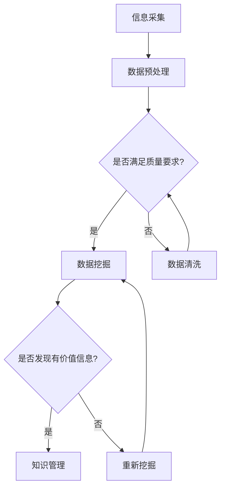

                 

关键词：信息过载、信息筛选、数据挖掘、人工智能、算法、数据质量、知识管理

> 摘要：随着数字化时代的到来，信息过载已成为影响工作效率和决策质量的一大难题。本文旨在探讨信息过载现象的背景及其影响，深入分析信息筛选策略的原理和实施方法，并介绍相关算法与实践案例，以帮助读者在信息洪流中有效筛选出有价值的信息，提升个人和组织的信息处理能力。

## 1. 背景介绍

在当今这个数字化、网络化的时代，信息的产生和传播速度前所未有的快。据估算，全球每天产生的数据量达到了约2.5艾字节（EB）。这些数据包括社交媒体帖子、电子邮件、新闻报道、科学研究论文、商业报告等各种形式。然而，这些海量信息的背后，却隐藏着信息过载的问题。

信息过载是指信息接收者面临的信息量超过了其处理能力，导致无法有效处理和利用这些信息的现象。信息过载不仅影响了人们的工作和生活质量，还可能对决策过程产生负面影响。例如，企业在面对大量市场数据时，很难从中提取出有价值的信息，从而做出准确的商业决策。

### 信息过载的影响

- **工作效率下降**：在处理大量信息时，人们往往容易分心，导致工作效率下降。
- **决策困难**：信息过载使决策者难以从海量数据中提取出关键信息，导致决策困难。
- **信息焦虑**：面对不断涌入的信息，许多人会感到焦虑和压力。
- **资源浪费**：企业或个人可能花费大量时间和资源来处理无关或低价值的信息。

### 信息筛选的必要性

在信息过载的时代，信息筛选成为一项关键能力。有效的信息筛选策略可以帮助我们快速定位到有价值的信息，提高工作效率和决策质量。本文将深入探讨信息筛选的策略与实践，以帮助读者应对信息过载的挑战。

## 2. 核心概念与联系

### 2.1 数据挖掘

数据挖掘（Data Mining）是指从大量数据中提取出有价值信息的过程。它是一种通过统计分析和机器学习算法来发现数据中隐藏的模式和规律的技术。

### 2.2 人工智能

人工智能（Artificial Intelligence，AI）是指模拟人类智能的计算机系统。通过机器学习和深度学习等技术，AI系统能够自动从数据中学习、推理和决策。

### 2.3 知识管理

知识管理（Knowledge Management）是指通过系统的方法和工具，对知识进行收集、存储、共享和利用的过程。知识管理有助于提高组织的知识水平和创新能力。

### 2.4 数据质量

数据质量（Data Quality）是指数据满足特定业务需求的能力。高质量的数据能够提高信息筛选的准确性和有效性。

### 2.5 Mermaid 流程图

为了更好地理解信息筛选的过程，下面是一个用Mermaid绘制的流程图：



在这个流程图中，信息采集是第一步，通过数据预处理来处理原始数据。接下来，通过数据挖掘算法来提取有价值的信息。如果数据质量不满足要求，则需要先进行数据清洗。最后，将挖掘到的信息进行知识管理，以便于未来的利用。

## 3. 核心算法原理 & 具体操作步骤

### 3.1 算法原理概述

在信息筛选过程中，常用的算法包括数据挖掘算法、机器学习算法和深度学习算法。以下将介绍其中两种算法：K-means聚类算法和决策树算法。

### 3.2 算法步骤详解

#### 3.2.1 K-means聚类算法

K-means算法是一种基于距离的聚类算法。它的基本思想是将数据集划分为K个簇，使得每个簇内部的点尽可能接近，而不同簇之间的点尽可能远。

算法步骤：

1. 随机初始化K个簇中心点。
2. 对于每个数据点，计算它与各个簇中心点的距离，并将其分配到最近的簇。
3. 重新计算每个簇的中心点。
4. 重复步骤2和3，直到聚类结果收敛（即簇中心点不再发生变化）。

#### 3.2.2 决策树算法

决策树是一种基于特征划分的数据挖掘算法。它的基本思想是通过一系列特征划分数据集，构建出一棵树形结构，每个节点代表一个特征划分，每个叶节点代表一个类别。

算法步骤：

1. 选择一个最优特征作为节点。
2. 根据该特征将数据集划分为若干个子集。
3. 对于每个子集，重复步骤1和2，直到满足终止条件（如最大深度、最小样本量等）。
4. 构建出完整的决策树。

### 3.3 算法优缺点

#### 3.3.1 K-means聚类算法

优点：

- 算法简单，易于实现。
- 对初始簇中心点的选择不敏感。

缺点：

- 对噪声和离群点敏感。
- 无法预测聚类个数K。

#### 3.3.2 决策树算法

优点：

- 易于理解，直观。
- 对噪声和离群点有一定的鲁棒性。

缺点：

- 可能会过度拟合。
- 随着数据量的增加，决策树深度可能会无限增加。

### 3.4 算法应用领域

K-means聚类算法和决策树算法在信息筛选中都有广泛的应用。例如，K-means算法可以用于市场细分、客户群体划分等；决策树算法可以用于信用评估、风险评估等。

## 4. 数学模型和公式 & 详细讲解 & 举例说明

### 4.1 数学模型构建

在信息筛选过程中，常用的数学模型包括距离度量、概率模型和优化模型。

#### 4.1.1 距离度量

距离度量是聚类算法的基础。常用的距离度量包括欧氏距离、曼哈顿距离和切比雪夫距离。

$$
d(\mathbf{x}_i, \mathbf{x}_j) = \sqrt{\sum_{k=1}^n (x_{ik} - x_{jk})^2}
$$

$$
d(\mathbf{x}_i, \mathbf{x}_j) = \sum_{k=1}^n |x_{ik} - x_{jk}|
$$

$$
d(\mathbf{x}_i, \mathbf{x}_j) = \max_{k=1,...,n} |x_{ik} - x_{jk}|
$$

#### 4.1.2 概率模型

概率模型在信息筛选中有着广泛的应用。例如，贝叶斯分类器就是一种基于概率的算法。

$$
P(A|B) = \frac{P(B|A)P(A)}{P(B)}
$$

#### 4.1.3 优化模型

优化模型用于求解最优解。常见的优化算法包括梯度下降、牛顿法和模拟退火等。

$$
\min_{\mathbf{w}} J(\mathbf{w}) = \sum_{i=1}^m (y_i - \mathbf{w}^T \mathbf{x}_i)^2
$$

### 4.2 公式推导过程

以K-means聚类算法为例，推导簇中心点的计算公式。

假设我们有K个簇，每个簇由C个数据点组成，簇中心点表示为$\mathbf{c}_k$。每个数据点$x_i$与簇中心点之间的距离为$d(x_i, \mathbf{c}_k)$。

我们希望找到簇中心点，使得每个簇内的数据点距离簇中心点的平均距离最小。

$$
\min_{\mathbf{c}_k} \sum_{i=1}^C d(x_i, \mathbf{c}_k)^2
$$

对$d(x_i, \mathbf{c}_k)$进行平方，得到：

$$
\min_{\mathbf{c}_k} \sum_{i=1}^C (x_{ik} - c_{k})^2
$$

对上式求导，并令导数为0，得到：

$$
\frac{\partial}{\partial c_{k}} \sum_{i=1}^C (x_{ik} - c_{k})^2 = 0
$$

$$
\sum_{i=1}^C (x_{ik} - c_{k}) = 0
$$

$$
c_{k} = \frac{1}{C} \sum_{i=1}^C x_{ik}
$$

这就是簇中心点的计算公式。

### 4.3 案例分析与讲解

假设我们有一个数据集，包含5个数据点，分为2个簇。数据集如下：

$$
\begin{align*}
x_1 &= (1, 2) \\
x_2 &= (2, 3) \\
x_3 &= (3, 4) \\
x_4 &= (4, 5) \\
x_5 &= (5, 6)
\end{align*}
$$

我们希望使用K-means算法将其分为2个簇。

#### 4.3.1 初始簇中心点选择

我们随机选择两个数据点作为初始簇中心点：

$$
\mathbf{c}_1 = (1, 2), \quad \mathbf{c}_2 = (5, 6)
$$

#### 4.3.2 数据点分配

根据距离公式，计算每个数据点与簇中心点的距离：

$$
\begin{align*}
d(x_1, \mathbf{c}_1) &= \sqrt{(1-1)^2 + (2-2)^2} = 0 \\
d(x_1, \mathbf{c}_2) &= \sqrt{(1-5)^2 + (2-6)^2} = \sqrt{16 + 16} = 4 \\
d(x_2, \mathbf{c}_1) &= \sqrt{(2-1)^2 + (3-2)^2} = \sqrt{1 + 1} = \sqrt{2} \\
d(x_2, \mathbf{c}_2) &= \sqrt{(2-5)^2 + (3-6)^2} = \sqrt{9 + 9} = 3 \\
d(x_3, \mathbf{c}_1) &= \sqrt{(3-1)^2 + (4-2)^2} = \sqrt{4 + 4} = 2\sqrt{2} \\
d(x_3, \mathbf{c}_2) &= \sqrt{(3-5)^2 + (4-6)^2} = \sqrt{4 + 4} = 2\sqrt{2} \\
d(x_4, \mathbf{c}_1) &= \sqrt{(4-1)^2 + (5-2)^2} = \sqrt{9 + 9} = 3 \\
d(x_4, \mathbf{c}_2) &= \sqrt{(4-5)^2 + (5-6)^2} = \sqrt{1 + 1} = \sqrt{2} \\
d(x_5, \mathbf{c}_1) &= \sqrt{(5-1)^2 + (6-2)^2} = \sqrt{16 + 16} = 4 \\
d(x_5, \mathbf{c}_2) &= \sqrt{(5-5)^2 + (6-6)^2} = 0 \\
\end{align*}
$$

根据距离最小原则，将数据点分配到最近的簇：

$$
x_1, x_5 \in C_1, \quad x_2, x_3, x_4 \in C_2
$$

#### 4.3.3 重新计算簇中心点

根据新的数据点分配结果，重新计算簇中心点：

$$
\mathbf{c}_1 = \frac{1}{2}(1 + 5) = (3, 3.5), \quad \mathbf{c}_2 = \frac{1}{3}(2 + 3 + 4) = (3, 3)
$$

#### 4.3.4 迭代过程

继续进行数据点分配和簇中心点计算，直到聚类结果收敛：

$$
\begin{align*}
d(x_1, \mathbf{c}_1') &= \sqrt{(1-3)^2 + (2-3.5)^2} = \sqrt{4 + 1.5} = \sqrt{5.5} \\
d(x_1, \mathbf{c}_2') &= \sqrt{(1-3)^2 + (2-3)^2} = \sqrt{4 + 1} = \sqrt{5} \\
d(x_2, \mathbf{c}_1') &= \sqrt{(2-3)^2 + (3-3.5)^2} = \sqrt{1 + 0.5} = \sqrt{1.5} \\
d(x_2, \mathbf{c}_2') &= \sqrt{(2-3)^2 + (3-3)^2} = 1 \\
d(x_3, \mathbf{c}_1') &= \sqrt{(3-3)^2 + (4-3.5)^2} = 0.5 \\
d(x_3, \mathbf{c}_2') &= \sqrt{(3-3)^2 + (4-3)^2} = 1 \\
d(x_4, \mathbf{c}_1') &= \sqrt{(4-3)^2 + (5-3.5)^2} = \sqrt{1 + 2.25} = \sqrt{3.25} \\
d(x_4, \mathbf{c}_2') &= \sqrt{(4-3)^2 + (5-3)^2} = \sqrt{2} \\
d(x_5, \mathbf{c}_1') &= \sqrt{(5-3)^2 + (6-3.5)^2} = \sqrt{4 + 3.25} = \sqrt{7.25} \\
d(x_5, \mathbf{c}_2') &= \sqrt{(5-3)^2 + (6-3)^2} = \sqrt{4 + 3} = \sqrt{7} \\
\end{align*}
$$

根据新的距离结果，重新分配数据点：

$$
x_1, x_2 \in C_1, \quad x_3, x_4, x_5 \in C_2
$$

重新计算簇中心点：

$$
\mathbf{c}_1 = \frac{1}{2}(1 + 2) = 1.5, \quad \mathbf{c}_2 = \frac{1}{3}(3 + 4 + 5) = 4
$$

由于簇中心点的变化量较小，我们可以认为聚类结果已经收敛。

## 5. 项目实践：代码实例和详细解释说明

在本节中，我们将通过一个实际项目实践，展示如何使用K-means算法进行信息筛选。我们将使用Python编程语言，结合Scikit-learn库来实现。

### 5.1 开发环境搭建

在开始之前，我们需要搭建Python开发环境。以下是搭建过程：

1. 安装Python：前往[Python官网](https://www.python.org/)下载并安装Python 3.x版本。
2. 安装Scikit-learn库：打开终端，执行以下命令：

```bash
pip install scikit-learn
```

### 5.2 源代码详细实现

下面是一个使用K-means算法进行信息筛选的Python代码示例：

```python
import numpy as np
from sklearn.cluster import KMeans
import matplotlib.pyplot as plt

# 示例数据
X = np.array([[1, 2], [2, 3], [3, 4], [4, 5], [5, 6]])

# 初始化KMeans模型
kmeans = KMeans(n_clusters=2, random_state=0).fit(X)

# 计算簇中心点
centroids = kmeans.cluster_centers_

# 分配数据点到簇
labels = kmeans.predict(X)

# 绘制结果
plt.scatter(X[:, 0], X[:, 1], c=labels, s=100, cmap='viridis')
plt.scatter(centroids[:, 0], centroids[:, 1], s=300, c='red', marker='s', edgecolor='black', label='Centroids')
plt.title('K-means Clustering')
plt.xlabel('Feature 1')
plt.ylabel('Feature 2')
plt.legend()
plt.show()
```

### 5.3 代码解读与分析

下面是对上述代码的解读与分析：

1. 导入所需的库：`numpy`用于数据处理，`sklearn.cluster`用于K-means算法实现，`matplotlib.pyplot`用于绘图。
2. 初始化示例数据：我们使用一个简单的二维数据集，包含5个数据点。
3. 初始化KMeans模型：使用`KMeans`类初始化模型，设置`n_clusters`为2，表示我们要将数据分为2个簇。`random_state`用于保证每次运行结果的一致性。
4. 训练模型：调用`fit`方法对数据进行训练。
5. 计算簇中心点：使用`cluster_centers_`属性获取簇中心点。
6. 分配数据点到簇：使用`predict`方法将数据点分配到簇。
7. 绘制结果：使用`scatter`函数绘制数据点和簇中心点。

### 5.4 运行结果展示

运行上述代码后，我们得到一个包含2个簇的散点图，簇中心点用红色方形标记。通过观察散点图，我们可以直观地看到K-means算法对数据点的聚类效果。


## 6. 实际应用场景

信息筛选技术在多个领域都有着广泛的应用。以下是一些典型应用场景：

### 6.1 营销领域

在营销领域，企业需要从大量的客户数据中筛选出潜在客户。通过信息筛选技术，企业可以快速识别出具有高购买意愿的客户群体，从而提高营销效率。

### 6.2 医疗领域

在医疗领域，医生需要从海量的病例和医学文献中筛选出与患者病情相关的信息。信息筛选技术可以帮助医生快速定位到关键病例和文献，提高诊断和治疗的准确性。

### 6.3 金融领域

在金融领域，金融机构需要从大量的交易数据中筛选出异常交易，以便及时发现和防范风险。信息筛选技术可以帮助金融机构提高风险管理的效率和准确性。

### 6.4 社交媒体领域

在社交媒体领域，平台需要从大量的用户生成内容中筛选出优质内容，以提升用户体验。信息筛选技术可以帮助平台提高内容推荐的准确性，从而增加用户黏性。

## 7. 未来应用展望

随着技术的不断发展，信息筛选技术将在未来得到更广泛的应用。以下是一些未来应用展望：

### 7.1 多模态信息筛选

多模态信息筛选是指结合多种类型的数据（如文本、图像、音频等）进行信息筛选。未来的信息筛选技术将能够更好地处理多模态数据，从而提高信息筛选的准确性和效率。

### 7.2 智能信息筛选

随着人工智能技术的发展，未来的信息筛选技术将更加智能化。通过深度学习等算法，信息筛选系统将能够自动学习用户的偏好和需求，提供个性化的信息筛选服务。

### 7.3 实时信息筛选

随着物联网和5G技术的普及，实时信息筛选将成为一个重要应用方向。未来的信息筛选技术将能够实时处理和分析海量数据，提供及时、准确的信息。

### 7.4 隐私保护

在信息筛选过程中，隐私保护是一个重要问题。未来的信息筛选技术将更加注重隐私保护，确保用户数据的隐私安全。

## 8. 总结：未来发展趋势与挑战

在信息过载的时代，信息筛选技术的重要性日益凸显。未来，信息筛选技术将朝着智能化、实时化、多模态和隐私保护等方向发展。然而，这也将带来一系列挑战：

### 8.1 数据质量

随着数据量的增加，数据质量成为信息筛选的一大挑战。高质量的数据是信息筛选的基础，因此数据清洗和数据质量提升技术将成为信息筛选领域的研究重点。

### 8.2 隐私保护

在信息筛选过程中，隐私保护是一个重要问题。如何在保证数据隐私的前提下进行信息筛选，是未来研究的重要方向。

### 8.3 模型解释性

许多信息筛选算法（如深度学习算法）具有很高的准确性，但缺乏解释性。未来的研究将关注如何提高信息筛选算法的可解释性，使其更容易被用户理解和信任。

### 8.4 跨领域应用

随着信息筛选技术的不断发展，如何将其应用于更多领域，实现跨领域应用，是未来的一个重要研究方向。

## 9. 附录：常见问题与解答

### 9.1 什么是信息过载？

信息过载是指信息接收者面临的信息量超过了其处理能力，导致无法有效处理和利用这些信息的现象。

### 9.2 信息筛选有什么作用？

信息筛选有助于从海量信息中快速定位到有价值的信息，提高工作效率和决策质量。

### 9.3 什么是数据挖掘？

数据挖掘是指从大量数据中提取出有价值信息的过程。它是一种通过统计分析和机器学习算法来发现数据中隐藏的模式和规律的技术。

### 9.4 什么情况下需要使用信息筛选技术？

在以下情况下，使用信息筛选技术可以显著提高工作效率和决策质量：

- 面对大量数据时，需要从中提取出关键信息。
- 需要快速识别出潜在客户或风险。
- 需要从海量的文献或病例中筛选出相关内容。

### 9.5 信息筛选技术的未来发展方向是什么？

未来的信息筛选技术将朝着智能化、实时化、多模态和隐私保护等方向发展。同时，如何提高数据质量和模型解释性，实现跨领域应用，也是未来的重要研究方向。

## 作者署名

作者：禅与计算机程序设计艺术 / Zen and the Art of Computer Programming
----------------------------------------------------------------
以上是关于“信息过载与信息筛选策略与实践：在信息洪流中找到有价值的信息”的完整文章。文章分为背景介绍、核心概念与联系、核心算法原理与具体操作步骤、数学模型和公式、项目实践、实际应用场景、未来应用展望、总结与常见问题解答等部分，力求为读者提供一个全面、深入的信息筛选技术解读。希望这篇文章能够帮助您更好地应对信息过载的挑战，提升信息处理能力。再次感谢您对这篇文章的关注和支持！


