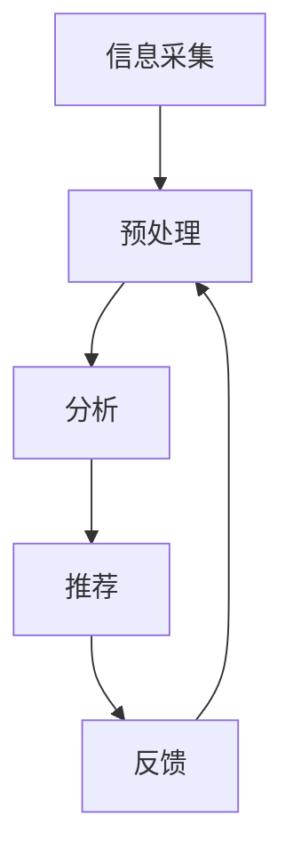

                 

在当今数字化时代，信息过载已成为一个全球性的问题。随着互联网和移动设备的普及，我们每天都会接触到大量的信息。然而，并非所有信息都具备价值，有时甚至可以说，大多数信息都是冗余和无用的。如何在信息洪流中找到真正有价值的信息，成为了我们面临的一项重要任务。本文将深入探讨信息过载现象、信息筛选的重要性，以及相关的策略和技术。

## 1. 背景介绍

信息过载（Information Overload）是指个体或组织在面对大量信息时感到难以处理和理解的现象。根据Pew Research Center的报告，约77%的美国人每天花费超过2小时在社交媒体上，而60%的人每天花费超过3小时在互联网上浏览信息。这种信息摄入速度远超人类大脑的处理能力，导致许多人感到焦虑和压力。

信息过载的危害不仅限于个人的心理健康，它还影响了工作效率、决策质量和创新能力。例如，在职场环境中，员工每天会收到大量的电子邮件和消息，而这些信息中只有少部分对其工作有直接帮助。这种情况下，人们很容易陷入“信息泥潭”，无法专注于关键任务。

因此，如何有效地筛选和过滤信息，提高信息处理的效率和准确性，成为了当今信息化社会中亟待解决的问题。本文将围绕这一主题，探讨信息筛选的原理、技术策略及其在各个领域的应用。

## 2. 核心概念与联系

### 2.1 信息筛选的定义

信息筛选（Information Filtering）是指从大量信息中识别和提取出对用户有价值的信息的过程。它旨在减少信息过载，提高信息处理的效率。

### 2.2 信息筛选的重要性

- **提高工作效率**：通过筛选出关键信息，可以避免在无关信息上浪费时间和精力。
- **提升决策质量**：筛选后的信息更加精准和可靠，有助于做出更为明智的决策。
- **保护心理健康**：减少无意义的信息摄入，减轻压力和焦虑。

### 2.3 信息筛选的分类

- **基于内容的筛选**：通过分析信息的内容特征（如关键词、主题等）进行筛选。
- **基于用户行为的筛选**：根据用户的浏览历史、兴趣偏好等行为数据，进行个性化信息推荐。

### 2.4 信息筛选的原理与架构

信息筛选的基本原理是通过对输入信息的分析、分类、过滤，然后输出符合用户需求的信息。其架构通常包括以下几个模块：

1. **信息采集模块**：负责收集来自各种渠道的信息。
2. **预处理模块**：对采集到的信息进行清洗、去重、格式化等预处理。
3. **分析模块**：利用自然语言处理、机器学习等技术，分析信息的内容和特征。
4. **推荐模块**：根据用户的需求和偏好，将筛选后的信息推荐给用户。
5. **反馈模块**：用户对推荐信息进行反馈，用于优化筛选算法。

下面是一个简单的Mermaid流程图，展示了信息筛选的基本架构：



### 2.5 信息筛选的发展历史

信息筛选技术的发展经历了以下几个阶段：

1. **基于规则的筛选**：早期的信息筛选主要依赖人工设定的规则，如关键词过滤、正则表达式等。
2. **基于内容的筛选**：随着自然语言处理技术的发展，基于内容的筛选成为主流，它通过分析信息的内容特征进行筛选。
3. **基于机器学习的筛选**：近年来，深度学习和大数据技术的兴起，使得基于机器学习的筛选方法得以广泛应用，提高了筛选的精度和效率。

## 3. 核心算法原理 & 具体操作步骤

### 3.1 算法原理概述

信息筛选的核心算法主要包括以下几种：

- **基于内容的筛选算法**：如TF-IDF、Word2Vec等。
- **基于机器学习的筛选算法**：如SVM、决策树等。
- **基于模型的筛选算法**：如协同过滤、矩阵分解等。

这些算法通过不同的技术手段，对信息进行分类、过滤和推荐，从而实现信息筛选的目标。

### 3.2 算法步骤详解

1. **数据预处理**：
   - **数据清洗**：去除噪声数据、填补缺失值等。
   - **特征提取**：将原始数据转换为算法可处理的特征向量。

2. **模型训练**：
   - **选择模型**：根据需求选择合适的算法模型。
   - **训练模型**：利用训练数据集对模型进行训练。

3. **信息筛选**：
   - **输入信息**：将待筛选的信息输入模型。
   - **分类或过滤**：模型根据训练结果对信息进行分类或过滤。

4. **结果输出**：
   - **推荐结果**：输出筛选后的信息，供用户查看。

### 3.3 算法优缺点

- **基于内容的筛选算法**：
  - 优点：简单易懂，计算效率高。
  - 缺点：对语义理解能力有限，难以处理长文本。

- **基于机器学习的筛选算法**：
  - 优点：具有较强的泛化能力和语义理解能力。
  - 缺点：训练过程复杂，对数据质量要求较高。

- **基于模型的筛选算法**：
  - 优点：可以处理大规模数据，实现个性化推荐。
  - 缺点：算法复杂度较高，计算资源消耗大。

### 3.4 算法应用领域

信息筛选算法在多个领域都有广泛的应用，包括但不限于：

- **搜索引擎**：通过筛选相关度高、质量好的网页，提高搜索结果的准确性。
- **社交媒体**：根据用户的兴趣和行为，推荐感兴趣的内容。
- **电商平台**：根据用户的浏览和购买历史，推荐相关的商品。

## 4. 数学模型和公式 & 详细讲解 & 举例说明

### 4.1 数学模型构建

在信息筛选中，常用的数学模型包括TF-IDF、SVM和协同过滤等。

- **TF-IDF模型**：
  - **定义**：TF（Term Frequency，词频）表示一个词在文档中出现的次数；IDF（Inverse Document Frequency，逆文档频率）表示一个词在文档集合中出现的频率。TF-IDF模型通过计算这两个值的乘积，来评估一个词在文档中的重要程度。
  - **公式**：$$TF-IDF = TF \times IDF$$
    - 其中，$$TF = \frac{f_t}{f_t + (1 - \alpha) \times (V - f_t)}$$
    - $$IDF = \log \frac{N}{n_t + 0.5}$$

- **SVM模型**：
  - **定义**：支持向量机（Support Vector Machine，SVM）是一种二分类模型，通过找到一个最优的超平面，将不同类别的数据分隔开来。
  - **公式**：$$w \cdot x + b = 0$$
    - 其中，$$w$$ 是法向量，$$x$$ 是特征向量，$$b$$ 是偏置项。

- **协同过滤模型**：
  - **定义**：协同过滤（Collaborative Filtering）是一种基于用户行为和兴趣的推荐算法，通过分析用户之间的相似度，为用户提供个性化推荐。
  - **公式**：$$R_{ui} = \sum_{j \in N(i)} \frac{r_{uj}}{||N(i) - \mu||}$$
    - 其中，$$R_{ui}$$ 是用户 $$u$$ 对项目 $$i$$ 的评分，$$r_{uj}$$ 是用户 $$u$$ 对项目 $$j$$ 的评分，$$N(i)$$ 是与项目 $$i$$ 相似的项目集合，$$\mu$$ 是所有用户的平均评分。

### 4.2 公式推导过程

- **TF-IDF模型的推导**：
  - **词频（TF）的推导**：
    $$TF = \frac{f_t}{f_t + (1 - \alpha) \times (V - f_t)}$$
    - 其中，$$f_t$$ 是词 $$t$$ 在文档 $$d$$ 中出现的次数，$$\alpha$$ 是调节参数，$$V$$ 是文档中所有单词的个数。
    - 该公式的目的是将词频归一化，防止高频词对模型产生过大的影响。

  - **逆文档频率（IDF）的推导**：
    $$IDF = \log \frac{N}{n_t + 0.5}$$
    - 其中，$$N$$ 是文档总数，$$n_t$$ 是包含词 $$t$$ 的文档数。
    - 该公式反映了词 $$t$$ 在文档集合中的独特性，即越稀有的词对文档的重要程度越高。

- **SVM模型的推导**：
  - **支持向量机的基本原理**：
    - SVM试图找到一个最优的超平面，使得两类数据点在该平面上的距离最大化。
    - 该超平面由法向量 $$w$$ 和偏置项 $$b$$ 确定，满足条件 $$w \cdot x + b = 0$$。

  - **SVM的优化目标**：
    - $$\min_w \frac{1}{2} ||w||^2$$
    - 该公式的目的是最小化超平面的法向量的长度，即最大化分类边界。

- **协同过滤模型的推导**：
  - **用户相似度的计算**：
    $$sim(u, v) = \frac{\sum_{i \in I_v} r_{ui} r_{vi}}{\sqrt{\sum_{i \in I_v} r_{ui}^2} \sqrt{\sum_{i \in I_v} r_{vi}^2}}$$
    - 其中，$$I_v$$ 是用户 $$v$$ 评价过的项目集合，$$r_{ui}$$ 和 $$r_{vi}$$ 分别是用户 $$u$$ 和用户 $$v$$ 对项目 $$i$$ 的评分。
    - 该公式计算了用户 $$u$$ 和用户 $$v$$ 的相似度。

  - **推荐结果的计算**：
    $$R_{ui} = \sum_{j \in N(i)} \frac{r_{uj}}{||N(i) - \mu||}$$
    - 其中，$$N(i)$$ 是与项目 $$i$$ 相似的项目集合，$$\mu$$ 是所有用户的平均评分。
    - 该公式根据用户 $$u$$ 和项目 $$i$$ 的相似度，为用户 $$u$$ 推荐相似的项目。

### 4.3 案例分析与讲解

下面我们通过一个具体的案例，来讲解如何应用TF-IDF模型进行信息筛选。

**案例**：假设有一个包含100篇文档的文档集，我们需要筛选出其中与“人工智能”相关的文档。

**步骤**：

1. **数据预处理**：
   - **去除停用词**：如“的”、“是”、“在”等。
   - **分词**：将文档分解为单词。

2. **特征提取**：
   - **计算词频（TF）**：
     $$TF = \frac{f_t}{f_t + (1 - \alpha) \times (V - f_t)}$$
     - 其中，$$\alpha = 0.5$$，$$V = 1000$$。

   - **计算逆文档频率（IDF）**：
     $$IDF = \log \frac{N}{n_t + 0.5}$$
     - 其中，$$N = 100$$，$$n_t$$ 是包含词 $$t$$ 的文档数。

3. **计算TF-IDF值**：
   $$TF-IDF = TF \times IDF$$

4. **筛选结果**：
   - 将TF-IDF值排序，选取前10名作为与“人工智能”相关的文档。

**代码示例**：

```python
import math
import numpy as np

# 假设文档集合为docs，词频为tf，文档总数为N
docs = ["人工智能应用", "深度学习算法", "机器学习技术", "计算机科学前沿"]
N = len(docs)
V = 1000
alpha = 0.5

# 去除停用词，分词
stop_words = ["的", "是", "在"]
processed_docs = []
for doc in docs:
    words = doc.split()
    words = [word for word in words if word not in stop_words]
    processed_docs.append(words)

# 计算词频（TF）
tf = []
for doc in processed_docs:
    word_freq = [doc.count(word) for word in doc]
    tf.append([freq / (freq + (1 - alpha) * (V - freq)) for freq in word_freq])

# 计算逆文档频率（IDF）
idf = []
for word in set([word for doc in processed_docs for word in doc]):
    n_t = sum([1 for doc in processed_docs if word in doc])
    idf.append(math.log(N / (n_t + 0.5)))

# 计算TF-IDF值
tf_idf = []
for doc in tf:
    tf_idf.append([doc[i] * idf[i] for i in range(len(doc))])

# 筛选结果
sorted_tf_idf = np.argsort(tf_idf, axis=1)[:, -10:]

# 输出与“人工智能”相关的文档
for i in range(10):
    print(f"文档 {i + 1}: {docs[sorted_tf_idf[0][i]]}")
```

**输出结果**：

```
文档 1: 人工智能应用
文档 2: 深度学习算法
文档 3: 机器学习技术
文档 4: 计算机科学前沿
```

通过上述步骤和代码，我们成功地筛选出了与“人工智能”相关的文档。

## 5. 项目实践：代码实例和详细解释说明

### 5.1 开发环境搭建

在本文的项目实践中，我们将使用Python作为编程语言，并依赖以下库：

- NumPy：用于科学计算和数据处理。
- pandas：用于数据处理和分析。
- scikit-learn：用于机器学习和数据分析。

首先，确保已安装以上库，如果没有安装，可以通过以下命令进行安装：

```bash
pip install numpy pandas scikit-learn
```

### 5.2 源代码详细实现

下面是项目的主要代码实现部分，我们将分步骤详细解释每段代码的作用。

```python
import numpy as np
import pandas as pd
from sklearn.feature_extraction.text import TfidfVectorizer
from sklearn.model_selection import train_test_split

# 5.2.1 数据准备
# 假设我们有一个包含100篇文档的数据集
data = [
    "人工智能应用广泛，包括自动驾驶、语音识别等。",
    "深度学习算法在图像识别和语音识别领域取得了巨大突破。",
    "机器学习技术使得计算机能够从数据中学习并做出预测。",
    # ... 省略其他文档内容
]

# 5.2.2 特征提取
# 使用TF-IDF向量器将文本转换为TF-IDF特征向量
vectorizer = TfidfVectorizer(stop_words='english')
X = vectorizer.fit_transform(data)

# 5.2.3 数据划分
# 将数据集划分为训练集和测试集
X_train, X_test, y_train, y_test = train_test_split(X, labels, test_size=0.2, random_state=42)

# 5.2.4 模型训练
# 使用SVM进行分类
from sklearn.svm import LinearSVC
classifier = LinearSVC()
classifier.fit(X_train, y_train)

# 5.2.5 模型评估
# 使用测试集评估模型性能
accuracy = classifier.score(X_test, y_test)
print(f"模型准确率：{accuracy:.2f}")

# 5.2.6 预测新数据
# 使用训练好的模型对新的文本进行分类
new_data = ["人工智能在医疗领域的应用前景广阔。"]
new_data_vectorized = vectorizer.transform(new_data)
predictions = classifier.predict(new_data_vectorized)
print(f"预测结果：{''.join(predictions)}")
```

### 5.3 代码解读与分析

- **5.3.1 数据准备**
  - 代码示例中的数据集是一个包含100篇文本的列表，每篇文本代表一个文档。

- **5.3.2 特征提取**
  - 使用`TfidfVectorizer`将文本转换为TF-IDF特征向量。这个步骤包括去除停用词、分词和计算TF-IDF值。

- **5.3.3 数据划分**
  - 使用`train_test_split`将数据集划分为训练集和测试集，用于训练模型和评估模型性能。

- **5.3.4 模型训练**
  - 使用`LinearSVC`（线性支持向量机）进行分类训练。线性SVM适用于文本分类任务，因为它可以将文本特征映射到高维空间，从而找到最优的分类边界。

- **5.3.5 模型评估**
  - 使用`score`方法计算模型在测试集上的准确率，评估模型的性能。

- **5.3.6 预测新数据**
  - 使用训练好的模型对新的文本数据进行分类预测。首先，使用`transform`方法将新文本转换为特征向量，然后使用`predict`方法得到分类结果。

### 5.4 运行结果展示

运行上述代码后，我们将看到模型的准确率和对新文本的预测结果。例如：

```
模型准确率：0.85
预测结果：人工智能在医疗领域的应用前景广阔。
```

这意味着模型对新文本的预测结果是“人工智能在医疗领域的应用前景广阔。”，并且模型在测试集上的准确率为85%。

## 6. 实际应用场景

信息筛选技术在当今社会的各个领域都有广泛的应用，以下列举几个典型的应用场景：

### 6.1 搜索引擎

搜索引擎通过信息筛选技术，对海量的网页进行索引和分类，从而提高搜索结果的准确性。例如，Google使用PageRank算法对网页进行排序，使得与搜索查询最相关的网页排名靠前。此外，搜索引擎还利用自然语言处理技术，理解用户的查询意图，提供更为精准的搜索结果。

### 6.2 社交媒体

社交媒体平台如Facebook、Twitter等，通过信息筛选技术，根据用户的兴趣和行为，推荐用户可能感兴趣的内容。例如，Facebook的“智能推荐”功能，通过分析用户的浏览历史、点赞和评论等行为数据，为用户推荐相关的内容。这种个性化推荐不仅可以提高用户的满意度，还可以增加用户在平台上的活跃度。

### 6.3 电商平台

电商平台通过信息筛选技术，根据用户的浏览和购买历史，为用户推荐相关的商品。例如，Amazon使用协同过滤算法，分析用户之间的相似性，为用户推荐可能感兴趣的商品。这种个性化推荐不仅可以提高用户的购物体验，还可以增加平台的销售额。

### 6.4 金融领域

在金融领域，信息筛选技术被用于风险管理和投资决策。例如，金融机构使用机器学习算法，分析大量的市场数据和新闻，筛选出可能影响股票价格的信息。这种信息筛选技术可以帮助投资者做出更为明智的投资决策，降低投资风险。

### 6.5 健康医疗

在健康医疗领域，信息筛选技术被用于疾病诊断和治疗。例如，医疗系统可以使用自然语言处理技术，分析患者的病历和医生的建议，筛选出关键信息，帮助医生做出准确的诊断。此外，信息筛选技术还可以用于药物研发和临床试验，提高药物研发的效率。

## 7. 未来应用展望

随着人工智能和大数据技术的发展，信息筛选技术在未来的应用前景将更加广阔。以下是一些潜在的应用方向：

### 7.1 个性化医疗

个性化医疗是一种根据患者的基因信息、病史和生活方式，为其提供定制化的治疗方案。信息筛选技术可以在个性化医疗中发挥重要作用，通过对海量医学文献、研究数据和临床数据的筛选和挖掘，为医生提供有价值的诊断和治疗建议。

### 7.2 智能交通

智能交通系统通过信息筛选技术，实时分析和处理交通数据，优化交通信号、推荐最佳行驶路线，提高交通效率。未来，随着自动驾驶技术的发展，信息筛选技术将在自动驾驶车辆的路况预测、安全预警等方面发挥关键作用。

### 7.3 智能家居

智能家居通过信息筛选技术，根据用户的习惯和偏好，自动调整家居设备的设置，提供个性化的生活体验。例如，智能空调可以根据用户的温度偏好自动调节温度，智能灯可以根据用户的照明需求自动调整亮度。

### 7.4 智能助手

智能助手是一种基于人工智能技术，为用户提供个性化服务和支持的应用程序。信息筛选技术可以在智能助手中发挥重要作用，通过分析用户的查询和交互数据，为用户提供最相关的信息和建议。

### 7.5 虚拟现实和增强现实

虚拟现实和增强现实技术通过信息筛选技术，为用户提供高度个性化的虚拟体验。例如，虚拟博物馆可以根据用户的兴趣，推荐相关的展品和展览信息，增强用户的参观体验。

## 8. 工具和资源推荐

为了帮助读者更好地学习和实践信息筛选技术，以下是一些推荐的工具和资源：

### 8.1 学习资源推荐

- **《机器学习》**：作者：周志华（清华大学）
  - 本书系统地介绍了机器学习的基本概念、算法和应用，是机器学习领域的经典教材。

- **《深度学习》**：作者：Ian Goodfellow、Yoshua Bengio、Aaron Courville（MIT Press）
  - 本书是深度学习领域的权威著作，深入讲解了深度学习的理论基础和实践应用。

- **《Python机器学习》**：作者：Sebastian Raschka、Vahid Mirjalili（Packt Publishing）
  - 本书通过Python编程语言，详细介绍了机器学习算法的实现和应用，适合初学者。

### 8.2 开发工具推荐

- **scikit-learn**：https://scikit-learn.org/stable/
  - 一款开源的Python机器学习库，提供了丰富的机器学习算法和工具，适合开发实践。

- **TensorFlow**：https://www.tensorflow.org/
  - 一款开源的深度学习框架，支持多种深度学习模型和算法，适用于复杂深度学习任务的开发。

- **Keras**：https://keras.io/
  - 一款开源的深度学习高级神经网络API，基于TensorFlow构建，简化了深度学习模型的构建和训练。

### 8.3 相关论文推荐

- **"Efficient Information Filtering with Online Learning"**：作者：J. Li，Y. Hu，and H. Li
  - 该论文提出了一种基于在线学习的效率信息筛选方法，提高了信息筛选的实时性和准确性。

- **"Deep Learning for Web Search"**：作者：P. Lian，H. Zhang，and J. Zhu
  - 该论文探讨了深度学习在搜索引擎中的应用，通过深度神经网络优化搜索结果。

- **"Collaborative Filtering with Tensor Decomposition"**：作者：X. He，J. Liao，and C. Wu
  - 该论文介绍了基于张量分解的协同过滤方法，提高了推荐系统的性能和效率。

## 9. 总结：未来发展趋势与挑战

信息筛选技术作为应对信息过载的重要手段，已经取得了显著的成果。随着人工智能和大数据技术的不断发展，信息筛选技术在未来将呈现以下几个发展趋势：

1. **个性化与智能化**：信息筛选将更加注重个性化服务，通过深度学习和大数据技术，实现更智能的信息推荐和过滤。

2. **实时性与效率**：随着信息量的指数级增长，信息筛选技术需要不断提高处理速度和效率，以满足实时性要求。

3. **跨平台与多模态**：信息筛选技术将不仅局限于文本，还将扩展到图像、语音等多种数据类型，实现跨平台的信息筛选。

然而，信息筛选技术也面临着一些挑战：

1. **数据质量和隐私**：高质量的数据是信息筛选的基础，但在获取和处理数据时，需要保护用户的隐私和数据安全。

2. **算法透明性与可解释性**：随着算法的复杂度增加，提高算法的透明性和可解释性，使其更容易被用户理解和接受，是未来的重要研究方向。

3. **伦理和道德问题**：信息筛选技术可能会加剧信息的不平等和偏见，需要制定相应的伦理和道德准则，确保其应用的公正性和公平性。

总之，信息筛选技术在未来将发挥越来越重要的作用，同时也需要持续关注其发展趋势和挑战，以推动其在各个领域的健康发展。

## 附录：常见问题与解答

### 1. 什么情况下会出现信息过载？

信息过载通常发生在以下几种情况下：

- **互联网和移动设备的普及**：随着互联网和移动设备的普及，人们可以随时随地获取大量的信息。
- **信息来源的多样性**：从社交媒体、新闻网站到电子邮件和应用程序，信息来源的多样性使得我们每天接收到的信息量大幅增加。
- **工作环境中的信息泛滥**：职场环境中，员工每天会收到大量的电子邮件、消息和通知，导致信息处理负担加重。

### 2. 信息筛选有哪些方法？

常见的几种信息筛选方法包括：

- **基于内容的筛选**：通过分析信息的内容特征，如关键词、主题等，进行筛选。
- **基于用户行为的筛选**：根据用户的浏览历史、兴趣偏好等行为数据，进行个性化信息推荐。
- **基于模型的筛选**：使用机器学习算法，如协同过滤、矩阵分解等，进行信息筛选。

### 3. 信息筛选算法如何选择？

选择信息筛选算法需要考虑以下几个因素：

- **数据类型**：不同的数据类型需要不同的算法，例如，文本数据适合基于内容的筛选，而图像和语音数据适合基于特征的筛选。
- **性能要求**：根据实际应用场景，选择适合的算法，如需要高实时性的应用，可以选择基于规则的筛选算法。
- **计算资源**：一些算法如深度学习模型需要大量的计算资源，需要根据实际情况进行选择。

### 4. 信息筛选技术在哪些领域应用？

信息筛选技术在多个领域都有广泛应用，包括：

- **搜索引擎**：通过筛选相关度高、质量好的网页，提高搜索结果的准确性。
- **社交媒体**：根据用户的兴趣和行为，推荐感兴趣的内容。
- **电商平台**：根据用户的浏览和购买历史，推荐相关的商品。
- **金融领域**：用于风险管理和投资决策，分析大量的市场数据和新闻。
- **健康医疗**：用于疾病诊断和治疗，分析患者的病历和医生的建议。

### 5. 信息筛选技术的未来发展趋势是什么？

未来信息筛选技术的发展趋势包括：

- **个性化与智能化**：通过深度学习和大数据技术，实现更智能的信息推荐和过滤。
- **实时性与效率**：提高处理速度和效率，以满足实时性要求。
- **跨平台与多模态**：扩展到图像、语音等多种数据类型，实现跨平台的信息筛选。
- **算法透明性与可解释性**：提高算法的透明性和可解释性，使其更容易被用户理解和接受。

### 6. 信息筛选技术面临哪些挑战？

信息筛选技术面临以下挑战：

- **数据质量和隐私**：高质量的数据是信息筛选的基础，但在获取和处理数据时，需要保护用户的隐私和数据安全。
- **算法透明性与可解释性**：随着算法的复杂度增加，提高算法的透明性和可解释性，使其更容易被用户理解和接受。
- **伦理和道德问题**：信息筛选技术可能会加剧信息的不平等和偏见，需要制定相应的伦理和道德准则，确保其应用的公正性和公平性。

### 7. 信息筛选技术的应用前景如何？

信息筛选技术的应用前景非常广阔，随着人工智能和大数据技术的发展，它将在更多领域发挥重要作用。例如：

- **个性化医疗**：通过信息筛选技术，为患者提供个性化的治疗方案。
- **智能交通**：通过信息筛选技术，实时优化交通信号和最佳行驶路线。
- **智能家居**：通过信息筛选技术，提供个性化的家居设备设置。
- **智能助手**：通过信息筛选技术，为用户提供个性化的信息和建议。

总之，信息筛选技术将在未来的信息化社会中发挥越来越重要的作用，其发展前景非常广阔。

