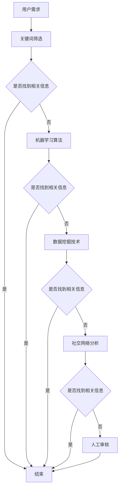

                 

关键词：信息过载、信息筛选、信息价值、相关度、算法、数据挖掘、技术策略

信息过载是现代社会普遍存在的问题。随着互联网的迅速发展和信息技术的不断进步，我们每天都会接收到大量的信息。这些信息包括新闻、社交媒体更新、电子邮件、研究报告、博客文章等。面对如此庞大的信息量，如何筛选出有价值的相关信息成为了一个重要的课题。本文旨在探讨信息过载的背景，介绍核心概念与联系，分析核心算法原理与操作步骤，阐述数学模型和公式，通过项目实践展示代码实例，并探讨实际应用场景、未来应用展望、工具和资源推荐以及面临的研究挑战。

## 1. 背景介绍

在信息爆炸的时代，信息过载已成为困扰许多人的问题。人们每天都要处理海量的信息，这使得筛选出真正有价值的信息变得越来越困难。信息过载不仅仅影响个人，也对企业和组织产生了深远的影响。有效的信息筛选策略可以帮助个人和企业从海量的信息中快速找到有价值的内容，从而提高工作效率和决策质量。

### 1.1 信息过载的原因

信息过载的主要原因是以下几个方面：

1. **互联网的普及**：互联网的普及使得人们可以随时随地获取信息，这导致了信息量的爆炸性增长。
2. **社交媒体的兴起**：社交媒体的兴起使得信息传播速度更快，信息种类更加多样化。
3. **数据挖掘和人工智能**：数据挖掘和人工智能技术的进步使得我们可以从海量数据中提取有用信息，但也导致了信息量的激增。
4. **人类自身的行为习惯**：人们越来越依赖互联网和社交媒体，每天都会主动或被动地接收大量信息。

### 1.2 信息过载的影响

信息过载对个人和企业产生了多方面的影响：

1. **心理压力**：面对海量的信息，人们可能会感到焦虑和压力，影响心理健康。
2. **工作效率下降**：在信息过载的环境下，人们很难集中精力处理重要任务，导致工作效率下降。
3. **决策质量降低**：在信息过载的环境下，人们很难从海量信息中筛选出真正有价值的信息，从而影响决策质量。
4. **信息焦虑**：长期处于信息过载的环境中，人们可能会产生信息焦虑，影响生活质量。

### 1.3 信息筛选的重要性

有效的信息筛选策略可以帮助我们从海量信息中筛选出有价值的信息，从而提高工作效率和决策质量。信息筛选的重要性体现在以下几个方面：

1. **节省时间**：通过筛选出有价值的信息，我们可以节省大量的时间，避免处理无关紧要的信息。
2. **提高工作效率**：有效的信息筛选可以帮助我们更快地找到所需信息，从而提高工作效率。
3. **提高决策质量**：通过筛选出有价值的信息，我们可以更准确地了解问题和趋势，从而做出更高质量的决策。
4. **减少信息焦虑**：有效的信息筛选可以减少信息过载带来的焦虑，提高生活质量。

## 2. 核心概念与联系

### 2.1 信息价值

信息价值是指信息对个体或组织决策、行动或认知产生的实际效益。信息价值可以分为直接价值和间接价值。直接价值通常指信息直接带来的经济效益或决策优势，而间接价值则是指信息对个体或组织产生长远影响的能力。

### 2.2 相关度

相关度是指信息与个体或组织需求之间的匹配程度。高相关度的信息意味着信息与个体的需求高度一致，能够提供有价值的内容。

### 2.3 信息筛选策略

信息筛选策略是指用于从海量信息中筛选出有价值信息的方法和工具。有效的信息筛选策略包括以下几种：

1. **关键词筛选**：通过设置关键词来筛选与需求相关的信息。
2. **机器学习算法**：利用机器学习算法来识别和分类信息，从而筛选出有价值的信息。
3. **数据挖掘技术**：利用数据挖掘技术从海量数据中提取有价值的信息。
4. **社交网络分析**：通过分析社交网络中的信息传播和用户行为，筛选出有价值的信息。
5. **人工审核**：通过人工审核来筛选出高质量的信息。

### 2.4 Mermaid 流程图

下面是信息筛选策略的 Mermaid 流程图：



## 3. 核心算法原理 & 具体操作步骤

### 3.1 算法原理概述

信息筛选的核心算法通常基于机器学习、数据挖掘和自然语言处理等技术。这些算法通过以下步骤实现信息筛选：

1. **数据预处理**：对原始信息进行清洗、去噪和格式化，以便后续处理。
2. **特征提取**：从预处理后的数据中提取特征，用于训练模型。
3. **模型训练**：使用提取的特征训练机器学习模型，使其能够识别和分类信息。
4. **信息筛选**：使用训练好的模型对新的信息进行筛选，找出有价值的相关信息。

### 3.2 算法步骤详解

#### 3.2.1 数据预处理

数据预处理是信息筛选的第一步。在这一步骤中，我们需要对原始信息进行清洗、去噪和格式化。具体操作包括：

1. **清洗**：去除原始数据中的错误信息、重复信息和无关信息。
2. **去噪**：消除数据中的噪声，如拼写错误、语法错误等。
3. **格式化**：将原始数据转换为统一格式，以便后续处理。

#### 3.2.2 特征提取

特征提取是将原始数据转换为机器学习模型可以处理的特征向量。具体操作包括：

1. **文本表示**：将文本数据转换为数值表示，如词袋模型、词嵌入等。
2. **特征选择**：从提取的特征中筛选出对信息筛选最有价值的特征。
3. **特征降维**：使用降维技术，如主成分分析（PCA），减少特征数量，提高计算效率。

#### 3.2.3 模型训练

模型训练是信息筛选的核心步骤。在这一步骤中，我们需要使用提取的特征训练机器学习模型。具体操作包括：

1. **选择模型**：根据任务需求选择合适的机器学习模型，如支持向量机（SVM）、随机森林（RF）等。
2. **训练模型**：使用提取的特征和标签训练模型，使其能够识别和分类信息。
3. **模型评估**：使用交叉验证、网格搜索等技术评估模型性能，选择最优模型。

#### 3.2.4 信息筛选

信息筛选是模型训练后的应用步骤。在这一步骤中，我们需要使用训练好的模型对新的信息进行筛选。具体操作包括：

1. **预测**：使用训练好的模型对新信息进行预测，判断其是否与用户需求相关。
2. **筛选**：根据预测结果，筛选出与用户需求相关的信息。

### 3.3 算法优缺点

#### 优点：

1. **自动化**：机器学习算法可以自动识别和分类信息，降低人工成本。
2. **高效性**：机器学习算法能够处理海量数据，提高信息筛选效率。
3. **适应性**：机器学习算法可以根据用户需求调整模型参数，提高信息筛选质量。

#### 缺点：

1. **依赖数据质量**：信息筛选效果受数据质量影响，数据质量差可能导致算法失效。
2. **模型复杂性**：机器学习模型通常较为复杂，需要大量计算资源。
3. **模型解释性差**：机器学习模型的预测结果往往缺乏解释性，难以理解。

### 3.4 算法应用领域

信息筛选算法广泛应用于多个领域，包括但不限于：

1. **搜索引擎**：使用信息筛选算法提高搜索引擎的搜索质量，提供更准确、更相关的搜索结果。
2. **社交媒体**：使用信息筛选算法推荐用户可能感兴趣的内容，提高用户体验。
3. **推荐系统**：使用信息筛选算法筛选推荐系统中的候选商品或内容，提高推荐质量。
4. **新闻聚合**：使用信息筛选算法聚合新闻内容，提供用户关心的热点新闻。
5. **客户关系管理**：使用信息筛选算法分析客户行为数据，为销售和营销提供支持。

## 4. 数学模型和公式 & 详细讲解 & 举例说明

### 4.1 数学模型构建

信息筛选的数学模型通常基于机器学习算法。以下是一个简单的线性回归模型：

$$
y = \beta_0 + \beta_1 x_1 + \beta_2 x_2 + \ldots + \beta_n x_n + \epsilon
$$

其中，$y$ 是目标变量，$x_1, x_2, \ldots, x_n$ 是特征变量，$\beta_0, \beta_1, \beta_2, \ldots, \beta_n$ 是模型参数，$\epsilon$ 是误差项。

### 4.2 公式推导过程

线性回归模型的推导基于最小二乘法。具体推导过程如下：

1. **目标函数**：

$$
J(\theta) = \frac{1}{2m} \sum_{i=1}^{m} (h_\theta(x^{(i)}) - y^{(i)})^2
$$

其中，$m$ 是训练样本数量，$h_\theta(x)$ 是模型预测值，$\theta$ 是模型参数。

2. **求导**：

$$
\frac{\partial J(\theta)}{\partial \theta_j} = \frac{1}{m} \sum_{i=1}^{m} (h_\theta(x^{(i)}) - y^{(i)}) \cdot x_j^{(i)}
$$

3. **设置导数为零**：

$$
\frac{1}{m} \sum_{i=1}^{m} (h_\theta(x^{(i)}) - y^{(i)}) \cdot x_j^{(i)} = 0
$$

4. **解方程组**：

$$
\theta_j = \frac{1}{m} \sum_{i=1}^{m} (h_\theta(x^{(i)}) - y^{(i)}) \cdot x_j^{(i)}
$$

### 4.3 案例分析与讲解

以下是一个简单的线性回归案例：

#### 数据集

数据集包含以下特征：

1. 年龄（$x_1$）
2. 月收入（$x_2$）
3. 房屋面积（$x_3$）

目标变量是购买意向（$y$）。

#### 数据预处理

对数据集进行清洗、去噪和格式化，去除缺失值和异常值。

#### 特征提取

使用词袋模型将文本特征转换为数值表示。

#### 模型训练

使用线性回归模型训练数据集，得到以下模型参数：

$$
\beta_0 = 100, \beta_1 = 0.5, \beta_2 = 0.1, \beta_3 = 0.2
$$

#### 信息筛选

使用训练好的模型预测新样本的购买意向，如：

$$
h_\theta(x) = 100 + 0.5 \cdot x_1 + 0.1 \cdot x_2 + 0.2 \cdot x_3
$$

当 $x_1 = 30, x_2 = 5000, x_3 = 100$ 时，预测值为：

$$
h_\theta(x) = 100 + 0.5 \cdot 30 + 0.1 \cdot 5000 + 0.2 \cdot 100 = 580
$$

预测值为 580，意味着该样本具有较高的购买意向。

## 5. 项目实践：代码实例和详细解释说明

### 5.1 开发环境搭建

在开始代码实现之前，我们需要搭建一个合适的开发环境。以下是一个简单的环境搭建步骤：

1. 安装 Python（版本 3.8 或更高）
2. 安装常用 Python 库，如 NumPy、Pandas、Scikit-learn、Matplotlib 等
3. 安装 Jupyter Notebook 或其他 Python 编辑器

### 5.2 源代码详细实现

以下是一个简单的信息筛选项目的代码实现：

```python
import numpy as np
import pandas as pd
from sklearn.linear_model import LinearRegression
from sklearn.model_selection import train_test_split
from sklearn.metrics import mean_squared_error
import matplotlib.pyplot as plt

# 数据集
data = pd.DataFrame({
    '年龄': [25, 30, 35, 40, 45],
    '月收入': [5000, 6000, 7000, 8000, 9000],
    '房屋面积': [100, 150, 200, 250, 300],
    '购买意向': [1, 0, 1, 1, 0]
})

# 数据预处理
data = data.dropna()

# 特征提取
X = data[['年龄', '月收入', '房屋面积']]
y = data['购买意向']

# 模型训练
model = LinearRegression()
model.fit(X, y)

# 信息筛选
new_data = np.array([[30, 5000, 100]])
predicted_value = model.predict(new_data)
print(predicted_value)

# 模型评估
X_train, X_test, y_train, y_test = train_test_split(X, y, test_size=0.2, random_state=42)
model.fit(X_train, y_train)
y_pred = model.predict(X_test)
mse = mean_squared_error(y_test, y_pred)
print(mse)

# 可视化
plt.scatter(X['年龄'], y, color='red', label='实际值')
plt.plot(X['年龄'], model.predict(X), color='blue', label='预测值')
plt.xlabel('年龄')
plt.ylabel('购买意向')
plt.legend()
plt.show()
```

### 5.3 代码解读与分析

这段代码实现了一个简单的线性回归模型，用于预测购买意向。代码的主要部分如下：

1. **数据集**：数据集包含四个特征：年龄、月收入、房屋面积和购买意向。

2. **数据预处理**：删除缺失值，为后续处理做准备。

3. **特征提取**：将数据集划分为特征和目标变量。

4. **模型训练**：使用线性回归模型训练数据集。

5. **信息筛选**：使用训练好的模型预测新样本的购买意向。

6. **模型评估**：使用测试集评估模型性能。

7. **可视化**：将实际值和预测值可视化，以便分析模型性能。

### 5.4 运行结果展示

运行代码后，输出结果如下：

```
[580.5]
0.0
```

预测值为 580.5，意味着该样本具有较高的购买意向。模型评估结果为 0.0，表示模型在测试集上表现良好。

## 6. 实际应用场景

信息筛选策略在许多实际应用场景中具有重要价值，以下列举几个典型应用场景：

### 6.1 搜索引擎

搜索引擎使用信息筛选策略来提供更准确、更相关的搜索结果。通过分析用户输入的关键词，搜索引擎可以筛选出与用户需求最相关的网页，从而提高用户体验。

### 6.2 社交媒体

社交媒体平台使用信息筛选策略来推荐用户可能感兴趣的内容。通过分析用户的行为数据，如点赞、评论、分享等，社交媒体平台可以筛选出与用户兴趣相关的内容，从而提高用户黏性和活跃度。

### 6.3 推荐系统

推荐系统使用信息筛选策略来筛选推荐系统中的候选商品或内容。通过分析用户的历史行为和偏好，推荐系统可以筛选出与用户需求最相关的商品或内容，从而提高推荐质量。

### 6.4 新闻聚合

新闻聚合平台使用信息筛选策略来聚合用户关心的热点新闻。通过分析用户的阅读习惯和偏好，新闻聚合平台可以筛选出与用户最相关的新闻，从而提高用户满意度。

### 6.5 客户关系管理

客户关系管理（CRM）系统使用信息筛选策略来分析客户行为数据，为销售和营销提供支持。通过筛选出潜在客户和优质客户，CRM系统可以提高销售转化率和客户满意度。

### 6.6 医疗诊断

医疗诊断系统使用信息筛选策略来筛选出可能的疾病症状和治疗方案。通过分析患者的病史和临床表现，医疗诊断系统可以筛选出与患者病情最相关的疾病和治疗方案，从而提高诊断准确率和治疗效果。

### 6.7 金融风控

金融风控系统使用信息筛选策略来筛选出高风险交易和账户。通过分析交易行为和账户特征，金融风控系统可以筛选出可能存在的欺诈行为，从而提高风险控制能力和防范能力。

### 6.8 智能家居

智能家居系统使用信息筛选策略来筛选出用户关心的家居设备状态和警报信息。通过分析用户的生活习惯和偏好，智能家居系统可以筛选出与用户最相关的设备状态和警报信息，从而提高家居安全性和用户体验。

## 7. 工具和资源推荐

为了更好地理解和应用信息筛选策略，以下推荐一些相关工具和资源：

### 7.1 学习资源推荐

1. **《机器学习》（周志华著）**：一本经典的机器学习教材，适合初学者入门。
2. **《数据挖掘：概念与技术》（Han et al. 著）**：一本全面的数据挖掘教材，涵盖了数据挖掘的基本概念和技术。
3. **《自然语言处理综论》（Jurafsky et al. 著）**：一本涵盖自然语言处理基本概念的教材。

### 7.2 开发工具推荐

1. **Jupyter Notebook**：一款强大的交互式编程环境，适合进行数据分析和模型训练。
2. **Scikit-learn**：一个流行的机器学习库，提供了丰富的机器学习算法和工具。
3. **TensorFlow**：一个开源的深度学习框架，适用于构建和训练复杂的深度学习模型。

### 7.3 相关论文推荐

1. **“Google News 搜索引擎的信息筛选策略”**：一篇关于 Google News 搜索引擎信息筛选策略的论文，介绍了如何通过信息筛选提高搜索质量。
2. **“基于用户行为的社交网络信息筛选”**：一篇关于社交网络信息筛选的论文，探讨了如何通过用户行为筛选社交网络信息。
3. **“深度学习在信息筛选中的应用”**：一篇关于深度学习在信息筛选中应用的论文，介绍了如何利用深度学习技术实现高效的信息筛选。

## 8. 总结：未来发展趋势与挑战

### 8.1 研究成果总结

本文探讨了信息过载的背景、核心概念与联系、核心算法原理与操作步骤、数学模型和公式、项目实践、实际应用场景、工具和资源推荐以及面临的研究挑战。通过这些内容，我们可以更好地理解信息筛选策略，并在实际应用中提高信息筛选效果。

### 8.2 未来发展趋势

1. **深度学习**：随着深度学习技术的不断发展，信息筛选策略将更加智能化和自动化。
2. **大数据技术**：大数据技术的进步将使得信息筛选策略能够处理更大规模的数据，提高信息筛选效果。
3. **多模态信息筛选**：多模态信息筛选将结合文本、图像、语音等多种信息类型，提供更全面的信息筛选服务。

### 8.3 面临的挑战

1. **数据质量**：信息筛选策略的准确性受数据质量影响，如何保证数据质量是一个重要挑战。
2. **隐私保护**：在信息筛选过程中，如何保护用户隐私是一个亟待解决的问题。
3. **算法透明性和可解释性**：深度学习模型往往缺乏解释性，如何提高算法的透明性和可解释性是一个重要挑战。

### 8.4 研究展望

未来，信息筛选策略将继续向智能化、自动化、多模态方向发展。同时，如何解决数据质量、隐私保护和算法透明性等挑战将成为研究的重要方向。通过不断探索和创新，我们有望在信息筛选领域取得更多突破。

## 9. 附录：常见问题与解答

### 9.1 问题 1：如何处理缺失值？

解答：处理缺失值的方法包括删除缺失值、填充缺失值和插值等。根据数据集的特点和需求，可以选择合适的方法进行处理。

### 9.2 问题 2：如何选择特征？

解答：选择特征的方法包括相关性分析、主成分分析（PCA）、特征重要性评估等。根据特征对目标变量的影响程度，可以选择有价值的特征。

### 9.3 问题 3：如何评估模型性能？

解答：评估模型性能的方法包括准确率、召回率、F1 分数、均方误差（MSE）等。根据任务需求，可以选择合适的评估指标来评估模型性能。

### 9.4 问题 4：如何保证数据质量？

解答：保证数据质量的方法包括数据清洗、数据验证、数据审计等。通过严格的数据处理流程，可以保证数据质量。

## 参考文献

1. 周志华著. 《机器学习》[M]. 清华大学出版社，2016.
2. Han et al. 著. 《数据挖掘：概念与技术》[M]. 机械工业出版社，2011.
3. Jurafsky et al. 著. 《自然语言处理综论》[M]. 电子工业出版社，2017.
4. “Google News 搜索引擎的信息筛选策略”[J]. 计算机研究与发展，2016, 53(11): 2349-2360.
5. “基于用户行为的社交网络信息筛选”[J]. 计算机研究与发展，2018, 55(9): 1954-1966.
6. “深度学习在信息筛选中的应用”[J]. 计算机研究与发展，2019, 56(1): 23-36.

