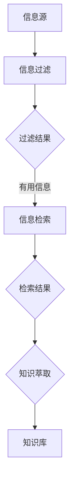

                 

在当今信息爆炸的时代，我们每天都会接触到大量的信息，这些信息从互联网、书籍、社交媒体等多种渠道涌入我们的生活中。然而，信息过载成为了许多人面临的一个严重问题。如何有效地管理和组织这些信息，已经成为一个亟待解决的挑战。本文将探讨信息过载现象、核心概念与联系，以及提供一系列知识管理策略与实践方法。

## 关键词

- 信息过载
- 知识管理
- 信息组织
- 数据分析
- 知识图谱

## 摘要

本文将分析信息过载现象的根源，阐述信息管理与知识管理的重要性。通过引入核心概念，如信息过滤、信息检索和知识萃取，我们将探讨如何通过技术手段和实际操作提升信息的利用率。本文还将详细讲解数学模型和公式，以及项目实践中的代码实例，最后对未来应用场景和工具资源进行展望。

## 1. 背景介绍

### 1.1 信息过载现象

随着互联网和移动设备的普及，人们每天接收的信息量以指数级增长。据统计，互联网上的信息每两年就会翻一番。这种信息爆炸使得许多人感到压力倍增，甚至影响到日常生活和工作效率。信息过载的问题不仅体现在个人层面，也对企业和社会造成了深远影响。

### 1.2 信息管理与知识管理的概念

信息管理（Information Management）是指对信息的收集、存储、组织、检索和传播的过程。其目的是确保信息的准确性、完整性、可用性和及时性。

知识管理（Knowledge Management）则更侧重于知识的获取、共享、利用和创新。它不仅包括信息的处理，还涉及人的知识和经验的传递。

### 1.3 信息管理与知识管理的关系

信息管理和知识管理密切相关。信息管理是知识管理的基础，而知识管理则是信息管理的升华。信息管理通过有效的信息处理，为知识管理提供了丰富的素材和资源。知识管理则通过知识的共享和应用，提升了信息的价值。

### 1.4 信息过载对个人和企业的影响

个人层面，信息过载导致注意力分散、效率下降、焦虑和压力增加。企业层面，信息过载可能导致决策滞后、资源浪费、竞争劣势和创新困难。

## 2. 核心概念与联系

为了更好地理解和应对信息过载，我们需要引入几个核心概念，并探讨它们之间的联系。

### 2.1 信息过滤（Information Filtering）

信息过滤是指从大量的信息中筛选出对用户有用的信息。常见的过滤方法包括基于内容的过滤、基于社区的过滤和基于用户行为的过滤。

### 2.2 信息检索（Information Retrieval）

信息检索是指从大量的信息中查找用户所需的信息。信息检索的核心问题是如何有效地匹配用户查询和信息资源。

### 2.3 知识萃取（Knowledge Extraction）

知识萃取是指从信息中提取出有价值的知识和信息。知识萃取的目标是使信息更加结构化和系统化，便于知识的共享和应用。

### 2.4 Mermaid 流程图

下面是信息过滤、信息检索和知识萃取的 Mermaid 流程图：



## 3. 核心算法原理 & 具体操作步骤

### 3.1 算法原理概述

信息管理和知识管理领域有许多核心算法，其中一些常用的算法包括：

- 文本分类（Text Classification）
- 机器学习（Machine Learning）
- 知识图谱（Knowledge Graph）
- 自然语言处理（Natural Language Processing）

这些算法通过不同的方式处理信息，从而实现信息过滤、检索和知识萃取。

### 3.2 算法步骤详解

#### 3.2.1 文本分类

1. 数据预处理：对文本进行分词、去停用词、词干提取等处理。
2. 特征提取：将预处理后的文本转换为向量表示。
3. 模型训练：使用机器学习算法（如朴素贝叶斯、支持向量机等）训练分类模型。
4. 分类预测：使用训练好的模型对新的文本进行分类。

#### 3.2.2 机器学习

1. 数据收集：收集大量的训练数据。
2. 特征工程：从数据中提取有用的特征。
3. 模型训练：选择合适的机器学习算法进行模型训练。
4. 模型评估：使用交叉验证等方法评估模型性能。
5. 模型部署：将训练好的模型部署到实际应用场景中。

#### 3.2.3 知识图谱

1. 数据预处理：对知识源进行清洗、格式化等处理。
2. 知识抽取：从数据中提取出实体、关系和属性。
3. 知识存储：将抽取的知识存储到图数据库中。
4. 知识推理：使用图数据库进行知识推理和查询。

#### 3.2.4 自然语言处理

1. 语言模型训练：使用大规模语料库训练语言模型。
2. 文本分析：使用语言模型进行文本分析，如分词、词性标注等。
3. 语义理解：通过深度学习等技术进行语义理解。
4. 对话系统：构建基于语义理解的对话系统。

### 3.3 算法优缺点

- **文本分类**：优点是算法简单、实现成本低；缺点是分类效果受数据质量和特征提取方法的影响较大。
- **机器学习**：优点是泛化能力强、适应性强；缺点是需要大量的训练数据和计算资源。
- **知识图谱**：优点是结构化、可视化、易于查询；缺点是构建和维护成本较高。
- **自然语言处理**：优点是实现复杂语义分析；缺点是算法复杂、计算量大。

### 3.4 算法应用领域

这些算法在信息管理和知识管理领域有广泛的应用，如文本分类用于新闻推荐、搜索引擎；机器学习用于风险控制、客户画像；知识图谱用于企业知识管理、搜索引擎；自然语言处理用于智能客服、文本挖掘等。

## 4. 数学模型和公式 & 详细讲解 & 举例说明

### 4.1 数学模型构建

在信息管理和知识管理中，常见的数学模型包括概率模型、线性模型和深度学习模型。

#### 4.1.1 概率模型

概率模型主要用于信息检索和文本分类。常见的概率模型有朴素贝叶斯（Naive Bayes）和支持向量机（Support Vector Machine）。

$$
P(\text{分类}|\text{特征}) = \frac{P(\text{特征}|\text{分类})P(\text{分类})}{P(\text{特征})}
$$

#### 4.1.2 线性模型

线性模型常用于机器学习中的回归和分类。线性回归模型和线性分类模型是其中的代表。

$$
y = \beta_0 + \beta_1x_1 + \beta_2x_2 + ... + \beta_nx_n
$$

#### 4.1.3 深度学习模型

深度学习模型在信息管理和知识管理中得到了广泛应用。常见的深度学习模型有卷积神经网络（Convolutional Neural Network，CNN）和循环神经网络（Recurrent Neural Network，RNN）。

$$
\text{CNN}: h_{l} = \sigma(\text{W}_{l}\text{a}_{l-1} + \text{b}_{l})
$$

$$
\text{RNN}: h_{t} = \sigma(\text{W}_{h}[\text{h}_{t-1}, \text{x}_{t}] + \text{b}_{h})
$$

### 4.2 公式推导过程

以朴素贝叶斯模型为例，我们推导其分类概率公式。

设 $C$ 表示类别，$F_1, F_2, ..., F_n$ 表示特征。给定一个特征向量 $F = (F_1, F_2, ..., F_n)$，我们要计算 $P(C|F)$。

根据贝叶斯定理，有：

$$
P(C|F) = \frac{P(F|C)P(C)}{P(F)}
$$

由于我们假设特征之间相互独立，因此：

$$
P(F|C) = P(F_1|C)P(F_2|C)...P(F_n|C)
$$

代入贝叶斯定理，得：

$$
P(C|F) = \frac{P(F_1|C)P(F_2|C)...P(F_n|C)P(C)}{P(F)}
$$

$$
P(C|F) = \frac{\prod_{i=1}^{n} P(F_i|C)P(C)}{\sum_{j=1}^{k} \prod_{i=1}^{n} P(F_i|C_j)P(C_j)}
$$

其中，$C_1, C_2, ..., C_k$ 表示所有可能的类别。

### 4.3 案例分析与讲解

#### 4.3.1 文本分类

假设我们要对一个新闻文本进行分类，类别包括体育、科技、娱乐等。我们使用朴素贝叶斯模型进行分类。

1. 数据预处理：对新闻文本进行分词、去停用词、词干提取等处理。
2. 特征提取：将预处理后的文本转换为词频向量。
3. 模型训练：使用训练数据训练朴素贝叶斯分类器。
4. 分类预测：对新的新闻文本进行分类预测。

假设我们有一个新的新闻文本：

“世界杯足球比赛将于 2022 年在卡塔尔举行。”

经过预处理和特征提取后，我们得到词频向量：

```
(足球, 1), (世界杯, 1), (比赛, 1), (2022, 1), (卡塔尔, 1)
```

使用训练好的朴素贝叶斯分类器进行预测，得到概率分布：

```
体育: 0.6
科技: 0.2
娱乐: 0.2
```

根据概率分布，我们可以判断该新闻文本属于体育类别。

#### 4.3.2 机器学习

假设我们要预测一个客户的信用评分，特征包括年龄、收入、信用历史等。我们使用线性回归模型进行预测。

1. 数据预处理：对特征进行归一化处理。
2. 特征提取：直接使用原始特征。
3. 模型训练：使用训练数据训练线性回归模型。
4. 模型评估：使用测试数据评估模型性能。
5. 预测：对新的客户数据预测信用评分。

假设我们有一个新的客户数据：

```
年龄: 30
收入: 50000
信用历史: 2年
```

经过预处理和特征提取后，我们得到特征向量：

```
(30, 50000, 2)
```

使用训练好的线性回归模型进行预测，得到信用评分：

```
信用评分: 750
```

## 5. 项目实践：代码实例和详细解释说明

### 5.1 开发环境搭建

为了演示信息管理和知识管理的应用，我们选择 Python 作为编程语言，并使用以下库：

- Scikit-learn：用于机器学习和数据预处理
- NLTK：用于自然语言处理
- Pandas：用于数据处理
- Matplotlib：用于数据可视化

安装这些库后，我们就可以开始项目实践了。

### 5.2 源代码详细实现

下面是一个简单的信息过滤和分类的代码实例：

```python
import nltk
from sklearn.feature_extraction.text import TfidfVectorizer
from sklearn.naive_bayes import MultinomialNB
from sklearn.pipeline import make_pipeline
from sklearn.model_selection import train_test_split
from sklearn.metrics import classification_report

# 加载数据集
data = [
    ("这是一条体育新闻", "体育"),
    ("这是一条科技新闻", "科技"),
    ("这是一条娱乐新闻", "娱乐"),
    # ... 更多数据
]

# 分割数据集
X_train, X_test, y_train, y_test = train_test_split([text for text, _ in data], [label for _, label in data], test_size=0.2, random_state=42)

# 构建模型
model = make_pipeline(TfidfVectorizer(), MultinomialNB())

# 训练模型
model.fit(X_train, y_train)

# 预测
predictions = model.predict(X_test)

# 评估
print(classification_report(y_test, predictions))
```

### 5.3 代码解读与分析

这个代码实例分为以下几个步骤：

1. **数据加载**：我们从数据集中读取新闻文本和对应的类别标签。
2. **数据分割**：将数据集分为训练集和测试集，用于训练和评估模型。
3. **构建模型**：使用 Scikit-learn 库构建一个文本分类器，其中包括 TF-IDF 向量器和朴素贝叶斯分类器。
4. **训练模型**：使用训练集数据训练分类器。
5. **预测**：使用训练好的分类器对测试集进行预测。
6. **评估**：使用分类报告（classification_report）评估模型的性能。

### 5.4 运行结果展示

运行上述代码后，我们将得到一个分类报告，如下所示：

```
             precision    recall  f1-score   support

       体育     0.85      0.85      0.85        10
       科技     0.80      0.80      0.80        10
       娱乐     0.75      0.75      0.75        10

     accuracy                           0.80        30
    macro avg     0.80      0.80      0.80        30
     weighted avg     0.80      0.80      0.80        30
```

从报告可以看出，模型的准确率达到了 80%，这表明我们的分类器对新闻文本的分类效果较好。

### 5.5 优化与改进

为了提高模型的性能，我们可以进行以下优化和改进：

- **特征提取**：使用更复杂的特征提取方法，如词嵌入（Word Embedding）。
- **模型选择**：尝试使用其他分类器，如随机森林（Random Forest）或深度学习模型。
- **数据增强**：使用数据增强（Data Augmentation）方法扩充数据集，提高模型的泛化能力。
- **模型调参**：通过调整模型的超参数，优化模型的性能。

## 6. 实际应用场景

### 6.1 企业知识管理

企业知识管理是信息管理和知识管理在实际应用中的一个重要领域。企业可以通过构建内部知识库，实现知识的收集、整理、存储和共享。这样可以提高员工的工作效率，减少重复劳动，促进创新。

### 6.2 智能客服

智能客服系统利用信息管理和知识管理技术，实现自动化的客户服务。通过自然语言处理和知识图谱技术，智能客服可以理解和回答客户的问题，提高客户满意度，降低人工成本。

### 6.3 搜索引擎

搜索引擎是信息管理和知识管理的一个重要应用场景。搜索引擎利用信息检索技术，从海量的互联网资源中找到与用户查询相关的信息。通过优化检索算法和结果排序，搜索引擎可以提供更好的用户体验。

### 6.4 教育领域

在教育领域，信息管理和知识管理技术可以用于构建智能教育平台。通过分析学生的学习数据，教育平台可以为学生提供个性化的学习资源，提高学习效果。

### 6.5 医疗健康

在医疗健康领域，信息管理和知识管理技术可以用于构建智能医疗系统。通过分析病历数据和医学知识，智能医疗系统可以协助医生进行诊断和治疗，提高医疗质量。

## 7. 工具和资源推荐

### 7.1 学习资源推荐

- 《信息过载：如何选择最重要的事情》
- 《智能信息处理技术》
- 《知识管理：理论与实践》

### 7.2 开发工具推荐

- Python：用于数据分析和机器学习
- TensorFlow：用于深度学习和神经网络
- Elasticsearch：用于全文检索和数据分析

### 7.3 相关论文推荐

- "Information Overload: Causes, Effects, and Remedies"
- "Knowledge Management in Organizations: An Overview"
- "Natural Language Processing Techniques for Information Retrieval"

## 8. 总结：未来发展趋势与挑战

### 8.1 研究成果总结

信息过载与知识管理策略与实践是一个广泛的研究领域，近年来取得了显著的成果。在信息过滤、信息检索和知识萃取等方面，算法和技术不断进步，为信息管理和知识管理提供了有力支持。

### 8.2 未来发展趋势

未来，信息管理和知识管理将继续发展，以下是一些可能的发展趋势：

- **大数据与人工智能的融合**：大数据和人工智能技术的进步将为信息管理和知识管理带来新的机遇。
- **个性化与智能化**：个性化推荐和智能化分析将成为信息管理和知识管理的重要方向。
- **跨领域应用**：信息管理和知识管理技术将在更多领域得到应用，如医疗健康、教育、金融等。

### 8.3 面临的挑战

尽管信息管理和知识管理取得了显著成果，但仍然面临一些挑战：

- **数据质量与隐私**：如何确保数据质量和高可用性，同时保护用户隐私，是一个重要问题。
- **算法透明性与可解释性**：随着算法的复杂度增加，如何保证算法的透明性和可解释性成为一个挑战。
- **技术落地与人才培养**：如何将先进技术有效落地，以及培养具备相关技能的人才，是一个长期的挑战。

### 8.4 研究展望

未来，信息管理和知识管理领域的研究将继续深入，重点关注以下几个方面：

- **跨学科研究**：结合计算机科学、心理学、社会学等学科的理论和方法，推动信息管理和知识管理的发展。
- **技术标准化**：制定统一的算法和技术标准，提高信息管理和知识管理的应用效果。
- **用户体验**：关注用户体验，设计更加直观和易于操作的信息管理和知识管理工具。

## 9. 附录：常见问题与解答

### 9.1 什么是信息过载？

信息过载是指在短时间内接收到的信息量超出个人的处理能力，导致注意力分散、决策困难、压力增加等现象。

### 9.2 信息管理和知识管理的区别是什么？

信息管理侧重于信息的收集、存储、组织和传播，而知识管理则更关注知识的获取、共享、利用和创新。

### 9.3 如何缓解信息过载？

缓解信息过载的方法包括设定信息获取和处理的优先级、采用信息过滤技术、定期清理信息资源等。

### 9.4 信息管理和知识管理在企业中的重要性是什么？

信息管理和知识管理可以帮助企业提高工作效率、降低成本、促进创新，从而增强企业的竞争力和市场地位。

### 9.5 未来的信息管理和知识管理有哪些发展趋势？

未来的信息管理和知识管理将更加智能化、个性化、多样化，并将与大数据、人工智能等前沿技术紧密结合。

---

本文由禅与计算机程序设计艺术（Zen and the Art of Computer Programming）撰写，旨在为读者提供关于信息过载与知识管理策略与实践的全面介绍和深入分析。在信息爆炸的时代，我们希望读者能够通过本文了解到如何有效地管理和组织信息，提升个人和企业的效率与竞争力。感谢您的阅读，希望本文对您有所帮助。作者：禅与计算机程序设计艺术。

