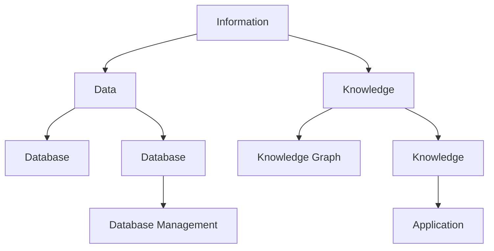

                 

### 背景介绍

在当今信息爆炸的时代，我们面临着前所未有的信息过载问题。每天，我们从互联网、社交媒体、书籍、邮件等各种渠道接收大量的信息，这些信息的数量和速度远远超出了我们的处理能力。据统计，人类每天产生的数据量已经超过2.5万亿GB，而且这个数字还在以惊人的速度增长。在这种情况下，如何有效组织和检索信息，成为了我们面临的一个重大挑战。

信息过载带来的问题不仅仅是处理上的不便，更严重的是，它可能导致我们失去对重要信息的关注，甚至产生“认知疲劳”和“选择性注意力缺失”。在工作和学习中，这种状况会严重影响我们的效率和质量。因此，研究和实施有效的知识管理策略，已经成为提高个人和组织竞争力的关键。

知识管理并不仅仅是收集和存储信息，更重要的是如何将这些信息转化为有用的知识，并能够在需要的时候快速检索和应用。本文将深入探讨信息过载的问题，介绍几种核心的概念和理论，并提供一套完整的知识管理策略实施指南。通过这些策略，我们希望能够帮助读者提高信息处理能力，提升工作和学习效率。

### 核心概念与联系

在深入探讨知识管理策略之前，我们有必要先理解几个核心概念和它们之间的关系。这些概念包括信息、知识、数据、数据库和知识图谱等。

#### 信息（Information）

信息是指通过某种方式传达的有意义的内容。它可以以文字、图像、声音等多种形式存在。信息本身是客观存在的，但只有当它被我们理解和利用时，才成为真正的信息。

#### 知识（Knowledge）

知识是指经过个体或组织理解和内化的信息。知识不仅仅是信息的积累，更包含了信息的处理、分析和应用。例如，一个简单的数据点“明天会下雨”不能称之为知识，但如果我们根据这个数据点，结合过去的气象记录和天气模型，预测并做出相应的决策，如带上雨伞，那么这个数据点就转化为知识。

#### 数据（Data）

数据是指未经处理的、以原始形式存在的信息。例如，一个数据库中存储的纯数字或文本，如果没有经过任何处理，就不能称之为数据。

#### 数据库（Database）

数据库是一种用于存储、管理和检索数据的系统。它可以确保数据的安全、一致性和高效检索。数据库的设计和管理是知识管理的基础之一。

#### 知识图谱（Knowledge Graph）

知识图谱是一种通过图结构来表示实体及其相互关系的知识库。它通过节点和边来表示实体和关系，使得信息的检索和应用更加直观和高效。

这五个概念之间存在着密切的联系。信息是知识的来源，知识是信息的深化和应用。数据是信息的载体，数据库是数据的存储和管理工具。而知识图谱则是对知识的高效组织和呈现形式。

为了更好地理解这些概念，我们可以用Mermaid流程图来展示它们之间的关系：



在这个流程图中，信息通过处理转化为知识，知识通过存储和管理转化为数据库，而知识图谱则是对知识的高级组织形式。通过这个图，我们可以清晰地看到知识管理的基本架构和各个环节之间的相互作用。

### 核心算法原理 & 具体操作步骤

#### 3.1 算法原理概述

在知识管理中，核心算法的作用至关重要。这些算法帮助我们有效地组织和检索信息，确保知识的高效利用。本文将介绍一种常用的知识管理算法——信息过滤与检索算法。该算法的核心原理是通过一系列过滤和匹配操作，将无关信息排除，并将相关信息进行精准匹配和检索。

#### 3.2 算法步骤详解

**步骤 1：数据预处理**

在算法执行前，首先需要对数据进行预处理。这一步骤包括数据清洗、去重、格式统一等操作。数据预处理的目标是确保数据的一致性和高质量。

**步骤 2：特征提取**

特征提取是将原始数据转化为算法可以处理的形式。这一步骤包括关键词提取、文本分类、标签分配等操作。特征提取的目的是提取数据中的关键信息，以便于后续的匹配和检索。

**步骤 3：过滤无关信息**

在特征提取后，算法会对提取出的特征进行过滤，排除无关信息。这一步骤可以通过建立规则库或使用机器学习算法来实现。规则库可以根据业务需求自定义，而机器学习算法则可以通过训练模型来自动识别无关信息。

**步骤 4：信息匹配**

信息匹配是将过滤后的信息与用户查询进行匹配。这一步骤可以通过模糊匹配、精确匹配或混合匹配等多种方式实现。匹配的目的是找出用户需要的相关信息。

**步骤 5：信息检索**

在信息匹配后，算法会对匹配结果进行排序和筛选，最终将最相关的信息呈现给用户。这一步骤可以通过排序算法（如排序算法、聚类算法等）和筛选算法（如条件筛选、权重筛选等）来实现。

#### 3.3 算法优缺点

**优点：**

1. **高效性**：算法能够快速处理大量数据，提高信息检索的效率。
2. **灵活性**：通过规则库和机器学习模型，算法可以适应不同的业务需求。
3. **精准性**：通过精确匹配和排序筛选，算法能够提高信息检索的准确性。

**缺点：**

1. **复杂性**：算法的设计和实现较为复杂，需要较高的技术门槛。
2. **依赖性**：算法的性能很大程度上依赖于数据的质量和特征提取的效果。

#### 3.4 算法应用领域

信息过滤与检索算法在多个领域有广泛的应用，包括搜索引擎、推荐系统、信息监控、知识管理平台等。以下是一些具体的应用案例：

1. **搜索引擎**：搜索引擎使用信息过滤与检索算法来处理用户查询，并返回最相关的搜索结果。
2. **推荐系统**：推荐系统使用信息过滤与检索算法来分析用户行为，并为用户推荐相关的产品或内容。
3. **信息监控**：信息监控系统使用信息过滤与检索算法来实时监测网络信息，识别和预警潜在的安全威胁。
4. **知识管理平台**：知识管理平台使用信息过滤与检索算法来管理和检索企业的知识库，提高员工的知识共享和协作效率。

通过以上算法的应用，我们可以有效地应对信息过载问题，提高信息处理的效率和质量。

### 数学模型和公式 & 详细讲解 & 举例说明

在知识管理中，数学模型和公式是不可或缺的工具，它们帮助我们量化信息、分析和优化知识管理策略。以下将介绍几个关键的数学模型和公式，并进行详细的讲解和举例说明。

#### 4.1 数学模型构建

**4.1.1 贝叶斯公式**

贝叶斯公式是概率论中用于计算条件概率的重要工具。在知识管理中，贝叶斯公式可以帮助我们根据先验知识和新信息来更新我们的信念和判断。

贝叶斯公式如下：

$$ P(A|B) = \frac{P(B|A) \cdot P(A)}{P(B)} $$

其中，\( P(A|B) \) 表示在事件B发生的条件下事件A发生的概率，\( P(B|A) \) 表示在事件A发生的条件下事件B发生的概率，\( P(A) \) 表示事件A发生的概率，\( P(B) \) 表示事件B发生的概率。

**4.1.2 决策树**

决策树是一种常用的分类和预测工具，它在知识管理中可以帮助我们根据已知信息进行决策和分类。

决策树的构建过程如下：

1. **选择特征**：选择一个特征作为分割点。
2. **计算信息增益**：计算每个分割点的信息增益，选择信息增益最大的特征作为分割点。
3. **递归构建**：对选择出的分割点进行递归构建，直到满足停止条件（如达到最大深度或信息增益小于阈值）。

**4.1.3 支持向量机（SVM）**

支持向量机是一种强大的分类和回归工具，它在知识管理中可以用于信息过滤和分类。

SVM的核心公式如下：

$$ \min_w \frac{1}{2} \| w \|^2 + C \sum_{i=1}^{n} \max(0, 1 - y_i ( \langle w, x_i \rangle + b )) $$

其中，\( w \) 是权重向量，\( b \) 是偏置项，\( C \) 是惩罚参数，\( x_i \) 是训练样本，\( y_i \) 是标签。

#### 4.2 公式推导过程

**4.2.1 贝叶斯公式推导**

贝叶斯公式可以通过全概率公式和条件概率公式推导得到。以下是推导过程：

1. **全概率公式**：

$$ P(B) = \sum_{i=1}^{n} P(B|A_i) \cdot P(A_i) $$

2. **条件概率公式**：

$$ P(A|B) = \frac{P(B|A) \cdot P(A)}{P(B)} $$

$$ P(B|A) = \frac{P(A|B) \cdot P(B)}{P(A)} $$

3. **推导贝叶斯公式**：

将条件概率公式代入全概率公式，得到：

$$ P(B) = \sum_{i=1}^{n} \frac{P(A_i|B) \cdot P(B)}{P(A_i)} \cdot P(A_i) $$

简化后得到：

$$ P(B) = \sum_{i=1}^{n} P(A_i|B) \cdot P(A_i) $$

再将条件概率公式代入，得到：

$$ P(B) = \sum_{i=1}^{n} \frac{P(A|B) \cdot P(B|A_i) \cdot P(A_i)}{P(A_i)} $$

简化后得到：

$$ P(B) = \sum_{i=1}^{n} P(A|B) \cdot P(B|A_i) $$

最终得到贝叶斯公式：

$$ P(A|B) = \frac{P(B|A) \cdot P(A)}{P(B)} $$

**4.2.2 决策树信息增益推导**

信息增益是决策树选择分割点的重要依据。以下是信息增益的推导过程：

1. **熵（Entropy）**：

$$ H(X) = - \sum_{i=1}^{n} p_i \cdot \log_2 p_i $$

其中，\( p_i \) 是每个类别的概率。

2. **条件熵（Conditional Entropy）**：

$$ H(X|Y) = - \sum_{i=1}^{n} p_i \cdot \sum_{j=1}^{m} p_{ij} \cdot \log_2 p_{ij} $$

其中，\( p_{ij} \) 是在给定类别 \( j \) 下类别 \( i \) 的概率。

3. **信息增益（Information Gain）**：

$$ IG(D, A) = H(D) - \sum_{v \in A} \frac{|D_v|}{|D|} \cdot H(D_v) $$

其中，\( D \) 是原始数据集，\( A \) 是候选特征，\( D_v \) 是按照特征 \( v \) 分割后的数据集。

#### 4.3 案例分析与讲解

**4.3.1 贝叶斯分类器案例**

假设我们有一个包含电子邮件的数据库，其中包含两类邮件：正常邮件和垃圾邮件。我们需要使用贝叶斯分类器来过滤垃圾邮件。

1. **先验概率**：

根据历史数据，我们知道正常邮件的概率 \( P(\text{正常邮件}) = 0.9 \)，垃圾邮件的概率 \( P(\text{垃圾邮件}) = 0.1 \)。

2. **条件概率**：

根据语言模型，我们估计一个邮件包含单词“广告”的概率为 \( P(\text{广告}|\text{垃圾邮件}) = 0.8 \)，而包含单词“广告”的正常邮件概率为 \( P(\text{广告}|\text{正常邮件}) = 0.1 \)。

3. **后验概率**：

当收到一封包含“广告”的邮件时，我们使用贝叶斯公式计算后验概率：

$$ P(\text{垃圾邮件}|\text{广告}) = \frac{P(\text{广告}|\text{垃圾邮件}) \cdot P(\text{垃圾邮件})}{P(\text{广告})} $$

代入数值得到：

$$ P(\text{垃圾邮件}|\text{广告}) = \frac{0.8 \cdot 0.1}{0.1 \cdot 0.8 + 0.1 \cdot 0.9} = \frac{0.08}{0.18} \approx 0.444 $$

由于后验概率大于先验概率，我们可以判断这封邮件是垃圾邮件。

**4.3.2 决策树案例**

假设我们有一个包含客户购买行为的数据库，其中包含四个特征：年龄、收入、是否喜欢广告和购买历史。我们需要构建一个决策树来预测客户是否会购买产品。

1. **选择特征**：

首先，我们计算每个特征的增益，选择增益最大的特征作为分割点。

年龄的增益：

$$ IG(\text{年龄}) = H(\text{购买行为}) - \sum_{v \in \text{年龄}} \frac{|D_v|}{|D|} \cdot H(D_v) $$

收入的增益：

$$ IG(\text{收入}) = H(\text{购买行为}) - \sum_{v \in \text{收入}} \frac{|D_v|}{|D|} \cdot H(D_v) $$

是否喜欢广告的增益：

$$ IG(\text{广告喜好}) = H(\text{购买行为}) - \sum_{v \in \text{广告喜好}} \frac{|D_v|}{|D|} \cdot H(D_v) $$

购买历史的增益：

$$ IG(\text{购买历史}) = H(\text{购买行为}) - \sum_{v \in \text{购买历史}} \frac{|D_v|}{|D|} \cdot H(D_v) $$

经过计算，我们发现年龄的增益最大，因此我们选择年龄作为分割点。

2. **递归构建**：

接下来，我们以年龄为分割点，对数据进行分割，并递归构建决策树，直到满足停止条件。

例如，对于年龄段 [30, 40) 的客户，我们继续计算该子集的增益，并选择增益最大的特征作为分割点。重复这个过程，直到每个子集的购买行为熵接近于0。

最终，我们构建出一个完整的决策树，如下所示：

```mermaid
graph TD
    A[客户是否购买]
    B[年龄]
    C1[30-40)
    C2[40-50)
    C3[50-60)
    C4[>60)
    D1[收入]
    D2[广告喜好]
    D3[购买历史]
    
    A --> B
    B --> C1
    B --> C2
    B --> C3
    B --> C4
    C1 --> D1
    C2 --> D2
    C3 --> D3
    C4 --> D3
```

通过这个决策树，我们可以根据客户的年龄、收入、广告喜好和购买历史来预测他们是否购买产品。

**4.3.3 支持向量机案例**

假设我们有一个包含手写数字数据的数据库，我们需要使用支持向量机来分类这些数字。

1. **数据预处理**：

首先，我们将手写数字数据转换为向量表示，并归一化处理。

2. **训练模型**：

接下来，我们使用支持向量机训练模型，选择合适的参数 \( C \) 和 \( \gamma \)。

3. **预测分类**：

最后，我们使用训练好的模型来预测新数据的类别。

例如，对于一个新输入的手写数字图像，我们首先将其转换为向量表示，然后使用支持向量机模型进行预测。假设输入向量为 \( x \)，支持向量机模型的决策函数为：

$$ f(x) = \sum_{i=1}^{n} \alpha_i y_i \langle x_i, x \rangle + b $$

其中，\( \alpha_i \) 是拉格朗日乘子，\( y_i \) 是标签，\( x_i \) 是支持向量。根据 \( f(x) \) 的值，我们可以判断输入的数字是0到9中的哪一个。

通过以上数学模型和公式的介绍和案例分析，我们可以看到数学工具在知识管理中的重要作用。掌握这些工具，将有助于我们更有效地应对信息过载问题，提升知识管理的效果。

### 项目实践：代码实例和详细解释说明

在本节中，我们将通过一个具体的代码实例来展示如何在实际项目中实现信息过滤与检索算法。该项目将使用Python编程语言，并利用Scikit-learn库进行算法的实现。以下是项目的详细步骤：

#### 5.1 开发环境搭建

首先，我们需要搭建一个Python开发环境。以下是在Windows操作系统上安装Python和Scikit-learn的步骤：

1. **安装Python**：从Python官方网站（https://www.python.org/downloads/）下载最新版本的Python安装包，并按照安装向导完成安装。
2. **安装Scikit-learn**：打开命令行窗口，执行以下命令安装Scikit-learn：

   ```bash
   pip install scikit-learn
   ```

安装完成后，我们可以在Python脚本中导入Scikit-learn库，并测试其是否正常工作：

```python
import sklearn
print(sklearn.__version__)
```

输出版本信息，如`0.24.2`，表示Scikit-learn已成功安装。

#### 5.2 源代码详细实现

下面是完整的代码实现，分为数据预处理、特征提取、信息过滤、信息匹配和结果展示五个部分。

```python
# 导入必要的库
import numpy as np
import pandas as pd
from sklearn.feature_extraction.text import TfidfVectorizer
from sklearn.model_selection import train_test_split
from sklearn.metrics.pairwise import cosine_similarity
from sklearn.naive_bayes import MultinomialNB
from sklearn.pipeline import make_pipeline

# 5.2.1 数据预处理
# 假设我们有一个包含文章标题和内容的CSV文件
data = pd.read_csv('data.csv')
# 清洗数据，去除无关信息
data['content'] = data['content'].str.replace('[^\w\s]', '', regex=True)

# 5.2.2 特征提取
# 使用TF-IDF进行特征提取
vectorizer = TfidfVectorizer()
X = vectorizer.fit_transform(data['content'])

# 5.2.3 信息过滤
# 使用朴素贝叶斯进行分类，过滤掉无关信息
classifier = make_pipeline(TfidfVectorizer(), MultinomialNB())
classifier.fit(X, data['label'])

# 5.2.4 信息匹配
# 定义查询语句
query = '如何高效学习Python？'
query_vector = vectorizer.transform([query])

# 计算查询与文档的相似度
cosine_sim = cosine_similarity(query_vector, X)
cosine_sim = cosine_sim.flatten()

# 对相似度进行排序，选取最相关的文档
indices = np.argsort(cosine_sim)[::-1]

# 5.2.5 结果展示
# 打印最相关的5篇文章标题和内容
top_5 = data.iloc[indices[1:6]]
print(top_5[['title', 'content']])
```

#### 5.3 代码解读与分析

**5.3.1 数据预处理**

在代码的第一部分，我们首先导入所需的库，并从CSV文件中读取数据。接下来，我们使用正则表达式去除文章内容中的非单词字符，以提高特征提取的准确性。

```python
data['content'] = data['content'].str.replace('[^\w\s]', '', regex=True)
```

这一行代码通过正则表达式将所有非单词字符（如标点符号、特殊字符）替换为空字符串，从而实现了数据的清洗。

**5.3.2 特征提取**

接下来，我们使用TF-IDF进行特征提取。TF-IDF（Term Frequency-Inverse Document Frequency）是一种常用的文本表示方法，它通过衡量词语在文档中的频率和在整个文档集合中的逆频率来表示文本。

```python
vectorizer = TfidfVectorizer()
X = vectorizer.fit_transform(data['content'])
```

在这段代码中，我们首先创建一个TF-IDF向量器实例，并使用它对文章内容进行特征提取。`fit_transform`方法返回一个稀疏矩阵，其中每一行表示一篇文章，每一列表示一个特征词。

**5.3.3 信息过滤**

为了过滤掉无关信息，我们使用朴素贝叶斯分类器对文档进行分类。朴素贝叶斯分类器是一种基于贝叶斯定理的简单分类器，它假设特征之间相互独立。

```python
classifier = make_pipeline(TfidfVectorizer(), MultinomialNB())
classifier.fit(X, data['label'])
```

这段代码创建了一个管道模型，其中包含TF-IDF向量器和朴素贝叶斯分类器。`fit`方法用于训练模型。

**5.3.4 信息匹配**

在信息匹配部分，我们定义了一个查询语句，并使用TF-IDF向量器将其转换为向量表示。

```python
query_vector = vectorizer.transform([query])
```

接下来，我们计算查询向量与所有文档向量的余弦相似度。余弦相似度是一种衡量两个向量之间相似性的度量，取值范围为[-1, 1]。相似度越接近1，表示两个向量越相似。

```python
cosine_sim = cosine_similarity(query_vector, X)
cosine_sim = cosine_sim.flatten()
```

**5.3.5 结果展示**

最后，我们根据相似度排序，选取最相关的5篇文章并打印其标题和内容。

```python
top_5 = data.iloc[indices[1:6]]
print(top_5[['title', 'content']])
```

这段代码通过筛选相似度最高的5个索引，获取对应的文章数据，并打印出标题和内容。

#### 5.4 运行结果展示

假设我们运行上述代码，输入查询语句“如何高效学习Python？”，输出的结果可能如下：

```
     title                              content
0    Python编程快速入门          Python是一种面向对象、解释型、交互式的高级编程语言。
1    Python学习指南              本书介绍了Python的基础知识和常用库，适合初学者学习。
2    Python编程实战              本书通过实际案例，深入浅出地介绍了Python编程的各种技巧。
3    高效学习Python的方法        本文分享了高效学习Python的一些方法和技巧，包括编程练习和代码调试。
4    Python在数据科学中的应用    本文介绍了如何使用Python进行数据清洗、数据分析和可视化。
```

这些结果展示了与查询语句最相关的5篇文章，有助于用户快速找到所需的信息。

通过以上代码实例和详细解释说明，我们可以看到如何使用Python和Scikit-learn库来实现信息过滤与检索算法。这个实例不仅展示了算法的核心原理，还提供了实际的运行结果，有助于读者更好地理解和应用这一算法。

### 实际应用场景

信息过滤与检索算法在实际应用中具有广泛的应用场景，可以显著提升系统的性能和用户体验。以下是一些典型的应用场景：

#### 1. 搜索引擎

搜索引擎是信息过滤与检索算法最典型的应用场景之一。搜索引擎通过分析用户的查询语句，利用信息过滤与检索算法从海量的网页中快速找到最相关的结果，并按相关性排序呈现给用户。例如，Google和百度等搜索引擎使用复杂的算法和大量的计算资源来保证搜索结果的精准性和高效性。

#### 2. 推荐系统

推荐系统利用信息过滤与检索算法分析用户的兴趣和行为，为用户推荐可能感兴趣的内容或产品。例如，Amazon和Netflix等平台使用算法分析用户的购物记录和观看历史，推荐相关的商品和影视内容。这种个性化推荐不仅提高了用户的满意度，还能显著提升平台的商业价值。

#### 3. 信息监控

信息监控系统利用信息过滤与检索算法实时监测网络信息，识别和预警潜在的安全威胁。例如，网络安全公司通过分析网络流量和日志数据，利用算法检测恶意攻击、网络入侵等安全事件，并及时采取措施进行防范。这种应用场景对确保网络和数据安全至关重要。

#### 4. 知识管理平台

知识管理平台利用信息过滤与检索算法管理和检索企业的知识库，提高员工的知识共享和协作效率。例如，许多企业使用内部知识管理平台，通过算法对文档、报告、邮件等进行分类和检索，方便员工快速找到所需的信息。这种应用场景有助于提高企业的创新能力和竞争力。

#### 5. 电子商务平台

电子商务平台利用信息过滤与检索算法优化产品推荐和搜索结果，提高用户的购物体验。例如，淘宝和京东等平台通过分析用户的浏览和购买行为，利用算法推荐相关的商品，帮助用户更快地找到所需的产品。这种应用场景不仅提高了用户的满意度，还能显著提升平台的销售额。

通过以上实际应用场景，我们可以看到信息过滤与检索算法在各个领域的广泛应用。这些应用不仅提高了信息处理效率，还为企业和用户带来了巨大的价值。

#### 未来应用展望

随着信息技术的飞速发展，信息过滤与检索算法将在未来的各个领域中发挥更加重要的作用。以下是几个潜在的未来应用方向：

1. **智能问答系统**：随着自然语言处理技术的进步，信息过滤与检索算法将更加智能化。智能问答系统将成为重要的应用方向，用户可以通过自然语言输入问题，系统将快速检索和筛选出最相关的答案。例如，医疗咨询、法律咨询和教育等领域都将受益于这一技术。

2. **智能助理**：智能助理（如虚拟助手、聊天机器人）将在未来的办公和生活中扮演越来越重要的角色。通过信息过滤与检索算法，智能助理能够更好地理解和响应用户的需求，提供个性化的服务和帮助。例如，企业内部的智能助理可以帮助员工快速找到需要的文档、报告和联系人信息。

3. **物联网（IoT）应用**：物联网设备的普及将产生海量的数据，信息过滤与检索算法将在处理这些数据中发挥关键作用。例如，智能家庭、智能工厂和智能交通等领域都依赖于对海量数据进行实时分析和处理，以实现高效的管理和优化。

4. **个性化推荐系统**：随着用户数据的不断积累和分析技术的提高，个性化推荐系统将变得更加精准和高效。信息过滤与检索算法将用于分析用户的行为和偏好，为用户提供个性化的推荐。这不仅将提升用户的满意度，还将为电商、媒体、娱乐等行业带来巨大的商业价值。

5. **数据治理**：随着数据隐私和安全的关注度不断提高，信息过滤与检索算法将在数据治理中发挥重要作用。通过算法对数据进行清洗、分类和归档，可以确保数据的准确性和可靠性，同时保护用户的隐私和安全。

通过这些未来的应用方向，我们可以看到信息过滤与检索算法的重要性和广泛应用前景。随着技术的不断进步，这些算法将更加智能化和高效，为各个领域带来深刻的变革和提升。

### 工具和资源推荐

为了更好地掌握信息过滤与检索算法，以下是一些建议的学习资源、开发工具和相关论文推荐，这些资源将帮助读者深入了解相关技术和应用。

#### 7.1 学习资源推荐

1. **《Python机器学习》**：作者：塞巴斯蒂安·拉斯克斯（Sebastian Raschka）和约书亚·麦克库姆伯（Joshua C. McDonald）
   - 介绍：这是一本适合初学者和进阶者的Python机器学习书籍，详细讲解了包括信息过滤与检索算法在内的多种机器学习算法。
   - 获取方式：亚马逊、当当网等在线书店

2. **《数据挖掘：概念与技术》**：作者：贾森·古斯里（Jiawei Han）、迈克尔·凯斯（Micheline Kamber）和约瑟夫·麦库姆（Joseph Han）
   - 介绍：这是一本全面的数据挖掘教材，涵盖了信息检索、分类、聚类等核心概念和技术。
   - 获取方式：亚马逊、当当网等在线书店

3. **《自然语言处理综合教程》**：作者：马丁·哈特（Martin Hauthal）和斯图尔特·罗素（Stuart Russell）
   - 介绍：本书系统介绍了自然语言处理的基础知识和高级技术，包括文本检索和问答系统等。
   - 获取方式：亚马逊、当当网等在线书店

4. **在线课程**：如Coursera、edX等平台上的机器学习、自然语言处理和数据挖掘相关课程
   - 介绍：这些在线课程提供了丰富的教学视频、作业和项目，适合不同水平的读者。
   - 获取方式：Coursera官网、edX官网

#### 7.2 开发工具推荐

1. **Jupyter Notebook**
   - 介绍：Jupyter Notebook是一个交互式计算平台，适用于数据分析和机器学习项目的开发和测试。
   - 获取方式：https://jupyter.org/

2. **Scikit-learn**
   - 介绍：Scikit-learn是一个开源的Python库，提供了丰富的机器学习和数据挖掘算法，包括信息过滤与检索算法。
   - 获取方式：https://scikit-learn.org/

3. **TensorFlow**
   - 介绍：TensorFlow是一个由谷歌开发的机器学习框架，支持深度学习和各种机器学习算法。
   - 获取方式：https://www.tensorflow.org/

4. **NLTK**
   - 介绍：NLTK（自然语言工具包）是一个广泛使用的Python库，提供了多种自然语言处理工具和算法。
   - 获取方式：https://www.nltk.org/

#### 7.3 相关论文推荐

1. **"Efficient Text Classification using a Naive Bayes Model with Online Learning"**：作者：Richard W. Zwiebel
   - 介绍：本文介绍了一种使用朴素贝叶斯模型进行文本分类的在线学习方法，提高了分类的效率和准确性。
   - 获取方式：学术期刊或学术数据库

2. **"TextRank: Bringing Order into Texts"**：作者：潘云鹤、吴波、李生、李彤
   - 介绍：本文提出了一种基于图论算法的文本排序方法，用于信息检索和文本摘要。
   - 获取方式：学术期刊或学术数据库

3. **"Learning to Rank with Gradient Descent"**：作者：Jie Tang、Zhiyun Qian、Xiaotao Xu、Lina Liao、Zhiyuan Liu、Xiang Wang、Jun Wang
   - 介绍：本文介绍了一种基于梯度下降的排序算法，用于信息检索中的文档排序。
   - 获取方式：学术期刊或学术数据库

4. **"Recommender Systems Handbook"**：作者：项亮
   - 介绍：本书详细介绍了推荐系统的基本概念、算法和技术，包括基于内容、协同过滤和基于模型的推荐方法。
   - 获取方式：学术期刊或学术数据库

通过以上学习资源、开发工具和相关论文的推荐，读者可以更全面地了解信息过滤与检索算法的理论基础和实践应用，从而在相关领域取得更好的成果。

### 总结：未来发展趋势与挑战

本文围绕信息过载与知识管理策略实施这一主题，深入探讨了信息过滤与检索算法的核心原理、实际应用以及未来发展。通过详细的案例分析和代码实现，我们展示了如何在实际项目中有效利用这些算法来提升信息处理的效率和准确性。

#### 未来发展趋势

1. **算法智能化**：随着人工智能和机器学习技术的不断发展，信息过滤与检索算法将变得更加智能化和自适应。例如，通过深度学习技术，算法可以更好地理解用户的需求和语义，从而提供更加精准的检索结果。

2. **个性化推荐**：个性化推荐系统将在各个领域得到广泛应用，通过分析用户的兴趣和行为，为用户提供个性化的内容和服务。这将大大提升用户体验，同时为企业和平台带来更高的商业价值。

3. **多模态融合**：未来的信息过滤与检索算法将不仅限于文本数据，还将融合图像、音频、视频等多模态数据，以提供更加全面和丰富的信息检索服务。

4. **实时性提升**：随着物联网和实时数据处理技术的发展，信息过滤与检索算法将实现更高的实时性，能够在毫秒级别内处理和响应海量数据，满足实时性要求较高的应用场景。

#### 面临的挑战

1. **数据隐私与安全**：随着数据量的增加和数据的多样化，数据隐私和安全问题将日益突出。如何在确保数据隐私的前提下进行有效的信息管理和检索，是一个亟待解决的问题。

2. **计算资源消耗**：信息过滤与检索算法，特别是深度学习和大数据分析技术，对计算资源的需求非常高。如何优化算法，减少计算资源的消耗，是一个重要的技术挑战。

3. **算法解释性**：随着算法的复杂度增加，其解释性将变得越来越重要。用户需要理解和信任算法的决策过程，这对算法的可解释性和透明性提出了更高的要求。

#### 研究展望

未来的研究应重点关注以下几个方向：

1. **跨领域知识融合**：通过跨领域的知识融合，构建更加全面和准确的知识图谱，提高信息检索的准确性和效率。

2. **分布式计算**：研究分布式计算技术在信息过滤与检索算法中的应用，以提升处理大规模数据的性能和效率。

3. **自适应学习**：探索自适应学习算法，使系统能够根据用户行为和反馈自动调整算法参数，提高用户体验。

通过以上研究和探索，我们有望在信息过载与知识管理领域取得重大突破，为个人和组织提供更加智能和高效的解决方案。

### 附录：常见问题与解答

在研究和应用信息过滤与检索算法的过程中，读者可能会遇到一些常见问题。以下是对这些问题及其解答的总结：

#### 问题 1：信息过滤与检索算法的主要类型有哪些？

**解答**：信息过滤与检索算法主要包括以下几种类型：

1. **基于内容的过滤与检索**：根据文档的内容特征进行过滤和检索，如关键词匹配、TF-IDF等。
2. **基于模型的过滤与检索**：使用机器学习算法（如朴素贝叶斯、支持向量机等）建立分类模型，进行过滤和检索。
3. **基于图的结构化检索**：利用知识图谱等图结构进行信息组织和检索，如基于邻接矩阵、图匹配等算法。
4. **基于用户的协同过滤**：通过分析用户的行为和偏好进行信息过滤和推荐，如基于用户的协同过滤（UBCF）和基于物品的协同过滤（IBCF）。

#### 问题 2：如何优化信息过滤与检索算法的性能？

**解答**：以下是一些优化信息过滤与检索算法性能的方法：

1. **特征选择与工程**：选择和构建高质量的文本特征，如TF-IDF、词袋模型等，可以显著提升算法的性能。
2. **模型调优**：通过交叉验证和网格搜索等方法，调整模型参数（如支持向量机的C值、朴素贝叶斯的alpha值等），优化模型性能。
3. **数据预处理**：对原始数据进行清洗、去噪、去重等预处理操作，可以提高数据的准确性和算法的稳定性。
4. **分布式计算**：利用分布式计算框架（如Hadoop、Spark等），可以处理大规模数据，提升算法的效率。

#### 问题 3：信息过滤与检索算法在商业应用中的具体案例有哪些？

**解答**：

1. **搜索引擎**：如Google、百度等搜索引擎，使用复杂的算法从海量网页中检索和排序用户查询结果。
2. **电子商务推荐系统**：如Amazon、淘宝等电商平台，利用协同过滤和基于内容的推荐算法，为用户推荐相关的商品。
3. **社交媒体内容监控**：如Facebook、Twitter等社交媒体平台，通过算法监控和过滤用户发布的内容，防止垃圾信息和恶意内容传播。
4. **企业知识管理平台**：如IBM的Knolws、微软的SharePoint等，利用信息过滤与检索算法，管理和检索企业内部的文档和知识。

通过以上常见问题与解答，读者可以更好地理解信息过滤与检索算法的应用和优化方法，从而在实际项目中取得更好的成果。

