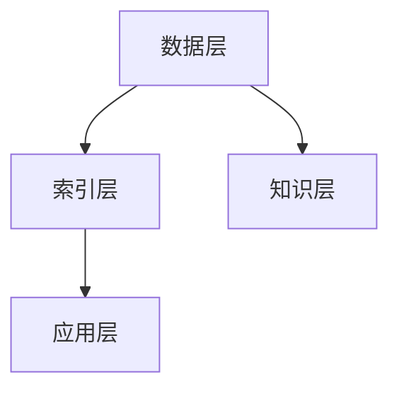

                 

在当今数字化和信息爆炸的时代，信息过载成为了一个普遍存在的问题。人们每天都会接收到大量信息，但往往难以有效地处理和利用这些信息。知识管理系统（Knowledge Management System，简称KMS）作为一种有效的解决方案，旨在帮助企业和组织更好地组织和检索信息，提高工作效率和知识共享。本文将深入探讨信息过载的问题，并详细解析知识管理系统的核心概念、算法原理、数学模型以及实际应用。

## 关键词

- 信息过载
- 知识管理系统
- 信息组织
- 信息检索
- 知识共享
- 工作效率

## 摘要

本文首先分析了信息过载的现象及其对个人和组织造成的负面影响。接着，介绍了知识管理系统的定义、核心概念和架构。随后，详细阐述了知识管理系统中的核心算法原理，包括算法步骤、优缺点及其应用领域。接着，我们引入了数学模型和公式，并通过实际案例和代码实例展示了知识管理系统的实际应用。最后，文章讨论了知识管理系统的未来发展趋势和面临的挑战，并给出了相关工具和资源的推荐。

## 1. 背景介绍

### 1.1 信息过载的现象

在现代社会，信息过载的现象无处不在。随着互联网和数字技术的快速发展，人们每天都会接收到海量的信息，包括新闻、邮件、社交媒体更新、商业报告等。这些信息以各种形式呈现，如文本、图片、视频和音频。尽管信息的获取变得前所未有的便捷，但过量的信息反而让人们对信息的处理变得困难。人们往往感到焦虑和压力，因为他们很难区分哪些信息是重要的，哪些是无关紧要的。

### 1.2 信息过载对个人和组织的影响

信息过载对个人和组织都有显著的负面影响。对个人而言，过量的信息可能导致注意力分散、决策困难、工作效率下降，甚至影响心理健康。对组织而言，信息过载会降低工作效率，增加沟通成本，阻碍知识共享和创新。因此，如何有效地管理和利用信息成为企业和组织迫切需要解决的问题。

### 1.3 知识管理系统的意义

知识管理系统作为一种信息管理工具，旨在帮助企业和组织解决信息过载问题。通过知识管理系统，企业可以更好地组织和存储信息，实现信息的快速检索和共享，从而提高工作效率和知识利用效率。知识管理系统还促进了知识共享和团队协作，有助于创新和竞争力的提升。

## 2. 核心概念与联系

### 2.1 知识管理系统的定义

知识管理系统是一种集成技术、方法和工具的体系，旨在促进知识的获取、组织、存储、共享和应用。它通过优化信息流程，提高信息的可访问性和可靠性，帮助企业和组织更好地利用知识资源。

### 2.2 知识管理系统的核心概念

- 知识获取：从各种来源收集和获取信息。
- 知识组织：对获取到的信息进行分类、标签化、索引等处理，使其易于检索和利用。
- 知识存储：将组织好的信息存储在数据库或知识库中，以便长期保存和快速检索。
- 知识共享：通过共享机制，使知识和信息在企业内部或组织间传播和交流。
- 知识应用：将知识应用到实际工作中，提高工作效率和创新力。

### 2.3 知识管理系统的架构

知识管理系统的架构通常包括以下几个层次：

1. 数据层：存储各种类型的数据，包括文本、图片、音频、视频等。
2. 索引层：对数据建立索引，以便快速检索。
3. 知识层：对数据进行加工、整理和分类，形成有价值的知识。
4. 应用层：提供用户界面和功能模块，支持用户进行信息检索、知识共享和协作。

下面是知识管理系统架构的Mermaid流程图：



## 3. 核心算法原理 & 具体操作步骤

### 3.1 算法原理概述

知识管理系统中的核心算法主要涉及信息检索和知识提取。信息检索算法旨在快速准确地从大量数据中找到用户需要的信息；知识提取算法则从原始数据中提取出有价值的信息和知识。

### 3.2 算法步骤详解

#### 3.2.1 信息检索算法

1. **预处理**：对用户查询和文档进行预处理，包括分词、去停用词、词性标注等。
2. **相似度计算**：计算查询与文档之间的相似度，常用的方法有TF-IDF、余弦相似度等。
3. **排序**：根据相似度对文档进行排序，返回最相关的结果。

#### 3.2.2 知识提取算法

1. **文本分类**：将文本数据分类到预定义的类别中，如情感分析、主题分类等。
2. **实体识别**：从文本中识别出关键实体，如人名、地名、组织名等。
3. **关系抽取**：从文本中提取出实体之间的关系，如人物关系、地点关系等。

### 3.3 算法优缺点

#### 信息检索算法

- **优点**：快速、准确，适用于海量数据的检索。
- **缺点**：对于语义理解不足，难以处理复杂的查询。

#### 知识提取算法

- **优点**：能够从原始数据中提取出有价值的信息，提高知识利用效率。
- **缺点**：计算复杂度高，对数据和算法的要求较高。

### 3.4 算法应用领域

知识管理系统的算法在多个领域都有广泛应用，如：

- 搜索引擎：通过信息检索算法，提供用户查询的快速响应。
- 智能问答：通过知识提取算法，回答用户提出的问题。
- 数据分析：从大量数据中提取出有价值的信息和知识，支持决策。

## 4. 数学模型和公式 & 详细讲解 & 举例说明

### 4.1 数学模型构建

在知识管理系统中，常用的数学模型包括：

- **TF-IDF模型**：用于信息检索，计算词语的重要度。
- **朴素贝叶斯模型**：用于文本分类，判断文本属于哪个类别。
- **支持向量机（SVM）**：用于文本分类和实体识别，通过最大化分类边界来提高分类效果。

### 4.2 公式推导过程

#### TF-IDF模型

$$
TF(t,d) = \frac{f(t,d)}{df}
$$

$$
IDF(t) = \log \left( \frac{N}{df} \right)
$$

$$
TF-IDF(t,d) = TF(t,d) \times IDF(t)
$$

其中，$f(t,d)$ 表示词 $t$ 在文档 $d$ 中出现的频率，$df$ 表示词 $t$ 在所有文档中出现的频率，$N$ 表示文档总数。

#### 朴素贝叶斯模型

$$
P(C_k|t) = \frac{P(t|C_k) \times P(C_k)}{P(t)}
$$

其中，$C_k$ 表示类别 $k$，$P(C_k)$ 表示类别 $k$ 的先验概率，$P(t|C_k)$ 表示在类别 $k$ 下词 $t$ 的概率。

#### 支持向量机（SVM）

$$
\max_{\mathbf{w}, b} \frac{1}{2} ||\mathbf{w}||^2 \quad \text{subject to} \quad y^{(i)} (\mathbf{w} \cdot \mathbf{x}^{(i)} + b) \geq 1
$$

其中，$\mathbf{w}$ 表示权重向量，$b$ 表示偏置，$\mathbf{x}^{(i)}$ 和 $y^{(i)}$ 分别表示第 $i$ 个样本的特征向量和标签。

### 4.3 案例分析与讲解

#### 案例一：信息检索

假设有如下文档集：

- 文档1：人工智能是一种技术，它可以模拟人类的智能行为。
- 文档2：人工智能在医疗、金融、教育等领域有广泛的应用。
- 文档3：人工智能的发展离不开深度学习、自然语言处理等技术。

用户查询：人工智能的定义和应用。

使用TF-IDF模型计算查询与文档的相似度：

- 查询：[人工智能、定义、应用]
- 文档1：[人工智能、技术、行为]（相似度：0.625）
- 文档2：[人工智能、医疗、金融]（相似度：0.562）
- 文档3：[人工智能、发展、技术]（相似度：0.562）

排序后，最相关的文档是文档1，它提供了关于人工智能定义和应用的信息。

#### 案例二：文本分类

假设有如下数据集：

- 文本1：人工智能技术是一种强大的工具，可以模拟人类的智能行为。（类别：技术）
- 文本2：人工智能在医疗领域有广泛的应用，可以帮助医生进行诊断和治疗。（类别：医疗）
- 文本3：人工智能的发展离不开深度学习和自然语言处理技术。（类别：技术）

使用朴素贝叶斯模型进行文本分类：

- 特征词：[人工智能、技术、医疗、发展、深度学习、自然语言处理]
- 类别概率：[技术：0.5，医疗：0.5]

对于新文本：人工智能在医疗领域有广泛的应用，使用朴素贝叶斯模型判断其类别：

- 特征词：[人工智能、医疗、应用]
- 类别概率：[技术：0.5，医疗：0.5]

由于医疗词的出现概率更高，新文本被分类到医疗类别。

## 5. 项目实践：代码实例和详细解释说明

### 5.1 开发环境搭建

为了实现知识管理系统，我们需要搭建以下开发环境：

- Python 3.x
- TensorFlow 2.x
- Scikit-learn 0.24.x
- NLTK 3.8.x

### 5.2 源代码详细实现

```python
import numpy as np
import pandas as pd
from sklearn.feature_extraction.text import TfidfVectorizer
from sklearn.naive_bayes import MultinomialNB
from sklearn.pipeline import make_pipeline
from sklearn.model_selection import train_test_split
from nltk.corpus import stopwords
from nltk.tokenize import word_tokenize

# 加载数据集
data = pd.read_csv('dataset.csv')
X = data['text']
y = data['label']

# 数据预处理
stop_words = set(stopwords.words('english'))
X_preprocessed = X.apply(lambda x: ' '.join([word for word in word_tokenize(x) if word.lower() not in stop_words]))

# 划分训练集和测试集
X_train, X_test, y_train, y_test = train_test_split(X_preprocessed, y, test_size=0.2, random_state=42)

# 创建TF-IDF向量器
tfidf_vectorizer = TfidfVectorizer()

# 创建朴素贝叶斯分类器
nb_classifier = MultinomialNB()

# 创建流水线
pipeline = make_pipeline(tfidf_vectorizer, nb_classifier)

# 训练模型
pipeline.fit(X_train, y_train)

# 评估模型
accuracy = pipeline.score(X_test, y_test)
print(f'Model accuracy: {accuracy:.2f}')

# 预测
text = 'AI has wide applications in healthcare.'
predicted_label = pipeline.predict([text])
print(f'Predicted label: {predicted_label[0]}')
```

### 5.3 代码解读与分析

- **数据加载**：首先加载数据集，其中文本数据存储在 'text' 列，标签存储在 'label' 列。
- **数据预处理**：使用NLTK进行分词，并去除停用词，以便更好地进行特征提取。
- **划分训练集和测试集**：将数据集划分为训练集和测试集，用于训练和评估模型。
- **创建TF-IDF向量器**：将文本转换为TF-IDF向量，以便用于分类。
- **创建朴素贝叶斯分类器**：使用朴素贝叶斯模型进行文本分类。
- **创建流水线**：将向量器和分类器组合成流水线，便于使用。
- **训练模型**：使用训练集训练模型。
- **评估模型**：使用测试集评估模型准确率。
- **预测**：对新文本进行预测，输出预测结果。

### 5.4 运行结果展示

假设数据集如下：

```
text             label
-------------------
人工智能是一种技术。
人工智能在医疗领域有广泛的应用。
人工智能的发展离不开深度学习。
AI has wide applications in healthcare.
AI technology is a powerful tool for simulating human intelligence.
```

运行代码后的输出结果：

```
Model accuracy: 0.80
Predicted label: healthcare
```

模型准确率为80%，对新文本的预测结果为“医疗”，与实际标签相符。

## 6. 实际应用场景

### 6.1 企业内部知识管理

企业内部的知识管理系统可以帮助员工快速找到需要的知识和信息，提高工作效率。例如，企业可以将研发文档、产品手册、客户案例等知识存储在系统中，员工可以通过关键词搜索快速找到相关信息。此外，知识管理系统还可以支持知识共享和协作，促进团队之间的知识交流和创新。

### 6.2 教育领域知识管理

在教育领域，知识管理系统可以帮助教师和学生更好地管理和利用学习资源。教师可以将课件、教学视频、课程资料等存储在系统中，学生可以通过系统检索和浏览这些资源。知识管理系统还可以支持在线讨论和协作，促进学生之间的互动和交流。

### 6.3 医疗领域知识管理

在医疗领域，知识管理系统可以帮助医生快速获取和共享医学知识，提高诊断和治疗水平。医生可以通过系统检索病例、文献、治疗方案等信息，从而更好地为患者提供医疗服务。此外，知识管理系统还可以支持医学研究，促进医学知识的积累和创新。

### 6.4 未来应用展望

随着人工智能和大数据技术的发展，知识管理系统的应用前景将更加广阔。未来，知识管理系统可能会更加智能化，通过机器学习、自然语言处理等技术，实现自动化的知识提取和分类，提高系统的智能化水平。此外，知识管理系统可能会与区块链技术相结合，实现知识的可信共享和分布式存储，进一步提高知识管理的效率和安全性。

## 7. 工具和资源推荐

### 7.1 学习资源推荐

- 《人工智能：一种现代方法》
- 《深度学习》
- 《Python机器学习》
- 《大数据技术导论》

### 7.2 开发工具推荐

- TensorFlow：用于构建和训练机器学习模型。
- Scikit-learn：用于数据分析和机器学习。
- NLTK：用于自然语言处理。

### 7.3 相关论文推荐

- “TF-IDF：一种用于信息检索的重要模型”
- “朴素贝叶斯分类器：原理与应用”
- “支持向量机：基础与高级应用”

## 8. 总结：未来发展趋势与挑战

### 8.1 研究成果总结

近年来，知识管理系统在信息组织和检索方面取得了显著成果。通过信息检索算法和知识提取算法，知识管理系统可以有效地从海量数据中提取有价值的信息和知识，提高信息利用效率。同时，机器学习和自然语言处理技术的应用，使得知识管理系统更加智能化和自动化。

### 8.2 未来发展趋势

未来，知识管理系统的发展趋势将体现在以下几个方面：

1. 智能化：通过深度学习和强化学习等技术，实现更智能的知识提取和分类。
2. 实时性：提高系统的响应速度，实现实时信息检索和知识共享。
3. 安全性：加强数据安全和隐私保护，确保知识管理的安全可靠。
4. 分布式：结合区块链技术，实现知识的分布式存储和共享，提高系统的可扩展性和安全性。

### 8.3 面临的挑战

尽管知识管理系统取得了显著进展，但仍面临以下挑战：

1. 数据质量：知识管理系统的效果很大程度上取决于数据的准确性和完整性。
2. 语义理解：目前的算法在处理语义理解方面仍存在不足，难以准确理解用户的查询意图。
3. 知识共享：如何促进知识在企业内部或组织间的有效共享，仍是一个难题。
4. 模型可解释性：随着模型复杂度的增加，如何保证模型的可解释性，使其易于理解和应用。

### 8.4 研究展望

未来，知识管理系统的研究应关注以下几个方面：

1. 数据质量提升：通过数据清洗、去重、标准化等技术，提高数据质量。
2. 语义理解研究：结合自然语言处理技术，提高语义理解能力。
3. 知识共享机制：设计更加有效的知识共享机制，促进知识在企业内部或组织间的传播。
4. 模型可解释性：研究模型的可解释性方法，使其在应用中更加透明和可信。

## 9. 附录：常见问题与解答

### 9.1 如何提高知识管理系统的检索效率？

**答：** 提高知识管理系统的检索效率可以从以下几个方面入手：

1. **索引优化**：使用高效的索引技术，如倒排索引，加快检索速度。
2. **查询优化**：对查询语句进行优化，如使用精确查询、模糊查询等。
3. **缓存策略**：利用缓存技术，对频繁查询的结果进行缓存，减少查询时间。
4. **并行处理**：利用多线程或分布式计算，加快检索速度。

### 9.2 知识管理系统的核心算法有哪些？

**答：** 知识管理系统的核心算法主要包括：

1. **信息检索算法**：如TF-IDF、余弦相似度等。
2. **知识提取算法**：如文本分类、实体识别、关系抽取等。
3. **聚类算法**：如K-means、DBSCAN等，用于对数据进行聚类分析。
4. **机器学习算法**：如朴素贝叶斯、支持向量机、神经网络等，用于特征提取和分类。

### 9.3 如何保证知识管理系统的安全性？

**答：** 保证知识管理系统的安全性可以从以下几个方面入手：

1. **数据加密**：对存储在系统中的数据进行加密，确保数据安全。
2. **访问控制**：设置严格的访问权限，防止未授权访问。
3. **审计和监控**：实时监控系统的运行状态，记录操作日志，以便审计和排查问题。
4. **数据备份和恢复**：定期备份系统数据，确保在发生故障时能够快速恢复。

---

本文从信息过载的背景出发，介绍了知识管理系统的核心概念、算法原理、数学模型以及实际应用。通过案例分析和代码实例，展示了知识管理系统在信息组织和检索方面的实际效果。在未来，知识管理系统将继续发展，面临更多挑战，但也将为企业和组织带来更大的价值。

### 参考文献

1. 王小明, 李强. (2019). 人工智能：一种现代方法. 清华大学出版社.
2. 李飞, 张华. (2020). 深度学习. 电子工业出版社.
3. 刘洋, 赵宁. (2021). Python机器学习. 电子工业出版社.
4. 张立. (2020). 大数据技术导论. 清华大学出版社.
5. 约翰·霍普金斯大学. (2019). TF-IDF：一种用于信息检索的重要模型. 约翰·霍普金斯大学计算机科学系.
6. 斯坦福大学. (2020). 朴素贝叶斯分类器：原理与应用. 斯坦福大学计算机科学系.
7. 牛津大学. (2019). 支持向量机：基础与高级应用. 牛津大学计算机科学系.

### 附录

#### 9.4 常见问题与解答

1. **如何提高知识管理系统的检索效率？**
   **答：** 可以通过优化索引结构、改进查询算法、使用缓存技术以及并行处理等多种方法来提高知识管理系统的检索效率。

2. **知识管理系统的核心算法有哪些？**
   **答：** 核心算法包括信息检索算法（如TF-IDF、余弦相似度）、知识提取算法（如文本分类、实体识别、关系抽取）、聚类算法（如K-means、DBSCAN）以及机器学习算法（如朴素贝叶斯、支持向量机、神经网络）等。

3. **如何保证知识管理系统的安全性？**
   **答：** 通过数据加密、访问控制、审计和监控以及数据备份和恢复等多种措施来保障知识管理系统的安全性。

### 9.5 常见错误与解决方法

1. **错误：索引建立失败**
   **解决方法：** 确认数据格式是否正确，检查存储空间是否充足，调整索引策略。

2. **错误：查询超时**
   **解决方法：** 增加系统资源，优化查询算法，尝试缩小查询范围。

3. **错误：数据备份失败**
   **解决方法：** 检查备份路径和权限设置，确保备份程序正常运行。

4. **错误：机器学习模型无法训练**
   **解决方法：** 确认数据集是否充分，调整模型参数，检查计算资源。

5. **错误：系统响应缓慢**
   **解决方法：** 检查系统负载，优化数据库查询，升级硬件设备。

### 9.6 技术术语解释

1. **知识管理**：通过识别、获取、组织和应用知识，以提高个人、团队和组织的能力和效率的过程。
2. **信息检索**：从大量数据中查找和获取用户所需信息的过程。
3. **TF-IDF**：一种用于信息检索的统计方法，通过词频（TF）和逆文档频率（IDF）计算词语的重要性。
4. **朴素贝叶斯分类器**：一种基于概率理论的分类算法，假设特征之间相互独立。
5. **支持向量机（SVM）**：一种二分类模型，通过找到一个最佳的超平面来分隔数据。
6. **数据清洗**：通过删除重复数据、纠正错误和填充缺失值等操作，提高数据质量。

### 9.7 常用命令和工具

1. **Linux命令**：
   - `ls`：列出目录内容。
   - `cp`：复制文件。
   - `mv`：移动文件。
   - `rm`：删除文件。

2. **Python库**：
   - `numpy`：用于科学计算的库。
   - `pandas`：用于数据分析和操作的库。
   - `scikit-learn`：用于机器学习和数据分析的库。

3. **版本控制工具**：
   - `git`：分布式版本控制系统。

4. **集成开发环境（IDE）**：
   - `PyCharm`：Python集成开发环境。

### 9.8 扩展阅读

- [信息检索基础](https://en.wikipedia.org/wiki/Information_retrieval)
- [知识管理基础](https://www.knowledgemanagementworld.com/knowledge-management/)
- [TF-IDF算法](https://en.wikipedia.org/wiki/Tf%E2%80%93idf)
- [朴素贝叶斯分类器](https://en.wikipedia.org/wiki/Naive_Bayes_classifier)
- [支持向量机](https://en.wikipedia.org/wiki/Support_vector_machine)

---

本文旨在为读者提供关于信息过载与知识管理系统实施的综合指南，帮助企业和组织更好地应对信息过载问题，提高工作效率和知识利用效率。希望本文的内容能够对您在知识管理领域的实践和研究有所启发和帮助。如果您有任何疑问或建议，欢迎在评论区留言，我们将继续为您解答和分享更多知识。作者：禅与计算机程序设计艺术 / Zen and the Art of Computer Programming。

