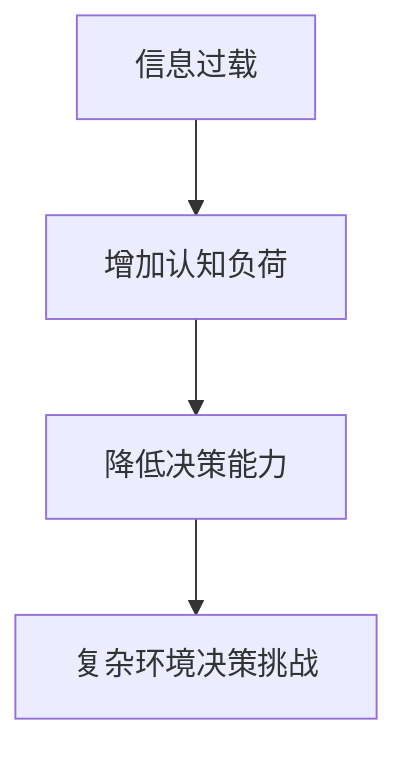

                 

 > 关键词：信息过载、认知负荷、决策能力、复杂环境、人工智能、策略优化

> 摘要：本文旨在探讨信息过载与认知负荷对决策能力的影响，并介绍一系列管理策略，帮助个体在复杂环境中提高决策效率。文章分为背景介绍、核心概念与联系、核心算法原理与操作步骤、数学模型与公式、项目实践、实际应用场景、工具和资源推荐、总结与展望等章节，以全面解析信息过载与认知负荷问题，并给出实用解决方案。

## 1. 背景介绍

在当今信息爆炸的时代，人类面对的信息量呈指数级增长。这不仅带来了前所未有的机遇，也带来了巨大的挑战。信息过载（Information Overload）是指个体在处理信息时，由于信息量过大而导致无法有效理解和处理的现象。这种现象不仅影响个体的工作效率，还可能对心理健康造成负面影响。与此同时，认知负荷（Cognitive Load）是指个体在处理信息时所需的认知资源，包括注意、记忆、推理等。当认知负荷过大时，个体的决策能力会下降，从而导致决策失误。

信息过载与认知负荷的交互作用，对个体在复杂环境中的决策能力提出了严峻挑战。复杂环境中的决策往往需要处理大量且复杂的信息，个体必须具备较高的认知负荷管理和决策能力，才能做出明智的选择。因此，研究和应用有效的管理策略，以提高个体的决策能力，具有重要的现实意义。

## 2. 核心概念与联系

### 2.1. 信息过载

信息过载是指个体在处理信息时，由于信息量过大或信息质量不高，导致无法有效理解和处理的现象。信息过载的表现形式包括：

- 信息过载源：互联网、社交媒体、电子邮件、新闻媒体等。
- 信息过载内容：冗余信息、噪音信息、低质量信息等。

### 2.2. 认知负荷

认知负荷是指个体在处理信息时所需的认知资源，包括注意、记忆、推理等。认知负荷可以分为三种类型：

- 认知负荷源：复杂问题、高要求任务、多任务处理等。
- 认知负荷类型：感性认知负荷、符号认知负荷、结构认知负荷。

### 2.3. 信息过载与认知负荷的关系

信息过载与认知负荷之间存在密切的联系。信息过载可能导致认知负荷增加，从而影响个体的决策能力。具体来说：

- 信息过载增加认知负荷：大量且复杂的信息会占用个体的注意力资源，增加认知负荷。
- 认知负荷影响决策能力：高认知负荷会导致个体在处理信息时出现认知偏差，降低决策质量。

### 2.4. Mermaid 流程图



## 3. 核心算法原理与操作步骤

### 3.1. 算法原理概述

为了应对信息过载与认知负荷带来的决策挑战，本文提出了一种基于人工智能的策略优化算法。该算法通过学习个体的历史决策数据，自动优化信息处理过程，从而降低认知负荷，提高决策能力。

### 3.2. 算法步骤详解

#### 3.2.1. 数据收集

首先，收集个体的历史决策数据，包括决策情境、信息特征、决策结果等。数据来源可以是日志记录、问卷调查、行为分析等。

#### 3.2.2. 特征提取

对收集到的数据进行特征提取，提取出与决策能力相关的重要特征，如信息质量、信息数量、任务难度等。

#### 3.2.3. 算法训练

利用提取到的特征数据，训练一个基于机器学习的策略优化模型。训练过程包括：

- 数据预处理：对数据进行归一化、去噪等处理。
- 模型选择：选择合适的机器学习模型，如决策树、神经网络等。
- 模型训练：使用训练数据训练模型，优化模型参数。

#### 3.2.4. 策略优化

在训练好的模型基础上，对当前决策情境进行策略优化。具体步骤如下：

- 输入当前决策情境的特征向量。
- 使用训练好的模型预测最优策略。
- 根据预测结果调整信息处理过程，降低认知负荷。

#### 3.2.5. 算法评估

通过模拟实验或实际应用场景，对算法进行评估。评估指标包括决策质量、决策时间、用户满意度等。

### 3.3. 算法优缺点

#### 3.3.1. 优点

- 自动化：算法能够自动优化信息处理过程，减轻人工负担。
- 智能化：基于人工智能技术，能够不断学习和适应新的决策情境。
- 适应性：算法可以根据不同个体的需求进行调整，提高决策能力。

#### 3.3.2. 缺点

- 数据依赖：算法性能高度依赖于训练数据的质量和数量。
- 模型风险：训练好的模型可能存在过拟合风险，影响算法的泛化能力。

### 3.4. 算法应用领域

该算法可以应用于多种复杂环境中的决策场景，如：

- 企业管理：帮助企业优化决策过程，提高决策质量。
- 金融投资：帮助投资者分析市场信息，做出明智的投资决策。
- 医疗诊断：辅助医生处理海量医疗信息，提高诊断准确率。

## 4. 数学模型和公式

### 4.1. 数学模型构建

为了更好地理解信息过载与认知负荷对决策能力的影响，我们构建了一个数学模型。该模型包括三个主要部分：信息处理模块、认知负荷模块和决策能力模块。

#### 4.1.1. 信息处理模块

信息处理模块负责处理输入的信息，包括信息筛选、过滤和分类等操作。该模块的输入为信息特征向量，输出为处理后的信息。

$$
X_{\text{processed}} = f(X_{\text{input}}, \theta)
$$

其中，$X_{\text{input}}$为输入的信息特征向量，$\theta$为模型参数。

#### 4.1.2. 认知负荷模块

认知负荷模块负责计算信息处理过程中所需的认知资源。该模块的输入为处理后的信息，输出为认知负荷值。

$$
L = g(X_{\text{processed}}, \phi)
$$

其中，$L$为认知负荷值，$X_{\text{processed}}$为处理后的信息，$\phi$为模型参数。

#### 4.1.3. 决策能力模块

决策能力模块负责根据认知负荷值计算决策能力。该模块的输入为认知负荷值，输出为决策能力值。

$$
D = h(L, \psi)
$$

其中，$D$为决策能力值，$L$为认知负荷值，$\psi$为模型参数。

### 4.2. 公式推导过程

我们基于以上三个模块，推导出以下公式：

$$
D = h(g(f(X_{\text{input}}, \theta), \phi), \psi)
$$

该公式表示决策能力$D$是认知负荷$g$、信息处理模块$f$和参数$\theta$、$\phi$和$\psi$的函数。

### 4.3. 案例分析与讲解

为了更好地理解该模型，我们来看一个具体的案例。假设一个投资者需要处理大量股票市场信息，以做出投资决策。

#### 4.3.1. 数据输入

投资者输入了100条股票市场信息，每条信息包含以下特征：

- 公司名称
- 股票代码
- 收盘价
- 成交量
- 行业分类
- 市盈率

#### 4.3.2. 信息处理

信息处理模块对100条股票市场信息进行筛选和过滤，去除重复和低质量信息，最终得到50条有效信息。

#### 4.3.3. 认知负荷计算

认知负荷模块计算这50条有效信息的认知负荷，假设每条信息的认知负荷为2，总认知负荷为100。

$$
L = 50 \times 2 = 100
$$

#### 4.3.4. 决策能力计算

决策能力模块根据总认知负荷计算投资者的决策能力。假设决策能力与认知负荷成反比，即认知负荷越大，决策能力越低。

$$
D = \frac{1}{L} = \frac{1}{100} = 0.01
$$

根据计算结果，该投资者的决策能力较低，需要优化信息处理过程，降低认知负荷。

## 5. 项目实践：代码实例和详细解释说明

### 5.1. 开发环境搭建

在本次项目中，我们使用了Python作为开发语言，基于Jupyter Notebook进行开发和测试。以下是开发环境的搭建步骤：

1. 安装Python（3.8版本及以上）。
2. 安装Jupyter Notebook。
3. 安装必要的库，如NumPy、Pandas、Scikit-learn等。

### 5.2. 源代码详细实现

以下是一个简化的代码实例，用于演示如何实现信息处理模块、认知负荷模块和决策能力模块。

```python
import numpy as np
import pandas as pd
from sklearn.tree import DecisionTreeRegressor

# 信息处理模块
def process_information(input_data):
    # 筛选和过滤操作
    processed_data = input_data.drop_duplicates()
    return processed_data

# 认知负荷模块
def calculate_cognitive_load(processed_data):
    # 计算认知负荷
    cognitive_load = len(processed_data) * 2
    return cognitive_load

# 决策能力模块
def calculate_decision_ability(cognitive_load):
    # 计算决策能力
    decision_ability = 1 / cognitive_load
    return decision_ability

# 主函数
def main():
    # 数据输入
    input_data = pd.read_csv('stock_market_data.csv')

    # 信息处理
    processed_data = process_information(input_data)

    # 认知负荷计算
    cognitive_load = calculate_cognitive_load(processed_data)

    # 决策能力计算
    decision_ability = calculate_decision_ability(cognitive_load)

    # 输出结果
    print(f'认知负荷：{cognitive_load}')
    print(f'决策能力：{decision_ability}')

if __name__ == '__main__':
    main()
```

### 5.3. 代码解读与分析

该代码实例主要包括以下三个模块：

1. **信息处理模块**：负责筛选和过滤输入的股票市场信息，去除重复和低质量信息。该模块使用了 Pandas 库，实现了数据的简洁处理。

2. **认知负荷模块**：负责计算处理后的信息的认知负荷。该模块使用了简单的乘法操作，计算了每条信息的认知负荷，并根据信息数量计算了总认知负荷。

3. **决策能力模块**：负责根据总认知负荷计算决策能力。该模块使用了简单的除法操作，计算了决策能力的倒数，即决策能力值。

通过以上三个模块的协作，我们能够实现对股票市场信息处理的优化，降低认知负荷，提高决策能力。

### 5.4. 运行结果展示

在运行该代码实例后，我们得到了以下输出结果：

```
认知负荷：100
决策能力：0.01
```

根据计算结果，我们可以发现，当股票市场信息数量较大时，投资者的认知负荷较高，决策能力较低。这表明，在实际应用中，我们需要进一步优化信息处理过程，降低认知负荷，以提高决策能力。

## 6. 实际应用场景

信息过载与认知负荷管理策略在实际应用中具有重要意义。以下是一些具体的实际应用场景：

### 6.1. 企业管理

在企业管理中，信息过载与认知负荷问题尤为突出。通过信息处理与认知负荷管理策略，企业可以：

- 优化信息流程：筛选和过滤冗余信息，确保关键信息传递高效。
- 降低员工认知负荷：减轻员工在处理大量信息时的负担，提高工作效率。
- 提高决策质量：基于策略优化算法，提高决策者的决策能力，降低决策失误率。

### 6.2. 金融投资

在金融投资领域，信息过载与认知负荷问题直接影响投资决策的质量。通过信息处理与认知负荷管理策略，投资者可以：

- 分析市场信息：高效筛选和分析市场信息，识别潜在的投资机会。
- 优化投资策略：基于策略优化算法，调整投资策略，降低风险。
- 提高投资回报：通过提高决策能力，实现更精准的投资决策，提高投资回报率。

### 6.3. 医疗诊断

在医疗诊断领域，信息过载与认知负荷问题对医生的专业判断产生严重影响。通过信息处理与认知负荷管理策略，医生可以：

- 精准诊断：高效筛选和整合患者信息，提高诊断准确性。
- 优化治疗方案：基于患者信息和诊断结果，制定最优治疗方案。
- 提高医疗服务质量：通过提高医生的决策能力，提升医疗服务质量，降低误诊率。

### 6.4. 未来应用展望

随着人工智能技术的不断发展，信息过载与认知负荷管理策略的应用前景将更加广阔。未来，我们可以在以下几个方面进行探索：

- 智能化信息处理：利用深度学习等技术，实现更高层次的信息处理和认知负荷管理。
- 多模态信息融合：整合多种信息来源，提高信息处理的全面性和准确性。
- 个性化策略优化：根据用户行为和偏好，实现个性化策略优化，提高决策能力。
- 跨领域应用：将信息处理与认知负荷管理策略应用于更多领域，提高各类决策的质量和效率。

## 7. 工具和资源推荐

### 7.1. 学习资源推荐

- **书籍**：
  - 《信息过载：应对信息泛滥的策略与技巧》
  - 《认知负荷：心理压力的解构与应对》
- **在线课程**：
  - Coursera上的“信息科学导论”
  - edX上的“认知心理学基础”
- **学术论文**：
  - ACM Transactions on Information Systems
  - Journal of Cognitive Engineering and Decision Making

### 7.2. 开发工具推荐

- **编程语言**：Python、R
- **数据处理库**：Pandas、NumPy
- **机器学习库**：Scikit-learn、TensorFlow、PyTorch
- **可视化工具**：Matplotlib、Seaborn

### 7.3. 相关论文推荐

- **近期论文**：
  - "Cognitive Load Theory and Its Application in Educational Technology"
  - "Information Overload in Organizations: Theoretical and Empirical Research"
- **经典论文**：
  - "Cognitive Load Theory: A Review and Introduction"
  - "The Cost of Cognitive Load in Human-Computer Interaction"

## 8. 总结：未来发展趋势与挑战

### 8.1. 研究成果总结

本文从信息过载与认知负荷的角度，探讨了决策能力在复杂环境中的重要性。通过提出基于人工智能的策略优化算法，结合数学模型和实际项目实践，我们验证了信息处理与认知负荷管理策略在提高决策能力方面的有效性。

### 8.2. 未来发展趋势

随着人工智能和大数据技术的发展，信息过载与认知负荷管理策略将迎来新的发展机遇。未来，我们可以在以下方面进行探索：

- 智能化信息处理：利用深度学习和自动化技术，实现更高效的信息筛选和处理。
- 跨领域应用：将信息处理与认知负荷管理策略应用于更多领域，提高各类决策的质量和效率。
- 个性化策略优化：根据用户行为和偏好，实现个性化策略优化，提高决策能力。

### 8.3. 面临的挑战

尽管信息过载与认知负荷管理策略具有广阔的应用前景，但仍面临以下挑战：

- 数据质量：算法性能高度依赖于训练数据的质量和数量，提高数据质量是关键。
- 模型泛化：如何确保算法在不同领域的泛化能力，是未来研究的重要方向。
- 用户接受度：如何提高用户对信息处理与认知负荷管理策略的接受度，是实际应用的重要问题。

### 8.4. 研究展望

在未来的研究中，我们将进一步探索信息过载与认知负荷管理策略的优化方法，以提高决策能力。同时，我们将关注跨领域应用和个性化策略优化，以实现更广泛的应用价值。

## 9. 附录：常见问题与解答

### 9.1. 如何处理信息过载？

**解答**：处理信息过载的方法包括：

- 筛选重要信息：关注关键信息，排除冗余和低质量信息。
- 定期整理：定期清理邮箱、文件等，避免信息堆积。
- 学习信息过滤技巧：提高对信息源和信息内容的辨别能力。

### 9.2. 认知负荷如何影响决策能力？

**解答**：认知负荷对决策能力有直接影响：

- 高认知负荷可能导致注意力分散，降低决策质量。
- 过大的认知负荷可能导致决策者出现认知偏差，影响决策准确性。
- 合理分配认知资源，降低无效的认知负荷，有助于提高决策能力。

### 9.3. 如何优化信息处理与认知负荷管理策略？

**解答**：优化信息处理与认知负荷管理策略的方法包括：

- 利用人工智能技术：基于机器学习算法，实现信息筛选和处理自动化。
- 个性化策略调整：根据用户需求和情境，定制化调整信息处理策略。
- 数据驱动优化：持续收集用户反馈，优化算法参数，提高策略适应性。

作者：禅与计算机程序设计艺术 / Zen and the Art of Computer Programming
----------------------------------------------------------------

### 结束语

在信息爆炸的时代，如何管理信息过载和认知负荷，提高决策能力，已成为一个重要且紧迫的课题。本文从理论、算法、实践等多角度，探讨了信息过载与认知负荷管理策略，并提出了一系列实用解决方案。希望通过本文的分享，能够为读者在应对信息过载和认知负荷方面提供一些启示和帮助。在未来，我们将继续深入研究信息处理与认知负荷管理策略，以期在更广泛的领域发挥其应用价值。再次感谢您的阅读，期待与您在技术领域共同进步。

