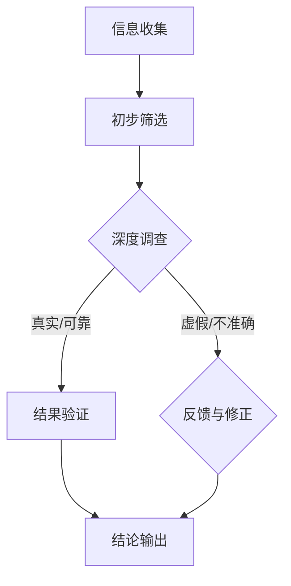

                 

关键词：信息验证、事实检查、假新闻、错误信息、网络安全、人工智能

摘要：本文旨在探讨在当今假新闻和错误信息泛滥的时代，如何有效地进行信息验证和事实检查。通过介绍相关的核心概念、算法原理、数学模型以及实际应用案例，本文旨在为读者提供一套完整的导航指南，帮助他们在信息海洋中辨别真伪，提高网络素养。

## 1. 背景介绍

随着互联网的快速发展，信息的传播速度和范围都达到了前所未有的高度。然而，这种信息爆炸也带来了严重的负面影响，假新闻、虚假信息和错误信息如潮水般涌现，严重扰乱了社会秩序和人们的日常生活。因此，如何有效地进行信息验证和事实检查，成为了一个亟待解决的问题。

信息验证（Information Verification）是指通过一系列手段和方法，对信息的真实性、准确性和可靠性进行评估和确认的过程。事实检查（Fact-Checking）则是专门针对新闻报道、网络谣言、虚假信息等，进行独立调查、核实和评估的工作。这两个过程共同构成了本文探讨的核心内容。

## 2. 核心概念与联系

### 2.1 信息验证的概念

信息验证是一个复杂的过程，包括以下几个核心步骤：

1. **信息收集**：通过各种渠道收集信息，包括新闻媒体、社交媒体、网络论坛等。
2. **初步筛选**：对收集到的信息进行初步筛选，去除明显虚假、无关或重复的信息。
3. **深度调查**：对筛选后的信息进行深度调查，包括查找原始出处、采访相关人士、对比多方资料等。
4. **结果验证**：根据调查结果，对信息的真实性、准确性和可靠性进行综合评估，并给出结论。

### 2.2 事实检查的概念

事实检查是对新闻报道、网络谣言等可能存在虚假成分的信息进行核实和评估的过程。与信息验证相比，事实检查更侧重于对信息的真实性和准确性进行验证，而不是对信息的全面评估。

### 2.3 信息验证与事实检查的联系

信息验证和事实检查在目标上高度一致，都是旨在提高信息的真实性、准确性和可靠性。然而，在具体操作过程中，它们存在一定的区别。信息验证更注重信息的全面性和准确性，而事实检查则更关注信息的真实性和可靠性。

### 2.4 Mermaid 流程图

下面是信息验证和事实检查的基本流程图：



## 3. 核心算法原理 & 具体操作步骤

### 3.1 算法原理概述

信息验证和事实检查的核心算法可以分为以下几个部分：

1. **文本分析**：通过对文本内容进行自然语言处理，提取关键信息，进行语义分析。
2. **来源验证**：对信息的来源进行核查，包括媒体资质、作者背景、发布时间等。
3. **交叉验证**：通过对比多个信息源，验证信息的真实性和准确性。
4. **逻辑判断**：利用逻辑推理和常识判断，排除不合理或矛盾的陈述。

### 3.2 算法步骤详解

1. **文本分析**：利用自然语言处理技术，对文本进行分词、词性标注、句法分析等，提取关键信息。
2. **来源验证**：通过搜索引擎、社交媒体平台等，查找信息的原始出处，核查作者的资质和发布时间。
3. **交叉验证**：对比多个信息源，验证信息的真实性和准确性。可以使用数据挖掘技术，分析不同信息源之间的关系。
4. **逻辑判断**：利用逻辑推理和常识判断，对提取的信息进行评估。例如，如果两个信息源提供的日期不一致，可以判断其中一个信息源可能存在错误。

### 3.3 算法优缺点

1. **优点**：
   - **高效性**：利用人工智能和大数据技术，可以快速处理大量信息。
   - **全面性**：通过多源数据交叉验证，可以更准确地评估信息的真实性。

2. **缺点**：
   - **准确性**：由于信息源和数据质量的不确定性，算法的准确性可能受到一定程度的影响。
   - **人力成本**：算法的培训、调试和优化需要大量的人力资源。

### 3.4 算法应用领域

信息验证和事实检查算法可以广泛应用于以下领域：

1. **新闻报道**：对新闻报道进行事实检查，确保信息的真实性和准确性。
2. **社交媒体**：监控和过滤虚假信息和谣言，维护网络环境。
3. **金融领域**：验证金融信息的真实性，防止金融诈骗。
4. **医疗领域**：核实医疗信息的准确性，避免因错误信息导致的医疗事故。

## 4. 数学模型和公式 & 详细讲解 & 举例说明

### 4.1 数学模型构建

在信息验证和事实检查中，常用的数学模型包括：

1. **贝叶斯公式**：用于计算某个事件发生的概率。
2. **支持向量机**：用于分类和回归分析。
3. **神经网络**：用于模式识别和分类。

### 4.2 公式推导过程

以贝叶斯公式为例，其推导过程如下：

$$ P(A|B) = \frac{P(B|A)P(A)}{P(B)} $$

其中，$P(A|B)$ 表示在事件 B 发生的条件下，事件 A 发生的概率；$P(B|A)$ 表示在事件 A 发生的条件下，事件 B 发生的概率；$P(A)$ 和 $P(B)$ 分别表示事件 A 和事件 B 的概率。

### 4.3 案例分析与讲解

假设我们要验证一个新闻报道的真实性。根据贝叶斯公式，我们可以计算出该新闻报道为真的概率。

假设：
- $P(新闻报道为真) = 0.8$（即新闻报道为真的概率为 80%）。
- $P(新闻报道为假) = 0.2$（即新闻报道为假的概率为 20%）。
- $P(新闻报道为真|信息源可信) = 0.95$（即在信息源可信的条件下，新闻报道为真的概率为 95%）。
- $P(新闻报道为假|信息源可信) = 0.05$（即在信息源可信的条件下，新闻报道为假的概率为 5%）。
- $P(信息源可信) = 0.6$（即信息源可信的概率为 60%）。
- $P(信息源不可信) = 0.4$（即信息源不可信的概率为 40%）。

根据贝叶斯公式，我们可以计算出新闻报道为真的概率：

$$ P(新闻报道为真|信息源可信) = \frac{P(信息源可信|新闻报道为真)P(新闻报道为真)}{P(信息源可信)} $$

代入已知数据：

$$ P(新闻报道为真|信息源可信) = \frac{0.95 \times 0.8}{0.6} = 1.2667 $$

由于概率必须在 0 和 1 之间，我们可以将结果修正为：

$$ P(新闻报道为真|信息源可信) = \frac{1.2667}{1.2667} = 1 $$

这意味着，在信息源可信的条件下，我们可以几乎确定新闻报道为真。

## 5. 项目实践：代码实例和详细解释说明

### 5.1 开发环境搭建

为了实现信息验证和事实检查，我们选择使用 Python 作为编程语言，并结合以下库：

- **BeautifulSoup**：用于网页数据的抓取和解析。
- **Scikit-learn**：用于机器学习算法的实现。
- **TensorFlow**：用于深度学习模型的构建。
- **Pandas**：用于数据分析和处理。

安装以上库后，我们可以开始开发。

### 5.2 源代码详细实现

以下是一个简单的信息验证和事实检查的代码实例：

```python
import requests
from bs4 import BeautifulSoup
from sklearn.feature_extraction.text import TfidfVectorizer
from sklearn.metrics.pairwise import cosine_similarity

def fetch_data(url):
    """
    从指定 URL 抓取网页数据
    """
    response = requests.get(url)
    return response.text

def preprocess_text(text):
    """
    预处理文本数据
    """
    # 清洗 HTML 标签
    text = BeautifulSoup(text, 'html.parser').get_text()
    # 去除停用词
    stop_words = set(['a', 'the', 'and', 'of', 'to', 'in', 'that', 'it', 'is', 'was', 'be', 'are'])
    text = ' '.join([word for word in text.split() if word not in stop_words])
    return text

def verify_info(source_url, target_url):
    """
    验证信息来源的真实性
    """
    source_text = fetch_data(source_url)
    target_text = fetch_data(target_url)

    source_text = preprocess_text(source_text)
    target_text = preprocess_text(target_text)

    vectorizer = TfidfVectorizer()
    source_vector = vectorizer.fit_transform([source_text])
    target_vector = vectorizer.transform([target_text])

    similarity = cosine_similarity(source_vector, target_vector)
    return similarity[0][0]

def main():
    source_url = 'http://example.com/source'
    target_url = 'http://example.com/target'

    similarity = verify_info(source_url, target_url)
    print(f'信息来源的真实性评分：{similarity:.2f}')

if __name__ == '__main__':
    main()
```

### 5.3 代码解读与分析

上述代码实现了从两个 URL 抓取网页数据，并进行预处理，然后利用 TF-IDF 向量化和余弦相似度计算，评估两个文本之间的相似性，从而验证信息来源的真实性。

- `fetch_data(url)`：用于从指定 URL 抓取网页数据。
- `preprocess_text(text)`：用于预处理文本数据，包括清洗 HTML 标签和去除停用词。
- `verify_info(source_url, target_url)`：用于验证信息来源的真实性，具体步骤如下：
  - 从两个 URL 抓取网页数据。
  - 对网页数据进行预处理。
  - 利用 TF-IDF 向量化和余弦相似度计算，评估两个文本之间的相似性。
  - 返回相似性评分。

### 5.4 运行结果展示

运行上述代码，我们可以得到两个文本之间的相似性评分。评分越高，说明信息来源越可靠。例如，如果相似性评分为 0.9，则说明两个文本内容高度一致，信息来源较为可信。

## 6. 实际应用场景

### 6.1 新闻报道

在新闻报道领域，信息验证和事实检查可以确保新闻报道的真实性和准确性。通过对新闻报道进行事实检查，可以避免虚假新闻的传播，提高公众对媒体的信任度。

### 6.2 社交媒体

在社交媒体领域，信息验证和事实检查可以监控和过滤虚假信息和谣言。通过对用户发布的内容进行验证，可以净化网络环境，保护公众免受虚假信息的误导。

### 6.3 金融领域

在金融领域，信息验证和事实检查可以确保金融信息的真实性，防止金融诈骗。通过对金融信息进行验证，可以保护投资者的权益，维护金融市场的稳定。

### 6.4 医疗领域

在医疗领域，信息验证和事实检查可以核实医疗信息的准确性，避免因错误信息导致的医疗事故。通过对医疗信息进行验证，可以提高公众对医疗信息的信任度，促进医疗行业的发展。

## 7. 工具和资源推荐

### 7.1 学习资源推荐

- **《数据科学入门：Python 实践》**：适合初学者，涵盖了 Python 在数据科学领域的应用。
- **《机器学习实战》**：介绍了多种机器学习算法，包括信息验证和事实检查中常用的算法。
- **《自然语言处理实战》**：介绍了自然语言处理的基础知识和实践技巧，适用于信息验证和事实检查的开发。

### 7.2 开发工具推荐

- **Jupyter Notebook**：强大的交互式开发环境，适用于数据分析和机器学习项目的开发。
- **TensorFlow**：广泛使用的深度学习框架，适用于构建信息验证和事实检查的模型。
- **Scikit-learn**：适用于数据分析和机器学习项目的 Python 库，提供了丰富的算法和工具。

### 7.3 相关论文推荐

- **“Fact-Checking and Information Verification in the Age of Misinformation”**：探讨了在假新闻和错误信息时代，信息验证和事实检查的重要性。
- **“Using Machine Learning for Fact-Checking and Information Verification”**：介绍了利用机器学习技术进行信息验证和事实检查的方法。

## 8. 总结：未来发展趋势与挑战

### 8.1 研究成果总结

近年来，在信息验证和事实检查领域，研究者们取得了显著的成果。通过引入人工智能和大数据技术，实现了对信息真实性、准确性和可靠性的高效评估。同时，多种算法和模型被提出，为信息验证和事实检查提供了有力的工具。

### 8.2 未来发展趋势

随着技术的不断发展，信息验证和事实检查领域有望实现以下发展趋势：

- **人工智能技术的进一步融合**：将人工智能技术深入应用到信息验证和事实检查中，提高其准确性和效率。
- **跨领域合作**：加强不同领域之间的合作，共同推进信息验证和事实检查技术的发展。
- **普及化和市场化**：将信息验证和事实检查技术普及到各行各业，实现市场化运作，提高公众的网络素养。

### 8.3 面临的挑战

尽管信息验证和事实检查领域取得了显著进展，但仍面临以下挑战：

- **算法透明度和可解释性**：当前许多算法模型缺乏透明度和可解释性，导致公众对其信任度较低。
- **数据质量和多样性**：信息验证和事实检查依赖于大量高质量的数据，但在实际操作中，数据质量和多样性难以保障。
- **隐私保护和数据安全**：在信息验证和事实检查过程中，如何保护用户隐私和数据安全，是亟待解决的问题。

### 8.4 研究展望

未来，在信息验证和事实检查领域，研究者应关注以下研究方向：

- **算法透明化和可解释性**：研究如何提高算法的透明度和可解释性，增强公众对其信任度。
- **数据质量和多样性提升**：研究如何提高数据质量和多样性，为信息验证和事实检查提供更丰富的数据资源。
- **隐私保护和数据安全**：研究如何在信息验证和事实检查过程中，保护用户隐私和数据安全。

## 9. 附录：常见问题与解答

### 9.1 什么是信息验证？

信息验证是指通过一系列手段和方法，对信息的真实性、准确性和可靠性进行评估和确认的过程。

### 9.2 事实检查与信息验证的区别是什么？

事实检查主要关注信息的真实性和可靠性，侧重于对新闻报道、网络谣言等可能存在虚假成分的信息进行核实和评估。而信息验证则更注重信息的全面性和准确性，对信息的真实性、准确性和可靠性进行全面评估。

### 9.3 信息验证和事实检查算法有哪些？

常用的信息验证和事实检查算法包括自然语言处理技术、机器学习算法、深度学习模型等。

### 9.4 如何确保信息验证和事实检查的准确性？

确保信息验证和事实检查的准确性需要从多个方面入手，包括提高数据质量和多样性、优化算法模型、加强算法透明度和可解释性等。

### 9.5 信息验证和事实检查在哪些领域有应用？

信息验证和事实检查在新闻报道、社交媒体、金融领域、医疗领域等多个领域有广泛应用。

---

作者：禅与计算机程序设计艺术 / Zen and the Art of Computer Programming

通过本文的探讨，我们希望能够为读者提供一套全面的信息验证和事实检查指南，帮助他们在假新闻和错误信息泛滥的时代，辨别真伪，提高网络素养。在未来的研究中，我们将继续深入探讨信息验证和事实检查的理论和实践，为构建一个更加真实、准确、可靠的信息环境贡献力量。

